# Dependency graph

> Generated by `eng/generate-package-index.cs` from `ProjectReference`s between packable projects.
> Do not edit by hand: run `dotnet run eng/generate-package-index.cs`. CI fails when this file is out of date.

An arrow `A --> B` means A references B. Tiers are listed in [packages.md](packages.md).

## Between folders

Each arrow is labelled with the number of package references it stands for.

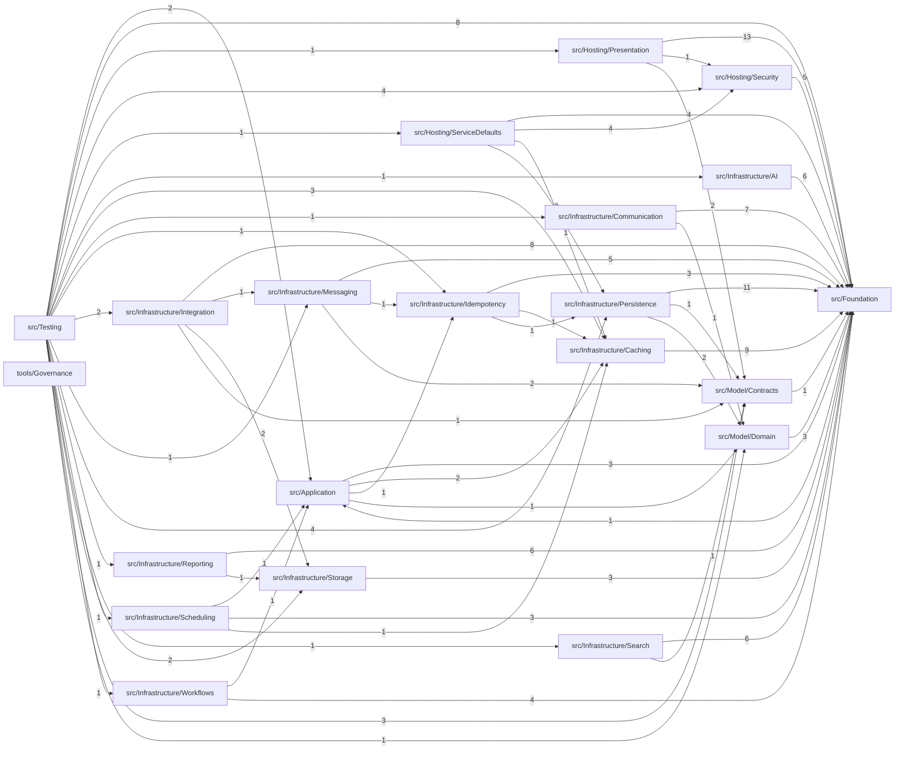
```mermaid
flowchart LR
  src_Application["src/Application"]
  src_Foundation["src/Foundation"]
  src_Hosting_Presentation["src/Hosting/Presentation"]
  src_Hosting_Security["src/Hosting/Security"]
  src_Hosting_ServiceDefaults["src/Hosting/ServiceDefaults"]
  src_Infrastructure_AI["src/Infrastructure/AI"]
  src_Infrastructure_Caching["src/Infrastructure/Caching"]
  src_Infrastructure_Communication["src/Infrastructure/Communication"]
  src_Infrastructure_Idempotency["src/Infrastructure/Idempotency"]
  src_Infrastructure_Integration["src/Infrastructure/Integration"]
  src_Infrastructure_Messaging["src/Infrastructure/Messaging"]
  src_Infrastructure_Persistence["src/Infrastructure/Persistence"]
  src_Infrastructure_Reporting["src/Infrastructure/Reporting"]
  src_Infrastructure_Scheduling["src/Infrastructure/Scheduling"]
  src_Infrastructure_Search["src/Infrastructure/Search"]
  src_Infrastructure_Storage["src/Infrastructure/Storage"]
  src_Infrastructure_Workflows["src/Infrastructure/Workflows"]
  src_Model_Contracts["src/Model/Contracts"]
  src_Model_Domain["src/Model/Domain"]
  src_Testing["src/Testing"]
  tools_Governance["tools/Governance"]
  src_Application -->|3| src_Foundation
  src_Application -->|2| src_Infrastructure_Caching
  src_Application -->|1| src_Infrastructure_Idempotency
  src_Application -->|1| src_Model_Domain
  src_Foundation -->|1| src_Application
  src_Hosting_Presentation -->|13| src_Foundation
  src_Hosting_Presentation -->|1| src_Hosting_Security
  src_Hosting_Presentation -->|2| src_Model_Contracts
  src_Hosting_Security -->|5| src_Foundation
  src_Hosting_ServiceDefaults -->|4| src_Foundation
  src_Hosting_ServiceDefaults -->|4| src_Hosting_Security
  src_Hosting_ServiceDefaults -->|1| src_Infrastructure_Caching
  src_Hosting_ServiceDefaults -->|3| src_Infrastructure_Persistence
  src_Infrastructure_AI -->|6| src_Foundation
  src_Infrastructure_Caching -->|9| src_Foundation
  src_Infrastructure_Communication -->|7| src_Foundation
  src_Infrastructure_Communication -->|1| src_Model_Domain
  src_Infrastructure_Idempotency -->|3| src_Foundation
  src_Infrastructure_Idempotency -->|1| src_Infrastructure_Caching
  src_Infrastructure_Idempotency -->|1| src_Infrastructure_Persistence
  src_Infrastructure_Integration -->|8| src_Foundation
  src_Infrastructure_Integration -->|1| src_Infrastructure_Messaging
  src_Infrastructure_Integration -->|2| src_Infrastructure_Storage
  src_Infrastructure_Integration -->|1| src_Model_Contracts
  src_Infrastructure_Messaging -->|5| src_Foundation
  src_Infrastructure_Messaging -->|1| src_Infrastructure_Idempotency
  src_Infrastructure_Messaging -->|2| src_Model_Contracts
  src_Infrastructure_Persistence -->|11| src_Foundation
  src_Infrastructure_Persistence -->|1| src_Model_Contracts
  src_Infrastructure_Persistence -->|2| src_Model_Domain
  src_Infrastructure_Reporting -->|6| src_Foundation
  src_Infrastructure_Reporting -->|1| src_Infrastructure_Storage
  src_Infrastructure_Scheduling -->|1| src_Application
  src_Infrastructure_Scheduling -->|3| src_Foundation
  src_Infrastructure_Scheduling -->|1| src_Infrastructure_Caching
  src_Infrastructure_Search -->|6| src_Foundation
  src_Infrastructure_Search -->|1| src_Model_Contracts
  src_Infrastructure_Storage -->|3| src_Foundation
  src_Infrastructure_Workflows -->|1| src_Application
  src_Infrastructure_Workflows -->|4| src_Foundation
  src_Model_Contracts -->|1| src_Foundation
  src_Model_Domain -->|3| src_Foundation
  src_Testing -->|2| src_Application
  src_Testing -->|8| src_Foundation
  src_Testing -->|1| src_Hosting_Presentation
  src_Testing -->|4| src_Hosting_Security
  src_Testing -->|1| src_Hosting_ServiceDefaults
  src_Testing -->|1| src_Infrastructure_AI
  src_Testing -->|3| src_Infrastructure_Caching
  src_Testing -->|1| src_Infrastructure_Communication
  src_Testing -->|1| src_Infrastructure_Idempotency
  src_Testing -->|2| src_Infrastructure_Integration
  src_Testing -->|1| src_Infrastructure_Messaging
  src_Testing -->|4| src_Infrastructure_Persistence
  src_Testing -->|1| src_Infrastructure_Reporting
  src_Testing -->|1| src_Infrastructure_Scheduling
  src_Testing -->|1| src_Infrastructure_Search
  src_Testing -->|2| src_Infrastructure_Storage
  src_Testing -->|1| src_Infrastructure_Workflows
  src_Testing -->|3| src_Model_Contracts
  src_Testing -->|1| src_Model_Domain
```

## src/Application

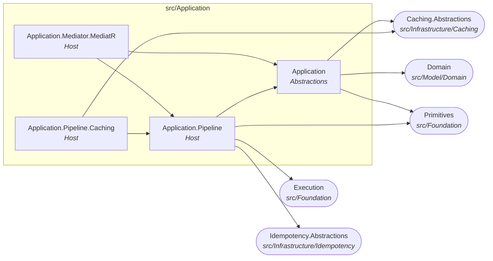
```mermaid
flowchart LR
  subgraph folder_src_Application["src/Application"]
    SharedKernel_Application["Application<br/><i>Abstractions</i>"]
    SharedKernel_Application_Mediator_MediatR["Application.Mediator.MediatR<br/><i>Host</i>"]
    SharedKernel_Application_Pipeline["Application.Pipeline<br/><i>Host</i>"]
    SharedKernel_Application_Pipeline_Caching["Application.Pipeline.Caching<br/><i>Host</i>"]
  end
  SharedKernel_Caching_Abstractions(["Caching.Abstractions<br/><i>src/Infrastructure/Caching</i>"])
  SharedKernel_Domain(["Domain<br/><i>src/Model/Domain</i>"])
  SharedKernel_Execution(["Execution<br/><i>src/Foundation</i>"])
  SharedKernel_Idempotency_Abstractions(["Idempotency.Abstractions<br/><i>src/Infrastructure/Idempotency</i>"])
  SharedKernel_Primitives(["Primitives<br/><i>src/Foundation</i>"])
  SharedKernel_Application --> SharedKernel_Caching_Abstractions
  SharedKernel_Application --> SharedKernel_Domain
  SharedKernel_Application --> SharedKernel_Primitives
  SharedKernel_Application_Mediator_MediatR --> SharedKernel_Application
  SharedKernel_Application_Mediator_MediatR --> SharedKernel_Application_Pipeline
  SharedKernel_Application_Pipeline --> SharedKernel_Application
  SharedKernel_Application_Pipeline --> SharedKernel_Execution
  SharedKernel_Application_Pipeline --> SharedKernel_Idempotency_Abstractions
  SharedKernel_Application_Pipeline --> SharedKernel_Primitives
  SharedKernel_Application_Pipeline_Caching --> SharedKernel_Application_Pipeline
  SharedKernel_Application_Pipeline_Caching --> SharedKernel_Caching_Abstractions
```

## src/Foundation

```mermaid
flowchart LR
  subgraph folder_src_Foundation["src/Foundation"]
    SharedKernel_Compression["Compression<br/><i>Foundation</i>"]
    SharedKernel_Configuration["Configuration<br/><i>Foundation</i>"]
    SharedKernel_Core["Core<br/><i>Foundation</i>"]
    SharedKernel_Cryptography["Cryptography<br/><i>Foundation</i>"]
    SharedKernel_Cryptography_Argon2["Cryptography.Argon2<br/><i>Adapter</i>"]
    SharedKernel_Cryptography_KeyVault_Azure["Cryptography.KeyVault.Azure<br/><i>Adapter</i>"]
    SharedKernel_DataPrivacy["DataPrivacy<br/><i>Foundation</i>"]
    SharedKernel_Execution["Execution<br/><i>Foundation</i>"]
    SharedKernel_FeatureManagement["FeatureManagement<br/><i>Foundation</i>"]
    SharedKernel_Localization["Localization<br/><i>Foundation</i>"]
    SharedKernel_Primitives["Primitives<br/><i>Foundation</i>"]
    SharedKernel_Validation["Validation<br/><i>Foundation</i>"]
    SharedKernel_Validation_FluentValidation["Validation.FluentValidation<br/><i>Adapter</i>"]
  end
  SharedKernel_Application(["Application<br/><i>src/Application</i>"])
  SharedKernel_Compression --> SharedKernel_Configuration
  SharedKernel_Compression --> SharedKernel_Primitives
  SharedKernel_Core --> SharedKernel_Primitives
  SharedKernel_Cryptography --> SharedKernel_Configuration
  SharedKernel_Cryptography --> SharedKernel_Primitives
  SharedKernel_Cryptography_Argon2 --> SharedKernel_Configuration
  SharedKernel_Cryptography_Argon2 --> SharedKernel_Cryptography
  SharedKernel_Cryptography_KeyVault_Azure --> SharedKernel_Configuration
  SharedKernel_Cryptography_KeyVault_Azure --> SharedKernel_Cryptography
  SharedKernel_DataPrivacy --> SharedKernel_Primitives
  SharedKernel_Execution --> SharedKernel_Primitives
  SharedKernel_FeatureManagement --> SharedKernel_Execution
  SharedKernel_FeatureManagement --> SharedKernel_Primitives
  SharedKernel_Localization --> SharedKernel_Primitives
  SharedKernel_Validation --> SharedKernel_Core
  SharedKernel_Validation --> SharedKernel_Localization
  SharedKernel_Validation --> SharedKernel_Primitives
  SharedKernel_Validation_FluentValidation --> SharedKernel_Application
  SharedKernel_Validation_FluentValidation --> SharedKernel_Validation
```

## src/Hosting/Presentation

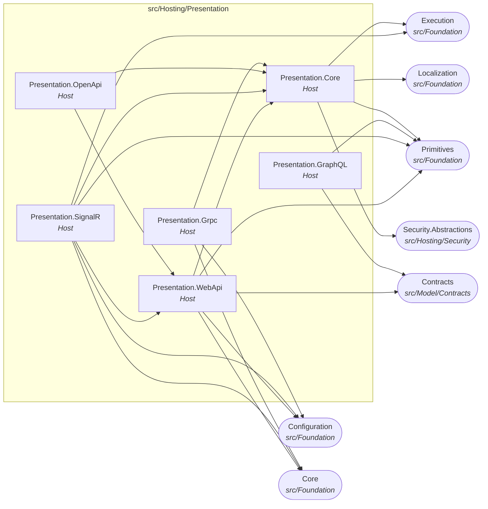
```mermaid
flowchart LR
  subgraph folder_src_Hosting_Presentation["src/Hosting/Presentation"]
    SharedKernel_Presentation_Core["Presentation.Core<br/><i>Host</i>"]
    SharedKernel_Presentation_GraphQL["Presentation.GraphQL<br/><i>Host</i>"]
    SharedKernel_Presentation_Grpc["Presentation.Grpc<br/><i>Host</i>"]
    SharedKernel_Presentation_OpenApi["Presentation.OpenApi<br/><i>Host</i>"]
    SharedKernel_Presentation_SignalR["Presentation.SignalR<br/><i>Host</i>"]
    SharedKernel_Presentation_WebApi["Presentation.WebApi<br/><i>Host</i>"]
  end
  SharedKernel_Configuration(["Configuration<br/><i>src/Foundation</i>"])
  SharedKernel_Contracts(["Contracts<br/><i>src/Model/Contracts</i>"])
  SharedKernel_Core(["Core<br/><i>src/Foundation</i>"])
  SharedKernel_Execution(["Execution<br/><i>src/Foundation</i>"])
  SharedKernel_Localization(["Localization<br/><i>src/Foundation</i>"])
  SharedKernel_Primitives(["Primitives<br/><i>src/Foundation</i>"])
  SharedKernel_Security_Abstractions(["Security.Abstractions<br/><i>src/Hosting/Security</i>"])
  SharedKernel_Presentation_Core --> SharedKernel_Execution
  SharedKernel_Presentation_Core --> SharedKernel_Localization
  SharedKernel_Presentation_Core --> SharedKernel_Primitives
  SharedKernel_Presentation_Core --> SharedKernel_Security_Abstractions
  SharedKernel_Presentation_GraphQL --> SharedKernel_Contracts
  SharedKernel_Presentation_GraphQL --> SharedKernel_Primitives
  SharedKernel_Presentation_Grpc --> SharedKernel_Configuration
  SharedKernel_Presentation_Grpc --> SharedKernel_Core
  SharedKernel_Presentation_Grpc --> SharedKernel_Presentation_Core
  SharedKernel_Presentation_OpenApi --> SharedKernel_Presentation_Core
  SharedKernel_Presentation_OpenApi --> SharedKernel_Presentation_WebApi
  SharedKernel_Presentation_SignalR --> SharedKernel_Configuration
  SharedKernel_Presentation_SignalR --> SharedKernel_Core
  SharedKernel_Presentation_SignalR --> SharedKernel_Execution
  SharedKernel_Presentation_SignalR --> SharedKernel_Presentation_Core
  SharedKernel_Presentation_SignalR --> SharedKernel_Presentation_WebApi
  SharedKernel_Presentation_SignalR --> SharedKernel_Primitives
  SharedKernel_Presentation_WebApi --> SharedKernel_Configuration
  SharedKernel_Presentation_WebApi --> SharedKernel_Contracts
  SharedKernel_Presentation_WebApi --> SharedKernel_Core
  SharedKernel_Presentation_WebApi --> SharedKernel_Presentation_Core
  SharedKernel_Presentation_WebApi --> SharedKernel_Primitives
```

## src/Hosting/Security

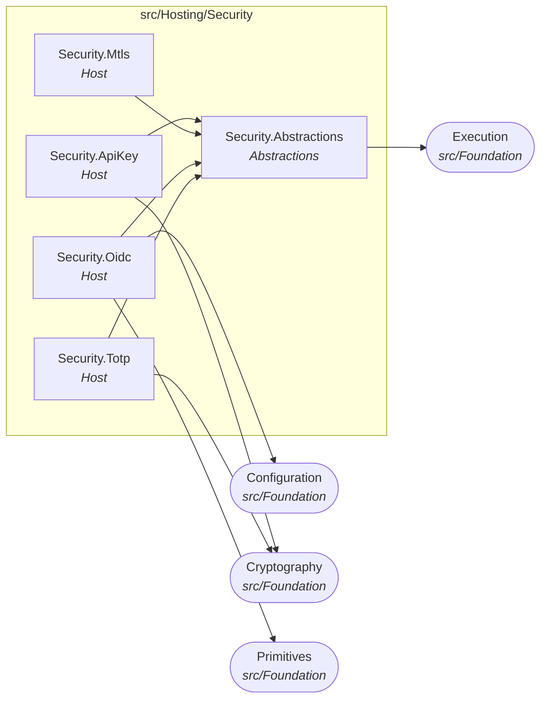
```mermaid
flowchart LR
  subgraph folder_src_Hosting_Security["src/Hosting/Security"]
    SharedKernel_Security_Abstractions["Security.Abstractions<br/><i>Abstractions</i>"]
    SharedKernel_Security_ApiKey["Security.ApiKey<br/><i>Host</i>"]
    SharedKernel_Security_Mtls["Security.Mtls<br/><i>Host</i>"]
    SharedKernel_Security_Oidc["Security.Oidc<br/><i>Host</i>"]
    SharedKernel_Security_Totp["Security.Totp<br/><i>Host</i>"]
  end
  SharedKernel_Configuration(["Configuration<br/><i>src/Foundation</i>"])
  SharedKernel_Cryptography(["Cryptography<br/><i>src/Foundation</i>"])
  SharedKernel_Execution(["Execution<br/><i>src/Foundation</i>"])
  SharedKernel_Primitives(["Primitives<br/><i>src/Foundation</i>"])
  SharedKernel_Security_Abstractions --> SharedKernel_Execution
  SharedKernel_Security_ApiKey --> SharedKernel_Cryptography
  SharedKernel_Security_ApiKey --> SharedKernel_Security_Abstractions
  SharedKernel_Security_Mtls --> SharedKernel_Security_Abstractions
  SharedKernel_Security_Oidc --> SharedKernel_Configuration
  SharedKernel_Security_Oidc --> SharedKernel_Primitives
  SharedKernel_Security_Oidc --> SharedKernel_Security_Abstractions
  SharedKernel_Security_Totp --> SharedKernel_Cryptography
  SharedKernel_Security_Totp --> SharedKernel_Security_Abstractions
```

## src/Hosting/ServiceDefaults

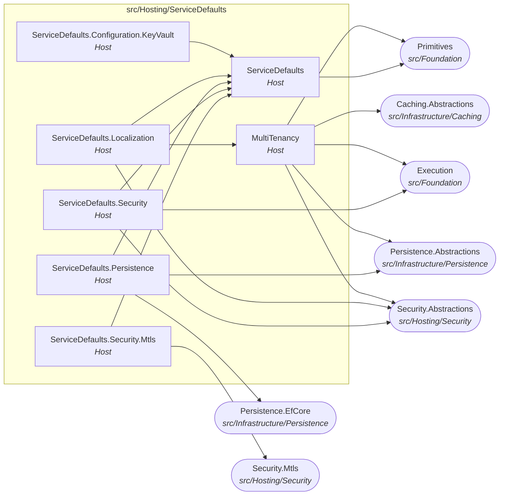
```mermaid
flowchart LR
  subgraph folder_src_Hosting_ServiceDefaults["src/Hosting/ServiceDefaults"]
    SharedKernel_MultiTenancy["MultiTenancy<br/><i>Host</i>"]
    SharedKernel_ServiceDefaults["ServiceDefaults<br/><i>Host</i>"]
    SharedKernel_ServiceDefaults_Configuration_KeyVault["ServiceDefaults.Configuration.KeyVault<br/><i>Host</i>"]
    SharedKernel_ServiceDefaults_Localization["ServiceDefaults.Localization<br/><i>Host</i>"]
    SharedKernel_ServiceDefaults_Persistence["ServiceDefaults.Persistence<br/><i>Host</i>"]
    SharedKernel_ServiceDefaults_Security["ServiceDefaults.Security<br/><i>Host</i>"]
    SharedKernel_ServiceDefaults_Security_Mtls["ServiceDefaults.Security.Mtls<br/><i>Host</i>"]
  end
  SharedKernel_Caching_Abstractions(["Caching.Abstractions<br/><i>src/Infrastructure/Caching</i>"])
  SharedKernel_Execution(["Execution<br/><i>src/Foundation</i>"])
  SharedKernel_Persistence_Abstractions(["Persistence.Abstractions<br/><i>src/Infrastructure/Persistence</i>"])
  SharedKernel_Persistence_EfCore(["Persistence.EfCore<br/><i>src/Infrastructure/Persistence</i>"])
  SharedKernel_Primitives(["Primitives<br/><i>src/Foundation</i>"])
  SharedKernel_Security_Abstractions(["Security.Abstractions<br/><i>src/Hosting/Security</i>"])
  SharedKernel_Security_Mtls(["Security.Mtls<br/><i>src/Hosting/Security</i>"])
  SharedKernel_MultiTenancy --> SharedKernel_Caching_Abstractions
  SharedKernel_MultiTenancy --> SharedKernel_Execution
  SharedKernel_MultiTenancy --> SharedKernel_Persistence_Abstractions
  SharedKernel_MultiTenancy --> SharedKernel_Primitives
  SharedKernel_MultiTenancy --> SharedKernel_Security_Abstractions
  SharedKernel_ServiceDefaults --> SharedKernel_Primitives
  SharedKernel_ServiceDefaults_Configuration_KeyVault --> SharedKernel_ServiceDefaults
  SharedKernel_ServiceDefaults_Localization --> SharedKernel_MultiTenancy
  SharedKernel_ServiceDefaults_Localization --> SharedKernel_Security_Abstractions
  SharedKernel_ServiceDefaults_Localization --> SharedKernel_ServiceDefaults
  SharedKernel_ServiceDefaults_Persistence --> SharedKernel_Persistence_Abstractions
  SharedKernel_ServiceDefaults_Persistence --> SharedKernel_Persistence_EfCore
  SharedKernel_ServiceDefaults_Persistence --> SharedKernel_ServiceDefaults
  SharedKernel_ServiceDefaults_Security --> SharedKernel_Execution
  SharedKernel_ServiceDefaults_Security --> SharedKernel_Security_Abstractions
  SharedKernel_ServiceDefaults_Security --> SharedKernel_ServiceDefaults
  SharedKernel_ServiceDefaults_Security_Mtls --> SharedKernel_Security_Mtls
  SharedKernel_ServiceDefaults_Security_Mtls --> SharedKernel_ServiceDefaults
```

## src/Infrastructure/AI

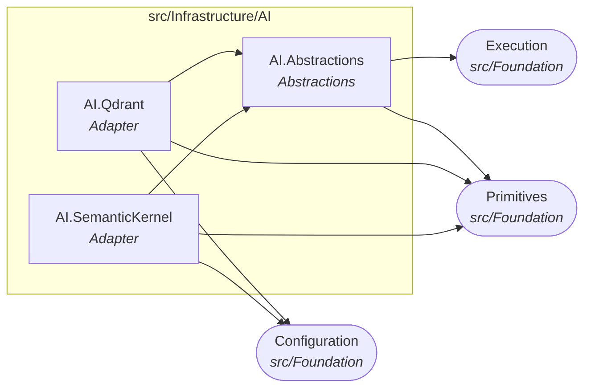
```mermaid
flowchart LR
  subgraph folder_src_Infrastructure_AI["src/Infrastructure/AI"]
    SharedKernel_AI_Abstractions["AI.Abstractions<br/><i>Abstractions</i>"]
    SharedKernel_AI_Qdrant["AI.Qdrant<br/><i>Adapter</i>"]
    SharedKernel_AI_SemanticKernel["AI.SemanticKernel<br/><i>Adapter</i>"]
  end
  SharedKernel_Configuration(["Configuration<br/><i>src/Foundation</i>"])
  SharedKernel_Execution(["Execution<br/><i>src/Foundation</i>"])
  SharedKernel_Primitives(["Primitives<br/><i>src/Foundation</i>"])
  SharedKernel_AI_Abstractions --> SharedKernel_Execution
  SharedKernel_AI_Abstractions --> SharedKernel_Primitives
  SharedKernel_AI_Qdrant --> SharedKernel_AI_Abstractions
  SharedKernel_AI_Qdrant --> SharedKernel_Configuration
  SharedKernel_AI_Qdrant --> SharedKernel_Primitives
  SharedKernel_AI_SemanticKernel --> SharedKernel_AI_Abstractions
  SharedKernel_AI_SemanticKernel --> SharedKernel_Configuration
  SharedKernel_AI_SemanticKernel --> SharedKernel_Primitives
```

## src/Infrastructure/Caching

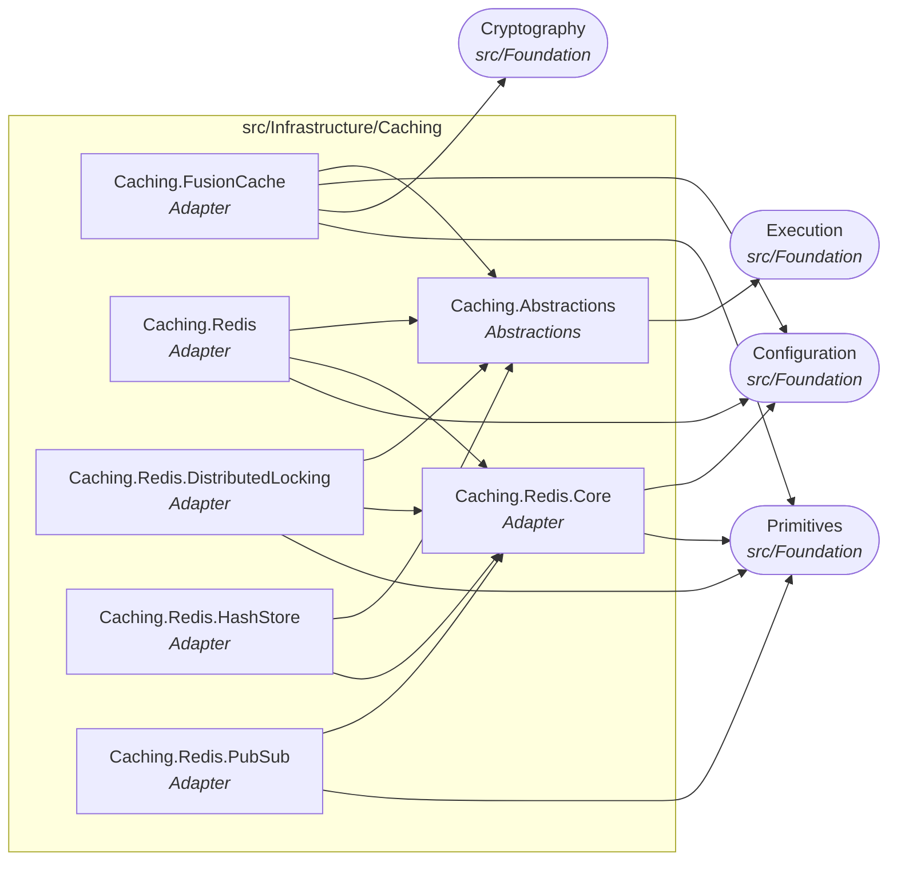
```mermaid
flowchart LR
  subgraph folder_src_Infrastructure_Caching["src/Infrastructure/Caching"]
    SharedKernel_Caching_Abstractions["Caching.Abstractions<br/><i>Abstractions</i>"]
    SharedKernel_Caching_FusionCache["Caching.FusionCache<br/><i>Adapter</i>"]
    SharedKernel_Caching_Redis["Caching.Redis<br/><i>Adapter</i>"]
    SharedKernel_Caching_Redis_Core["Caching.Redis.Core<br/><i>Adapter</i>"]
    SharedKernel_Caching_Redis_DistributedLocking["Caching.Redis.DistributedLocking<br/><i>Adapter</i>"]
    SharedKernel_Caching_Redis_HashStore["Caching.Redis.HashStore<br/><i>Adapter</i>"]
    SharedKernel_Caching_Redis_PubSub["Caching.Redis.PubSub<br/><i>Adapter</i>"]
  end
  SharedKernel_Configuration(["Configuration<br/><i>src/Foundation</i>"])
  SharedKernel_Cryptography(["Cryptography<br/><i>src/Foundation</i>"])
  SharedKernel_Execution(["Execution<br/><i>src/Foundation</i>"])
  SharedKernel_Primitives(["Primitives<br/><i>src/Foundation</i>"])
  SharedKernel_Caching_Abstractions --> SharedKernel_Execution
  SharedKernel_Caching_FusionCache --> SharedKernel_Caching_Abstractions
  SharedKernel_Caching_FusionCache --> SharedKernel_Configuration
  SharedKernel_Caching_FusionCache --> SharedKernel_Cryptography
  SharedKernel_Caching_FusionCache --> SharedKernel_Primitives
  SharedKernel_Caching_Redis --> SharedKernel_Caching_Abstractions
  SharedKernel_Caching_Redis --> SharedKernel_Caching_Redis_Core
  SharedKernel_Caching_Redis --> SharedKernel_Configuration
  SharedKernel_Caching_Redis_Core --> SharedKernel_Configuration
  SharedKernel_Caching_Redis_Core --> SharedKernel_Primitives
  SharedKernel_Caching_Redis_DistributedLocking --> SharedKernel_Caching_Abstractions
  SharedKernel_Caching_Redis_DistributedLocking --> SharedKernel_Caching_Redis_Core
  SharedKernel_Caching_Redis_DistributedLocking --> SharedKernel_Primitives
  SharedKernel_Caching_Redis_HashStore --> SharedKernel_Caching_Abstractions
  SharedKernel_Caching_Redis_HashStore --> SharedKernel_Caching_Redis_Core
  SharedKernel_Caching_Redis_PubSub --> SharedKernel_Caching_Redis_Core
  SharedKernel_Caching_Redis_PubSub --> SharedKernel_Primitives
```

## src/Infrastructure/Communication

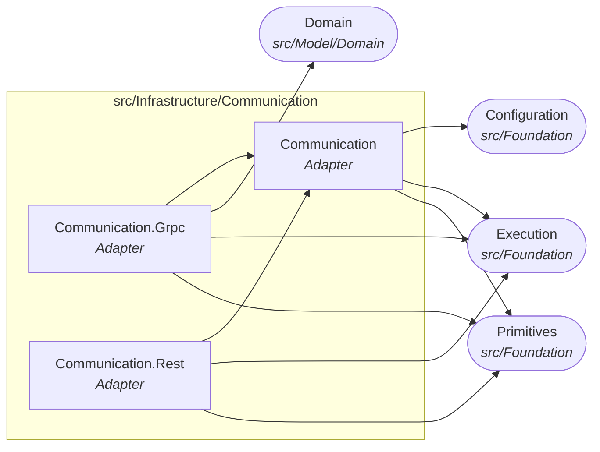
```mermaid
flowchart LR
  subgraph folder_src_Infrastructure_Communication["src/Infrastructure/Communication"]
    SharedKernel_Communication["Communication<br/><i>Adapter</i>"]
    SharedKernel_Communication_Grpc["Communication.Grpc<br/><i>Adapter</i>"]
    SharedKernel_Communication_Rest["Communication.Rest<br/><i>Adapter</i>"]
  end
  SharedKernel_Configuration(["Configuration<br/><i>src/Foundation</i>"])
  SharedKernel_Domain(["Domain<br/><i>src/Model/Domain</i>"])
  SharedKernel_Execution(["Execution<br/><i>src/Foundation</i>"])
  SharedKernel_Primitives(["Primitives<br/><i>src/Foundation</i>"])
  SharedKernel_Communication --> SharedKernel_Configuration
  SharedKernel_Communication --> SharedKernel_Execution
  SharedKernel_Communication --> SharedKernel_Primitives
  SharedKernel_Communication_Grpc --> SharedKernel_Communication
  SharedKernel_Communication_Grpc --> SharedKernel_Domain
  SharedKernel_Communication_Grpc --> SharedKernel_Execution
  SharedKernel_Communication_Grpc --> SharedKernel_Primitives
  SharedKernel_Communication_Rest --> SharedKernel_Communication
  SharedKernel_Communication_Rest --> SharedKernel_Execution
  SharedKernel_Communication_Rest --> SharedKernel_Primitives
```

## src/Infrastructure/Idempotency

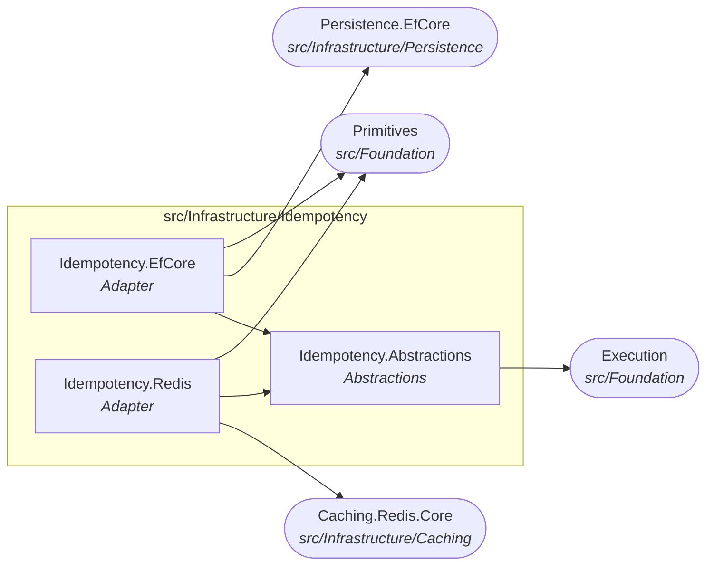
```mermaid
flowchart LR
  subgraph folder_src_Infrastructure_Idempotency["src/Infrastructure/Idempotency"]
    SharedKernel_Idempotency_Abstractions["Idempotency.Abstractions<br/><i>Abstractions</i>"]
    SharedKernel_Idempotency_EfCore["Idempotency.EfCore<br/><i>Adapter</i>"]
    SharedKernel_Idempotency_Redis["Idempotency.Redis<br/><i>Adapter</i>"]
  end
  SharedKernel_Caching_Redis_Core(["Caching.Redis.Core<br/><i>src/Infrastructure/Caching</i>"])
  SharedKernel_Execution(["Execution<br/><i>src/Foundation</i>"])
  SharedKernel_Persistence_EfCore(["Persistence.EfCore<br/><i>src/Infrastructure/Persistence</i>"])
  SharedKernel_Primitives(["Primitives<br/><i>src/Foundation</i>"])
  SharedKernel_Idempotency_Abstractions --> SharedKernel_Execution
  SharedKernel_Idempotency_EfCore --> SharedKernel_Idempotency_Abstractions
  SharedKernel_Idempotency_EfCore --> SharedKernel_Persistence_EfCore
  SharedKernel_Idempotency_EfCore --> SharedKernel_Primitives
  SharedKernel_Idempotency_Redis --> SharedKernel_Caching_Redis_Core
  SharedKernel_Idempotency_Redis --> SharedKernel_Idempotency_Abstractions
  SharedKernel_Idempotency_Redis --> SharedKernel_Primitives
```

## src/Infrastructure/Integration

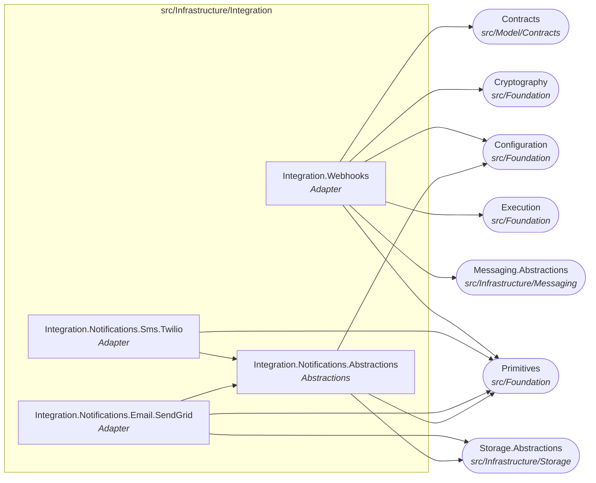
```mermaid
flowchart LR
  subgraph folder_src_Infrastructure_Integration["src/Infrastructure/Integration"]
    SharedKernel_Integration_Notifications_Abstractions["Integration.Notifications.Abstractions<br/><i>Abstractions</i>"]
    SharedKernel_Integration_Notifications_Email_SendGrid["Integration.Notifications.Email.SendGrid<br/><i>Adapter</i>"]
    SharedKernel_Integration_Notifications_Sms_Twilio["Integration.Notifications.Sms.Twilio<br/><i>Adapter</i>"]
    SharedKernel_Integration_Webhooks["Integration.Webhooks<br/><i>Adapter</i>"]
  end
  SharedKernel_Configuration(["Configuration<br/><i>src/Foundation</i>"])
  SharedKernel_Contracts(["Contracts<br/><i>src/Model/Contracts</i>"])
  SharedKernel_Cryptography(["Cryptography<br/><i>src/Foundation</i>"])
  SharedKernel_Execution(["Execution<br/><i>src/Foundation</i>"])
  SharedKernel_Messaging_Abstractions(["Messaging.Abstractions<br/><i>src/Infrastructure/Messaging</i>"])
  SharedKernel_Primitives(["Primitives<br/><i>src/Foundation</i>"])
  SharedKernel_Storage_Abstractions(["Storage.Abstractions<br/><i>src/Infrastructure/Storage</i>"])
  SharedKernel_Integration_Notifications_Abstractions --> SharedKernel_Configuration
  SharedKernel_Integration_Notifications_Abstractions --> SharedKernel_Primitives
  SharedKernel_Integration_Notifications_Abstractions --> SharedKernel_Storage_Abstractions
  SharedKernel_Integration_Notifications_Email_SendGrid --> SharedKernel_Integration_Notifications_Abstractions
  SharedKernel_Integration_Notifications_Email_SendGrid --> SharedKernel_Primitives
  SharedKernel_Integration_Notifications_Email_SendGrid --> SharedKernel_Storage_Abstractions
  SharedKernel_Integration_Notifications_Sms_Twilio --> SharedKernel_Integration_Notifications_Abstractions
  SharedKernel_Integration_Notifications_Sms_Twilio --> SharedKernel_Primitives
  SharedKernel_Integration_Webhooks --> SharedKernel_Configuration
  SharedKernel_Integration_Webhooks --> SharedKernel_Contracts
  SharedKernel_Integration_Webhooks --> SharedKernel_Cryptography
  SharedKernel_Integration_Webhooks --> SharedKernel_Execution
  SharedKernel_Integration_Webhooks --> SharedKernel_Messaging_Abstractions
  SharedKernel_Integration_Webhooks --> SharedKernel_Primitives
```

## src/Infrastructure/Messaging

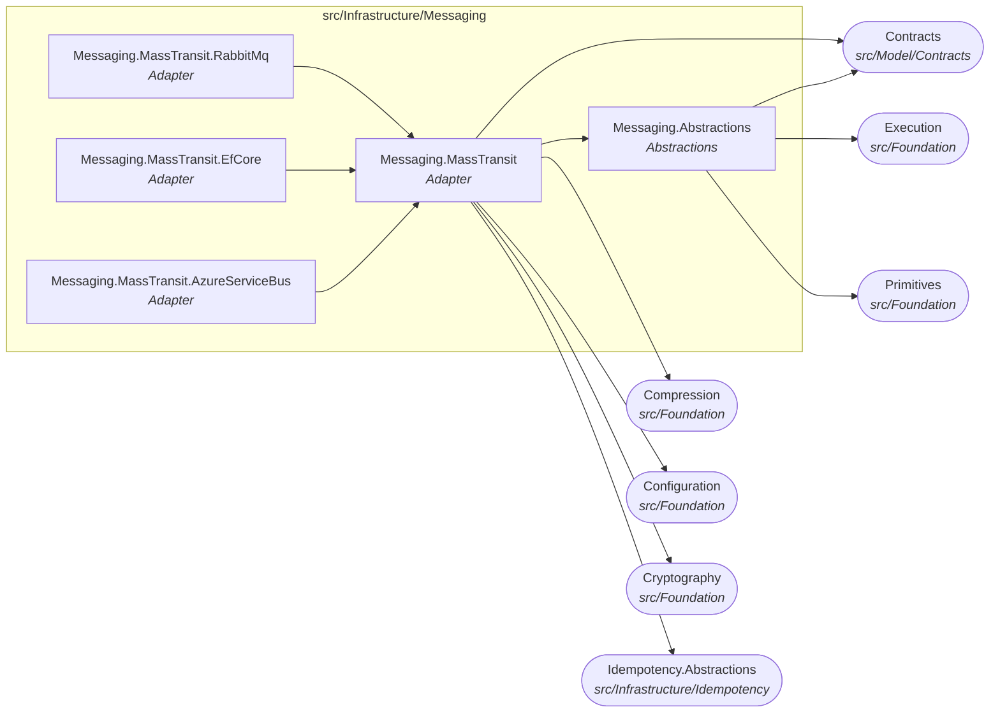
```mermaid
flowchart LR
  subgraph folder_src_Infrastructure_Messaging["src/Infrastructure/Messaging"]
    SharedKernel_Messaging_Abstractions["Messaging.Abstractions<br/><i>Abstractions</i>"]
    SharedKernel_Messaging_MassTransit["Messaging.MassTransit<br/><i>Adapter</i>"]
    SharedKernel_Messaging_MassTransit_AzureServiceBus["Messaging.MassTransit.AzureServiceBus<br/><i>Adapter</i>"]
    SharedKernel_Messaging_MassTransit_EfCore["Messaging.MassTransit.EfCore<br/><i>Adapter</i>"]
    SharedKernel_Messaging_MassTransit_RabbitMq["Messaging.MassTransit.RabbitMq<br/><i>Adapter</i>"]
  end
  SharedKernel_Compression(["Compression<br/><i>src/Foundation</i>"])
  SharedKernel_Configuration(["Configuration<br/><i>src/Foundation</i>"])
  SharedKernel_Contracts(["Contracts<br/><i>src/Model/Contracts</i>"])
  SharedKernel_Cryptography(["Cryptography<br/><i>src/Foundation</i>"])
  SharedKernel_Execution(["Execution<br/><i>src/Foundation</i>"])
  SharedKernel_Idempotency_Abstractions(["Idempotency.Abstractions<br/><i>src/Infrastructure/Idempotency</i>"])
  SharedKernel_Primitives(["Primitives<br/><i>src/Foundation</i>"])
  SharedKernel_Messaging_Abstractions --> SharedKernel_Contracts
  SharedKernel_Messaging_Abstractions --> SharedKernel_Execution
  SharedKernel_Messaging_Abstractions --> SharedKernel_Primitives
  SharedKernel_Messaging_MassTransit --> SharedKernel_Compression
  SharedKernel_Messaging_MassTransit --> SharedKernel_Configuration
  SharedKernel_Messaging_MassTransit --> SharedKernel_Contracts
  SharedKernel_Messaging_MassTransit --> SharedKernel_Cryptography
  SharedKernel_Messaging_MassTransit --> SharedKernel_Idempotency_Abstractions
  SharedKernel_Messaging_MassTransit --> SharedKernel_Messaging_Abstractions
  SharedKernel_Messaging_MassTransit_AzureServiceBus --> SharedKernel_Messaging_MassTransit
  SharedKernel_Messaging_MassTransit_EfCore --> SharedKernel_Messaging_MassTransit
  SharedKernel_Messaging_MassTransit_RabbitMq --> SharedKernel_Messaging_MassTransit
```

## src/Infrastructure/Persistence

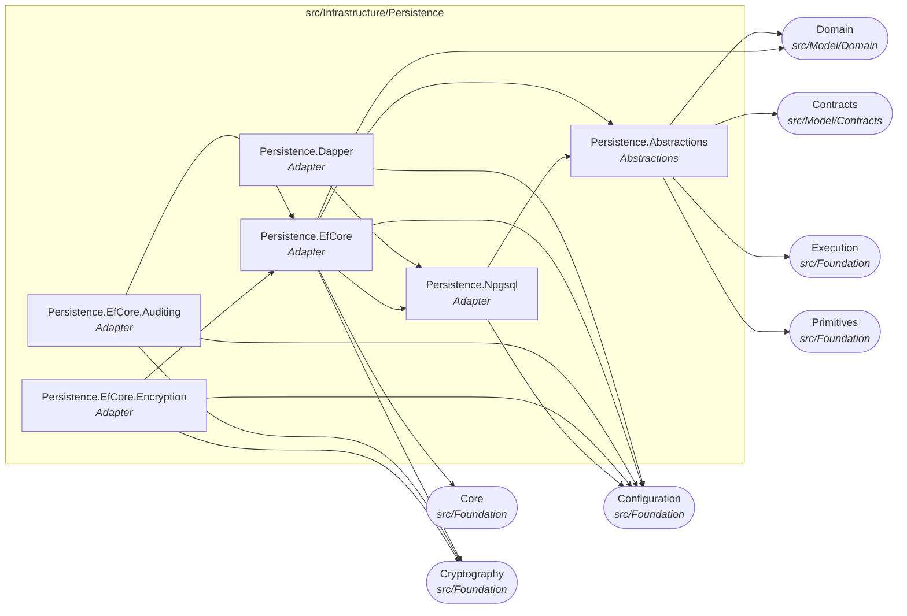
```mermaid
flowchart LR
  subgraph folder_src_Infrastructure_Persistence["src/Infrastructure/Persistence"]
    SharedKernel_Persistence_Abstractions["Persistence.Abstractions<br/><i>Abstractions</i>"]
    SharedKernel_Persistence_Dapper["Persistence.Dapper<br/><i>Adapter</i>"]
    SharedKernel_Persistence_EfCore["Persistence.EfCore<br/><i>Adapter</i>"]
    SharedKernel_Persistence_EfCore_Auditing["Persistence.EfCore.Auditing<br/><i>Adapter</i>"]
    SharedKernel_Persistence_EfCore_Encryption["Persistence.EfCore.Encryption<br/><i>Adapter</i>"]
    SharedKernel_Persistence_Npgsql["Persistence.Npgsql<br/><i>Adapter</i>"]
  end
  SharedKernel_Configuration(["Configuration<br/><i>src/Foundation</i>"])
  SharedKernel_Contracts(["Contracts<br/><i>src/Model/Contracts</i>"])
  SharedKernel_Core(["Core<br/><i>src/Foundation</i>"])
  SharedKernel_Cryptography(["Cryptography<br/><i>src/Foundation</i>"])
  SharedKernel_Domain(["Domain<br/><i>src/Model/Domain</i>"])
  SharedKernel_Execution(["Execution<br/><i>src/Foundation</i>"])
  SharedKernel_Primitives(["Primitives<br/><i>src/Foundation</i>"])
  SharedKernel_Persistence_Abstractions --> SharedKernel_Contracts
  SharedKernel_Persistence_Abstractions --> SharedKernel_Domain
  SharedKernel_Persistence_Abstractions --> SharedKernel_Execution
  SharedKernel_Persistence_Abstractions --> SharedKernel_Primitives
  SharedKernel_Persistence_Dapper --> SharedKernel_Configuration
  SharedKernel_Persistence_Dapper --> SharedKernel_Persistence_Npgsql
  SharedKernel_Persistence_EfCore --> SharedKernel_Configuration
  SharedKernel_Persistence_EfCore --> SharedKernel_Core
  SharedKernel_Persistence_EfCore --> SharedKernel_Cryptography
  SharedKernel_Persistence_EfCore --> SharedKernel_Domain
  SharedKernel_Persistence_EfCore --> SharedKernel_Persistence_Abstractions
  SharedKernel_Persistence_EfCore --> SharedKernel_Persistence_Npgsql
  SharedKernel_Persistence_EfCore_Auditing --> SharedKernel_Configuration
  SharedKernel_Persistence_EfCore_Auditing --> SharedKernel_Cryptography
  SharedKernel_Persistence_EfCore_Auditing --> SharedKernel_Persistence_EfCore
  SharedKernel_Persistence_EfCore_Encryption --> SharedKernel_Configuration
  SharedKernel_Persistence_EfCore_Encryption --> SharedKernel_Cryptography
  SharedKernel_Persistence_EfCore_Encryption --> SharedKernel_Persistence_EfCore
  SharedKernel_Persistence_Npgsql --> SharedKernel_Configuration
  SharedKernel_Persistence_Npgsql --> SharedKernel_Persistence_Abstractions
```

## src/Infrastructure/Reporting

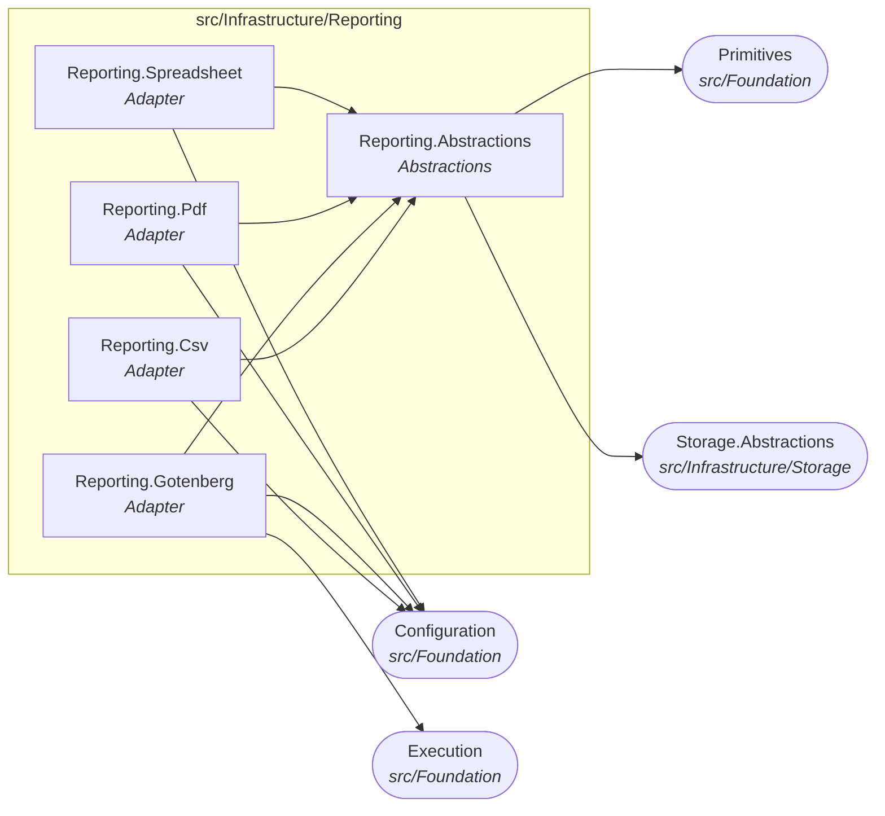
```mermaid
flowchart LR
  subgraph folder_src_Infrastructure_Reporting["src/Infrastructure/Reporting"]
    SharedKernel_Reporting_Abstractions["Reporting.Abstractions<br/><i>Abstractions</i>"]
    SharedKernel_Reporting_Csv["Reporting.Csv<br/><i>Adapter</i>"]
    SharedKernel_Reporting_Gotenberg["Reporting.Gotenberg<br/><i>Adapter</i>"]
    SharedKernel_Reporting_Pdf["Reporting.Pdf<br/><i>Adapter</i>"]
    SharedKernel_Reporting_Spreadsheet["Reporting.Spreadsheet<br/><i>Adapter</i>"]
  end
  SharedKernel_Configuration(["Configuration<br/><i>src/Foundation</i>"])
  SharedKernel_Execution(["Execution<br/><i>src/Foundation</i>"])
  SharedKernel_Primitives(["Primitives<br/><i>src/Foundation</i>"])
  SharedKernel_Storage_Abstractions(["Storage.Abstractions<br/><i>src/Infrastructure/Storage</i>"])
  SharedKernel_Reporting_Abstractions --> SharedKernel_Primitives
  SharedKernel_Reporting_Abstractions --> SharedKernel_Storage_Abstractions
  SharedKernel_Reporting_Csv --> SharedKernel_Configuration
  SharedKernel_Reporting_Csv --> SharedKernel_Reporting_Abstractions
  SharedKernel_Reporting_Gotenberg --> SharedKernel_Configuration
  SharedKernel_Reporting_Gotenberg --> SharedKernel_Execution
  SharedKernel_Reporting_Gotenberg --> SharedKernel_Reporting_Abstractions
  SharedKernel_Reporting_Pdf --> SharedKernel_Configuration
  SharedKernel_Reporting_Pdf --> SharedKernel_Reporting_Abstractions
  SharedKernel_Reporting_Spreadsheet --> SharedKernel_Configuration
  SharedKernel_Reporting_Spreadsheet --> SharedKernel_Reporting_Abstractions
```

## src/Infrastructure/Scheduling

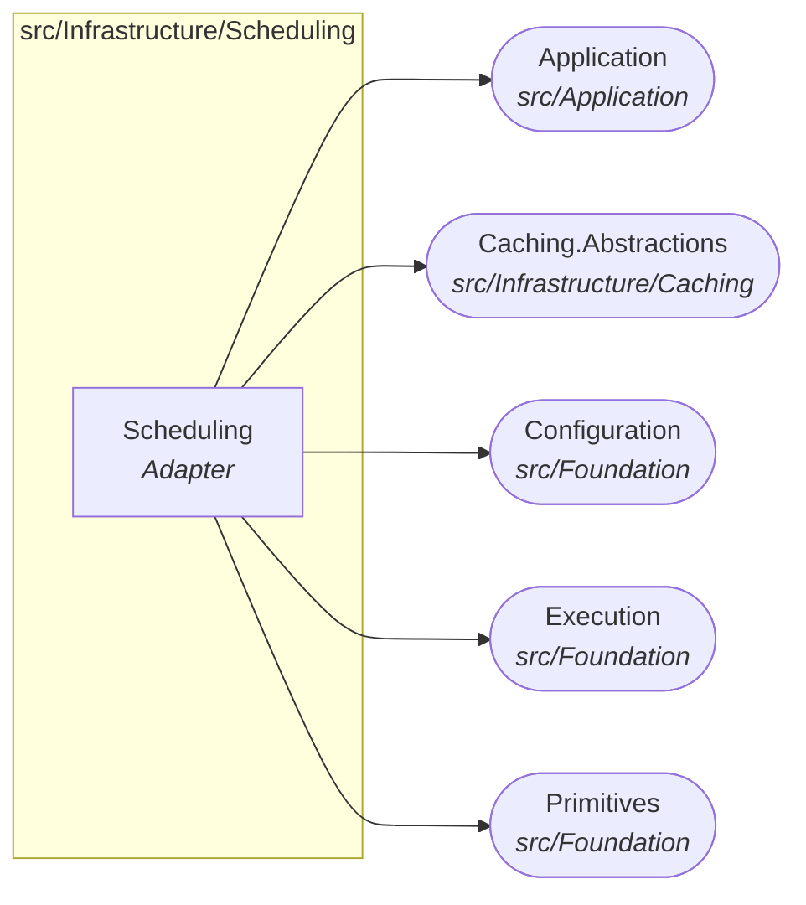
```mermaid
flowchart LR
  subgraph folder_src_Infrastructure_Scheduling["src/Infrastructure/Scheduling"]
    SharedKernel_Scheduling["Scheduling<br/><i>Adapter</i>"]
  end
  SharedKernel_Application(["Application<br/><i>src/Application</i>"])
  SharedKernel_Caching_Abstractions(["Caching.Abstractions<br/><i>src/Infrastructure/Caching</i>"])
  SharedKernel_Configuration(["Configuration<br/><i>src/Foundation</i>"])
  SharedKernel_Execution(["Execution<br/><i>src/Foundation</i>"])
  SharedKernel_Primitives(["Primitives<br/><i>src/Foundation</i>"])
  SharedKernel_Scheduling --> SharedKernel_Application
  SharedKernel_Scheduling --> SharedKernel_Caching_Abstractions
  SharedKernel_Scheduling --> SharedKernel_Configuration
  SharedKernel_Scheduling --> SharedKernel_Execution
  SharedKernel_Scheduling --> SharedKernel_Primitives
```

## src/Infrastructure/Search

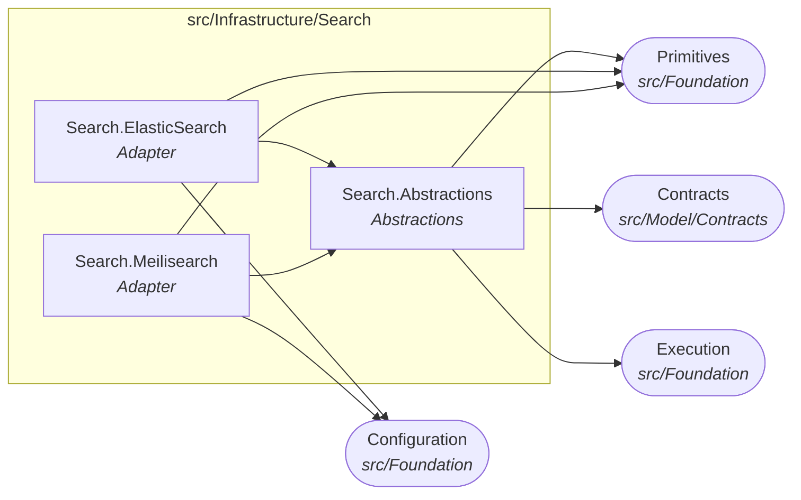
```mermaid
flowchart LR
  subgraph folder_src_Infrastructure_Search["src/Infrastructure/Search"]
    SharedKernel_Search_Abstractions["Search.Abstractions<br/><i>Abstractions</i>"]
    SharedKernel_Search_ElasticSearch["Search.ElasticSearch<br/><i>Adapter</i>"]
    SharedKernel_Search_Meilisearch["Search.Meilisearch<br/><i>Adapter</i>"]
  end
  SharedKernel_Configuration(["Configuration<br/><i>src/Foundation</i>"])
  SharedKernel_Contracts(["Contracts<br/><i>src/Model/Contracts</i>"])
  SharedKernel_Execution(["Execution<br/><i>src/Foundation</i>"])
  SharedKernel_Primitives(["Primitives<br/><i>src/Foundation</i>"])
  SharedKernel_Search_Abstractions --> SharedKernel_Contracts
  SharedKernel_Search_Abstractions --> SharedKernel_Execution
  SharedKernel_Search_Abstractions --> SharedKernel_Primitives
  SharedKernel_Search_ElasticSearch --> SharedKernel_Configuration
  SharedKernel_Search_ElasticSearch --> SharedKernel_Primitives
  SharedKernel_Search_ElasticSearch --> SharedKernel_Search_Abstractions
  SharedKernel_Search_Meilisearch --> SharedKernel_Configuration
  SharedKernel_Search_Meilisearch --> SharedKernel_Primitives
  SharedKernel_Search_Meilisearch --> SharedKernel_Search_Abstractions
```

## src/Infrastructure/Storage

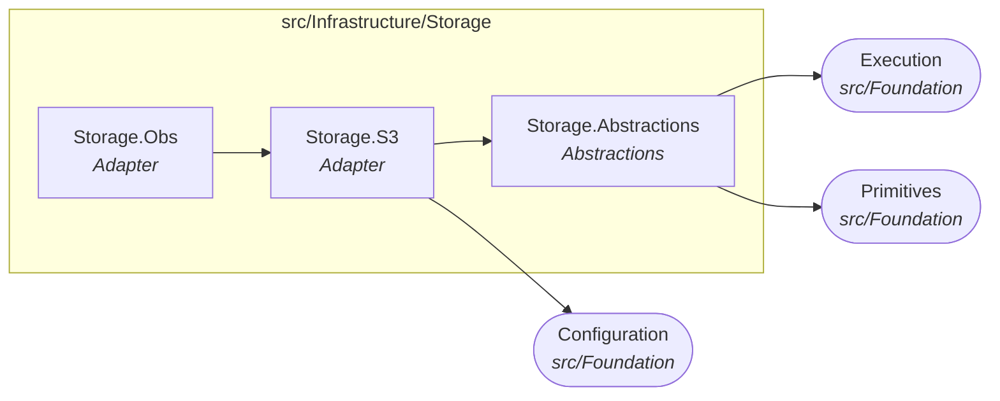
```mermaid
flowchart LR
  subgraph folder_src_Infrastructure_Storage["src/Infrastructure/Storage"]
    SharedKernel_Storage_Abstractions["Storage.Abstractions<br/><i>Abstractions</i>"]
    SharedKernel_Storage_Obs["Storage.Obs<br/><i>Adapter</i>"]
    SharedKernel_Storage_S3["Storage.S3<br/><i>Adapter</i>"]
  end
  SharedKernel_Configuration(["Configuration<br/><i>src/Foundation</i>"])
  SharedKernel_Execution(["Execution<br/><i>src/Foundation</i>"])
  SharedKernel_Primitives(["Primitives<br/><i>src/Foundation</i>"])
  SharedKernel_Storage_Abstractions --> SharedKernel_Execution
  SharedKernel_Storage_Abstractions --> SharedKernel_Primitives
  SharedKernel_Storage_Obs --> SharedKernel_Storage_S3
  SharedKernel_Storage_S3 --> SharedKernel_Configuration
  SharedKernel_Storage_S3 --> SharedKernel_Storage_Abstractions
```

## src/Infrastructure/Workflows

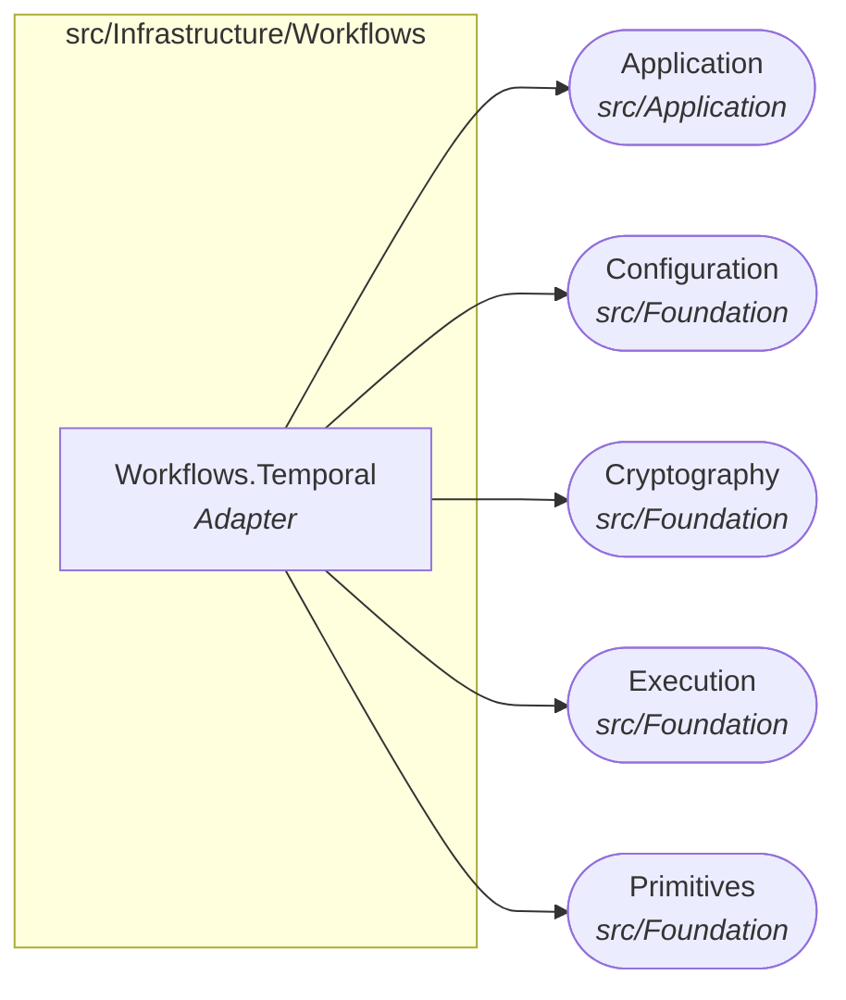
```mermaid
flowchart LR
  subgraph folder_src_Infrastructure_Workflows["src/Infrastructure/Workflows"]
    SharedKernel_Workflows_Temporal["Workflows.Temporal<br/><i>Adapter</i>"]
  end
  SharedKernel_Application(["Application<br/><i>src/Application</i>"])
  SharedKernel_Configuration(["Configuration<br/><i>src/Foundation</i>"])
  SharedKernel_Cryptography(["Cryptography<br/><i>src/Foundation</i>"])
  SharedKernel_Execution(["Execution<br/><i>src/Foundation</i>"])
  SharedKernel_Primitives(["Primitives<br/><i>src/Foundation</i>"])
  SharedKernel_Workflows_Temporal --> SharedKernel_Application
  SharedKernel_Workflows_Temporal --> SharedKernel_Configuration
  SharedKernel_Workflows_Temporal --> SharedKernel_Cryptography
  SharedKernel_Workflows_Temporal --> SharedKernel_Execution
  SharedKernel_Workflows_Temporal --> SharedKernel_Primitives
```

## src/Model/Contracts

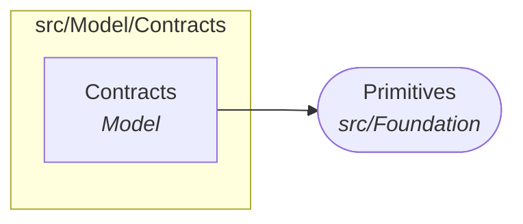
```mermaid
flowchart LR
  subgraph folder_src_Model_Contracts["src/Model/Contracts"]
    SharedKernel_Contracts["Contracts<br/><i>Model</i>"]
  end
  SharedKernel_Primitives(["Primitives<br/><i>src/Foundation</i>"])
  SharedKernel_Contracts --> SharedKernel_Primitives
```

## src/Model/Domain

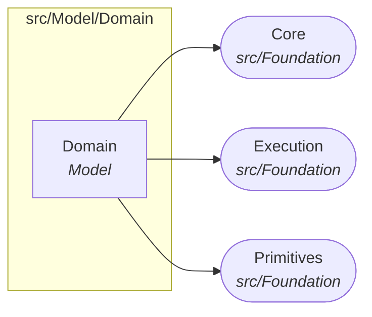
```mermaid
flowchart LR
  subgraph folder_src_Model_Domain["src/Model/Domain"]
    SharedKernel_Domain["Domain<br/><i>Model</i>"]
  end
  SharedKernel_Core(["Core<br/><i>src/Foundation</i>"])
  SharedKernel_Execution(["Execution<br/><i>src/Foundation</i>"])
  SharedKernel_Primitives(["Primitives<br/><i>src/Foundation</i>"])
  SharedKernel_Domain --> SharedKernel_Core
  SharedKernel_Domain --> SharedKernel_Execution
  SharedKernel_Domain --> SharedKernel_Primitives
```

## src/Testing

```mermaid
flowchart LR
  subgraph folder_src_Testing["src/Testing"]
    SharedKernel_AI_Testing["AI.Testing<br/><i>Testing</i>"]
    SharedKernel_Application_Testing["Application.Testing<br/><i>Testing</i>"]
    SharedKernel_Caching_Redis_Testing["Caching.Redis.Testing<br/><i>Testing</i>"]
    SharedKernel_Caching_Testing["Caching.Testing<br/><i>Testing</i>"]
    SharedKernel_Communication_Testing["Communication.Testing<br/><i>Testing</i>"]
    SharedKernel_Cryptography_Testing["Cryptography.Testing<br/><i>Testing</i>"]
    SharedKernel_FeatureManagement_Testing["FeatureManagement.Testing<br/><i>Testing</i>"]
    SharedKernel_Idempotency_Testing["Idempotency.Testing<br/><i>Testing</i>"]
    SharedKernel_Integration_Testing["Integration.Testing<br/><i>Testing</i>"]
    SharedKernel_Messaging_Testing["Messaging.Testing<br/><i>Testing</i>"]
    SharedKernel_Persistence_Testing["Persistence.Testing<br/><i>Testing</i>"]
    SharedKernel_Presentation_Testing["Presentation.Testing<br/><i>Testing</i>"]
    SharedKernel_Reporting_Testing["Reporting.Testing<br/><i>Testing</i>"]
    SharedKernel_Scheduling_Testing["Scheduling.Testing<br/><i>Testing</i>"]
    SharedKernel_Search_Testing["Search.Testing<br/><i>Testing</i>"]
    SharedKernel_Security_Testing["Security.Testing<br/><i>Testing</i>"]
    SharedKernel_ServiceDefaults_Testing["ServiceDefaults.Testing<br/><i>Testing</i>"]
    SharedKernel_Storage_Testing["Storage.Testing<br/><i>Testing</i>"]
    SharedKernel_Testing["Testing<br/><i>Testing</i>"]
    SharedKernel_Workflows_Testing["Workflows.Testing<br/><i>Testing</i>"]
  end
  SharedKernel_AI_Abstractions(["AI.Abstractions<br/><i>src/Infrastructure/AI</i>"])
  SharedKernel_Application_Mediator_MediatR(["Application.Mediator.MediatR<br/><i>src/Application</i>"])
  SharedKernel_Application_Pipeline(["Application.Pipeline<br/><i>src/Application</i>"])
  SharedKernel_Caching_Abstractions(["Caching.Abstractions<br/><i>src/Infrastructure/Caching</i>"])
  SharedKernel_Caching_Redis_HashStore(["Caching.Redis.HashStore<br/><i>src/Infrastructure/Caching</i>"])
  SharedKernel_Caching_Redis_PubSub(["Caching.Redis.PubSub<br/><i>src/Infrastructure/Caching</i>"])
  SharedKernel_Communication(["Communication<br/><i>src/Infrastructure/Communication</i>"])
  SharedKernel_Contracts(["Contracts<br/><i>src/Model/Contracts</i>"])
  SharedKernel_Cryptography(["Cryptography<br/><i>src/Foundation</i>"])
  SharedKernel_DataPrivacy(["DataPrivacy<br/><i>src/Foundation</i>"])
  SharedKernel_Domain(["Domain<br/><i>src/Model/Domain</i>"])
  SharedKernel_Execution(["Execution<br/><i>src/Foundation</i>"])
  SharedKernel_FeatureManagement(["FeatureManagement<br/><i>src/Foundation</i>"])
  SharedKernel_Idempotency_Abstractions(["Idempotency.Abstractions<br/><i>src/Infrastructure/Idempotency</i>"])
  SharedKernel_Integration_Notifications_Abstractions(["Integration.Notifications.Abstractions<br/><i>src/Infrastructure/Integration</i>"])
  SharedKernel_Integration_Webhooks(["Integration.Webhooks<br/><i>src/Infrastructure/Integration</i>"])
  SharedKernel_Messaging_Abstractions(["Messaging.Abstractions<br/><i>src/Infrastructure/Messaging</i>"])
  SharedKernel_MultiTenancy(["MultiTenancy<br/><i>src/Hosting/ServiceDefaults</i>"])
  SharedKernel_Persistence_Abstractions(["Persistence.Abstractions<br/><i>src/Infrastructure/Persistence</i>"])
  SharedKernel_Persistence_EfCore(["Persistence.EfCore<br/><i>src/Infrastructure/Persistence</i>"])
  SharedKernel_Persistence_EfCore_Auditing(["Persistence.EfCore.Auditing<br/><i>src/Infrastructure/Persistence</i>"])
  SharedKernel_Persistence_EfCore_Encryption(["Persistence.EfCore.Encryption<br/><i>src/Infrastructure/Persistence</i>"])
  SharedKernel_Presentation_Grpc(["Presentation.Grpc<br/><i>src/Hosting/Presentation</i>"])
  SharedKernel_Primitives(["Primitives<br/><i>src/Foundation</i>"])
  SharedKernel_Reporting_Abstractions(["Reporting.Abstractions<br/><i>src/Infrastructure/Reporting</i>"])
  SharedKernel_Scheduling(["Scheduling<br/><i>src/Infrastructure/Scheduling</i>"])
  SharedKernel_Search_Abstractions(["Search.Abstractions<br/><i>src/Infrastructure/Search</i>"])
  SharedKernel_Security_Abstractions(["Security.Abstractions<br/><i>src/Hosting/Security</i>"])
  SharedKernel_Security_ApiKey(["Security.ApiKey<br/><i>src/Hosting/Security</i>"])
  SharedKernel_Security_Oidc(["Security.Oidc<br/><i>src/Hosting/Security</i>"])
  SharedKernel_Security_Totp(["Security.Totp<br/><i>src/Hosting/Security</i>"])
  SharedKernel_Storage_Abstractions(["Storage.Abstractions<br/><i>src/Infrastructure/Storage</i>"])
  SharedKernel_Validation(["Validation<br/><i>src/Foundation</i>"])
  SharedKernel_Workflows_Temporal(["Workflows.Temporal<br/><i>src/Infrastructure/Workflows</i>"])
  SharedKernel_AI_Testing --> SharedKernel_AI_Abstractions
  SharedKernel_Application_Testing --> SharedKernel_Application_Mediator_MediatR
  SharedKernel_Application_Testing --> SharedKernel_Application_Pipeline
  SharedKernel_Application_Testing --> SharedKernel_Idempotency_Testing
  SharedKernel_Application_Testing --> SharedKernel_Persistence_Testing
  SharedKernel_Application_Testing --> SharedKernel_Testing
  SharedKernel_Caching_Redis_Testing --> SharedKernel_Caching_Redis_HashStore
  SharedKernel_Caching_Redis_Testing --> SharedKernel_Caching_Redis_PubSub
  SharedKernel_Caching_Testing --> SharedKernel_Caching_Abstractions
  SharedKernel_Communication_Testing --> SharedKernel_Communication
  SharedKernel_Communication_Testing --> SharedKernel_Primitives
  SharedKernel_Cryptography_Testing --> SharedKernel_Cryptography
  SharedKernel_Cryptography_Testing --> SharedKernel_Testing
  SharedKernel_FeatureManagement_Testing --> SharedKernel_FeatureManagement
  SharedKernel_Idempotency_Testing --> SharedKernel_Idempotency_Abstractions
  SharedKernel_Integration_Testing --> SharedKernel_Contracts
  SharedKernel_Integration_Testing --> SharedKernel_Integration_Notifications_Abstractions
  SharedKernel_Integration_Testing --> SharedKernel_Integration_Webhooks
  SharedKernel_Messaging_Testing --> SharedKernel_Contracts
  SharedKernel_Messaging_Testing --> SharedKernel_Messaging_Abstractions
  SharedKernel_Persistence_Testing --> SharedKernel_Persistence_Abstractions
  SharedKernel_Persistence_Testing --> SharedKernel_Persistence_EfCore
  SharedKernel_Persistence_Testing --> SharedKernel_Persistence_EfCore_Auditing
  SharedKernel_Persistence_Testing --> SharedKernel_Persistence_EfCore_Encryption
  SharedKernel_Persistence_Testing --> SharedKernel_Testing
  SharedKernel_Presentation_Testing --> SharedKernel_Execution
  SharedKernel_Presentation_Testing --> SharedKernel_Presentation_Grpc
  SharedKernel_Reporting_Testing --> SharedKernel_Reporting_Abstractions
  SharedKernel_Reporting_Testing --> SharedKernel_Storage_Abstractions
  SharedKernel_Reporting_Testing --> SharedKernel_Testing
  SharedKernel_Scheduling_Testing --> SharedKernel_Scheduling
  SharedKernel_Search_Testing --> SharedKernel_Search_Abstractions
  SharedKernel_Security_Testing --> SharedKernel_Security_Abstractions
  SharedKernel_Security_Testing --> SharedKernel_Security_ApiKey
  SharedKernel_Security_Testing --> SharedKernel_Security_Oidc
  SharedKernel_Security_Testing --> SharedKernel_Security_Totp
  SharedKernel_ServiceDefaults_Testing --> SharedKernel_MultiTenancy
  SharedKernel_Storage_Testing --> SharedKernel_Storage_Abstractions
  SharedKernel_Testing --> SharedKernel_Contracts
  SharedKernel_Testing --> SharedKernel_DataPrivacy
  SharedKernel_Testing --> SharedKernel_Domain
  SharedKernel_Testing --> SharedKernel_Execution
  SharedKernel_Testing --> SharedKernel_Primitives
  SharedKernel_Testing --> SharedKernel_Validation
  SharedKernel_Workflows_Testing --> SharedKernel_Workflows_Temporal
```

## tools/Governance

```mermaid
flowchart LR
  subgraph folder_tools_Governance["tools/Governance"]
    SharedKernel_Analyzers["Analyzers<br/><i>Tooling</i>"]
    SharedKernel_ArchitectureTests["ArchitectureTests<br/><i>Tooling</i>"]
    SharedKernel_Linter["Linter<br/><i>Tooling</i>"]
  end
```
