# Dependency graph

> Generated by `eng/generate-package-index.cs` from `ProjectReference`s between packable projects.
> Do not edit by hand: run `dotnet run eng/generate-package-index.cs`. CI fails when this file is out of date.

An arrow `A --> B` means A references B. Tiers are listed in [packages.md](packages.md).

## Between folders

Each arrow is labelled with the number of package references it stands for.

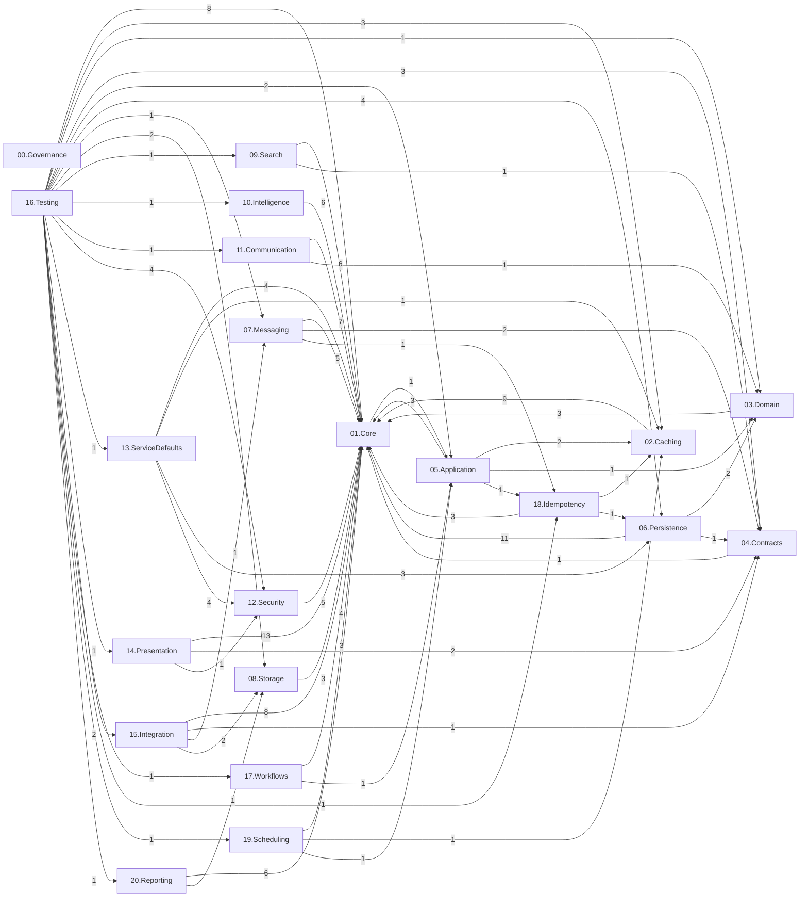
```mermaid
flowchart LR
  00_Governance["00.Governance"]
  01_Core["01.Core"]
  02_Caching["02.Caching"]
  03_Domain["03.Domain"]
  04_Contracts["04.Contracts"]
  05_Application["05.Application"]
  06_Persistence["06.Persistence"]
  07_Messaging["07.Messaging"]
  08_Storage["08.Storage"]
  09_Search["09.Search"]
  10_Intelligence["10.Intelligence"]
  11_Communication["11.Communication"]
  12_Security["12.Security"]
  13_ServiceDefaults["13.ServiceDefaults"]
  14_Presentation["14.Presentation"]
  15_Integration["15.Integration"]
  16_Testing["16.Testing"]
  17_Workflows["17.Workflows"]
  18_Idempotency["18.Idempotency"]
  19_Scheduling["19.Scheduling"]
  20_Reporting["20.Reporting"]
  01_Core -->|1| 05_Application
  02_Caching -->|9| 01_Core
  03_Domain -->|3| 01_Core
  04_Contracts -->|1| 01_Core
  05_Application -->|3| 01_Core
  05_Application -->|2| 02_Caching
  05_Application -->|1| 03_Domain
  05_Application -->|1| 18_Idempotency
  06_Persistence -->|11| 01_Core
  06_Persistence -->|2| 03_Domain
  06_Persistence -->|1| 04_Contracts
  07_Messaging -->|5| 01_Core
  07_Messaging -->|2| 04_Contracts
  07_Messaging -->|1| 18_Idempotency
  08_Storage -->|3| 01_Core
  09_Search -->|6| 01_Core
  09_Search -->|1| 04_Contracts
  10_Intelligence -->|6| 01_Core
  11_Communication -->|7| 01_Core
  11_Communication -->|1| 03_Domain
  12_Security -->|5| 01_Core
  13_ServiceDefaults -->|4| 01_Core
  13_ServiceDefaults -->|1| 02_Caching
  13_ServiceDefaults -->|3| 06_Persistence
  13_ServiceDefaults -->|4| 12_Security
  14_Presentation -->|13| 01_Core
  14_Presentation -->|2| 04_Contracts
  14_Presentation -->|1| 12_Security
  15_Integration -->|8| 01_Core
  15_Integration -->|1| 04_Contracts
  15_Integration -->|1| 07_Messaging
  15_Integration -->|2| 08_Storage
  16_Testing -->|8| 01_Core
  16_Testing -->|3| 02_Caching
  16_Testing -->|1| 03_Domain
  16_Testing -->|3| 04_Contracts
  16_Testing -->|2| 05_Application
  16_Testing -->|4| 06_Persistence
  16_Testing -->|1| 07_Messaging
  16_Testing -->|2| 08_Storage
  16_Testing -->|1| 09_Search
  16_Testing -->|1| 10_Intelligence
  16_Testing -->|1| 11_Communication
  16_Testing -->|4| 12_Security
  16_Testing -->|1| 13_ServiceDefaults
  16_Testing -->|1| 14_Presentation
  16_Testing -->|2| 15_Integration
  16_Testing -->|1| 17_Workflows
  16_Testing -->|1| 18_Idempotency
  16_Testing -->|1| 19_Scheduling
  16_Testing -->|1| 20_Reporting
  17_Workflows -->|4| 01_Core
  17_Workflows -->|1| 05_Application
  18_Idempotency -->|3| 01_Core
  18_Idempotency -->|1| 02_Caching
  18_Idempotency -->|1| 06_Persistence
  19_Scheduling -->|3| 01_Core
  19_Scheduling -->|1| 02_Caching
  19_Scheduling -->|1| 05_Application
  20_Reporting -->|6| 01_Core
  20_Reporting -->|1| 08_Storage
```

## 00.Governance

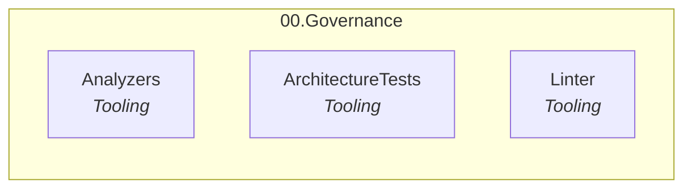
```mermaid
flowchart LR
  subgraph folder_00_Governance["00.Governance"]
    SharedKernel_Analyzers["Analyzers<br/><i>Tooling</i>"]
    SharedKernel_ArchitectureTests["ArchitectureTests<br/><i>Tooling</i>"]
    SharedKernel_Linter["Linter<br/><i>Tooling</i>"]
  end
```

## 01.Core

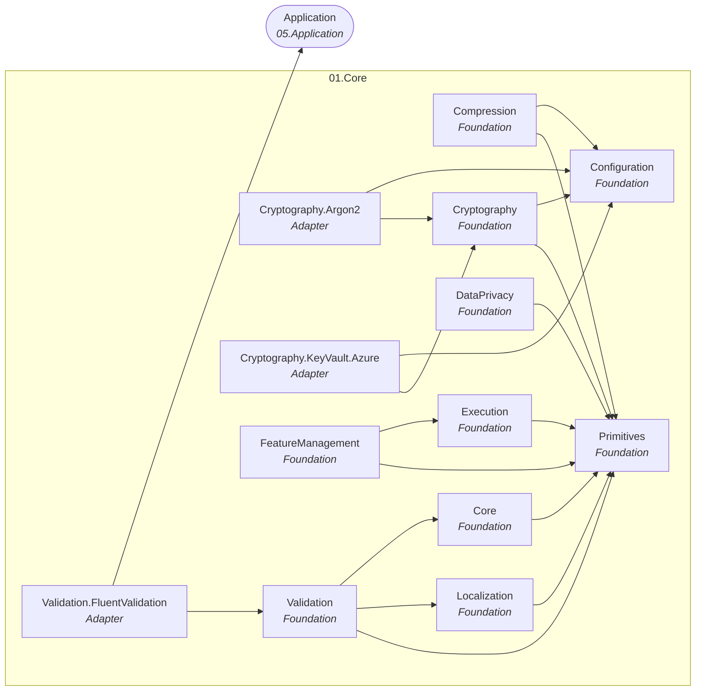
```mermaid
flowchart LR
  subgraph folder_01_Core["01.Core"]
    SharedKernel_Compression["Compression<br/><i>Foundation</i>"]
    SharedKernel_Configuration["Configuration<br/><i>Foundation</i>"]
    SharedKernel_Core["Core<br/><i>Foundation</i>"]
    SharedKernel_Cryptography["Cryptography<br/><i>Foundation</i>"]
    SharedKernel_Cryptography_Argon2["Cryptography.Argon2<br/><i>Adapter</i>"]
    SharedKernel_Cryptography_KeyVault_Azure["Cryptography.KeyVault.Azure<br/><i>Adapter</i>"]
    SharedKernel_DataPrivacy["DataPrivacy<br/><i>Foundation</i>"]
    SharedKernel_Execution["Execution<br/><i>Foundation</i>"]
    SharedKernel_FeatureManagement["FeatureManagement<br/><i>Foundation</i>"]
    SharedKernel_Localization["Localization<br/><i>Foundation</i>"]
    SharedKernel_Primitives["Primitives<br/><i>Foundation</i>"]
    SharedKernel_Validation["Validation<br/><i>Foundation</i>"]
    SharedKernel_Validation_FluentValidation["Validation.FluentValidation<br/><i>Adapter</i>"]
  end
  SharedKernel_Application(["Application<br/><i>05.Application</i>"])
  SharedKernel_Compression --> SharedKernel_Configuration
  SharedKernel_Compression --> SharedKernel_Primitives
  SharedKernel_Core --> SharedKernel_Primitives
  SharedKernel_Cryptography --> SharedKernel_Configuration
  SharedKernel_Cryptography --> SharedKernel_Primitives
  SharedKernel_Cryptography_Argon2 --> SharedKernel_Configuration
  SharedKernel_Cryptography_Argon2 --> SharedKernel_Cryptography
  SharedKernel_Cryptography_KeyVault_Azure --> SharedKernel_Configuration
  SharedKernel_Cryptography_KeyVault_Azure --> SharedKernel_Cryptography
  SharedKernel_DataPrivacy --> SharedKernel_Primitives
  SharedKernel_Execution --> SharedKernel_Primitives
  SharedKernel_FeatureManagement --> SharedKernel_Execution
  SharedKernel_FeatureManagement --> SharedKernel_Primitives
  SharedKernel_Localization --> SharedKernel_Primitives
  SharedKernel_Validation --> SharedKernel_Core
  SharedKernel_Validation --> SharedKernel_Localization
  SharedKernel_Validation --> SharedKernel_Primitives
  SharedKernel_Validation_FluentValidation --> SharedKernel_Application
  SharedKernel_Validation_FluentValidation --> SharedKernel_Validation
```

## 02.Caching

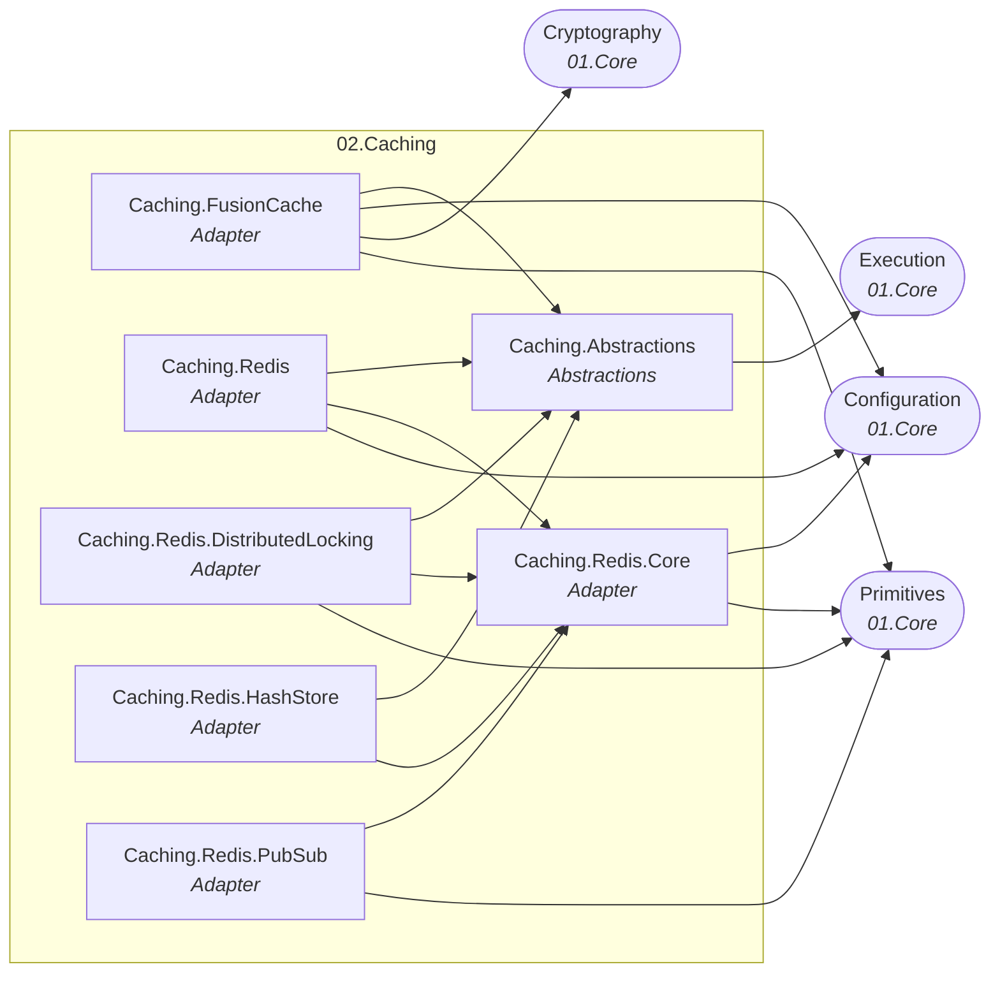
```mermaid
flowchart LR
  subgraph folder_02_Caching["02.Caching"]
    SharedKernel_Caching_Abstractions["Caching.Abstractions<br/><i>Abstractions</i>"]
    SharedKernel_Caching_FusionCache["Caching.FusionCache<br/><i>Adapter</i>"]
    SharedKernel_Caching_Redis["Caching.Redis<br/><i>Adapter</i>"]
    SharedKernel_Caching_Redis_Core["Caching.Redis.Core<br/><i>Adapter</i>"]
    SharedKernel_Caching_Redis_DistributedLocking["Caching.Redis.DistributedLocking<br/><i>Adapter</i>"]
    SharedKernel_Caching_Redis_HashStore["Caching.Redis.HashStore<br/><i>Adapter</i>"]
    SharedKernel_Caching_Redis_PubSub["Caching.Redis.PubSub<br/><i>Adapter</i>"]
  end
  SharedKernel_Configuration(["Configuration<br/><i>01.Core</i>"])
  SharedKernel_Cryptography(["Cryptography<br/><i>01.Core</i>"])
  SharedKernel_Execution(["Execution<br/><i>01.Core</i>"])
  SharedKernel_Primitives(["Primitives<br/><i>01.Core</i>"])
  SharedKernel_Caching_Abstractions --> SharedKernel_Execution
  SharedKernel_Caching_FusionCache --> SharedKernel_Caching_Abstractions
  SharedKernel_Caching_FusionCache --> SharedKernel_Configuration
  SharedKernel_Caching_FusionCache --> SharedKernel_Cryptography
  SharedKernel_Caching_FusionCache --> SharedKernel_Primitives
  SharedKernel_Caching_Redis --> SharedKernel_Caching_Abstractions
  SharedKernel_Caching_Redis --> SharedKernel_Caching_Redis_Core
  SharedKernel_Caching_Redis --> SharedKernel_Configuration
  SharedKernel_Caching_Redis_Core --> SharedKernel_Configuration
  SharedKernel_Caching_Redis_Core --> SharedKernel_Primitives
  SharedKernel_Caching_Redis_DistributedLocking --> SharedKernel_Caching_Abstractions
  SharedKernel_Caching_Redis_DistributedLocking --> SharedKernel_Caching_Redis_Core
  SharedKernel_Caching_Redis_DistributedLocking --> SharedKernel_Primitives
  SharedKernel_Caching_Redis_HashStore --> SharedKernel_Caching_Abstractions
  SharedKernel_Caching_Redis_HashStore --> SharedKernel_Caching_Redis_Core
  SharedKernel_Caching_Redis_PubSub --> SharedKernel_Caching_Redis_Core
  SharedKernel_Caching_Redis_PubSub --> SharedKernel_Primitives
```

## 03.Domain

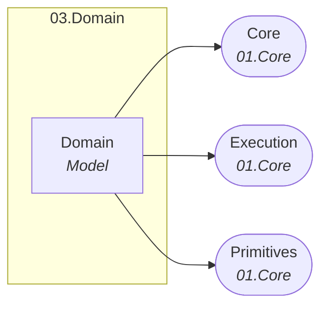
```mermaid
flowchart LR
  subgraph folder_03_Domain["03.Domain"]
    SharedKernel_Domain["Domain<br/><i>Model</i>"]
  end
  SharedKernel_Core(["Core<br/><i>01.Core</i>"])
  SharedKernel_Execution(["Execution<br/><i>01.Core</i>"])
  SharedKernel_Primitives(["Primitives<br/><i>01.Core</i>"])
  SharedKernel_Domain --> SharedKernel_Core
  SharedKernel_Domain --> SharedKernel_Execution
  SharedKernel_Domain --> SharedKernel_Primitives
```

## 04.Contracts

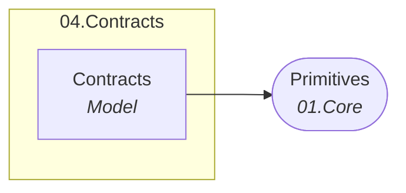
```mermaid
flowchart LR
  subgraph folder_04_Contracts["04.Contracts"]
    SharedKernel_Contracts["Contracts<br/><i>Model</i>"]
  end
  SharedKernel_Primitives(["Primitives<br/><i>01.Core</i>"])
  SharedKernel_Contracts --> SharedKernel_Primitives
```

## 05.Application

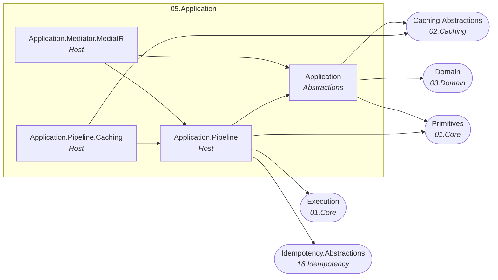
```mermaid
flowchart LR
  subgraph folder_05_Application["05.Application"]
    SharedKernel_Application["Application<br/><i>Abstractions</i>"]
    SharedKernel_Application_Mediator_MediatR["Application.Mediator.MediatR<br/><i>Host</i>"]
    SharedKernel_Application_Pipeline["Application.Pipeline<br/><i>Host</i>"]
    SharedKernel_Application_Pipeline_Caching["Application.Pipeline.Caching<br/><i>Host</i>"]
  end
  SharedKernel_Caching_Abstractions(["Caching.Abstractions<br/><i>02.Caching</i>"])
  SharedKernel_Domain(["Domain<br/><i>03.Domain</i>"])
  SharedKernel_Execution(["Execution<br/><i>01.Core</i>"])
  SharedKernel_Idempotency_Abstractions(["Idempotency.Abstractions<br/><i>18.Idempotency</i>"])
  SharedKernel_Primitives(["Primitives<br/><i>01.Core</i>"])
  SharedKernel_Application --> SharedKernel_Caching_Abstractions
  SharedKernel_Application --> SharedKernel_Domain
  SharedKernel_Application --> SharedKernel_Primitives
  SharedKernel_Application_Mediator_MediatR --> SharedKernel_Application
  SharedKernel_Application_Mediator_MediatR --> SharedKernel_Application_Pipeline
  SharedKernel_Application_Pipeline --> SharedKernel_Application
  SharedKernel_Application_Pipeline --> SharedKernel_Execution
  SharedKernel_Application_Pipeline --> SharedKernel_Idempotency_Abstractions
  SharedKernel_Application_Pipeline --> SharedKernel_Primitives
  SharedKernel_Application_Pipeline_Caching --> SharedKernel_Application_Pipeline
  SharedKernel_Application_Pipeline_Caching --> SharedKernel_Caching_Abstractions
```

## 06.Persistence

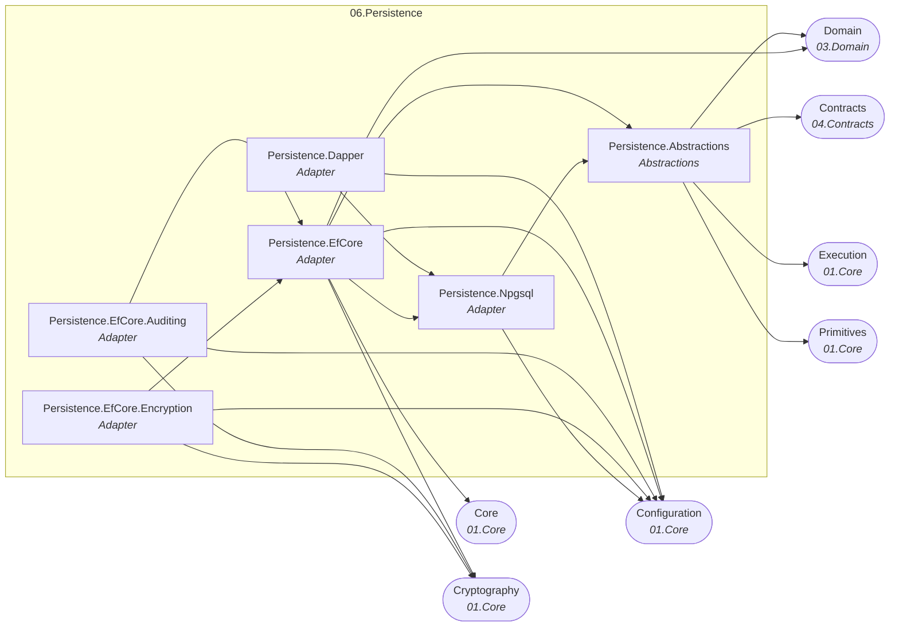
```mermaid
flowchart LR
  subgraph folder_06_Persistence["06.Persistence"]
    SharedKernel_Persistence_Abstractions["Persistence.Abstractions<br/><i>Abstractions</i>"]
    SharedKernel_Persistence_Dapper["Persistence.Dapper<br/><i>Adapter</i>"]
    SharedKernel_Persistence_EfCore["Persistence.EfCore<br/><i>Adapter</i>"]
    SharedKernel_Persistence_EfCore_Auditing["Persistence.EfCore.Auditing<br/><i>Adapter</i>"]
    SharedKernel_Persistence_EfCore_Encryption["Persistence.EfCore.Encryption<br/><i>Adapter</i>"]
    SharedKernel_Persistence_Npgsql["Persistence.Npgsql<br/><i>Adapter</i>"]
  end
  SharedKernel_Configuration(["Configuration<br/><i>01.Core</i>"])
  SharedKernel_Contracts(["Contracts<br/><i>04.Contracts</i>"])
  SharedKernel_Core(["Core<br/><i>01.Core</i>"])
  SharedKernel_Cryptography(["Cryptography<br/><i>01.Core</i>"])
  SharedKernel_Domain(["Domain<br/><i>03.Domain</i>"])
  SharedKernel_Execution(["Execution<br/><i>01.Core</i>"])
  SharedKernel_Primitives(["Primitives<br/><i>01.Core</i>"])
  SharedKernel_Persistence_Abstractions --> SharedKernel_Contracts
  SharedKernel_Persistence_Abstractions --> SharedKernel_Domain
  SharedKernel_Persistence_Abstractions --> SharedKernel_Execution
  SharedKernel_Persistence_Abstractions --> SharedKernel_Primitives
  SharedKernel_Persistence_Dapper --> SharedKernel_Configuration
  SharedKernel_Persistence_Dapper --> SharedKernel_Persistence_Npgsql
  SharedKernel_Persistence_EfCore --> SharedKernel_Configuration
  SharedKernel_Persistence_EfCore --> SharedKernel_Core
  SharedKernel_Persistence_EfCore --> SharedKernel_Cryptography
  SharedKernel_Persistence_EfCore --> SharedKernel_Domain
  SharedKernel_Persistence_EfCore --> SharedKernel_Persistence_Abstractions
  SharedKernel_Persistence_EfCore --> SharedKernel_Persistence_Npgsql
  SharedKernel_Persistence_EfCore_Auditing --> SharedKernel_Configuration
  SharedKernel_Persistence_EfCore_Auditing --> SharedKernel_Cryptography
  SharedKernel_Persistence_EfCore_Auditing --> SharedKernel_Persistence_EfCore
  SharedKernel_Persistence_EfCore_Encryption --> SharedKernel_Configuration
  SharedKernel_Persistence_EfCore_Encryption --> SharedKernel_Cryptography
  SharedKernel_Persistence_EfCore_Encryption --> SharedKernel_Persistence_EfCore
  SharedKernel_Persistence_Npgsql --> SharedKernel_Configuration
  SharedKernel_Persistence_Npgsql --> SharedKernel_Persistence_Abstractions
```

## 07.Messaging

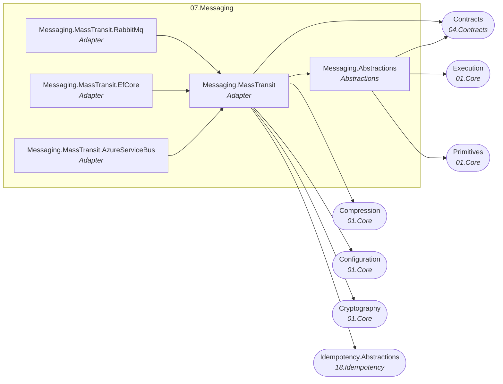
```mermaid
flowchart LR
  subgraph folder_07_Messaging["07.Messaging"]
    SharedKernel_Messaging_Abstractions["Messaging.Abstractions<br/><i>Abstractions</i>"]
    SharedKernel_Messaging_MassTransit["Messaging.MassTransit<br/><i>Adapter</i>"]
    SharedKernel_Messaging_MassTransit_AzureServiceBus["Messaging.MassTransit.AzureServiceBus<br/><i>Adapter</i>"]
    SharedKernel_Messaging_MassTransit_EfCore["Messaging.MassTransit.EfCore<br/><i>Adapter</i>"]
    SharedKernel_Messaging_MassTransit_RabbitMq["Messaging.MassTransit.RabbitMq<br/><i>Adapter</i>"]
  end
  SharedKernel_Compression(["Compression<br/><i>01.Core</i>"])
  SharedKernel_Configuration(["Configuration<br/><i>01.Core</i>"])
  SharedKernel_Contracts(["Contracts<br/><i>04.Contracts</i>"])
  SharedKernel_Cryptography(["Cryptography<br/><i>01.Core</i>"])
  SharedKernel_Execution(["Execution<br/><i>01.Core</i>"])
  SharedKernel_Idempotency_Abstractions(["Idempotency.Abstractions<br/><i>18.Idempotency</i>"])
  SharedKernel_Primitives(["Primitives<br/><i>01.Core</i>"])
  SharedKernel_Messaging_Abstractions --> SharedKernel_Contracts
  SharedKernel_Messaging_Abstractions --> SharedKernel_Execution
  SharedKernel_Messaging_Abstractions --> SharedKernel_Primitives
  SharedKernel_Messaging_MassTransit --> SharedKernel_Compression
  SharedKernel_Messaging_MassTransit --> SharedKernel_Configuration
  SharedKernel_Messaging_MassTransit --> SharedKernel_Contracts
  SharedKernel_Messaging_MassTransit --> SharedKernel_Cryptography
  SharedKernel_Messaging_MassTransit --> SharedKernel_Idempotency_Abstractions
  SharedKernel_Messaging_MassTransit --> SharedKernel_Messaging_Abstractions
  SharedKernel_Messaging_MassTransit_AzureServiceBus --> SharedKernel_Messaging_MassTransit
  SharedKernel_Messaging_MassTransit_EfCore --> SharedKernel_Messaging_MassTransit
  SharedKernel_Messaging_MassTransit_RabbitMq --> SharedKernel_Messaging_MassTransit
```

## 08.Storage

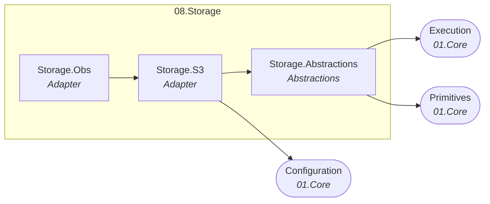
```mermaid
flowchart LR
  subgraph folder_08_Storage["08.Storage"]
    SharedKernel_Storage_Abstractions["Storage.Abstractions<br/><i>Abstractions</i>"]
    SharedKernel_Storage_Obs["Storage.Obs<br/><i>Adapter</i>"]
    SharedKernel_Storage_S3["Storage.S3<br/><i>Adapter</i>"]
  end
  SharedKernel_Configuration(["Configuration<br/><i>01.Core</i>"])
  SharedKernel_Execution(["Execution<br/><i>01.Core</i>"])
  SharedKernel_Primitives(["Primitives<br/><i>01.Core</i>"])
  SharedKernel_Storage_Abstractions --> SharedKernel_Execution
  SharedKernel_Storage_Abstractions --> SharedKernel_Primitives
  SharedKernel_Storage_Obs --> SharedKernel_Storage_S3
  SharedKernel_Storage_S3 --> SharedKernel_Configuration
  SharedKernel_Storage_S3 --> SharedKernel_Storage_Abstractions
```

## 09.Search

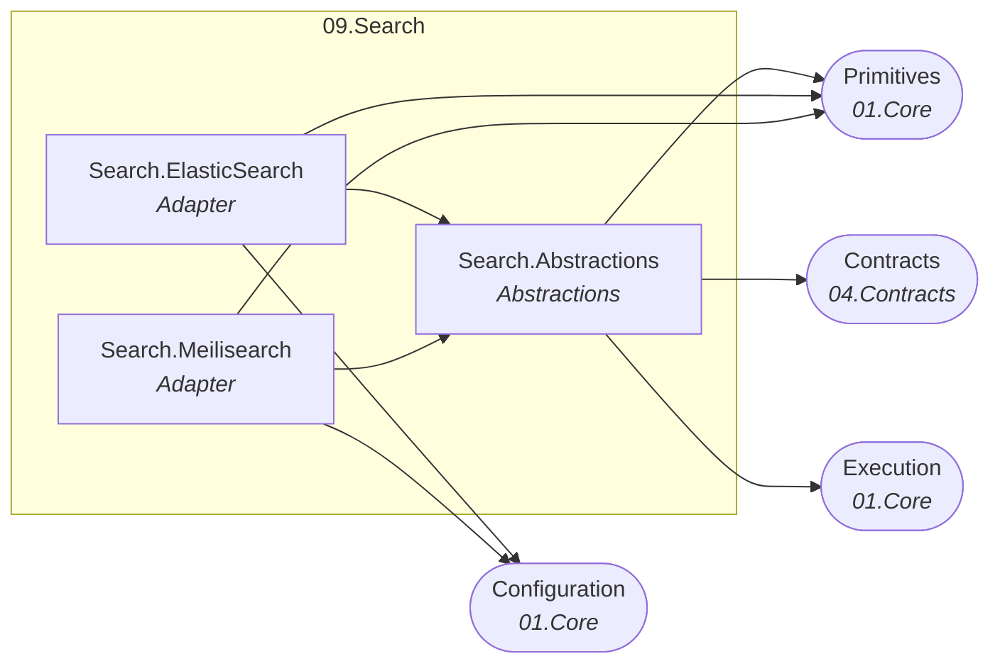
```mermaid
flowchart LR
  subgraph folder_09_Search["09.Search"]
    SharedKernel_Search_Abstractions["Search.Abstractions<br/><i>Abstractions</i>"]
    SharedKernel_Search_ElasticSearch["Search.ElasticSearch<br/><i>Adapter</i>"]
    SharedKernel_Search_Meilisearch["Search.Meilisearch<br/><i>Adapter</i>"]
  end
  SharedKernel_Configuration(["Configuration<br/><i>01.Core</i>"])
  SharedKernel_Contracts(["Contracts<br/><i>04.Contracts</i>"])
  SharedKernel_Execution(["Execution<br/><i>01.Core</i>"])
  SharedKernel_Primitives(["Primitives<br/><i>01.Core</i>"])
  SharedKernel_Search_Abstractions --> SharedKernel_Contracts
  SharedKernel_Search_Abstractions --> SharedKernel_Execution
  SharedKernel_Search_Abstractions --> SharedKernel_Primitives
  SharedKernel_Search_ElasticSearch --> SharedKernel_Configuration
  SharedKernel_Search_ElasticSearch --> SharedKernel_Primitives
  SharedKernel_Search_ElasticSearch --> SharedKernel_Search_Abstractions
  SharedKernel_Search_Meilisearch --> SharedKernel_Configuration
  SharedKernel_Search_Meilisearch --> SharedKernel_Primitives
  SharedKernel_Search_Meilisearch --> SharedKernel_Search_Abstractions
```

## 10.Intelligence

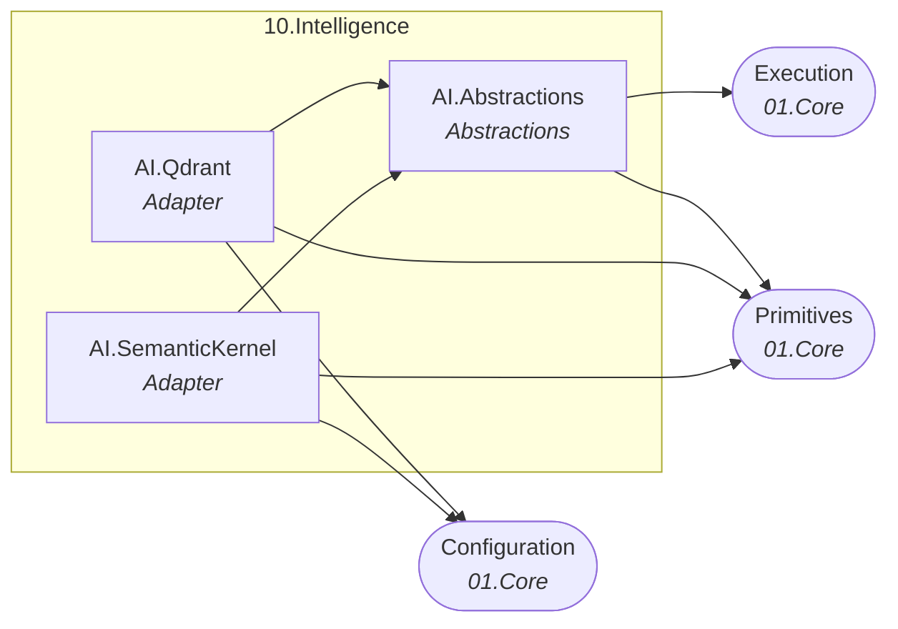
```mermaid
flowchart LR
  subgraph folder_10_Intelligence["10.Intelligence"]
    SharedKernel_AI_Abstractions["AI.Abstractions<br/><i>Abstractions</i>"]
    SharedKernel_AI_Qdrant["AI.Qdrant<br/><i>Adapter</i>"]
    SharedKernel_AI_SemanticKernel["AI.SemanticKernel<br/><i>Adapter</i>"]
  end
  SharedKernel_Configuration(["Configuration<br/><i>01.Core</i>"])
  SharedKernel_Execution(["Execution<br/><i>01.Core</i>"])
  SharedKernel_Primitives(["Primitives<br/><i>01.Core</i>"])
  SharedKernel_AI_Abstractions --> SharedKernel_Execution
  SharedKernel_AI_Abstractions --> SharedKernel_Primitives
  SharedKernel_AI_Qdrant --> SharedKernel_AI_Abstractions
  SharedKernel_AI_Qdrant --> SharedKernel_Configuration
  SharedKernel_AI_Qdrant --> SharedKernel_Primitives
  SharedKernel_AI_SemanticKernel --> SharedKernel_AI_Abstractions
  SharedKernel_AI_SemanticKernel --> SharedKernel_Configuration
  SharedKernel_AI_SemanticKernel --> SharedKernel_Primitives
```

## 11.Communication

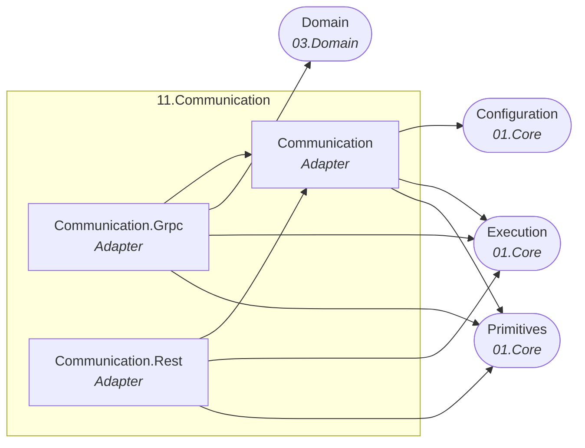
```mermaid
flowchart LR
  subgraph folder_11_Communication["11.Communication"]
    SharedKernel_Communication["Communication<br/><i>Adapter</i>"]
    SharedKernel_Communication_Grpc["Communication.Grpc<br/><i>Adapter</i>"]
    SharedKernel_Communication_Rest["Communication.Rest<br/><i>Adapter</i>"]
  end
  SharedKernel_Configuration(["Configuration<br/><i>01.Core</i>"])
  SharedKernel_Domain(["Domain<br/><i>03.Domain</i>"])
  SharedKernel_Execution(["Execution<br/><i>01.Core</i>"])
  SharedKernel_Primitives(["Primitives<br/><i>01.Core</i>"])
  SharedKernel_Communication --> SharedKernel_Configuration
  SharedKernel_Communication --> SharedKernel_Execution
  SharedKernel_Communication --> SharedKernel_Primitives
  SharedKernel_Communication_Grpc --> SharedKernel_Communication
  SharedKernel_Communication_Grpc --> SharedKernel_Domain
  SharedKernel_Communication_Grpc --> SharedKernel_Execution
  SharedKernel_Communication_Grpc --> SharedKernel_Primitives
  SharedKernel_Communication_Rest --> SharedKernel_Communication
  SharedKernel_Communication_Rest --> SharedKernel_Execution
  SharedKernel_Communication_Rest --> SharedKernel_Primitives
```

## 12.Security

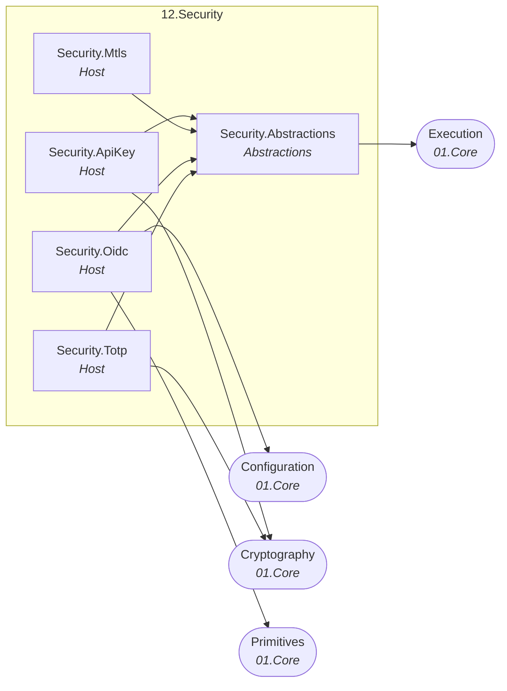
```mermaid
flowchart LR
  subgraph folder_12_Security["12.Security"]
    SharedKernel_Security_Abstractions["Security.Abstractions<br/><i>Abstractions</i>"]
    SharedKernel_Security_ApiKey["Security.ApiKey<br/><i>Host</i>"]
    SharedKernel_Security_Mtls["Security.Mtls<br/><i>Host</i>"]
    SharedKernel_Security_Oidc["Security.Oidc<br/><i>Host</i>"]
    SharedKernel_Security_Totp["Security.Totp<br/><i>Host</i>"]
  end
  SharedKernel_Configuration(["Configuration<br/><i>01.Core</i>"])
  SharedKernel_Cryptography(["Cryptography<br/><i>01.Core</i>"])
  SharedKernel_Execution(["Execution<br/><i>01.Core</i>"])
  SharedKernel_Primitives(["Primitives<br/><i>01.Core</i>"])
  SharedKernel_Security_Abstractions --> SharedKernel_Execution
  SharedKernel_Security_ApiKey --> SharedKernel_Cryptography
  SharedKernel_Security_ApiKey --> SharedKernel_Security_Abstractions
  SharedKernel_Security_Mtls --> SharedKernel_Security_Abstractions
  SharedKernel_Security_Oidc --> SharedKernel_Configuration
  SharedKernel_Security_Oidc --> SharedKernel_Primitives
  SharedKernel_Security_Oidc --> SharedKernel_Security_Abstractions
  SharedKernel_Security_Totp --> SharedKernel_Cryptography
  SharedKernel_Security_Totp --> SharedKernel_Security_Abstractions
```

## 13.ServiceDefaults

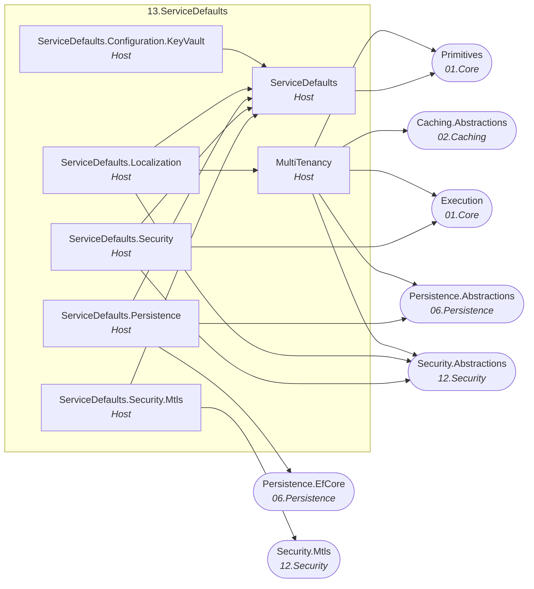
```mermaid
flowchart LR
  subgraph folder_13_ServiceDefaults["13.ServiceDefaults"]
    SharedKernel_MultiTenancy["MultiTenancy<br/><i>Host</i>"]
    SharedKernel_ServiceDefaults["ServiceDefaults<br/><i>Host</i>"]
    SharedKernel_ServiceDefaults_Configuration_KeyVault["ServiceDefaults.Configuration.KeyVault<br/><i>Host</i>"]
    SharedKernel_ServiceDefaults_Localization["ServiceDefaults.Localization<br/><i>Host</i>"]
    SharedKernel_ServiceDefaults_Persistence["ServiceDefaults.Persistence<br/><i>Host</i>"]
    SharedKernel_ServiceDefaults_Security["ServiceDefaults.Security<br/><i>Host</i>"]
    SharedKernel_ServiceDefaults_Security_Mtls["ServiceDefaults.Security.Mtls<br/><i>Host</i>"]
  end
  SharedKernel_Caching_Abstractions(["Caching.Abstractions<br/><i>02.Caching</i>"])
  SharedKernel_Execution(["Execution<br/><i>01.Core</i>"])
  SharedKernel_Persistence_Abstractions(["Persistence.Abstractions<br/><i>06.Persistence</i>"])
  SharedKernel_Persistence_EfCore(["Persistence.EfCore<br/><i>06.Persistence</i>"])
  SharedKernel_Primitives(["Primitives<br/><i>01.Core</i>"])
  SharedKernel_Security_Abstractions(["Security.Abstractions<br/><i>12.Security</i>"])
  SharedKernel_Security_Mtls(["Security.Mtls<br/><i>12.Security</i>"])
  SharedKernel_MultiTenancy --> SharedKernel_Caching_Abstractions
  SharedKernel_MultiTenancy --> SharedKernel_Execution
  SharedKernel_MultiTenancy --> SharedKernel_Persistence_Abstractions
  SharedKernel_MultiTenancy --> SharedKernel_Primitives
  SharedKernel_MultiTenancy --> SharedKernel_Security_Abstractions
  SharedKernel_ServiceDefaults --> SharedKernel_Primitives
  SharedKernel_ServiceDefaults_Configuration_KeyVault --> SharedKernel_ServiceDefaults
  SharedKernel_ServiceDefaults_Localization --> SharedKernel_MultiTenancy
  SharedKernel_ServiceDefaults_Localization --> SharedKernel_Security_Abstractions
  SharedKernel_ServiceDefaults_Localization --> SharedKernel_ServiceDefaults
  SharedKernel_ServiceDefaults_Persistence --> SharedKernel_Persistence_Abstractions
  SharedKernel_ServiceDefaults_Persistence --> SharedKernel_Persistence_EfCore
  SharedKernel_ServiceDefaults_Persistence --> SharedKernel_ServiceDefaults
  SharedKernel_ServiceDefaults_Security --> SharedKernel_Execution
  SharedKernel_ServiceDefaults_Security --> SharedKernel_Security_Abstractions
  SharedKernel_ServiceDefaults_Security --> SharedKernel_ServiceDefaults
  SharedKernel_ServiceDefaults_Security_Mtls --> SharedKernel_Security_Mtls
  SharedKernel_ServiceDefaults_Security_Mtls --> SharedKernel_ServiceDefaults
```

## 14.Presentation

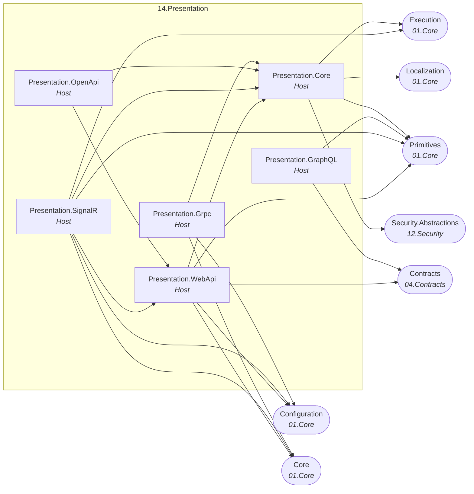
```mermaid
flowchart LR
  subgraph folder_14_Presentation["14.Presentation"]
    SharedKernel_Presentation_Core["Presentation.Core<br/><i>Host</i>"]
    SharedKernel_Presentation_GraphQL["Presentation.GraphQL<br/><i>Host</i>"]
    SharedKernel_Presentation_Grpc["Presentation.Grpc<br/><i>Host</i>"]
    SharedKernel_Presentation_OpenApi["Presentation.OpenApi<br/><i>Host</i>"]
    SharedKernel_Presentation_SignalR["Presentation.SignalR<br/><i>Host</i>"]
    SharedKernel_Presentation_WebApi["Presentation.WebApi<br/><i>Host</i>"]
  end
  SharedKernel_Configuration(["Configuration<br/><i>01.Core</i>"])
  SharedKernel_Contracts(["Contracts<br/><i>04.Contracts</i>"])
  SharedKernel_Core(["Core<br/><i>01.Core</i>"])
  SharedKernel_Execution(["Execution<br/><i>01.Core</i>"])
  SharedKernel_Localization(["Localization<br/><i>01.Core</i>"])
  SharedKernel_Primitives(["Primitives<br/><i>01.Core</i>"])
  SharedKernel_Security_Abstractions(["Security.Abstractions<br/><i>12.Security</i>"])
  SharedKernel_Presentation_Core --> SharedKernel_Execution
  SharedKernel_Presentation_Core --> SharedKernel_Localization
  SharedKernel_Presentation_Core --> SharedKernel_Primitives
  SharedKernel_Presentation_Core --> SharedKernel_Security_Abstractions
  SharedKernel_Presentation_GraphQL --> SharedKernel_Contracts
  SharedKernel_Presentation_GraphQL --> SharedKernel_Primitives
  SharedKernel_Presentation_Grpc --> SharedKernel_Configuration
  SharedKernel_Presentation_Grpc --> SharedKernel_Core
  SharedKernel_Presentation_Grpc --> SharedKernel_Presentation_Core
  SharedKernel_Presentation_OpenApi --> SharedKernel_Presentation_Core
  SharedKernel_Presentation_OpenApi --> SharedKernel_Presentation_WebApi
  SharedKernel_Presentation_SignalR --> SharedKernel_Configuration
  SharedKernel_Presentation_SignalR --> SharedKernel_Core
  SharedKernel_Presentation_SignalR --> SharedKernel_Execution
  SharedKernel_Presentation_SignalR --> SharedKernel_Presentation_Core
  SharedKernel_Presentation_SignalR --> SharedKernel_Presentation_WebApi
  SharedKernel_Presentation_SignalR --> SharedKernel_Primitives
  SharedKernel_Presentation_WebApi --> SharedKernel_Configuration
  SharedKernel_Presentation_WebApi --> SharedKernel_Contracts
  SharedKernel_Presentation_WebApi --> SharedKernel_Core
  SharedKernel_Presentation_WebApi --> SharedKernel_Presentation_Core
  SharedKernel_Presentation_WebApi --> SharedKernel_Primitives
```

## 15.Integration

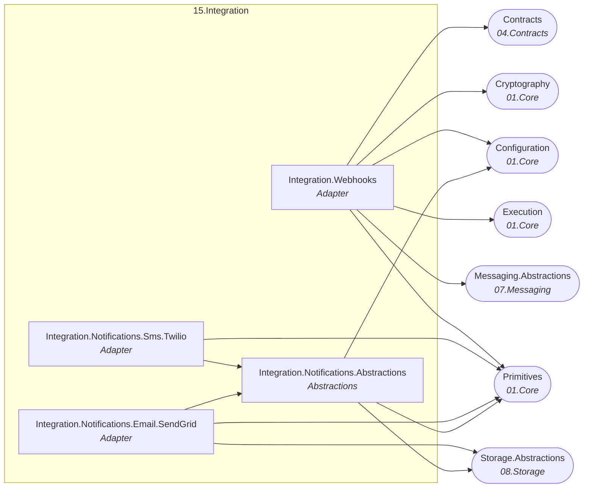
```mermaid
flowchart LR
  subgraph folder_15_Integration["15.Integration"]
    SharedKernel_Integration_Notifications_Abstractions["Integration.Notifications.Abstractions<br/><i>Abstractions</i>"]
    SharedKernel_Integration_Notifications_Email_SendGrid["Integration.Notifications.Email.SendGrid<br/><i>Adapter</i>"]
    SharedKernel_Integration_Notifications_Sms_Twilio["Integration.Notifications.Sms.Twilio<br/><i>Adapter</i>"]
    SharedKernel_Integration_Webhooks["Integration.Webhooks<br/><i>Adapter</i>"]
  end
  SharedKernel_Configuration(["Configuration<br/><i>01.Core</i>"])
  SharedKernel_Contracts(["Contracts<br/><i>04.Contracts</i>"])
  SharedKernel_Cryptography(["Cryptography<br/><i>01.Core</i>"])
  SharedKernel_Execution(["Execution<br/><i>01.Core</i>"])
  SharedKernel_Messaging_Abstractions(["Messaging.Abstractions<br/><i>07.Messaging</i>"])
  SharedKernel_Primitives(["Primitives<br/><i>01.Core</i>"])
  SharedKernel_Storage_Abstractions(["Storage.Abstractions<br/><i>08.Storage</i>"])
  SharedKernel_Integration_Notifications_Abstractions --> SharedKernel_Configuration
  SharedKernel_Integration_Notifications_Abstractions --> SharedKernel_Primitives
  SharedKernel_Integration_Notifications_Abstractions --> SharedKernel_Storage_Abstractions
  SharedKernel_Integration_Notifications_Email_SendGrid --> SharedKernel_Integration_Notifications_Abstractions
  SharedKernel_Integration_Notifications_Email_SendGrid --> SharedKernel_Primitives
  SharedKernel_Integration_Notifications_Email_SendGrid --> SharedKernel_Storage_Abstractions
  SharedKernel_Integration_Notifications_Sms_Twilio --> SharedKernel_Integration_Notifications_Abstractions
  SharedKernel_Integration_Notifications_Sms_Twilio --> SharedKernel_Primitives
  SharedKernel_Integration_Webhooks --> SharedKernel_Configuration
  SharedKernel_Integration_Webhooks --> SharedKernel_Contracts
  SharedKernel_Integration_Webhooks --> SharedKernel_Cryptography
  SharedKernel_Integration_Webhooks --> SharedKernel_Execution
  SharedKernel_Integration_Webhooks --> SharedKernel_Messaging_Abstractions
  SharedKernel_Integration_Webhooks --> SharedKernel_Primitives
```

## 16.Testing

```mermaid
flowchart LR
  subgraph folder_16_Testing["16.Testing"]
    SharedKernel_AI_Testing["AI.Testing<br/><i>Testing</i>"]
    SharedKernel_Application_Testing["Application.Testing<br/><i>Testing</i>"]
    SharedKernel_Caching_Redis_Testing["Caching.Redis.Testing<br/><i>Testing</i>"]
    SharedKernel_Caching_Testing["Caching.Testing<br/><i>Testing</i>"]
    SharedKernel_Communication_Testing["Communication.Testing<br/><i>Testing</i>"]
    SharedKernel_Cryptography_Testing["Cryptography.Testing<br/><i>Testing</i>"]
    SharedKernel_FeatureManagement_Testing["FeatureManagement.Testing<br/><i>Testing</i>"]
    SharedKernel_Idempotency_Testing["Idempotency.Testing<br/><i>Testing</i>"]
    SharedKernel_Integration_Testing["Integration.Testing<br/><i>Testing</i>"]
    SharedKernel_Messaging_Testing["Messaging.Testing<br/><i>Testing</i>"]
    SharedKernel_Persistence_Testing["Persistence.Testing<br/><i>Testing</i>"]
    SharedKernel_Presentation_Testing["Presentation.Testing<br/><i>Testing</i>"]
    SharedKernel_Reporting_Testing["Reporting.Testing<br/><i>Testing</i>"]
    SharedKernel_Scheduling_Testing["Scheduling.Testing<br/><i>Testing</i>"]
    SharedKernel_Search_Testing["Search.Testing<br/><i>Testing</i>"]
    SharedKernel_Security_Testing["Security.Testing<br/><i>Testing</i>"]
    SharedKernel_ServiceDefaults_Testing["ServiceDefaults.Testing<br/><i>Testing</i>"]
    SharedKernel_Storage_Testing["Storage.Testing<br/><i>Testing</i>"]
    SharedKernel_Testing["Testing<br/><i>Testing</i>"]
    SharedKernel_Workflows_Testing["Workflows.Testing<br/><i>Testing</i>"]
  end
  SharedKernel_AI_Abstractions(["AI.Abstractions<br/><i>10.Intelligence</i>"])
  SharedKernel_Application_Mediator_MediatR(["Application.Mediator.MediatR<br/><i>05.Application</i>"])
  SharedKernel_Application_Pipeline(["Application.Pipeline<br/><i>05.Application</i>"])
  SharedKernel_Caching_Abstractions(["Caching.Abstractions<br/><i>02.Caching</i>"])
  SharedKernel_Caching_Redis_HashStore(["Caching.Redis.HashStore<br/><i>02.Caching</i>"])
  SharedKernel_Caching_Redis_PubSub(["Caching.Redis.PubSub<br/><i>02.Caching</i>"])
  SharedKernel_Communication(["Communication<br/><i>11.Communication</i>"])
  SharedKernel_Contracts(["Contracts<br/><i>04.Contracts</i>"])
  SharedKernel_Cryptography(["Cryptography<br/><i>01.Core</i>"])
  SharedKernel_DataPrivacy(["DataPrivacy<br/><i>01.Core</i>"])
  SharedKernel_Domain(["Domain<br/><i>03.Domain</i>"])
  SharedKernel_Execution(["Execution<br/><i>01.Core</i>"])
  SharedKernel_FeatureManagement(["FeatureManagement<br/><i>01.Core</i>"])
  SharedKernel_Idempotency_Abstractions(["Idempotency.Abstractions<br/><i>18.Idempotency</i>"])
  SharedKernel_Integration_Notifications_Abstractions(["Integration.Notifications.Abstractions<br/><i>15.Integration</i>"])
  SharedKernel_Integration_Webhooks(["Integration.Webhooks<br/><i>15.Integration</i>"])
  SharedKernel_Messaging_Abstractions(["Messaging.Abstractions<br/><i>07.Messaging</i>"])
  SharedKernel_MultiTenancy(["MultiTenancy<br/><i>13.ServiceDefaults</i>"])
  SharedKernel_Persistence_Abstractions(["Persistence.Abstractions<br/><i>06.Persistence</i>"])
  SharedKernel_Persistence_EfCore(["Persistence.EfCore<br/><i>06.Persistence</i>"])
  SharedKernel_Persistence_EfCore_Auditing(["Persistence.EfCore.Auditing<br/><i>06.Persistence</i>"])
  SharedKernel_Persistence_EfCore_Encryption(["Persistence.EfCore.Encryption<br/><i>06.Persistence</i>"])
  SharedKernel_Presentation_Grpc(["Presentation.Grpc<br/><i>14.Presentation</i>"])
  SharedKernel_Primitives(["Primitives<br/><i>01.Core</i>"])
  SharedKernel_Reporting_Abstractions(["Reporting.Abstractions<br/><i>20.Reporting</i>"])
  SharedKernel_Scheduling(["Scheduling<br/><i>19.Scheduling</i>"])
  SharedKernel_Search_Abstractions(["Search.Abstractions<br/><i>09.Search</i>"])
  SharedKernel_Security_Abstractions(["Security.Abstractions<br/><i>12.Security</i>"])
  SharedKernel_Security_ApiKey(["Security.ApiKey<br/><i>12.Security</i>"])
  SharedKernel_Security_Oidc(["Security.Oidc<br/><i>12.Security</i>"])
  SharedKernel_Security_Totp(["Security.Totp<br/><i>12.Security</i>"])
  SharedKernel_Storage_Abstractions(["Storage.Abstractions<br/><i>08.Storage</i>"])
  SharedKernel_Validation(["Validation<br/><i>01.Core</i>"])
  SharedKernel_Workflows_Temporal(["Workflows.Temporal<br/><i>17.Workflows</i>"])
  SharedKernel_AI_Testing --> SharedKernel_AI_Abstractions
  SharedKernel_Application_Testing --> SharedKernel_Application_Mediator_MediatR
  SharedKernel_Application_Testing --> SharedKernel_Application_Pipeline
  SharedKernel_Application_Testing --> SharedKernel_Idempotency_Testing
  SharedKernel_Application_Testing --> SharedKernel_Persistence_Testing
  SharedKernel_Application_Testing --> SharedKernel_Testing
  SharedKernel_Caching_Redis_Testing --> SharedKernel_Caching_Redis_HashStore
  SharedKernel_Caching_Redis_Testing --> SharedKernel_Caching_Redis_PubSub
  SharedKernel_Caching_Testing --> SharedKernel_Caching_Abstractions
  SharedKernel_Communication_Testing --> SharedKernel_Communication
  SharedKernel_Communication_Testing --> SharedKernel_Primitives
  SharedKernel_Cryptography_Testing --> SharedKernel_Cryptography
  SharedKernel_Cryptography_Testing --> SharedKernel_Testing
  SharedKernel_FeatureManagement_Testing --> SharedKernel_FeatureManagement
  SharedKernel_Idempotency_Testing --> SharedKernel_Idempotency_Abstractions
  SharedKernel_Integration_Testing --> SharedKernel_Contracts
  SharedKernel_Integration_Testing --> SharedKernel_Integration_Notifications_Abstractions
  SharedKernel_Integration_Testing --> SharedKernel_Integration_Webhooks
  SharedKernel_Messaging_Testing --> SharedKernel_Contracts
  SharedKernel_Messaging_Testing --> SharedKernel_Messaging_Abstractions
  SharedKernel_Persistence_Testing --> SharedKernel_Persistence_Abstractions
  SharedKernel_Persistence_Testing --> SharedKernel_Persistence_EfCore
  SharedKernel_Persistence_Testing --> SharedKernel_Persistence_EfCore_Auditing
  SharedKernel_Persistence_Testing --> SharedKernel_Persistence_EfCore_Encryption
  SharedKernel_Persistence_Testing --> SharedKernel_Testing
  SharedKernel_Presentation_Testing --> SharedKernel_Execution
  SharedKernel_Presentation_Testing --> SharedKernel_Presentation_Grpc
  SharedKernel_Reporting_Testing --> SharedKernel_Reporting_Abstractions
  SharedKernel_Reporting_Testing --> SharedKernel_Storage_Abstractions
  SharedKernel_Reporting_Testing --> SharedKernel_Testing
  SharedKernel_Scheduling_Testing --> SharedKernel_Scheduling
  SharedKernel_Search_Testing --> SharedKernel_Search_Abstractions
  SharedKernel_Security_Testing --> SharedKernel_Security_Abstractions
  SharedKernel_Security_Testing --> SharedKernel_Security_ApiKey
  SharedKernel_Security_Testing --> SharedKernel_Security_Oidc
  SharedKernel_Security_Testing --> SharedKernel_Security_Totp
  SharedKernel_ServiceDefaults_Testing --> SharedKernel_MultiTenancy
  SharedKernel_Storage_Testing --> SharedKernel_Storage_Abstractions
  SharedKernel_Testing --> SharedKernel_Contracts
  SharedKernel_Testing --> SharedKernel_DataPrivacy
  SharedKernel_Testing --> SharedKernel_Domain
  SharedKernel_Testing --> SharedKernel_Execution
  SharedKernel_Testing --> SharedKernel_Primitives
  SharedKernel_Testing --> SharedKernel_Validation
  SharedKernel_Workflows_Testing --> SharedKernel_Workflows_Temporal
```

## 17.Workflows

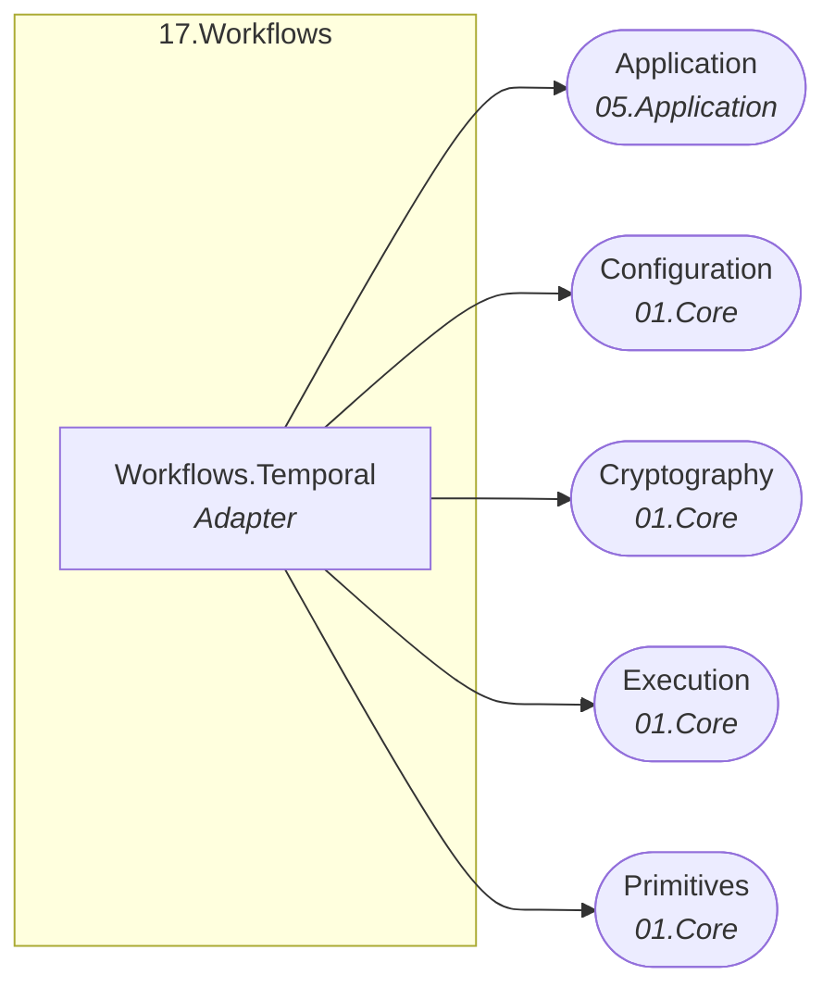
```mermaid
flowchart LR
  subgraph folder_17_Workflows["17.Workflows"]
    SharedKernel_Workflows_Temporal["Workflows.Temporal<br/><i>Adapter</i>"]
  end
  SharedKernel_Application(["Application<br/><i>05.Application</i>"])
  SharedKernel_Configuration(["Configuration<br/><i>01.Core</i>"])
  SharedKernel_Cryptography(["Cryptography<br/><i>01.Core</i>"])
  SharedKernel_Execution(["Execution<br/><i>01.Core</i>"])
  SharedKernel_Primitives(["Primitives<br/><i>01.Core</i>"])
  SharedKernel_Workflows_Temporal --> SharedKernel_Application
  SharedKernel_Workflows_Temporal --> SharedKernel_Configuration
  SharedKernel_Workflows_Temporal --> SharedKernel_Cryptography
  SharedKernel_Workflows_Temporal --> SharedKernel_Execution
  SharedKernel_Workflows_Temporal --> SharedKernel_Primitives
```

## 18.Idempotency

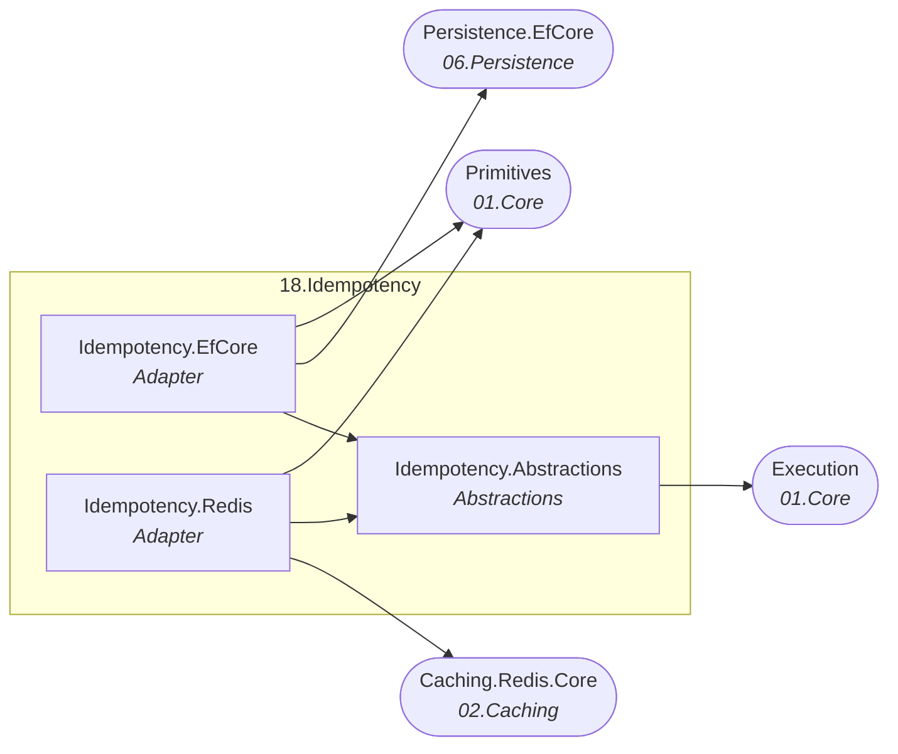
```mermaid
flowchart LR
  subgraph folder_18_Idempotency["18.Idempotency"]
    SharedKernel_Idempotency_Abstractions["Idempotency.Abstractions<br/><i>Abstractions</i>"]
    SharedKernel_Idempotency_EfCore["Idempotency.EfCore<br/><i>Adapter</i>"]
    SharedKernel_Idempotency_Redis["Idempotency.Redis<br/><i>Adapter</i>"]
  end
  SharedKernel_Caching_Redis_Core(["Caching.Redis.Core<br/><i>02.Caching</i>"])
  SharedKernel_Execution(["Execution<br/><i>01.Core</i>"])
  SharedKernel_Persistence_EfCore(["Persistence.EfCore<br/><i>06.Persistence</i>"])
  SharedKernel_Primitives(["Primitives<br/><i>01.Core</i>"])
  SharedKernel_Idempotency_Abstractions --> SharedKernel_Execution
  SharedKernel_Idempotency_EfCore --> SharedKernel_Idempotency_Abstractions
  SharedKernel_Idempotency_EfCore --> SharedKernel_Persistence_EfCore
  SharedKernel_Idempotency_EfCore --> SharedKernel_Primitives
  SharedKernel_Idempotency_Redis --> SharedKernel_Caching_Redis_Core
  SharedKernel_Idempotency_Redis --> SharedKernel_Idempotency_Abstractions
  SharedKernel_Idempotency_Redis --> SharedKernel_Primitives
```

## 19.Scheduling

```mermaid
flowchart LR
  subgraph folder_19_Scheduling["19.Scheduling"]
    SharedKernel_Scheduling["Scheduling<br/><i>Adapter</i>"]
  end
  SharedKernel_Application(["Application<br/><i>05.Application</i>"])
  SharedKernel_Caching_Abstractions(["Caching.Abstractions<br/><i>02.Caching</i>"])
  SharedKernel_Configuration(["Configuration<br/><i>01.Core</i>"])
  SharedKernel_Execution(["Execution<br/><i>01.Core</i>"])
  SharedKernel_Primitives(["Primitives<br/><i>01.Core</i>"])
  SharedKernel_Scheduling --> SharedKernel_Application
  SharedKernel_Scheduling --> SharedKernel_Caching_Abstractions
  SharedKernel_Scheduling --> SharedKernel_Configuration
  SharedKernel_Scheduling --> SharedKernel_Execution
  SharedKernel_Scheduling --> SharedKernel_Primitives
```

## 20.Reporting

```mermaid
flowchart LR
  subgraph folder_20_Reporting["20.Reporting"]
    SharedKernel_Reporting_Abstractions["Reporting.Abstractions<br/><i>Abstractions</i>"]
    SharedKernel_Reporting_Csv["Reporting.Csv<br/><i>Adapter</i>"]
    SharedKernel_Reporting_Gotenberg["Reporting.Gotenberg<br/><i>Adapter</i>"]
    SharedKernel_Reporting_Pdf["Reporting.Pdf<br/><i>Adapter</i>"]
    SharedKernel_Reporting_Spreadsheet["Reporting.Spreadsheet<br/><i>Adapter</i>"]
  end
  SharedKernel_Configuration(["Configuration<br/><i>01.Core</i>"])
  SharedKernel_Execution(["Execution<br/><i>01.Core</i>"])
  SharedKernel_Primitives(["Primitives<br/><i>01.Core</i>"])
  SharedKernel_Storage_Abstractions(["Storage.Abstractions<br/><i>08.Storage</i>"])
  SharedKernel_Reporting_Abstractions --> SharedKernel_Primitives
  SharedKernel_Reporting_Abstractions --> SharedKernel_Storage_Abstractions
  SharedKernel_Reporting_Csv --> SharedKernel_Configuration
  SharedKernel_Reporting_Csv --> SharedKernel_Reporting_Abstractions
  SharedKernel_Reporting_Gotenberg --> SharedKernel_Configuration
  SharedKernel_Reporting_Gotenberg --> SharedKernel_Execution
  SharedKernel_Reporting_Gotenberg --> SharedKernel_Reporting_Abstractions
  SharedKernel_Reporting_Pdf --> SharedKernel_Configuration
  SharedKernel_Reporting_Pdf --> SharedKernel_Reporting_Abstractions
  SharedKernel_Reporting_Spreadsheet --> SharedKernel_Configuration
  SharedKernel_Reporting_Spreadsheet --> SharedKernel_Reporting_Abstractions
```
