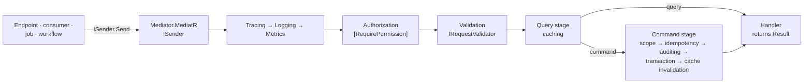

<div align="center">

# SharedKernel Application

**The CQRS layer for .NET services — a kernel-owned command and query vocabulary with no mediator library in it, and
the cross-cutting work every handler would otherwise repeat (tracing, logging, metrics, authorization, validation,
idempotency, transactions, auditing, caching) composed in one fixed order.**

[](https://dotnet.microsoft.com/)
[](../../LICENSE)


[Packages](#packages) · [How it fits together](#how-it-fits-together) · [Get started](#get-started) ·
[See it run](#see-it-run) · [Guarantees](#guarantees)

<sub>📂 <code>src/Application</code> · domain <code>05.Application</code> · <a href="../../docs/packages.md">all packages by tier</a></sub>

</div>

---

## What this domain gives you

- **Handlers that only decide.** A command or query handler returns a `Result`; permission checks, validation,
  commits, audit entries, idempotency and cache eviction are pipeline behaviors a request opts into by declaring an
  attribute or a marker interface.
- **Application projects free of MediatR.** `ICommand`, `IQuery`, `ISender` and `IPipelineBehavior` are kernel
  contracts; MediatR 12.4.1 (the last MIT release) is only the transport, in one adapter package.
- **One registration, one order.** `AddSharedKernelApplication(assemblies, app => …)` finds handlers, validators and
  domain-event handlers, and places every behavior in a fixed order; missing infrastructure fails the host start with
  one message naming every missing service.
- **Authorization that cannot be forgotten.** `[RequirePermission]` on a use case is enforced on every path — HTTP, a
  consumed message, a scheduled job, a workflow activity.
- **Commit-aware side effects.** Only the outermost command commits; `ICommandScope.OnCompleted` and cache eviction run
  after the commit, never before it.

## Packages

| Package | Tier | When you need it |
| --- | --- | --- |
| [SharedKernel.Application](SharedKernel.Application/README.md) | Abstractions | Always, in the **Application** project — commands, queries, handlers, `ISender`, validators, domain-event handlers, `[RequirePermission]` and every pipeline marker |
| [SharedKernel.Application.Pipeline](SharedKernel.Application.Pipeline/README.md) | Host | In the **Api**/**Worker** project — the one registration call and the behaviors (tracing, logging, metrics, authorization, validation always on; idempotency, transactions, auditing opt-in) |
| [SharedKernel.Application.Mediator.MediatR](SharedKernel.Application.Mediator.MediatR/README.md) | Host | In the **Api**/**Worker** project — `app.UseMediatR()`, the `ISender` transport |
| [SharedKernel.Application.Pipeline.Caching](SharedKernel.Application.Pipeline.Caching/README.md) | Host | When a measured read is worth caching — `app.WithCaching()`: `ICacheableQuery<T>` caching and post-commit `IInvalidatesCache` eviction |

Related packages (the `.Testing` test double lives in this folder):

| Package | Adds |
| --- | --- |
| [SharedKernel.Execution](../Foundation/SharedKernel.Execution/README.md) | The contracts the behaviors consume: `IRequestContext` (the caller), `IUnitOfWork`, `IAuditTrailWriter` |
| [SharedKernel.Validation.FluentValidation](../Foundation/SharedKernel.Validation.FluentValidation/README.md) | `AddFluentValidationRequestValidators(assembly)` — FluentValidation validators as `IRequestValidator<T>` |
| [SharedKernel.Idempotency.Abstractions](../Infrastructure/Idempotency/SharedKernel.Idempotency.Abstractions/README.md) | `IIdempotencyStore`, implemented by `Idempotency.Redis` and `Idempotency.EfCore` |
| [SharedKernel.Application.Testing](./SharedKernel.Application.Testing/README.md) | `ApplicationPipelineTestHarness` — the composed pipeline in a unit test, with or without a mediator |

## How it fits together



- **The order is fixed**, whatever order the `With…` calls come in. Authorization precedes validation (a caller who
  may not act should not learn the rules); the transaction wraps the handler; post-commit callbacks run last.
- **Behaviors consume contracts, never infrastructure.** `IRequestContext`, `IUnitOfWork` and `IAuditTrailWriter`
  come from `SharedKernel.Execution`, `IIdempotencyStore` from `SharedKernel.Idempotency.Abstractions`, `ICacheService`
  from `SharedKernel.Caching.Abstractions`. The persistence, security, idempotency and caching packages implement
  them; no package here references those implementations.
- **Tiers are enforced by the build.** The Application project may reference only Foundation, Model and Abstractions
  packages — never MediatR, never an adapter.

## Get started

```xml
<!-- Application project -->
<PackageReference Include="SharedKernel.Application" />

<!-- Api / Worker project -->
<PackageReference Include="SharedKernel.Application.Pipeline" />
<PackageReference Include="SharedKernel.Application.Mediator.MediatR" />
```

```csharp
// Application project
using SharedKernel.Application.Authorization;
using SharedKernel.Application.Messaging;
using SharedKernel.Primitives.Errors;
using SharedKernel.Primitives.Results;

[RequirePermission("orders.cancel")]
public sealed record CancelOrderCommand(Guid OrderId) : ICommand;

internal sealed class CancelOrderHandler(IOrderRepository orders) : ICommandHandler<CancelOrderCommand>
{
    public async Task<Result> Handle(CancelOrderCommand command, CancellationToken ct)
    {
        // No permission check, no validation, no try/catch, no SaveChanges.
        var order = await orders.FindAsync(command.OrderId, ct);
        return order is null
            ? Result.Failure(Error.NotFound("order.not_found", "The order does not exist."))
            : order.Cancel();
    }
}
```

```csharp
// Api project
using SharedKernel.Application.Mediator.MediatR;
using SharedKernel.Application.Pipeline;

builder.Services.AddSharedKernelRequestContext();    // IRequestContext, required by [RequirePermission]
builder.Services.AddSharedKernelApplication(typeof(CancelOrderHandler).Assembly, app => app
    .UseMediatR()
    .WithTransactions());                            // needs IUnitOfWork, e.g. from SharedKernel.Persistence.EfCore
```

```text
unauthenticated caller      -> 401 unauthorized.default                handler never runs
missing orders.cancel       -> 403 forbidden.insufficient_permission   handler never runs
validation failure          -> 400 validation.failed, every field      handler never runs
handler returns a failure   -> nothing committed
handler succeeds            -> one commit, then OnCompleted callbacks
```

The package READMEs go further: [SharedKernel.Application](SharedKernel.Application/README.md) for the vocabulary,
[SharedKernel.Application.Pipeline](SharedKernel.Application.Pipeline/README.md) for every behavior, its seams and
its failure semantics.

## See it run

[samples/OrderApi](../../samples/OrderApi/README.md) is the reference layout: `OrderApi.Application` references only
`SharedKernel.Application` and holds `PlaceOrderCommand`, `GetOrderQuery` and a `CancelOrderCommand` protected by
`[RequirePermission("orders.cancel")]`, each next to its handler; `OrderApi.Api` composes the pipeline with
`AddSharedKernelApplication(..., app => app.UseMediatR())` and its tests prove the 401/403/204 outcomes over HTTP. An
architecture test fails the build if a project reaches beyond its tier.

## Guarantees

| Guarantee | How |
| --- | --- |
| **Expected failures are values** | Handlers return `Result`/`Result<T>`; behaviors short-circuit by constructing a failed `Result` (`SK0040` flags a marked request with another response type) |
| **Nothing persists on failure** | `TransactionBehavior` commits only the outermost command and only on success; a nested failure makes the transaction rollback-only |
| **Every marked request is authorized** | `[RequirePermission]` is always enforced; an unauthenticated caller gets 401, a missing permission 403, and the denial never names the permission |
| **Every validation error at once** | Validators run sequentially and their errors aggregate into one `validation.failed` error |
| **A retry never runs twice** | `IIdempotentRequest` keys are reserved per tenant and caller; a completed duplicate replays its response, a different body with the same key is rejected |
| **Side effects follow the commit** | `ICommandScope.OnCompleted` and cache eviction run after the outermost commit; a failed attempt's callbacks are discarded |
| **Cache scopes fail closed** | A tenant- or user-scoped query without that identity skips the cache instead of writing a wider key |
| **Misconfiguration fails at start** | Missing seams fail the host start in one `OptionsValidationException`; a second `AddSharedKernelApplication` throws |

**Deliberately out of scope:** a response envelope (errors become RFC 9457 ProblemDetails at the HTTP edge),
fire-and-forget dispatch, a retry behavior (retries belong to the unit of work and outbound clients), parallel
domain-event dispatch and a generic approval behavior (dual control is a domain aggregate).

---

**For maintainers:** design rules and invariants live in [CLAUDE.md](CLAUDE.md); phase history in
[state-map.md](state-map.md).
