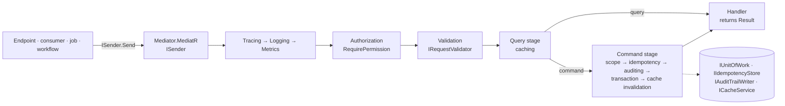

<div align="center">

# SharedKernel Application

**A CQRS layer whose handlers only decide — a kernel-owned command and query vocabulary with no mediator library in
it, and the tracing, authorization, validation, idempotency, transactions, auditing and caching every handler would
otherwise repeat, composed once in a fixed order.**

[](https://dotnet.microsoft.com/)
[](../../LICENSE)


[](https://github.com/jbogard/MediatR)

[What you get](#what-you-get) · [Packages](#packages) · [How it fits together](#how-it-fits-together) · [Get started](#get-started) · [See it run](#see-it-run) · [Guarantees](#guarantees)

<sub>📂 <code>src/Application</code> · <a href="../../docs/packages.md">all packages by tier</a> · <a href="../../README.md">Platform.SharedKernel</a></sub>

</div>

---

## What you get

- **Handlers that only decide.** A handler returns a `Result`; permission checks, validation, commits, audit entries,
  idempotency and cache eviction are behaviors a request opts into with an attribute or a marker interface.
- **Application projects free of MediatR.** `ICommand`, `IQuery<T>`, `ISender` and `IPipelineBehavior<,>` are kernel
  contracts; MediatR 12.4.1 (the last MIT release) is only the transport, in one adapter package.
- **One registration, one order.** `AddSharedKernelApplication(assemblies, app => …)` finds handlers, validators and
  `IDomainEventHandler<T>`s and places every behavior in a fixed order; a missing seam fails the host start with one
  message naming every missing service.
- **Authorization that cannot be forgotten.** `[RequirePermission]` on a use case is enforced on every path — HTTP, a
  consumed message, a scheduled job, a workflow activity.
- **Commit-aware side effects.** Only the outermost command commits; `ICommandScope.OnCompleted` callbacks and
  `IInvalidatesCache` eviction run after the commit, never before it.

## Packages

| Package | Tier | Reference it from | Use it for |
| --- | --- | --- | --- |
| [SharedKernel.Application](SharedKernel.Application/README.md) | Abstractions | Application | Commands, queries, handlers, `ISender`, validators, domain-event handlers, `[RequirePermission]` and every pipeline marker |
| [SharedKernel.Application.Pipeline](SharedKernel.Application.Pipeline/README.md) | Host | Api·Worker | The one registration call and the behaviors: tracing, logging, metrics, authorization, validation always on; idempotency, transactions, auditing opt-in |
| [SharedKernel.Application.Mediator.MediatR](SharedKernel.Application.Mediator.MediatR/README.md) | Host | Api·Worker | `app.UseMediatR()` — the `ISender` transport |
| [SharedKernel.Application.Pipeline.Caching](SharedKernel.Application.Pipeline.Caching/README.md) | Host | Api·Worker | `app.WithCaching()` — `ICacheableQuery<T>` results cached, `IInvalidatesCache` eviction after commit |
| [SharedKernel.Application.Testing](SharedKernel.Application.Testing/README.md) | Testing | test projects | `ApplicationPipelineTestHarness` — the composed pipeline in a unit test, with or without a mediator |

Start with `SharedKernel.Application` in the Application project and `Pipeline` + `Mediator.MediatR` in the host; add
`Pipeline.Caching` when a measured read is worth caching. FluentValidation validators plug in through
[SharedKernel.Validation.FluentValidation](../Foundation/SharedKernel.Validation.FluentValidation/README.md).

## How it fits together



- **The order is fixed**, whatever order the `With…` calls come in. Authorization precedes validation, so a caller
  who may not act never learns the rules; the transaction wraps the handler; post-commit callbacks run last.
- **Behaviors consume contracts, never infrastructure.** `IRequestContext`, `IUnitOfWork` and `IAuditTrailWriter` come
  from [SharedKernel.Execution](../Foundation/SharedKernel.Execution/README.md), `IIdempotencyStore` from
  [Idempotency](../Infrastructure/Idempotency/README.md), `ICacheService` from [Caching](../Infrastructure/Caching/README.md);
  [Persistence](../Infrastructure/Persistence/README.md) and those packages implement them.
- **Nested commands join the outer one.** They skip idempotency, share the transaction and mark it rollback-only on
  failure; handlers must be re-runnable because the unit of work may replay them.

## Get started

```xml
<PackageReference Include="SharedKernel.Application" />                  <!-- Application project -->
<PackageReference Include="SharedKernel.Application.Pipeline" />         <!-- Api / Worker project -->
<PackageReference Include="SharedKernel.Application.Mediator.MediatR" /> <!-- Api / Worker project -->
```

```csharp
// Application project
[RequirePermission("orders.cancel")]
public sealed record CancelOrderCommand(Guid OrderId) : ICommand;

internal sealed class CancelOrderHandler(IOrderRepository orders) : ICommandHandler<CancelOrderCommand>
{
    public async Task<Result> Handle(CancelOrderCommand command, CancellationToken ct)
    {
        var order = await orders.FindAsync(command.OrderId, ct);   // no permission check, no SaveChanges
        return order is null
            ? Result.Failure(Error.NotFound("order.not_found", "The order does not exist."))
            : order.Cancel();
    }
}

// Api project
builder.Services.AddSharedKernelRequestContext();    // IRequestContext, required by [RequirePermission]
builder.Services.AddSharedKernelApplication(typeof(CancelOrderHandler).Assembly, app => app
    .UseMediatR()
    .WithTransactions());                            // needs IUnitOfWork, e.g. from SharedKernel.Persistence.EfCore
```

An unauthenticated caller gets `401 unauthorized.default`, a caller without `orders.cancel` gets
`403 forbidden.insufficient_permission`, and the handler never runs; a failed `Result` commits nothing. The vocabulary
is in the [SharedKernel.Application Quick start](SharedKernel.Application/README.md#quick-start), every seam and opt-in
in the [SharedKernel.Application.Pipeline Quick start](SharedKernel.Application.Pipeline/README.md#quick-start).

## See it run

- [samples/OrderApi](../../samples/OrderApi/README.md) — the reference layout: `OrderApi.Application` references only
  `SharedKernel.Application`, `OrderApi.Api` composes the pipeline, and its tests prove the 401/403/204 outcomes over
  HTTP. `dotnet test samples/OrderApi/OrderApi.Tests -p:SharedKernelPackageVersion=<the packed version>`
- [samples/Shop](../../samples/Shop/README.md) — the Catalog service adds `WithCaching()`: cacheable product queries
  and post-commit eviction across two replicas. `dotnet run --project samples/Shop/Shop.AppHost --launch-profile http`
- Every other sample (BillingApi, ShippingApi, DocumentsApi, CatalogApi, CheckoutApi, InventoryApi) sends its use
  cases through the same pipeline.

## Guarantees

| Guarantee | How it is held |
| --- | --- |
| **Expected failures are values** | Handlers return `Result`/`Result<T>`; `SK0040` flags a marked request with another response type |
| **Every marked request is authorized** | Always on, 401 vs 403, the denial never names the permission — `AuthorizationBehaviorTests` (`Pipeline_AlwaysEnforcesTheAttribute_WithoutAnyOptIn`) |
| **The order cannot drift** | `PipelineOrderTests` runs the real composed pipeline; `ApplicationPipelineRules` keep behaviors off concrete infrastructure |
| **Nothing persists on failure** | Only the outermost command commits, only on success — `TransactionBehaviorTests`, `TransactionalAuditingOrderingTests` |
| **A retry never runs twice** | Keys reserved per tenant and caller, duplicates replayed, a reused key with another body rejected — `IdempotencyBehaviorTests` |
| **Cache scopes fail closed** | A tenant or user query without that identity skips the cache — `CachingBehaviorScopeTests`; failures are never cached (`CachingBehaviorConcurrencyTests`) |
| **No MediatR in your Application project** | `DependencyGraphRulesTests.MediatR_IsReferencedOnlyByTheMediatorAdapter`; the Abstractions tier rejects adapters |
| **Misconfiguration fails at start** | Missing seams fail the host start in one `OptionsValidationException`; a second `AddSharedKernelApplication` throws — `ApplicationPipelineBuilderTests` |

---

<div align="center">
<sub>Part of <a href="../../README.md">Platform.SharedKernel</a> · <a href="../../docs/packages.md">all packages</a> · MIT license</sub>
</div>
