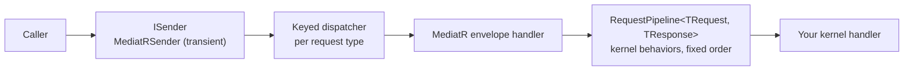

# SharedKernel.Application.Mediator.MediatR

[](https://dotnet.microsoft.com/)
[](https://github.com/Gresta-Vertex-Labs/platform-shared-kernel/blob/main/LICENSE)


-5c6bc0)

> **MediatR as the transport behind the kernel's `ISender` — one builder call, `app.UseMediatR()`, and every command,
> query and stream of the scanned assemblies is sent through the kernel pipeline, with no MediatR type in your
> application code.**

| You get | So that |
| --- | --- |
| `app.UseMediatR()` on `AddSharedKernelApplication` | The whole application layer registers in one call, whatever the mediator |
| The kernel `ISender` backed by MediatR | Endpoints, consumers, jobs and workflows send through one contract; replacing MediatR changes no application code |
| The kernel pipeline inside MediatR | Behaviors run in the platform's fixed order; MediatR's own pipeline stays empty |
| A transient sender | A handler that sends a nested command stays in the caller's DI scope and shares its `ICommandScope` |
| MediatR pinned to 12.4.1 | The last MIT-licensed release; 13.x and later are commercially licensed |

## Install

```xml
<PackageReference Include="SharedKernel.Application.Mediator.MediatR" />
<PackageReference Include="SharedKernel.Application.Pipeline" />
```

The version comes from your central `SharedKernelVersion` property — every SharedKernel package ships at the same
version. See [Using the packages](https://github.com/Gresta-Vertex-Labs/platform-shared-kernel#using-the-packages).
MediatR 12.4.1 arrives transitively; do not add a newer MediatR yourself.

| Requirement | Value |
| --- | --- |
| Target framework | `net10.0` |
| Tier | Host — reference it from your **Api** / **Worker** project, never from the Application project |
| Depends on | `SharedKernel.Application`, `SharedKernel.Application.Pipeline`, `MediatR` 12.4.1 |
| Namespaces | `SharedKernel.Application.Mediator.MediatR` |

## Quick start

```csharp
using SharedKernel.Application.Mediator.MediatR;
using SharedKernel.Application.Pipeline;

builder.Services.AddSharedKernelApplication(typeof(PlaceOrderHandler).Assembly, app => app
    .UseMediatR()          // this package: the kernel ISender over MediatR
    .WithTransactions());  // any opt-in behaviors (SharedKernel.Application.Pipeline)
```

Inject the kernel `ISender` (`SharedKernel.Application.Messaging`), never MediatR's `IMediator` or `ISender`:

```csharp
using SharedKernel.Application.Messaging;
using SharedKernel.Presentation.WebApi;

orders.MapPost("/", (PlaceOrderCommand command, ISender sender, CancellationToken ct) =>
    sender.Send(command, ct).ToCreated(id => $"/orders/{id}"));

orders.MapGet("/export", (ISender sender, CancellationToken ct) =>
    sender.CreateStream(new ExportOrdersQuery(DateOnly.MinValue), ct));
```

Without a mediator the host start fails naming `ISender`, because nothing could send a command.

## How it works



- **`Send`** runs `RequestPipeline<TRequest, TResponse>` — every registered `IPipelineBehavior<TRequest, TResponse>`,
  outermost first, then the handler. **`CreateStream`** runs `StreamRequestPipeline<,>` with the stream behaviors
  (`[RequirePermission]` is checked there too).
- **Discovery is `AddSharedKernelApplication`'s job.** It finds the handlers, validators and domain-event handlers of
  the given assemblies; `UseMediatR()` registers the transport for every request type whose handler it found.
- **No reflection per send.** Reflection is used at registration only; a send resolves the dispatcher registered for
  its request type.
- **Idempotent.** Calling `UseMediatR()` twice is harmless.

## Reference

### Registration

| Method | Registers |
| --- | --- |
| `ApplicationPipelineBuilder.UseMediatR()` | See below; returns the builder for chaining |

| Registration | Lifetime | Notes |
| --- | --- | --- |
| MediatR itself | — | Once, scanning only this adapter's assembly; skipped when `IMediator` is already registered |
| `ISender` → internal `MediatRSender` | Transient | `TryAdd`, so a test can supply its own |
| Per request type of the scanned assemblies | Transient + keyed singleton | An internal MediatR envelope handler that runs the kernel pipeline, and a dispatcher keyed by the request type |
| Per streaming-query type | Transient + keyed singleton | The stream counterpart |

The handlers, `RequestPipeline<,>`, the domain-event dispatcher and the behaviors are registered by
`AddSharedKernelApplication`.

### Errors

| Exception | When |
| --- | --- |
| `InvalidOperationException` | A request is sent whose handler is not in the assemblies passed to `AddSharedKernelApplication`; the message names the request type |

### Logging

None: the adapter writes no log events (EventIds 5300–5399 are reserved for it). The pipeline's events are in
[`SharedKernel.Application.Pipeline`](https://github.com/Gresta-Vertex-Labs/platform-shared-kernel/blob/main/src/Application/SharedKernel.Application.Pipeline/README.md#logging).

## Testing

Unit tests of a handler need no mediator. For the composed pipeline, reference
[`SharedKernel.Application.Testing`](https://github.com/Gresta-Vertex-Labs/platform-shared-kernel/blob/main/src/Application/SharedKernel.Application.Testing/README.md):
`new ApplicationPipelineTestHarness().Build<TMarker>()` registers `AddSharedKernelApplication` over the marker's
assembly **with `UseMediatR()`**, so `SendAsync` goes through the kernel `ISender` exactly as a service's does;
`Build()` runs the same behaviors without a mediator.

## Pitfalls

| Don't | Do | Why |
| --- | --- | --- |
| Implement `MediatR.IRequestHandler` or `INotificationHandler` | Implement the kernel interfaces from `SharedKernel.Application` | MediatR handlers are not discovered |
| Register behaviors on MediatR (`cfg.AddBehavior`, `AddOpenBehavior`) | Use `app.WithBehavior(type, stage)` | MediatR's pipeline runs outside the kernel pipeline and its fixed order |
| Forget an assembly | Pass every handler assembly to the one `AddSharedKernelApplication` call | Only those assemblies are searched; sending an unknown request throws |
| Inject MediatR's `IMediator`/`ISender` | Inject `SharedKernel.Application.Messaging.ISender` | Application code must not depend on the transport |
| Bump MediatR | Keep the 12.4.1 pin | 13.x is commercially licensed and this repository is MIT |

## Design decisions

**Why MediatR only as a transport?** Commands, queries, handlers and behaviors are written against
`SharedKernel.Application`, so replacing MediatR means another `ISender` implementation plugged in the same way. An
architecture test keeps MediatR referenced by this package alone.

**Why does `AddSharedKernelApplication` scan, not this package?** One call registers the application layer whatever
the mediator, so a service that swaps the transport keeps its registration.

---

Part of [Platform.SharedKernel](https://github.com/Gresta-Vertex-Labs/platform-shared-kernel) ·
[Application domain](https://github.com/Gresta-Vertex-Labs/platform-shared-kernel/blob/main/src/Application/README.md) ·
[MIT license](https://github.com/Gresta-Vertex-Labs/platform-shared-kernel/blob/main/LICENSE)
