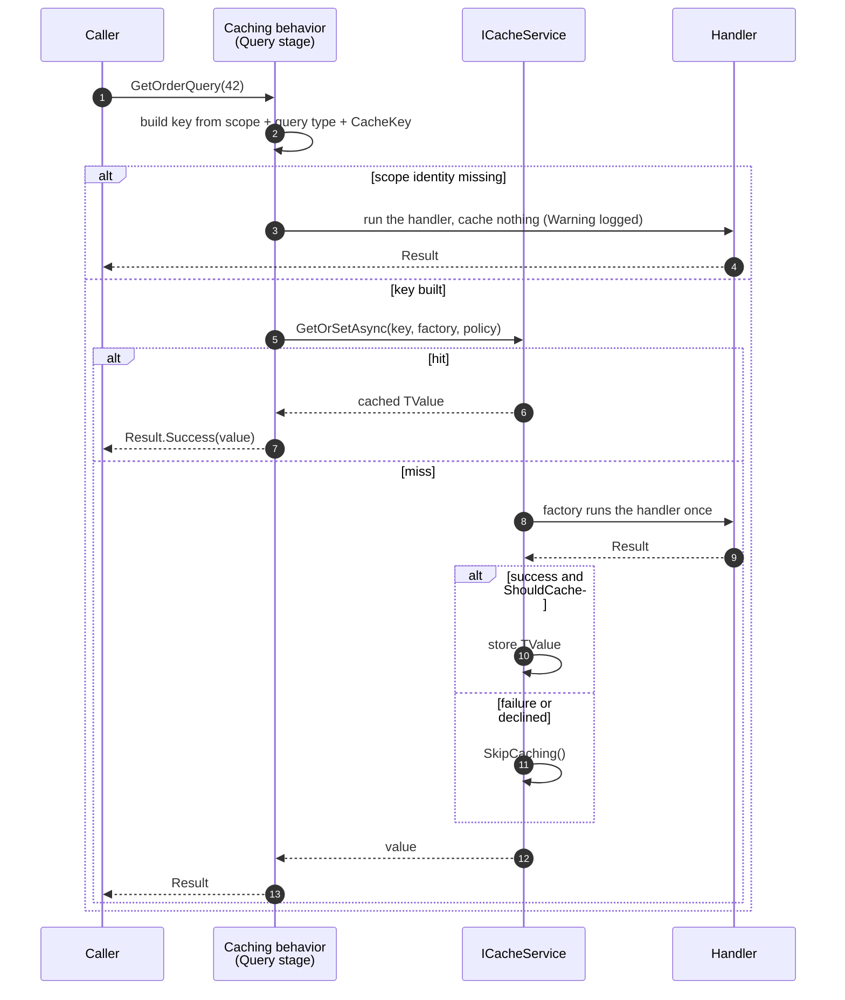

# SharedKernel.Application.Pipeline.Caching

[](https://dotnet.microsoft.com/)
[](https://github.com/Gresta-Vertex-Labs/platform-shared-kernel/blob/main/LICENSE)


> **Cache a query by adding one interface to it, and let the command that changes the data evict it — after the
> transaction commits, never before. Keys are partitioned by query type, tenant and caller, so nothing can read
> anything it should not.**

| You get | So that |
| --- | --- |
| A cache around any `ICacheableQuery<TValue>` | A hot read is served from memory or Redis, and the handler stays a plain handler |
| Keys partitioned by query type, tenant and caller | Two queries cannot read each other's entries, one tenant cannot read another's, and one user cannot read another's |
| Scopes that fail closed | A missing tenant or caller skips the cache instead of quietly writing under a wider key every request would share |
| A failed `Result` that is never cached | A transient `NotFound` is not pinned for the whole expiry window |
| Stampede protection on every cached query | A cold key under load runs the handler once, not once per concurrent caller |
| Eviction that waits for the commit, and cannot be cancelled | Nothing evicts on a write that has not landed, and a client disconnect cannot leave the cache serving stale data |
| `CacheKeyRef.For<TQuery>(key)` | Renaming a query is a compile error at the command, not a missed eviction found in production |
| Hit and miss counters tagged by query type | You can answer "what is the hit ratio of `GetOrderQuery`", not just "of this key prefix" |

## Contents

- [Install](#install)
- [Quick start](#quick-start)
- [How it works](#how-it-works)
- [Recipes](#recipes)
- [Reference](#reference)
- [Testing](#testing)
- [Pitfalls](#pitfalls)
- [Design decisions](#design-decisions)

## Install

```xml
<PackageReference Include="SharedKernel.Application.Pipeline.Caching" />
```

The version comes from your central `SharedKernelVersion` property — every SharedKernel package ships at the same
version. See [Using the packages](https://github.com/Gresta-Vertex-Labs/platform-shared-kernel#using-the-packages).

| Requirement | Value |
| --- | --- |
| Target framework | `net10.0` |
| Tier | Host — reference it from your **Api** / **Worker** project; queries and commands declare the markers from `SharedKernel.Application` |
| Depends on | `SharedKernel.Application.Pipeline`, `SharedKernel.Caching.Abstractions` |
| Needs at runtime | `ICacheService` and `ITenantCacheKeyProvider` — registered by `SharedKernel.Caching.FusionCache`'s `AddSharedKernelCaching` |
| Namespaces | `SharedKernel.Application.Pipeline.Caching` (`WithCaching()`); the markers are in `SharedKernel.Application.Caching` |

This is an opt-in sibling of [`SharedKernel.Application.Pipeline`](https://github.com/Gresta-Vertex-Labs/platform-shared-kernel/blob/main/src/Application/SharedKernel.Application.Pipeline/README.md):
it needs `SharedKernel.Caching.Abstractions`, and the core pipeline package keeps a cache dependency away from every
service that never caches anything.

## Quick start

```csharp
// Read side: one interface, and the handler never changes.
public sealed record GetOrderQuery(Guid OrderId) : ICacheableQuery<OrderDto>
{
    public CachePolicy CachePolicy => CachePolicy.For(TimeSpan.FromMinutes(1), TimeSpan.FromMinutes(10));
    public string CacheKey => OrderId.ToString();
}

// Write side: name the query you invalidated, not a key string.
public sealed record ApproveOrderCommand(Guid OrderId) : ICommand, IInvalidatesCache
{
    public IReadOnlyCollection<CacheKeyRef> CacheKeysToInvalidate => [CacheKeyRef.For<GetOrderQuery>(OrderId.ToString())];
}
```

```text
GetOrderQuery(42)   tenant acme, first call        -> handler runs, value cached    outcome Miss
                    tenant acme, second call       -> served from cache             outcome Hit
                    tenant other, same order id    -> handler runs (different key)  outcome Miss
                    handler returns NotFound       -> failure returned, NOT cached  outcome NotCachedFailure
                    tenant could not be resolved   -> cache skipped, handler runs   outcome BypassedScopeUnavailable

ApproveOrderCommand(42)   handler succeeds, transaction commits  -> entry evicted, after the commit
                          handler returns a failed Result        -> nothing evicted
                          handler throws                         -> nothing evicted
                          client disconnects mid-request         -> entry still evicted (uncancellable)
```

Register it:

```csharp
using SharedKernel.Application.Mediator.MediatR;
using SharedKernel.Application.Pipeline;
using SharedKernel.Application.Pipeline.Caching;
using SharedKernel.Caching.FusionCache.Extensions;

builder.Services.AddSharedKernelCaching(o => o.ServiceName = "orders");   // ICacheService + key providers

builder.Services.AddSharedKernelApplication(typeof(Program).Assembly, app => app
    .UseMediatR()
    .WithCaching()                  // both behaviors, each in its correct stage
    .WithTransactions());           // so eviction has a commit to follow
```

`WithCaching()` puts the caching behavior in the **Query** stage and the invalidation behavior in the
**Command** stage, and declares `ICacheService` and `ITenantCacheKeyProvider` as required. The host start fails
naming whichever is missing — never at the first request. `AddSharedKernelCaching()` registers both.

The handler of `GetOrderQuery` is an ordinary handler, unaware of the cache:

```csharp
internal sealed class GetOrderHandler(IOrderRepository orders) : IQueryHandler<GetOrderQuery, OrderDto>
{
    public async Task<Result<OrderDto>> Handle(GetOrderQuery query, CancellationToken ct) =>
        await orders.FindAsync(query.OrderId, ct) is { } order
            ? order.ToDto()
            : Error.NotFound("order.not_found", $"Order {query.OrderId} does not exist.");
}
```

## How it works



The handler runs **inside** one `ICacheService.GetOrSetAsync` call, so concurrent identical queries do not all run
it. Eager refresh and factory timeouts are switched off on the query's policy — either would let the cache run the
handler in the background after the request's DI scope had been disposed. Fail-safe, durations, tags and jitter are
all kept exactly as the query declared them.

### Which member do I need?

| I want to… | Declare | On |
| --- | --- | --- |
| Cache a query's result | `ICacheableQuery<TValue>` | the query |
| Set durations, tags, fail-safe, jitter | `CachePolicy` | the query |
| Say what makes this instance unique | `CacheKey` | the query |
| Cache per tenant (the default) | nothing — `Scope` defaults to `Tenant` | — |
| Cache per caller | `Scope => CacheScope.User` | the query |
| Cache one entry for the whole service | `Scope => CacheScope.Global` | the query |
| Force a reload that also refreshes the entry | `RefreshCache => true` | the query |
| Keep an empty or negative result out of the cache | `ShouldCache(TValue)` | the query |
| Evict entries after a write commits | `IInvalidatesCache` | the command |
| Name one entry to evict | `CacheKeyRef.For<TQuery>(key)` | the command |
| Evict a whole group of entries | `CacheTagsToInvalidate` + `CachePolicy.WithTags(...)` | both |

### Cache scope

Every query and every invalidating command declares the identity its entries are partitioned by.

| Scope | The key carries | Use it for |
| --- | --- | --- |
| `CacheScope.Tenant` *(default)* | the tenant | anything a multi-tenant service caches |
| `CacheScope.User` | the caller, plus the tenant when there is one | anything that varies by who is asking: filtered by permissions, ownership or preferences |
| `CacheScope.Global` | nothing | genuinely tenant- and caller-independent data: reference tables, ISO code lists, published rate cards |

```csharp
public sealed record GetMyOrdersQuery : ICacheableQuery<IReadOnlyList<OrderDto>>
{
    public CachePolicy CachePolicy => CachePolicy.Default;
    public string CacheKey => "mine";
    public CacheScope Scope => CacheScope.User;     // the result depends on the caller
}
```

**Scopes fail closed.** A `Tenant` query on a request with no resolved tenant, or a `User` query with no
authenticated caller, does *not* fall back to a wider key. The cache is skipped, the handler runs, and the skip is
logged at `Warning`. Falling back is the dangerous option: every request whose tenant resolution failed would share
one entry, across tenants. Widening is always an explicit `CacheScope.Global`, never an accident.

`CacheScope.Tenant` is the zero value, so `default(CacheScope)` and both interface defaults land on the safe option.

The scope comes from `IRequestContext` (`SharedKernel.Execution`), which the host registers — for HTTP,
`AddSharedKernelRequestContext()` from `SharedKernel.ServiceDefaults.Security`. No `IRequestContext` registered means `Tenant` and `User` queries are never
cached, which is the correct behaviour for a service that has not wired identity up yet.

### How keys are built

Every key goes through the registered `ITenantCacheKeyProvider`, never string interpolation, so it carries the
owning service name and every segment is escaped.

```text
Global   {service}:{QueryType}:{CacheKey}
Tenant   {service}:@{tenant}:{QueryType}:{CacheKey}
User     {service}:@{tenant}:{QueryType}:{CacheKey}:u:{userId}

orders:@8f3a…:GetOrderQuery:42
orders:@8f3a…:GetMyOrdersQuery:mine:u:auth0%7C7c1
```

`CacheKey` is therefore the query's identity **within its own namespace**, not a whole key. Build it from every
parameter that changes the result — `$"{OrderId}"`, or `$"{OrderId}:{Currency}"` — and nothing else.

The `{QueryType}` segment is doing real work. An entry holds the bare `TValue` as JSON with no type discriminator,
so if two query types shared a key, the second would deserialize the first's payload into its own type — and
`System.Text.Json` does that on a best-effort basis, leaving unmatched members at their defaults and raising
nothing. You would get a half-empty object and no error. **SK0041** reports the one way that namespace can still
collapse: two cacheable queries sharing a simple type name.

Tenant-scoped entries also carry the tenant-wide tag, so `ITenantCacheService.RemoveTenantAsync` removes a tenant's
cached query results along with the rest of its entries.

### Invalidating after a command

```csharp
public sealed record ApproveOrderCommand(Guid OrderId) : ICommand, IInvalidatesCache
{
    public IReadOnlyCollection<CacheKeyRef> CacheKeysToInvalidate =>
    [
        CacheKeyRef.For<GetOrderQuery>(OrderId.ToString()),
        CacheKeyRef.For<GetOrderHistoryQuery>(OrderId.ToString()),
    ];

    public IReadOnlyCollection<string> CacheTagsToInvalidate => ["orders"];
}
```

A command names the **query** that owns each entry rather than a raw key, because keys are namespaced per query
type — there is no whole-key form for a command to repeat. `CacheKeyRef.For<TQuery>(key)` captures that type, so
renaming or moving the query breaks the build at the command instead of silently skipping an eviction.

The command's `Scope` must match the queries it invalidates. Both default to `Tenant`, so they agree unless you
change one; a mismatch evicts a key those queries never wrote.

**Eviction happens after the commit.** On success the behavior registers an `ICommandScope.OnCompleted` callback
rather than evicting directly, and `CommandScopeBehavior` runs those callbacks only once the outermost command's
`next()` — which includes `TransactionBehavior`'s commit — has returned. A failed `Result` or a thrown exception
registers nothing. This holds regardless of registration order; it is a property of the command scope, not a
pipeline-ordering trick. Without it, a concurrent reader could repopulate the cache from pre-commit state.

**Eviction is not cancellable, and does not give up early.** The callback runs with `CancellationToken.None`: the
write has already committed, so honouring a cancelled request token would abandon the eviction and leave the cache
serving a superseded value for the entry's whole lifetime. Each key and tag is evicted under its own `try`/`catch`
and logged at `Error`, so one unreachable key cannot skip the rest.

Keys and tags are built and validated **before** the handler runs, so a malformed target fails the command rather
than the post-commit callback, after the change is already saved.

### Refreshing, and declining to cache

`RefreshCache` ignores any existing entry, runs the handler, and writes the result over the entry — the
force-refresh path for a "reload" button, or a read that must observe a write made outside this service. It still
writes, so the next ordinary caller is served the refreshed value; it is not a way to opt one call out of caching.

```csharp
public sealed record GetOrderQuery(Guid OrderId, bool Reload = false) : ICacheableQuery<OrderDto>
{
    public CachePolicy CachePolicy => CachePolicy.Default;
    public string CacheKey => OrderId.ToString();
    public bool RefreshCache => Reload;
}
```

A failed refresh leaves the existing entry alone. A transient fault is not evidence that the cached value is wrong,
and dropping the entry would turn one upstream blip into a cache-wide miss storm.

`ShouldCache(TValue)` decides whether a particular successful value is worth caching — typically to keep an empty
or negative result out when the caller is likely to write the missing data immediately. Returning `false` returns
the value uncached and leaves any existing entry untouched.

```csharp
public bool ShouldCache(IReadOnlyList<OrderDto> value) => value.Count > 0;
```

It runs inside the cache factory, so it must be pure and must not throw — a throw there propagates to every waiting
caller.

### Guarantees

- **Failures are never cached**, and a cached entry is never a `Result` — both covered by tests against a real
  FusionCache over a shared distributed cache.
- **Scope isolation is tested:** one tenant cannot read another's entry, one caller cannot read another's, and a
  missing identity caches nothing.
- **Stampede semantics are pinned against a real cache:** the handler runs once for concurrent callers on a hit path,
  and each caller gets its own failure on the skip path.
- **Eviction follows the commit**, proved end to end through a real `ServiceCollection`, the kernel pipeline and a
  real dispatch.
- **Thread-safe.** The behaviors hold no mutable state; per-request state lives on the stack.

## Recipes

### 1. Cache a lookup table for the whole service

```csharp
public sealed record GetCurrenciesQuery : ICacheableQuery<IReadOnlyList<CurrencyDto>>
{
    public CachePolicy CachePolicy => CachePolicy.For(TimeSpan.FromHours(1), TimeSpan.FromHours(12));
    public string CacheKey => "all";
    public CacheScope Scope => CacheScope.Global;   // no tenant or caller affects this
}
```

### 2. Cache something that depends on the caller

```csharp
public sealed record GetMyPermissionsQuery : ICacheableQuery<PermissionSetDto>
{
    public CachePolicy CachePolicy => CachePolicy.For(TimeSpan.FromMinutes(5));
    public string CacheKey => "permissions";
    public CacheScope Scope => CacheScope.User;
}
```

### 3. Evict a whole group with a tag

```csharp
public sealed record GetOrderQuery(Guid OrderId) : ICacheableQuery<OrderDto>
{
    public CachePolicy CachePolicy => CachePolicy.Default.WithTags("orders");
    public string CacheKey => OrderId.ToString();
}

public sealed record RebuildOrderProjectionsCommand : ICommand, IInvalidatesCache
{
    public IReadOnlyCollection<CacheKeyRef> CacheKeysToInvalidate => [];
    public IReadOnlyCollection<string> CacheTagsToInvalidate => ["orders"];
}
```

### 4. Compose a key from more than one parameter

```csharp
public sealed record GetOrderTotalQuery(Guid OrderId, CurrencyCode Currency) : ICacheableQuery<MoneyDto>
{
    public CachePolicy CachePolicy => CachePolicy.Default;
    public string CacheKey => $"{OrderId}:{Currency}";   // every input that changes the result
}
```

### 5. Survive a Redis outage with fail-safe

```csharp
public CachePolicy CachePolicy =>
    CachePolicy.For(TimeSpan.FromMinutes(1), TimeSpan.FromMinutes(10))
        .WithFailSafe(TimeSpan.FromHours(2))     // serve a stale entry rather than fail
        .WithJitter(TimeSpan.FromSeconds(10));   // stagger expiry across instances
```

## Reference

| Type | Purpose |
| --- | --- |
| `ICacheableQuery<TValue>` | A query whose successful value is cached. Also an `IQuery<TValue>`, so a query declares it alone |
| `ICacheableQuery.CacheKey` | This instance's identity within its own namespace |
| `ICacheableQuery.CachePolicy` | Durations, tags, fail-safe, jitter — `SharedKernel.Caching.Abstractions` |
| `ICacheableQuery.Scope` | `Tenant` (default), `User` or `Global` |
| `ICacheableQuery.RefreshCache` | Ignore the entry, run the handler, overwrite. Default `false` |
| `ICacheableQuery<TValue>.ShouldCache` | Decline to cache one value. Default: cache every success |
| `IInvalidatesCache` | A command declaring what it made stale |
| `IInvalidatesCache.CacheKeysToInvalidate` | The entries to evict, as `CacheKeyRef` |
| `IInvalidatesCache.CacheTagsToInvalidate` | The tags to evict. Default empty |
| `IInvalidatesCache.Scope` | Must match the queries being invalidated. Default `Tenant` |
| `CacheKeyRef.For<TQuery>(key)` | Names one entry by its owning query type |
| `CacheScope` | `Tenant` = 0, `User`, `Global` |
| `WithCaching()` (extension on `ApplicationPipelineBuilder`, namespace `SharedKernel.Application.Pipeline.Caching`) | Registers both behaviors in their stages and declares their required services |

The two behavior types are **internal**. They are registered by `WithCaching()` and resolved by the kernel `RequestPipeline<,>`;
the package's contract is the interfaces above.

### Telemetry

Both behaviors record under the existing `"SharedKernel.Application"` meter and activity source, so
`SharedKernel.ServiceDefaults`' `WithApplicationTelemetry()` exports them with no extra registration and no new instrument
name to add anywhere.

| Signal | Name | Tags |
| --- | --- | --- |
| Counter | `sharedkernel.application.query.cache.outcome` | `sharedkernel.query.type`, `sharedkernel.cache.scope`, `sharedkernel.cache.outcome` |
| Counter | `sharedkernel.application.command.cache.invalidation` | `sharedkernel.command.type`, `sharedkernel.cache.target`, `sharedkernel.cache.evicted` |
| Activity tags | on the request span | `sharedkernel.cache.outcome`, `sharedkernel.cache.scope` |

Outcomes: `Hit`, `Miss`, `Refreshed`, `NotCachedFailure`, `NotCachedByPredicate`, `BypassedScopeUnavailable`. Hit
ratio for one query type is `Hit / (Hit + Miss)`; the other four tell you *why* a call was not a plain hit or miss.

### Logging

No tenant id, user id, cache key or cached value is ever a log or metric parameter.

| Event id | Level | Event |
| --- | --- | --- |
| 5200 | Debug | Query `{QueryType}` cache outcome `{CacheOutcome}` at `{CacheScope}` scope |
| 5201 | Warning | Query declares a scope whose identity is unavailable; the cache was skipped and the handler ran |
| 5210 | Debug | Command `{CommandType}` evicted `{KeyCount}` key(s) and `{TagCount}` tag(s) after commit |
| 5211 | Error | A post-commit eviction of one key or tag failed; the cache serves a superseded value until it expires |
| 5212 | Warning | Command declares a scope whose identity is unavailable; the affected entries were not evicted |

### Analyzers

`SK0017` flags a command implementing `ICacheableQuery`; `SK0018` flags a query implementing `IInvalidatesCache`;
`SK0041` flags two cacheable queries sharing a simple type name (their key namespaces would collapse).

## Testing

Reference [`SharedKernel.Caching.Testing`](https://github.com/Gresta-Vertex-Labs/platform-shared-kernel/blob/main/src/Infrastructure/Caching/SharedKernel.Caching.Testing/README.md): its
`FakeCacheService` reproduces the per-key stampede gate and the `SkipCaching()` split this package relies on, so a
test against it fails on the same regressions a real cache would.

```csharp
var cache = new FakeCacheService();               // SharedKernel.Testing.Caching (package SharedKernel.Caching.Testing)
services.AddSingleton<ICacheService>(cache);
services.AddSingleton<ITenantCacheKeyProvider>(new FakeTenantCacheKeyProvider());
services.AddSharedKernelApplication(typeof(GetOrderQuery).Assembly, app => app.UseMediatR().WithCaching());

await sender.Send(new GetOrderQuery(id));
await sender.Send(new GetOrderQuery(id));

cache.FactoryInvocationCount.Should().Be(1);      // second dispatch was a hit
```

For a full composition without a mediator, `ApplicationPipelineTestHarness` from
[`SharedKernel.Application.Testing`](https://github.com/Gresta-Vertex-Labs/platform-shared-kernel/blob/main/src/Application/SharedKernel.Application.Testing/README.md) accepts
`Configure(app => app.WithCaching())`.

## Pitfalls

| Don't | Do | Why |
| --- | --- | --- |
| Leave a parameter out of `CacheKey` | Put every input that changes the result in the key | The query type, service, tenant and caller are added for you; the rest is yours |
| Leave a caller-dependent result at `Tenant` scope | Declare `CacheScope.User` | Otherwise one user is served another's permission- or ownership-filtered data |
| Let a command's `Scope` disagree with its queries | Change both together, or neither | It evicts a key nothing wrote, and the stale entry survives |
| Cache a `TValue` that does not round-trip through `System.Text.Json` | Keep cached values plain and serializable (add them to your cache `JsonSerializerContext`) | It works in memory and fails against Redis — passes locally, breaks in production |
| Name two cacheable queries alike in different namespaces | Give each a distinct simple type name | They share a key namespace; `SK0041` reports it |
| Expect a failure to be cached | Model "does not exist" as a successful value | Failures are never cached, deliberately |
| Throw or cause side effects in `ShouldCache` | Keep it pure | It runs inside the cache factory, where a throw reaches every waiting caller |
| Rely on "after commit" without `WithTransactions()` | Add `WithTransactions()` | Eviction still runs after the handler, but the guarantee is only as real as the commit |

## Design decisions

| Decision | Why |
| --- | --- |
| A separate package from `SharedKernel.Application.Pipeline` | The core pipeline package will not put `SharedKernel.Caching.Abstractions` in front of every service that never caches anything |
| Cache `TValue`, never `Result<TValue>` | `Result` has private constructors, so a reflection-based serializer cannot write it. Caching the value keeps `SharedKernel.Primitives` free of serialization concerns |
| Keys namespaced by query type | Without it, two queries picking the same key silently deserialize each other's payloads. The namespace is what makes `CacheKey` safe to write casually |
| A command names the query, not the key | Keys carry the query type, so a raw key string cannot be reconstructed by a command — and naming the type makes a rename a compile error |
| Scope defaults to `Tenant` and fails closed | The unsafe direction is silent widening. A missing identity skipping the cache costs a cache miss; falling back costs a cross-tenant read |
| `GetOrSetAsync` with `SkipCaching`, not get-then-set | Stampede protection on the cold path, without ever writing a failure |
| Eager refresh and factory timeouts forced off | Both let the cache run the handler after the request's DI scope is disposed |
| Eviction deferred to `ICommandScope.OnCompleted` | Makes "after the commit" structural rather than a registration-order fact that a later edit could break |
| Eviction uncancellable, and isolated per key | The write has already committed; a disconnect or one bad key must not leave the cache stale |
| Instruments on the existing `"SharedKernel.Application"` meter | A new meter name would need its own `AddMeter` call and would silently export nothing until a host added it |
| Behaviors internal | Nothing outside should construct them, and it keeps the public surface to the contract |

**Consequence of caching the value:** `TValue` must round-trip through `System.Text.Json` (FusionCache's L2
serializer would otherwise throw on the write). If your service registers a `JsonSerializerContext` for the cache, add
`TValue` to it.

**What is deliberately not included?**

- **No automatic key derivation from the query's properties.** Reflecting over a record to build a key is exactly
  how a key silently stops matching when a property is added. The query states its key.
- **No cache-aside helper for handlers.** If a handler needs to cache something that is not its own result, inject
  `ICacheService` directly — that is not a pipeline concern.
- **No output or HTTP response caching.** That is a presentation concern, with different invalidation rules.
- **No second-level invalidation graph.** A command names what it made stale; the package does not try to infer
  dependencies between queries.
- **No cache warming.** `SharedKernel.Caching.FusionCache` owns warmup.

---

Part of [Platform.SharedKernel](https://github.com/Gresta-Vertex-Labs/platform-shared-kernel) ·
[Application packages](https://github.com/Gresta-Vertex-Labs/platform-shared-kernel/blob/main/src/Application/README.md) ·
[MIT license](https://github.com/Gresta-Vertex-Labs/platform-shared-kernel/blob/main/LICENSE)
