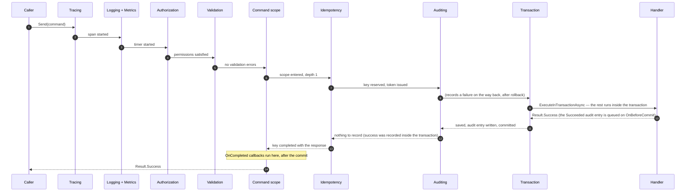
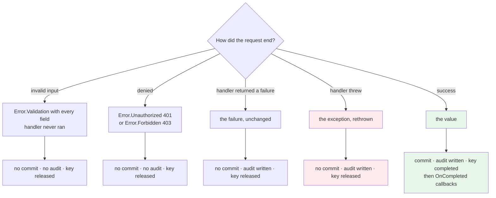

# SharedKernel.Application.Pipeline

[](https://dotnet.microsoft.com/)
[](https://github.com/Gresta-Vertex-Labs/platform-shared-kernel/blob/main/LICENSE)


> **The application layer of a service in one call — handlers, validators and domain-event handlers found, and the
> cross-cutting half of every request (tracing, logging, metrics, authorization, validation, idempotency,
> transactions, auditing) composed in one fixed order, so a handler only decides business outcomes.**

| You get | So that |
| --- | --- |
| One registration call, `AddSharedKernelApplication` | No ordering traps: seams may be registered before or after it, and a missing one fails the host start naming every one |
| A fixed five-stage pipeline | Two services compose the same request the same way, and the order can't drift |
| Authorization always on, declared with `[RequirePermission]` on the use case | A marked request is never handled unchecked, on any path (HTTP, message, job, workflow) |
| Expected failures as `Result` values | A denial or an invalid field returns an error the caller handles — exceptions stay for genuine faults |
| Commit only on success, only once | A handler that returns a failure persists nothing, and a nested command joins the outer transaction |
| `ICommandScope.OnCompleted` | Work that must follow a commit — publish, evict, notify — runs after it, or not at all |
| Idempotency per tenant and caller, with a request fingerprint | A retried submission replays its original response; another caller's key never replays yours; the same key with a different body is rejected |
| Error-aware telemetry | Spans, metrics and logs all carry the error type and code, so a dashboard can alert on *what* failed |
| `WithBehavior(type, stage)` | Your own behavior lands in the canonical order instead of wherever it was registered |

## Contents

- [Install](#install)
- [Quick start](#quick-start)
- [How it works](#how-it-works)
- [Recipes](#recipes)
- [Configuration](#configuration)
- [Reference](#reference)
- [Testing](#testing)
- [Pitfalls](#pitfalls)
- [Design decisions](#design-decisions)

## Install

```xml
<PackageReference Include="SharedKernel.Application.Pipeline" />
<PackageReference Include="SharedKernel.Application.Mediator.MediatR" />   <!-- the ISender transport -->
```

The version comes from your central `SharedKernelVersion` property — every SharedKernel package ships at the same
version. See [Using the packages](https://github.com/Gresta-Vertex-Labs/platform-shared-kernel#using-the-packages).

| Requirement | Value |
| --- | --- |
| Target framework | `net10.0` |
| Tier | Host — reference it from your **Api** / **Worker** project; the Application project needs only [`SharedKernel.Application`](https://github.com/Gresta-Vertex-Labs/platform-shared-kernel/blob/main/src/Application/SharedKernel.Application/README.md) |
| Depends on | `SharedKernel.Application`, `SharedKernel.Execution`, `SharedKernel.Primitives`, `SharedKernel.Core`, `SharedKernel.Idempotency.Abstractions`, first-party `Microsoft.Extensions.*`; no mediator, FluentValidation, cache, Polly or hosting |
| Namespaces | `SharedKernel.Application.Pipeline` |

The transport is [`SharedKernel.Application.Mediator.MediatR`](https://github.com/Gresta-Vertex-Labs/platform-shared-kernel/blob/main/src/Application/SharedKernel.Application.Mediator.MediatR/README.md)
(`UseMediatR()`); query caching is the separate
[`SharedKernel.Application.Pipeline.Caching`](https://github.com/Gresta-Vertex-Labs/platform-shared-kernel/blob/main/src/Application/SharedKernel.Application.Pipeline.Caching/README.md) (`WithCaching()`).

## Quick start

```csharp
using SharedKernel.Application.Mediator.MediatR;
using SharedKernel.Application.Pipeline;
using SharedKernel.Validation.FluentValidation;

// Handlers, validators, domain-event handlers of the assembly; tracing, logging, metrics, authorization and
// validation; MediatR as the transport.
builder.Services.AddSharedKernelApplication(typeof(PlaceOrderCommand).Assembly, app => app.UseMediatR());

// Optional: FluentValidation's IValidator<T>s of the assembly, as IRequestValidator<T>.
builder.Services.AddFluentValidationRequestValidators(typeof(PlaceOrderCommand).Assembly);
```

The rest is a deliberate opt-in, because each one needs a seam you have to provide:

```csharp
builder.Services.AddSharedKernelApplication(typeof(PlaceOrderCommand).Assembly, app => app
    .UseMediatR()
    .WithIdempotency()     // needs IIdempotencyStore (Request) + IRequestContext
    .WithTransactions()    // needs IUnitOfWork
    .WithAuditing());      // needs IAuditTrailWriter

// The seams, before or after the call above:
builder.Services.AddSharedKernelRequestContext();                        // IRequestContext (SharedKernel.ServiceDefaults.Security)
builder.AddSharedKernelPostgres<OrderDbContext>("orders", p => p.UseAuditTrail()); // IUnitOfWork + IAuditTrailWriter (SharedKernel.Persistence.EfCore)
builder.Services.AddRedisIdempotency(p => p.ForRequests());                 // IIdempotencyStore for requests (SharedKernel.Idempotency.Redis)
```

A missing seam fails the **host start** with one `OptionsValidationException` naming every missing service and
what needs it — never the first request. `ISender` is always required (a mediator must be plugged in), and so is
`IRequestContext` as soon as a request type of the assemblies carries `[RequirePermission]`. Calling
`AddSharedKernelApplication` a second time throws: pass every assembly and option to the one call.

## How it works

### The pipeline order

Five stages, always in this order, regardless of the order you called the `With…` methods:

| # | Stage | Behavior | Applies to | Registered |
| --- | --- | --- | --- | --- |
| 1 | Observability | tracing | every request | always |
| 2 | Observability | logging | every request | always |
| 3 | Observability | metrics | every request | always |
| 4 | Authorization | authorization | requests carrying `[RequirePermission]` (streaming queries too) | always |
| 5 | Validation | validation | every request with a registered `IRequestValidator<T>` | always |
| 6 | Query | *(yours, or the caching package's)* | queries | `WithBehavior(…, PipelineStage.Query)` / `WithCaching()` |
| 7 | Command | command scope | commands | automatic when any command behavior is on |
| 8 | Command | idempotency | commands implementing `IIdempotentRequest` | `WithIdempotency()` |
| 9 | Command | auditing (outer half: failures, after rollback) | commands implementing `IAuditableRequest<T>` | `WithAuditing()` |
| 10 | Command | transaction (the rest runs inside `ExecuteInTransactionAsync`) | commands | `WithTransactions()` |
| 10b | Command | inner auditing half (`Succeeded`, queued on `OnBeforeCommit`) | commands implementing `IAuditableRequest<T>` | `WithAuditing()` |
| 11 | Command | *(yours, or cache invalidation)* | commands | `WithBehavior(…, PipelineStage.Command)` / `WithCaching()` |

The behavior classes are internal: the public surface is the registration call, its builder, the options and
`RequestPipeline<,>`.

Tracing is outermost so every log line below it carries the trace id. **Authorization precedes validation**
deliberately: a caller who may not perform an operation should not learn its validation rules, and validators
often hit the database.

Here is one successful command, end to end:



Read the arrows down as "before the handler" and up as "after it". The `Succeeded` audit entry lands
**inside** the transaction, a `Failed` one after the rollback, the idempotency key is completed **after** the
commit, and post-commit callbacks run last of all.

### Which markers do I implement?

Tracing, logging, metrics and validation apply to every request — a request declares nothing. The other four are
opt-in **per request**, through an attribute or a marker it implements:

| The request… | Declares | Behavior |
| --- | --- | --- |
| needs a permission | `[RequirePermission(...)]` — one attribute's values are alternatives, several attributes all apply | Authorization |
| is a command that must not run twice | `IIdempotentRequest` (`IdempotencyKey`, optional `Fingerprint`) | Idempotency |
| is a command whose attempt must be recorded | `IAuditableRequest<TResponse>` (`Action`, `ResourceType`, `ResourceId`, snapshots) | Auditing |
| should put some of its fields in the logs | `ILoggableRequest<TResponse>` — the fields you choose, never a reflection walk | Logging |

They compose: a refund command can be all four at once. Caching markers live in the
[caching package](https://github.com/Gresta-Vertex-Labs/platform-shared-kernel/blob/main/src/Application/SharedKernel.Application.Pipeline.Caching/README.md).

### What each behavior does

#### `TracingBehavior`

Starts an `Activity` named after the request type (`PlaceOrderCommand`), tagged `request.type` (full name)
and `request.kind` (`command`/`query`/`request`). On a failed `Result` it sets the span status to `Error`
with `error.type` and `error.code`; on an exception it sets `Error`, records the exception as a span event,
and rethrows. No listener registered means no allocation.

#### `LoggingBehavior`

`Debug` on entry, then one completion line: `Information` on success, `Warning` when the elapsed time crosses
`SlowRequestThreshold` (500 ms by default), `Warning` with the error type and code on a failed `Result`, and
`Error` with the exception on a throw. Payloads are never logged unless the request opts in by implementing
`ILoggableRequest<TResponse>`, which supplies exactly the fields it considers safe:

```csharp
public sealed record PlaceOrderCommand(string Customer, string CardNumber, decimal Amount)
    : ICommand<Guid>, ILoggableRequest<Result<Guid>>
{
    public IReadOnlyDictionary<string, object?> LoggableRequestFields =>
        new Dictionary<string, object?> { ["Customer"] = Customer, ["Amount"] = Amount };   // never CardNumber

    public IReadOnlyDictionary<string, object?>? GetLoggableResponseFields(Result<Guid> response) =>
        response.IsSuccess ? new Dictionary<string, object?> { ["OrderId"] = response.Value } : null;
}
```

Configure the threshold with `services.Configure<ApplicationLoggingOptions>(o => …)`; see [Configuration](#configuration).

#### `MetricsBehavior`

Records one histogram measurement per request — `sharedkernel.application.request.duration`, **in seconds**,
from an `IMeterFactory` meter named `SharedKernel.Application`. Tags: `request.type`, `request.kind`,
`outcome` (`success`/`failure`/`exception`), and `error.type` when not successful. Recorded in a `finally`,
so a throw is measured too.

#### Authorization

Always registered. Applies to requests carrying `[RequirePermission]` (`SharedKernel.Application.Authorization`):

```csharp
[RequirePermission("orders.refund")]
public sealed record RefundOrderCommand(Guid OrderId, decimal Amount) : ICommand;

[RequirePermission("invoices.write", "invoices.admin")]   // either one
[RequirePermission("customers.read")]                     // and this one
public sealed record IssueInvoiceCommand(Guid CustomerId) : ICommand<Guid>;
```

| Situation | Result |
| --- | --- |
| The request carries no `[RequirePermission]` | not checked; `IRequestContext` is not even resolved |
| `IRequestContext.IsAuthenticated` is false | `Error.Unauthorized(ErrorCodes.Unauthorized.Default)` (`unauthorized.default`) → 401 |
| No value of one attribute is held | `Error.Forbidden(ErrorCodes.Forbidden.InsufficientPermission)` → 403 |
| No `IRequestContext` is registered | the host start fails (the registration saw the attribute); a type from an unscanned assembly throws `InvalidOperationException` when sent |

The denial is returned as a failed `Result`, never thrown, and never echoes permission names. A streaming query with
the attribute is checked before its handler runs; its denial is thrown as `UnauthorizedException`/`ForbiddenException`
when enumeration starts (a stream has no `Result`). The attribute is enforced on every path a request is sent from —
HTTP, a message consumer, a scheduled job, a workflow activity — so an endpoint that sends the command does not repeat
the permission (`SharedKernel.Presentation.Core`'s `[RequireEndpointPermission]` is for endpoints that send no command).

#### `ValidationBehavior`

Runs every registered `IRequestValidator<TRequest>` (`SharedKernel.Application.Validation`) **sequentially** —
not in parallel, because two async validators sharing a scoped `DbContext` would throw — collects every error,
and returns
`Error.Validation(errors)`: one error with code `validation.failed` carrying each field failure in
`Error.Details`. It does not throw. At the HTTP boundary `SharedKernel.Presentation.WebApi` renders that as a 400 with a
per-field `errors` map; `SharedKernel.Communication.Rest` rebuilds the same detail on the calling side.

The pipeline carries no validation library. Implement `IRequestValidator<TRequest>` yourself, or keep writing
FluentValidation validators and bridge them with `services.AddFluentValidationRequestValidators(typeof(Program).Assembly)`
(`SharedKernel.Validation.FluentValidation`), which registers the assembly's validators and adapts every `IValidator<T>` and keeps each
failure's error code and property path.

#### `IdempotencyBehavior`

Applies to commands implementing `IIdempotentRequest` (opted in with `WithIdempotency()`). It reserves the key through the `IIdempotencyStore` registered for `IdempotencyPurpose.Request`
before the handler runs, and settles it afterwards:

| `TryBeginAsync` returns | The behavior |
| --- | --- |
| `Started` | Runs the handler. On success: `CompleteAsync` with the serialized response, retained for `IdempotencyBehaviorOptions.RetentionWindow` (the reservation itself holds for `LeaseDuration`). On a failed `Result`: `ReleaseAsync`, so the caller may retry with the same key. On an exception: `ReleaseAsync`, then rethrows |
| `Completed` | Returns the stored response — the original outcome, not a fresh conflict |
| `InProgress` | `Error.Conflict(ErrorCodes.Idempotency.InProgress)` (`idempotency.in_progress`) |
| `FingerprintMismatch` | `Error.Conflict(ErrorCodes.Idempotency.KeyReused)` (`idempotency.key_reused`) |

An empty key is `Error.Validation(ErrorCodes.Idempotency.KeyRequired)` (`idempotency.key_required`), the code
`SharedKernel.Presentation.WebApi` answers a missing `Idempotency-Key` header with — both take it from `SharedKernel.Primitives`'
`ErrorCodes.Idempotency`.

**A key belongs to one caller of one tenant.** The store never sees the raw key but a 64-character SHA-256 digest of
the tenant, the caller (`IRequestContext`: actor kind, user id, client id, impersonator — not the session) and the key.
Two callers using the same key each run once; the same caller retrying replays. Anonymous callers of a tenant share
one scope, separated only by the fingerprint — so keys must be unguessable (a UUID per operation), and an anonymous
command's response must carry nothing only its sender may see.

The fingerprint defaults to a SHA-256 hash of the serialized request. **Set `Fingerprint` explicitly on any
command you expect to be retried across a deploy**, because the automatic hash changes the moment the command
type gains a property, and never matches itself when the command carries a timestamp or a generated id:

```csharp
public sealed record TransferMoney(Guid From, Guid To, decimal Amount, DateTimeOffset RequestedAt, string IdempotencyKey)
    : ICommand, IIdempotentRequest
{
    public string? Fingerprint => $"{From}:{To}:{Amount}";   // RequestedAt deliberately excluded
}
```

A nested command skips this behavior entirely — the outermost command owns the key.

#### `TransactionBehavior`

Runs the rest of the pipeline and the handler **inside** `IUnitOfWork.ExecuteInTransactionAsync`
(`SharedKernel.Execution.Transactions`): the unit of work saves what was staged, runs the `OnBeforeCommit`
callbacks and commits — **only for the outermost command, and only when the response is successful**. A failed
`Result` rolls back, so a handler that mutated an aggregate before deciding to fail leaves no trace; an
exception rolls back and propagates.

- **Handlers must be re-runnable.** Under a retrying execution strategy (on by default in `SharedKernel.Persistence.EfCore`) a
  transient failure replays the whole delegate: the unit of work discards what the failed attempt staged and the
  handler runs again. Load what you need through repositories inside the handler; keep HTTP calls and messages
  out of it — queue them with `ICommandScope.OnCompleted`, which runs after the commit. Callbacks queued by a
  discarded attempt are dropped.
- **A command sent while a transaction is active joins it.** If the joined command fails, the transaction becomes
  rollback-only: the outer command commits nothing and, if it would have succeeded, gets
  `TransactionRolledBackException`.
- **An ambiguous commit is not retried.** `CommitOutcomeUnknownException` means the commit may or may not have
  happened — re-read (or rely on the idempotency key) before repeating.

#### `AuditingBehavior`

Applies to commands implementing `IAuditableRequest<TResponse>`, which supplies its own opaque,
pre-serialized snapshots — this package never reflects over your command:

```csharp
public sealed record UpdateLimitCommand(Guid CustomerId, decimal NewLimit, string? BeforeSnapshot)
    : ICommand, IAuditableRequest<Result>
{
    public string Action => "customer.limit.update";
    public string ResourceType => "Customer";
    public string ResourceId => CustomerId.ToString("D");
    public string? GetAfterSnapshot(Result response) => response.IsSuccess ? $"{{\"limit\":{NewLimit}}}" : null;
}
```

An entry is written for **all three outcomes** — success, business failure, and a handler that throws —
because a rejected high-risk attempt is usually the compliance-relevant event. `AuditEntry.Outcome` and
`ErrorCode` carry which it was: the error code on a business failure, the exception type name on a fault.

`WithAuditing()` registers two halves around `TransactionBehavior`. The inner half queues the
`Succeeded` entry on `IUnitOfWork.OnBeforeCommit`, so it is written in the same transaction as the change it
attests to and commits or rolls back with it (a failed success write rolls the change back). The outer half,
outside the transaction, records every failure — a failed `Result`, an exception, or the commit itself failing —
**after** the rollback, on the writer's own connection. If the audit write throws while handling an exception,
the **original** exception still propagates and the audit failure is logged. Actor, tenant, time and
correlation are never in `AuditEntry`: the writer resolves them from `IRequestContext`.

### What happens when something fails



The rule in one sentence: **only a successful outcome persists anything.** The exception is the audit trail,
which records the attempt either way.

### Nested commands and `ICommandScope`

A handler that sends another command creates a nested command in the same DI scope. `ICommandScope` tracks
that so the inner one does not open a second transaction or consume its own idempotency key:

| | Outermost command | Nested command |
| --- | --- | --- |
| `TransactionBehavior` | Commits | Joins the outer transaction — no commit of its own |
| `IdempotencyBehavior` | Reserves and settles the key | Skipped entirely |
| `AuditingBehavior` | Writes an entry | Writes its own entry |

Handlers can use the same scope to queue work that must happen **after** the commit:

```csharp
public sealed class PlaceOrderHandler(IOrderRepository repository, ICommandScope scope, IEventPublisher events)
    : ICommandHandler<PlaceOrderCommand, Guid>
{
    public async Task<Result<Guid>> Handle(PlaceOrderCommand command, CancellationToken cancellationToken)
    {
        var order = Order.Place(command.Customer, command.Amount);
        await repository.AddAsync(order, cancellationToken);

        scope.OnCompleted(ct => events.PublishAsync(new OrderPlaced(order.Id.Value), ct));

        return Result<Guid>.Success(order.Id.Value);
    }
}
```

Callbacks run once, after the outermost command commits, in registration order. A nested command's callbacks
merge into the outer command's and run with them; if the nested command fails, its callbacks are discarded.
A callback that throws is logged and does not change the response — the work is already committed. Calling
`OnCompleted` outside a command throws.

## Recipes

### 1. Add your own behavior in a named stage

Your own behavior goes into a named stage instead of wherever it happened to be registered:

```csharp
builder.Services.AddSharedKernelApplication(typeof(Program).Assembly, app => app
    .UseMediatR()
    .WithBehavior(typeof(FeatureFlagBehavior<,>), PipelineStage.Authorization, typeof(IFeatureClient)));
```

The trailing types are required services, checked when the host starts like the built-in seams. Built-ins run first
within a stage, then your behaviors in the order you added them. `WithBehavior` throws `ArgumentException` for a type
that is not an open generic implementing `IPipelineBehavior<,>` and `ArgumentOutOfRangeException` for an undefined
stage; adding the same type twice adds it once. A package can ship its own `With…` extension on
`ApplicationPipelineBuilder` the same way (`WithCaching()` does).

## Configuration

The pipeline has no configuration section: both options types are set in code and validated when the host starts.

| Key | Type | Default | Meaning |
| --- | --- | --- | --- |
| `ApplicationLoggingOptions.SlowRequestThreshold` | `TimeSpan` | `00:00:00.500` | A successful request slower than this logs 5102 at `Warning`; must be greater than zero. Set with `services.Configure<ApplicationLoggingOptions>(o => …)` |
| `IdempotencyBehaviorOptions.LeaseDuration` | `TimeSpan` | `00:00:30` | How long a reservation holds while the handler runs; up to 24 hours. Set with `app.WithIdempotency(o => …)` |
| `IdempotencyBehaviorOptions.RetentionWindow` | `TimeSpan` | `1.00:00:00` | How long a completed response is kept for replay; 1 second to 365 days, and longer than `LeaseDuration` |

## Reference

### Registration

| Method | Purpose |
| --- | --- |
| `AddSharedKernelApplication(Assembly, Action<ApplicationPipelineBuilder>)` | The one registration call; also `(Assembly[], Action<…>)` and `(params Assembly[])`. A second call throws |
| `ApplicationPipelineBuilder.WithIdempotency(Action<IdempotencyBehaviorOptions>?)` | Idempotency for `IIdempotentRequest` commands; needs `IIdempotencyStore` (request purpose) and `IRequestContext` |
| `ApplicationPipelineBuilder.WithTransactions()` | One transaction per outermost command; needs `IUnitOfWork` |
| `ApplicationPipelineBuilder.WithAuditing()` | Both auditing halves for `IAuditableRequest<T>` commands; needs `IAuditTrailWriter` |
| `ApplicationPipelineBuilder.WithBehavior(Type, PipelineStage, params Type[])` | Your own open-generic behavior in a stage, with the services it requires |
| `AddDomainEventHandler<TDomainEvent, THandler>()` | A domain-event handler outside the scanned assemblies |

Always registered: every `IRequestHandler<,>`/`IStreamQueryHandler<,>` of the assemblies (transient),
`IRequestValidator<>` and `IDomainEventHandler<>` (scoped), the `IDomainEventDispatcher`, `ICommandScope`, and the
tracing, logging, metrics, authorization and validation behaviors. `RequestPipeline<,>` and `StreamRequestPipeline<,>`
are public so a mediator adapter (and tests) can resolve them; the behaviors are internal.

### Errors

| Code | Type | When |
| --- | --- | --- |
| `unauthorized.default` | Unauthorized | A `[RequirePermission]` request from an unauthenticated caller |
| `forbidden.insufficient_permission` | Forbidden | The caller holds no value of one `[RequirePermission]` attribute |
| `validation.failed` | Validation | Any `IRequestValidator<T>` reported errors (each in `Error.Details`) |
| `idempotency.key_required` | Validation | An `IIdempotentRequest` with an empty key |
| `idempotency.in_progress` | Conflict | The same key is being handled right now |
| `idempotency.key_reused` | Conflict | The same key arrived with a different fingerprint |

All come from `ErrorCodes` in `SharedKernel.Primitives`.

### Seams

Each is a contract from a Foundation or Abstractions-tier package, implemented by infrastructure. That is what
keeps this package from referencing persistence, security or a cache.

| Contract | Declared in | Needed by | Implemented by |
| --- | --- | --- | --- |
| `IRequestContext` | `SharedKernel.Execution` (`.Context`) | Authorization (only for `[RequirePermission]` requests), idempotency (per-caller keys), caching, auditing | `SharedKernel.ServiceDefaults.Security`'s `AddSharedKernelRequestContext()`, or the shipped `SystemRequestContext` |
| `IUnitOfWork` | `SharedKernel.Execution` (`.Transactions`) | Transaction, auditing | `SharedKernel.Persistence.EfCore` (`AddSharedKernelPostgres`), directly |
| `IIdempotencyStore` (keyed by `IdempotencyPurpose.Request`) | `SharedKernel.Idempotency.Abstractions` | Idempotency | `SharedKernel.Idempotency.Redis`' `AddRedisIdempotency(p => p.ForRequests())` or `SharedKernel.Idempotency.EfCore`'s `AddEfCoreIdempotency(…)` |
| `IAuditTrailWriter` | `SharedKernel.Execution` (`.Auditing`) | Auditing | `SharedKernel.Persistence.EfCore.Auditing` (`UseAuditTrail()`), directly |
| `ISender` | `SharedKernel.Application` | Sending (always required) | `SharedKernel.Application.Mediator.MediatR`'s `app.UseMediatR()` |

Each is checked when the host starts, so the order of the registrations does not matter.

The persistence packages implement the same `IUnitOfWork`/`IAuditTrailWriter` the behaviors consume and reads the same
`IRequestContext`; there is exactly one of each.

### Telemetry

| Signal | Name | Detail |
| --- | --- | --- |
| Activity source | `SharedKernel.Application` | Span name = request type short name, kind Internal |
| Span tags | | `request.type`, `request.kind`, plus `error.type`/`error.code` on failure |
| Meter | `SharedKernel.Application` | via `IMeterFactory` |
| Histogram | `sharedkernel.application.request.duration` | **seconds**; tags `request.type`, `request.kind`, `outcome`, `error.type` |

Wire the meter and activity source into a host with `SharedKernel.ServiceDefaults`' `WithApplicationTelemetry()`,
which also registers the seconds-based bucket boundaries this histogram needs.

### Logging

| Event id | Level | Event |
| --- | --- | --- |
| 5100 | Debug | A request enters the pipeline |
| 5101 | Information | A request completed successfully |
| 5102 | Warning | A successful request crossed `SlowRequestThreshold` |
| 5103 | Warning | A request returned a failed `Result` (carries error type and code) |
| 5104 | Error | A request threw |
| 5110 | Error | A post-commit `OnCompleted` callback threw |
| 5120 | Warning | `CompleteAsync` reported the idempotency reservation was lost |
| 5130 | Error | The audit write failed while handling a handler exception |

## Testing

[`SharedKernel.Application.Testing`](https://github.com/Gresta-Vertex-Labs/platform-shared-kernel/blob/main/src/Application/SharedKernel.Application.Testing/README.md)'s `ApplicationPipelineTestHarness` (`SharedKernel.Testing.Application`)
runs `AddSharedKernelApplication` with the behaviors you choose and the same host-start seam check — `Build()` needs no
mediator (handlers registered on `Services`, sent through `RequestPipeline<,>`), `Build<TMarker>()` adds `UseMediatR()`
over the marker's assembly. `FakeRequestContext`
comes from `SharedKernel.Testing`, `FakeUnitOfWork` from `SharedKernel.Persistence.Testing`:

```csharp
using var harness = new ApplicationPipelineTestHarness();

harness.Services.AddSingleton<IRequestContext>(new FakeRequestContext { Permissions = ["orders.refund"] });
harness.Services.AddScoped<IUnitOfWork, FakeUnitOfWork>();
harness.Configure(app => app.WithTransactions())   // authorization, validation, … are always on
       .Build<RefundOrderCommand>();                  // the assembly declaring the handler; adds UseMediatR()

var result = await harness.SendAsync(new RefundOrderCommand(orderId, 10m));

Assert.True(result.IsSuccess);
```

Useful assertions from there:

```csharp
// A denial, not an exception:
harness.Services.AddSingleton<IRequestContext>(new FakeRequestContext { Permissions = [] });
Assert.Equal(ErrorType.Forbidden, result.Error.Type);

// A failed command commits nothing:
Assert.Equal(0, fakeUnitOfWork.SaveChangesCallCount);

// What the pipeline emitted:
harness.WithActivityCapture();
Assert.Contains(harness.CapturedActivities, a => a.DisplayName == "RefundOrderCommand");
Assert.Contains(harness.CapturedMeasurements, m => m.InstrumentName == "sharedkernel.application.request.duration");
```

`AddFakeApplicationBehaviorServices()` registers `IRequestContext`, `IUnitOfWork` and
`IIdempotencyStore` (request purpose) fakes in one call. `FakeIdempotencyStore`
(`SharedKernel.Idempotency.Testing`, registered with `AddFakeIdempotencyStore(purposes)`) implements the real reservation
protocol, including rejecting a stale token, so an idempotency test exercises the same states the Redis and
EF Core stores produce.

## Pitfalls

| Don't | Do | Why |
| --- | --- | --- |
| Forget the mediator | Call `app.UseMediatR()` (or plug in another `ISender`) | Nothing can send a request; the host start fails naming `ISender`. A bare `ServiceProvider` runs no start check — use `ApplicationPipelineTestHarness` or `IStartupValidator.Validate()` in tests |
| Call `AddSharedKernelApplication` twice | Pass every assembly and option to one call | The second call throws; it would register every behavior again |
| Return something other than `Result`/`Result<T>` | Use `ICommand<T>`/`IQuery<T>` | Authorization and idempotency construct a failed response; any other type throws at the first denial. `SK0040` catches it at build time |
| Rely on registration order | Pick a `PipelineStage` | The stage decides the order; `.WithAuditing().WithTransactions()` and the reverse compose identically |
| Expect a failed `Result` to roll back a second store | Write through the unit of work, or undo it yourself | Nothing commits on failure, but a write the handler made elsewhere is not transactional |
| Treat a released idempotency key as spent | Let the client correct and resubmit with the same key | The key is released on failure on purpose |
| Leave the automatic fingerprint on commands retried across a deploy | Set `Fingerprint` explicitly | Adding a property changes the hash, and retries come back `idempotency.key_reused` |
| Call `ICommandScope.OnCompleted` from a query handler | Queue post-commit work only from commands | It throws — no command is active |
| Register `IRequestContext` as a singleton over a scoped identity | Use `AddSharedKernelRequestContext()`, or register your own as scoped | The first request's caller would be frozen for the process lifetime |

## Design decisions

**Why is the order fixed by the package, not by registration?** The order is a correctness property: authorization must
precede validation (a caller who may not act should not learn the rules, and validators often hit the database), and a
commit must precede a cache eviction. Two services compose the same request the same way.

**Why is authorization always on?** An opt-in authorization behavior can be forgotten. `[RequirePermission]` on the use
case is enforced on every path — HTTP, message consumer, scheduled job, workflow activity — so endpoints do not repeat
it.

**Why are seams checked at host start, not at registration?** Seams may be registered before or after the call; one
`OptionsValidationException` then names every missing service at once, never the first request.

**Why are idempotency keys scoped per tenant and caller?** Tenant-only keys would let one caller replay another's
response. The store sees a SHA-256 digest of tenant, caller and key, never the raw key.

**What is deliberately not included?** Fire-and-forget dispatch, a resilience/retry behavior (retries belong to the unit
of work and outbound clients), parallel domain-event dispatch (handlers share one `DbContext`), a generic dual-approval
behavior (approval is a domain aggregate) and a response envelope.

---

Part of [Platform.SharedKernel](https://github.com/Gresta-Vertex-Labs/platform-shared-kernel) ·
[Application domain](https://github.com/Gresta-Vertex-Labs/platform-shared-kernel/blob/main/src/Application/README.md) ·
[MIT license](https://github.com/Gresta-Vertex-Labs/platform-shared-kernel/blob/main/LICENSE)
