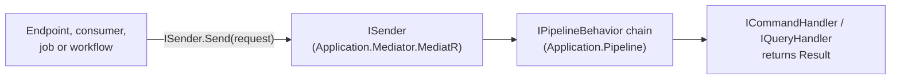
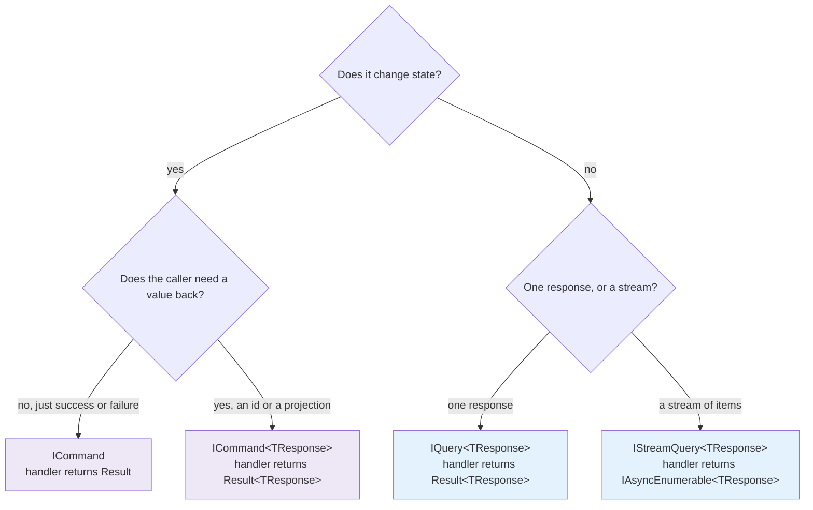

# SharedKernel.Application

[](https://dotnet.microsoft.com/)
[](https://github.com/Gresta-Vertex-Labs/platform-shared-kernel/blob/main/LICENSE)


> **The CQRS vocabulary every service speaks — the kernel's own request, handler, sender and pipeline-behavior
> contracts, commands, queries, validators, domain-event handlers and the markers the pipeline keys off — with no
> mediator library in it, so an Application project references this and nothing else.**

| You get | So that |
| --- | --- |
| `IRequest<T>`, `IRequestHandler<,>`, `ISender`, `IPipelineBehavior<,>` | Handlers and behaviors are written against kernel contracts; MediatR (or any other transport) is replaceable without touching them |
| `ICommand`, `ICommand<TResponse>`, `IQuery<TResponse>` | A request's *intent* is visible in its declaration, and the pipeline can treat writes and reads differently |
| `ICommandBase` / `IQueryBase` markers | A behavior constrains to "any command" or "any query" once, and the container simply never resolves it for the other kind |
| Handler aliases (`ICommandHandler<>`, `IQueryHandler<,>`) | A handler class says what it is, instead of `IRequestHandler<PlaceOrder, Result<Guid>>` |
| Every handler returns `Result`/`Result<T>` | An expected failure is a value the caller must handle, not an exception thrown past it |
| `IStreamQuery<TResponse>` and its handler | A large read streams item by item instead of materializing in memory |
| `IRequestValidator<TRequest>` | Validation is a kernel port; FluentValidation is one optional implementation |
| `IDomainEventHandler<TDomainEvent>` | A domain event from `SharedKernel.Domain` is handled against the raw event type, with no wrapper |
| `[RequirePermission]` (always enforced) and the request markers (`IIdempotentRequest`, `IAuditableRequest<T>`, `ILoggableRequest<T>`, `ICacheableQuery<T>`, `IInvalidatesCache`) and `ICommandScope` | A request opts into a behavior by declaring an interface; the handler body never changes |

## Contents

- [Install](#install)
- [Quick start](#quick-start)
- [How it works](#how-it-works)
- [Recipes](#recipes)
- [Reference](#reference)
- [Testing](#testing)
- [Pitfalls](#pitfalls)
- [Design decisions](#design-decisions)

## Install

```xml
<PackageReference Include="SharedKernel.Application" />
```

The version comes from your central `SharedKernelVersion` property — every SharedKernel package ships at the same
version. See [Using the packages](https://github.com/Gresta-Vertex-Labs/platform-shared-kernel#using-the-packages).

| Requirement | Value |
| --- | --- |
| Target framework | `net10.0` |
| Tier | Abstractions — reference it from your **Application** project |
| Depends on | `SharedKernel.Primitives`, `SharedKernel.Domain`, `SharedKernel.Caching.Abstractions` (for `CachePolicy` on `ICacheableQuery`); no MediatR, no FluentValidation |
| Namespaces | `SharedKernel.Application.*` — see [Namespaces](#namespaces) |

This package registers nothing. The host (Api or Worker project) wires the pipeline and the transport with
[`SharedKernel.Application.Pipeline`](https://github.com/Gresta-Vertex-Labs/platform-shared-kernel/blob/main/src/Application/SharedKernel.Application.Pipeline/README.md) and
[`SharedKernel.Application.Mediator.MediatR`](https://github.com/Gresta-Vertex-Labs/platform-shared-kernel/blob/main/src/Application/SharedKernel.Application.Mediator.MediatR/README.md):

```csharp
builder.Services.AddSharedKernelApplication(typeof(PlaceOrderCommand).Assembly, app => app.UseMediatR());
```

## Quick start

```csharp
using SharedKernel.Application.Messaging;
using SharedKernel.Presentation.WebApi;   // the endpoint only: ToCreated
using SharedKernel.Primitives.Clocks;
using SharedKernel.Primitives.Results;

// 1. The command: what the caller wants, and what it gets back on success.
public sealed record PlaceOrderCommand(string Customer, decimal Amount) : ICommand<Guid>;

// 2. The handler: business decisions only. No logging, no try/catch, no SaveChanges.
public sealed class PlaceOrderHandler(IOrderRepository repository, IClock clock)
    : ICommandHandler<PlaceOrderCommand, Guid>
{
    public async Task<Result<Guid>> Handle(PlaceOrderCommand command, CancellationToken cancellationToken)
    {
        var order = Order.Place(command.Customer, command.Amount, clock);
        if (order.IsFailure)
            return Result<Guid>.Failure(order.Error);   // an expected outcome, not an exception

        await repository.AddAsync(order.Value, cancellationToken);
        return Result<Guid>.Success(order.Value.Id.Value);
    }
}

// 3. The endpoint (Api project): send through the kernel ISender and map the Result to HTTP.
app.MapPost("/orders", (PlaceOrderCommand command, ISender sender, CancellationToken ct) =>
    sender.Send(command, ct).ToCreated(id => $"/orders/{id}"));
```

Three properties hold from here on, and they are what the rest of the platform builds on:

- **The handler never throws for an expected failure.** A blocked customer, a missing order, a rule
  violation — each is a `Result.Failure` carrying an `Error`.
- **The handler never performs cross-cutting work.** Commit, cache, audit and log are the pipeline's job, and
  adding one later changes no handler.
- **The response type is `Result` or `Result<T>`.** Several behaviors short-circuit by *constructing* a
  failed response, which only those types can express.

## How it works

A request travels from the caller through `ISender` into the kernel pipeline and on to exactly one handler. This
package only declares the shapes; the host decides the transport and the behaviors:



### Which interface do I implement?



| Request type | Handler alias | Handler returns | Transaction, idempotency, auditing apply? |
| --- | --- | --- | --- |
| `ICommand` | `ICommandHandler<TCommand>` | `Result` | Yes — it is a command |
| `ICommand<TResponse>` | `ICommandHandler<TCommand,TResponse>` | `Result<TResponse>` | Yes |
| `IQuery<TResponse>` | `IQueryHandler<TQuery,TResponse>` | `Result<TResponse>` | No — those behaviors constrain to `ICommandBase` |
| `IStreamQuery<TResponse>` | `IStreamQueryHandler<TQuery,TResponse>` | `IAsyncEnumerable<TResponse>` | No — only `IStreamPipelineBehavior<,>`s you register apply |

`ICommandBase` and `IQueryBase` carry no members. They exist so a behavior can be written once against "a
command" — the container then resolves that behavior for commands and silently skips it for everything else.
That is a registration-time fact, not an `if` inside the behavior.

## Recipes

### 1. A command that changes state

```csharp
public sealed record CancelOrderCommand(Guid OrderId, string Reason) : ICommand;

public sealed class CancelOrderHandler(IOrderRepository repository)
    : ICommandHandler<CancelOrderCommand>
{
    public async Task<Result> Handle(CancelOrderCommand command, CancellationToken cancellationToken)
    {
        var order = await repository.GetAsync(new OrderId(command.OrderId), cancellationToken);
        if (order is null)
            return Result.Failure(Error.NotFound("order.not_found", "The order does not exist."));

        return order.Cancel(command.Reason);   // the aggregate returns Result
    }
}
```

`ICommand` binds the response to the non-generic `Result`, so a caller still branches on `IsSuccess` without
an exception and without an unused return value.

### 2. A query that reads

```csharp
public sealed record GetOrderQuery(Guid OrderId) : IQuery<OrderDto>;

public sealed class GetOrderHandler(IOrderReadService reads) : IQueryHandler<GetOrderQuery, OrderDto>
{
    public async Task<Result<OrderDto>> Handle(GetOrderQuery query, CancellationToken cancellationToken)
    {
        var dto = await reads.FindAsync(query.OrderId, cancellationToken);
        return dto is null
            ? Result<OrderDto>.Failure(Error.NotFound("order.not_found", "The order does not exist."))
            : Result<OrderDto>.Success(dto);
    }
}
```

A query never implements `ICommandBase`, so `TransactionBehavior`, `IdempotencyBehavior` and
`AuditingBehavior` are simply absent from its pipeline. Nothing is skipped at runtime — they never resolve.

### 3. Who is calling — `IRequestContext`

The caller contract is `SharedKernel.Execution.Context.IRequestContext` (`SharedKernel.Execution`, Foundation tier) — the one
caller contract the whole platform shares: `IsAuthenticated`, `UserId`, `TenantId` (`TenantId?`), `ActorKind`
(`User`/`Service`/`System`/`Anonymous`), `ClientId`, `SessionId`, `CorrelationId` and `HasPermissionAsync`.
A handler that needs it injects it:

```csharp
public sealed class ListMyOrdersHandler(IOrderReadService reads, IRequestContext caller)
    : IQueryHandler<ListMyOrdersQuery, IReadOnlyList<OrderDto>>
{
    public async Task<Result<IReadOnlyList<OrderDto>>> Handle(ListMyOrdersQuery query, CancellationToken ct) =>
        Result<IReadOnlyList<OrderDto>>.Success(await reads.ListForCustomerAsync(caller.UserId!, ct));
}
```

An HTTP service registers it with `SharedKernel.ServiceDefaults.Security`'s `AddSharedKernelRequestContext()`
(over `SharedKernel.Security.Abstractions`' `IUserContext`). A caller with no inbound request (a scheduled job, a
startup task, a test) opens an ambient scope with one of `SharedKernel.Execution`'s own contexts; `IRequestContext`
resolves to it for everything awaited inside:

```csharp
using SharedKernel.Execution.Context;

// A named identity with exactly the permissions it needs (optionally a tenant and a correlation id).
var worker = new SystemRequestContext(["orders.expire", "invoices.issue"], identity: "billing-worker", tenantId: tenantId);

using (RequestContextScope.Begin(worker))
{
    await sender.Send(new ExpireStaleOrdersCommand(), ct);
}

// An unauthenticated path: no user, no tenant, no permissions.
using (RequestContextScope.Begin(AnonymousRequestContext.Instance)) { /* … */ }
```

`SystemRequestContext` takes an explicit permission list on purpose. There is no "system bypasses
authorization" mode, because a worker that can do everything is indistinguishable from a bug that does
everything.

### 4. Validating a request

`ValidationBehavior` runs every `IRequestValidator<TRequest>` registered for a request, one after another, and
returns a single `Error.Validation(errors)`; the handler never runs. Write one by hand:

```csharp
public sealed class PlaceOrderValidator : IRequestValidator<PlaceOrderCommand>
{
    public ValueTask<IReadOnlyList<Error>> ValidateAsync(PlaceOrderCommand command, CancellationToken ct)
    {
        if (command.Amount > 0)
            return ValueTask.FromResult<IReadOnlyList<Error>>([]);

        var error = Error.Validation("order.amount.not_positive", "The amount must be positive.") with
        {
            MessageArguments = new Dictionary<string, object?> { [ErrorArgumentNames.PropertyPath] = "Amount" },
        };
        return ValueTask.FromResult<IReadOnlyList<Error>>([error]);
    }
}
```

or keep FluentValidation validators and bridge them at the composition root with
`services.AddFluentValidationRequestValidators(typeof(PlaceOrderValidator).Assembly)` (`SharedKernel.Validation.FluentValidation`). Put the
field path under `ErrorArgumentNames.PropertyPath` — `SharedKernel.Presentation.WebApi` keys the ProblemDetails `errors` map by it —
and never put the rejected value in an error.

### 5. Handling a domain event

```csharp
public sealed class SendOrderConfirmation(IEmailSender email) : IDomainEventHandler<OrderPlaced>
{
    public Task Handle(OrderPlaced domainEvent, CancellationToken cancellationToken) =>
        email.SendAsync(domainEvent.CustomerEmail, cancellationToken);
}
```

You implement `IDomainEventHandler<TDomainEvent>` against the **raw domain event** — there is no notification
wrapper. `AddSharedKernelApplication(assemblies, …)` discovers handlers in the scanned assemblies; a handler elsewhere is
registered with `AddDomainEventHandler<OrderPlaced, SendOrderConfirmation>()` (`SharedKernel.Application.Pipeline`).
The native `DomainEventDispatcher` (registered by the same call) resolves them.

**When events are dispatched.** The persistence packages' `SharedKernelDbContext.SaveChangesAsync` collects the events
from tracked aggregates and dispatches them **before** the physical save — on every save path (the unit of
work, a seeder, a factory user) — repeating until handlers raise no more, then writes everything in one save.
Consequences worth internalising:

- **Dispatch is serial**, events in list order, handlers in registration order, exact runtime event type only.
  There is no parallel mode: concurrent handlers would share one `DbContext`, which is not thread-safe.
- **A handler's database changes join the same save and the same transaction.** Inside `TransactionBehavior`
  they commit or roll back with the command.
- **A handler exception abandons the save** and fails the request; nothing is written. Because dispatch happens
  before commit, a handler with an effect outside the database — sending mail, calling another service — must not
  run here: put it behind an integration event (`SharedKernel.Contracts` + `SharedKernel.Messaging.Abstractions`) or `ICommandScope.OnCompleted`,
  which runs after the commit.
- **No dispatcher registered**: the events are discarded with a warning.

### 6. Streaming a large read

```csharp
public sealed record ExportOrdersQuery(DateOnly From) : IStreamQuery<OrderRow>;

public sealed class ExportOrdersHandler(IOrderReadService reads)
    : IStreamQueryHandler<ExportOrdersQuery, OrderRow>
{
    public IAsyncEnumerable<OrderRow> Handle(ExportOrdersQuery query, CancellationToken cancellationToken) =>
        reads.StreamAsync(query.From, cancellationToken);
}

await foreach (var row in sender.CreateStream(query, ct))
    await writer.WriteAsync(row, ct);
```

Two deliberate differences from every other request here:

- **Items are not wrapped in `Result<T>`.** A stream's natural error channel is an exception that ends
  enumeration. Wrapping each item would force every consumer to unwrap on every iteration, and a single
  terminal `Result` cannot say "the stream opened fine, then item 4,000 failed."
- **The unary behaviors do not apply.** Streams go through `IStreamPipelineBehavior<,>`, and the platform ships
  none; `StreamRequestPipeline<,>` runs any a service registers. Logging, validation and authorization for a
  stream are otherwise the handler's own responsibility.

### 7. Writing a pipeline behavior

`IPipelineBehavior<TRequest, TResponse>` is MediatR-shaped: `next` is an argument-less
`RequestHandlerContinuation<TResponse>`, so `await next()` reads as it always did.

```csharp
public sealed class TenantRequiredBehavior<TRequest, TResponse>(IRequestContext caller)
    : IPipelineBehavior<TRequest, TResponse>
    where TRequest : ICommandBase
{
    public Task<TResponse> Handle(TRequest request, RequestHandlerContinuation<TResponse> next, CancellationToken ct) =>
        caller.TenantId is null ? throw new InvalidOperationException("No tenant.") : next();
}
```

Register it into a named stage with `app.WithBehavior(typeof(TenantRequiredBehavior<,>),
PipelineStage.Authorization, typeof(IRequestContext))` on `AddSharedKernelApplication` so it lands in the canonical order.

## Reference

### Namespaces

| Namespace | Holds |
| --- | --- |
| `SharedKernel.Application.Messaging` | `IRequest<TResponse>`, `IRequestHandler<TRequest,TResponse>`, `ISender`, `IPipelineBehavior<TRequest,TResponse>`, `RequestHandlerContinuation<TResponse>`, `ICommandBase`, `ICommand`, `ICommand<TResponse>`, `IQueryBase`, `IQuery<TResponse>`, and the three handler aliases |
| `SharedKernel.Application.Streaming` | `IStreamQuery<TResponse>`, `IStreamQueryHandler<TQuery,TResponse>`, `IStreamPipelineBehavior<,>`, `StreamHandlerContinuation<TResponse>` |
| `SharedKernel.Application.Validation` | `IRequestValidator<TRequest>` |
| `SharedKernel.Application.DomainEvents` | `IDomainEventHandler<TDomainEvent>` |
| `SharedKernel.Application.Authorization` | `RequirePermissionAttribute` |
| `SharedKernel.Application.Idempotency` | `IIdempotentRequest` |
| `SharedKernel.Application.Auditing` | `IAuditableRequest<TResponse>` |
| `SharedKernel.Application.Logging` | `ILoggableRequest<TResponse>` |
| `SharedKernel.Application.Caching` | `ICacheableQuery`, `ICacheableQuery<TValue>`, `IInvalidatesCache`, `CacheKeyRef`, `CacheScope` |
| `SharedKernel.Application.Commands` | `ICommandScope` |

### Messaging vocabulary

| Type | Shape |
| --- | --- |
| `IRequest<TResponse>` | Marker for a request answered by one `TResponse` |
| `IRequestHandler<TRequest,TResponse>` | `Task<TResponse> Handle(TRequest, CancellationToken)` |
| `ISender` | `Send<TResponse>(IRequest<TResponse>, ct)`, `CreateStream<TResponse>(IStreamQuery<TResponse>, ct)` |
| `IPipelineBehavior<TRequest,TResponse>` | `Handle(request, RequestHandlerContinuation<TResponse> next, ct)` |
| `ICommandBase` | Marker. Implemented by both command interfaces, never by a query |
| `ICommand` | `ICommandBase`, `IRequest<Result>` |
| `ICommand<TResponse>` | `ICommandBase`, `IRequest<Result<TResponse>>` |
| `IQueryBase` | Marker. Implemented by `IQuery<TResponse>` |
| `IQuery<TResponse>` | `IQueryBase`, `IRequest<Result<TResponse>>` |
| `ICommandHandler<TCommand>` | `IRequestHandler<TCommand, Result>` |
| `ICommandHandler<TCommand,TResponse>` | `IRequestHandler<TCommand, Result<TResponse>>` |
| `IQueryHandler<TQuery,TResponse>` | `IRequestHandler<TQuery, Result<TResponse>>` |
| `IStreamQuery<TResponse>` | Marker for a streamed request |
| `IStreamQueryHandler<TQuery,TResponse>` | `IAsyncEnumerable<TResponse> Handle(TQuery, CancellationToken)` |

The handler aliases add no members. They exist so a class declaration states its role.

### Request markers

| Marker | Members | Used by |
| --- | --- | --- |
| `[RequirePermission(params permissions)]` | `Permissions` — values of one attribute are alternatives; several attributes all apply; `AllowMultiple`, `Inherited` | `AuthorizationBehavior` (always registered; unauthenticated → 401 `unauthorized.default`, missing permission → 403 `forbidden.insufficient_permission`; streaming queries too) |
| `IIdempotentRequest` | `IdempotencyKey` (reserved per tenant and caller), `Fingerprint` (optional) | `IdempotencyBehavior` (commands only) |
| `IAuditableRequest<TResponse>` | `Action`, `ResourceType`, `ResourceId`, `BeforeSnapshot`, `GetAfterSnapshot(response)` | `AuditingBehavior` |
| `ILoggableRequest<TResponse>` | `LoggableRequestFields`, `GetLoggableResponseFields(response)` | `LoggingBehavior` |
| `ICacheableQuery<TValue>` | `CacheKey`, `CachePolicy`, `Scope`, `RefreshCache`, `ShouldCache(value)` | `CachingBehavior` (`.Pipeline.Caching`) |
| `IInvalidatesCache` | `CacheKeysToInvalidate` (`CacheKeyRef`), `CacheTagsToInvalidate`, `Scope` | `CacheInvalidationBehavior` (`.Pipeline.Caching`) |
| `ICommandScope` (injected, not implemented) | `IsActive`, `IsNested`, `OnCompleted(callback)` | Handlers queuing post-commit work |

### Logging

None: this package declares shapes and runs no code that logs. The pipeline's events (5100–5199) are listed in
[`SharedKernel.Application.Pipeline`](https://github.com/Gresta-Vertex-Labs/platform-shared-kernel/blob/main/src/Application/SharedKernel.Application.Pipeline/README.md#logging).

## Testing

A handler needs no harness: it is a class returning a `Result`. Reference
[`SharedKernel.Testing`](https://github.com/Gresta-Vertex-Labs/platform-shared-kernel/blob/main/src/Testing/SharedKernel.Testing/README.md) for the doubles:

```csharp
using SharedKernel.Testing.Application;   // FakeRequestContext
using SharedKernel.Testing.Clocks;        // FakeClock

var caller = new FakeRequestContext { Permissions = ["orders.place"] };   // authenticated, fixed user id

var result = await new PlaceOrderHandler(repository, new FakeClock()).Handle(command, default);

Assert.True(result.IsSuccess);
```

`TestRequestContext` (`SharedKernel.Testing.Execution`) covers the other callers: `ForUser`, `ForTenant`, `Service`,
`System`, `Anonymous`, then `WithPermissions(...)`. To test the composed pipeline — authorization, validation,
transactions — use
[`SharedKernel.Application.Testing`](https://github.com/Gresta-Vertex-Labs/platform-shared-kernel/blob/main/src/Application/SharedKernel.Application.Testing/README.md)'s
`ApplicationPipelineTestHarness`, described in the
[pipeline README](https://github.com/Gresta-Vertex-Labs/platform-shared-kernel/blob/main/src/Application/SharedKernel.Application.Pipeline/README.md#testing).

## Pitfalls

| Don't | Do | Why |
| --- | --- | --- |
| Throw for an expected failure | Return `Result.Failure(error)` | The pipeline records an exception instead of an error code, nothing commits, and no `Result` tells the caller why |
| Declare `IRequest<OrderDto>` (a response that is not `Result`/`Result<T>`) | Use `ICommand<T>`/`IQuery<T>` | Authorization and idempotency short-circuit by constructing a failed `Result`; analyzer `SK0040` flags it — do not suppress it |
| Implement MediatR's `IRequestHandler` or `INotificationHandler` | Implement the kernel interfaces | They are not discovered; the Application project should not reference MediatR at all |
| Expect the unary behaviors to run for a stream | Register an `IStreamPipelineBehavior<,>`, or handle it in the stream handler | `IStreamQuery<T>` runs through stream behaviors only (`[RequirePermission]` is still checked) |
| Give a `SystemRequestContext` every permission | List exactly what the worker needs | The explicit list is the worker's written-down blast radius |
| Send mail or call another service from an `IDomainEventHandler` | Publish an integration event, or use `ICommandScope.OnCompleted` | Domain events are dispatched before the commit; the effect would survive a rollback |

## Design decisions

**Why kernel-owned `IRequest`/`ISender`/`IPipelineBehavior` instead of MediatR's?** Application projects stay free of a
mediator library, and replacing MediatR is one new `ISender` adapter plugged in with the same builder call — no handler
changes.

**Why an argument-less `RequestHandlerContinuation<T>`?** `await next()` keeps behavior bodies in the shape most .NET
developers already know from MediatR.

**Why must every handler return `Result`/`Result<T>`?** Several behaviors short-circuit by constructing a failed
response; only these types can express one, and an expected failure becomes a value the caller must handle.

**Why are stream items not wrapped in `Result<T>`?** A stream's natural error channel is an exception that ends
enumeration; wrapping every item would force every consumer to unwrap on every iteration.

**Why a validation port instead of FluentValidation?** The pipeline carries no validation library.
`IRequestValidator<T>` is the contract; FluentValidation is bridged by `SharedKernel.Validation.FluentValidation`.

**What is deliberately not included?** A response envelope (errors become RFC 9457 ProblemDetails at the HTTP edge), the
caller contract (`IRequestContext` is in `SharedKernel.Execution`, shared with persistence and messaging), and any DI
registration — the host calls `AddSharedKernelApplication` from `SharedKernel.Application.Pipeline`.

---

Part of [Platform.SharedKernel](https://github.com/Gresta-Vertex-Labs/platform-shared-kernel) ·
[Application packages](https://github.com/Gresta-Vertex-Labs/platform-shared-kernel/blob/main/src/Application/README.md) ·
[MIT license](https://github.com/Gresta-Vertex-Labs/platform-shared-kernel/blob/main/LICENSE)
