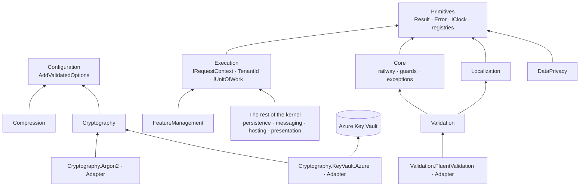

<div align="center">

# SharedKernel Foundation

**The ground floor of every service — failures as values, one caller context across every transport, configuration
that fails at startup, and cryptography, validation and privacy primitives with nothing left to get wrong.**

[](https://dotnet.microsoft.com/)
[](../../LICENSE)


[](https://openfeature.dev/)
[](https://docs.fluentvalidation.net/)
[](https://learn.microsoft.com/azure/key-vault/)

[What you get](#what-you-get) · [Packages](#packages) · [How it fits together](#how-it-fits-together) · [Get started](#get-started) · [See it run](#see-it-run) · [Guarantees](#guarantees)

<sub>📂 <code>src/Foundation</code> · <a href="../../docs/packages.md">all packages by tier</a> · <a href="../../README.md">Platform.SharedKernel</a></sub>

</div>

---

## What you get

- **Failures as values.** `Result<T>`, `Error` with stable codes and an `ErrorType` that maps mechanically to HTTP and
  gRPC status, plus railway chaining (`Map`, `Bind`, `Ensure`), `Guard.Against` and `ResultTry` boundaries that never
  leak exception text.
- **One caller, everywhere.** `IRequestContext` answers "who is calling, for which `TenantId`, under which correlation
  id" the same way for HTTP, gRPC, messages, workflows and jobs; `IUnitOfWork` gives every package one retry-safe
  transaction.
- **Configuration that stops the deployment, not the first request.** `AddValidatedOptions<TOptions>` binds an
  `ISectionBoundOptions` type and validates it at host start.
- **Cryptography with safe defaults.** AES-256-GCM, envelope encryption, signing, PHC password hashing (PBKDF2 or
  Argon2id), TOTP, `ISecureRandomGenerator` and `FixedTimeComparison` — keys from providers you register, Azure Key
  Vault included.
- **Data you can trust at the edge.** Validated identifiers (`Iban.Create` → `Result<Iban>`, `VatNumber`,
  `CardNumber`, …), personal-data attributes redacted in every log line, translated messages through
  `LocalizedMessage.Define`, and `IPayloadCompressor` with a decompression-bomb cap.
- **Registries that stop drift.** `WellKnownHeaders`, `WellKnownBaggageKeys`, `WellKnownTagKeys` and
  `LoggingEventIdRanges` are the one source of every wire name and logging block.

## Packages

| Package | Tier | Reference it from | Use it for |
| --- | --- | --- | --- |
| **Results and context** | | | |
| [SharedKernel.Primitives](SharedKernel.Primitives/README.md) | Foundation | any project | `Result`, `Error`, `IClock`, `IIdGenerator`, `SmartEnum`, `IReadinessProbe`, the `WellKnown*` registries |
| [SharedKernel.Core](SharedKernel.Core/README.md) | Foundation | any project | Railway extensions, `Guard.Against`, `ResultTry`, `ResultCombine`, the exception hierarchy |
| [SharedKernel.Execution](SharedKernel.Execution/README.md) | Foundation | any project | `IRequestContext`, `TenantId`/`TenantScope`, `RequestContextScope`, propagation, `IUnitOfWork`, `IAuditTrailWriter` |
| **Configuration and flags** | | | |
| [SharedKernel.Configuration](SharedKernel.Configuration/README.md) | Foundation | any project | Registering any options type (`AddValidatedOptions`) |
| [SharedKernel.FeatureManagement](SharedKernel.FeatureManagement/README.md) | Foundation | any project | Feature flags, rollouts and variants through OpenFeature `IFeatureClient` |
| **Cryptography** | | | |
| [SharedKernel.Cryptography](SharedKernel.Cryptography/README.md) | Foundation | any project | Encryption, signing, HMAC, password hashing, TOTP, secure random — BCL only |
| [SharedKernel.Cryptography.Argon2](SharedKernel.Cryptography.Argon2/README.md) | Adapter | Infrastructure | Argon2id password hashing instead of PBKDF2 |
| [SharedKernel.Cryptography.KeyVault.Azure](SharedKernel.Cryptography.KeyVault.Azure/README.md) | Adapter | Infrastructure | Encryption and signing keys held in Azure Key Vault |
| **Data at the edge** | | | |
| [SharedKernel.Validation](SharedKernel.Validation/README.md) | Foundation | any project | IBAN, BIC, card, VAT, national ID, phone and ISO codes parsed into validated types |
| [SharedKernel.Validation.FluentValidation](SharedKernel.Validation.FluentValidation/README.md) | Adapter | Infrastructure | `MustBeValidIban()`-style rules, and `IValidator<T>` run as the pipeline's `IRequestValidator<T>` |
| [SharedKernel.DataPrivacy](SharedKernel.DataPrivacy/README.md) | Foundation | any project | Personal-data classification and redaction; GDPR/KVKK export and erasure contracts |
| [SharedKernel.Localization](SharedKernel.Localization/README.md) | Foundation | any project | Translated error messages with typed, named arguments |
| [SharedKernel.Compression](SharedKernel.Compression/README.md) | Foundation | any project | Framed Brotli/gzip payloads with truncation detection and a size cap |
| **Test doubles** | | | |
| [SharedKernel.Cryptography.Testing](SharedKernel.Cryptography.Testing/README.md) | Testing | test projects | `AddFakeCryptography()` — real algorithms with call recording, key rotation and failure simulation |
| [SharedKernel.FeatureManagement.Testing](SharedKernel.FeatureManagement.Testing/README.md) | Testing | test projects | `FakeFeatureClient` / `AddFakeFeatureFlags()` — flags a test sets directly |

Start with Primitives, Core and Execution (most kernel packages bring them anyway); add Configuration for options and
the rest per need. Take an Adapter only for its library — Konscious, the Azure SDK or FluentValidation never reach the
base package. The caller, clock and logger doubles are in [SharedKernel.Testing](../Testing/SharedKernel.Testing/README.md).

## How it fits together



- **Context flows, it is never re-derived.** Every inbound adapter opens one `RequestContextScope`; every outbound one
  writes it with `RequestContextPropagation`. A propagated context never grants a permission, and "no tenant" is `null`
  — consumers fail closed.
- **Contracts here, implementations elsewhere.** Persistence implements `IUnitOfWork` and `IAuditTrailWriter`, every
  provider with an external dependency implements `IReadinessProbe`, and the presentation layer maps `ErrorType` to status.
- **No ASP.NET Core, no mediator, no ORM.** Primitives, Execution, Core, Cryptography and Compression take no
  third-party dependency at all.

## Get started

```xml
<PackageReference Include="SharedKernel.Core" />
<PackageReference Include="SharedKernel.Configuration" />
<PackageReference Include="SharedKernel.Cryptography" />
```

```csharp
builder.Services.AddClock();
builder.Services.AddValidatedOptions<PayoutOptions>(builder.Configuration);   // fails StartAsync when invalid
builder.Services.AddSharedKernelCryptography(builder.Configuration).AddSymmetricEncryption(); // + your IEncryptionKeyProvider

public sealed class PayoutOptions : ISectionBoundOptions
{
    public static string SectionName => "Payouts";
    [Range(1, 1_000_000)] public decimal MaxAmount { get; set; }
}

public sealed class PayoutService(IOptions<PayoutOptions> options, ISymmetricEncryptionService encryption)
{
    public async Task<Result<string>> PrepareAsync(Guid payoutId, string? accountNumber, decimal amount, CancellationToken ct) =>
        await (Guard.Against.NullOrWhiteSpace(accountNumber) ?? Guard.Against.NegativeOrZero(amount))
            .ToResult(() => amount)
            .Ensure(a => a <= options.Value.MaxAmount,
                    Error.BusinessRule("payout.over_limit", "The payout exceeds the configured limit."))
            .Map(_ => encryption.EncryptToStringAsync(
                accountNumber!, Encoding.UTF8.GetBytes($"payouts/{payoutId}/account"), ct).AsTask());
}
```

A bad `Payouts:MaxAmount` stops the host; a blank account number comes back as a `validation.*` error; the ciphertext
is bound to its payout. The key provider and every `using` are in the
[SharedKernel.Cryptography Quick start](SharedKernel.Cryptography/README.md#quick-start); the result types in the
[SharedKernel.Primitives Quick start](SharedKernel.Primitives/README.md#quick-start).

## See it run

Every service in [`samples/`](../../samples/README.md) is built on Primitives, Core and Execution. The ones that go further:

- [samples/Shop](../../samples/Shop/README.md) — the Catalog service evaluates OpenFeature flags, translates its
  errors through Localization and validates with FluentValidation, against real infrastructure.
  `dotnet run --project samples/Shop/Shop.AppHost --launch-profile http`
- The Shop's [Ordering](../../samples/Shop/Ordering/) — field encryption over Cryptography keys, Argon2 hashing, and
  FluentValidation validators bridged into the request pipeline from its Infrastructure project.
- The Shop's [Billing](../../samples/Shop/Billing/) — invoices signed and an IBAN envelope-encrypted under Key Vault keys
  (Cryptography.KeyVault.Azure), invoices compressed, IBAN/BIC/VAT checked by Validation, and personal data marked,
  redacted and served to GDPR export and erasure through DataPrivacy.

## Guarantees

| Guarantee | How it is held |
| --- | --- |
| **No exception text leaks into an `Error`** | `ResultTry` uses a fixed message and rethrows only cancellation — `ResultTryTests` |
| **Bad configuration stops the host** | `AddValidatedOptions` always calls `ValidateOnStart` — `ValidatedOptionsTests` (`…_ThrowsAtStartup`) |
| **Tenancy fails closed** | `TenantId` rejects `Guid.Empty` (`TenantIdTests`); a propagated context never holds a permission (`PropagatedRequestContextTests`) |
| **One time source** | Analyzer `SK0001` reports `DateTime.UtcNow`/`DateTimeOffset.UtcNow`; time comes from `IClock` |
| **Tampered or misplaced ciphertext never decrypts** | AES-256-GCM with required associated data — `AesGcmEncryptionServiceTests` |
| **No decompression bombs** | Output is bounded by bytes produced, not the claimed length — `DecompressionLimitTests` |
| **Personal data stays masked** | `CardNumber`/`NationalId` mask like `PiiMasking` (`PiiMaskingTests`); `SK0035` flags unmasked classified data at log call sites |
| **Stable wire formats, no third-party creep** | Header, baggage, tag and EventId values are pinned (`WellKnownPropagationConstantsTests`, `LoggingEventIdRangesTests`), compression frames by `FrameCompatibilityTests`; `CryptoIsolationRules` keeps Cryptography BCL-only |

---

<div align="center">
<sub>Part of <a href="../../README.md">Platform.SharedKernel</a> · <a href="../../docs/packages.md">all packages</a> · MIT license</sub>
</div>
