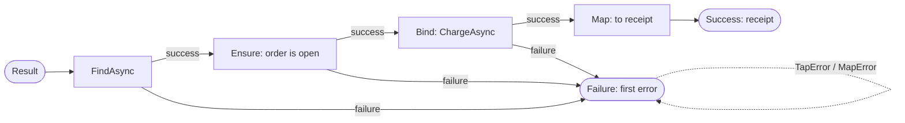

# SharedKernel.Core

[](https://dotnet.microsoft.com/)
[](https://github.com/Gresta-Vertex-Labs/platform-shared-kernel/blob/main/LICENSE)


> **Result chaining, guard clauses and exception boundaries for the `Result<T>`, `Result` and `Error` types of
> `SharedKernel.Primitives` — the operations you use them with every day, with no registration.**

| You get | So that |
| --- | --- |
| Railway extensions `Map`, `Bind`, `Ensure`, `Tap`, `TapError`, `MapError`, `Match` (sync, `Task`, `ValueTask`) | Steps that can fail chain without `if (IsFailure)` blocks; the first `Error` reaches the caller unchanged |
| `Guard.Against.*` (returns `Error?`) and `Guard.Throw.*` (throws `DomainException`) | One guard vocabulary for expected input failures and for broken invariants, with the same codes on both paths |
| `ResultTry.Try` / `TryAsync` | A throwing call becomes a failed result without leaking exception text to a response |
| `ResultCombine.Combine` and `Guard.Collect` | Every failure is reported, not just the first |
| `SharedKernelException` hierarchy + `error.ToException()` | Every exception carries a structured `Error` the presentation layer maps by type |
| Casing, sequence and date helpers | `ToSnakeCase`, `WhereNotNull`, `StartOfDay` without another dependency |

## Contents

- [Install](#install)
- [Quick start](#quick-start)
- [How it works](#how-it-works)
- [Recipes](#recipes)
- [Reference](#reference)
- [Testing](#testing)
- [Pitfalls](#pitfalls)
- [Design decisions](#design-decisions)

## Install

```xml
<PackageReference Include="SharedKernel.Core" />
```

The version comes from your central `SharedKernelVersion` property — every SharedKernel package ships at the same
version. See [Using the packages](https://github.com/Gresta-Vertex-Labs/platform-shared-kernel#using-the-packages).

| Requirement | Value |
| --- | --- |
| Target framework | `net10.0` |
| Tier | Foundation — reference it from **any** project |
| Depends on | [`SharedKernel.Primitives`](https://github.com/Gresta-Vertex-Labs/platform-shared-kernel/blob/main/src/Foundation/SharedKernel.Primitives/README.md) only |
| Namespaces | `SharedKernel.Guards` (`Guard`, `IGuardClause`, `ToResult`), `SharedKernel.Core.Extensions` (`ResultExtensions`, `ResultTry`, `ResultCombine`, helpers), `SharedKernel.Core.Exceptions` |

## Quick start

There is nothing to register: everything is a static or extension method.

```csharp
using SharedKernel.Core.Extensions;
using SharedKernel.Guards;
using SharedKernel.Primitives.Errors;
using SharedKernel.Primitives.Results;

public sealed class Customer
{
    public string Name { get; }
    public string Email { get; }

    // Invariants: a violation throws DomainException.
    public Customer(string? name, string? email)
    {
        Guard.Throw.NullOrWhiteSpace(name);
        Guard.Throw.Email(email);
        Name = name;      // [NotNull]: the compiler knows these are non-null now
        Email = email;
    }

    // Expected failures: return an Error instead of throwing.
    public static Result<Customer> Create(string? name, string? email) =>
        (Guard.Against.NullOrWhiteSpace(name) ?? Guard.Against.Email(email))
            .ToResult(() => new Customer(name, email));
}

public sealed class RegisterCustomer(ICustomerRepository customers, IWelcomeMailer mailer)
{
    public Task<Result<Guid>> HandleAsync(string? name, string? email, CancellationToken ct) =>
        Customer.Create(name, email)
            .Ensure(customer => !customers.EmailExists(customer.Email),
                    Error.Conflict(ErrorCodes.Conflict.Duplicate, "That email address is already registered."))
            .Bind(customer => ResultTry.TryAsync(token => customers.AddAsync(customer, token), ct))
            .Tap(id => mailer.QueueWelcome(id));
}
```

Every step after a failure is skipped. `customers.AddAsync` throws on a database fault; `ResultTry` turns that into a
failed result with a safe message and records the exception on the current trace.

## How it works

### A railway chain



```csharp
Result<ReceiptDto> receipt = await orders.FindAsync(orderId, ct)     // Task<Result<Order>>
    .Ensure(order => order.IsOpen, OrderErrors.Closed)
    .Bind(order => payments.ChargeAsync(order, ct))                   // Task<Result<Payment>>
    .Map(payment => payment.ToReceipt())
    .TapError(error => Log.CheckoutFailed(logger, error.Code));
```

Async rules:

1. **A source takes steps of its own awaitable type.** `Result`/`Task<Result>` sources take `Task`-returning steps;
   `ValueTask<Result>` sources take `ValueTask`-returning steps. Mixing would make every `async` lambda ambiguous; convert
   with `AsTask()`.
2. **Failures and cancellation are not swallowed.** A faulted source rethrows its exception; a cancelled one its
   `OperationCanceledException`. Neither becomes a failed result.
3. **A step must not return a `null` task** — the chain throws `InvalidOperationException` naming the problem.
4. **A lambda whose body only throws needs a return type**: write `Result () => throw new X()`.

Every operation throws `ArgumentNullException` for a `null` source `Result<T>` or delegate. An exception thrown inside a
step propagates unchanged — wrap throwing calls in `ResultTry`.

### Guards: two paths, one vocabulary

| | `Guard.Against.*` | `Guard.Throw.*` |
| --- | --- | --- |
| **Returns** | `Error?`: `null` when valid | nothing |
| **On violation** | returns a validation `Error` | throws `DomainException` carrying that `Error` |
| **Use in** | factory methods, handlers, anything returning `Result<T>` | constructors, aggregate methods, invariants |

- **A guard never throws because of the value it checks** — `Guard.Against` is safe on raw request data, including
  `null`. It throws only for its own arguments: `ArgumentNullException` for a `null` pattern or error, `ArgumentException`
  for a malformed regular expression.
- **The parameter name is automatic** (`[CallerArgumentExpression]`); pass one to override it.
- **Messages use the invariant culture** and never include the regex pattern. Branch and translate on `Error.Code`.
- **Regex matching is bounded.** Each pattern is compiled once and cached (up to 256 patterns, oldest evicted first);
  matching stops after 250 ms and a timeout is reported as a format violation.
- **Collections are read no further than needed.** `Empty` reads at most one element, `MinCount` at most `min`,
  `MaxCount` at most `max + 1`; a collection that exposes its count is not enumerated.
- `Guard.Throw` parameters are `[NotNull]` and `True`/`False` are `[DoesNotReturnIf]`, so null-state analysis continues.

### Exception boundaries

Without `onException`, `ResultTry` maps any exception to
`Error.Unexpected("unexpected.exception", ResultTry.DefaultUnexpectedMessage)` — the exception's type and message are
never copied, because driver and SDK messages can contain host names or credentials. The exception is recorded on
`Activity.Current` instead (once per inner exception of an `AggregateException`). `OperationCanceledException` always
propagates, and the `CancellationToken` overloads do not call the delegate when the token is already cancelled.

## Recipes

### 1. Stop at the first guard violation

```csharp
public static Result<Money> Create(decimal amount, string? currency) =>
    (Guard.Against.Negative(amount)
     ?? Guard.Against.NullOrWhiteSpace(currency)
     ?? Guard.Against.LongerThan(currency, maxLength: 3))
    .ToResult(() => new Money(amount, currency!));
```

`error.ToResult()` → `Result`; `error.ToResult(value)` evaluates the value first; `error.ToResult(() => value)` runs the
factory only when every guard passed — use it when building the value would throw for invalid input.

### 2. Report every violation at once

```csharp
ValidationResult validation = Guard.Collect(
    Guard.Against.NullOrWhiteSpace(request.Name),
    Guard.Against.Email(request.Email),
    Guard.Against.OutOfRange(request.Quantity, 1, 100),
    Guard.Against.NotUtc(request.DeliverAt));

if (!validation.IsValid)
    return Error.Validation(validation.Errors);   // one Error per failed guard, in argument order

ValidationResult<IReadOnlyList<LineItem>> lines = ResultCombine.Combine(
    request.Lines.Select(line => LineItem.Create(line.Sku, line.Quantity)));
```

`Combine` accepts `params` arrays or any `IEnumerable`, enumerates once, never short-circuits, and on success carries
every value in order.

### 3. Map a known exception to a specific error

```csharp
Result<Customer> customer = ResultTry.Try(
    () => crm.GetCustomer(customerId),
    ex => ex is CrmNotFoundException
        ? Error.NotFound("customer.not_found", "The customer does not exist.")
        : Error.Unexpected(ErrorCodes.Unexpected.Default, ResultTry.DefaultUnexpectedMessage));
```

### 4. Write your own guard

```csharp
using System.Runtime.CompilerServices;
using SharedKernel.Guards;
using SharedKernel.Primitives.Errors;

public static class SkuGuards
{
    public static Error? InvalidSku(
        this IGuardClause guard,
        string? value,
        [CallerArgumentExpression(nameof(value))] string? paramName = null)
        => value is { Length: 8 } && value.All(char.IsAsciiLetterOrDigit)
            ? null
            : Error.Validation("sku.invalid", $"'{paramName}' must be 8 letters or digits.");
}

Error? error = Guard.Against.InvalidSku(request.Sku);
```

It appears under `Guard.Against.` beside the built-in guards. Analyzer `SK0006` reports a `throw` inside guard code.

### 5. Leave the railway

| You want | Use |
| --- | --- |
| One value for both branches | `Match(onSuccess, onFailure)` |
| The value, or an exception | `GetValueOrThrow()` |
| An exception when a command failed | `ThrowIfFailure()` |
| The matching exception for an error | `error.ToException()` |

## Reference

### Railway operations (`SharedKernel.Core.Extensions.ResultExtensions`)

Every operation exists for `Result<T>` and `Result` (for `Result` the delegates take no value), on plain, `Task` and
`ValueTask` sources.

| Operation | On success | On failure | Returns |
| --- | --- | --- | --- |
| `Map(value => newValue)` | transforms the value | skipped | `Result<TOut>` |
| `Bind(value => nextResult)` | runs the next step | skipped | the step's `Result<TOut>` or `Result` |
| `Ensure(value => condition, error)` | fails with `error` when false | skipped | same result type |
| `Ensure(value => condition, value => error)` | builds the error from the rejected value | skipped | `Result<T>` |
| `Tap(value => sideEffect)` | runs the side effect | skipped | the source result |
| `TapError(error => sideEffect)` | skipped | runs the side effect | the source result |
| `MapError(error => newError)` | skipped | transforms the error | same result type |
| `Match(onSuccess, onFailure)` | runs `onSuccess` | runs `onFailure` | the function's output |
| `GetValueOrThrow()` | returns the value (`Result<T>`) | throws `error.ToException()` | `T` |
| `ThrowIfFailure()` | nothing (`Result`) | throws `error.ToException()` | `void` |

### `ResultTry` and `ResultCombine`

| Member | Returns |
| --- | --- |
| `ResultTry.Try<T>(Func<T> [, onException])` / `Try(Action [, onException])` | `Result<T>` / `Result` |
| `ResultTry.TryAsync<T>(Func<Task<T>> [, onException])` / `TryAsync(Func<Task> [, onException])` | `Task<Result<T>>` / `Task<Result>` |
| `ResultTry.TryAsync<T>(Func<CancellationToken, Task<T>> [, onException], CancellationToken)` (and non-generic) | `Task<Result<T>>` / `Task<Result>` |
| `ResultCombine.Combine(Result…)` | `ValidationResult` |
| `ResultCombine.Combine<T>(Result<T>…)` | `ValidationResult<IReadOnlyList<T>>` |

### Guards

`{name}` is the source text of the checked argument. `Guard.Collect(params Error?[])` → `ValidationResult`.

| Guard | Violation | `Error.Code` |
| --- | --- | --- |
| `Null(value)` | `null` (reference or `Nullable<T>`) | `validation.required` |
| `NullOrEmpty(value)` / `NullOrWhiteSpace(value)` | `null`, `""` (or only whitespace) | `validation.required` |
| `ShorterThan(value, minLength)` / `LongerThan(value, maxLength)` | length outside the bound | `validation.min_length` / `validation.max_length` |
| `Negative(value)` / `NegativeOrZero(value)` | `< 0` / `<= 0`, or `NaN`; any numeric type | `validation.out_of_range` |
| `OutOfRange(value, min, max)`, `LessThan(value, min)`, `GreaterThan(value, max)` | outside the bound (inclusive range) | `validation.out_of_range` |
| `Default(value)` | equals `default(T)` | `validation.required` |
| `InvalidGuid(value)` | `Guid.Empty` | `validation.required` |
| `InvalidEnumValue(value)` | not a named member, e.g. `(Status)99` | `validation.out_of_range` |
| `InvalidSmartEnum<TEnum, TValue>(value)` | no member has the value | `validation.out_of_range` |
| `NotUtc(DateTimeOffset)` / `NotUtc(DateTime)` | non-zero offset / kind `Local` or `Unspecified` | `validation.invalid_format` |
| `InvalidFormat(value, pattern)` | no regex match, or the match timed out | `validation.invalid_format` |
| `Email(value)` | not shaped like `local@domain.tld` | `validation.invalid_format` |
| `Empty(source)`, `MinCount(source, min)`, `MaxCount(source, max)` | no elements / too few / too many | `validation.required` / `validation.out_of_range` |
| `True(condition, error)` / `False(condition, error)` | condition is `false` / `true` | your error's code |

A `null` input to a length, range, format or collection guard is reported as `validation.required`
(`'{name}' must not be null.`); a blank input to `Email` gets the `NullOrWhiteSpace` message. `ResultTry`'s default
mapping produces `unexpected.exception`. All codes are `ErrorCodes` constants in `SharedKernel.Primitives`.

### Exceptions (`SharedKernel.Core.Exceptions`)

Every exception derives from `SharedKernelException` and carries a non-null `Error` (no string-only constructors;
`SK0005` reports one on a subclass).

| Exception | Pair with `ErrorType` | HTTP |
| --- | --- | --- |
| `ValidationException` | `Validation` (one or many errors, in `Errors`) | 400 |
| `UnauthorizedException` | `Unauthorized` | 401 |
| `ForbiddenException` | `Forbidden` | 403 |
| `NotFoundException` | `NotFound` | 404 |
| `ConflictException` | `Conflict` | 409 |
| `DomainException` (not sealed) | `BusinessRule`, or the error of a `Guard.Throw` violation | from `Error.Type` |

`error.ToException()` maps `Validation`, `NotFound`, `Conflict`, `Unauthorized` and `Forbidden` to their exceptions and
every other type to `DomainException`; it throws `ArgumentException` for `Error.None`.

### Helpers

| Method | Behaviour |
| --- | --- |
| `ToSnakeCase`, `ToKebabCase`, `ToCamelCase`, `ToPascalCase` | Split at `_`, `-`, whitespace, a lower-to-upper change and an acronym end; invariant casing (`HTMLParser` → `html_parser`, `HtmlParser`) |
| `source.IsNullOrEmpty()` | `true` for `null` or empty; `[NotNullWhen(false)]`; reads at most one element |
| `source.WhereNotNull()` | Drops `null` elements and narrows the type; deferred |
| `value.StartOfDay()` | Midnight of the value's day, same offset; query a day as `start <= x && x < start.AddDays(1)` |

### Logging

The package does not log; `ResultTry` records exceptions on `Activity.Current`.

## Testing

Nothing to fake: the extensions are pure. Assert on the result —
`Assert.True(result.IsFailure); Assert.Equal(ErrorCodes.Validation.Required, result.Error.Code);` — and test a guard's
`Against.*` and `Throw.*` paths separately. For time-dependent code, use `FakeClock` from
[`SharedKernel.Testing`](https://github.com/Gresta-Vertex-Labs/platform-shared-kernel/blob/main/src/Testing/SharedKernel.Testing/README.md).

## Pitfalls

| Don't | Do | Why |
| --- | --- | --- |
| `Guard.Throw` on request input in a handler | `Guard.Against` + `ToResult` | Invalid input is an expected outcome, not an exception |
| Chain guards with `??` when the caller needs every error | `Guard.Collect` or `ResultCombine.Combine` | `??` stops at the first violation |
| `try/catch` that puts `ex.Message` into an `Error` | `ResultTry` (default mapping) | Exception text can leak hosts and credentials into responses |
| Catch `OperationCanceledException` into a result | Let it propagate | A cancelled request is not a failure |
| `new NotFoundException(Error.Validation(...))` | Keep class and type consistent, or `error.ToException()` | The HTTP status follows `Error.Type`, not the class |
| Put secrets in `Error.Message` | Pass the cause as `innerException` | `Exception.Message` is `Error.Message`, which may reach the client |
| Mix `Task` and `ValueTask` steps on one source | `AsTask()` to cross over | The overloads are per awaitable type |
| `() => throw new X()` as a step | `Result () => throw new X()` | Without a return type it matches both sync and async overloads |
| Build an inclusive end-of-day at 23:59:59.999 | `StartOfDay()` with an exclusive `AddDays(1)` end | The inclusive form misses the last ticks |

## Design decisions

**Why no `ValueTask` overload of `ResultTry`?** It would make every `async` lambda ambiguous. Use `TryAsync` or `.AsTask()`.

**Why does the default `ResultTry` mapping hide the exception?** An error message can reach an HTTP response; the
exception belongs on the trace, where operators can see it.

**Why guards in this package rather than a separate Guards package?** One package, no extra dependency; the namespace
`SharedKernel.Guards` keeps them distinct.

**Is it AOT-safe?** No reflection-based member lookup, `dynamic` or runtime code generation; zero warnings under the
trim, AOT and single-file analyzers. `Email` uses a source-generated regex; `InvalidFormat` compiles caller patterns at
runtime, which Native AOT runs interpreted.

**What is deliberately not here?** No metadata bag on `Error`, no `IsNullOrWhiteSpace`/`ToBatches`/Unix-time helpers (the
BCL has them: `string.IsNullOrWhiteSpace`, `Enumerable.Chunk`, `ToUnixTimeMilliseconds`), no DI registration.

---

Part of [Platform.SharedKernel](https://github.com/Gresta-Vertex-Labs/platform-shared-kernel) ·
[Core domain](https://github.com/Gresta-Vertex-Labs/platform-shared-kernel/blob/main/src/Foundation/README.md) ·
[MIT license](https://github.com/Gresta-Vertex-Labs/platform-shared-kernel/blob/main/LICENSE)
