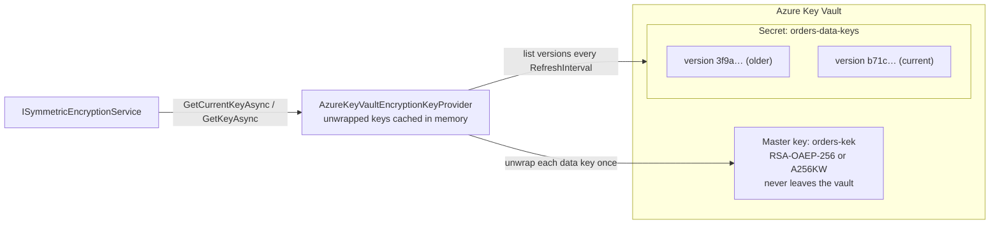

# SharedKernel.Cryptography.KeyVault.Azure

[](https://dotnet.microsoft.com/)
[](https://github.com/Gresta-Vertex-Labs/platform-shared-kernel/blob/main/LICENSE)


> **Azure Key Vault behind `SharedKernel.Cryptography`: encryption keys wrapped by a master key that never leaves the
> vault, and signing keys that sign inside it.**

Your code keeps using `ISymmetricEncryptionService`, `IEnvelopeEncryptionService` and `IAsymmetricSignatureService`. This
package supplies their keys from Key Vault (or a managed HSM), caches them so encryption stays in-process and fast,
rotates them with one call, and refuses to let a forged payload steer it toward keys you did not configure.

| You get | So that |
| --- | --- |
| `AddAzureKeyVaultEncryption(configuration)` | AES-256 data keys wrapped by an RSA or HSM master key, shared by every replica and cached in memory |
| `RotateDataKeyAsync()` | Rotation is one call; old payloads keep decrypting |
| An `IEnvelopeEncryptionProvider` | A fresh data key per file; only configured master keys unwrap |
| `AddAzureKeyVaultSigning(configuration)` | RSA and ECDSA keys sign inside Key Vault; verification runs locally |
| The `encryption-key-provider` readiness probe | `/health/ready` reports whether the master key is reachable |
| Forged-id protection | Malformed key ids never reach Key Vault; unknown ones re-list at most once every 10 seconds |

## Contents

- [Install](#install)
- [Quick start](#quick-start)
- [How it works](#how-it-works)
- [Recipes](#recipes)
- [Configuration](#configuration)
- [Reference](#reference)
- [Testing](#testing)
- [Pitfalls](#pitfalls)
- [Design decisions](#design-decisions)

## Install

```xml
<PackageReference Include="SharedKernel.Cryptography.KeyVault.Azure" />
```

The version comes from your central `SharedKernelVersion` property — every SharedKernel package ships at the same
version. See [Using the packages](https://github.com/Gresta-Vertex-Labs/platform-shared-kernel#using-the-packages).

| Requirement | Value |
| --- | --- |
| Target framework | `net10.0` |
| Tier | Adapter — reference it from your **Infrastructure** project (or the host that registers cryptography) |
| Depends on | [`SharedKernel.Cryptography`](https://github.com/Gresta-Vertex-Labs/platform-shared-kernel/blob/main/src/Foundation/SharedKernel.Cryptography/README.md), `SharedKernel.Configuration`, `Azure.Security.KeyVault.Keys`, `Azure.Security.KeyVault.Secrets`, `Azure.Identity` |
| Namespaces | `SharedKernel.Cryptography.KeyVault.Azure` |
| Azure resources | A key vault or managed HSM with a master key, a secret name for data keys, and signing keys if you sign |

## Quick start

```csharp
using Azure.Core;
using Azure.Identity;
using SharedKernel.Cryptography.Extensions;
using SharedKernel.Cryptography.KeyVault.Azure;

builder.Services.AddSingleton<TokenCredential>(new ManagedIdentityCredential(ManagedIdentityId.SystemAssigned));

builder.Services.AddSharedKernelCryptography(builder.Configuration)
    .AddAzureKeyVaultEncryption(builder.Configuration)   // encryption keys, envelope keys, readiness probe
    .AddSymmetricEncryption()
    .AddEnvelopeEncryption()
    .AddAzureKeyVaultSigning(builder.Configuration)      // signing keys
    .AddAsymmetricSigning();
```

```json
{
  "SharedKernel": {
    "Cryptography": {
      "KeyVault": {
        "Azure": {
          "Encryption": {
            "VaultUri": "https://contoso-prod.vault.azure.net/",
            "MasterKeyName": "orders-kek",
            "DataKeySecretName": "orders-data-keys"
          },
          "Signing": {
            "VaultUri": "https://contoso-prod.vault.azure.net/",
            "Keys": { "receipts": { "KeyName": "receipt-signing", "Algorithm": "ES256" } }
          }
        }
      }
    }
  }
}
```

Create the first data key once per environment with `RotateDataKeyAsync()` (recipe 1) — until then encryption throws
`InvalidOperationException`. Then use the core services as usual; nothing in application code refers to Key Vault.
`AddAzureKeyVaultEncryption` and `AddAzureKeyVaultSigning` are independent and may point at different vaults.

## How it works

### Data keys

Data keys are AES-256 keys generated in your process, each wrapped by the master key and stored as a new version of one
Key Vault secret. The secret version id is the key id written into every payload.



- The newest enabled version is the current key. Once unwrapped, encryption runs in memory — a busy service makes a
  handful of Key Vault calls, not one per operation.
- Key ids that are not 32 lowercase hex characters return `null` without a call; an unknown well-formed id forces a fresh
  listing at most once every 10 seconds.
- Disabled versions stop encrypting and decrypting within `RefreshInterval`. If the vault is unreachable, calls keep
  working until the version list is due for refresh, then throw until it is back.
- RSA master keys wrap with RSA-OAEP-256; managed-HSM AES keys with A256KW. Unwrapping accepts only enabled versions of
  `MasterKeyName` and `PreviousMasterKeyNames`; any other key returns `cryptography.data_key_unwrap_failed` without a call.
- `RotateDataKeyAsync` generates 32 random bytes, wraps them and adds a secret version; concurrent rotations each add
  their own version, nothing is overwritten. Other replicas pick it up within `RefreshInterval`.
- Envelope encryption: `GenerateDataKeyAsync` wraps a fresh key with the current master key; `UnwrapDataKeyAsync` unwraps
  with a configured master key only. One Key Vault operation each — for files and exports, not many small values.

### Remote signing

Only ids configured under `Signing:Keys` resolve; any other id returns `null` without a call. The Key Vault key must
match its algorithm (RSA ≥ 2048 bits for `PS*`/`RS*`, the named curve for `ES*`), or `InvalidOperationException` is
thrown. Data is hashed locally and only the digest is sent to Key Vault's `sign`; verification is local with the cached
public key. Without `KeyVersion`, the latest version is re-read every `RefreshInterval`.

### Failure behaviour

Fails closed: an unreachable vault, a missing permission or a corrupt data key record throws. Only the readiness probe
reports failures as data — it reads the master key's metadata, never performs a cryptographic operation, and reports by
HTTP status or exception type without exception messages.

## Recipes

### 1. Create and rotate data keys

Rotate from one place — a deployment step, a scheduled job (for example a Kubernetes CronJob), or an admin endpoint —
never from every replica at startup.

```csharp
HostApplicationBuilder builder = Host.CreateApplicationBuilder(args);
builder.Services.AddSharedKernelCryptography(builder.Configuration)
    .AddAzureKeyVaultEncryption(builder.Configuration);

using IHost host = builder.Build();
var keyVault = host.Services.GetRequiredService<AzureKeyVaultEncryptionKeyProvider>();

string keyId = await keyVault.RotateDataKeyAsync();
Console.WriteLine($"Current data key is now {keyId}.");
```

Then move old payloads with the core package's `ReEncryptAsync` job, and disable (never delete) versions nothing uses.

### 2. Move to a new master key

1. Create the new key (`orders-kek-2027`) and grant the service identity access.
2. Set `"MasterKeyName": "orders-kek-2027"` and `"PreviousMasterKeyNames": [ "orders-kek" ]`, and deploy.
3. Run the rotation tool: the new data key is wrapped by `orders-kek-2027`.
4. Re-encrypt payloads so none use data keys wrapped by `orders-kek` (envelope payloads need a decrypt and encrypt).
5. Disable the old data key versions, remove `orders-kek` from `PreviousMasterKeyNames`, deploy, disable the old key.

Rotating the master key's own version in Key Vault (same name) needs no configuration change.

### 3. Sign with pinned key versions

Pin a version when signatures must stay verifiable after the key rotates, one key id per pinned version:

```json
"Signing": {
  "VaultUri": "https://contoso-prod.vault.azure.net/",
  "Keys": {
    "receipts-2026": { "KeyName": "receipt-signing", "KeyVersion": "2f3c8a9d4b5e6f708192a3b4c5d6e7f8", "Algorithm": "ES256" },
    "receipts-2027": { "KeyName": "receipt-signing", "KeyVersion": "9a8b7c6d5e4f30211203f4e5d6c7b8a9", "Algorithm": "ES256" },
    "partner-api":   { "KeyName": "partner-rsa", "Algorithm": "PS256" }
  }
}
```

Sign with the newest id and write it into the token (a JWS `kid`). When verifying, accept a `kid` only from the list for
that purpose — never any configured id, or a token signed with `partner-api` would pass as a receipt.

### 4. Report readiness

```csharp
builder.Services.AddHealthChecks().AddSharedKernelReadiness();   // SharedKernel.ServiceDefaults; includes "encryption-key-provider"
```

### 5. Develop locally

Use a development vault with `new AzureCliCredential()` after `az login`, or skip Key Vault on a developer machine:

```csharp
var cryptography = builder.Services.AddSharedKernelCryptography(builder.Configuration);

if (builder.Environment.IsDevelopment())
{
    // A random key per run: data encrypted in one run cannot be read in the next.
    builder.Services.AddSingleton<IEncryptionKeyProvider>(new StaticEncryptionKeyProvider(
        "dev", [new CryptographicKey("dev", RandomNumberGenerator.GetBytes(32))]));
}
else
{
    cryptography.AddAzureKeyVaultEncryption(builder.Configuration);
}

cryptography.AddSymmetricEncryption();
```

### 6. Provision the Azure resources

```shell
# Master key (RSA 3072). In a managed HSM, create an AES-256 key instead.
az keyvault key create --vault-name contoso-prod --name orders-kek --kty RSA --size 3072

VAULT_ID="$(az keyvault show --name contoso-prod --query id -o tsv)"
# Service identity: unwrap data keys, read the data key secret.
az role assignment create --assignee <service-principal-id> --role "Key Vault Crypto User"  --scope "$VAULT_ID/keys/orders-kek"
az role assignment create --assignee <service-principal-id> --role "Key Vault Secrets User" --scope "$VAULT_ID/secrets/orders-data-keys"
# Rotation identity: also writes new data key versions.
az role assignment create --assignee <rotation-principal-id> --role "Key Vault Secrets Officer" --scope "$VAULT_ID/secrets/orders-data-keys"
```

| Identity | Needs | Built-in role |
| --- | --- | --- |
| Service | `keys/get`, `keys/list`, `keys/unwrapKey` on each master key (`keys/wrapKey` too for envelopes); `secrets/get`, `secrets/list` on the data key secret | Key Vault Crypto User + Key Vault Secrets User |
| Rotation job | The above, plus `keys/wrapKey` and `secrets/set` | Key Vault Crypto User + Key Vault Secrets Officer |
| Signing | `keys/get`, `keys/sign` on each signing key | Key Vault Crypto User |

Scope role assignments to individual keys and secrets, not the whole vault.

### 7. Encrypt from synchronous code

This provider is asynchronous and the core package never blocks on it. For EF Core columns,
`SharedKernel.Persistence.EfCore.Encryption` warms keys at startup and serves them synchronously; elsewhere, load keys
into a `StaticEncryptionKeyProvider` at startup and register `ISynchronousSymmetricEncryptionService` over it.

## Configuration

Both sections are validated when the host starts; invalid configuration stops the host.

| Key | Type | Default | Meaning |
| --- | --- | --- | --- |
| `SharedKernel:Cryptography:KeyVault:Azure:Encryption:VaultUri` | `Uri` | — (required) | Absolute `https` URI of the vault or managed HSM |
| `SharedKernel:Cryptography:KeyVault:Azure:Encryption:MasterKeyName` | `string` | — (required) | 1–127 letters, digits or hyphens |
| `SharedKernel:Cryptography:KeyVault:Azure:Encryption:PreviousMasterKeyNames` | `string[]` | `[]` | Master keys still accepted for unwrapping |
| `SharedKernel:Cryptography:KeyVault:Azure:Encryption:DataKeySecretName` | `string` | — (required) | 1–127 letters, digits or hyphens |
| `SharedKernel:Cryptography:KeyVault:Azure:Encryption:RefreshInterval` | `TimeSpan` | `00:05:00` | 1 second – 1 day; how often versions are re-listed |
| `SharedKernel:Cryptography:KeyVault:Azure:Signing:VaultUri` | `Uri` | — (required) | Absolute `https` URI |
| `SharedKernel:Cryptography:KeyVault:Azure:Signing:Keys:{keyId}:KeyName` | `string` | — (required) | 1–127 letters, digits or hyphens; at least one key must be configured |
| `SharedKernel:Cryptography:KeyVault:Azure:Signing:Keys:{keyId}:KeyVersion` | `string` | latest | 32 lowercase hex characters |
| `SharedKernel:Cryptography:KeyVault:Azure:Signing:Keys:{keyId}:Algorithm` | `SignatureAlgorithm` | — (required) | `PS256`–`PS512`, `RS256`–`RS512`, `ES256`–`ES512` |
| `SharedKernel:Cryptography:KeyVault:Azure:Signing:RefreshInterval` | `TimeSpan` | `01:00:00` | 1 minute – 1 day; how often key metadata is re-read |

## Reference

### Registration

| Method | Registers |
| --- | --- |
| `ICryptographyBuilder.AddAzureKeyVaultEncryption(IConfiguration)` | `AzureKeyVaultEncryptionKeyProvider` as itself, `IEncryptionKeyProvider`, `IEnvelopeEncryptionProvider` and `IReadinessProbe` |
| `ICryptographyBuilder.AddAzureKeyVaultSigning(IConfiguration)` | `AzureKeyVaultSigningKeyProvider` as itself and `ISigningKeyProvider` |
| Both | `TokenCredential` (`DefaultAzureCredential` if you registered none), `TimeProvider.System`, `ISecureRandomGenerator` |

All registrations use `TryAdd`, so anything you register first wins.

### Main types

| Type | Members |
| --- | --- |
| `AzureKeyVaultEncryptionKeyProvider` | `GetCurrentKeyAsync`, `GetKeyAsync`, `RotateDataKeyAsync`, `GenerateDataKeyAsync`, `UnwrapDataKeyAsync`, `Name`, `ProbeAsync`, `ReadinessProbeName` |
| `AzureKeyVaultSigningKeyProvider` | `GetSigningKeyAsync(keyId)` |
| `AzureKeyVaultEncryptionOptions`, `AzureKeyVaultSigningOptions`, `AzureKeyVaultSigningKeyOptions` | The options above |

### Errors

`cryptography.data_key_unwrap_failed` (Validation) when a payload names a master key that is not configured or the vault
rejects the unwrap; the core package's `cryptography.unknown_key_id` for a data key id that does not exist.

### Logging

The package does not log.

### Health

Registers the `encryption-key-provider` readiness probe (`AzureKeyVaultEncryptionKeyProvider.ReadinessProbeName`);
`AddSharedKernelReadiness()` exposes it on `/health/ready`. Needs `keys/get` on the master key.

## Testing

Unit-test application code with the fakes in
[`SharedKernel.Cryptography.Testing`](https://github.com/Gresta-Vertex-Labs/platform-shared-kernel/blob/main/src/Testing/SharedKernel.Cryptography.Testing/README.md):
`FakeRemoteEncryptionKeyProvider` (call counts, `AddKey`/`SetCurrentKey`/`RemoveKey`) stands in for this provider and
`FakeEnvelopeEncryptionProvider` (`SimulateUnwrapFailure`) for its envelope role. To test the provider itself without a
network, construct it over subclasses of the SDK's `KeyClient` and `SecretClient` (its public constructor takes both).

## Pitfalls

| Don't | Do | Why |
| --- | --- | --- |
| Deploy without creating a data key | Run `RotateDataKeyAsync` once per environment | Encryption throws until a key exists |
| Rotate from every replica at startup | Rotate from one job or endpoint | Every restart would add a key |
| Delete a data key secret version | Disable it, after re-encrypting | Deleted keys are gone, and so is the data |
| Remove an old master key name right after moving | Keep it in `PreviousMasterKeyNames` until data keys are re-wrapped | Its data keys can no longer be unwrapped |
| Wrap this provider in `CachedEncryptionKeyProvider` | Use it directly | It already caches, with forged-id protection |
| Use an RSA master key for envelopes from untrusted writers | A managed-HSM AES key, or sign payloads | Anyone with the RSA public key can wrap a data key |
| Rely on `DefaultAzureCredential` in production | Register `ManagedIdentityCredential` or `WorkloadIdentityCredential` first | It probes several sources and can use the wrong identity |
| Rotate a signing key in place while old signatures must verify | Pin `KeyVersion` per key id | Verification uses the configured version |
| Grant vault-wide roles | Scope roles to each key and secret | Limits what a compromised identity reaches |

## Design decisions

**Why data keys in a secret rather than calling Key Vault per operation?** Encryption stays in-process and fast, and
every replica shares the same keys; only the master key must stay in the vault.

**Why accept only configured master keys and signing key ids?** A payload or token is attacker-controlled input; it must
never steer the provider to a key you did not choose.

**What does it not protect against?** A compromised service identity (an identity that can unwrap can decrypt — scope
roles and monitor Key Vault logs), and vault outages longer than `RefreshInterval` (enable soft delete and purge
protection). Report vulnerabilities privately as described in the
[security policy](https://github.com/Gresta-Vertex-Labs/platform-shared-kernel/blob/main/SECURITY.md).

---

Part of [Platform.SharedKernel](https://github.com/Gresta-Vertex-Labs/platform-shared-kernel) ·
[Core domain](https://github.com/Gresta-Vertex-Labs/platform-shared-kernel/blob/main/src/Foundation/README.md) ·
[MIT license](https://github.com/Gresta-Vertex-Labs/platform-shared-kernel/blob/main/LICENSE)
