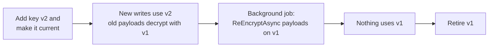

# SharedKernel.Cryptography

[](https://dotnet.microsoft.com/)
[](https://github.com/Gresta-Vertex-Labs/platform-shared-kernel/blob/main/LICENSE)


> **Encryption, signing, password hashing, secure randomness and one-time passwords for .NET services, with safe
> defaults and nothing to tune by accident.**

Every primitive picks a vetted algorithm, hides its parameters and returns failures as values; keys come from providers
you register, so the same code runs on in-memory keys in a test and a key service in production. Reach for the
[Argon2](https://github.com/Gresta-Vertex-Labs/platform-shared-kernel/blob/main/src/Foundation/SharedKernel.Cryptography.Argon2/README.md)
or [Azure Key Vault](https://github.com/Gresta-Vertex-Labs/platform-shared-kernel/blob/main/src/Foundation/SharedKernel.Cryptography.KeyVault.Azure/README.md)
companions only for Argon2id hashing or keys held in Key Vault.

| You get | So that |
| --- | --- |
| AES-256-GCM `ISymmetricEncryptionService` (async and synchronous) with required associated data | A ciphertext is bound to its record and cannot be copied into another row, tenant or message |
| Key rotation (`IsEncryptedWithCurrentKeyAsync`, `ReEncryptAsync`), HKDF subkeys, envelope encryption | Keys rotate without downtime, and a tenant or file gets its own key |
| `IAsymmetricSignatureService` (RSA-PSS, RSA PKCS #1 v1.5, ECDSA) and `IHmacSigner` | The algorithm belongs to the key, so no call site can pick a weaker one |
| `IOneWayHasher`: PHC strings, pepper, rehash-on-verify | Password hashes upgrade themselves as users sign in |
| `ISecureRandomGenerator`, `FixedTimeComparison`, `IContentHasher` | Tokens are unpredictable, secret comparison leaks nothing, fingerprints are one call |
| RFC 6238 TOTP / RFC 4226 HOTP with replay protection, recovery codes, provisioning URIs | Authenticator-app two-factor without writing the protocol |

## Contents

- [Install](#install)
- [Quick start](#quick-start)
- [How it works](#how-it-works)
- [Recipes](#recipes)
- [Configuration](#configuration)
- [Reference](#reference)
- [Testing](#testing)
- [Pitfalls](#pitfalls)
- [Design decisions](#design-decisions)

## Install

```xml
<PackageReference Include="SharedKernel.Cryptography" />
```

The version comes from your central `SharedKernelVersion` property — every SharedKernel package ships at the same
version. See [Using the packages](https://github.com/Gresta-Vertex-Labs/platform-shared-kernel#using-the-packages).

| Requirement | Value |
| --- | --- |
| Target framework | `net10.0` |
| Tier | Foundation — reference it from **any** project |
| Depends on | `SharedKernel.Primitives`, `SharedKernel.Configuration`; nothing outside the .NET base class library |
| Namespaces | `SharedKernel.Cryptography` (+ `.Extensions`, `.Symmetric`, `.Envelope`, `.KeyDerivation`, `.Signing`, `.Hashing`, `.Random`, `.Totp`, `.Options`) |
| Companions | `SharedKernel.Cryptography.Argon2` (Argon2id hashing), `SharedKernel.Cryptography.KeyVault.Azure` (keys in Azure Key Vault) |

## Quick start

```csharp
using SharedKernel.Cryptography.Extensions;
using SharedKernel.Cryptography.Symmetric;

// Keys from your secret store: "Encryption:Keys:2026-09" = base64 of 32 random bytes.
IConfigurationSection keys = builder.Configuration.GetRequiredSection("Encryption:Keys");
builder.Services.AddSingleton<IEncryptionKeyProvider>(new StaticEncryptionKeyProvider(
    currentKeyId: "2026-09",
    keys.GetChildren().Select(key => new CryptographicKey(key.Key, Convert.FromBase64String(key.Value!)))));

builder.Services.AddSharedKernelCryptography(builder.Configuration)   // key-free services + SharedKernel:Cryptography
    .AddSymmetricEncryption();                                         // needs IEncryptionKeyProvider
```

```csharp
using System.Text;
using SharedKernel.Cryptography.Symmetric;
using SharedKernel.Primitives.Results;

public sealed record Patient(Guid Id, string Name, string EncryptedDiagnosis);

public sealed class PatientRecords(ISymmetricEncryptionService encryption)
{
    public async Task<Patient> CreateAsync(string name, string diagnosis, CancellationToken ct)
    {
        Guid id = Guid.CreateVersion7();
        string encrypted = await encryption.EncryptToStringAsync(diagnosis, DiagnosisContext(id), ct);
        return new Patient(id, name, encrypted);
    }

    public Task<Result<string>> ReadDiagnosisAsync(Patient patient, CancellationToken ct) =>
        encryption.DecryptToStringAsync(patient.EncryptedDiagnosis, DiagnosisContext(patient.Id), ct).AsTask();

    // Associated data binds the ciphertext to this patient and this column.
    internal static byte[] DiagnosisContext(Guid patientId) =>
        Encoding.UTF8.GetBytes($"patients/{patientId}/diagnosis");
}
```

Password hashing, random tokens, HMAC and TOTP generation need no keys: inject `IOneWayHasher`,
`ISecureRandomGenerator`, `IHmacSigner` or `ITotpGenerator` directly. The configuration section is optional.

## How it works

### Encryption and rotation

The service asks the key provider for the current key, encrypts with a fresh random nonce, and returns a payload that
names the key it used. Decryption looks that key up again, so payloads written before a rotation keep working.

```text
EncryptedPayload (format 0x01)
[0x01][key id length: 1 B][key id (UTF-8) ≤ 255 B][nonce: 12 B][tag: 16 B][ciphertext]
ToString() = the same bytes as unpadded Base64Url
```

- Associated data is authenticated but never stored. Decrypting with different associated data fails exactly like a
  tampered payload.
- Decryption returns `Result`: malformed or unauthenticated input is `Validation`, an unknown key id `Unexpected`. Key ids
  are never echoed in messages. A wrong key length or an unreachable key service throws.
- `ISymmetricEncryptionService` and `ISynchronousSymmetricEncryptionService` produce identical payloads and read each
  other's. There is no sync-over-async bridge: the synchronous service needs keys already in memory.



### Password hashes that upgrade themselves

Every hash records its algorithm, cost and pepper. When any of those changes, a successful `Verify` returns
`SuccessRehashNeeded`, so the whole table migrates as users sign in.

```text
$pbkdf2-sha256$i=600000$<salt>$<hash>              PBKDF2, no pepper
$pbkdf2-sha256$i=600000,k=p1$<salt>$<hash>         PBKDF2 with pepper "p1"
$argon2id$v=19$m=19456,t=2,p=1$<salt>$<hash>       Argon2id (companion package)
```

Costs from a stored hash are bounded before any work (PBKDF2 at most 2,000,000 iterations, salt 16–64 bytes), so a
crafted hash cannot exhaust CPU. Secrets are normalized to Unicode NFKC. Minimum costs apply to new hashes only.

### What it protects against — and what it does not

| Threat | Protection |
| --- | --- |
| Reading or altering stored ciphertext | AES-256-GCM confidentiality and integrity |
| Moving a ciphertext to another row, tenant or message | Associated data must match exactly |
| Forged key ids in stored payloads | Unknown ids fail closed; `CachedEncryptionKeyProvider` never caches misses and is bounded |
| Algorithm confusion in signatures | The algorithm is fixed by the key; RSA under 2048 bits and mismatched curves are rejected |
| Offline cracking of a stolen password table | Slow salted hashes; with a pepper, the table alone is not enough |
| Timing attacks and predictable tokens | Fixed-time comparison; the operating system random generator only |
| Replayed one-time codes | Atomic last-accepted time step per identity |

Not covered: a compromised process (keys and plaintext live in memory while in use); plaintext length (pad first if it
matters); key ids (stored in clear); brute force without throttling; untrusted writers of RSA-wrapped envelopes (anyone
with the public key can create payloads that decrypt — use a symmetric master key or sign them).

Every algorithm is FIPS 140-3 approved when the OS provider runs in FIPS mode (TOTP's default HMAC-SHA1 remains approved
for this use). Argon2id is not; keep PBKDF2 where FIPS is required. This package is not itself a validated module.
Report vulnerabilities privately as described in the
[security policy](https://github.com/Gresta-Vertex-Labs/platform-shared-kernel/blob/main/SECURITY.md).

## Recipes

### 1. Rotate keys without downtime

Add the new key to your provider and make it current, then move stored payloads in a background job:

```csharp
using SharedKernel.Cryptography.Symmetric;
using SharedKernel.Primitives.Results;

await foreach ((Guid patientId, string stored) in store.ReadAllAsync(stoppingToken))
{
    if (!EncryptedPayload.TryParse(stored, out EncryptedPayload? payload)
        || await encryption.IsEncryptedWithCurrentKeyAsync(payload, stoppingToken))
        continue;   // not a payload, or already on the current key

    Result<EncryptedPayload> rotated = await encryption.ReEncryptAsync(
        payload, PatientRecords.DiagnosisContext(patientId), stoppingToken);

    if (rotated.IsSuccess)
        await store.UpdateAsync(patientId, rotated.Value.ToString(), stoppingToken);
}
```

Retire the old key only when nothing is left on it; a payload whose key is gone fails with `cryptography.unknown_key_id`.

### 2. Give every tenant its own key

```csharp
using SharedKernel.Cryptography.KeyDerivation;
using SharedKernel.Cryptography.Symmetric;

public sealed class TenantEncryption(IEncryptionKeyProvider rootKeys)
{
    // HKDF-SHA256 from the current root key; rotating the root key rotates every tenant.
    public ISymmetricEncryptionService For(Guid tenantId) =>
        new AesGcmEncryptionService(rootKeys.ForPurpose("tenant-data", tenantId.ToByteArray()));
}
```

A payload encrypted for one tenant fails to decrypt with any other tenant's service. For synchronous code use
`ForPurposeSynchronous`; for raw key bytes `SubkeyDerivation.DeriveKey(rootKey, purpose, context)`.

### 3. Encrypt files with envelope encryption

Each payload gets its own data key, wrapped by a master key that never leaves your key service. Requires an
`IEnvelopeEncryptionProvider` (for example the Azure Key Vault companion) and `.AddEnvelopeEncryption()`.

```csharp
using SharedKernel.Cryptography.Envelope;

EnvelopePayload payload = await envelope.EncryptAsync(pdf, invoiceId.ToByteArray(), ct);
await blobs.UploadAsync($"invoices/{invoiceId}", payload.ToBytes(), ct);

if (EnvelopePayload.TryParse(stored, out EnvelopePayload? read))
{
    Result<byte[]> pdfBytes = await envelope.DecryptAsync(read, invoiceId.ToByteArray(), ct);
}
```

Every encryption and decryption calls the key service once — use envelopes for files and exports, and
`ISymmetricEncryptionService` for many small values.

### 4. Sign users in with passwords

```csharp
using SharedKernel.Cryptography.Hashing;

// Register as a singleton: the decoy hash is computed once.
public sealed class PasswordSignIn(IUserStore users, IOneWayHasher hasher)
{
    private readonly string _decoyHash = hasher.Hash("decoy-password-never-used");   // same timing for unknown emails

    public async Task<Guid?> SignInAsync(string email, string password, CancellationToken ct)
    {
        User? user = await users.FindByEmailAsync(email, ct);
        HashVerificationResult result = hasher.Verify(user?.PasswordHash ?? _decoyHash, password);

        if (user is null || result == HashVerificationResult.Failed)
            return null;

        if (result == HashVerificationResult.SuccessRehashNeeded)
            await users.UpdatePasswordHashAsync(user.Id, hasher.Hash(password), ct);

        return user.Id;
    }
}
```

Add a pepper (see [Configuration](#configuration)) so a stolen database alone is not enough to test guesses offline.
Existing hashes without it keep verifying and report `SuccessRehashNeeded`. To rotate, add `p2`, make it current, and
keep `p1` until no stored hash uses it.

### 5. Issue and check API keys

API keys are long random tokens, so a fast keyed hash is the right storage: it can be indexed and checked on every
request (`IOneWayHasher` is for low-entropy secrets).

```csharp
using System.Text;
using SharedKernel.Cryptography.Random;
using SharedKernel.Cryptography.Signing;

public sealed record ApiKeyLookupKey(byte[] Material);   // ≥ 32 bytes from your secret store, never the database

public sealed class ApiKeys(ISecureRandomGenerator random, IHmacSigner hmac, ApiKeyLookupKey lookupKey)
{
    public (string ApiKey, string LookupHash) Issue()
    {
        string apiKey = "sk_" + random.GetToken();   // 256 random bits
        return (apiKey, LookupHash(apiKey));
    }

    public string LookupHash(string presentedApiKey) =>
        Convert.ToHexString(hmac.Sign(Encoding.UTF8.GetBytes(presentedApiKey), lookupKey.Material));
}
```

A key from configuration instead of a database is compared with `FixedTimeComparison.AreEqual` (or `AreEqualToAny`
during a rotation window).

### 6. Sign and verify with an asymmetric key

```csharp
using System.Security.Cryptography;
using SharedKernel.Cryptography.Extensions;
using SharedKernel.Cryptography.Signing;

builder.Services.AddSingleton<ISigningKeyProvider>(new InMemorySigningKeyProvider(
[
    SigningKey.FromECDsa("receipts", ECDsa.Create(ECCurve.NamedCurves.nistP256)),     // ES256
    SigningKey.FromRsa("partner-api", RSA.Create(3072), SignatureAlgorithm.PS256),   // RSASSA-PSS
]));
builder.Services.AddSharedKernelCryptography(builder.Configuration).AddAsymmetricSigning();
```

```csharp
SignatureAlgorithm algorithm = await signatures.GetAlgorithmAsync("receipts", ct);   // the JWS "alg"
byte[] signature = await signatures.SignAsync(data, "receipts", ct);
bool valid = await signatures.VerifyAsync(data, signature, "receipts", ct);           // choose the key id in code
```

ECDSA signatures use the IEEE P1363 format JWS expects. For full JWT validation use a JWT library for claims and this
service for keys and signatures.

### 7. Add authenticator-app two-factor

```csharp
using System.Security.Cryptography;
using SharedKernel.Cryptography.Symmetric;
using SharedKernel.Cryptography.Totp;

byte[] secret = TotpSecret.Generate(random);                                  // 20 bytes
Uri qrCode = TotpProvisioningUri.Build("Contoso", email, secret);             // otpauth:// for a QR code
EncryptedPayload stored = await encryption.EncryptAsync(secret, SecretContext(userId), ct);   // never store it plain
IReadOnlyList<string> codes = recoveryCodes.GenerateCodes();                  // hash each after RecoveryCodeGenerator.Normalize
CryptographicOperations.ZeroMemory(secret);

// Verify: throttle first, decrypt, then
TotpVerificationResult result = await verifier.VerifyAsync(userId.ToString(), secretBytes, code, cancellationToken: ct);
// Valid | Invalid | Replayed
```

`.AddTotpVerification()` needs your `ITotpReplayGuard`, which must compare and store in one atomic operation. In
PostgreSQL:

```sql
INSERT INTO totp_last_step (identity_key, time_step) VALUES (@identity, @step)
ON CONFLICT (identity_key) DO UPDATE SET time_step = EXCLUDED.time_step
WHERE totp_last_step.time_step < EXCLUDED.time_step
-- one row changed: accepted; none: a replay
```

With Redis use a Lua script and expire the entry after `retention`. Attempt limiting (`ITotpAttemptThrottle`) is yours
to compose — RFC 4226 requires it.

### 8. Load keys from your key service

Wrap your client in an `IEncryptionKeyProvider` (reject key ids your service never issues — they come from stored
payloads and may be forged), then cache it:

```csharp
using SharedKernel.Cryptography.Symmetric;

builder.Services.AddSingleton<KeyServiceEncryptionKeyProvider>();
builder.Services.AddSingleton<IEncryptionKeyProvider>(sp => new CachedEncryptionKeyProvider(
    sp.GetRequiredService<KeyServiceEncryptionKeyProvider>(),
    TimeProvider.System,
    timeToLive: TimeSpan.FromMinutes(5)));   // maxEntries: 1024 by default
```

`CachedEncryptionKeyProvider` shares one in-flight lookup between concurrent callers, never caches a missing key and
never serves an expired one.

## Configuration

Section `SharedKernel:Cryptography` (`CryptographyOptions`) and `SharedKernel:Cryptography:Pbkdf2` (`Pbkdf2Options`);
both optional, validated when the host starts.

```json
{
  "SharedKernel": {
    "Cryptography": {
      "OneWayHashing": {
        "Algorithm": "pbkdf2-sha256",
        "CurrentPepperId": "p1",
        "Peppers": { "p1": "<base64 of 32+ random bytes, from your secret store>" }
      },
      "Pbkdf2": { "Iterations": 600000 }
    }
  }
}
```

| Key | Type | Default | Meaning |
| --- | --- | --- | --- |
| `SharedKernel:Cryptography:OneWayHashing:Algorithm` | `string` | `pbkdf2-sha256` | Algorithm for new hashes; must be a registered algorithm id (`argon2id` with the companion) |
| `SharedKernel:Cryptography:OneWayHashing:CurrentPepperId` | `string?` | none | Pepper for new hashes; must exist in `Peppers` |
| `SharedKernel:Cryptography:OneWayHashing:Peppers:{id}` | `string` | empty | Base64 of at least 32 bytes; ids of 1–32 letters, digits or hyphens |
| `SharedKernel:Cryptography:Pbkdf2:Iterations` | `int` | `600000` | 100,000 – 2,000,000 |

## Reference

### Registration

| Method | Registers | Needs |
| --- | --- | --- |
| `AddSharedKernelCryptography(IConfiguration)` → `ICryptographyBuilder` | `IOneWayHasher` (PBKDF2 always included), `ISecureRandomGenerator`, `IContentHasher` (SHA-256), `IHmacSigner` (HMAC-SHA256), `IHotpGenerator`, `ITotpGenerator`, `IRecoveryCodeGenerator`, `IClock`, options | nothing |
| `.AddSymmetricEncryption()` | `ISymmetricEncryptionService` | `IEncryptionKeyProvider` |
| `.AddSynchronousSymmetricEncryption()` | `ISynchronousSymmetricEncryptionService` | `ISynchronousEncryptionKeyProvider` |
| `.AddEnvelopeEncryption()` | `IEnvelopeEncryptionService` | `IEnvelopeEncryptionProvider` |
| `.AddAsymmetricSigning()` | `IAsymmetricSignatureService` | `ISigningKeyProvider` |
| `.AddTotpVerification()` | `ITotpVerifier` | `ITotpReplayGuard` |
| `.AddOneWayHashAlgorithm<TAlgorithm>()` | An extra `IOneWayHashAlgorithm` | — |

Every registration uses `TryAdd` — a service you register first wins. All services are thread-safe singletons, and
nothing that needs a provider you have not registered is added, so container validation passes.

### Key providers

| Type | Use |
| --- | --- |
| `StaticEncryptionKeyProvider(currentKeyId, keys)` | Implements both async and sync interfaces over keys loaded at startup |
| `CachedEncryptionKeyProvider(inner, timeProvider, timeToLive, maxEntries = 1024)` | Caches a remote provider |
| `ForPurpose` / `ForPurposeSynchronous` → `PurposeBound…EncryptionKeyProvider` | HKDF-derived purpose/context keys (root ≥ 32 bytes, subkeys 16–64 bytes) |
| `InMemorySigningKeyProvider(keys)`; `SigningKey.FromRsa(id, rsa, algorithm)` / `FromECDsa(id, ecdsa)` | Signing keys; a `SigningKey` subclass for a remote key (receives only the digest) |

### Algorithms

| Primitive | Details |
| --- | --- |
| Symmetric | AES-256-GCM, 96-bit random nonce, 128-bit tag; keys exactly 32 bytes |
| Envelope | `[0x02][master key id][wrapped key][nonce][tag][ciphertext]`; 32-byte data key per payload, zeroed after use |
| Signing | `PS256/384/512`, `RS256/384/512` (RSA ≥ 2048), `ES256/384/512` (P-256/384/521, IEEE P1363 or DER); unknown key: `SignAsync` throws `KeyNotFoundException`, `VerifyAsync` returns `false` |
| HMAC | HMAC-SHA256; keys under 32 bytes throw; `Verify` compares in fixed time |
| One-way hashing | PBKDF2-HMAC-SHA256, 600,000 iterations, 16-byte salt, 32-byte hash; pepper = HMAC-SHA256 before hashing |
| Content hashing | SHA-256 over spans or streams; `ComputeHashHex`, `ComputeHashBase64`; never for secrets |
| Random | `GetBytes`, `Fill`, `GetInt32(toExclusive)`, `GetString(alphabet, length)`, `GetToken(byteCount = 32)` (≥ 16 bytes, Base64Url) |
| TOTP | 6–8 digits (default 6), 15–300 s step (30), 0–5 drift steps (1), SHA-1/256/512 (SHA-1); secrets ≥ 16 bytes; recovery codes `XXXXX-XXXXX`, 50 bits |

### Errors

`CryptographyErrorCodes`:

| Code | Type | When |
| --- | --- | --- |
| `cryptography.malformed_payload` | Validation | Input is not a payload, or decrypted text is not UTF-8 |
| `cryptography.decryption_failed` | Validation | Tampered payload, different associated data, or different key material |
| `cryptography.unknown_key_id` | Unexpected | The payload names a key the provider does not have |
| `cryptography.data_key_unwrap_failed` | Validation | The key service rejected an envelope's data key |
| `cryptography.invalid_base32_encoding` | Validation | `Base32.Decode` input is invalid |

### Logging

The package does not log. Never log plaintext, keys, secrets, codes or full payloads yourself.

## Testing

Reference [`SharedKernel.Cryptography.Testing`](https://github.com/Gresta-Vertex-Labs/platform-shared-kernel/blob/main/src/Foundation/SharedKernel.Cryptography.Testing/README.md)
(namespace `SharedKernel.Testing.Cryptography`). `services.AddFakeCryptography()` replaces every contract, even on top of
the real registration:

| Fake | Behaviour |
| --- | --- |
| `FakeSymmetricEncryptionService` + `FakeEncryptionKeyProvider` | Real AES-256-GCM with enforced associated data; `AddKey`/`SetCurrentKey`/`RemoveKey`; `SimulateDecryptFailure` |
| `FakeOneWayHasher` | Fast PBKDF2 (16 iterations) that still exercises `SuccessRehashNeeded` |
| `FakeSecureRandomGenerator(seed: 42)` | Reproducible tokens and codes |
| `FakeAsymmetricSignatureService`, `FakeSigningKeyProvider`, `FakeHmacSigner`, `FakeContentHasher` | Record what was signed or hashed |
| `FakeEnvelopeEncryptionProvider`, `FakeRemoteEncryptionKeyProvider`, `FakeTotpReplayGuard` | Call counts and failure switches for providers |

Or use a real service with a random in-memory key:

```csharp
using System.Security.Cryptography;
using SharedKernel.Cryptography.Symmetric;

var encryption = new AesGcmEncryptionService(new StaticEncryptionKeyProvider(
    "test", [new CryptographicKey("test", RandomNumberGenerator.GetBytes(32))]));
```

## Pitfalls

| Don't | Do | Why |
| --- | --- | --- |
| Pass empty associated data by habit | Pass the row, tenant or message identity | Otherwise ciphertexts can be swapped between records |
| Block on the async service (`.Result`) in a converter | `ISynchronousSymmetricEncryptionService` over in-memory keys | Blocking on a key service starves the thread pool |
| Call a remote key service on every encryption | Wrap it in `CachedEncryptionKeyProvider` | Latency, cost and rate limits |
| Delete an old key right after rotating | `ReEncryptAsync`, then retire it | Old payloads fail with `unknown_key_id` |
| Hash passwords with `IContentHasher` or SHA-256 | `IOneWayHasher` | Fast hashes allow billions of guesses per second |
| Hash API keys with `IOneWayHasher` on every request | An HMAC lookup hash (recipe 5) | Slow hashes on every request exhaust CPU |
| Ignore `SuccessRehashNeeded` | Store the new hash | Old costs and algorithms stay forever |
| Remove a pepper still in use | Keep it until no hash references it | Those users can no longer sign in |
| Compare secrets with `==` or `SequenceEqual` | `FixedTimeComparison` | Early exit leaks how much of a guess was right |
| `System.Random` or `Guid.NewGuid()` for secrets | `ISecureRandomGenerator` | Predictable, or not guaranteed random |
| Store TOTP secrets in plain text, or verify codes without a throttle | Encrypt them; limit attempts per identity | Six digits are guessable without limits |
| Let a token's header choose the verification key | Choose the key id in code | An attacker would pick their own key |

## Design decisions

**Why is associated data required with no default?** A forgotten context is the most common way ciphertexts become
swappable between records; `ReadOnlyMemory<byte>.Empty` is allowed only as a deliberate choice.

**Why separate sync and async services instead of a bridge?** A sync-over-async bridge blocks on I/O; a synchronous
service over in-memory keys never does.

**Why does `AddSharedKernelCryptography` register no key-dependent service?** Each is a builder opt-in, so a host never
resolves a service whose provider it did not register.

**Why does the key carry its algorithm?** No call site can select a weaker one, and post-quantum algorithms will fit the
same design.

**What is deliberately not here?** Key storage (bring a provider), streaming encryption (use envelopes per file or chunk),
and attempt throttling or replay stores (they need a shared store your service owns).

---

Part of [Platform.SharedKernel](https://github.com/Gresta-Vertex-Labs/platform-shared-kernel) ·
[Foundation packages](https://github.com/Gresta-Vertex-Labs/platform-shared-kernel/blob/main/src/Foundation/README.md) ·
[MIT license](https://github.com/Gresta-Vertex-Labs/platform-shared-kernel/blob/main/LICENSE)
