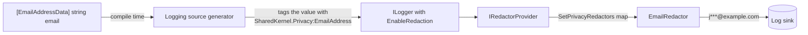

# SharedKernel.DataPrivacy

[](https://dotnet.microsoft.com/)
[](https://github.com/Gresta-Vertex-Labs/platform-shared-kernel/blob/main/LICENSE)


> **Mark personal data once, and it is masked in every log line — plus masking helpers, pseudonymization, and the
> contract each service implements to export or erase a person's data under GDPR and KVKK.**

Personal data leaks into logs one `{Email}` placeholder at a time. This package builds on .NET's own compliance model
(`Microsoft.Extensions.Compliance`): put `[EmailAddressData]` on a property or a `[LoggerMessage]` parameter, and the
logging pipeline writes `j***@example.com` instead, with no reflection and no masking code at the call site.

```text
Before   Customer ayse.yilmaz@example.com (TCKN 10000000146, card 4111111111111111) was diagnosed with asthma.
After    Customer a***@example.com (TCKN *******0146, card 411111******1111) was diagnosed with [REDACTED].
```

| You get | So that |
| --- | --- |
| 23 kinds of personal data, including every GDPR and KVKK special category | Health, biometric, religion, criminal records and the rest have a name and a rule, not a code comment |
| One attribute per kind, on properties, fields and `[LoggerMessage]` parameters | The logging source generator sees the classification at compile time |
| `SetPrivacyRedactors()`, a redactor for every kind | A marked value is masked (`411111******1111`) or erased (`[REDACTED]`) whenever it is logged |
| `PiiMasking` for email, phone, card, IBAN, national ID, name, IP address, and `Partial` | Screens, audit records and emails show the same masked form as the logs |
| `Pseudonymizer`, a stable HMAC-SHA256 token per value | You can count one user's errors across log lines without logging who the user is |
| `IDataSubjectRequestHandler` with request ids and retention receipts | A retried erasure is not done twice, and kept records carry their legal basis |
| Analyzer `SK0035` | A marked value passed to an unmarked log parameter is a build warning, not a production leak |

## Contents

- [Install](#install)
- [Quick start](#quick-start)
- [How it works](#how-it-works)
- [Recipes](#recipes)
- [Reference](#reference)
- [Testing](#testing)
- [Pitfalls](#pitfalls)
- [Design decisions](#design-decisions)

## Install

```xml
<PackageReference Include="SharedKernel.DataPrivacy" />

<!-- In the host only, for log redaction (Microsoft packages): -->
<PackageReference Include="Microsoft.Extensions.Compliance.Redaction" />
<PackageReference Include="Microsoft.Extensions.Telemetry" />
```

The version comes from your central `SharedKernelVersion` property — every SharedKernel package ships at the same
version. See [Using the packages](https://github.com/Gresta-Vertex-Labs/platform-shared-kernel#using-the-packages).

| Requirement | Value |
| --- | --- |
| Target framework | `net10.0` |
| Tier | Foundation — reference it from **any** project (Domain, Contracts and Application projects mark their types with it) |
| Depends on | `SharedKernel.Primitives`, `Microsoft.Extensions.Compliance.Abstractions` |
| Namespaces | `SharedKernel.DataPrivacy.Classification`, `.Masking`, `.Redaction`, `.DataSubjectRequests` |

## Quick start

**1. Mark the data.** On a positional record, put `property:` in front so the attribute lands on the property.

```csharp
using SharedKernel.DataPrivacy.Classification;

public sealed record Customer(
    [property: PersonNameData] string Name,
    [property: EmailAddressData] string Email,
    [property: NationalIdData] string NationalId,
    [property: HealthData] string? Allergies,
    string Segment);
```

**2. Turn on redaction in the host.**

```csharp
using SharedKernel.DataPrivacy.Redaction;

builder.Services.AddRedaction(redaction => redaction.SetPrivacyRedactors());
builder.Logging.EnableRedaction(options => options.ApplyDiscriminator = false);
```

`ApplyDiscriminator = false` is required: by default .NET appends the field name to every value before redacting it,
which garbles masks (a masked IBAN ends in `…ount`).

**3. Log as usual.** A marked parameter, or a `[LogProperties]` object with marked members, is redacted.

```csharp
public static partial class CustomerLog
{
    [LoggerMessage(EventId = 5101, Level = LogLevel.Information, Message = "Customer {Email} signed up.")]
    public static partial void SignedUp(ILogger logger, [EmailAddressData] string email);

    [LoggerMessage(EventId = 5102, Level = LogLevel.Information, Message = "Customer updated.")]
    public static partial void Updated(ILogger logger, [LogProperties] Customer customer);
}
```

```text
Customer j***@example.com signed up.
Customer updated.  customer.Name=A*** Y***  customer.Email=a***@example.com
                   customer.NationalId=*******0146  customer.Allergies=[REDACTED]  customer.Segment=retail
```

The package has no configuration section.

## How it works



The classification is read once, by the source generator, at build time. `SetPrivacyRedactors()` maps identifiers to
masks, `OnlineIdentifier` to a token only when you pass a `Pseudonymizer`, and everything else to `[REDACTED]`.
Classifications from other taxonomies go to the builder's fallback redactor, which stays your choice.

### The taxonomy

Every kind is a `DataClassification` in `PrivacyTaxonomy` (taxonomy name `SharedKernel.Privacy`) with an attribute named
after it plus `Data`. Names are stable — redaction configuration refers to them.

| Classification | Attribute | Covers | Logged as |
| --- | --- | --- | --- |
| `PersonName` | `[PersonNameData]` | Name, surname, initials | `A*** Y***` |
| `EmailAddress` | `[EmailAddressData]` | Email address | `j***@example.com` |
| `PhoneNumber` | `[PhoneNumberData]` | Phone number | `+** *** *** 45 67` |
| `PostalAddress` | `[PostalAddressData]` | Postal or home address | `[REDACTED]` |
| `DateOfBirth` | `[DateOfBirthData]` | Date of birth | `[REDACTED]` |
| `NationalId` | `[NationalIdData]` | TCKN, passport, tax or social security number | `*******0146` |
| `OnlineIdentifier` | `[OnlineIdentifierData]` | User id, customer number, device id, cookie | `[REDACTED]`, or a token with a `Pseudonymizer` |
| `IpAddress` | `[IpAddressData]` | IP address | `192.168.1.0` |
| `Location` | `[LocationData]` | Coordinates, geohash, cell location | `[REDACTED]` |
| `BankAccount` | `[BankAccountData]` | IBAN or account number | `TR********************1326` |
| `PaymentCard` | `[PaymentCardData]` | Card number, expiry, cardholder name | `411111******1111` |
| `Financial` | `[FinancialData]` | Income, balance, credit score, transactions | `[REDACTED]` |
| `Credential` | `[CredentialData]` | Password, API key, token, recovery code | `[REDACTED]` |

**Special categories** (GDPR Articles 9–10, KVKK Article 6) are always `[REDACTED]`, grouped in
`PrivacyTaxonomy.SpecialCategories` and tested by `PrivacyTaxonomy.IsSpecialCategory(c)`: `Health`, `Genetic`,
`Biometric`, `EthnicOrigin`, `PoliticalOpinion`, `Belief`, `Membership`, `SexLife`, `CriminalRecord`, `Appearance`
(KVKK only) — each with its `[…Data]` attribute. A value deliberately not personal data can say so with Microsoft's
`[NoDataClassification]`.

### Masking

`PiiMasking` is for places redaction does not reach. Every method accepts `null`, never throws, returns `""` for empty
input, replaces only letters and digits, and masks a value fully when it is too short to hide anything.

| Method | Example | Rule |
| --- | --- | --- |
| `Email(v)` | `j.doe@example.com` → `j***@example.com` | First character + fixed `***` (length hidden) |
| `Email(v, revealDomain: false)` | `jane@example.com` → `j***@***.com` | For personal domains |
| `Phone(v)` | `+1 (555) 123-4567` → `+* (***) ***-4567` | Last 4 digits; last 2 when there are only 2–3 |
| `CardNumber(v)` | `4111 1111 1111 1111` → `4111 11** **** 1111` | First 6 + last 4 (PCI DSS maximum); under 12 digits → all masked |
| `Iban(v)` | `DE89 3704 0044 0532 0130 00` → `DE** **** **** **** **30 00` | Country + last 4 |
| `NationalId(v)` | `10000000146` → `*******0146` | Last 4 |
| `PersonName(v)` | `Ayşe Nur Yılmaz` → `A*** N*** Y***` | Initial of each word + fixed `***` |
| `IpAddress(v)` | `192.168.1.23` → `192.168.1.0` | Last IPv4 octet zeroed; IPv6 keeps its first 48 bits; not an IP → `[REDACTED]` |
| `Partial(v, 4, 3)` | `ORD-2024-000123` → `ORD-********123` | Your own window |
| `Suppress(v)` | anything → `[REDACTED]` | `PiiMasking.RedactedSentinel` |

Card and national ID masks equal `SharedKernel.Validation`'s `CardNumber.ToString()`/`NationalId.ToString()` (a test
compares them). Masking rules change only in a release, and never to reveal more.

### Data subject requests

A person may ask what you hold (GDPR Articles 15 and 20, KVKK Article 11) or ask you to erase it (GDPR Article 17, KVKK
Article 7). Each service implements `IDataSubjectRequestHandler` against its own data; an orchestrator (a workflow or a
job you compose) sends every request to every service.

| Situation | What to return |
| --- | --- |
| The service knows nothing about the subject | Success with no records, or a receipt with zeros — never a failure |
| The same `RequestId` arrives again | The first outcome, without doing the work again |
| Some data must be kept (tax law, a legal hold) | Erase the rest and list what was kept in `Retained` with its legal basis; `IsComplete` is then `false` |
| The `RequestId` was used for another subject | `Error.Conflict(DataPrivacyErrorCodes.RequestIdConflict, …)` |
| It cannot be done right now | `Error.Unexpected(DataPrivacyErrorCodes.TemporarilyUnavailable, …)`; the orchestrator retries |

`DataSubjectExport.WriteTo(Utf8JsonWriter)` writes the export as one JSON document (Article 20's machine-readable format):

```json
{
  "requestId": "r-1",
  "subjectId": "customer-42",
  "source": "customers-api",
  "exportedAt": "2026-09-18T12:00:00+00:00",
  "records": [
    { "category": "profile", "purpose": "Account management", "data": { "name": "Ayşe Yılmaz", "email": "ayse@example.com" } }
  ]
}
```

The package is a tool, not compliance on its own: legal bases, records of processing, consent and identity verification
of the requester remain your processes.

## Recipes

### 1. Add a kind of data your service has

```csharp
public static class LoyaltyTaxonomy
{
    public static DataClassification LoyaltyTier { get; } = new(PrivacyTaxonomy.TaxonomyName, "LoyaltyTier");
}

[AttributeUsage(AttributeTargets.Property | AttributeTargets.Field | AttributeTargets.Parameter)]
public sealed class LoyaltyTierDataAttribute() : DataClassificationAttribute(LoyaltyTaxonomy.LoyaltyTier);

builder.Services.AddRedaction(redaction => redaction
    .SetPrivacyRedactors()
    .SetRedactor<SuppressingRedactor>(LoyaltyTaxonomy.LoyaltyTier));
```

To show part of it instead, derive from `MaskingRedactor` and override `Mask`. Calling `SetRedactor` after
`SetPrivacyRedactors()` also replaces the rule of a built-in kind.

### 2. Log a user id and still group by user

```csharp
[LoggerMessage(EventId = 5104, Level = LogLevel.Warning, Message = "Payment failed for {UserId}.")]
public static partial void PaymentFailed(ILogger logger, [OnlineIdentifierData] string userId);

var pseudonymizer = new Pseudonymizer(Convert.FromBase64String(builder.Configuration["Privacy:PseudonymKey"]!));
builder.Services.AddRedaction(redaction => redaction.SetPrivacyRedactors(pseudonymizer));
```

`Pseudonymize` returns a 22-character HMAC-SHA256 token (key ≥ 32 bytes) — the same value always gives the same token.
A token is still personal data (GDPR Recital 26); keep the key in a secret store apart from the logs. Rotating the key
changes every token; normalize input first when spellings differ (`email.ToLowerInvariant()`).

### 3. Implement a data subject request handler

```csharp
public sealed class CustomerPrivacyHandler(ICustomerStore customers, IClock clock) : IDataSubjectRequestHandler
{
    public async Task<Result<DataSubjectExport>> ExportAsync(DataSubjectRequest request, CancellationToken cancellationToken = default)
    {
        Customer? customer = await customers.FindAsync(request.SubjectId, cancellationToken);
        DataSubjectRecord[] records = customer is null
            ? []
            : [DataSubjectRecord.Create("profile", customer, AppJsonContext.Default.Customer) with { Purpose = "Account management" }];

        return new DataSubjectExport(request, "customers-api", clock.UtcNow, records);
    }

    public async Task<Result<DataSubjectErasureReceipt>> EraseAsync(DataSubjectRequest request, CancellationToken cancellationToken = default)
    {
        if (await customers.FindReceiptAsync(request.RequestId, cancellationToken) is { } earlier)
            return earlier;                                         // same request again: same outcome

        int anonymized = await customers.AnonymizeAsync(request.SubjectId, cancellationToken);
        var receipt = new DataSubjectErasureReceipt(request, "customers-api", clock.UtcNow,
            ErasedRecords: 0, AnonymizedRecords: anonymized,
            Retained: [new RetainedData("invoices", "Tax Procedure Law 213, Art. 253", clock.UtcNow.AddYears(5))]);

        await customers.SaveReceiptAsync(receipt, cancellationToken);
        return receipt;
    }
}
```

### 4. Write an export to a file

```csharp
await using FileStream file = File.Create(path);
await using (var writer = new Utf8JsonWriter(file, new JsonWriterOptions { Indented = true }))
{
    export.WriteTo(writer);
}
```

### 5. Mask a value for an audit record or a support screen

```csharp
var auditSnapshot = new
{
    CustomerId = customer.Id,
    Email = PiiMasking.Email(customer.Email),
    Card = PiiMasking.CardNumber(customer.CardNumber),
};
```

The persistence audit trail stores what you give it; it does not know which fields are personal.

## Reference

### Registration

| Method | Registers |
| --- | --- |
| `IRedactionBuilder.SetPrivacyRedactors()` | A redactor for every `PrivacyTaxonomy` classification (never sets the fallback) |
| `IRedactionBuilder.SetPrivacyRedactors(Pseudonymizer)` | The same, with `OnlineIdentifier` tokenized |

There is no `IServiceCollection` extension; the host calls Microsoft's `AddRedaction` and `EnableRedaction`.

### Types

| Type | Namespace | Purpose |
| --- | --- | --- |
| `PrivacyTaxonomy` | `.Classification` | The 23 classifications, `TaxonomyName`, `SpecialCategories`, `All`, `IsSpecialCategory` |
| `…DataAttribute` (23) | `.Classification` | One per classification; derived from Microsoft's `DataClassificationAttribute` |
| `PiiMasking`, `Pseudonymizer` | `.Masking` | Masking rules and `RedactedSentinel`; tokens (`MinimumKeyLength` 32, `TokenLength` 22) |
| `MaskingRedactor` + `EmailRedactor`, `PhoneNumberRedactor`, `CardNumberRedactor`, `BankAccountRedactor`, `NationalIdRedactor`, `PersonNameRedactor`, `IpAddressRedactor` | `.Redaction` | Masking redactors |
| `SuppressingRedactor`, `PseudonymizingRedactor` | `.Redaction` | `[REDACTED]`, or a token |
| `IDataSubjectRequestHandler` | `.DataSubjectRequests` | `ExportAsync`, `EraseAsync` |
| `DataSubjectRequest` | `.DataSubjectRequests` | `RequestId`, `SubjectId`, `RequestedAt`, `TenantId` |
| `DataSubjectExport`, `DataSubjectRecord` | `.DataSubjectRequests` | Records as `JsonElement` with `Category` and `Purpose`; `WriteTo`, `Create<T>` |
| `DataSubjectErasureReceipt`, `RetainedData` | `.DataSubjectRequests` | Erased, anonymized and retained; `IsComplete` |

### Errors

| Code | Type | When |
| --- | --- | --- |
| `data_privacy.request_id_conflict` (`DataPrivacyErrorCodes.RequestIdConflict`) | Conflict | A `RequestId` reused for another subject |
| `data_privacy.temporarily_unavailable` (`DataPrivacyErrorCodes.TemporarilyUnavailable`) | Unexpected | The handler cannot act right now; retry |

### Logging

The package does not log; it decides what other packages' log lines contain.

## Testing

[`SharedKernel.Testing`](https://github.com/Gresta-Vertex-Labs/platform-shared-kernel/blob/main/src/Testing/SharedKernel.Testing/README.md)
(`SharedKernel.Testing.DataPrivacy`) ships:

- `RecordingDataSubjectRequestHandler` — records every request, returns an empty export and receipt by default, returns
  the first outcome for a repeated request id, and a configured result per subject via `SetExportResult`/`SetErasureResult`.
- `PiiMaskingAssertions.ShouldBeMasked(original, observed, maskingFunction)` — asserts a value was masked by the same
  real `PiiMasking` rule.

To assert redaction end to end, build a `ServiceCollection` with `AddRedaction(r => r.SetPrivacyRedactors())` and
`AddLogging(b => b.EnableRedaction(o => o.ApplyDiscriminator = false).AddProvider(yourCapturingProvider))`.

## Pitfalls

| Don't | Do | Why |
| --- | --- | --- |
| Leave `ApplyDiscriminator` at its default | `EnableRedaction(o => o.ApplyDiscriminator = false)` | Nothing leaks, but masks come out wrong: an IBAN keeps the field name's last characters, an IP becomes `[REDACTED]` |
| Put an attribute on a positional record parameter without `property:` | `[property: EmailAddressData]` | Otherwise only the constructor parameter is marked and `[LogProperties]` does not see it |
| Pass a marked member to an unmarked log parameter | Mark the parameter too | `SignedUp(logger, customer.Email)` into a plain `string email` logs the raw address (`SK0035`) |
| Log with `ILogger.LogX($"…{email}")` or `LoggerMessage.Define` | `[LoggerMessage]` methods | Both skip the source generator (`SK0020`/`SK0021`) |
| Treat a token as anonymous | Treat it as personal data | Whoever holds the key can link it back |
| Hard-code or share a pseudonymization key | A per-service key from a secret store | A known key makes every token reversible |
| Reuse a `RequestId` | One id per request per subject, across services and retries | The id is the idempotency key |

## Design decisions

**Why Microsoft's compliance model instead of our own attributes?** The logging source generator already understands it,
so redaction needs no call-site code and no reflection (a test scans the assembly for reflection types).

**Why one classification per kind, no sensitivity tiers?** Redaction is chosen per classification; a tier says how
sensitive a value is but not how to mask it.

**Why mask identifiers but erase everything else?** An operator needs `411111******1111` to find a payment; nobody needs
a diagnosis in a log.

**Why are online identifiers erased unless you give a key?** Tokens need a secret, and a built-in key would make every
token reversible.

**Why is an unknown subject a success?** An orchestrator sends every request to every service; failing on "not found"
would stall every request.

**Why records as `JsonElement`?** Each service owns its data's shape, and the export must still be one portable JSON document.

**What is deliberately not here?** No orchestrator (a workflow or job you compose), no identity verification, no consent
management, no encryption (`SharedKernel.Cryptography`, or persistence's column encryption), no retention scheduler
(`RetainedData.RetainUntil` records the date).

---

Part of [Platform.SharedKernel](https://github.com/Gresta-Vertex-Labs/platform-shared-kernel) ·
[Foundation packages](https://github.com/Gresta-Vertex-Labs/platform-shared-kernel/blob/main/src/Foundation/README.md) ·
[MIT license](https://github.com/Gresta-Vertex-Labs/platform-shared-kernel/blob/main/LICENSE)
