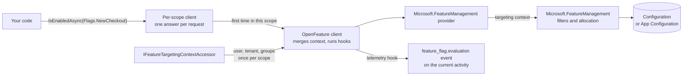

# SharedKernel.FeatureManagement

[](https://dotnet.microsoft.com/)
[](https://github.com/Gresta-Vertex-Labs/platform-shared-kernel/blob/main/LICENSE)


[-5d5fef)](https://openfeature.dev/)


> **Feature flags on the OpenFeature standard. Declare a flag once as a typed constant, and every evaluation targets
> the right user and tenant, stays the same for the whole request, never throws, and is checked at startup.**

Services inject OpenFeature's `IFeatureClient` and ask for a typed `FeatureFlag<T>` rather than a string. Behind it,
`Microsoft.FeatureManagement` reads flags from configuration (or Azure App Configuration) with percentage rollouts,
user/group/tenant targeting, time windows and A/B variants.

| You get | So that |
| --- | --- |
| OpenFeature's `IFeatureClient` as the API | Services code against a CNCF standard; moving to LaunchDarkly, flagd or ConfigCat changes the provider, not the call sites |
| Typed `FeatureFlag<T>` constants: boolean, string, integer, double, JSON object | No flag key is typed twice, and an object variant arrives as your own record, read without reflection |
| `IFeatureTargetingContextAccessor`, implemented once per service | Percentage rollouts and user, group and tenant targeting work without passing context on every call |
| One evaluation per flag per request (`EvaluateOncePerScope`) | A configuration reload cannot switch a flag halfway through a request or a message |
| Evaluation that never throws | A missing flag, a type mismatch or a failing filter returns your default, with the reason in the details |
| `ValidateOnStart(...)` | A misspelled key or a variant that does not parse stops startup, listing every problem |
| The OpenTelemetry `feature_flag.evaluation` event | Traces show who got which variant, and never record the user id |

## Contents

- [Install](#install)
- [Quick start](#quick-start)
- [How it works](#how-it-works)
- [Recipes](#recipes)
- [Configuration](#configuration)
- [Reference](#reference)
- [Testing](#testing)
- [Pitfalls](#pitfalls)
- [Design decisions](#design-decisions)

## Install

```xml
<PackageReference Include="SharedKernel.FeatureManagement" />
```

The version comes from your central `SharedKernelVersion` property — every SharedKernel package ships at the same
version. See [Using the packages](https://github.com/Gresta-Vertex-Labs/platform-shared-kernel#using-the-packages).

| Requirement | Value |
| --- | --- |
| Target framework | `net10.0` |
| Tier | Foundation — reference it from **any** project |
| Depends on | `OpenFeature` + `OpenFeature.Hosting` (the API), `Microsoft.FeatureManagement` (the backend), `SharedKernel.Primitives`, `SharedKernel.Execution` |
| Namespaces | `SharedKernel.FeatureManagement`; `OpenFeature` for `IFeatureClient` |

Libraries that only evaluate flags need `IFeatureClient` and the `FeatureFlag<T>` declarations; only the host calls
`AddSharedKernelFeatureManagement`.

## Quick start

**1. Declare the flags** in one class, next to the code that uses them.

```csharp
using SharedKernel.FeatureManagement;

public static class Flags
{
    public static readonly FeatureFlag<bool> NewCheckout =
        FeatureFlag.Boolean("NewCheckout", description: "The redesigned checkout flow.");

    public static readonly FeatureFlag<string> CheckoutTheme =
        FeatureFlag.String("CheckoutTheme", defaultValue: "classic");
}
```

**2. Configure them** in `appsettings.json`, using Microsoft's Feature Management schema.

```json
{
  "feature_management": {
    "feature_flags": [
      {
        "id": "NewCheckout",
        "enabled": true,
        "conditions": {
          "client_filters": [
            {
              "name": "Microsoft.Targeting",
              "parameters": {
                "Audience": {
                  "Users": [ "alice" ],
                  "Groups": [ { "Name": "0f8fad5b-d9cb-469f-a165-70867728950e", "RolloutPercentage": 100 } ],
                  "DefaultRolloutPercentage": 0
                }
              }
            }
          ]
        }
      },
      {
        "id": "CheckoutTheme",
        "enabled": true,
        "variants": [
          { "name": "Classic", "configuration_value": "classic" },
          { "name": "Dark", "configuration_value": "dark" }
        ],
        "allocation": {
          "default_when_enabled": "Classic",
          "user": [ { "variant": "Dark", "users": [ "alice" ] } ]
        }
      }
    ]
  }
}
```

**3. Register** in the host, with the accessor that tells flags who is calling.

```csharp
builder.Services.AddScoped<IFeatureTargetingContextAccessor, UserFeatureTargeting>();
builder.Services.AddSharedKernelFeatureManagement(builder.Configuration, flags => flags
    .ValidateOnStart(Flags.NewCheckout, Flags.CheckoutTheme));

public sealed class UserFeatureTargeting(IUserContext user) : IFeatureTargetingContextAccessor
{
    public FeatureTargetingContext? GetTargetingContext() =>
        user.IsAuthenticated
            ? new FeatureTargetingContext(user.SubjectId, user.TenantId, user.Roles)
            : null;
}
```

`IUserContext` is `SharedKernel.Security.Abstractions`; any verified identity source works. Without an accessor of your
own, the default one targets the caller of the open `RequestContextScope` (user id and tenant, no groups).

**4. Evaluate.** `IFeatureClient` is scoped; inject it like any request service.

```csharp
using OpenFeature;
using SharedKernel.FeatureManagement;

public sealed class CheckoutEndpoint(IFeatureClient flags)
{
    public async Task<string> GetLayoutAsync(CancellationToken ct) =>
        await flags.IsEnabledAsync(Flags.NewCheckout, ct)
            ? $"new-checkout/{await flags.GetValueAsync(Flags.CheckoutTheme, ct)}"
            : "legacy-checkout";
}
```

```text
alice                 -> new-checkout/dark
bob, tenant 0f8fad5b… -> new-checkout/classic
bob, no tenant        -> legacy-checkout
```

## How it works



### Targeting

The provider hands `Microsoft.FeatureManagement` one explicit targeting context that drives both the on/off state and
variant allocation, so they always agree about who the caller is. A context passed to a call wins over the accessor's.

| `FeatureTargetingContext` value | Used for |
| --- | --- |
| `UserId` | `Audience.Users`, `allocation.user`, and the hash behind every percentage |
| `TenantId` | Added to the groups, so a tenant is targeted under `Audience.Groups` or `allocation.group` |
| `Groups` | `Audience.Groups` (each with a rollout percentage) and `allocation.group` |
| `TargetingKey` | `UserId`, or `TenantId` when there is no user |

The accessor is read once when a scope first resolves `IFeatureClient`, with any lifetime. The built-in default
(internal) supplies the open request context's authenticated `UserId` and `TenantId`; a
caller with neither targets as anonymous (one shared percentage bucket). `Activity` baggage is never read — a caller can
send baggage itself, so a tenant taken from it would let anyone choose another tenant's flags.

### One answer per request

With `EvaluateOncePerScope` (default), the first evaluation of a flag in a scope — one HTTP request, one message, one
job run — is reused until the scope ends; a configuration change takes effect from the next scope.

- A result is reused only for the same flag, default and explicit context; `alice` and `bob` are evaluated separately.
- A failed evaluation is never reused, nor is a call that passes its own `FlagEvaluationOptions`.
- `ScopeResultLifetime` (default one minute) caps reuse, so a long-running scope still sees a kill switch within a minute.

### Variants and typed values

| Flag | Reads `configuration_value` as | On a value that does not fit |
| --- | --- | --- |
| `FeatureFlag.String` | Text | Default, `TypeMismatch` |
| `FeatureFlag.Integer` / `.Double` | Number, invariant culture (`"0.15"`) | Default, `TypeMismatch` |
| `FeatureFlag.Object<T>` | A JSON object, through a source-generated `JsonTypeInfo<T>` | Default, `ParseError` |

Configuration keeps every value as text, so each is converted to the type of the property it fills: `3` to an `int`,
`true` to a `bool`, `"007"` stays `"007"` for a `string`.

### When evaluation fails

Evaluation never throws. Every problem returns the flag's declared default, and `GetDetailsAsync` says why.

| Situation | Value | `ErrorType` | `Reason` |
| --- | --- | --- | --- |
| Flag not in configuration | Default | `FlagNotFound` | `ERROR` |
| Variant value does not fit a string or number flag | Default | `TypeMismatch` | `ERROR` |
| Variant object does not fit `T` | Default | `ParseError` | `ERROR` |
| A filter or the configuration throws | Default | `General` (warning logged, EventId 1301) | `ERROR` |
| Provider not initialized yet (no host started) | Default | `ProviderNotReady` | `ERROR` |
| Flag enabled, no variant allocated | Default | `None` | `DEFAULT` |
| Flag disabled | `false`, or the `default_when_disabled` variant | `None` | `DISABLED` |

The error message names the flag and variant; it never includes an exception message, which may quote configuration.

### Startup validation

`ValidateOnStart(flags…)`: when the host starts, each declared flag must be configured, and for string, number and
object flags every variant's value must fit the flag's type. Otherwise `StartAsync` throws
`FeatureFlagValidationException` listing every problem:

```text
Feature flag configuration is invalid:
- 'NewChekout' is not configured.
- 'PageSize' variant 'Large': its configuration_value is not a whole number.
- 'Checkout' has no variants; a FeatureFlag.Object flag reads its value from one.
```

### Telemetry

A flag with `"telemetry": { "enabled": true }` adds the OpenTelemetry `feature_flag.evaluation` event (key, variant,
value, reason, provider name, `feature_flag.version` from `telemetry.metadata.version`) to the current `Activity`.
`Telemetry = FeatureTelemetryMode.AllFlags` emits it for every flag; `Off` for none. The event never contains the
targeting key, user id or tenant id; `Microsoft.FeatureManagement`'s own event, which records the user id, is suppressed.

## Recipes

### 1. A kill switch

```json
{ "feature_management": { "feature_flags": [ { "id": "Payments", "enabled": true } ] } }
```

```csharp
public static readonly FeatureFlag<bool> Payments = FeatureFlag.Boolean("Payments", defaultValue: true);
```

`defaultValue: true` keeps payments on if the flag is ever missing; `"enabled": false` stops them from the next request.

### 2. Roll out to 10% of users

```json
{
  "id": "NewSearch",
  "enabled": true,
  "conditions": {
    "client_filters": [ { "name": "Microsoft.Targeting", "parameters": { "Audience": { "DefaultRolloutPercentage": 10 } } } ]
  }
}
```

Each user id hashes to a fixed bucket, so a user in the 10% stays in it; raising the number only adds users.

### 3. Roll out to a percentage of tenants

Evaluate with the tenant as the targeting key, so every user of a tenant gets the same answer (also the way to evaluate
for a background job with no caller):

```csharp
bool on = await flags.IsEnabledAsync(Flags.NewSearch, FeatureTargetingContext.ForTenant(tenantId).ToEvaluationContext(), ct);
```

To name tenants instead, list them as groups: `"Groups": [ { "Name": "<tenant id>", "RolloutPercentage": 100 } ]`. To
evaluate for another user: `new FeatureTargetingContext("bob", tenantId).ToEvaluationContext()`.

### 4. Launch at a set time

```json
{
  "id": "BlackFriday",
  "enabled": true,
  "conditions": {
    "client_filters": [
      { "name": "Microsoft.TimeWindow", "parameters": { "Start": "2026-11-27T00:00:00Z", "End": "2026-11-30T23:59:59Z" } }
    ]
  }
}
```

### 5. Run an A/B experiment

```json
{
  "id": "CheckoutButton",
  "enabled": true,
  "variants": [
    { "name": "Control", "configuration_value": "Buy now" },
    { "name": "Test", "configuration_value": "Complete purchase" }
  ],
  "allocation": {
    "default_when_enabled": "Control",
    "percentile": [ { "variant": "Control", "from": 0, "to": 50 }, { "variant": "Test", "from": 50, "to": 100 } ],
    "seed": "checkout-button-2026-09"
  }
}
```

```csharp
FlagEvaluationDetails<string> button = await flags.GetDetailsAsync(Flags.CheckoutButton, ct);
Purchases.Add(1, new KeyValuePair<string, object?>("variant", button.Variant));   // compare conversion per variant
```

Each user always lands in the same half. Change `seed` for the next experiment so users are shuffled again.

### 6. Read a settings object from a variant

```csharp
public sealed record CheckoutSettings(int Steps, bool ExpressPay, IReadOnlyList<string> Providers);

[JsonSerializable(typeof(CheckoutSettings))]
internal sealed partial class AppJsonContext : JsonSerializerContext;

public static readonly FeatureFlag<CheckoutSettings?> Checkout =
    FeatureFlag.Object<CheckoutSettings?>("Checkout", null, AppJsonContext.Default.CheckoutSettings);
```

```json
{
  "id": "Checkout",
  "enabled": true,
  "variants": [
    { "name": "OneStep", "configuration_value": { "Steps": 1, "ExpressPay": true, "Providers": [ "card", "iban" ] } }
  ],
  "allocation": { "default_when_enabled": "OneStep" }
}
```

### 7. Add your own condition

```csharp
[FilterAlias("Plan")]
public sealed class PlanFilter(IPlanLookup plans) : IFeatureFilter
{
    public async Task<bool> EvaluateAsync(FeatureFilterEvaluationContext context) =>
        await plans.CurrentPlanAsync() == context.Parameters["Plan"];
}

builder.Services.AddSharedKernelFeatureManagement(builder.Configuration, flags => flags.AddFeatureFilter<PlanFilter>());
```

```json
{ "id": "Exports", "enabled": true, "conditions": { "client_filters": [ { "name": "Plan", "parameters": { "Plan": "enterprise" } } ] } }
```

If the filter throws, the flag returns its default and a warning is logged.

### 8. Count evaluations with OpenTelemetry metrics

```csharp
builder.Services.AddSharedKernelFeatureManagement(builder.Configuration, flags => flags
    .ConfigureOpenFeature(openFeature => openFeature.AddHook(new MetricsHook(MetricsHookOptions.Default))));
builder.Services.AddOpenTelemetry().WithMetrics(m => m.AddMeter("OpenFeature"));
```

## Configuration

Flags live in the root `IConfiguration` (`appsettings.json`, environment variables, Azure App Configuration) under
Microsoft's schema; a reload takes effect on the next scope.

| Key | Type | Default | Meaning |
| --- | --- | --- | --- |
| `feature_management:feature_flags[]:id` | `string` | — (required) | The flag key; matches `FeatureFlag.Key` ordinally |
| `feature_management:feature_flags[]:enabled` | `bool` | `false` | Off → reason `DISABLED`; on with no conditions → `STATIC` |
| `feature_management:feature_flags[]:conditions:client_filters[]` | array | none | `Microsoft.Targeting` (`Audience.Users`/`Groups`/`DefaultRolloutPercentage`, sticky), `Microsoft.TimeWindow` (`Start`/`End`), `Microsoft.Percentage` (`Value`, random per call), or a custom alias |
| `feature_management:feature_flags[]:conditions:requirement_type` | `Any` \| `All` | `Any` | How several filters combine |
| `feature_management:feature_flags[]:variants[]` | array | none | `name` + `configuration_value` |
| `feature_management:feature_flags[]:allocation` | object | none | `default_when_enabled`, `default_when_disabled`, `user`, `group`, `percentile`, `seed` |
| `feature_management:feature_flags[]:telemetry` | object | off | `enabled`, `metadata` (e.g. `version`) |
| `FeatureManagement:{Key}` | `bool` | — | Legacy schema for plain on/off flags |

Behaviour options are set in code on `FeatureFlagOptions` (not bound from configuration):

| Option | Type | Default | Meaning |
| --- | --- | --- | --- |
| `EvaluateOncePerScope` | `bool` | `true` | Reuse a flag's first answer for the rest of the scope |
| `ScopeResultLifetime` | `TimeSpan` | 1 minute | Upper bound on that reuse; must be positive |
| `Telemetry` | `FeatureTelemetryMode` | `ConfiguredFlags` | `ConfiguredFlags`, `AllFlags` or `Off` |

## Reference

### Registration

| Method | Registers |
| --- | --- |
| `AddSharedKernelFeatureManagement(IConfiguration, Action<FeatureFlagOptions>?)` | Scoped `IFeatureClient` over an isolated OpenFeature API, the provider, the default targeting accessor; call once (a second call throws); pass the **root** configuration |
| `FeatureFlagOptions.ValidateOnStart(params FeatureFlag[])` | Startup validation of those flags |
| `FeatureFlagOptions.AddFeatureFilter<TFilter>()` | A custom `IFeatureFilter` |
| `FeatureFlagOptions.ConfigureOpenFeature(Action<OpenFeatureBuilder>)` | Hooks and other OpenFeature settings |

### Types

| Type | Purpose |
| --- | --- |
| `FeatureFlag` / `FeatureFlag<T>` | `Key`, `Kind`, `Description`, `DefaultValue`; factories `Boolean`, `String`, `Integer`, `Double`, `Object<T>` |
| `FeatureClientExtensions` | On `IFeatureClient`: `IsEnabledAsync`, `GetValueAsync`, `GetDetailsAsync`, with or without an `EvaluationContext` |
| `FeatureTargetingContext` | `UserId`, `TenantId`, `Groups`, `TargetingKey`; `ForTenant`, `ToEvaluationContext` |
| `IFeatureTargetingContextAccessor` | `GetTargetingContext()`: the current caller |
| `FeatureContextKeys` | Evaluation-context attributes: `TenantId` = `"tenantId"`, `Groups` = `"groups"` |
| `FeatureFlagValidationException` | Startup failure with `Failures` |

### Logging

| Event id | Level | Event |
| --- | --- | --- |
| 1301 | Warning | `Feature flag {FlagKey} could not be evaluated; the caller's default value was used` — once per failed evaluation |

## Testing

Reference [`SharedKernel.FeatureManagement.Testing`](https://github.com/Gresta-Vertex-Labs/platform-shared-kernel/blob/main/src/Testing/SharedKernel.FeatureManagement.Testing/README.md)
(namespace `SharedKernel.Testing.FeatureManagement`):

```csharp
var flags = new FakeFeatureClient()
    .SetEnabled(Flags.NewCheckout)
    .Set(Flags.CheckoutTheme, "dark")
    .Set(Flags.Exports, ctx => ctx.GetValue(FeatureContextKeys.TenantId)?.AsString == "0b7ad0a4-2d8c-4b9e-8a8e-4f5b1ce1e0d2");

var endpoint = new CheckoutEndpoint(flags);
Assert.Equal("new-checkout/dark", await endpoint.GetLayoutAsync(CancellationToken.None));
Assert.True(flags.WasEvaluated(Flags.NewCheckout));
```

In an application test, `services.AddFakeFeatureFlags(f => f.SetEnabled(Flags.NewCheckout))` replaces the real
registration; `SetObject(flag, value, typeInfo)` sets an object flag. A flag the test never set returns its default with
`FlagNotFound`, like the real client. With a plain `ServiceProvider` (no host), call
`IFeatureLifecycleManager.EnsureInitializedAsync()` first, or every evaluation returns `ProviderNotReady`.

## Pitfalls

| Don't | Do | Why |
| --- | --- | --- |
| `AddSharedKernelFeatureManagement(configuration.GetSection("FeatureManagement"))` | Pass the root configuration | The two schemas live under different root keys; the other one silently disappears |
| `Microsoft.Percentage` for a rollout | `Microsoft.Targeting` with `DefaultRolloutPercentage` | Percentage draws a random number per call, so a user flips between requests |
| Resolve `IFeatureClient` from the root provider | Create a scope per unit of work in a `BackgroundService` | It is scoped; a process-long client reuses results for up to `ScopeResultLifetime` |
| Use OpenFeature's `Api.Instance` | Inject `IFeatureClient` | The package uses an isolated API; the global one has no provider (`SK0002`) |
| Inject `IFeatureManager` / `IVariantFeatureManager` | Inject `IFeatureClient` | Skips targeting, per-request consistency, safe defaults and telemetry (`SK0002`) |
| Rely on the default when a flag is missing | Declare the flag in `ValidateOnStart` | A typo then fails startup instead of silently turning a feature off |
| Expect role or plan targeting from the default accessor | Implement `IFeatureTargetingContextAccessor` | The default supplies only user and tenant, no groups |
| Write culture-formatted numbers (`"0,15"`) | `"0.15"` | Values are read with the invariant culture |
| Use OpenFeature `Track` for experiment outcomes | Record metrics tagged with the variant | `Track` does nothing with this provider |

## Design decisions

**Why OpenFeature's `IFeatureClient` instead of our own interface?** It is the CNCF standard with providers for most flag
services, so the backend can change without touching callers.

**Why `Microsoft.FeatureManagement` as the backend, with our own provider?** Flags stay in configuration and App
Configuration with targeting, time windows and variants, and no new service to run. Our provider maps targeting both
ways, reports reasons and never throws.

**Why an accessor read once per scope?** Targeting must not depend on every call site remembering to pass context.

**Why the request context and never baggage for the default accessor?** Baggage arrives from the caller (the W3C
`baggage` header); a `RequestContextScope` is opened by an inbound adapter from an identity it verified.

**Why add the tenant to the groups?** `Microsoft.FeatureManagement` targets only users and groups; this makes tenants
targetable with no schema change.

**Why one answer per scope, capped at one minute?** A flag must not change mid-request; a kill switch must still act
within a minute.

**Why is startup validation opt-in per flag?** Only the service knows which flags it depends on.

**What is deliberately not here?** No endpoint or pipeline feature gates, no flag management UI or storage (flags are
configuration), no experiment analysis. The package is not trim/AOT-safe: `Microsoft.FeatureManagement` binds filter
parameters by reflection.

---

Part of [Platform.SharedKernel](https://github.com/Gresta-Vertex-Labs/platform-shared-kernel) ·
[Core domain](https://github.com/Gresta-Vertex-Labs/platform-shared-kernel/blob/main/src/Foundation/README.md) ·
[MIT license](https://github.com/Gresta-Vertex-Labs/platform-shared-kernel/blob/main/LICENSE)
