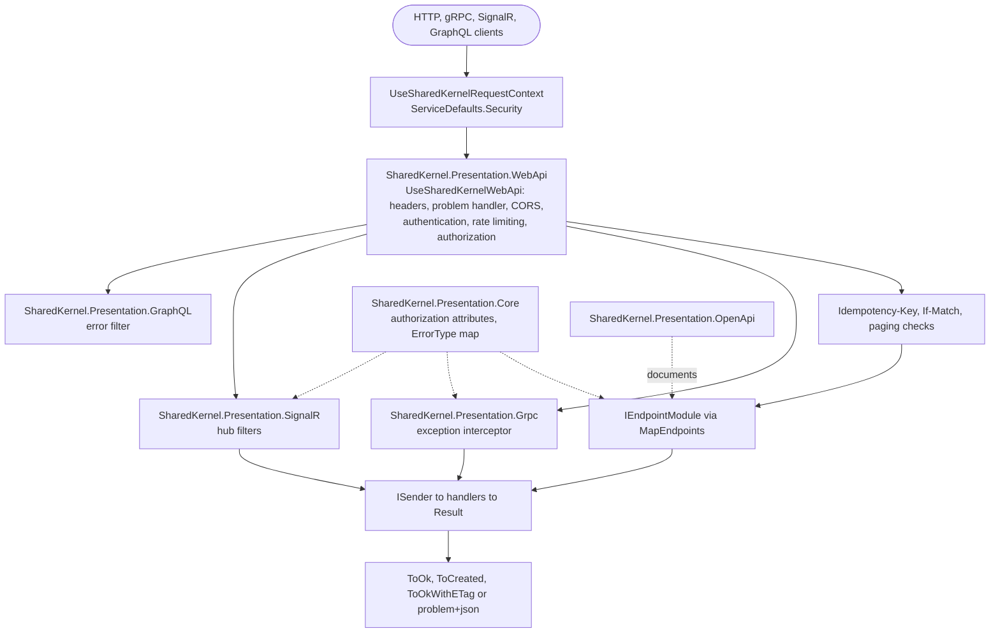

<div align="center">

# SharedKernel Presentation

**The inbound boundary of a .NET service: one RFC 9457 error shape over HTTP and the same error codes over gRPC,
SignalR and GraphQL, one authorization dialect on every protocol, endpoint modules mapped at compile time and
versioned OpenAPI documents — so an endpoint is one line over `ISender`.**

[](https://dotnet.microsoft.com/)
[](../../../LICENSE)


[](https://github.com/grpc/grpc-dotnet)
[](https://chillicream.com/docs/hotchocolate)
[](https://github.com/dotnet/aspnet-api-versioning)

[What you get](#what-you-get) · [Packages](#packages) · [How it fits together](#how-it-fits-together) · [Get started](#get-started) · [See it run](#see-it-run) · [Guarantees](#guarantees)

<sub>📂 <code>src/Hosting/Presentation</code> · <a href="../../../docs/packages.md">all packages by tier</a> · <a href="../../../README.md">Platform.SharedKernel</a></sub>

</div>

---

## What you get

- **One error contract.** Every HTTP failure is `application/problem+json` with `errorCode`, `traceId`, `correlationId`
  and field errors; gRPC carries the same code in a rich `google.rpc.Status`, SignalR in a coded `HubException`,
  GraphQL in `status`/`title`/`type` extensions. Server errors are redacted outside Development.
- **One-line endpoints.** `sender.Send(command, ct).ToCreated(...)` and the other typed results (`ToOk`,
  `ToOkWithETag`, `ToNoContent`, …) that OpenAPI can read; `IEndpointModule`s are mapped by a generated `app.MapEndpoints()`.
- **Edge checks before the handler.** `IdempotencyKey`, `IfMatch<TVersion>` and `ETag` (412, 428, 304) and validated
  `Paging` / `CursorPaging` parameters.
- **Authorization in one dialect.** `[RequireEndpointPermission]`, `[RequireRole]`, `[RequireFreshAuthentication]` and
  `[RequireAuthenticationMethod]` work on endpoints, hubs and gRPC methods, over `IUserContext`.
- **Secure defaults.** Security headers, deny-by-default CORS, body and JSON-depth limits, rate-limit problems.
- **Versioned OpenAPI.** One OpenAPI 3.1 document per version, Scalar, `Deprecation`/`Sunset` headers, and documents
  served outside Development only when you set `ExposeInProduction`.

## Packages

| Package | Tier | Reference it from | Use it for |
| --- | --- | --- | --- |
| [SharedKernel.Presentation.WebApi](SharedKernel.Presentation.WebApi/README.md) | Host | Api·Worker | Any HTTP API: `AddSharedKernelWebApi()` + `UseSharedKernelWebApi()`, typed results, endpoint modules (the source generator ships inside it) |
| [SharedKernel.Presentation.Core](SharedKernel.Presentation.Core/README.md) | Host | Api·Worker | Comes with the others: the authorization attributes and the shared `ErrorType` → status rules |
| [SharedKernel.Presentation.OpenApi](SharedKernel.Presentation.OpenApi/README.md) | Host | Api·Worker | API versioning and published documents: `AddSharedKernelOpenApi()` + `MapSharedKernelOpenApi()` |
| [SharedKernel.Presentation.Grpc](SharedKernel.Presentation.Grpc/README.md) | Host | Api·Worker | gRPC services: `AddSharedKernelGrpc()`, with no dependency on WebApi |
| [SharedKernel.Presentation.SignalR](SharedKernel.Presentation.SignalR/README.md) | Host | Api·Worker | Real-time hubs: `AddSharedKernelSignalR()`, hub methods returning `Result` |
| [SharedKernel.Presentation.GraphQL](SharedKernel.Presentation.GraphQL/README.md) | Host | Api·Worker | HotChocolate schemas: `AddSharedKernelGraphQL()`, capped paging, platform filter names |
| [SharedKernel.Presentation.Testing](SharedKernel.Presentation.Testing/README.md) | Testing | test projects | `TestServerCallContext`, `GraphQLTestExecutorFactory`, `FakeHttpContextAccessor` |

Start with `.WebApi` for any HTTP service; add `.OpenApi` for versions and documents, and `.Grpc`, `.SignalR` or
`.GraphQL` for each further protocol. Every configuration key is listed in [CONFIGURATION.md](CONFIGURATION.md). The
client side of these contracts is [Communication](../../Infrastructure/Communication/README.md).

## How it fits together



- **Fixed middleware order.** `UseSharedKernelWebApi()` adds its middleware in one reviewed order; your own goes into
  named hooks (`AtStart`, `BeforeAuthentication`, `BeforeAuthorization`), inside the exception handler.
- **One pipeline for every protocol.** gRPC calls and SignalR negotiation run through the same HTTP pipeline, so the
  request context from [ServiceDefaults](../ServiceDefaults/README.md) and authentication from
  [Security](../Security/README.md) apply to them too.
- **No mediator coupling.** Endpoints depend on `ISender` from the Application packages; the presentation packages
  reference neither MediatR nor any handler code, so anything that returns `Result` maps the same way.

## Get started

```xml
<PackageReference Include="SharedKernel.Presentation.WebApi" />
<PackageReference Include="SharedKernel.ServiceDefaults.Security" />
```

```csharp
using SharedKernel.Application.Messaging;
using SharedKernel.Presentation.WebApi;
using SharedKernel.ServiceDefaults.Security;

builder.Services.AddSharedKernelRequestContext();
builder.AddSharedKernelWebApi();                       // SharedKernel:Presentation:WebApi

var app = builder.Build();
app.UseSharedKernelRequestContext();                   // first
app.UseSharedKernelWebApi();
app.MapEndpoints();                                    // generated: every IEndpointModule of this assembly
app.Run();

public sealed class OrderEndpoints : IEndpointModule
{
    public static void Map(IEndpointRouteBuilder app)
    {
        var orders = app.MapGroup("/orders").WithTags("Orders");
        orders.MapGet("/{id:guid}", (Guid id, ISender sender, CancellationToken ct) =>
            sender.Send(new GetOrder(id), ct).ToOkWithETag(o => o.Version.ToString(), OrderResponse.From));
        orders.MapPost("/", (PlaceOrderRequest body, IdempotencyKey key, ISender sender, CancellationToken ct) =>
            sender.Send(new PlaceOrder(body.Customer, body.Amount, key.Value), ct).ToCreated(id => $"/orders/{id}"));
    }
}
```

A failed `Result` — `order.not_found`, a validation failure, a stale version — becomes the matching problem (404, 400
with `errors`, 412) with no code in the endpoint. The full setup is in the
[SharedKernel.Presentation.WebApi Quick start](SharedKernel.Presentation.WebApi/README.md#quick-start).

## See it run

- [samples/OrderApi](../../../samples/OrderApi/README.md) — the reference: `AddSharedKernelWebApi()`,
  `AddSharedKernelOpenApi()`, `MapEndpoints()` and `MapSharedKernelOpenApi()`; its tests prove the 401/403/204 answers
  of a command carrying `[RequirePermission]`. Its README gives the `dotnet run` command against the packed packages.
- [samples/InventoryApi](../../../samples/InventoryApi/README.md) — the same errors over REST and gRPC.
- [samples/Shop](../../../samples/Shop/README.md) — Catalog serves REST, OpenAPI and GraphQL; Inventory serves gRPC
  over mutual TLS next to REST. `dotnet run --project samples/Shop/Shop.AppHost --launch-profile http` after
  `samples/Shop/build.sh`.

## Guarantees

| Guarantee | How it is held |
| --- | --- |
| Every failure source — returned `Result`, thrown exception, binding failure, framework 404/405/415, authorization refusal — writes the same problem members | `ProblemShapeTests.EveryErrorSource_WritesTheSameProblemShape`; architecture rule `NoDirectProblemDetailsConstructionOutsideWebApi` |
| Server-error messages and exception details are hidden outside Development; client errors never are | `RedactionTests`; gRPC `RichStatusTests`, `GrpcExceptionInterceptorTests`; SignalR `ResultHubMethodTests` |
| A downstream gRPC `RpcException` reaches your caller with its status code only | `DownstreamFailureTests` |
| `Idempotency-Key`, `If-Match` and paging are refused before the handler runs | `IdempotencyKeyTests`, `ConditionalRequestTests`, `PagingTests` |
| CORS denies every origin until configured, and credentials without explicit origins stop the host | `CorsTests` (`WithoutConfiguredOrigins_NoOriginIsAllowed`, `CredentialsWithoutExplicitOrigins_FailAtStartup`) |
| OpenAPI documents are not served outside Development unless `ExposeInProduction` | `DocumentExposureTests.Production_ByDefault_MapsNothing_AndSaysWhy` |
| No MediatR in any presentation package; gRPC never references `SharedKernel.Contracts` | `DependencyGraphRulesTests.MediatR_IsReferencedOnlyByTheMediatorAdapter`; architecture rule `GrpcNeverReferencesContracts` |

---

<div align="center">
<sub>Part of <a href="../../../README.md">Platform.SharedKernel</a> · <a href="../../../docs/packages.md">all packages</a> · MIT license</sub>
</div>
