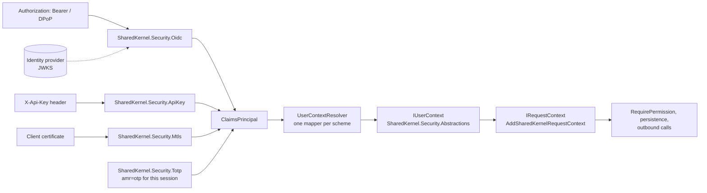

<div align="center">

# SharedKernel Security

**Authentication for .NET services that turns every kind of caller — a signed-in user, another service, a partner
with an API key or a client certificate, a background job — into one `IUserContext`, with secure defaults that a later
registration cannot weaken.**

[](https://dotnet.microsoft.com/)
[](../../../LICENSE)


[](https://www.nuget.org/packages/Microsoft.AspNetCore.Authentication.JwtBearer)

[What you get](#what-you-get) · [Packages](#packages) · [How it fits together](#how-it-fits-together) · [Get started](#get-started) · [See it run](#see-it-run) · [Guarantees](#guarantees)

<sub>📂 <code>src/Hosting/Security</code> · <a href="../../../docs/packages.md">all packages by tier</a> · <a href="../../../README.md">Platform.SharedKernel</a></sub>

</div>

---

## What you get

- **One identity model.** `IUserContext` carries `ActorKind` (`User`, `Service`, `System`, `Anonymous`), `TenantId?`,
  roles, permissions and step-up signals, whatever scheme authenticated the caller.
- **OIDC bearer tokens from any provider.** `AddOidcAuthentication(configuration)` works with Entra ID, Auth0, Okta or
  Keycloak, pins the validation rules, enforces DPoP and certificate-bound tokens, and checks revocation.
- **Managed API keys.** `AddManagedApiKeyAuthentication<TStore>` generates prefixed, checksummed keys, stores only
  their SHA-256 hash and honours expiry and revocation — or `AddApiKeyAuthentication<TValidator>()` plugs in your own.
- **Mutual TLS.** `AddMtlsAuthentication<TValidator>()` lets the framework check the chain and your
  `IMtlsCertificateValidator` decide who the client is; partner CAs are trusted without accepting self-signed certificates.
- **Session-bound step-up.** `AddTotpStepUp<…>()` adds authenticator enrollment and recovery codes; a verified code adds
  `amr=otp` to one sign-in session for a bounded window.
- **Order-independent composition.** Each scheme brings its own `IUserContextMapper`; register any subset in any order.

## Packages

| Package | Tier | Reference it from | Use it for |
| --- | --- | --- | --- |
| [SharedKernel.Security.Abstractions](SharedKernel.Security.Abstractions/README.md) | Abstractions | Application | Code that reads the credential itself: `IUserContext`, `IUserContextMapper`, `SystemUserContext` for worker hosts |
| [SharedKernel.Security.Oidc](SharedKernel.Security.Oidc/README.md) | Host | Api·Worker | Users and client-credentials services with JWT access tokens, DPoP, certificate-bound tokens, revocation |
| [SharedKernel.Security.ApiKey](SharedKernel.Security.ApiKey/README.md) | Host | Api·Worker | Partners and scripts that cannot run an OAuth flow |
| [SharedKernel.Security.Mtls](SharedKernel.Security.Mtls/README.md) | Host | Api·Worker | Clients that prove who they are with a certificate |
| [SharedKernel.Security.Totp](SharedKernel.Security.Totp/README.md) | Host | Api·Worker | A fresh second factor before payouts or settings changes, on top of `.Oidc` |
| [SharedKernel.Security.Testing](SharedKernel.Security.Testing/README.md) | Testing | test projects | `FakeUserContext`, `SecurityTestContextBuilder`, in-memory key/DPoP/TOTP stores, real DPoP proofs and mTLS certificates |

Start with `.Oidc` for any caller that holds a token; add `.ApiKey`, `.Mtls` or `.Totp` only for the callers that need
them. Application handlers usually need none of these — they read `IRequestContext` from `SharedKernel.Execution`.

## How it fits together



- **Unmapped schemes fail closed.** `UserContextResolver` maps the first authenticated identity whose authentication
  type has a mapper; a cookie or custom handler without one resolves to anonymous.
- **The caller reaches every layer.** [ServiceDefaults](../ServiceDefaults/README.md)' `AddSharedKernelRequestContext()`
  exposes the same caller as `IRequestContext` to handlers, repositories, caches and outbound clients.
- **Endpoint gates live next door.** `[RequireEndpointPermission]`, `[RequireRole]`, `[RequireFreshAuthentication]` and
  `[RequireAuthenticationMethod]` come from [Presentation](../Presentation/README.md) and read `IUserContext`.
- **Discovery is lazy.** OIDC signing keys are fetched on the first request; misconfigured options stop startup.

## Get started

```xml
<PackageReference Include="SharedKernel.Security.Oidc" />
<PackageReference Include="SharedKernel.ServiceDefaults.Security" />
```

```csharp
using SharedKernel.Security.Abstractions;
using SharedKernel.Security.Oidc.Extensions;
using SharedKernel.ServiceDefaults.Security;

builder.Services.AddOidcAuthentication(builder.Configuration); // SharedKernel:Security:Oidc
builder.Services.AddSharedKernelRequestContext();              // IRequestContext over IUserContext
builder.Services.AddAuthorization();

var app = builder.Build();
app.UseSharedKernelRequestContext();                            // first
app.UseAuthentication();
app.UseAuthorization();

app.MapGet("/me", (IUserContext user) => new { user.ActorKind, user.SubjectId, user.TenantId, user.Permissions })
    .RequireAuthorization();
```

```json
{ "SharedKernel": { "Security": { "Oidc": {
  "Authority": "https://login.microsoftonline.com/<tenant-id>/v2.0",
  "Audiences": [ "api://orders" ] } } } }
```

The full setup — claim mapping, DPoP, revocation — is in the
[SharedKernel.Security.Oidc Quick start](SharedKernel.Security.Oidc/README.md#quick-start); each other scheme is one
more registration, described in its own README.

## See it run

- [samples/Shop](../../../samples/Shop/README.md) — Catalog and Inventory validate Keycloak tokens with `.Oidc`;
  Inventory serves Ordering over gRPC with `.Mtls`, a certificate allow-list and a rogue certificate the end-to-end
  flows prove is refused. `dotnet run --project samples/Shop/Shop.AppHost --launch-profile http` after
  `samples/Shop/build.sh`.
- The Shop's [Billing](../../../samples/Shop/Billing/) — API key authentication over a custom `IApiKeyStore`
  (`ConfigurationApiKeyStore`, key hashes from Key Vault) next to `AddOidcAuthentication(configuration)`.
- The Shop's [Ordering](../../../samples/Shop/Ordering/) — `AddOidcAuthentication(configuration)` and a TOTP step-up
  with `.Totp` before cancelling an order.
- `Shop.Inventory.Tests` proves Inventory's certificate allow-list against CA-chained certificates from
  `SharedKernel.Security.Testing`'s `MtlsTestCertificateBuilder`.

## Guarantees

| Guarantee | How it is held |
| --- | --- |
| Asymmetric token signatures only; `none` and HMAC are refused | `DpopProofValidatorTests` (`ValidateAsync_AlgNone_…`, `…SymmetricAlgorithm_…`), `BearerTokenValidationTests.Authenticate_Hs256TokenWithKnownKey_Returns401` |
| Pinned validation cannot be weakened by a later `Configure`/`PostConfigure`: the host refuses to start | `BearerTokenValidationTests.StartAsync_ValidationWeakenedAfterPackage_FailsStartupNamingEachSetting`, `MtlsAuthenticationEndToEndTests.StartAsync_AppReplacesEventsInLaterPostConfigure_FailsStartup`, `SecureDefaultsAssertion` |
| Fail closed: a throwing replay cache, revocation check or certificate validator rejects the request | `DpopAuthenticationTests.Authenticate_ReplayCacheThrows_FailsRequest`, `TokenRevocationAuthenticationTests.Authenticate_CheckThrows_Returns401AndLogsUnavailable`, `MtlsAuthenticationEndToEndTests.Request_ValidatorThrows_IsRejectedNotServerError` |
| An unmapped scheme or an identity without a subject is anonymous | `UserContextResolverTests` (`Resolve_NoMapperForScheme_ReturnsAnonymous`, …) |
| Roles, permissions and authentication methods compare ordinally, case-sensitive | `UserContextTests` (`HasRole_CaseOrTextDiffers_ReturnsFalse`, `HasPermission_…`) |
| API keys come from the header only; a rejected key is logged by id, never by value | `ApiKeyAuthenticationEndToEndTests.Request_KeyInQueryString_IsIgnored`, `…Returns401AndLogsReasonAndKeyIdButNotKey` |
| `IUserContext` is never a singleton, and DPoP and certificate parsing exist in one package each | Architecture rules `NoSingletonRegistrationOfSecurityContextTypes`, `DpopProofValidationNeverDuplicatedOutsideOidc`, `ClientCertificateAccessNeverDuplicatedOutsideMtls`; analyzer SK0031 |

Found a vulnerability? Report it privately as described in the [security policy](../../../SECURITY.md).

---

<div align="center">
<sub>Part of <a href="../../../README.md">Platform.SharedKernel</a> · <a href="../../../docs/packages.md">all packages</a> · MIT license</sub>
</div>
