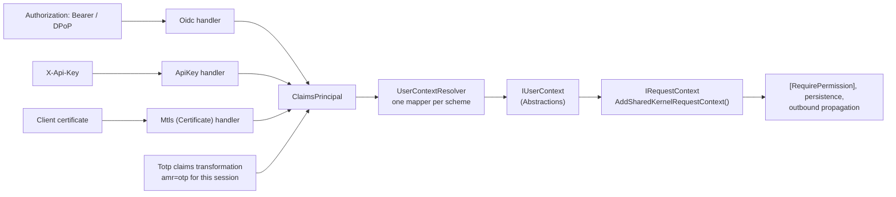

<div align="center">

# 12.Security

**Authentication for .NET services that turns every kind of caller into one `IUserContext`.**

[](https://dotnet.microsoft.com/)
[](https://github.com/Gresta-Vertex-Labs/platform-shared-kernel/blob/main/LICENSE)


</div>

A service is called by people signed in through an identity provider, by other services with client-credentials
tokens, by partners with API keys or client certificates, and by its own background jobs. Application code should not
care which. These packages authenticate each kind of caller with secure defaults and give the application one identity
model to read: who the caller is, which tenant they act for, what they may do, and how recently and strongly they
signed in.

## What this domain gives you

- **One identity model** — `IUserContext` with `ActorKind` (`User`, `Service`, `System`, `Anonymous`), `TenantId?`,
  roles, permissions and step-up signals, whatever the scheme.
- **OIDC bearer tokens from any provider** — Entra ID, External ID, B2C, Auth0, Okta, Keycloak — with the validation
  rules pinned, DPoP and certificate-bound tokens, and revocation.
- **Managed API keys** — generated, prefixed, hashed at rest, expiring and revocable — or your own validator.
- **Mutual TLS** — client certificates, private-CA trust, your validator deciding who the client is.
- **Session-bound TOTP step-up** — authenticator enrollment, recovery codes, and `amr=otp` for one session and a bounded
  window.
- **Order-independent composition** — each scheme brings its own mapper; register them in any order, in one host.

## Packages

| Package | Tier | When you need it |
| --- | --- | --- |
| [`SharedKernel.Security.Abstractions`](SharedKernel.Security.Abstractions/README.md) | Abstractions | Code that reads the caller: `IUserContext`, `IUserContextMapper`, `SystemUserContext` for worker hosts |
| [`SharedKernel.Security.Oidc`](SharedKernel.Security.Oidc/README.md) | Host | Users and client-credentials services with JWT access tokens: `AddOidcAuthentication(configuration)` |
| [`SharedKernel.Security.ApiKey`](SharedKernel.Security.ApiKey/README.md) | Host | Partners or scripts that cannot run an OAuth flow: `AddManagedApiKeyAuthentication<TStore>(…)` or `AddApiKeyAuthentication<TValidator>()` |
| [`SharedKernel.Security.Mtls`](SharedKernel.Security.Mtls/README.md) | Host | Partners required to use mutual TLS: `AddMtlsAuthentication<TValidator>()` |
| [`SharedKernel.Security.Totp`](SharedKernel.Security.Totp/README.md) | Host | A fresh second factor for payouts and settings changes: `AddSharedKernelCryptography(configuration).AddTotpStepUp<TStepUpStore, TRecoveryCodeStore>()` |

The Application project references only `SharedKernel.Security.Abstractions` (and usually not even that — handlers
read `IRequestContext` from `SharedKernel.Execution`). The other packages are referenced by the Api/Worker project.

| Caller | Package |
| --- | --- |
| A user signed in through an identity provider | `.Oidc` |
| Another service using client credentials | `.Oidc` (reported as `ActorKind.Service`) |
| A partner or script with an API key | `.ApiKey` |
| A regulated partner using mutual TLS | `.Mtls` |
| A user confirming a sensitive action with a one-time code | `.Totp` on top of `.Oidc` |
| A background job, consumer or scheduled task | `.Abstractions` (`SystemUserContext`) |

## How the packages fit together

Each authentication package registers a scheme and an `IUserContextMapper` for it. When code resolves `IUserContext`,
`UserContextResolver` maps the first authenticated identity whose authentication type has a mapper; an identity from an
unmapped scheme resolves to anonymous. `AddSharedKernelRequestContext()` (13.ServiceDefaults) then exposes the same
caller as `IRequestContext` to the application pipeline, persistence and outbound clients.



## Get started

The smallest end-to-end setup: bearer tokens from an OIDC provider, the caller available to endpoints and handlers.

**1. Reference the packages** (the version comes from your central `SharedKernelVersion`):

```xml
<PackageReference Include="SharedKernel.Security.Oidc" />
<PackageReference Include="SharedKernel.ServiceDefaults.Security" />
```

**2. Register** in `Program.cs`:

```csharp
using SharedKernel.Security.Abstractions;
using SharedKernel.Security.Oidc.Extensions;
using SharedKernel.ServiceDefaults.Security;

builder.Services.AddOidcAuthentication(builder.Configuration); // SharedKernel:Security:Oidc
builder.Services.AddSharedKernelRequestContext();              // IRequestContext over IUserContext
builder.Services.AddAuthorization();

var app = builder.Build();
app.UseSharedKernelRequestContext();                            // first
app.UseAuthentication();
app.UseAuthorization();
```

**3. Configure** `appsettings.json`:

```json
{
  "SharedKernel": {
    "Security": {
      "Oidc": {
        "Authority": "https://login.microsoftonline.com/<tenant-id>/v2.0",
        "Audiences": [ "api://orders" ],
        "Claims": { "SubjectClaimType": "oid", "TenantClaimType": "tid" }
      }
    }
  }
}
```

**4. Use** the caller:

```csharp
app.MapGet("/me", (IUserContext user) => new { user.ActorKind, user.SubjectId, user.TenantId, user.Permissions })
    .RequireAuthorization();
```

Adding API keys, client certificates or TOTP step-up is one more registration each — see the package READMEs. For
endpoint attributes (`[RequireRole]`, `[RequireEndpointPermission]`, `[RequireFreshAuthentication]`,
`[RequireAuthenticationMethod]`) use
[`SharedKernel.Presentation.Core`](../Presentation/SharedKernel.Presentation.Core/README.md); for tenant resolution
beyond the token's claim, [`SharedKernel.MultiTenancy`](../ServiceDefaults/SharedKernel.MultiTenancy/README.md).

## Samples

- [`samples/InventoryApi`](../../../samples/InventoryApi/README.md) — API key authentication with a custom
  `IApiKeyValidator` (`ConfiguredApiKeyValidator`) and `AddSharedKernelRequestContext()`.
- [`samples/OrderApi`](../../../samples/OrderApi/README.md) — the four-project service shape; its host notes where
  `AddOidcAuthentication(configuration)` replaces the development identity, and its tests cover `[RequirePermission]`.

## Guarantees

- **Fail closed.** A throwing revocation check, DPoP replay cache, API key store or certificate validator rejects the
  request; an unmapped scheme resolves to anonymous; a missing tenant is `null`, never `Guid.Empty`.
- **Asymmetric token signatures only.** `none` and HMAC algorithms fail startup; pinned validation settings cannot be
  weakened by a later `PostConfigure` — the host refuses to start.
- **Claim names are not renamed.** `sub` stays `sub`; claim types come from configuration.
- **Ordinal comparisons.** Roles, permissions, scopes and authentication methods are case-sensitive.
- **Credentials in headers only.** API keys are never read from the query string.
- **Misconfiguration stops startup.** Options are validated when the host starts, not on the first request.
- **Scoped identity.** `IUserContext` is resolved per request; a singleton registration is flagged by the architecture
  tests.
- **No secrets in logs.** Event ids 12100–12499; tokens, proofs, API keys, certificates and one-time codes are never
  logged.

| Package | Event ids |
| --- | --- |
| `.Abstractions` | 12000–12099 (none used) |
| `.Oidc` | 12100–12199 |
| `.ApiKey` | 12200–12299 |
| `.Mtls` | 12300–12399 |
| `.Totp` | 12400–12499 |

Test fakes for all five packages — `FakeUserContext`, `SecurityTestContextBuilder`, `DpopTestProofBuilder`,
`MtlsTestCertificateBuilder`, `InMemoryApiKeyStore`, `InMemoryDpopReplayCache`, `InMemoryTotpStepUpStore`,
`InMemoryRecoveryCodeStore` — are in [`SharedKernel.Security.Testing`](../../Testing/SharedKernel.Security.Testing/README.md).

## Reporting a vulnerability

Please do not open a public issue. Report privately through the repository's
[Security tab](https://github.com/Gresta-Vertex-Labs/platform-shared-kernel/security) (**Report a vulnerability**),
as described in the [security policy](../../../SECURITY.md).

---

**For maintainers:** rules, traps and couplings are in [`CLAUDE.md`](CLAUDE.md); phase history is in
[`state-map.md`](state-map.md).
