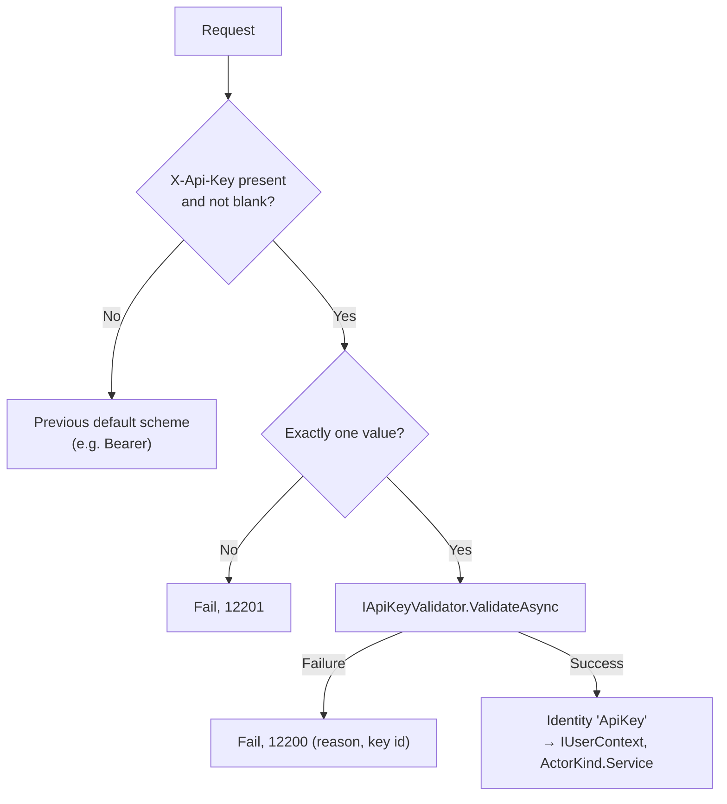

# SharedKernel.Security.ApiKey

[](https://dotnet.microsoft.com/)
[](https://github.com/Gresta-Vertex-Labs/platform-shared-kernel/blob/main/LICENSE)


> **API key authentication for machine clients: generated, hashed at rest, expiring and revocable keys — or your own
> validator — surfaced as the same `IUserContext` as every other caller.**
>
> Pick it for partners and scripts that cannot run an OAuth flow. Callers with an identity provider use
> `SharedKernel.Security.Oidc`; callers that hold a client certificate use `SharedKernel.Security.Mtls`.

| You get | So that |
| --- | --- |
| `AddManagedApiKeyAuthentication<TStore>(k => k.Prefix = "acme_live")` | Keys are generated, checked and revoked by the package; you only store records |
| `ApiKeyGenerator` | Prefixed, checksummed keys that secret scanners recognise and typos never reach the store |
| SHA-256 at rest, fixed-time comparison | A leaked table reveals no usable key; response time reveals no key ids |
| `ApiKeyRecord` with `RevokedAt`, `ExpiresAt`, `TenantId`, `Roles`, `Permissions` | Rotation, revocation and tenant/permission scoping are data changes |
| `AddApiKeyAuthentication<TValidator>()` | Keys issued by another system plug in with the same header handling, claims and logs |
| `ApiKeyOrDefault` forwarding scheme | API keys and OIDC bearer tokens work on the same endpoints, registered in any order |

## Contents

- [Install](#install)
- [Quick start](#quick-start)
- [How it works](#how-it-works)
- [Recipes](#recipes)
- [Configuration](#configuration)
- [Reference](#reference)
- [Testing](#testing)
- [Pitfalls](#pitfalls)
- [Design decisions](#design-decisions)

## Install

```xml
<PackageReference Include="SharedKernel.Security.ApiKey" />
```

The version comes from your central `SharedKernelVersion` property — every SharedKernel package ships at the same
version. See [Using the packages](https://github.com/Gresta-Vertex-Labs/platform-shared-kernel#using-the-packages).

| Requirement | Value |
| --- | --- |
| Target framework | `net10.0` |
| Tier | Host — reference it from your **Api** / **Worker** project |
| Depends on | `SharedKernel.Security.Abstractions`, `SharedKernel.Cryptography` (random, fixed-time comparison), ASP.NET Core |
| Namespaces | `SharedKernel.Security.ApiKey`, `.Extensions`, `.Keys`, `.Validation`, `.Options` |

## Quick start

Implement `IApiKeyStore` over a table you own — it is the only code you write:

```csharp
using Microsoft.EntityFrameworkCore;
using SharedKernel.Execution.Tenancy;
using SharedKernel.Security.ApiKey.Keys;

public sealed class EfApiKeyStore(AppDbContext db) : IApiKeyStore
{
    public async ValueTask<ApiKeyRecord?> FindAsync(string keyId, CancellationToken cancellationToken)
    {
        ApiKeyEntity? key = await db.ApiKeys.AsNoTracking()
            .SingleOrDefaultAsync(k => k.KeyId == keyId, cancellationToken); // KeyId is the primary key

        return key is null
            ? null
            : new ApiKeyRecord(key.KeyId, key.KeyHash, key.ClientId)
            {
                TenantId = TenantId.FromNullable(key.TenantId), // Guid? column; null = no tenant
                Roles = key.Roles,
                Permissions = key.Permissions,
                ExpiresAt = key.ExpiresAt,
                RevokedAt = key.RevokedAt,
            };
    }
}
```

```csharp
using SharedKernel.Security.Abstractions;
using SharedKernel.Security.ApiKey.Extensions;

builder.Services.AddManagedApiKeyAuthentication<EfApiKeyStore>(keys =>
    keys.Prefix = builder.Configuration["ApiKeys:Prefix"]!); // "acme_live" in production, "acme_test" elsewhere
builder.Services.AddAuthorization();

var app = builder.Build();
app.UseAuthentication();
app.UseAuthorization();

app.MapGet("/whoami", (IUserContext caller) => new { caller.SubjectId, caller.TenantId, caller.Permissions })
    .RequireAuthorization();
```

```shell
curl -H "X-Api-Key: acme_live_…" https://orders.example.com/whoami
```

Every registration uses `TryAdd`: an `IApiKeyStore`, `IApiKeyValidator`, `IClock` or `IUserContext` you register first
is kept.

## How it works

Registration adds two schemes. `ApiKey` authenticates the header; `ApiKeyOrDefault` becomes the default scheme and
forwards each request — to `ApiKey` when the header carries a non-blank value, otherwise to the scheme that was the
default before (for example `Bearer`). The previous default is captured when options are built, so registration order
does not matter.



- **The key alone decides.** A request with the header is never retried with the bearer scheme, and a valid key wins
  over an `Authorization` header. A failed key leaves the request anonymous: endpoints requiring authorization answer
  `401`.
- **Header only.** Keys are never read from the query string.
- **Managed validation order**: format and CRC-32 checksum (`Malformed`) → prefix equals `ManagedApiKeyOptions.Prefix`
  (`WrongPrefix`) → `IApiKeyStore.FindAsync(keyId)` and a fixed-time comparison of `SHA-256(key)` with `KeyHash`, made
  even when the id is unknown (`UnknownKey`) → `RevokedAt <= now` (`Revoked`) → `ExpiresAt <= now` (`Expired`). `now`
  comes from `IClock`. Malformed keys, typos and keys from another environment never reach the store.
- **Fail closed.** An exception from the store or validator fails the request; it never authenticates it.

### Key anatomy

```text
acme_live_0123456789ABCDEF_abcdefghijklmnopqrstuvwxyzABCDEF0qA0Q2      (example, not a real key)
└───┬───┘ └──────┬───────┘ └──────────────┬───────────────┘└─┬──┘
  prefix      key id                    secret            checksum
  2-32 chars  16 Base62 (~95 bits)      32 Base62 (~190)  6 Base62: CRC-32 of everything before it
  per env     stored, logged, not secret never stored

Stored: KeyHash = Base64url(SHA-256(ASCII bytes of the whole key))  → 43 characters
```

The prefix starts with a lowercase letter and contains lowercase letters, digits and single underscores (not at the
end). Segments are read from the end, so `acme_live_eu` works.

### Caller identity

| Validation result | Claim | `IUserContext` |
| --- | --- | --- |
| `ClientId` | `sub`, `client_id` | `SubjectId`, `ClientId` (`ActorKind.Service`) |
| `TenantId` | `tenant_id` | `TenantId` (and `IRequestContext.TenantId`) |
| `Roles` | one `roles` claim each | `Roles`, `HasRole`, `User.IsInRole` |
| `Permissions` | one `scope` claim each | `Permissions`, `HasPermission` |
| `KeyId` | `api_key_id` | `FindClaim(ApiKeyAuthenticationDefaults.KeyIdClaimType)` |

A key caller has no `AuthTime` and no authentication methods (unless a claims transformation of yours adds `amr` with
its `amr_time`), so step-up requirements never pass for it.

## Recipes

### 1. Issue a key for a client

```csharp
using SharedKernel.Primitives.Clocks;
using SharedKernel.Security.ApiKey.Keys;

public sealed class ApiKeyIssuer(ApiKeyGenerator generator, AppDbContext db, IClock clock)
{
    public async Task<string> IssueAsync(string clientId, Guid? tenantId, string[] permissions, CancellationToken ct)
    {
        GeneratedApiKey generated = generator.Generate();

        db.ApiKeys.Add(new ApiKeyEntity
        {
            KeyId = generated.KeyId,
            KeyHash = generated.KeyHash,   // the only value derived from the key that is stored
            ClientId = clientId,
            TenantId = tenantId,
            Permissions = [.. permissions],
            CreatedAt = clock.UtcNow,
        });
        await db.SaveChangesAsync(ct);

        return generated.Key;             // show once; generated.ToString() prints only the key id
    }
}
```

`ApiKeyGenerator` is a singleton registered by `AddManagedApiKeyAuthentication`, using the prefix the validator checks.
Serve the key over HTTPS only and never cache the response.

### 2. Rotate a key without downtime

Keys are independent, so a client can hold two. Issue a second key for the same client, let the client deploy it, then
set `RevokedAt` on the old record. A future `RevokedAt` is honoured — the old key stops working exactly then — so
`old.RevokedAt = clock.UtcNow.Add(overlap)` gives a planned overlap.

### 3. Revoke or expire a key

| Goal | Set | Failure reason logged |
| --- | --- | --- |
| Stop a key now | `RevokedAt = clock.UtcNow` | `Revoked` |
| Stop it at a planned time | `RevokedAt` in the future | `Revoked`, from that time |
| Give it a fixed lifetime | `ExpiresAt` when issuing | `Expired` |

Keep revoked rows: a deleted row reports `UnknownKey` and loses the audit trail. Every request reads the store; if that
is too slow, cache **found** records briefly (never misses — anyone can mint well-formed keys with random ids) and evict
on revocation. With several replicas the cache's time to live is how long a revoked key can still work elsewhere.

### 4. Scope a key to a tenant and permissions

```csharp
using SharedKernel.Security.Abstractions;

app.MapGet("/orders", (IUserContext caller) =>
    caller.TenantId is not { } tenantId || !caller.HasPermission("orders:read")
        ? Results.Forbid()                         // no tenant: fail closed instead of querying
        : Results.Ok(/* query scoped to tenantId */))
    .RequireAuthorization();
```

Or declaratively with `SharedKernel.Presentation.Core` (`using SharedKernel.Presentation.Authorization;`):
`.RequireEndpointPermission("orders:read")`. On commands, prefer `[RequirePermission]`. Permissions compare ordinally.

### 5. Accept bearer tokens and API keys on the same endpoints

```csharp
using SharedKernel.Security.ApiKey.Extensions;
using SharedKernel.Security.Oidc.Extensions;

builder.Services.AddOidcAuthentication(builder.Configuration);   // Bearer
builder.Services.AddManagedApiKeyAuthentication<EfApiKeyStore>(keys => keys.Prefix = "acme_live");
```

| Request carries | Authenticated by | Result |
| --- | --- | --- |
| `X-Api-Key` only | `ApiKey` | Service principal from the key record |
| `Authorization: Bearer …` only | `Bearer` | User or service principal from the token |
| Both | `ApiKey` | The bearer token is ignored |
| An invalid key and a valid token | `ApiKey` | `401`; no fallback |

To allow only keys on one endpoint, name the scheme in its policy:
`.RequireAuthorization(p => p.AddAuthenticationSchemes(ApiKeyAuthenticationDefaults.AuthenticationScheme).RequireAuthenticatedUser())`.

### 6. Validate keys issued by another system

```csharp
using System.Net;
using System.Net.Http.Json;
using SharedKernel.Execution.Tenancy;
using SharedKernel.Security.ApiKey.Validation;

public sealed class PartnerPortalApiKeyValidator(HttpClient http) : IApiKeyValidator
{
    public async ValueTask<ApiKeyValidationResult> ValidateAsync(string presentedKey, CancellationToken cancellationToken)
    {
        using HttpResponseMessage response =
            await http.PostAsJsonAsync("keys/introspect", new { key = presentedKey }, cancellationToken);
        if (response.StatusCode == HttpStatusCode.NotFound)
        {
            return ApiKeyValidationResult.Failure("UnknownKey");
        }

        response.EnsureSuccessStatusCode(); // portal unavailable: the request fails, never accepted
        var key = await response.Content.ReadFromJsonAsync<PartnerKey>(cancellationToken);

        return key is { Active: true }
            ? ApiKeyValidationResult.Success(key.PartnerId, TenantId.FromNullable(key.TenantId),
                roles: ["partner"], permissions: key.Scopes, keyId: key.KeyId)
            : ApiKeyValidationResult.Failure("Inactive", key?.KeyId);
    }
}

public sealed record PartnerKey(string KeyId, string PartnerId, bool Active, Guid? TenantId, string[] Scopes);
```

```csharp
builder.Services.AddHttpClient<PartnerPortalApiKeyValidator>(c => c.BaseAddress = new Uri("https://partners.example.com/"));
builder.Services.AddApiKeyAuthentication<PartnerPortalApiKeyValidator>(scheme => scheme.HeaderName = "X-Partner-Key");
```

A custom validator compares secrets in fixed time (`FixedTimeComparison`) or looks up by hash, never stores keys in
plain text, returns a short non-secret failure reason (logged, never sent to the client), and throws when it cannot
decide. Cache remote answers keyed by a hash of the key, never the key.

### 7. Detect leaked keys with secret scanning

Add a custom pattern per prefix (for example in GitHub secret scanning, with push protection):

| Field | Value |
| --- | --- |
| Secret format | `acme_live_[0-9A-Za-z]{16}_[0-9A-Za-z]{32}[0-4][0-9A-Za-z]{5}` |
| Before secret | `\A\|[^0-9A-Za-z_]` |
| After secret | `\z\|[^0-9A-Za-z_]` |

The checksum's first character is always `0`–`4` (a CRC-32 value is below 5 × 62⁵). A tool that can run code can also
verify the checksum: standard CRC-32 (zlib) over the ASCII text before it, written as 6 Base62 digits
(`0-9A-Za-z`), most significant first. Revoke a found key (the key id names the record) and issue a replacement.

## Configuration

API key settings are set in code, not bound from a configuration section.

| Option | Type | Default | Meaning |
| --- | --- | --- | --- |
| `ManagedApiKeyOptions.Prefix` | `string` | — (required) | Prefix of generated and accepted keys: 2–32 lowercase letters, digits and single underscores, starting with a letter; validated at startup |
| `ApiKeyAuthenticationOptions.HeaderName` | `string` | `X-Api-Key` | Header carrying the key (the `configureScheme` argument); inherits `AuthenticationSchemeOptions` |

## Reference

### Registration

| Method | Registers |
| --- | --- |
| `AddManagedApiKeyAuthentication<TStore>(Action<ManagedApiKeyOptions>, Action<ApiKeyAuthenticationOptions>? = null)` | `IApiKeyStore` (scoped), `ApiKeyGenerator` (singleton), `ISecureRandomGenerator`, `IClock`, and everything below with the managed validator |
| `AddApiKeyAuthentication<TValidator>(Action<ApiKeyAuthenticationOptions>? = null)` | `IApiKeyValidator` (scoped), schemes `ApiKey` and `ApiKeyOrDefault` (made the default), `IUserContextMapper`, `IUserContext` (scoped, `TryAdd`) |

### Types

| Type | Purpose |
| --- | --- |
| `IApiKeyStore.FindAsync(keyId, ct)` | Your record lookup; `null` when unknown; exceptions propagate |
| `ApiKeyRecord(keyId, keyHash, clientId)` | `init`: `TenantId`, `Roles`, `Permissions`, `ExpiresAt`, `RevokedAt` |
| `ApiKeyGenerator.Generate()` | `GeneratedApiKey` with `Key` (show once), `KeyId`, `KeyHash`; `ToString()` omits the key |
| `IApiKeyValidator.ValidateAsync(presentedKey, ct)` | Returns `ApiKeyValidationResult` |
| `ApiKeyValidationResult.Success(clientId, tenantId?, roles?, permissions?, keyId?)` / `.Failure(reason = "Rejected", keyId?)` | `IsValid`, `ClientId`, `TenantId`, `Roles`, `Permissions`, `KeyId`, `FailureReason` |

| Constant (`ApiKeyAuthenticationDefaults`) | Value |
| --- | --- |
| `AuthenticationScheme` | `ApiKey` |
| `ForwardingScheme` | `ApiKeyOrDefault` |
| `HeaderName` | `X-Api-Key` |
| `KeyIdClaimType` | `api_key_id` |

Managed failure reasons: `Malformed`, `WrongPrefix`, `UnknownKey`, `Revoked`, `Expired`.

### Logging

| Event id | Level | Event |
| --- | --- | --- |
| 12200 | Warning | API key rejected (reason: `{Reason}`, key id: `{KeyId}`) |
| 12201 | Warning | API key rejected: more than one `{HeaderName}` header value |

The key itself is never logged; the key id is not secret.

## Testing

Reference [`SharedKernel.Security.Testing`](https://github.com/Gresta-Vertex-Labs/platform-shared-kernel/blob/main/src/Hosting/Security/SharedKernel.Security.Testing/README.md)
(namespace `SharedKernel.Testing.Security`) for `InMemoryApiKeyStore` (`Add(record)`,
`Add(generatedKey, clientId, tenantId, permissions, expiresAt)`, `Revoke(keyId, revokedAt)`), and
[`SharedKernel.Testing`](https://github.com/Gresta-Vertex-Labs/platform-shared-kernel/blob/main/src/Testing/SharedKernel.Testing/README.md)
for `FakeClock`:

```csharp
using Microsoft.Extensions.DependencyInjection;
using SharedKernel.Primitives.Clocks;
using SharedKernel.Security.ApiKey.Extensions;
using SharedKernel.Security.ApiKey.Keys;
using SharedKernel.Security.ApiKey.Validation;
using SharedKernel.Testing.Clocks;
using SharedKernel.Testing.Security;

var store = new InMemoryApiKeyStore();
var clock = new FakeClock(new DateTimeOffset(2026, 3, 1, 12, 0, 0, TimeSpan.Zero));

var services = new ServiceCollection().AddLogging();
services.AddSingleton<IClock>(clock);                 // registered first, so kept
services.AddSingleton<IApiKeyStore>(store);
services.AddManagedApiKeyAuthentication<InMemoryApiKeyStore>(keys => keys.Prefix = "acme_test");
await using ServiceProvider provider = services.BuildServiceProvider();

GeneratedApiKey key = provider.GetRequiredService<ApiKeyGenerator>().Generate();
store.Add(key, "billing-service", expiresAt: clock.UtcNow.AddMinutes(5));

await using AsyncServiceScope scope = provider.CreateAsyncScope();
var validator = scope.ServiceProvider.GetRequiredService<IApiKeyValidator>();
Assert.True((await validator.ValidateAsync(key.Key, CancellationToken.None)).IsValid);

clock.Advance(TimeSpan.FromMinutes(5));
Assert.Equal("Expired", (await validator.ValidateAsync(key.Key, CancellationToken.None)).FailureReason);
```

For endpoints, run the same registration on `WebApplication.CreateBuilder()` with `UseTestServer()` and send
`ApiKeyAuthenticationDefaults.HeaderName`. Code that only reads the caller can use `FakeUserContext` instead.

## Pitfalls

| Don't | Do | Why |
| --- | --- | --- |
| Store or log the key | Store `KeyHash`, log the key id | A database or log leak must not reveal usable keys |
| Accept keys in the query string | Use the header | URLs end up in logs, proxies and browser history |
| Delete revoked records | Set `RevokedAt` | A deleted row reports `UnknownKey` and loses the audit trail |
| Cache store misses | Cache found records only, briefly | Random well-formed keys would fill the cache |
| Share one prefix across environments | `acme_live` / `acme_test` | A test key would work in production |
| Set `DefaultAuthenticateScheme` or `DefaultChallengeScheme` | Leave them unset | Requests would bypass `ApiKeyOrDefault` |
| Catch store errors and return `null` | Let them throw | An outage would look like `UnknownKey`, and a custom validator might accept |
| Compare a custom key with `==` | `FixedTimeComparison` or a hash lookup | Timing reveals the secret |
| Expect `[RequireFreshAuthentication]` to pass for a key | Gate key clients on permissions | A key has no authentication time |

## Design decisions

**Why SHA-256 and not a password hash?** A slow hash protects low-entropy secrets. The secret here is 190 random bits;
guessing is infeasible at any hash speed, and a slow hash would add tens of milliseconds to every request.

**Why a prefix and a checksum?** The prefix tells a scanner (or a person reading a log) what the string is and which
environment it belongs to. The checksum rejects typos and random strings without a store lookup and keeps scanner false
positives low; it adds no security by itself.

**Why a forwarding scheme?** It lets API keys and bearer tokens share endpoints without the application choosing a
scheme per endpoint, and it captures the previous default whatever the registration order.

---

Part of [Platform.SharedKernel](https://github.com/Gresta-Vertex-Labs/platform-shared-kernel) ·
[Security packages](https://github.com/Gresta-Vertex-Labs/platform-shared-kernel/blob/main/src/Hosting/Security/README.md) ·
[MIT license](https://github.com/Gresta-Vertex-Labs/platform-shared-kernel/blob/main/LICENSE)
