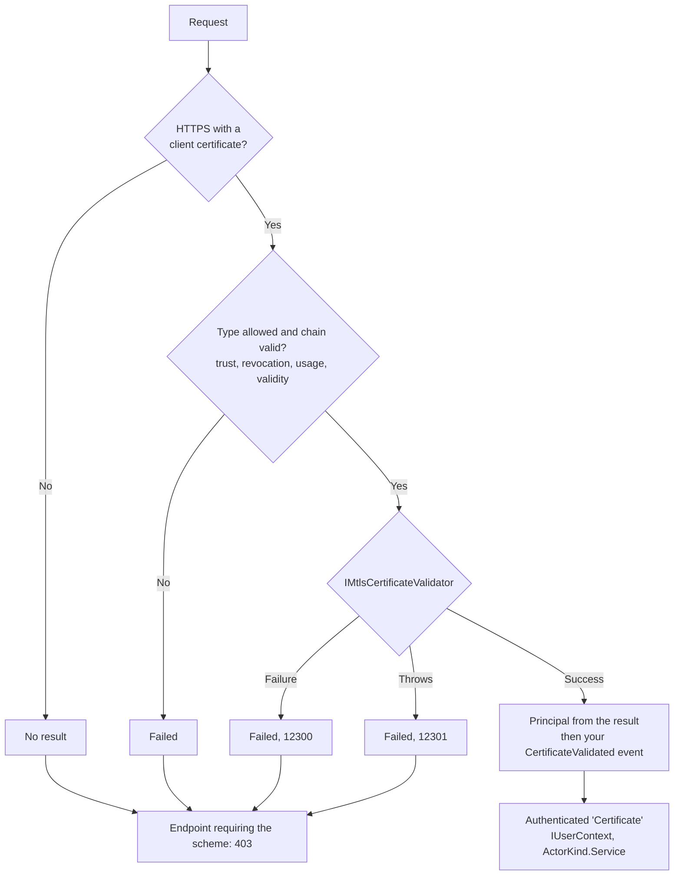

# SharedKernel.Security.Mtls

[](https://dotnet.microsoft.com/)
[](https://github.com/Gresta-Vertex-Labs/platform-shared-kernel/blob/main/LICENSE)


> **Client-certificate (mutual TLS) authentication for partners and services: the framework checks the chain, your
> validator decides who the client is, and the caller becomes a `Service` `IUserContext`.**

| You get | So that |
| --- | --- |
| `AddMtlsAuthentication<TValidator>(o => …)` | One call adds the `Certificate` scheme with secure defaults (chained certificates, online revocation, usage and validity checks) |
| `IMtlsCertificateValidator` | Your code maps an approved certificate to a client id, tenant, roles and permissions |
| A principal built only from the validator's result | Subject, DNS name or email in the certificate never become an identity nobody approved |
| `CustomRootTrust` + `CustomTrustStore` | Partner or private CAs are trusted without accepting self-signed certificates |
| Events and trust settings locked after registration | A later `PostConfigure` or `EventsType` cannot skip the validator — the host refuses to start |
| An `x5t#S256` claim | A certificate caller's thumbprint compares directly with an RFC 8705 token confirmation |

## Contents

- [Install](#install)
- [Quick start](#quick-start)
- [How it works](#how-it-works)
- [Recipes](#recipes)
- [Configuration](#configuration)
- [Reference](#reference)
- [Testing](#testing)
- [Pitfalls](#pitfalls)
- [Design decisions](#design-decisions)

## Install

```xml
<PackageReference Include="SharedKernel.Security.Mtls" />
```

The version comes from your central `SharedKernelVersion` property — every SharedKernel package ships at the same
version. See [Using the packages](https://github.com/Gresta-Vertex-Labs/platform-shared-kernel#using-the-packages).

| Requirement | Value |
| --- | --- |
| Target framework | `net10.0` |
| Tier | Host — reference it from your **Api** / **Worker** project |
| Depends on | `SharedKernel.Security.Abstractions`, `Microsoft.AspNetCore.Authentication.Certificate` |
| Namespaces | `SharedKernel.Security.Mtls`, `.Extensions`, `.Validation`, `.Options` |
| Companion | [`SharedKernel.ServiceDefaults.Security.Mtls`](https://github.com/Gresta-Vertex-Labs/platform-shared-kernel/blob/main/src/Hosting/ServiceDefaults/SharedKernel.ServiceDefaults.Security.Mtls/README.md) — Kestrel negotiation and certificates forwarded by an ingress |

## Quick start

```csharp
using System.Security.Cryptography;
using System.Security.Cryptography.X509Certificates;
using SharedKernel.Security.Mtls.Validation;

/// <summary>Accepts only certificates listed under "MtlsClients" by SHA-256 thumbprint.</summary>
public sealed class ConfiguredClientValidator(IConfiguration configuration) : IMtlsCertificateValidator
{
    public ValueTask<MtlsValidationResult> ValidateAsync(X509Certificate2 certificate, CancellationToken cancellationToken)
    {
        string thumbprint = certificate.GetCertHashString(HashAlgorithmName.SHA256);
        string? clientId = configuration[$"MtlsClients:{thumbprint}"];

        return ValueTask.FromResult(clientId is null
            ? MtlsValidationResult.Failure("UnknownClient")
            : MtlsValidationResult.Success(clientId, roles: ["internal-service"]));
    }
}
```

```json
{
  "MtlsClients": { "<64 hex characters: SHA-256 of the client certificate>": "billing-service" }
}
```

```csharp
using Microsoft.AspNetCore.Server.Kestrel.Https;
using SharedKernel.Security.Abstractions;
using SharedKernel.Security.Mtls;
using SharedKernel.Security.Mtls.Extensions;

// Ask TLS clients for a certificate; the Certificate handler checks chain, revocation, usage and validity later.
builder.WebHost.ConfigureKestrel(k => k.ConfigureHttpsDefaults(https =>
{
    https.ClientCertificateMode = ClientCertificateMode.RequireCertificate;
    https.AllowAnyClientCertificate();
}));

builder.Services.AddMtlsAuthentication<ConfiguredClientValidator>();
builder.Services.AddAuthorizationBuilder()
    .AddPolicy("MtlsClient", p => p
        .AddAuthenticationSchemes(MtlsAuthenticationDefaults.AuthenticationScheme)
        .RequireAuthenticatedUser());

var app = builder.Build();
app.UseAuthentication();
app.UseAuthorization();

app.MapGet("/whoami", (IUserContext caller) => new { caller.ClientId, caller.Roles })
    .RequireAuthorization("MtlsClient");
```

The `Certificate` scheme is never made the default: endpoints opt in by naming it. `RequireCertificate` applies to every
connection, health probes included; use `AllowCertificate` when some endpoints serve callers without one.

## How it works



- **Only chain-valid certificates reach your validator**, with the options of this package.
- **The principal comes only from the validator's result**: `sub` and `client_id` (the client id), `tenant_id`, one
  `roles` claim per role, one `scope` claim per permission, and `x5t#S256` (Base64url SHA-256 of the DER certificate).
  The claims ASP.NET Core derives from the certificate itself are dropped.
- **The validator's rejection is final.** A throwing validator rejects the certificate (12301), and an application
  `AuthenticationFailed` event cannot turn a rejection into success.
- **403, not 401.** A certificate is negotiated on the connection, so the client cannot be challenged for one inside
  the request.
- **Locked configuration.** `MtlsAuthenticationOptions` are copied onto the handler's options in `Configure`; the
  events wrapper is installed in `PostConfigure`. Validation fails startup when `EventsType` is set, `Events` was
  replaced after registration, or a trust setting diverges from `MtlsAuthenticationOptions`.

### Deployment topologies

| Topology | Configure | Validator runs |
| --- | --- | --- |
| TLS at Kestrel, plain | `ConfigureHttpsDefaults` with `ClientCertificateMode` and `AllowAnyClientCertificate()` (quick start) | Once per request using the scheme |
| TLS at Kestrel, ServiceDefaults | `builder.AddMtlsClientCertificate(mode)` (recipe 3) | During each handshake (blocking), and per request |
| TLS at an ingress | `builder.AddMtlsForwardedHeaderCertificate(...)` + middleware + forwarded headers (recipe 4) | In the middleware, and per request |

This package authenticates a **client** by its certificate. Certificate-bound **tokens** (RFC 8705) are checked by
[`SharedKernel.Security.Oidc`](https://github.com/Gresta-Vertex-Labs/platform-shared-kernel/blob/main/src/Hosting/Security/SharedKernel.Security.Oidc/README.md),
which only needs the certificate on the connection.

## Recipes

### 1. Allow-list clients by SHA-256 thumbprint

```csharp
using System.Security.Cryptography;
using System.Security.Cryptography.X509Certificates;
using Microsoft.Extensions.Caching.Memory;
using SharedKernel.Execution.Tenancy;
using SharedKernel.Security.Mtls.Validation;

public sealed record RegisteredClient(string ClientId, TenantId? TenantId, string[] Roles, string[] Permissions, bool Revoked);

public interface IClientCertificateStore
{
    Task<RegisteredClient?> FindByThumbprintAsync(string thumbprint, CancellationToken ct);
}

public sealed class ThumbprintAllowListValidator(IClientCertificateStore store, IMemoryCache cache) : IMtlsCertificateValidator
{
    public async ValueTask<MtlsValidationResult> ValidateAsync(X509Certificate2 certificate, CancellationToken cancellationToken)
    {
        string thumbprint = certificate.GetCertHashString(HashAlgorithmName.SHA256);
        RegisteredClient? client = await cache.GetOrCreateAsync($"mtls-client:{thumbprint}", entry =>
        {
            entry.AbsoluteExpirationRelativeToNow = TimeSpan.FromMinutes(1); // bounds how long a revocation takes
            return store.FindByThumbprintAsync(thumbprint, cancellationToken);
        });

        return client switch
        {
            null => MtlsValidationResult.Failure("UnknownClient"),
            { Revoked: true } => MtlsValidationResult.Failure("Revoked"),
            _ => MtlsValidationResult.Success(client.ClientId, client.TenantId, client.Roles, client.Permissions),
        };
    }
}
```

```csharp
builder.Services.AddMemoryCache();
builder.Services.AddSingleton<IClientCertificateStore, PostgresClientCertificateStore>(); // your store
builder.Services.AddMtlsAuthentication<ThumbprintAllowListValidator>();
```

The cache matters: the validator runs on every request using the scheme, and on every handshake with recipe 3.

**Rotation** is two rows for one client: register the new thumbprint with the same client id, let the client switch,
then mark the old row revoked. Tokens bound to the old certificate stop working once the client presents the new one.

### 2. Trust a private or partner CA

```csharp
using System.Security.Cryptography.X509Certificates;
using SharedKernel.Security.Mtls.Extensions;

X509Certificate2Collection partnerCa = [];
partnerCa.ImportFromPemFile(builder.Configuration["Mtls:PartnerCaBundlePath"]!); // root and intermediates

builder.Services.AddMtlsAuthentication<OpenBankingCertificateValidator>(options =>
{
    options.ChainTrustValidationMode = X509ChainTrustMode.CustomRootTrust;
    options.CustomTrustStore.AddRange(partnerCa);
});
```

Include intermediates: the chain is built from the trust store, not from intermediates the client sends.

| `RevocationMode` | Behaviour | Use when |
| --- | --- | --- |
| `Online` (default) | Downloads the CRL or queries OCSP; unavailable data rejects | The CA publishes revocation data your hosts can reach |
| `Offline` | Only revocation data cached on the machine | Hosts without outbound access, cache kept current |
| `NoCheck` | No revocation check | The CA publishes none; keep a revoked flag in your validator |

**Regulated partners (PSD2, Open Banking).** Trust only the scheme's CAs, then map a vetted subject attribute such as
`organizationIdentifier` (OID 2.5.4.97, e.g. `PSDGB-FCA-123456`) to the partner you onboarded, and pin the issuer name
recorded at onboarding. Read attributes with `X500DistinguishedName.EnumerateRelativeDistinguishedNames()`, never by
splitting `Subject`, and reject an attribute that appears twice.

| Certificate field | Identify a client with it? |
| --- | --- |
| SHA-256 thumbprint | Yes, for one exact certificate |
| Subject attributes the CA vets (`organizationIdentifier`, `O`) | Yes, with a trust store limited to CAs that vet them |
| Issuer name | As a pin, together with an identifier |
| Common name, DNS names | Only when your CA's policy defines them |
| Email, UPN, SHA-1 `Thumbprint`, roles in the certificate | No — take grants from your registry |

### 3. Validate during the TLS handshake at Kestrel

```csharp
using Microsoft.AspNetCore.Server.Kestrel.Https;
using SharedKernel.Security.Mtls.Extensions;
using SharedKernel.ServiceDefaults.Security;

builder.Services.AddMtlsAuthentication<ThumbprintAllowListValidator>();
builder.AddMtlsClientCertificate(ClientCertificateMode.RequireCertificate); // default: AllowCertificate
```

An unregistered client cannot open a connection (a TLS error, not an HTTP response). Kestrel's callback is
synchronous, so the validator is blocked on in a new scope with no cancellation: keep it fast (a cache, never a remote
call per handshake). Endpoints still need a policy naming the `Certificate` scheme.

### 4. Run behind an ingress that terminates TLS

```csharp
using System.Security.Cryptography.X509Certificates;
using Microsoft.AspNetCore.HttpOverrides;
using SharedKernel.Security.Mtls.Extensions;
using SharedKernel.ServiceDefaults.Security;
using IPNetwork = System.Net.IPNetwork;

var ingressPods = IPNetwork.Parse("10.42.0.0/16");

builder.Services.AddMtlsAuthentication<OpenBankingCertificateValidator>(options =>
{
    options.ChainTrustValidationMode = X509ChainTrustMode.CustomRootTrust;
    options.CustomTrustStore.ImportFromPemFile("/etc/mtls/partner-ca.pem");
});
builder.AddMtlsForwardedHeaderCertificate(options =>
{
    options.HeaderName = "ssl-client-cert";      // NGINX: URL-encoded PEM
    options.AddTrustedNetwork(ingressPods);       // only the ingress may set it
});
builder.Services.Configure<ForwardedHeadersOptions>(options =>
{
    options.ForwardedHeaders = ForwardedHeaders.XForwardedFor | ForwardedHeaders.XForwardedProto;
    options.KnownIPNetworks.Add(ingressPods);
});

var app = builder.Build();
app.UseMiddleware<MtlsForwardedHeaderMiddleware>(); // first: compares the proxy's address, not the client's
app.UseForwardedHeaders();                          // restores https; the handler ignores plain HTTP
app.UseAuthentication();
app.UseAuthorization();
```

Supported header formats: Base64 DER and URL-encoded PEM (NGINX `ssl-client-cert`, Envoy `%DOWNSTREAM_PEER_CERT%`).
Envoy/Istio's structured `x-forwarded-client-cert` is not parsed. The proxy must overwrite any client-supplied
certificate header, and a network policy should let only the ingress reach the service.

### 5. Client certificates and bearer tokens in one service

```csharp
using SharedKernel.Presentation.Authorization;
using SharedKernel.Security.Mtls;
using SharedKernel.Security.Mtls.Extensions;
using SharedKernel.Security.Oidc.Extensions;

builder.Services.AddOidcAuthentication(builder.Configuration);              // "Bearer", the default
builder.Services.AddMtlsAuthentication<OpenBankingCertificateValidator>();  // "Certificate", per endpoint
builder.Services.AddAuthorizationBuilder()
    .AddPolicy("Partner", p => p.AddAuthenticationSchemes(MtlsAuthenticationDefaults.AuthenticationScheme)
        .RequireAuthenticatedUser());

app.MapGroup("/partner").RequireAuthorization("Partner")
    .MapPost("/payments", () => Results.Accepted())
    .RequireEndpointPermission("payments:initiate");   // the validator's permissions
```

Don't list both schemes in one policy — the request then has two identities and `IUserContext` maps only one. To
require a token *and* a certificate, use certificate-bound tokens. `RequireFreshAuthentication` never passes for a
certificate caller (no authentication time).

## Configuration

`MtlsAuthenticationOptions` are set in code through `AddMtlsAuthentication`'s `configure` argument (no configuration
section) and validated at startup.

| Option | Type | Default | Meaning |
| --- | --- | --- | --- |
| `AllowedCertificateTypes` | `CertificateTypes` | `Chained` | Never `SelfSigned` or `All` to make a private CA work |
| `ChainTrustValidationMode` | `X509ChainTrustMode` | `System` | `CustomRootTrust` trusts only `CustomTrustStore` |
| `CustomTrustStore` | `X509Certificate2Collection` | empty | Roots and intermediates; required with `CustomRootTrust`, rejected with `System` |
| `RevocationMode` | `X509RevocationMode` | `Online` | `Online`, `Offline` or `NoCheck` |
| `RevocationFlag` | `X509RevocationFlag` | `ExcludeRoot` | `EndCertificateOnly`, `ExcludeRoot` or `EntireChain` |
| `ValidateCertificateUse` | `bool` | `true` | Requires the client-authentication extended key usage |
| `ValidateValidityPeriod` | `bool` | `true` | Rejects expired and not-yet-valid certificates |

Startup fails for an undefined enum value, `CustomRootTrust` without a trust store, a trust store under `System`, an
invalid `AllowedCertificateTypes`, and for the event or trust-setting tampering described above.

## Reference

### Registration

| Method | Registers |
| --- | --- |
| `AddMtlsAuthentication<TValidator>(Action<MtlsAuthenticationOptions>? configure = null)` | Scheme `Certificate` (not default), `IMtlsCertificateValidator` (scoped, `TryAdd`), `IUserContextMapper`, `IUserContext` (scoped, `TryAdd`), options validation |

### Types

| Type | Purpose |
| --- | --- |
| `IMtlsCertificateValidator.ValidateAsync(X509Certificate2, CancellationToken)` | Returns `MtlsValidationResult`; throwing rejects |
| `MtlsValidationResult.Success(clientId, tenantId?, roles?, permissions?)` | `default(TenantId)` throws; pass `null` for no tenant |
| `MtlsValidationResult.Failure(reason = "Rejected")` | A short, non-secret reason; logged, never sent to the client |
| `MtlsAuthenticationDefaults.AuthenticationScheme` | `Certificate` |
| `MtlsAuthenticationDefaults.CertificateThumbprintClaimType` | `x5t#S256` |

Read the thumbprint with `IUserContext.FindClaim(MtlsAuthenticationDefaults.CertificateThumbprintClaimType)`.

### Logging

| Event id | Level | Event |
| --- | --- | --- |
| 12300 | Warning | Client certificate rejected by the validator (reason: `{Reason}`, thumbprint: `{Thumbprint}`) |
| 12301 | Error | The certificate validator failed; the client certificate was rejected (thumbprint: `{Thumbprint}`) |

The thumbprint is public; the certificate is never logged. Handshake-time events (13000–13003) are logged by the
ServiceDefaults companion.

## Testing

`TestServer` has no TLS handshake: add a test-only middleware that sets `HttpContext.Connection.ClientCertificate`
and mark the request HTTPS, then let the real handler, trust settings and validator run. Generate certificates with
[`SharedKernel.Security.Testing`](https://github.com/Gresta-Vertex-Labs/platform-shared-kernel/blob/main/src/Hosting/Security/SharedKernel.Security.Testing/README.md)
(namespace `SharedKernel.Testing.Security`):

```csharp
using SharedKernel.Testing.Security;

MtlsTestCertificate chained = new MtlsTestCertificateBuilder()
    .WithSubjectName("CN=billing-service")
    .AsChainedFromEphemeralCa()
    .Build();                       // Certificate, IssuingCertificate (the ephemeral CA), RevocationList

MtlsTestCertificate revoked = new MtlsTestCertificateBuilder().AsChainedFromEphemeralCa().AsRevoked().Build();
MtlsTestCertificate selfSigned = new MtlsTestCertificateBuilder().AsSelfSigned().Build();
```

Trust `chained.IssuingCertificate` through `CustomRootTrust` in the test host, and use `RevocationMode.NoCheck` unless
the test serves the revocation list. Code that only reads the caller can use `FakeUserContext`.

## Pitfalls

| Don't | Do | Why |
| --- | --- | --- |
| `AllowedCertificateTypes = All` or `SelfSigned` for a private CA | `CustomRootTrust` + `CustomTrustStore` | A self-signed certificate passes chain validation by definition |
| Read `HttpContext.Connection.ClientCertificate` on an endpoint without the scheme | Name the `Certificate` scheme in the policy | No chain check ran for that request |
| Identify clients by common name or email | SHA-256 thumbprint or a CA-vetted attribute | Public CAs put domains in `CN`; email is rarely validated |
| Set `EventsType` or replace `Events` in `PostConfigure` | Configure events with `Configure` | The host refuses to start: the validator would be skipped |
| Change trust settings on `CertificateAuthenticationOptions` | Set them through `MtlsAuthenticationOptions` | Divergent settings fail startup |
| A remote call per handshake with `AddMtlsClientCertificate` | Cache in the validator | The handshake blocks on it |
| Run `UseForwardedHeaders` before the forwarding middleware | Middleware first | Trusted networks would be compared with the client's address |
| Keep `Online` revocation for a CA without CRL/OCSP | `NoCheck` plus a revoked flag in your registry | Every certificate would be rejected |
| Put roles in the certificate | Return grants from your registry | Revoking a role would require revoking the certificate |

## Design decisions

**Why build the principal only from the validator?** A valid chain proves only what the issuing CA verified; the
validator is the one place that decides which client a certificate is, so nothing downstream can read an unapproved
identity from the certificate.

**Why is the scheme never the default?** Client certificates are negotiated per connection; making them the default
would change how every endpoint authenticates. Endpoints opt in explicitly.

**Why lock the events?** `CertificateAuthenticationHandler` is internal, so the validator runs from an events wrapper.
A later `PostConfigure` or `EventsType` could otherwise remove it silently; failing startup keeps the check mandatory.

**Why is the RFC 8705 token check not here?** It is a property of the token being validated and lives in
`SharedKernel.Security.Oidc`; this package needs no token or cryptography dependency.

---

Part of [Platform.SharedKernel](https://github.com/Gresta-Vertex-Labs/platform-shared-kernel) ·
[Security domain](https://github.com/Gresta-Vertex-Labs/platform-shared-kernel/blob/main/src/Hosting/Security/README.md) ·
[MIT license](https://github.com/Gresta-Vertex-Labs/platform-shared-kernel/blob/main/LICENSE)
