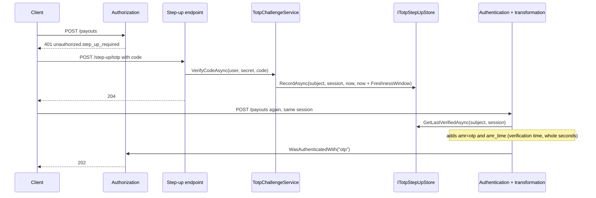

# SharedKernel.Security.Totp

[](https://dotnet.microsoft.com/)
[](https://github.com/Gresta-Vertex-Labs/platform-shared-kernel/blob/main/LICENSE)


> **Authenticator-app enrollment, recovery codes and session-bound step-up: a verified one-time code adds `amr=otp`
> to one sign-in session for a bounded window, so sensitive endpoints can demand a fresh second factor.**

| You get | So that |
| --- | --- |
| `TotpEnrollmentService` | A secret, QR provisioning URI and hashed recovery codes in one call, confirmed by the user's first code |
| `TotpChallengeService` | Codes and recovery codes verified with replay protection and optional throttling |
| `TotpStepUpClaimsTransformation` | A verified step-up shows up as `amr=otp` (with its `amr_time`) on later requests of that session only |
| `TotpStepUpOptions.FreshnessWindow` | A step-up expires on its own (default 15 minutes) |
| `ITotpStepUpStore`, `IRecoveryCodeStore` | Storage stays yours — Redis, PostgreSQL, anything shared by every replica |
| Works with `[RequireAuthenticationMethod("otp", MaxAgeSeconds = n)]` | Endpoints, hub methods and gRPC methods gate on a recent step-up declaratively |

## Contents

- [Install](#install)
- [Quick start](#quick-start)
- [How it works](#how-it-works)
- [Recipes](#recipes)
- [Configuration](#configuration)
- [Reference](#reference)
- [Testing](#testing)
- [Pitfalls](#pitfalls)
- [Design decisions](#design-decisions)

## Install

```xml
<PackageReference Include="SharedKernel.Security.Totp" />
```

The version comes from your central `SharedKernelVersion` property — every SharedKernel package ships at the same
version. See [Using the packages](https://github.com/Gresta-Vertex-Labs/platform-shared-kernel#using-the-packages).

| Requirement | Value |
| --- | --- |
| Target framework | `net10.0` |
| Tier | Host — reference it from your **Api** / **Worker** project |
| Depends on | `SharedKernel.Security.Abstractions`, [`SharedKernel.Cryptography`](https://github.com/Gresta-Vertex-Labs/platform-shared-kernel/blob/main/src/Foundation/SharedKernel.Cryptography/README.md) (TOTP algorithms, hashing, random), ASP.NET Core |
| Namespaces | `SharedKernel.Security.Totp`; `SharedKernel.Cryptography.Totp` for `ITotpReplayGuard`, `ITotpAttemptThrottle`, `TotpParameters` |
| You provide | `ITotpStepUpStore`, `IRecoveryCodeStore`, `ITotpReplayGuard`, an authentication package; an `ITotpAttemptThrottle` is strongly recommended |

## Quick start

```csharp
using SharedKernel.Cryptography.Extensions;
using SharedKernel.Cryptography.Totp;
using SharedKernel.Presentation.WebApi;
using SharedKernel.Security.Oidc.Extensions;
using SharedKernel.Security.Totp;

builder.Services.AddOidcAuthentication(builder.Configuration);            // IUserContext with a session id
builder.AddSharedKernelWebApi();                                          // RequireAuthenticationMethod policies

builder.Services.AddSingleton<ITotpReplayGuard, RedisTotpReplayGuard>();       // shared by every replica
builder.Services.AddSingleton<ITotpAttemptThrottle, RedisTotpAttemptThrottle>();

builder.Services.AddSharedKernelCryptography(builder.Configuration)
    .AddTotpStepUp<RedisTotpStepUpStore, PostgresRecoveryCodeStore>(o => o.FreshnessWindow = TimeSpan.FromMinutes(10));

var app = builder.Build();
app.UseSharedKernelWebApi(); // authentication runs the step-up transformation, then authorization
```

Verify a code for the caller's session, then gate the sensitive endpoint:

```csharp
using SharedKernel.Presentation.Authorization;
using SharedKernel.Security.Abstractions;
using SharedKernel.Security.Totp;

RouteGroupBuilder api = app.MapGroup("/api").RequireAuthorization();

api.MapPost("/step-up/totp", async (TotpCodeRequest request, IUserContext user, ITotpSecretSource secrets,
    TotpChallengeService challenges, CancellationToken ct) =>
{
    if (user.SubjectId is null || await secrets.FindAsync(user.SubjectId, ct) is not { } enrolled)
    {
        return Results.NotFound();
    }

    TotpChallengeResult result = await challenges.VerifyCodeAsync(user, enrolled.Secret, request.Code, enrolled.Parameters, ct);
    return result == TotpChallengeResult.Verified ? Results.NoContent() : Results.BadRequest(result.ToString());
});

api.MapPost("/payouts", () => Results.Accepted())
    .RequireAuthenticationMethod(TimeSpan.FromMinutes(5), "otp"); // 401 unauthorized.step_up_required until stepped up

public sealed record TotpCodeRequest(string Code);
```

`ITotpSecretSource` is your code: it returns the user's decrypted secret and `TotpParameters` (recipe 2). The store,
replay guard and throttle types are also yours (recipe 4).

## How it works



- **Visible from the next request.** The claims transformation runs during authentication, so the request that
  verified the code is not elevated.
- **Per session, not per user.** The step-up is keyed by subject id **and** session id (Oidc reads `sid`, then `jti`,
  `uti`), so a code entered on a laptop never elevates a token stolen from a phone. Replay protection, throttling and
  recovery codes stay keyed by subject, so a code accepted in one session is `Replayed` in every other.
- **Only users.** `ActorKind.User` with a subject and a session; anything else returns `NoSession`.
- **`AuthTime` never changes.** A step-up adds an authentication method; gate with `RequireAuthenticationMethod`,
  never `RequireFreshAuthentication`.
- **The transformation wraps, never replaces.** ASP.NET Core resolves one `IClaimsTransformation`; `AddTotpStepUp`
  moves an existing one under a private key (same lifetime), runs it first, and drops only ASP.NET Core's no-op. The
  original identity is copied, never mutated; transforming twice adds the claims once. A step-up recorded in the future
  or older than `FreshnessWindow` is ignored.
- **Enrollment stores nothing.** `Create` returns everything in memory; you keep it pending until `ConfirmAsync`
  verifies the first code, which proves the app holds the secret and records the time step with the replay guard. It
  records no step-up.

### Recovery codes

Codes look like `K7QXM-2RDPA` (10 Base32 characters, 50 bits), shown once. Each is stored as a `StoredRecoveryCode`: a
random id, a two-character lookup and a PHC hash from `IOneWayHasher` (PBKDF2 by default, Argon2id when configured).
Redemption normalizes the input (uppercase, no spaces or hyphens), verifies the hash only where the lookup matches — so
a slow hash is not paid ten times — and calls `TryMarkUsedAsync`, which must check and update atomically.

## Recipes

### 1. Enroll an authenticator app

```csharp
using System.Security.Cryptography;
using SharedKernel.Execution.Context;
using SharedKernel.Security.Abstractions;
using SharedKernel.Security.Totp;

enrollment.MapPost("/", async (IUserContext user, TotpEnrollmentService enrollments, TotpSecretProtector secrets,
    ITotpEnrollmentRepository repository, CancellationToken ct) =>
{
    if (user.ActorKind != ActorKind.User || user.SubjectId is not { } subjectId)
    {
        return Results.Forbid();
    }

    // Replacing an active authenticator needs the current one, or a stolen session could swap it.
    if (await repository.FindActiveAsync(subjectId, ct) is not null && !user.WasAuthenticatedWith("otp"))
    {
        return Results.Forbid();
    }

    TotpEnrollment created = enrollments.Create(issuer: "Contoso", accountName: user.Email ?? subjectId);
    try
    {
        string encrypted = await secrets.ProtectAsync(subjectId, created.Secret, ct);
        await repository.SavePendingAsync(subjectId, encrypted, created.Parameters, created.StoredRecoveryCodes, ct);

        return Results.Ok(new
        {
            provisioningUri = created.ProvisioningUri.AbsoluteUri, // render as a QR code
            manualEntryKey = created.SecretBase32,
            recoveryCodes = created.RecoveryCodes,                 // shown once
        });
    }
    finally
    {
        CryptographicOperations.ZeroMemory(created.Secret);
    }
});
```

Confirm with `enrollments.ConfirmAsync(user, pendingSecret, request.Code, pendingParameters, ct)`; on `Verified`,
activate the enrollment and replace the user's recovery codes in one transaction. `Create` hashes every recovery code
with the configured password hash (in parallel) — noticeable CPU; never call it unauthenticated or in a loop.

### 2. Encrypt the stored secret

Anyone who reads a TOTP secret can generate valid codes forever. Encrypt it with associated data bound to the subject,
so a secret copied onto another user's row fails to decrypt:

```csharp
using System.Text;
using SharedKernel.Cryptography.Symmetric;
using SharedKernel.Primitives.Results;

public sealed class TotpSecretProtector(ISymmetricEncryptionService encryption)
{
    public async Task<string> ProtectAsync(string subjectId, byte[] secret, CancellationToken ct) =>
        (await encryption.EncryptAsync(secret, Context(subjectId), ct)).ToString();

    public async Task<byte[]?> UnprotectAsync(string subjectId, string stored, CancellationToken ct)
    {
        if (!EncryptedPayload.TryParse(stored, out EncryptedPayload? payload))
        {
            return null;
        }

        Result<byte[]> secret = await encryption.DecryptAsync(payload, Context(subjectId), ct);
        return secret.IsSuccess ? secret.Value : null;   // zero it after use
    }

    private static byte[] Context(string subjectId) => Encoding.UTF8.GetBytes($"totp-secret/{subjectId}");
}
```

Register with `AddSharedKernelCryptography(configuration).AddSymmetricEncryption().AddTotpStepUp<…>()`; keys and
rotation are covered in the `SharedKernel.Cryptography` README.

### 3. Complete a step-up with a recovery code

```csharp
api.MapPost("/step-up/recovery-code", async (TotpCodeRequest request, IUserContext user,
    TotpChallengeService challenges, IRecoveryCodeStore recoveryCodes, CancellationToken ct) =>
{
    TotpChallengeResult result = await challenges.RedeemRecoveryCodeAsync(user, request.Code, ct);
    if (result != TotpChallengeResult.Verified)
    {
        return Results.BadRequest(result.ToString());
    }

    int remaining = (await recoveryCodes.GetUnusedAsync(user.SubjectId!, ct)).Count;
    return Results.Ok(new { remainingRecoveryCodes = remaining, shouldReenroll = remaining <= 2 });
});
```

`k7qxm 2rdpa` matches `K7QXM-2RDPA`. After a recovery-code step-up the session carries `amr=otp`, so the user can
enroll a new phone immediately; confirming that enrollment replaces all recovery codes.

### 4. Implement the stores

All stores must be shared by every replica, and keys built from user-supplied values must not collide
(`"a:b" + "c"` vs `"a" + "b:c"`).

```csharp
using SharedKernel.Security.Totp;
using StackExchange.Redis;

public sealed class RedisTotpStepUpStore(IConnectionMultiplexer redis) : ITotpStepUpStore
{
    public async ValueTask RecordAsync(string subjectId, string sessionId, DateTimeOffset verifiedAt,
        DateTimeOffset expiresAt, CancellationToken cancellationToken) =>
        await redis.GetDatabase().StringSetAsync(Key(subjectId, sessionId), verifiedAt.ToUnixTimeMilliseconds(), expiresAt - verifiedAt);

    public async ValueTask<DateTimeOffset?> GetLastVerifiedAsync(string subjectId, string sessionId, CancellationToken cancellationToken)
    {
        RedisValue value = await redis.GetDatabase().StringGetAsync(Key(subjectId, sessionId));
        return value.TryParse(out long ms) ? DateTimeOffset.FromUnixTimeMilliseconds(ms) : null;
    }

    private static RedisKey Key(string subjectId, string sessionId) => $"totp:step-up:{subjectId.Length}:{subjectId}:{sessionId}";
}
```

The step-up store is read on every authenticated user request with a session — keep it fast. To end a step-up early
(sign-out, password change), delete the key yourself.

**Recovery codes (PostgreSQL).** `GetUnusedAsync` selects `code_id, lookup, hash` where `used_at IS NULL`;
`TryMarkUsedAsync` is one statement whose row count is the answer:

```sql
UPDATE totp_recovery_codes SET used_at = @usedAt
WHERE subject_id = @subject AND code_id = @codeId AND used_at IS NULL;   -- 1 row = this call used it
```

**Replay guard and throttle** (`SharedKernel.Cryptography.Totp`). `ITotpReplayGuard.TryAcceptTimeStepAsync(identityKey,
timeStep, retention)` must compare and store in one atomic operation (a Lua script, or a conditional upsert); register
it as a singleton, since `ITotpVerifier` is one. `ITotpAttemptThrottle` (`IsThrottledAsync`, `RecordAttemptAsync`) is
checked before every confirmation, code and recovery-code attempt, keyed by subject; every other attempt is recorded,
successful or not — size the limit (e.g. 10 per 15 minutes) so legitimate step-ups do not lock a user out.

### 5. Require a recent step-up on hubs, controllers and gRPC

```csharp
[HttpPost("payouts")]
[RequireAuthenticationMethod("otp", MaxAgeSeconds = 300)]
public IActionResult CreatePayout(PayoutRequest payout) => Accepted();
```

| Requirement | Satisfied by a TOTP step-up? |
| --- | --- |
| `[RequireAuthenticationMethod("otp")]` | Yes, for `FreshnessWindow` on HTTP; on a SignalR connection for as long as it stays open |
| `[RequireAuthenticationMethod("otp", MaxAgeSeconds = 300)]` | Yes, while `amr_time` is at most 300 seconds old — checked on every hub-method call |
| `[RequireFreshAuthentication(…)]` | No — the step-up never changes `AuthTime` |

A refused, signed-in caller gets 401 `unauthorized.step_up_required` with
`WWW-Authenticate: Bearer error="insufficient_user_authentication", …, max_age="300"` (`DPoP` when the request used
DPoP). On SignalR hub methods always set `MaxAgeSeconds` (no longer than `FreshnessWindow`) and put the attribute on the
method, not the hub class; a gRPC stream is authorized once, when it starts.

## Configuration

`TotpStepUpOptions` are set in code through `AddTotpStepUp`'s `configure` argument (no configuration section) and
validated at startup.

| Option | Type | Default | Meaning |
| --- | --- | --- | --- |
| `FreshnessWindow` | `TimeSpan` | `00:15:00` | How long a step-up lasts; 1 minute to 24 hours |
| `AuthenticationMethod` | `string` | `otp` | The `amr` value added for a step-up |
| `AuthenticationMethodClaimType` | `string` | `amr` | The claim type it is added under |

Code parameters (digits, period, algorithm) are `TotpParameters` from `SharedKernel.Cryptography`, stored with each
enrollment; recovery-code hashing follows `SharedKernel:Cryptography:OneWayHashing`.

## Reference

### Registration

| Method | Registers |
| --- | --- |
| `ICryptographyBuilder.AddTotpStepUp<TStepUpStore, TRecoveryCodeStore>(Action<TotpStepUpOptions>? configure = null)` | `ITotpVerifier` (via `AddTotpVerification`), `IClock`, `ITotpStepUpStore` and `IRecoveryCodeStore` (scoped, `TryAdd`), `TotpEnrollmentService`, `TotpChallengeService` (scoped), and the wrapping `IClaimsTransformation` (once) |

### Types

| Type | Members |
| --- | --- |
| `TotpEnrollmentService` | `Create(issuer, accountName, parameters?, secretLengthBytes = 20, recoveryCodeCount = 10)` → `TotpEnrollment`; `ConfirmAsync(user, secret, code, parameters?, ct)` |
| `TotpEnrollment` | `Secret`, `SecretBase32`, `ProvisioningUri`, `Parameters`, `RecoveryCodes` (show once), `StoredRecoveryCodes` (persist); `ToString()` omits secrets |
| `TotpChallengeService` | `VerifyCodeAsync(user, secret, code, parameters?, ct)`, `RedeemRecoveryCodeAsync(user, code, ct)` |
| `TotpChallengeResult` | `Invalid`, `Verified`, `Replayed`, `Throttled`, `NoSession` |
| `ITotpStepUpStore` | `RecordAsync(subjectId, sessionId, verifiedAt, expiresAt, ct)`, `GetLastVerifiedAsync(subjectId, sessionId, ct)` |
| `IRecoveryCodeStore` | `GetUnusedAsync(subjectId, ct)`, `TryMarkUsedAsync(subjectId, codeId, usedAt, ct)` (atomic) |
| `StoredRecoveryCode(Id, Lookup, Hash)` | What you persist per recovery code |
| `TotpStepUpClaimsTransformation` | `TransformAsync(principal)`; public for hosts that compose transformations themselves |

### Logging

| Event id | Level | Event |
| --- | --- | --- |
| 12400 | Warning | TOTP challenge not accepted (result: `{Result}`, operation: `{Operation}` — `Code`, `RecoveryCode`, `ConfirmEnrollment`) |
| 12401 | Information | TOTP step-up completed (operation: `{Operation}`) |
| 12402 | Information | Recovery code redeemed; `{Remaining}` unused recovery codes remain |

Codes, secrets and recovery codes are never logged.

## Testing

Everything reads `IClock`: register a movable clock **before** `AddSharedKernelCryptography` and generate codes with
`TotpGenerator` over the same clock.
[`SharedKernel.Security.Testing`](https://github.com/Gresta-Vertex-Labs/platform-shared-kernel/blob/main/src/Testing/SharedKernel.Security.Testing/README.md)
provides `InMemoryTotpStepUpStore` and `InMemoryRecoveryCodeStore` (`Save(subjectId, codes)`);
[`SharedKernel.Cryptography.Testing`](https://github.com/Gresta-Vertex-Labs/platform-shared-kernel/blob/main/src/Testing/SharedKernel.Cryptography.Testing/README.md)
provides `FakeTotpReplayGuard`.

```csharp
using System.Security.Cryptography;
using Microsoft.Extensions.DependencyInjection;
using SharedKernel.Cryptography.Extensions;
using SharedKernel.Cryptography.Totp;
using SharedKernel.Execution.Context;
using SharedKernel.Primitives.Clocks;
using SharedKernel.Security.Abstractions;
using SharedKernel.Security.Totp;
using SharedKernel.Testing.Clocks;
using SharedKernel.Testing.Cryptography;
using SharedKernel.Testing.Security;

var clock = new FakeClock(new DateTimeOffset(2026, 3, 1, 12, 0, 10, TimeSpan.Zero));
var services = new ServiceCollection().AddLogging();
services.AddSingleton<IClock>(clock);
services.AddSingleton<ITotpReplayGuard>(new FakeTotpReplayGuard(clock));
services.AddSharedKernelCryptography(configuration) // e.g. SharedKernel:Cryptography:Pbkdf2:Iterations = 100000
    .AddTotpStepUp<InMemoryTotpStepUpStore, InMemoryRecoveryCodeStore>();
await using ServiceProvider provider = services.BuildServiceProvider();

byte[] secret = RandomNumberGenerator.GetBytes(20);
string code = new TotpGenerator(clock).GenerateCode(secret);
IUserContext Session(string id) => new UserContext(ActorKind.User, "user-1") { SessionId = id };

await using AsyncServiceScope scope = provider.CreateAsyncScope();
var challenges = scope.ServiceProvider.GetRequiredService<TotpChallengeService>();
Assert.Equal(TotpChallengeResult.Verified, await challenges.VerifyCodeAsync(Session("s1"), secret, code));
Assert.Equal(TotpChallengeResult.Replayed, await challenges.VerifyCodeAsync(Session("s2"), secret, code));
```

To check the transformation, resolve `IClaimsTransformation` with a registered test `IUserContextMapper` and a principal
carrying `sub` and `sid`; `clock.Advance(...)` past `FreshnessWindow` removes `amr=otp`.

## Pitfalls

| Don't | Do | Why |
| --- | --- | --- |
| Gate on `RequireFreshAuthentication` | `RequireAuthenticationMethod("otp", …)` | The step-up never changes `AuthTime` |
| Omit `MaxAgeSeconds` on SignalR hub methods | Set it, no longer than `FreshnessWindow` | A connection keeps its principal; the step-up would last as long as it |
| Store the TOTP secret in plain text | Encrypt with subject-bound associated data | A read secret generates valid codes forever |
| A per-instance or check-then-set replay guard | One atomic operation in shared storage | A code could be accepted twice |
| Implement `TryMarkUsedAsync` as read-then-update | One conditional update | Two concurrent requests could both redeem the code |
| Skip `ITotpAttemptThrottle` | Register one, sized for legitimate use | Six digits are guessable without a limit |
| Activate an enrollment without `ConfirmAsync` | Keep it pending until the first code verifies | A mistyped or unscanned secret locks the user out |
| Replace an active authenticator without a step-up | Require `WasAuthenticatedWith("otp")` first | A stolen session could swap the second factor |
| Register your own `IClaimsTransformation` after `AddTotpStepUp` | Register it before | Only one transformation is resolved; a later one replaces the step-up |
| Expect the verifying request to carry `amr=otp` | Retry the gated request | The transformation runs during authentication of the next request |

## Design decisions

**Why bind a step-up to the session?** Bound to the user, a code entered in one session would elevate every other —
including a stolen token or a session opened with a phished password. An attacker holding another session must pass the
second factor themselves. Without a `sid` claim the session is the access token, so the step-up ends on refresh.

**Why a claims transformation instead of a new token?** The identity provider's token stays untouched; the step-up is a
server-side fact the service can expire, and every authorization mechanism already reads `IUserContext`.

**Why `amr_time`?** A long-lived principal (SignalR, gRPC streams) keeps `amr=otp` after the window; the verification
time lets a maximum-age requirement end the step-up on every call.

**Why a two-character lookup for recovery codes?** Verifying every unused code with a slow hash multiplies its cost by
ten. The lookup reveals 10 of 50 bits; the remaining 40 stay behind the slow hash.

---

Part of [Platform.SharedKernel](https://github.com/Gresta-Vertex-Labs/platform-shared-kernel) ·
[Security domain](https://github.com/Gresta-Vertex-Labs/platform-shared-kernel/blob/main/src/Hosting/Security/README.md) ·
[MIT license](https://github.com/Gresta-Vertex-Labs/platform-shared-kernel/blob/main/LICENSE)
