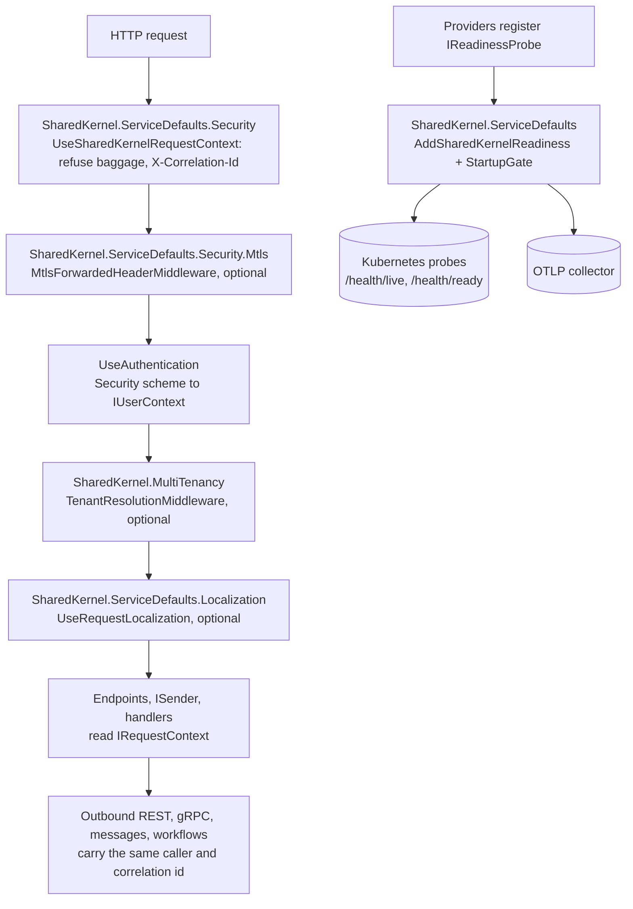

<div align="center">

# SharedKernel ServiceDefaults

**Host composition for .NET services in a few calls: OpenTelemetry, liveness and readiness that never restart a pod
for a database outage, one request context every layer reads, fail-closed tenant resolution, mutual TLS at the
edge, vault-backed configuration and request culture.**

[](https://dotnet.microsoft.com/)
[](../../../LICENSE)


[](https://opentelemetry.io/docs/languages/dotnet/)

[What you get](#what-you-get) · [Packages](#packages) · [How it fits together](#how-it-fits-together) · [Get started](#get-started) · [See it run](#see-it-run) · [Guarantees](#guarantees)

<sub>📂 <code>src/Hosting/ServiceDefaults</code> · <a href="../../../docs/packages.md">all packages by tier</a> · <a href="../../../README.md">Platform.SharedKernel</a></sub>

</div>

---

## What you get

- **One-call observability.** `builder.AddServiceDefaults()` wires traces, metrics and logs over OTLP; each
  `WithXTelemetry()` (`WithMessagingTelemetry()`, `WithCachingTelemetry()`, …) exports one capability's instruments.
- **Readiness without per-dependency wiring.** Every provider registers its own `IReadinessProbe`;
  `AddSharedKernelReadiness()` maps them all onto `/health/ready`, held closed by `StartupGate` until you call `MarkReady()`.
- **One request context.** `UseSharedKernelRequestContext()` gives handlers, persistence, caching, outbound calls and
  logs the same caller, tenant and validated `X-Correlation-Id` through `IRequestContext`.
- **Tenant resolution that fails closed.** `TenantResolutionMiddleware` resolves claim → header → directory, refuses
  suspended tenants through `ITenantStatusValidator`, and reads metadata from a cached `ITenantCatalog`.
- **Untrusted input refused at the edge.** Inbound W3C baggage never reaches logs or downstream calls; a forwarded
  client certificate is honoured only from the proxies listed in `TrustedNetworks`.
- **Opt-in satellites.** Key Vault secrets as configuration, request-culture resolution, database readiness — each in
  its own package, so a service restores only what it uses.

## Packages

| Package | Tier | Reference it from | Use it for |
| --- | --- | --- | --- |
| [SharedKernel.ServiceDefaults](SharedKernel.ServiceDefaults/README.md) | Host | Api·Worker | Always: OpenTelemetry, `/health/live` + `/health/ready`, `StartupGate`, `AddSharedKernelReadiness()`, `AddSharedKernelRateLimiting()` |
| [SharedKernel.ServiceDefaults.Security](SharedKernel.ServiceDefaults.Security/README.md) | Host | Api·Worker | Every HTTP service: `AddSharedKernelRequestContext()` + `app.UseSharedKernelRequestContext()` |
| [SharedKernel.MultiTenancy](SharedKernel.MultiTenancy/README.md) | Host | Api·Worker | The tenant comes from a header or a directory, or suspended tenants must be refused |
| [SharedKernel.ServiceDefaults.Persistence](SharedKernel.ServiceDefaults.Persistence/README.md) | Host | Api·Worker | A PostgreSQL service: `AddDatabaseReadinessCheck<TContext>()`, `AddDapperDatabaseReadinessCheck()` |
| [SharedKernel.ServiceDefaults.Security.Mtls](SharedKernel.ServiceDefaults.Security.Mtls/README.md) | Host | Api·Worker | Client certificates negotiated by Kestrel or forwarded by an ingress |
| [SharedKernel.ServiceDefaults.Configuration.KeyVault](SharedKernel.ServiceDefaults.Configuration.KeyVault/README.md) | Host | Api·Worker | Secrets in Azure Key Vault: `AddSharedKernelKeyVaultConfiguration(vaultUri)` |
| [SharedKernel.ServiceDefaults.Localization](SharedKernel.ServiceDefaults.Localization/README.md) | Host | Api·Worker | Request culture: user preference → tenant default → `Accept-Language` |
| [SharedKernel.ServiceDefaults.Testing](SharedKernel.ServiceDefaults.Testing/README.md) | Testing | test projects | `InMemoryTenantCatalog`, `FakeTenantResolutionStrategy`, `ShouldBeTaggedReady()` / `ShouldNotBeTaggedLive()` |

Every service takes the base and `.Security`; add a satellite when the service has that need. The base references
only `SharedKernel.Primitives` and OpenTelemetry — an integration that needs another kernel package gets a satellite.

## How it fits together



- **Order is fixed.** `AddServiceDefaults()` is the first builder call and `UseSharedKernelRequestContext()` the first
  middleware, so every response — errors included — carries the correlation id. With
  [Presentation](../Presentation/README.md)'s `UseSharedKernelWebApi()`, the optional middleware goes into its
  `AtStart` and `BeforeAuthorization` hooks.
- **The tenant is replaced, nothing else.** `TenantResolutionMiddleware` runs after authentication and swaps only the
  tenant on `IRequestContext`; a signed claim outranks an unsigned header by default.
- **Readiness, not liveness.** Dependency probes are tagged `ready`, never `live`: an outage takes the pod out of
  rotation without a restart. Probe registration order does not matter.

## Get started

```xml
<PackageReference Include="SharedKernel.ServiceDefaults" />
<PackageReference Include="SharedKernel.ServiceDefaults.Security" />
```

```csharp
using SharedKernel.ServiceDefaults.Extensions;
using SharedKernel.ServiceDefaults.HealthChecks;
using SharedKernel.ServiceDefaults.Probes;
using SharedKernel.ServiceDefaults.Security;
using SharedKernel.ServiceDefaults.Telemetry;

builder.AddServiceDefaults();                                  // FIRST: OpenTelemetry + the "startup" check
builder.WithApplicationTelemetry();                            // only the capabilities this service uses
builder.Services.AddSharedKernelRequestContext();              // IRequestContext over IUserContext
builder.Services.AddHealthChecks().AddSharedKernelReadiness(); // one "ready" check per IReadinessProbe

var app = builder.Build();
app.UseSharedKernelRequestContext();                           // FIRST middleware
app.MapDefaultHealthCheckEndpoints();                          // /health/live, /health/ready

app.Services.GetRequiredService<StartupGate>().MarkReady();    // once migrations and warm-up are done
app.Run();
```

Authentication comes from [Security](../Security/README.md); the full composition, telemetry list and rate limiting
are in the [SharedKernel.ServiceDefaults Quick start](SharedKernel.ServiceDefaults/README.md#quick-start).

## See it run

- [samples/OrderApi](../../../samples/OrderApi/README.md) — the compiled reference: `AddServiceDefaults()`,
  `UseSharedKernelRequestContext()` first, `AddSharedKernelReadiness()` over its own `order-store` probe, and
  `StartupGate.MarkReady()`.
- [samples/Shop](../../../samples/Shop/README.md) — Inventory resolves tenants with `.MultiTenancy` (including a
  service-only header strategy) and accepts Ordering's certificates through `.Security.Mtls`; Catalog adds
  `.Localization`. Run with `dotnet run --project samples/Shop/Shop.AppHost --launch-profile http` after
  `samples/Shop/build.sh`; the Aspire dashboard shows the traces across services.
- [samples/BillingApi](../../../samples/BillingApi/README.md) — database readiness with `.Persistence`.

## Guarantees

| Guarantee | How it is held |
| --- | --- |
| The base package stays light: `SharedKernel.Primitives` and OpenTelemetry only | `CompositionBaseIsolationTests` |
| Dependency checks are `ready`, never `live` — an outage never restarts a pod | Architecture rules `DependencyHealthChecksCarryReadyNotLive`, `NoConflictingLivenessReadinessTags` |
| `/health/ready` stays unhealthy until `StartupGate.MarkReady()` | `StartupGateHealthCheckTests` (`CheckHealthAsync_BeforeMarkReady_ReportsUnhealthy`) |
| A caller cannot plant identity: inbound baggage is refused, only platform keys reach log records | `RequestBaggageRefusingPropagatorTests`, `InboundBaggageTests`, `AmbientLoggingEnrichmentAcceptanceTests` |
| A signed claim outranks an unsigned header; an unknown or inactive tenant resolves to `null` | `TenantResolutionOptionsTests.DefaultStrategyOrder_IsClaimHeaderDatabase`, `TenantResolutionMiddlewareTests`, `CatalogTenantStatusValidatorTests` |
| A typo in `StrategyOrder` stops the host instead of resolving nothing | `MultiTenancyRealHostStartupTests.RealHost_StrategyOrderNamesUnregisteredStrategy_…` |
| With `TrustedNetworks` set, a certificate header from any other address is ignored before it is decoded; left empty, the host logs a warning | `MtlsForwardedHeaderMiddlewareTests` (`…RemoteIpOutsideAllowlist_RejectsBeforeDecode…`), `ServiceDefaultsLogWiringTests` |

Health endpoints are unauthenticated by default, because Kubernetes probes cannot present credentials: keep
`/health/ready` off public ingress or pass `requireAuthorization: true`.

---

<div align="center">
<sub>Part of <a href="../../../README.md">Platform.SharedKernel</a> · <a href="../../../docs/packages.md">all packages</a> · MIT license</sub>
</div>
