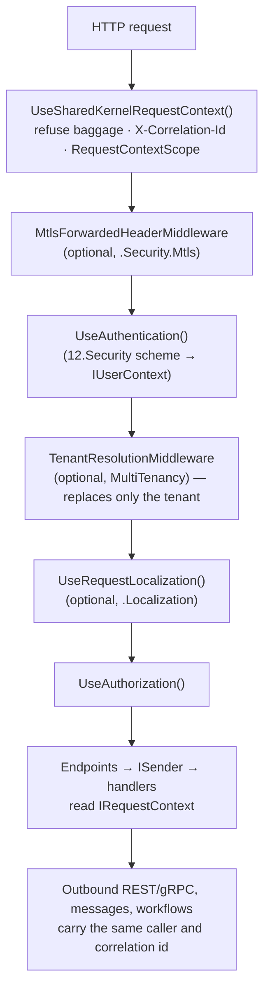

<div align="center">

# SharedKernel ServiceDefaults

**Host composition for .NET services: OpenTelemetry, health endpoints and readiness, the request context every layer
reads, tenant resolution, mutual TLS, vault-backed configuration and request culture — each one call in `Program.cs`.**

[](https://dotnet.microsoft.com/)
[](../../../LICENSE)


<sub>📂 <code>src/Hosting/ServiceDefaults</code> · domain <code>13.ServiceDefaults</code> · <a href="../../../docs/packages.md">all packages by tier</a></sub>

</div>

Every package here is **Host tier**: a service's Api or Worker project references it; nothing below the host does.
The base package references only `SharedKernel.Primitives` and OpenTelemetry, so a service restores nothing it does
not use — each integration that needs another kernel package lives in a `SharedKernel.ServiceDefaults.*` satellite.

## What this domain gives you

- **One-call observability** — `builder.AddServiceDefaults()` wires traces, metrics and logs over OTLP; each
  `WithXTelemetry()` adds one kernel domain's instruments.
- **Readiness without per-dependency wiring** — every provider registers its own `IReadinessProbe`;
  `AddSharedKernelReadiness()` maps them all onto `/health/ready`, gated by a `StartupGate`.
- **One request context** — `UseSharedKernelRequestContext()` gives every layer (handlers, persistence, caching,
  outbound calls, logs) the same caller, tenant and correlation id through `IRequestContext`.
- **Tenant resolution that fails closed** — claim → header → directory, a status check for suspended tenants, and a
  read-only tenant catalog.
- **Untrusted input refused at the edge** — caller baggage never reaches logs or downstream calls; a forwarded client
  certificate is only accepted from trusted proxies.
- **Opt-in satellites** — Key Vault secrets as configuration, request-culture resolution, database readiness.

## Packages

| Package | Tier | When you need it |
| --- | --- | --- |
| [`SharedKernel.ServiceDefaults`](SharedKernel.ServiceDefaults/README.md) | Host | Always — OpenTelemetry, `/health/live` + `/health/ready`, `StartupGate`, `AddSharedKernelReadiness()`, `AddSharedKernelRateLimiting()` |
| [`SharedKernel.ServiceDefaults.Security`](SharedKernel.ServiceDefaults.Security/README.md) | Host | Always for an HTTP service — `AddSharedKernelRequestContext()` + `app.UseSharedKernelRequestContext()` |
| [`SharedKernel.MultiTenancy`](SharedKernel.MultiTenancy/README.md) | Host | The tenant can come from a header or a directory, or suspended tenants must be refused |
| [`SharedKernel.ServiceDefaults.Persistence`](SharedKernel.ServiceDefaults.Persistence/README.md) | Host | The service has a PostgreSQL database — `AddDatabaseReadinessCheck<TContext>()` and friends |
| [`SharedKernel.ServiceDefaults.Security.Mtls`](SharedKernel.ServiceDefaults.Security.Mtls/README.md) | Host | Callers present client certificates, at Kestrel or through an ingress |
| [`SharedKernel.ServiceDefaults.Configuration.KeyVault`](SharedKernel.ServiceDefaults.Configuration.KeyVault/README.md) | Host | Secrets live in Azure Key Vault — `AddSharedKernelKeyVaultConfiguration(vaultUri)` |
| [`SharedKernel.ServiceDefaults.Localization`](SharedKernel.ServiceDefaults.Localization/README.md) | Host | Responses are localized — user preference → tenant default → `Accept-Language` |

Test doubles: [`SharedKernel.ServiceDefaults.Testing`](./SharedKernel.ServiceDefaults.Testing/README.md)
(`FakeTenantResolutionStrategy`, `InMemoryTenantCatalog`, health-check tag assertions).

## How a request is composed



With `14.Presentation`'s `UseSharedKernelWebApi()`, authentication, rate limiting and authorization are added for you;
the optional middleware goes into its `AtStart` and `BeforeAuthorization` hooks.

## Get started

```xml
<PackageReference Include="SharedKernel.ServiceDefaults" />
<PackageReference Include="SharedKernel.ServiceDefaults.Security" />
```

```csharp
using SharedKernel.Presentation.WebApi;
using SharedKernel.Security.Oidc.Extensions;
using SharedKernel.ServiceDefaults.Extensions;
using SharedKernel.ServiceDefaults.HealthChecks;
using SharedKernel.ServiceDefaults.Probes;
using SharedKernel.ServiceDefaults.Security;
using SharedKernel.ServiceDefaults.Telemetry;

var builder = WebApplication.CreateBuilder(args);

builder.AddServiceDefaults();                               // FIRST: OpenTelemetry + the "startup" check
builder.WithApplicationTelemetry();                         // only the domains this service uses
builder.Services.AddOidcAuthentication(builder.Configuration);   // 12.Security: registers IUserContext
builder.Services.AddSharedKernelRequestContext();           // IRequestContext over IUserContext
builder.Services.AddHealthChecks().AddSharedKernelReadiness();   // every provider's readiness probe
builder.AddSharedKernelWebApi();                            // 14.Presentation

var app = builder.Build();

app.UseSharedKernelRequestContext();                        // FIRST middleware
app.UseSharedKernelWebApi();
app.MapDefaultHealthCheckEndpoints();                       // /health/live, /health/ready
app.MapEndpoints();

app.Services.GetRequiredService<StartupGate>().MarkReady(); // once start-up work is done
await app.RunAsync();
```

Ordering rules:

1. **`builder.AddServiceDefaults()` is the first call.** Chain checks onto `builder.Services.AddHealthChecks()`; a
   second `AddSharedKernelHealthChecks()` registers `startup` twice and the host throws.
2. **`app.UseSharedKernelRequestContext()` is the first middleware**, so every later middleware and every response —
   errors included — carries the correlation id. It is safe before authentication: the caller is read lazily.
3. **`TenantResolutionMiddleware` runs after authentication** — the claim strategy needs the user.
4. **`MtlsForwardedHeaderMiddleware` runs before authentication and before `UseForwardedHeaders()`.**
5. **Readiness probe registration order does not matter** — probes are read when health checks are first resolved.

## The sample

[`samples/OrderApi`](../../../samples/OrderApi//) is the compiled reference: `OrderApi.Api/Program.cs` calls
`AddServiceDefaults()`, `AddSharedKernelRequestContext()`, `AddSharedKernelReadiness()` (its infrastructure registers
an `order-store` probe), `UseSharedKernelRequestContext()` first, `MapDefaultHealthCheckEndpoints()` and
`StartupGate.MarkReady()`. Its tests swap in a test authentication scheme to prove the 401/403/204 answers.

## Guarantees

- **The base stays light.** `SharedKernel.ServiceDefaults` references `SharedKernel.Primitives` only
  (`CompositionBaseIsolationTests`); every `WithXTelemetry()` wires instruments by name and adds no dependency.
- **Readiness never restarts pods.** Dependency checks are tagged `ready`, never `live`.
- **`/health/ready` stays closed until you say so** — `StartupGate.MarkReady()` opens it.
- **A caller cannot plant identity.** Inbound W3C baggage is refused; only `correlation.id` and `TenantId`, written by
  platform middleware, reach log records.
- **Tenancy fails closed.** No resolved tenant, or an inactive one, is `null`; a signed claim outranks an unsigned
  header by default, locked by an architecture test.
- **Misconfiguration stops the host.** An unknown tenant strategy, an empty mTLS header name or an unreachable Key
  Vault fails at startup, not on the first request.
- **Health endpoints are unauthenticated by default** (Kubernetes probes cannot present credentials) — keep
  `/health/ready` off public ingress or pass `requireAuthorization: true`.
- **Structured logs.** EventIds 13000–13999 (13000–13007 composition and request context, 13100–13101 tenancy).

---

For maintainers: rules in [`CLAUDE.md`](CLAUDE.md), phase history in [`state-map.md`](state-map.md).
