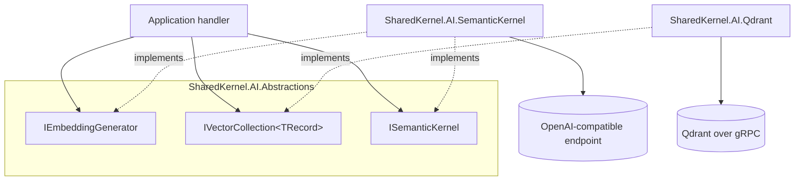

<div align="center">

# SharedKernel AI

**Embeddings, tenant-scoped vector retrieval and LLM chat completion for multi-tenant .NET services — one neutral
contract over Qdrant and Semantic Kernel, where every vector is bound to the model that produced it, every call
reports what it cost, and a provider swap is a build error instead of a production surprise.**

[](https://dotnet.microsoft.com/)
[](../../../LICENSE)


[](https://github.com/qdrant/qdrant-dotnet)
[](https://github.com/microsoft/semantic-kernel)

[What you get](#what-you-get) · [Packages](#packages) · [How it fits together](#how-it-fits-together) · [Get started](#get-started) · [See it run](#see-it-run) · [Guarantees](#guarantees)

<sub>📂 <code>src/Infrastructure/AI</code> · <a href="../../../docs/packages.md">all packages by tier</a> · <a href="../../../README.md">Platform.SharedKernel</a></sub>

</div>

---

## What you get

- **Embeddings with identity.** `IEmbeddingGenerator` returns a vector with its model id, dimension and `TokenUsage`;
  a vector collection refuses a vector from any other model before a single byte is sent.
- **Tenant-safe vector collections.** `IVectorCollection<TRecord>` upserts, deletes, queries, counts and scrolls with
  a mandatory `TenantScope` on every call, applied by the provider as the outermost filter.
- **Portable metadata filters.** A closed eight-node `VectorFilter` that every provider must translate completely,
  never approximately.
- **Chat completion without hidden behaviour.** `ISemanticKernel` returns token usage and finish reason, hands tool
  calls back to you, and never retries or caches unless you opt in.
- **Zero-downtime re-embedding and readiness.** Provision a new collection, fill it, `CutoverAsync` swaps it in; each
  collection gets a `vector-store-{provider}-{collection}` readiness probe.

## Packages

| Package | Tier | Reference it from | Use it for |
| --- | --- | --- | --- |
| [SharedKernel.AI.Abstractions](SharedKernel.AI.Abstractions/README.md) | Abstractions | Application | `IEmbeddingGenerator`, `IVectorCollection<TRecord>`, `IVectorCollectionProvisioner`, `ISemanticKernel`, `VectorFilter`. No third-party dependency |
| [SharedKernel.AI.Qdrant](SharedKernel.AI.Qdrant/README.md) | Adapter | Infrastructure | Storing and searching vectors in Qdrant (v1.16+, gRPC); hybrid dense + sparse queries and quantization profiles as Qdrant-only extras |
| [SharedKernel.AI.SemanticKernel](SharedKernel.AI.SemanticKernel/README.md) | Adapter | Infrastructure | Embeddings and chat completions against an OpenAI-compatible endpoint; opt-in `WithBoundedRetry` |
| [SharedKernel.AI.Testing](SharedKernel.AI.Testing/README.md) | Testing | test projects | In-memory doubles of every neutral contract: a deterministic embedding generator, a vector collection with the same model and tenant checks, a scripted `InMemorySemanticKernel` |

Start with Abstractions in the Application project; add Qdrant to store vectors and SemanticKernel to produce
embeddings or completions — they are independent, so a service can take either one. `SharedKernel.ServiceDefaults`
maps the probes (`AddSharedKernelReadiness()`) and exports telemetry (`WithIntelligenceTelemetry()`).

## How it fits together



- **Model identity is checked first.** Writes and queries are compared with the collection's embedding model,
  dimension and distance metric before any I/O; a mismatch is `intelligence.embedding_model_mismatch` or
  `intelligence.dimension_mismatch`, not confidently wrong neighbours.
- **The tenant is never part of the query.** A tenant-declaring collection called with `TenantScope.Global` fails
  `intelligence.tenant_scope_missing` and sends nothing; writes stamp the tenant, reads filter by it outermost.
- **The kernel never runs your tools.** Tool calls come back as `CompletionFinishReason.ToolCallsRequested`; no
  completion is cached, and the only retry (`.WithBoundedRetry(...)`) is for HTTP 429/5xx on non-streaming calls.
- **The providers never reference each other.** Provider-only contracts (`IQdrantHybridQueryAccessor<TRecord>`,
  `IKernelPluginAccessor`) live in their package, so removing a provider fails the build at every non-portable call.

## Get started

```xml
<PackageReference Include="SharedKernel.AI.Abstractions" />     <!-- Application -->
<PackageReference Include="SharedKernel.AI.Qdrant" />           <!-- Infrastructure -->
<PackageReference Include="SharedKernel.AI.SemanticKernel" />   <!-- Infrastructure -->
```

```csharp
builder.Services.AddClock();

builder.Services.AddSharedKernelSemanticKernel(builder.Configuration).Build();   // Intelligence:SemanticKernel

builder.Services
    .AddSharedKernelQdrant(builder.Configuration)                                // Intelligence:Qdrant
    .AddCollection<ProductChunk>(ProductChunkCollection.Name, ProductChunkCollection.Configure)
    .Build();

builder.Services.AddHealthChecks().AddSharedKernelReadiness();   // vector-store-qdrant-product-chunks

// In a handler: embed the question, then query within the caller's tenant
var embedded = await embeddings.EmbedAsync(question, ct);
if (embedded.IsFailure) return Result<VectorQueryResults<ProductChunk>>.Failure(embedded.Error);

var query = new VectorQuery
{
    Vector = embedded.Value.Vector,
    ModelId = embedded.Value.ModelId,          // checked against the collection before any I/O
    Filter = VectorFilter.Eq("status", "active"),
    Limit = 5,
};
return await chunks.QueryAsync(query, TenantScope.For(tenantId), ct);
```

`ProductChunk` is your record implementing `IVectorRecord`; create its collection once with
`IVectorCollectionProvisioner.EnsureCollectionAsync` (registration never touches the server). The full setup is in the
[SharedKernel.AI.Qdrant Quick start](SharedKernel.AI.Qdrant/README.md#quick-start) and the
[SharedKernel.AI.SemanticKernel Quick start](SharedKernel.AI.SemanticKernel/README.md#quick-start).

## See it run

- [**samples/Shop**](../../../samples/Shop/README.md) — the Catalog service embeds products through Semantic Kernel
  against Ollama's OpenAI-compatible endpoint (`all-minilm`, `qwen2.5:0.5b`), stores them in Qdrant for semantic search, and
  drafts product descriptions with the chat model, all under the caller's tenant:

  ```bash
  samples/Shop/build.sh                      # pack the kernel, build the Shop
  dotnet run --project samples/Shop/Shop.AppHost --launch-profile http
  ```

- [`consumer-verify/Qdrant`](consumer-verify/Qdrant/Program.cs) and
  [`consumer-verify/SemanticKernel`](consumer-verify/SemanticKernel/Program.cs) are the smallest complete hosts: each
  resolves every contract from the packed packages and proves missing configuration fails at startup, no server needed.

## Guarantees

| Guarantee | How it is held |
| --- | --- |
| **A vector is bound to its model** | `QdrantVectorCollectionNoIoTests`: model and dimension mismatches fail on upsert and query with no I/O |
| **No call without a tenant decision** | `ContractShapeTests`: every read and filtered write takes a non-optional `TenantScope`, and `VectorQuery` has no tenant member |
| **No cross-tenant results** | `QdrantVectorCollectionConformanceTests` (real Qdrant): an identical vector owned by another tenant is never returned; `GetAsync` with the wrong tenant is `record_not_found` |
| **Cost is visible** | `SemanticKernelEmbeddingGeneratorTokenUsageTests`: token usage is the provider's reported figure, on every embedding |
| **No hidden retries, caching or tool runs** | `SemanticKernelOrchestratorTests` and `SemanticKernelOrchestratorStreamingTests`: one dispatch by default, validation never retried, identical requests never cached; `ISemanticKernel` has no invoke-tool member |
| **Misconfiguration fails at startup** | `QdrantOptionsTests` and `SemanticKernelOptionsTests`: a missing required option (`Host`, …) fails validation naming the property |
| **Provider-neutral contracts** | `IntelligenceTopologyRules`: Abstractions takes no third-party package, the providers never reference each other, no health-checks dependency; analyzers `SK0026` (raw `QdrantClient`/`Kernel` injection) and `SK0027` (literal identifiers) |

**Out of scope:** tool execution and agent loops, completion caching, prompt sanitisation, corpus re-embedding, and an
LLM readiness probe (the only honest check would be a real, billed completion).

---

<div align="center">
<sub>Part of <a href="../../../README.md">Platform.SharedKernel</a> · <a href="../../../docs/packages.md">all packages</a> · MIT license</sub>
</div>
