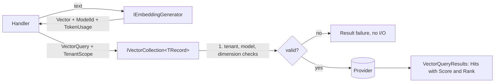

# SharedKernel.AI.Abstractions

[](https://dotnet.microsoft.com/)
[](https://github.com/Gresta-Vertex-Labs/platform-shared-kernel/blob/main/LICENSE)


> **The contracts your application code uses for embeddings, tenant-scoped vector retrieval and chat completion.
> Every vector is checked against the model that produced it, every call reports its token cost, and switching
> providers never touches a handler.** Reference this package from your Application project; register a provider
> in Infrastructure: `SharedKernel.AI.Qdrant` for vector collections, `SharedKernel.AI.SemanticKernel` for embeddings
> and chat completion.

| You get | So that |
| --- | --- |
| `IEmbeddingGenerator` (`EmbedAsync`, `EmbedManyAsync`) | Text becomes a vector that carries its `ModelId`, `Dimension` and `TokenUsage` |
| `IVectorCollection<TRecord>` with a mandatory `TenantScope` on every call | Upsert, delete, query, get, count and scroll can never leak across tenants by accident |
| Model, dimension and tenant checks before any I/O | A query embedded with the wrong model fails with a clear error. It never returns quietly wrong neighbours |
| A closed 8-node `VectorFilter` over a five-kind `VectorValue` | Metadata filters mean the same thing on every provider. Nothing is dropped or approximated |
| `VectorCollectionDefinition` with a `Fingerprint` | The embedding model, dimension, metric and fields are declared once and drift is detectable |
| `ISemanticKernel` (`CompleteAsync`, `CompleteStreamingAsync`) | Chat completion with tool *requests*, token usage and no hidden retries, caching or tool execution |
| `IntelligenceErrors` + `Result` everywhere | Expected failures are values with stable `intelligence.*` codes |
| `VectorCollectionReadinessProbe` | Every provider reports collection health the same way on `/health/ready` |

## Contents

- [Install](#install)
- [Quick start](#quick-start)
- [How it works](#how-it-works)
- [Recipes](#recipes)
- [Reference](#reference)
- [Testing](#testing)
- [Pitfalls](#pitfalls)
- [Design decisions](#design-decisions)

## Install

```xml
<PackageReference Include="SharedKernel.AI.Abstractions" />
```

The version comes from your central `SharedKernelVersion` property. Every SharedKernel package ships at the same
version. See [Using the packages](https://github.com/Gresta-Vertex-Labs/platform-shared-kernel#using-the-packages).

| Requirement | Value |
| --- | --- |
| Target framework | `net10.0` |
| Tier | Abstractions: reference it from your **Application** project |
| Depends on | `SharedKernel.Primitives`, `SharedKernel.Execution` (no third-party packages) |
| Namespaces | `SharedKernel.AI.Abstractions.Abstractions` (contracts, requests, results), `.Models` (records, filters, definitions), `.Errors`, `.Constants`, `.Exceptions` |
| Implemented by | [`SharedKernel.AI.Qdrant`](https://github.com/Gresta-Vertex-Labs/platform-shared-kernel/blob/main/src/Infrastructure/AI/SharedKernel.AI.Qdrant/README.md) (vectors), [`SharedKernel.AI.SemanticKernel`](https://github.com/Gresta-Vertex-Labs/platform-shared-kernel/blob/main/src/Infrastructure/AI/SharedKernel.AI.SemanticKernel/README.md) (embeddings, completions) |

This package has no DI extensions and no implementation. The host registers a provider.

## Quick start

A record type implements `IVectorRecord`:

```csharp
using SharedKernel.AI.Abstractions.Models;

public sealed record ProductChunk(
    string Id,                                        // Qdrant: an unsigned integer string or a GUID
    ReadOnlyMemory<float> Vector,
    string ModelId,
    IReadOnlyDictionary<string, VectorValue> Metadata) : IVectorRecord;
```

A handler embeds the question and queries the collection for the caller's tenant:

```csharp
using SharedKernel.AI.Abstractions.Abstractions;
using SharedKernel.AI.Abstractions.Models;
using SharedKernel.Execution.Tenancy;
using SharedKernel.Primitives.Results;

public sealed class ProductRetrieval(IEmbeddingGenerator embeddings, IVectorCollection<ProductChunk> chunks)
{
    public async Task<Result<VectorQueryResults<ProductChunk>>> FindAsync(
        TenantId tenantId, string question, CancellationToken ct)
    {
        var embedded = await embeddings.EmbedAsync(question, ct);
        if (embedded.IsFailure)
        {
            return Result<VectorQueryResults<ProductChunk>>.Failure(embedded.Error);
        }

        var query = new VectorQuery
        {
            Vector = embedded.Value.Vector,
            ModelId = embedded.Value.ModelId,         // checked against the collection before any I/O
            Filter = VectorFilter.Eq("status", "active"),
            Limit = 5,
        };

        return await chunks.QueryAsync(query, TenantScope.For(tenantId), ct);
    }
}
```

## How it works



- **Model identity.** A collection declares `EmbeddingModelId`, `Dimension` and `DistanceMetric` once. Every write
  compares `IVectorRecord.ModelId` and `Vector.Length` with it, and every query compares `VectorQuery.ModelId` and
  `Vector.Length`, before any network call. No vector engine can detect a same-dimension, different-model mix on its
  own.
- **Tenancy.** `TenantScope` (`SharedKernel.Execution.Tenancy`) is a separate parameter on every collection method,
  never part of `VectorQuery` or of your `VectorFilter`. The provider adds it as the outermost `AND` and stores the
  tenant as the `TenantId` `"D"` string. A collection that declares a `TenantField` rejects `TenantScope.Global` with
  `intelligence.tenant_scope_missing` and sends nothing.
- **Failures.** Every method returns `Result`/`Result<T>`, except the two streams: `ScrollAsync` and
  `CompleteStreamingAsync` return `IAsyncEnumerable<T>` and throw `IntelligenceStreamException` (carrying the
  `Error`) mid-stream.
- **Cost.** `TokenUsage` (`PromptTokens`, `CompletionTokens`, `TotalTokens`) is on every `EmbeddingResult`,
  `EmbeddingBatchResult` and `CompletionResult`. A streamed completion carries it on `CompletionChunk.TokenUsage`, which providers usually
  fill only once the stream completes.
- **Scores.** `VectorHit<TRecord>.Score` is provider- and metric-specific: cosine is bounded, dot product is not,
  Euclidean is smaller-is-better. `Rank` (0-based position in the page) is the portable ordering.
- **Writes.** `UpsertAsync`/`DeleteAsync` return a `VectorWriteReceipt`; the `…ManyAsync` variants return a
  `VectorBulkReceipt` with per-item `Failures`. `WaitUntilQueryableAsync(receipt, timeout)` is the explicit
  read-your-write barrier.

## Recipes

### 1. Declare a collection definition

```csharp
using SharedKernel.AI.Abstractions.Models;

Result<VectorCollectionDefinition> definition = new VectorCollectionDefinitionBuilder("product-chunks")
    .EmbeddingModel("text-embedding-3-small", dimension: 1536)
    .DistanceMetric(VectorDistanceMetric.Cosine)
    .Field("tenantId", VectorFieldKind.String, filterable: true)
    .Field("status", VectorFieldKind.String, filterable: true)
    .TenantField("tenantId")                          // must name a field declared filterable
    .Build();
```

`Build()` returns `intelligence.invalid_collection_definition` when `EmbeddingModel` or `DistanceMetric` was not
called, or when the tenant field is not a filterable field. `VectorCollectionDefinition.Create(name, modelId,
dimension, metric, fields)` is the non-fluent equivalent.

### 2. Build a filter

```csharp
var filter = VectorFilter.All(
    VectorFilter.Eq("status", "active"),
    VectorFilter.In("category", "books", "music"),
    VectorFilter.Between("price", 10.0, 50.0),
    VectorFilter.Negate(VectorFilter.Exists("archivedAt")));
```

`VectorValue` converts implicitly from `string`, `int`, `long`, `double`, `bool`, `DateTimeOffset` and `Guid`
(stored as the `"D"` string). `Between` takes nullable, inclusive-by-default bounds and throws `ArgumentException` for string
or boolean bounds.

### 3. Handle a tool call

```csharp
var request = new CompletionRequest
{
    Messages = [new ChatMessage { Role = ChatRole.User, Content = question }],
    Tools = [new ToolDefinition { Name = "get_order", Description = "Looks up an order.", ParametersJsonSchema = schemaJson }],
};

var result = await kernel.CompleteAsync(request, ct);
if (result.IsSuccess && result.Value.FinishReason == CompletionFinishReason.ToolCallsRequested)
{
    var messages = request.Messages.Append(result.Value.Message).ToList();
    foreach (var call in result.Value.ToolCalls)
    {
        var output = await RunToolAsync(call.Name, call.ArgumentsJson, ct);   // your code
        messages.Add(new ToolCallResult { CallId = call.CallId, ResultJson = output }.ToMessage());
    }

    result = await kernel.CompleteAsync(request with { Messages = messages }, ct);
}
```

### 4. Check a prompt against the context window

Inject `ICompletionProviderDescriptor` and call `ValidateContextWindow(estimatedTokens)` with your own token
estimate before sending. It returns `intelligence.context_window_exceeded` when the estimate exceeds
`ContextWindowTokens`. `CompleteAsync` does not estimate for you.

### 5. Re-embed into a new collection without downtime

Provision the new collection with `IVectorCollectionProvisioner.EnsureCollectionAsync`, fill it, then call
`CutoverAsync(new VectorCollectionCutoverRequest { StagingCollectionName = "product-chunks-v2", LiveCollectionName =
"product-chunks" })`. `DeleteStagingAfterCutover` (default `true`) controls whether the collection that served
before is deleted. Re-embedding the corpus is your job.

## Reference

### Contracts

| Type | Members |
| --- | --- |
| `IEmbeddingGenerator` | `ModelId`, `Dimension`, `EmbedAsync(text)` → `Result<EmbeddingResult>`, `EmbedManyAsync(texts)` → `Result<EmbeddingBatchResult>` |
| `IVectorCollection<TRecord>` | `CollectionName`; writes `UpsertAsync`, `UpsertManyAsync`, `DeleteAsync`, `DeleteManyAsync`, `DeleteByFilterAsync`, `WaitUntilQueryableAsync`; reads `QueryAsync`, `GetAsync`, `CountAsync`; stream `ScrollAsync(filter, tenantScope, batchSize)` |
| `IVectorCollectionProvisioner` | `EnsureCollectionAsync`, `CollectionExistsAsync`, `DeleteCollectionAsync`, `CutoverAsync` |
| `IVectorProviderDescriptor` | `ProviderName`, `MaxBatchSize`, `MaxVectorDimension`, `MaxFilterDepth`, `RegisteredCollections`, `Validate(collectionName, query)` (zero I/O) |
| `ISemanticKernel` | `CompleteAsync(CompletionRequest)` → `Result<CompletionResult>`, `CompleteStreamingAsync` → `IAsyncEnumerable<CompletionChunk>` |
| `ICompletionProviderDescriptor` | `ProviderName`, `ContextWindowTokens`, `MaxOutputTokens`, `ValidateContextWindow(estimatedTokens)` |
| `IVectorRecord` | `Id`, `Vector`, `ModelId`, `Metadata` (`IReadOnlyDictionary<string, VectorValue>`) |

`VectorQuery`: `Vector`, `ModelId` (required), `Filter`, `Limit` (default `IntelligenceWellKnown.DefaultQueryLimit`
= 10), `MinScore`, `ReturnMetadata` (default `true`), `ReturnVector` (default `false`). `CompletionRequest`:
`Messages` (required), `ModelId` (provider default when `null`), `Temperature`, `MaxOutputTokens`, `Tools`,
`StopSequences`. `CompletionFinishReason`: `Stop`, `MaxTokensReached`, `ToolCallsRequested`, `ContentFiltered`.

### Errors

All from `IntelligenceErrors` (`SharedKernel.AI.Abstractions.Errors`).

| Code | Type |
| --- | --- |
| `intelligence.collection_not_found`, `.record_not_found`, `.model_not_found` | NotFound |
| `intelligence.invalid_query`, `.invalid_filter`, `.invalid_collection_definition`, `.invalid_record_id`, `.field_not_filterable`, `.embedding_model_mismatch`, `.dimension_mismatch`, `.distance_metric_mismatch`, `.batch_size_exceeded`, `.filter_depth_exceeded`, `.context_window_exceeded`, `.unsupported_capability` | Validation |
| `intelligence.collection_already_exists`, `.collection_definition_conflict`, `.cutover_failed`, `.schema_fingerprint_mismatch` | Conflict |
| `intelligence.unauthorized`, `.tenant_scope_missing` | Unauthorized |
| `intelligence.unreachable`, `.timeout`, `.write_rejected`, `.write_timeout`, `.bulk_partially_failed`, `.probe_failed`, `.engine_version_unsupported`, `.engine_fault`, `.rate_limited`, `.completion_failed` | Unexpected |

### Constants

`IntelligenceWellKnown`: `DefaultQueryLimit` (10), `MaxQueryLimit` (1000), `ActivitySourceName` and `MeterName`
(`SharedKernel.AI`), `QdrantProviderName` (`qdrant`), `SemanticKernelProviderName` (`semantickernel`), tag keys
`ai.provider`, `ai.collection`, `ai.model`.

### Logging

None. This package declares contracts only; the providers log in the `10000–10999` EventId block.

### Health

`VectorCollectionReadinessProbe` is the `IReadinessProbe` each vector provider registers per collection, named
`vector-store-{provider}-{collection}` (`VectorCollectionReadinessProbe.ProbeNameFor`). It is ready when the store
is reachable and the collection is addressable and queryable; a write backlog never fails it. `ReadinessReport.Data`
carries `Provider`, `Collection`, `Reachable`, `CollectionAddressable`, `Queryable`, `VectorCount`,
`PendingWriteCount`, `EngineVersion`, `SchemaFingerprint` or `ErrorCode` (the `*Key` constants). The host maps the
probes with `services.AddHealthChecks().AddSharedKernelReadiness()`. There is no LLM probe.

## Testing

Reference [`SharedKernel.AI.Testing`](https://github.com/Gresta-Vertex-Labs/platform-shared-kernel/blob/main/src/Infrastructure/AI/SharedKernel.AI.Testing/README.md)
from your test project (namespace `SharedKernel.Testing.Intelligence`):

```csharp
services.AddInMemoryEmbeddingGenerator("text-embedding-3-small", dimension: 1536);
services.AddInMemoryVectorCollection<ProductChunk>(definition);
services.AddInMemoryVectorProvisioning();
services.AddInMemorySemanticKernel();
```

`InMemoryEmbeddingGenerator` derives vectors from a hash of the text, so the same input always gives the same
vector. `InMemoryVectorCollection<TRecord>` applies the same model, dimension and tenant checks as a real provider.
`InMemorySemanticKernel` returns scripted responses (`EnqueueResponse`, `EnqueueStreamingResponse`,
`EnqueueStreamingFailure`) and records `SentRequests`. Never assert on generated text.

## Pitfalls

| Don't | Do | Why |
| --- | --- | --- |
| Put the tenant in your `VectorFilter` | Pass `TenantScope.For(tenantId)` | A tenant clause in the business filter can be lost by a translation bug; the separate parameter cannot |
| Pass `TenantScope.Global` to a tenant-declaring collection | Use `TenantScope.Global` only for collections without a `TenantField` | It fails with `intelligence.tenant_scope_missing` |
| Build a `VectorQuery` with a hard-coded `ModelId` | Copy `ModelId` from the `EmbeddingResult` | A model upgrade then fails loudly instead of returning wrong neighbours |
| Persist `Score` or compare it across providers or metrics | Use `Rank`, or threshold per metric | The scale differs per metric and direction differs for Euclidean |
| Expect `CompleteAsync` to run your tools | Execute `ToolCalls` yourself and send a follow-up request | The kernel never invokes a tool |
| Log `ChatMessage.Content`, completion text or metadata values | Log ids, model ids, token counts and error codes | Prompts and retrieved content can contain personal data |
| Inject `QdrantClient`, `Kernel` or an `OpenAIClient` in application code | Inject the contracts in this package | A provider swap stays a composition-root change (analyzer `SK0026`) |

## Design decisions

**Why no retry, cache or agent loop on `ISemanticKernel`?** A retried completion is billed again and can return a
different answer. A cache would serve an answer the caller did not ask for. Running tools needs business logic this
layer must not know. The only retry is the explicit `.WithBoundedRetry(...)` in `SharedKernel.AI.SemanticKernel`.

**Why is `Score` exposed?** Retrieval-augmented generation often needs a similarity threshold. The scale caveat is
documented on `VectorHit<TRecord>.Score` and `VectorQuery.MinScore` instead of hiding the value.

**Why no write-consistency parameter?** Vector engines do not share a visibility model, so an enum would be honest on
one engine and meaningless on another. `WaitUntilQueryableAsync` is the explicit barrier.

**Why not `Microsoft.Extensions.AI.Abstractions`?** The Abstractions tier takes no third-party package, and it has no
vector-store concept and no binding of a vector to its model, dimension and metric.

**Why do provider-only features live in the provider packages?** Hybrid search, quantization and Semantic Kernel
plugins exist on one provider only. Declaring them there makes a provider swap a compile error at every
non-portable call site.

---

Part of [Platform.SharedKernel](https://github.com/Gresta-Vertex-Labs/platform-shared-kernel) ·
[AI packages](https://github.com/Gresta-Vertex-Labs/platform-shared-kernel/blob/main/src/Infrastructure/AI/README.md) ·
[MIT license](https://github.com/Gresta-Vertex-Labs/platform-shared-kernel/blob/main/LICENSE)
