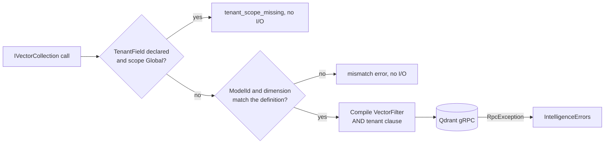

# SharedKernel.AI.Qdrant

[](https://dotnet.microsoft.com/)
[](https://github.com/Gresta-Vertex-Labs/platform-shared-kernel/blob/main/LICENSE)


> **The Qdrant provider for `SharedKernel.AI.Abstractions`: tenant-scoped vector collections, payload filters and
> alias-based cutover over the official gRPC client, with model, dimension and tenant checks before every call.**

| You get | So that |
| --- | --- |
| `AddSharedKernelQdrant(configuration).AddCollection<TRecord>(…).Build()` | One chain registers the client, each collection and its readiness probe, validated at startup |
| `IVectorCollection<TRecord>` over Qdrant | Handlers write, query, count and scroll through the neutral contract |
| Tenant stamped from `TenantScope` on every write, injected on every read | The tenant never comes from the record's own metadata and never leaks across tenants |
| Every write sent with `wait: true` | A write is queryable when the call returns |
| `EnsureCollectionAsync` with a stored schema fingerprint | Provisioning is idempotent and additive; a changed definition is reported as a conflict |
| `CutoverAsync` over Qdrant aliases | A re-embedded collection goes live in one atomic alias swap |
| `IQdrantHybridQueryAccessor<TRecord>`, `IQdrantQuantizationProfileAccessor` | Qdrant-only features are available, and a provider swap turns every use into a compile error |
| One `vector-store-qdrant-{collection}` probe per collection | `/health/ready` reports each collection separately |

## Contents

- [Install](#install)
- [Quick start](#quick-start)
- [How it works](#how-it-works)
- [Recipes](#recipes)
- [Configuration](#configuration)
- [Reference](#reference)
- [Testing](#testing)
- [Pitfalls](#pitfalls)
- [Design decisions](#design-decisions)

## Install

```xml
<PackageReference Include="SharedKernel.AI.Qdrant" />
```

The version comes from your central `SharedKernelVersion` property. Every SharedKernel package ships at the same
version. See [Using the packages](https://github.com/Gresta-Vertex-Labs/platform-shared-kernel#using-the-packages).

| Requirement | Value |
| --- | --- |
| Target framework | `net10.0` |
| Tier | Adapter: reference it from your **Infrastructure** project |
| Depends on | `SharedKernel.AI.Abstractions`, `SharedKernel.Primitives`, `SharedKernel.Configuration`, `Qdrant.Client` 1.18.1 |
| Server | Qdrant **v1.16.0 or later** (collection metadata) |
| Namespaces | `SharedKernel.AI.Qdrant.Extensions` (registration), `.Options`, `.Sparse`, `.Quantization`, `.Raw` |

## Quick start

Share the collection's shape between registration and provisioning:

```csharp
using SharedKernel.AI.Abstractions.Models;

public static class ProductChunkCollection
{
    public const string Name = "product-chunks";

    public static void Configure(VectorCollectionDefinitionBuilder c) => c
        .EmbeddingModel("text-embedding-3-small", dimension: 1536)
        .DistanceMetric(VectorDistanceMetric.Cosine)
        .Field("tenantId", VectorFieldKind.String, filterable: true)
        .Field("status", VectorFieldKind.String, filterable: true)
        .TenantField("tenantId");
}
```

Register the provider (it needs an `IClock`):

```csharp
using SharedKernel.AI.Qdrant.Extensions;
using SharedKernel.Primitives.Clocks;
using SharedKernel.ServiceDefaults.HealthChecks;

builder.Services.AddClock();

builder.Services
    .AddSharedKernelQdrant(builder.Configuration)                       // Intelligence:Qdrant
    .AddCollection<ProductChunk>(ProductChunkCollection.Name, ProductChunkCollection.Configure)
    .Build();

builder.Services.AddHealthChecks().AddSharedKernelReadiness();          // vector-store-qdrant-product-chunks
```

```json
{
  "Intelligence": {
    "Qdrant": { "Host": "qdrant", "Port": 6334, "UseTls": true, "ApiKey": "…" }
  }
}
```

Create the collection once, for example in a startup task or a deployment job:

```csharp
var builder = new VectorCollectionDefinitionBuilder(ProductChunkCollection.Name);
ProductChunkCollection.Configure(builder);

var definition = builder.Build();
var ensured = await provisioner.EnsureCollectionAsync(definition.Value, ct);   // IVectorCollectionProvisioner
```

Application code then injects `IVectorCollection<ProductChunk>` and `IEmbeddingGenerator`, as shown in
[`SharedKernel.AI.Abstractions`](https://github.com/Gresta-Vertex-Labs/platform-shared-kernel/blob/main/src/Infrastructure/AI/SharedKernel.AI.Abstractions/README.md#quick-start).

## How it works



- **Tenancy.** When the definition declares a `TenantField`, every write sets that payload field from the
  `TenantScope` parameter (the `TenantId` `"D"` string), ignoring whatever the record's `Metadata` says. Every read,
  count, scroll and filtered delete gets the tenant as the outermost `AND`. `GetAsync` and single-id `DeleteAsync`
  become filtered operations (`has_id AND tenant`), so another tenant's id is simply not found.
- **Model identity.** `ModelId` and vector length are checked on every record and query before I/O. The record's
  `ModelId` is stored in the reserved payload key `__sk_vector_model_id` so it round-trips on read.
- **Record ids.** Qdrant accepts an unsigned 64-bit integer or a UUID in `"D"` format. Any other `Id` fails with
  `intelligence.invalid_record_id` before I/O.
- **Write visibility.** Every write uses `wait: true`, so `WaitUntilQueryableAsync` returns success immediately.
- **Filters.** The closed `VectorFilter` tree is translated exhaustively to Qdrant `must`/`must_not`/`should`
  conditions. The switch has no catch-all arm, so an untranslated node throws; nothing is dropped or post-filtered
  in memory.
- **Provisioning.** `EnsureCollectionAsync` creates the collection (dense vector of the declared dimension and
  metric), one payload index per filterable field, and stores `VectorCollectionDefinition.Fingerprint` in the
  collection metadata under `sk_schema_fingerprint`. On an existing collection it adds missing payload indexes only,
  stamps a missing fingerprint, and returns `intelligence.collection_definition_conflict` when the stored fingerprint
  differs.
- **Cutover.** `CutoverAsync` points the alias named `LiveCollectionName` at `StagingCollectionName` in one alias
  update. The collection the alias pointed at before is deleted when `DeleteStagingAfterCutover` is `true` (default),
  otherwise kept with a warning.
- **Failures.** gRPC status codes map to `IntelligenceErrors` (see [Errors](#errors)); cancellation is never
  swallowed.

## Recipes

### 1. Re-embed with zero downtime

1. Register and query the collection under the **alias** name (`product-chunks`).
2. Provision `product-chunks-v2` with the new model's definition and fill it (for example through the raw client or
   a second registration against another record type).
3. Call `provisioner.CutoverAsync(new VectorCollectionCutoverRequest { StagingCollectionName = "product-chunks-v2",
   LiveCollectionName = "product-chunks" })`.
4. Deploy the new embedding model id and dimension in the `AddCollection` definition.

### 2. Run a hybrid (dense + sparse) query

```csharp
using SharedKernel.AI.Qdrant.Sparse;

public sealed class HybridSearch(IQdrantHybridQueryAccessor<ProductChunk> hybrid)
{
    public Task<Result<VectorQueryResults<ProductChunk>>> SearchAsync(
        VectorQuery dense, IReadOnlyList<QdrantSparseVectorEntry> sparse, TenantScope scope, CancellationToken ct) =>
        hybrid.QueryHybridAsync(dense, sparseVectorName: "keywords", sparse, scope, ct);
}
```

Results are fused with Reciprocal Rank Fusion. The dense query gets the same model, dimension and tenant checks.
The accessor only queries: `EnsureCollectionAsync` does not create sparse vectors, so create the named sparse vector
and write sparse values through the raw client.

### 3. Check a query against the provider's ceilings

`IVectorProviderDescriptor.Validate(collectionName, query)` returns `collection_not_found` for an unregistered
collection, `invalid_query` when the vector is longer than `MaxVectorDimension`, and `filter_depth_exceeded` when the
filter is deeper than `MaxFilterDepth`. It does no I/O. Split bulk writes by `descriptor.MaxBatchSize` yourself.

### 4. Reach the raw client (last resort)

```csharp
builder.Services.AddSharedKernelQdrant(builder.Configuration)
    .AddCollection<ProductChunk>(ProductChunkCollection.Name, ProductChunkCollection.Configure)
    .AllowRawClientAccess()   // logs a startup warning
    .Build();
```

Inject `IQdrantRawClientAccessor` and use `.Client` (`IQdrantClient`). **The raw client bypasses tenant scoping,
model checks and error mapping.**

## Configuration

Section `Intelligence:Qdrant` (`QdrantOptions.SectionName`), validated when the host starts. The
`AddSharedKernelQdrant(IConfigurationSection)` overload binds any other section.

| Key | Type | Default | Meaning |
| --- | --- | --- | --- |
| `Intelligence:Qdrant:Host` | `string` | — (required) | Qdrant gRPC host name |
| `Intelligence:Qdrant:Port` | `int` | `6334` | gRPC port (1–65535) |
| `Intelligence:Qdrant:UseTls` | `bool` | `false` | Connect over TLS |
| `Intelligence:Qdrant:ApiKey` | `string?` | `null` | API key; omit for an unauthenticated server |
| `Intelligence:Qdrant:GrpcTimeoutSeconds` | `int` | `30` | Per-call gRPC timeout (1–300) |
| `Intelligence:Qdrant:MaxBatchSize` | `int` | `1000` | Reported as `IVectorProviderDescriptor.MaxBatchSize` (1–100000) |
| `Intelligence:Qdrant:MaxVectorDimension` | `int` | `4096` | Ceiling checked by `IVectorProviderDescriptor.Validate` (1–65536) |
| `Intelligence:Qdrant:MaxFilterDepth` | `int` | `10` | Ceiling checked by `IVectorProviderDescriptor.Validate` (1–100) |

## Reference

### Registration

| Method | Registers |
| --- | --- |
| `AddSharedKernelQdrant(IConfiguration)` / `(IConfigurationSection)` | `QdrantOptions`, `QdrantClient` and `IQdrantClient` (one singleton); returns `QdrantBuilder` |
| `QdrantBuilder.AddCollection<TRecord>(name, configure)` | `IVectorCollection<TRecord>` and `IQdrantHybridQueryAccessor<TRecord>` (scoped). Throws `InvalidOperationException` when the definition is invalid |
| `QdrantBuilder.AllowRawClientAccess()` | `IQdrantRawClientAccessor` (singleton) at `Build()` |
| `QdrantBuilder.Build()` | `IVectorCollectionProvisioner`, `IVectorProviderDescriptor`, `IQdrantQuantizationProfileAccessor` (singletons) and one readiness probe per collection |

Provider-only contracts: `IQdrantHybridQueryAccessor<TRecord>.QueryHybridAsync`,
`IQdrantQuantizationProfileAccessor.GetQuantizationProfileAsync(collectionName)` → `QdrantQuantizationProfile`
(`None`, `Scalar`, `Binary`, `Product`; read-only), `IQdrantRawClientAccessor.Client`.

### Errors

| gRPC status | Code |
| --- | --- |
| `NotFound` | `intelligence.collection_not_found` |
| `AlreadyExists` | `intelligence.collection_already_exists` |
| `InvalidArgument`, `FailedPrecondition` | `intelligence.invalid_query` |
| `PermissionDenied`, `Unauthenticated` | `intelligence.unauthorized` |
| `ResourceExhausted` | `intelligence.rate_limited` |
| `Unavailable` | `intelligence.unreachable` |
| `DeadlineExceeded` | `intelligence.timeout` |
| anything else | `intelligence.engine_fault` |

Checked before I/O: `intelligence.tenant_scope_missing`, `.embedding_model_mismatch`, `.dimension_mismatch`,
`.invalid_record_id`. From provisioning: `.collection_definition_conflict`, `.cutover_failed`.

### Logging

| Event id | Level | Event |
| --- | --- | --- |
| 10100 | Information | Client configured for host, port and collection count |
| 10101 | Information | Collection ensured with its filterable-field count |
| 10102 | Debug | Records upserted |
| 10103 | Debug | Records deleted |
| 10104 | Warning | Bulk operation partially failed |
| 10105 | Debug | Query executed (hit count, duration) |
| 10106 | Warning | Request rejected before any I/O |
| 10107 | Warning | Tenant-declaring collection called with `TenantScope.Global` |
| 10108 | Information | Alias cut over to the staging collection |
| 10109 | Warning | Previous collection retained after cutover |
| 10110 | Warning | Raw client access enabled |
| 10111 | Warning | Readiness probe degraded |
| 10112 | Warning | Schema fingerprint mismatch |
| 10113 | Error | Qdrant operation faulted |
| 10114 | Debug | Record walk (scroll) started |

No log message carries vectors, metadata values or the API key.

### Health

`Build()` registers one `IReadinessProbe` per collection, named `vector-store-qdrant-{collection}`. It is ready when
the server answers, the collection is addressable with this service's credentials and a query succeeds. The report
data holds the vector count, engine version and stored schema fingerprint. Map the probes with
`services.AddHealthChecks().AddSharedKernelReadiness()`.

## Testing

Unit-test handlers against the in-memory doubles in
[`SharedKernel.AI.Testing`](https://github.com/Gresta-Vertex-Labs/platform-shared-kernel/blob/main/src/Testing/SharedKernel.AI.Testing/README.md)
(`services.AddInMemoryVectorCollection<TRecord>(definition)`, `services.AddInMemoryVectorProvisioning()`); they apply
the same model, dimension and tenant checks. For integration tests, run a real `qdrant/qdrant:v1.16.0` (or later)
container, for example with Testcontainers, and point `Intelligence:Qdrant:Host`/`Port` at it. Client construction is
lazy, so a host with this registration starts without a reachable server.

## Pitfalls

| Don't | Do | Why |
| --- | --- | --- |
| Run against a Qdrant server older than v1.16.0 | Deploy v1.16.0 or later | Older servers accept collection metadata and silently drop it, so fingerprint checks and probe data stop working |
| Forget to register an `IClock` | Call `services.AddClock()` (or register your own `IClock`) | Every collection resolves `IClock`; without one the first resolution fails |
| Register two collections for the same `TRecord` | Use one record type per collection | The second unkeyed registration silently wins |
| Use arbitrary strings as record ids | Use a UUID or an unsigned integer string | Qdrant rejects other ids; the adapter fails with `invalid_record_id` |
| Rely on `MaxBatchSize` to reject oversized writes | Chunk `UpsertManyAsync` input by `IVectorProviderDescriptor.MaxBatchSize` | The collection does not enforce the batch ceiling itself |
| Expect the adapter to create the collection | Call `EnsureCollectionAsync` from a startup task or deployment job | Registration never touches the server |
| Change the definition in place and redeploy | Provision a new collection and `CutoverAsync` | A changed fingerprint makes `EnsureCollectionAsync` return `collection_definition_conflict` |
| Use the raw client for tenant data | Use `IVectorCollection<TRecord>` | The raw client bypasses tenant scoping |

## Design decisions

**Why does the tenant come from `TenantScope` and not from the record?** A record's metadata is caller data; a bug
there would write one tenant's vectors into another's partition. Stamping from the mandatory parameter makes the
tenant boundary a property of the call.

**Why is `WaitUntilQueryableAsync` a no-op?** Every write already waits until it is applied and searchable, which
is the strongest consistency Qdrant offers. Qdrant's client has no primitive to wait for an earlier operation.

**Why does the provisioner use the concrete `QdrantClient`?** The metadata-accepting `CreateCollectionAsync` and
`UpdateCollectionAsync` overloads exist only on the concrete class. Everything else depends on `IQdrantClient`.

**Why no `HttpClientFactory`?** `QdrantClient` owns its gRPC channel and exposes no `HttpClient` constructor. It is
registered once as a singleton, so one pooled channel serves the process.

---

Part of [Platform.SharedKernel](https://github.com/Gresta-Vertex-Labs/platform-shared-kernel) ·
[Intelligence domain](https://github.com/Gresta-Vertex-Labs/platform-shared-kernel/blob/main/src/Infrastructure/AI/README.md) ·
[MIT license](https://github.com/Gresta-Vertex-Labs/platform-shared-kernel/blob/main/LICENSE)
