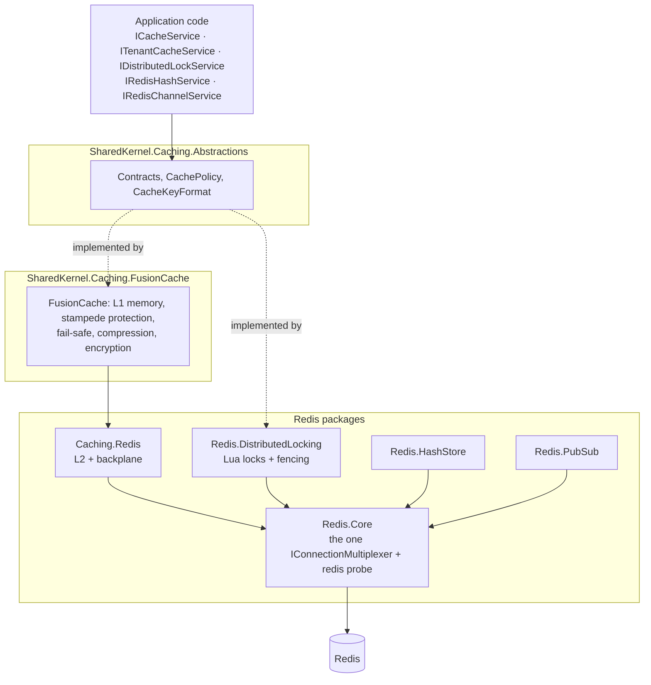

<div align="center">

# SharedKernel Caching

**Hybrid in-memory + Redis caching for multi-tenant .NET services — each value computed once, tenants kept apart by
construction — plus Redis locks with fencing tokens, hash storage and Pub/Sub over one shared connection.**

[](https://dotnet.microsoft.com/)
[](../../../LICENSE)


[](https://github.com/ZiggyCreatures/FusionCache)
[](https://github.com/StackExchange/StackExchange.Redis)

[What you get](#what-you-get) · [Packages](#packages) · [How it fits together](#how-it-fits-together) · [Get started](#get-started) · [See it run](#see-it-run) · [Guarantees](#guarantees)

<sub>📂 <code>src/Infrastructure/Caching</code> · <a href="../../../docs/packages.md">all packages by tier</a> · <a href="../../../README.md">Platform.SharedKernel</a></sub>

</div>

---

## What you get

- **One read path that survives load.** `ICacheService.GetOrSetAsync` runs the factory once per key however many
  callers miss together, keeps a cached `null` or `0` distinct from a miss (`CacheLookup<T>`), and can serve a stale
  value (fail-safe) while the source of truth is down.
- **Tenant isolation you cannot bypass.** `ITenantCacheService` takes an explicit `TenantId` on every call and builds
  every key and tag itself; `RemoveTenantAsync` drops one tenant and nothing else.
- **Invalidation that reaches every instance.** With the Redis layer added, `RemoveAsync`, `ExpireAsync`, tag removal
  and `ClearAsync` travel over the FusionCache backplane — no invalidation messages of your own.
- **Locks that never lie.** `IDistributedLockService` returns `null` only for contention, throws
  `DistributedLockUnavailableException` for an outage, reports a lost lock before another replica can take it, and
  issues a fencing token in the same atomic step as the acquisition.
- **Redis configured once.** `AddRedisConnection` is the only registration that reads connection settings (TLS, mutual
  TLS, timeouts, fail-fast); every other Redis package runs over that one multiplexer and its `redis` readiness probe.

## Packages

| Package | Tier | Reference it from | Use it for |
| --- | --- | --- | --- |
| [SharedKernel.Caching.Abstractions](SharedKernel.Caching.Abstractions/README.md) | Abstractions | Application | `ICacheService`, `ITenantCacheService`, `CachePolicy`, `ICacheKeyProvider`, `IDistributedLockService` — no provider dependency |
| [SharedKernel.Caching.FusionCache](SharedKernel.Caching.FusionCache/README.md) | Adapter | Infrastructure | The cache: memory layer, stampede protection, fail-safe, Brotli compression, encryption at rest, warmup, the `cache` probe |
| [SharedKernel.Caching.Redis.Core](SharedKernel.Caching.Redis.Core/README.md) | Adapter | Infrastructure | The one shared Redis connection (`AddRedisConnection`) and the `redis` probe — needed by every Redis package |
| [SharedKernel.Caching.Redis](SharedKernel.Caching.Redis/README.md) | Adapter | Infrastructure | Redis as the distributed layer and backplane, so instances share entries (`AddRedisL2`) |
| [SharedKernel.Caching.Redis.DistributedLocking](SharedKernel.Caching.Redis.DistributedLocking/README.md) | Adapter | Infrastructure | Only one replica runs a section or claims a job occurrence (`AddRedisDistributedLocking`) |
| [SharedKernel.Caching.Redis.HashStore](SharedKernel.Caching.Redis.HashStore/README.md) | Adapter | Infrastructure | Sessions, settings snapshots or counters as Redis hashes (`IRedisHashService`, `ITypedHashStore<T>`) |
| [SharedKernel.Caching.Redis.PubSub](SharedKernel.Caching.Redis.PubSub/README.md) | Adapter | Infrastructure | Loss-tolerant, at-most-once signals between instances (`IRedisChannelService`) — never for work that must happen |
| [SharedKernel.Caching.Testing](SharedKernel.Caching.Testing/README.md) | Testing | test projects | `AddFakeCachingServices()`, `AddFakeTenantCacheService()` — in-memory cache and lock fakes |
| [SharedKernel.Caching.Redis.Testing](SharedKernel.Caching.Redis.Testing/README.md) | Testing | test projects | `AddFakeRedisServices()` — in-memory hash store and Pub/Sub fakes |

Start with `Caching.FusionCache`; add `Redis.Core` and `Redis` when instances should share entries, and a Redis role
package only for the role you need. Query caching in the request pipeline is
[`SharedKernel.Application.Pipeline.Caching`](../../Application/SharedKernel.Application.Pipeline.Caching/README.md).

## How it fits together



- **Any subset.** A service with only an in-process cache references no Redis package; a lock-only worker needs no
  cache. Every Redis registration throws at startup when `AddRedisConnection` has not been called first.
- **Redis down is not the service down.** The cache continues from memory behind FusionCache's circuit breakers; locks
  throw `DistributedLockUnavailableException` instead of pretending the lock is held elsewhere.
- **Role packages never reference each other.** Each Redis package depends only on `Redis.Core` and the abstractions.
- **Caching is not messaging.** Pub/Sub stays here because its contract is deliberately weaker than the durable
  [Messaging](../Messaging/README.md) packages.

## Get started

```xml
<PackageReference Include="SharedKernel.Caching.FusionCache" />
<PackageReference Include="SharedKernel.Caching.Redis" />
<PackageReference Include="SharedKernel.Caching.Redis.DistributedLocking" />
```

```csharp
builder.Services.AddRedisConnection(builder.Configuration);    // SharedKernel:Caching:Redis — once

builder.Services
    .AddSharedKernelCaching(builder.Configuration)             // SharedKernel:Caching — ServiceName is required
    .AddTenantCacheService()                                   // ITenantCacheService
    .AddRedisL2()                                              // shared entries + backplane
    .AddRedisDistributedLocking();                             // IDistributedLockService

builder.Services.AddHealthChecks().AddSharedKernelReadiness(); // "cache" and "redis" on /health/ready

public sealed class InvoiceReader(ITenantCacheService cache, IInvoiceRepository invoices)
{
    private static readonly CachePolicy Policy = CachePolicy.Default.WithTags("invoices");

    public ValueTask<Invoice?> GetAsync(TenantId tenantId, string invoiceId, CancellationToken ct) =>
        cache.GetOrSetAsync(tenantId, "invoice", invoiceId, t => invoices.FindAsync(tenantId, invoiceId, t), Policy, ct);
}
```

Configuration is `SharedKernel:Caching` (`ServiceName`, required) and `SharedKernel:Caching:Redis`
(`ConnectionString`, `Ssl`, …). The full setup is in the
[SharedKernel.Caching.FusionCache Quick start](SharedKernel.Caching.FusionCache/README.md#quick-start).

## See it run

- [samples/Shop](../../../samples/Shop/README.md) — Catalog runs two replicas on FusionCache with the Redis layer and
  Redis Pub/Sub, and its end-to-end tests prove the backplane across replicas; Inventory uses `Redis.Core`, the hash
  store and distributed locks so no SKU is oversold under concurrency across replicas.

  ```bash
  samples/Shop/build.sh                      # pack the kernel, build the Shop  (build.ps1 on Windows)
  dotnet run --project samples/Shop/Shop.AppHost --launch-profile http
  ```

- [`consumer-verify/SharedKernel.Caching.ConsumerVerify`](consumer-verify/SharedKernel.Caching.ConsumerVerify/Program.cs)
  consumes all seven packages as packed NuGet packages and starts five hosts against a real Redis: L1 only, L1 +
  Redis L2, locking only, hash store only and Pub/Sub only.

## Guarantees

| Guarantee | How it is held |
| --- | --- |
| **One factory run per key**, however many callers miss together | `FusionCacheServiceTests` (`GetOrSetAsync_StampedeProtection_FactoryCalledExactlyOnce`), `NullableFactoryTests` |
| **No cross-tenant reads or evictions** — tenant keys are `{service}:@{tenant}:{entity}:{id}`, caller parts escaped | `TenantCacheServiceTests`, `CacheKeyFormatTests` |
| **No key collisions between services** — `ServiceName` has no default and is validated at startup | `CachingDiRegistrationTests`, `CacheKeyFormatTests` |
| **Invalidation reaches every instance** | `CrossInstanceTagInvalidationTests`, `RedisL2IntegrationTests` against a real Redis |
| **Locks report outages and loss**, before the key can expire on the server | `LockStoreUnavailableTests`, `RedisDistributedLockLossTests`, `RedisDistributedLockServiceContractTests` |
| **No secrets or ids in telemetry** | `TelemetryRedactionTests` |
| **Values bound to their key** — AES-256-GCM with the cache key as associated data | `CacheEncryptionAtRestTests` |
| **Redis packages stay in their lane** — role packages reference only `Redis.Core`; Pub/Sub never stands in for messaging | Architecture rules in `RedisTopologyRules` (incl. `PubSubNeverReferencesMessaging`); analyzer `SK0007` |

**Out of scope:** an invalidation bus (the backplane does it), sliding expiration, RedLock, and durable messaging (see
[Messaging](../Messaging/README.md)).

---

<div align="center">
<sub>Part of <a href="../../../README.md">Platform.SharedKernel</a> · <a href="../../../docs/packages.md">all packages</a> · MIT license</sub>
</div>
