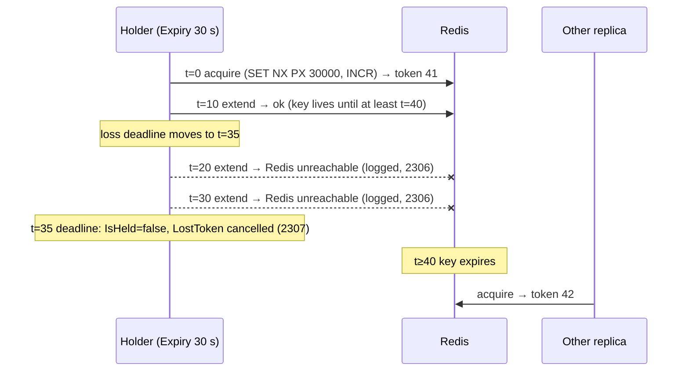

# SharedKernel.Caching.Redis.DistributedLocking

[](https://dotnet.microsoft.com/)
[](https://github.com/Gresta-Vertex-Labs/platform-shared-kernel/blob/main/LICENSE)


-brightgreen)

> **Redis locks and leases for `IDistributedLockService`: fencing tokens issued in the same atomic step as the
> acquisition, locks reported lost before another replica can take them, and outages that throw instead of looking
> like a busy resource.**

This package implements the locking contract from
[`SharedKernel.Caching.Abstractions`](https://github.com/Gresta-Vertex-Labs/platform-shared-kernel/blob/main/src/Infrastructure/Caching/SharedKernel.Caching.Abstractions/README.md#locks-and-leases)
with a few server-side Lua scripts over the shared connection from
[`SharedKernel.Caching.Redis.Core`](https://github.com/Gresta-Vertex-Labs/platform-shared-kernel/blob/main/src/Infrastructure/Caching/SharedKernel.Caching.Redis.Core/README.md).
Application code depends only on `IDistributedLockService`.

| You get | So that |
| --- | --- |
| `TryAcquireAsync` → `IDistributedLock` | A critical section runs on one process at a time, kept alive for as long as you hold it |
| `IsHeld` and `LostToken` | Work stops when the lock is lost, before the key can expire and another replica can acquire it |
| `TryAcquireLeaseAsync` → `DistributedLease` | One replica claims an occurrence of a job, and the claim simply expires |
| `FencingToken` issued atomically with each acquisition | The protected resource can reject writes from a holder that lost its lock |
| `null` only for contention, `DistributedLockUnavailableException` for outages | A Redis outage is never mistaken for "another replica is doing it" |
| Hash-tagged keys | The same code runs on a single primary and on Redis Cluster |

## Contents

- [Install](#install)
- [Quick start](#quick-start)
- [How it works](#how-it-works)
- [Recipes](#recipes)
- [Reference](#reference)
- [Testing](#testing)
- [Pitfalls](#pitfalls)
- [Design decisions](#design-decisions)

## Install

```xml
<PackageReference Include="SharedKernel.Caching.Redis.DistributedLocking" />
```

The version comes from your central `SharedKernelVersion` property — every SharedKernel package ships at the same
version. See [Using the packages](https://github.com/Gresta-Vertex-Labs/platform-shared-kernel#using-the-packages).

| Requirement | Value |
| --- | --- |
| Target framework | `net10.0` |
| Tier | Adapter — reference it from your **Infrastructure** project (application code injects `IDistributedLockService` from `SharedKernel.Caching.Abstractions`) |
| Depends on | `SharedKernel.Caching.Abstractions`, `SharedKernel.Caching.Redis.Core`, `SharedKernel.Primitives` |
| Redis | A single primary, or Redis Cluster; Lua scripting enabled |
| Namespaces | `SharedKernel.Caching.Redis.DistributedLocking.Extensions` (registration); the contract is in `SharedKernel.Caching.Abstractions` |

## Quick start

A host that needs locks but no cache:

```csharp
using SharedKernel.Caching.Redis.Core.Extensions;
using SharedKernel.Caching.Redis.DistributedLocking.Extensions;

builder.Services
    .AddRedisConnection(builder.Configuration)   // SharedKernel:Caching:Redis
    .AddRedisDistributedLocking();
```

A host that also uses the cache chains it on the caching builder; both overloads register the same services:

```csharp
builder.Services.AddRedisConnection(builder.Configuration);
builder.Services
    .AddSharedKernelCaching(builder.Configuration)
    .AddRedisL2()
    .AddRedisDistributedLocking();
```

Then inject `IDistributedLockService`:

```csharp
public sealed class InvoiceSettlement(IDistributedLockService locks, IInvoiceStore invoices)
{
    public async Task<Result> SettleAsync(Guid invoiceId, CancellationToken ct)
    {
        await using IDistributedLock? handle = await locks.TryAcquireAsync($"billing:invoice:{invoiceId:N}", ct: ct);
        if (handle is null)
            return Result.Failure(Error.Conflict("invoice.busy", "The invoice is being settled."));

        using var work = CancellationTokenSource.CreateLinkedTokenSource(ct, handle.LostToken);
        await invoices.SettleAsync(invoiceId, handle.FencingToken, work.Token);
        return Result.Success();
    }
}
```

The lock uses `DistributedLockOptions.Default`: a 30-second expiry, a single attempt, and a 200 ms retry interval.

## How it works

### Keys and scripts

| Key | Holds | Expires |
| --- | --- | --- |
| `sharedkernel:lock:{resource}` | The owner id of the current lock or lease | After the lock's `Expiry` or the lease's duration, unless extended |
| `sharedkernel:lock-fencing:{resource}` | The last fencing token issued for the resource | Never |

Resource names are used exactly as given, so include the service, and the tenant where it matters, in the name
yourself. Both keys carry the `{resource}` hash tag, so they live in the same Redis Cluster slot.

| Operation | Lua script, run atomically on the server |
| --- | --- |
| Acquire a lock or lease | `SET lock <owner> NX PX <ms>`; only if that succeeded, `INCR fencing` and return the token; otherwise return 0 |
| Extend a lock | `PEXPIRE lock <ms>` only if the key still holds this owner |
| Release a lock | `DEL lock` only if the key still holds this owner |

- **A token is issued only to a winner.** A contended attempt never advances the counter.
- **Locks and leases exclude each other** on the same resource and share its counter, so every token is greater than
  every earlier token on that resource, whether it came from a lock or a lease.
- **Owner ids** are fresh GUIDs per acquisition. A release can never delete another owner's key.
- **Waiting.** With a `WaitTime`, a contended lock is retried every `RetryInterval` (never past the wait time); a lease
  is always a single attempt.

### Keep-alive and loss

A held lock is extended every third of its `Expiry`. It is reported lost, by `IsHeld` turning `false` and `LostToken`
being cancelled, in two cases:

- **An extension finds another owner.** The key expired or was taken over.
- **No extension has succeeded for five sixths of the `Expiry`.** The deadline is measured from the moment the last
  successful extension (or the acquisition) was _sent_, and the key cannot expire earlier than a full `Expiry` after
  that moment. The holder is therefore told to stop at least one sixth of the `Expiry` before another replica could
  acquire the key.



_A holder that cannot reach Redis stops at t=35; the key cannot expire before t=40, so no second holder exists while the
first still believes it holds the lock. A GC pause or clock jump can still break that assumption, which is what the
fencing token is for._

After loss, keep-alive stops and the key is left to expire. `DisposeAsync` on a lost lock releases nothing. On a held
lock it stops the keep-alive, deletes the key if it still holds this owner, and then cancels `LostToken`: the token
means "lost or released". Disposal is idempotent.

**Choose `Expiry` well above the connection's `CommandTimeout`.** One extension that waits for a full command timeout
must not use up the five-sixths deadline. The defaults (30 s expiry, 5 s command timeout) leave room for two failed
extensions before the lock is reported lost.

### Guarantees

- **Atomic.** Acquisition and token issue, extension, and release are each one server-side script.
- **Owner-safe.** A holder never extends or deletes a key it does not own.
- **Monotonic tokens** per resource across locks and leases, for the life of the Redis data.
- **Loss before expiry.** A holder that cannot extend its lock is told before the key can expire on the server.
- **Single-primary assumption.** After a failover, a replica that had not yet received a lock key can grant it again;
  fencing tokens protect the resource in that window. Keys and scripts are valid on Redis Cluster.

## Recipes

### 1. Guard a critical section

```csharp
await using IDistributedLock? handle = await locks.TryAcquireAsync(
    $"billing:tenant:{tenantId}:invoice:{invoiceId}",
    new DistributedLockOptions { Expiry = TimeSpan.FromSeconds(30) },
    ct);

if (handle is null)
    return Result.Failure(Error.Conflict("invoice.busy", "The invoice is being settled."));

await invoices.SettleAsync(invoiceId, handle.FencingToken, ct);
```

`Expiry` is how long the lock survives a crashed holder, not how long the work may take: a live holder keeps it alive.

### 2. Wait for a busy resource

```csharp
var options = new DistributedLockOptions
{
    Expiry = TimeSpan.FromSeconds(30),
    WaitTime = TimeSpan.FromSeconds(5),
    RetryInterval = TimeSpan.FromMilliseconds(250),
};

await using IDistributedLock? handle = await locks.TryAcquireAsync("inventory:sku:A-1042", options, ct);
if (handle is null)
    return; // held by someone else for the whole five seconds
```

Cancelling `ct` stops the wait with `OperationCanceledException`. A Redis failure during the wait throws at once; it
does not keep retrying until `WaitTime` runs out.

### 3. Stop long work when the lock is lost

```csharp
await using IDistributedLock? handle = await locks.TryAcquireAsync("exports:ledger:2026-09", ct: ct);
if (handle is null)
    return;

using var work = CancellationTokenSource.CreateLinkedTokenSource(ct, handle.LostToken);
try
{
    await foreach (LedgerRow row in ledger.StreamAsync(work.Token))
        await writer.WriteAsync(row, handle.FencingToken, work.Token);
}
catch (OperationCanceledException) when (handle.LostToken.IsCancellationRequested && !ct.IsCancellationRequested)
{
    logger.ExportAbandoned(handle.Resource);   // the lock was lost; another replica may take over
}
```

Check `handle.IsHeld` before an irreversible step that cannot take a cancellation token.

### 4. Run a job occurrence once across replicas

```csharp
DateOnly day = DateOnly.FromDateTime(clock.UtcNow.UtcDateTime);

DistributedLease? lease = await locks.TryAcquireLeaseAsync(
    $"reports:daily-statement:{day:yyyy-MM-dd}",
    TimeSpan.FromHours(2),
    ct);

if (lease is null)
    return; // another replica claimed today's run

await statements.GenerateAsync(day, lease.FencingToken, ct);
```

- **Never release a lease.** Releasing it when the work finishes would let a slower replica claim the same occurrence.
- **Put the occurrence in the name**, so tomorrow's run is a different resource.
- **Choose a duration** longer than the work and than any replica could lag behind.

### 5. Enforce the fencing token

A holder paused by a long GC or a stalled VM can resume after its lock was lost and taken over. Make the protected write
reject it:

```sql
UPDATE invoices
SET    status = 'Settled', fencing_token = @token
WHERE  id = @id AND fencing_token < @token;   -- 0 rows: a newer holder already wrote
```

Tokens for one resource strictly increase across locks and leases; gaps are normal.

### 6. Handle a Redis outage

```csharp
try
{
    await using IDistributedLock? handle = await locks.TryAcquireAsync(resource, ct: ct);
    if (handle is null)
        return JobOutcome.SkippedBusy;

    await RunAsync(handle, ct);
    return JobOutcome.Completed;
}
catch (DistributedLockUnavailableException ex)
{
    logger.LockStoreUnavailable(ex.Resource);
    return JobOutcome.RetryLater;   // never "someone else is doing it"
}
```

The exception wraps the `RedisException` or `TimeoutException` as `InnerException` and names the resource. With the
connection's default `FailFastWhenDisconnected`, it is thrown at once while Redis is disconnected.

## Reference

### Registration

| Method | Purpose |
| --- | --- |
| `IServiceCollection.AddRedisDistributedLocking()` | Register for a host with or without the cache |
| `ICachingBuilder.AddRedisDistributedLocking()` | The same registration, chained after `AddSharedKernelCaching` |

Both require `AddRedisConnection` first and are idempotent.

### Registered services

| Service | Lifetime | Notes |
| --- | --- | --- |
| `IDistributedLockService` | Singleton | Thread-safe |
| `TimeProvider` | Singleton | `TimeProvider.System`, only when no `TimeProvider` is registered; tests register a fake first |

### Exceptions

| Exception | Thrown by | When |
| --- | --- | --- |
| `ArgumentNullException` | Registration | `services` or `builder` is `null` |
| `InvalidOperationException` | Registration | `AddRedisConnection` has not been called |
| `ArgumentException` | `TryAcquireAsync`, `TryAcquireLeaseAsync` | The resource is null or whitespace |
| `ArgumentOutOfRangeException` | `TryAcquireLeaseAsync`, `DistributedLockOptions` | A duration is out of range |
| `DistributedLockUnavailableException` | `TryAcquireAsync`, `TryAcquireLeaseAsync` | Redis failed with `RedisException` or `TimeoutException` |
| `OperationCanceledException` | `TryAcquireAsync`, `TryAcquireLeaseAsync` | The token was cancelled before an attempt or during a wait |

### Logging

Category `SharedKernel.Caching.Redis.DistributedLocking.Implementations.RedisDistributedLockService`. Events carry the
resource name and fencing token, never owner ids or connection details.

| Event id | Level | Event |
| --- | --- | --- |
| 2300 | Debug | Lock acquired on `{Resource}` (`{FencingToken}`) |
| 2301 | Debug | Lock on `{Resource}` held by another owner (after the whole wait time) |
| 2302 | Debug | Lease acquired on `{Resource}` for `{Duration}` (`{FencingToken}`) |
| 2303 | Debug | Lease on `{Resource}` held by another owner |
| 2304 | Debug | Lock on `{Resource}` released |
| 2305 | Warning | Lock on `{Resource}` could not be released; it expires on its own |
| 2306 | Warning | Lock on `{Resource}` could not be extended; retrying until it would expire |
| 2307 | Error | Lock on `{Resource}` (`{FencingToken}`) lost: `{Reason}` |

Alert on 2307: work that relied on the lock was told to stop.

### Health

No probe of its own: the `redis` readiness probe registered by `AddRedisConnection` reports the shared connection.

## Testing

Reference [`SharedKernel.Caching.Testing`](https://github.com/Gresta-Vertex-Labs/platform-shared-kernel/blob/main/src/Testing/SharedKernel.Caching.Testing/README.md)
from your test project and call `services.AddFakeCachingServices()` (namespace `SharedKernel.Testing.Caching`); it
registers `FakeDistributedLockService` as `IDistributedLockService`, with no Redis.

- `SimulateContention = true` makes acquisitions return `null`; `SimulateUnavailable = true` makes them throw
  `DistributedLockUnavailableException`.
- `AcquiredLocks` and `AcquiredLeases` record every grant; a `FakeDistributedLock` exposes `IsHeld`, `IsReleased`,
  `LostToken` and `SimulateLoss()`, so a test can prove the work stops when the lock is lost.
- Construct it with a `TimeProvider` to control lease expiry.

To test against a real Redis, run the service with Testcontainers and the production registration.

## Pitfalls

| Don't | Do | Why |
| --- | --- | --- |
| Treat `DistributedLockUnavailableException` as "busy" | Fail or retry later | Otherwise a Redis outage silently skips the work on every replica |
| Use a bare id such as `"invoice:42"` | Include the service, and the tenant where relevant: `"billing:tenant:t1:invoice:42"` | Resource names are global across every service using the Redis |
| Put a request id, GUID or timestamp per call in a lock name | Name the thing being protected | Each distinct name leaves a small fencing counter key that never expires |
| Set `Expiry` to how long the work takes | Keep a short expiry; the lock is kept alive | A long expiry blocks others for that long after a crash |
| Set `Expiry` close to `CommandTimeout` | Keep `Expiry` several times the command timeout | One slow extension would report the lock lost |
| Ignore `LostToken` in long work | Link it into the work's cancellation token | A lost lock gives no exclusion; another replica may already be running |
| Dispose a lock early to "unblock" others, or release a lease | Hold the lock for the whole section; let a lease expire | Releasing reopens the window the claim exists to close |
| Trust the lock alone for correctness | Check `FencingToken` in the protected write | Pauses and failovers can produce two holders |
| Register your own `IConnectionMultiplexer` for locks | Use `AddRedisConnection` | Locks use the shared connection and its timeouts |

## Design decisions

**Why Lua scripts instead of RedLock.net?** A fencing token must be issued in the same atomic step that acquires the
lock, or a token can be issued to a holder that never acquired. RedLock.net cannot do that. Three short scripts can,
with no third-party lock library.

**Why report loss at five sixths of the expiry?** Reporting loss only after the expiry had passed left a window in which
Redis had already expired the key, another replica held it, and the first holder still saw `IsHeld = true`. Measuring
from the send time of the last successful extension and stopping a sixth early means the holder hears about the loss
while the key still exists. Waiting less would report loss on ordinary latency spikes.

**Why do locks and leases share one key and one counter?** A lease and a lock on the same resource guard the same thing,
so they must exclude each other, and a write guarded by a lease must reject a stale lock holder and the other way round.

**Why does the fencing counter never expire?** If it expired, the counter would restart at 1, and a resource that
remembers token 57 would reject every future holder. The cost is one small key per distinct resource name.

**Why no key prefix option?** The resource name is the whole identity of a lock, and it is visible at the call site. A
prefix hidden in configuration would make two services that must contend for one resource stop excluding each other
whenever their settings differ. Put the service in the name instead.

**Why `null` only for contention?** A job that reads "Redis is down" as "another replica has it" never runs anywhere,
and nobody notices. An exception makes the outage visible.

---

Part of [Platform.SharedKernel](https://github.com/Gresta-Vertex-Labs/platform-shared-kernel) ·
[Caching domain](https://github.com/Gresta-Vertex-Labs/platform-shared-kernel/blob/main/src/Infrastructure/Caching/README.md) ·
[MIT license](https://github.com/Gresta-Vertex-Labs/platform-shared-kernel/blob/main/LICENSE)
