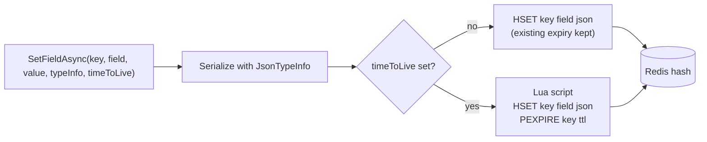

# SharedKernel.Caching.Redis.HashStore

[](https://dotnet.microsoft.com/)
[](https://github.com/Gresta-Vertex-Labs/platform-shared-kernel/blob/main/LICENSE)


> **Redis hashes for sessions, settings snapshots and counters: read and change one field at a time, as JSON, with the
> key's expiry set in the same atomic step as the write and lookups that tell a missing field from a zero.**

A Redis hash stores named fields under one key. This package reads and writes those fields over the shared connection
from
[`SharedKernel.Caching.Redis.Core`](https://github.com/Gresta-Vertex-Labs/platform-shared-kernel/blob/main/src/Infrastructure/Caching/SharedKernel.Caching.Redis.Core/README.md),
serializing values with a `JsonTypeInfo<T>` you supply. It is data storage with explicit keys, not a cache: for cached
values use `ICacheService`.

| You get | So that |
| --- | --- |
| `IRedisHashService` | Any value type per call, with its JSON contract passed explicitly |
| `ITypedHashStore<T>` via `AddTypedHashStore(typeInfo)` | The JSON contract is fixed once at registration and calls stay short |
| `GetFieldAsync` → `CacheLookup<T>` | A missing field is never confused with a stored `0`, `false` or `null` |
| `GetFieldsAsync`, `SetFieldsAsync` | Several fields are read or written in one round trip; a multi-field write is atomic |
| `timeToLive` on every write | A session never exists without its expiry, even if the process dies between commands |
| `IncrementFieldAsync` | Counters change atomically across every instance |
| `DeleteFieldAsync`, `DeleteAsync`, `ExpireAsync` | Fields and whole hashes are removed, and expiry is set or cleared, explicitly |

## Contents

- [Install](#install)
- [Quick start](#quick-start)
- [How it works](#how-it-works)
- [Recipes](#recipes)
- [Reference](#reference)
- [Testing](#testing)
- [Pitfalls](#pitfalls)
- [Design decisions](#design-decisions)

## Install

```xml
<PackageReference Include="SharedKernel.Caching.Redis.HashStore" />
```

The version comes from your central `SharedKernelVersion` property — every SharedKernel package ships at the same
version. See [Using the packages](https://github.com/Gresta-Vertex-Labs/platform-shared-kernel#using-the-packages).

| Requirement | Value |
| --- | --- |
| Target framework | `net10.0` |
| Tier | Adapter — reference it from your **Infrastructure** project |
| Depends on | `SharedKernel.Caching.Abstractions` (for `CacheLookup<T>`), `SharedKernel.Caching.Redis.Core` |
| Namespaces | `SharedKernel.Caching.Redis.HashStore` (contracts), `SharedKernel.Caching.Redis.HashStore.Extensions` (registration) |

## Quick start

Declare a source-generated JSON context for the stored types:

```csharp
[JsonSerializable(typeof(SessionDto))]
[JsonSerializable(typeof(long))]
[JsonSerializable(typeof(string))]
internal sealed partial class AppJsonContext : JsonSerializerContext;
```

Register the shared connection, then the stores:

```csharp
using SharedKernel.Caching.Redis.Core.Extensions;
using SharedKernel.Caching.Redis.HashStore.Extensions;

builder.Services
    .AddRedisConnection(builder.Configuration)          // SharedKernel:Caching:Redis
    .AddTypedHashStore(AppJsonContext.Default.SessionDto) // ITypedHashStore<SessionDto>, and IRedisHashService
    .AddTypedHashStore(AppJsonContext.Default.Int64);     // ITypedHashStore<long>
```

Inject and use:

```csharp
public sealed class SessionStore(ITypedHashStore<SessionDto> sessions)
{
    private static readonly TimeSpan IdleTimeout = TimeSpan.FromMinutes(30);

    public ValueTask SaveAsync(string sessionId, SessionDto session, CancellationToken ct) =>
        sessions.SetFieldAsync($"identity:session:{sessionId}", "data", session, IdleTimeout, ct);

    public async ValueTask<SessionDto?> FindAsync(string sessionId, CancellationToken ct)
    {
        CacheLookup<SessionDto> lookup = await sessions.GetFieldAsync($"identity:session:{sessionId}", "data", ct);
        return lookup.TryGetValue(out SessionDto? session) ? session : null;
    }
}
```

`AddRedisHashService()` registers only `IRedisHashService`, for code that passes the JSON contract on each call.

## How it works



_A write with a time to live runs the field and the expiry in one server-side script, so the hash never exists without
its expiry, and a write that fails (for example on a key of another type) sets no expiry._

- **Keys are used exactly as given.** Nothing is prefixed: include the service, and the tenant where the data belongs to
  one, in the key yourself.
- **Values are JSON** produced by the `JsonTypeInfo<T>` of the call or of the typed store. A counter written by
  `IncrementFieldAsync` is a plain integer, which reads back as `long` or `int`.
- **Expiry belongs to the whole key.** Each write with `timeToLive` restarts it. A write without one keeps whatever
  expiry the key already has. `ExpireAsync(key, null)` removes it.
- **Reads.** `GetFieldAsync` returns a miss when the key or field does not exist. `GetFieldsAsync` returns only the fields
  that exist, reading duplicates once. `GetAllFieldsAsync` reads the whole hash in one command.
- **Cancellation** is checked before a command is sent; a command already sent is not interrupted.
- **Atomic multi-field writes.** All fields of one `SetFieldsAsync` call are applied together.
- **No reflection.** Values are serialized only through the supplied `JsonTypeInfo<T>`.
- **Shared connection only.** No connection of its own; TLS and timeouts come from `AddRedisConnection`.
- **Failures.** Redis failures surface as `RedisException` (including `RedisConnectionException` while disconnected with
  the default fail-fast setting) or `TimeoutException`. A stored value that does not match the type fails with
  `JsonException`.

## Recipes

### 1. Store a session with a sliding expiry

```csharp
public sealed class SessionStore(ITypedHashStore<SessionDto> sessions)
{
    private static readonly TimeSpan IdleTimeout = TimeSpan.FromMinutes(20);

    private static string Key(TenantId tenantId, string sessionId) => $"identity:tenant:{tenantId}:session:{sessionId}";

    public ValueTask TouchAsync(TenantId tenantId, string sessionId, SessionDto session, CancellationToken ct) =>
        sessions.SetFieldAsync(Key(tenantId, sessionId), "data", session, IdleTimeout, ct);   // restarts the 20 minutes

    public ValueTask<bool> ExtendAsync(TenantId tenantId, string sessionId, CancellationToken ct) =>
        sessions.ExpireAsync(Key(tenantId, sessionId), IdleTimeout, ct);                   // false: already gone
}
```

### 2. Count within a time window

```csharp
public sealed class LoginAttemptCounter(ITypedHashStore<long> counters, TimeProvider time)
{
    public async ValueTask<bool> IsBlockedAsync(TenantId tenantId, string userName, CancellationToken ct)
    {
        string key = $"identity:tenant:{tenantId}:login-attempts:{time.GetUtcNow():yyyyMMddHH}";
        long attempts = await counters.IncrementFieldAsync(key, userName, timeToLive: TimeSpan.FromHours(2), ct: ct);
        return attempts > 10;
    }
}
```

The increment and the expiry run in one server-side script, so a counter key never outlives its window. A field that holds
anything but an integer fails with a Redis server error.

### 3. Read and write a settings snapshot

```csharp
IReadOnlyDictionary<string, string> theme = new Dictionary<string, string>
{
    ["primaryColor"] = "#0B5FFF",
    ["logoUrl"] = "https://cdn.example.com/t1/logo.svg",
};

await hashes.SetFieldsAsync($"portal:tenant:{tenantId}:theme", theme, AppJsonContext.Default.String, ct: ct);

IReadOnlyDictionary<string, string> current = await hashes.GetFieldsAsync(
    $"portal:tenant:{tenantId}:theme",
    ["primaryColor", "logoUrl", "faviconUrl"],   // faviconUrl is simply absent from the result
    AppJsonContext.Default.String,
    ct);
```

All fields of one `SetFieldsAsync` land together or not at all. An empty dictionary throws `ArgumentException`.

### 4. Tell a missing field from a zero

```csharp
CacheLookup<long> balance = await counters.GetFieldAsync($"loyalty:tenant:{tenantId}:points", customerId, ct);

string state = balance switch
{
    { IsHit: false } => "never earned points",
    { Value: 0 } => "spent every point",
    { Value: var points } => $"{points} points",
};
```

### 5. Sign out everywhere

```csharp
await sessions.DeleteAsync($"identity:tenant:{tenantId}:user:{userId}:sessions", ct);            // the whole hash
await sessions.DeleteFieldAsync($"identity:tenant:{tenantId}:user:{userId}:sessions", deviceId, ct); // one device
```

Both return whether something was removed.

## Reference

### Registration

| Method | Registers |
| --- | --- |
| `AddRedisHashService()` | `IRedisHashService` |
| `AddTypedHashStore<T>(JsonTypeInfo<T>)` | `ITypedHashStore<T>`, and `IRedisHashService` when it is not registered yet |

Both are `IServiceCollection` extensions and require `AddRedisConnection` first. `AddRedisHashService` is idempotent;
`AddTypedHashStore<T>` registers one store per type.

### Registered services

| Service | Lifetime |
| --- | --- |
| `IRedisHashService` | Singleton, thread-safe |
| `ITypedHashStore<T>` | Singleton per `T`, thread-safe |

### Operations

| Member | Redis | Returns |
| --- | --- | --- |
| `GetFieldAsync` | `HGET` | `CacheLookup<T>`: hit with the value, or miss |
| `GetFieldsAsync` | `HMGET` (none when no fields are requested) | Existing fields by name |
| `GetAllFieldsAsync` | `HGETALL` | Every field by name; empty when the key does not exist |
| `SetFieldAsync`, `SetFieldsAsync` | `HSET`, or a Lua script running `HSET` then `PEXPIRE` with a time to live | Completes when acknowledged |
| `IncrementFieldAsync` | `HINCRBY`, or a Lua script running `HINCRBY` then `PEXPIRE` with a time to live | The new value |
| `DeleteFieldAsync` | `HDEL` | `true` when the field existed |
| `DeleteAsync` | `DEL` | `true` when the key existed |
| `ExpireAsync` | `EXPIRE`/`PEXPIRE`, or `PERSIST` for `null` | `true` when the key exists and its expiry changed |

### Exceptions

| Exception | When |
| --- | --- |
| `ArgumentNullException` | Registration: `services` or `typeInfo` is `null`. Calls: `typeInfo`, `fields` or `values` is `null` |
| `ArgumentException` | A key is null or whitespace; a field name is null or empty; `SetFieldsAsync` gets no fields |
| `ArgumentOutOfRangeException` | `timeToLive` is zero or negative |
| `InvalidOperationException` | Registration: `AddRedisConnection` has not been called, or a store for `T` is already registered |
| `JsonException` | A stored value does not match the requested type |
| `RedisException`, `TimeoutException` | Redis failed, including a key that holds another Redis type, or an increment on a non-integer field |
| `OperationCanceledException` | The token was cancelled before the command was sent |

### Logging and health

The package does not log. It has no readiness probe of its own: the `redis` probe registered by `AddRedisConnection`
reports the shared connection.

## Testing

Reference [`SharedKernel.Caching.Redis.Testing`](https://github.com/Gresta-Vertex-Labs/platform-shared-kernel/blob/main/src/Testing/SharedKernel.Caching.Redis.Testing/README.md)
from your test project (namespace `SharedKernel.Testing.Caching`); no Redis and no `AddRedisConnection` needed.

- `services.AddFakeRedisServices()` registers `FakeRedisHashService` as `IRedisHashService`;
  `services.AddFakeTypedHashStore<T>()` registers `FakeTypedHashStore<T>` as `ITypedHashStore<T>`.
- Both store the JSON the real service would write, apply the same argument validation, and expire keys by the
  registered `TimeProvider` (or `TimeProvider.System`), so a fake time provider can expire a hash.
- Arrange and assert with `Seed`, `SeedRaw` (untyped fake), `ContainsKey`, `GetTimeToLive`, `GetRawField`, `Keys` and
  `Reset()`; `SimulateFailure = true` makes calls fail as if Redis did not answer.
- An increment on a non-integer field throws `InvalidOperationException` in the fake, standing in for the Redis error.

## Pitfalls

| Don't | Do | Why |
| --- | --- | --- |
| Use a bare id such as `"session:42"` as the key | `"identity:tenant:t1:session:42"` | Keys are used as given and shared by every service on the Redis |
| Cache computed values here | Use `ICacheService` | The cache adds stampede protection, fail-safe, tags and cross-instance invalidation |
| Check `lookup.Value is null` or `== 0` to detect a missing field | Check `lookup.IsHit` | A stored `null` or `0` is a hit |
| Call `SetFieldAsync` then `ExpireAsync` | Pass `timeToLive` to the write | Two commands leave a hash without expiry if the process dies between them |
| Expect a write without `timeToLive` to clear an expiry | Call `ExpireAsync(key, null)` | Redis keeps the existing expiry on `HSET` |
| `GetAllFieldsAsync` on a hash that grows without bound | Read the fields you need, or split the data across keys | The whole hash is loaded in one command |
| Change a stored type's shape in place | Use a new key or field name for the new shape | Old values fail to deserialize with `JsonException` |
| Store secrets or personal data without further protection | Encrypt sensitive values before writing, and use TLS on the connection | Values are stored as plain JSON |
| Register `AddTypedHashStore<T>` twice for one type | Register it once at the composition root | The second registration throws |

## Design decisions

**Why is the expiry set atomically with the write?** Setting it in a second command left a window in which the hash
existed without an expiry; a crash in that window leaked the session forever. A Lua script runs both atomically. Not
`MULTI`/`EXEC`: Redis does not roll back a transaction, so a failed `HSET` would still have applied the expiry to a key
that was never written.

**Why return `CacheLookup<T>` from `GetFieldAsync`?** Returning `T?` made a missing counter and a counter of zero the same
value for value types. `CacheLookup<T>` is the same hit-or-miss type the cache contracts use.

**Why pass a `JsonTypeInfo<T>`?** The stored JSON contract is explicit at every call or registration, generated at
compile time, and never discovered by reflection. `ITypedHashStore<T>` removes the repetition.

**Why are the contracts in this package, not in `SharedKernel.Caching.Abstractions`?** Hash fields, per-key expiry and
atomic increments are Redis concepts. The abstractions package stays provider-neutral.

**Why no key prefix, encryption or compression option?** Keys are the data's identity and belong at the call site, and
values here are usually small. Callers that need encryption or compression apply it to the value before writing.

---

Part of [Platform.SharedKernel](https://github.com/Gresta-Vertex-Labs/platform-shared-kernel) ·
[Caching domain](https://github.com/Gresta-Vertex-Labs/platform-shared-kernel/blob/main/src/Infrastructure/Caching/README.md) ·
[MIT license](https://github.com/Gresta-Vertex-Labs/platform-shared-kernel/blob/main/LICENSE)
