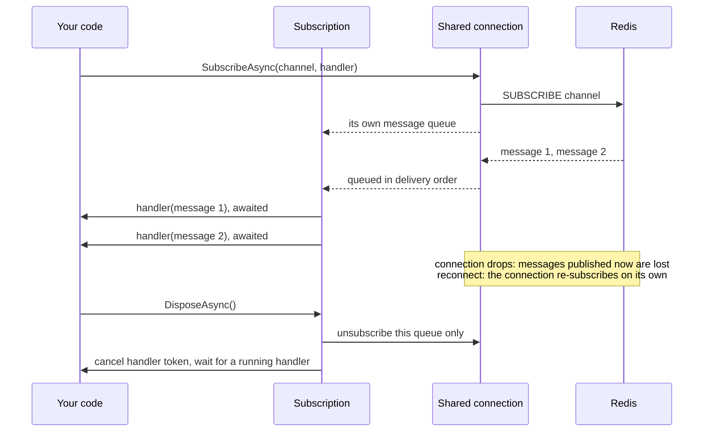

# SharedKernel.Caching.Redis.PubSub

[](https://dotnet.microsoft.com/)
[](https://github.com/Gresta-Vertex-Labs/platform-shared-kernel/blob/main/LICENSE)


> **Redis Pub/Sub for loss-tolerant, in-the-moment signals between service instances: text or JSON messages,
> independent disposable subscriptions that handle messages in order, restored automatically after a reconnect.**

**At most once, not durable.** A message reaches only the subscribers connected when it is published. Use this package
for hints that are harmless to miss, such as "reload your price list" or "a user's presence changed". Work that must
happen belongs in the [Messaging packages](https://github.com/Gresta-Vertex-Labs/platform-shared-kernel/blob/main/src/Infrastructure/Messaging/README.md)
(`IMessageBus`), which have an outbox, retries and dead-lettering. Cache invalidation needs no Pub/Sub at all: the backplane of
[`SharedKernel.Caching.Redis`](https://github.com/Gresta-Vertex-Labs/platform-shared-kernel/blob/main/src/Infrastructure/Caching/SharedKernel.Caching.Redis/README.md)
already reaches every instance.

| You get | So that |
| --- | --- |
| `PublishAsync` for text or `JsonTypeInfo<T>` messages | A signal is sent over the shared connection in one call |
| `SubscribeAsync` returning an `IAsyncDisposable` | A subscription ends exactly when you dispose it, without affecting any other subscription |
| Several subscriptions per channel | Independent components listen to the same channel without knowing about each other |
| One message at a time, in delivery order, per subscription | Handlers need no locking against themselves |
| Handler failures logged, subscription kept | One bad message never silences a channel |
| Automatic restore after a reconnect | Subscriptions survive a Redis failover without code of your own |

## Contents

- [Install](#install)
- [Quick start](#quick-start)
- [How it works](#how-it-works)
- [Recipes](#recipes)
- [Reference](#reference)
- [Testing](#testing)
- [Pitfalls](#pitfalls)
- [Design decisions](#design-decisions)

## Install

```xml
<PackageReference Include="SharedKernel.Caching.Redis.PubSub" />
```

The version comes from your central `SharedKernelVersion` property — every SharedKernel package ships at the same
version. See [Using the packages](https://github.com/Gresta-Vertex-Labs/platform-shared-kernel#using-the-packages).

| Requirement | Value |
| --- | --- |
| Target framework | `net10.0` |
| Tier | Adapter — reference it from your **Infrastructure** project |
| Depends on | `SharedKernel.Caching.Redis.Core`, `SharedKernel.Primitives` |
| Namespaces | `SharedKernel.Caching.Redis.PubSub` (contract), `SharedKernel.Caching.Redis.PubSub.Extensions` (registration) |

## Quick start

```csharp
using SharedKernel.Caching.Redis.Core.Extensions;
using SharedKernel.Caching.Redis.PubSub.Extensions;

builder.Services
    .AddRedisConnection(builder.Configuration)   // SharedKernel:Caching:Redis
    .AddRedisChannelService();
```

```json
{
  "SharedKernel": {
    "Caching": {
      "Redis": { "ConnectionString": "redis:6379" }
    }
  }
}
```

The connection settings (TLS, timeouts) belong to
[`SharedKernel.Caching.Redis.Core`](https://github.com/Gresta-Vertex-Labs/platform-shared-kernel/blob/main/src/Infrastructure/Caching/SharedKernel.Caching.Redis.Core/README.md);
this package has no options of its own.

```csharp
using SharedKernel.Caching.Redis.PubSub;

// Instance A
await channels.PublishAsync("pricing:price-list-changed", "EUR", ct);

// Instance B
await using IAsyncDisposable subscription = await channels.SubscribeAsync(
    "pricing:price-list-changed",
    async (currency, token) => await priceLists.ReloadAsync(currency, token),
    ct);
```

## How it works



- **At most once.** No message is stored, retried or delivered twice to one subscription.
- **Independent subscriptions.** Each `SubscribeAsync` call creates its own queue on the shared connection. Every
  subscription on a channel receives every message; disposing one leaves the others running.
- **Order.** Within a subscription, messages are handled one at a time in the order Redis delivered them. Separate
  subscriptions run concurrently.
- **Backlog.** Messages that arrive while a handler runs wait in that subscription's in-memory queue, without a limit.
- **Reconnects.** StackExchange.Redis restores every subscription after a reconnect. Messages published while the
  connection was down are not delivered.
- **Handler failures.** An exception from the handler is logged (2500) and the next message is handled. A JSON message
  that does not deserialize is logged (2501) and skipped.
- **A `null` message.** For a reference type or a nullable value type, a message whose JSON is the literal `null`
  reaches the typed handler as `null`, even though the parameter is declared non-nullable. For a non-nullable value
  type it does not deserialize and is skipped.
- **Disposal.** `DisposeAsync` unsubscribes the queue, cancels the token passed to the handler and waits for a running
  handler to finish, unless it is called from inside that handler. Messages still queued may be dropped. Disposal is
  idempotent.
- **Channels are literal names**, never patterns, and are global to the Redis server: Pub/Sub ignores database numbers.
- **Publishing** returns how many client connections received the message; several subscriptions on one connection
  count once. On Redis Cluster, only connections to the same node are counted.
- **Shared connection only.** No connection of its own; TLS and timeouts come from `AddRedisConnection`.

## Recipes

### 1. Subscribe for the lifetime of the host

```csharp
using Microsoft.Extensions.Hosting;
using SharedKernel.Caching.Redis.PubSub;

public sealed class PriceListChangeListener(IRedisChannelService channels, PriceListCache priceLists) : IHostedService
{
    private IAsyncDisposable? _subscription;

    public async Task StartAsync(CancellationToken ct) =>
        _subscription = await channels.SubscribeAsync(
            "pricing:price-list-changed",
            async (currency, token) => await priceLists.ReloadAsync(currency, token),
            ct);

    public async Task StopAsync(CancellationToken ct)
    {
        if (_subscription is not null)
            await _subscription.DisposeAsync();
    }
}

builder.Services.AddHostedService<PriceListChangeListener>();
```

`SubscribeAsync` sends a command, so it fails while Redis is unreachable. If the service must start without Redis, catch
the failure and retry in the background. Because missed messages are never replayed, reload the state once after
subscribing.

### 2. Publish a typed signal

```csharp
using System.Text.Json.Serialization;
using SharedKernel.Caching.Redis.PubSub;

public sealed record PresenceChanged(string UserId, bool Online);

[JsonSerializable(typeof(PresenceChanged))]
internal sealed partial class PresenceJsonContext : JsonSerializerContext;

string channel = $"chat:tenant:{tenantId}:presence";

await channels.PublishAsync(channel, new PresenceChanged(userId, Online: true), PresenceJsonContext.Default.PresenceChanged, ct);

await using IAsyncDisposable subscription = await channels.SubscribeAsync(
    channel,
    PresenceJsonContext.Default.PresenceChanged,
    (change, token) => hub.BroadcastPresenceAsync(tenantId, change, token),
    ct);
```

Here `hub.BroadcastPresenceAsync` returns `ValueTask`. Put the service, and the tenant when the signal belongs to one,
in the channel name.

### 3. Keep slow work out of the handler

A handler that takes longer than the interval between messages builds an unbounded backlog. Hand the work to a bounded
queue and let the handler return at once:

```csharp
using System.Threading.Channels;

Channel<string> work = Channel.CreateBounded<string>(new BoundedChannelOptions(1_000)
{
    FullMode = BoundedChannelFullMode.DropOldest,   // signals are loss-tolerant by definition
});

await using IAsyncDisposable subscription = await channels.SubscribeAsync(
    "media:thumbnail-requested",
    (imageId, token) => work.Writer.WriteAsync(imageId, token),
    ct);
```

A background loop reads `work.Reader` at its own pace.

### 4. Stop a subscription from inside its handler

```csharp
IAsyncDisposable? subscription = null;
subscription = await channels.SubscribeAsync(
    "deploy:drain",
    async (_, token) =>
    {
        await drainer.DrainAsync(token);
        await subscription!.DisposeAsync();   // does not wait for itself
    },
    ct);
```

## Reference

### Registration

| Method | Registers |
| --- | --- |
| `AddRedisChannelService()` | `IRedisChannelService`, singleton and thread-safe |

An `IServiceCollection` extension; requires `AddRedisConnection` first and is idempotent.

### `IRedisChannelService`

| Member | Behaviour |
| --- | --- |
| `PublishAsync(channel, message, ct)` | Publishes a text message; returns the receiver count |
| `PublishAsync<T>(channel, message, typeInfo, ct)` | Serializes with `typeInfo`, then publishes |
| `SubscribeAsync(channel, handler, ct)` | Subscribes `Func<string, CancellationToken, ValueTask>`; returns the subscription |
| `SubscribeAsync<T>(channel, typeInfo, handler, ct)` | Deserializes each message with `typeInfo`; skips messages that do not deserialize |

The token passed to `PublishAsync` and `SubscribeAsync` is checked before the command is sent. The token passed to a
handler is cancelled when its subscription is disposed.

### Exceptions

| Exception | When |
| --- | --- |
| `ArgumentNullException` | Registration: `services` is `null`. Calls: `message`, `typeInfo` or `handler` is `null` |
| `ArgumentException` | The channel name is null or whitespace |
| `InvalidOperationException` | Registration: `AddRedisConnection` has not been called |
| `RedisException`, `TimeoutException` | Redis failed while publishing or subscribing (`RedisConnectionException` while disconnected with fail-fast) |
| `OperationCanceledException` | The token was cancelled before the command was sent |

### Logging

Category `SharedKernel.Caching.Redis.PubSub.RedisChannelService`. Events carry the channel name and message type, never
the message body.

| Event id | Level | Event |
| --- | --- | --- |
| 2500 | Error | Handler for `{Channel}` failed; the subscription continues with the next message |
| 2501 | Warning | Message on `{Channel}` is not a valid `{MessageType}`; it was skipped |
| 2502 | Warning | Unsubscribing from `{Channel}` failed |

The exception attached to 2500 is whatever your handler threw; keep message contents out of your own exception messages.

### Health

No probe of its own: the `redis` readiness probe registered by `AddRedisConnection` reports the shared connection.

## Testing

Reference [`SharedKernel.Caching.Redis.Testing`](https://github.com/Gresta-Vertex-Labs/platform-shared-kernel/blob/main/src/Infrastructure/Caching/SharedKernel.Caching.Redis.Testing/README.md)
from your test project and call `services.AddFakeRedisServices()` (namespace `SharedKernel.Testing.Caching`); no Redis
and no `AddRedisConnection` needed.

`FakeRedisChannelService` delivers in-process with the production semantics — independent subscriptions, one message at
a time in publish order, disposal cancels the handler token. A publish from the test flow has run every handler by the
time the `await` completes. Assert with `PublishedMessages`, `GetPublishedMessages(channel)`,
`GetPublishedMessages<T>(channel, typeInfo)`, `IsSubscribed(channel)`, `GetSubscriptionCount(channel)`,
`HandlerExceptions` and `SkippedMessages`; set `SimulateFailure = true` to make calls throw `TimeoutException`. Its
receiver count is the number of subscriptions, not connections.

## Pitfalls

| Don't | Do | Why |
| --- | --- | --- |
| Send commands, payments, emails or anything that must happen | Use `IMessageBus` from the Messaging packages | A message published while a subscriber is disconnected or restarting is gone |
| Publish cache invalidations | Call `RemoveAsync`, `ExpireAsync` or `RemoveByTagAsync` on the cache | The backplane already reaches every instance |
| Rely on the receiver count as an acknowledgement | Treat it as a hint | It counts delivery to a socket, not handling; on Cluster it covers one node |
| Use a generic channel name such as `"updated"` | `"{service}:tenant:{tenantId}:{signal}"` | Channel names are global to the Redis server, across services and databases |
| Do slow work inside the handler | Hand it to a bounded queue or background worker | Messages queue in memory without a limit behind a slow handler |
| Forget to dispose subscriptions | `await using`, or dispose in `StopAsync` | Undisposed subscriptions keep receiving and running handlers |
| Resubscribe on `ConnectionRestored` yourself | Do nothing | The connection restores subscriptions; resubscribing duplicates every delivery |
| Put secrets or personal data in messages | Send an id and let the subscriber load the data | Every subscriber of the channel, and anyone able to subscribe to it, receives the message as sent |

## Design decisions

**Why a queue per subscription?** A handler registered directly on the channel shares one callback list: unsubscribing
one handler cannot be told apart from unsubscribing another. A queue per subscription gives each subscriber its own
ordered delivery and lets disposal remove exactly that subscriber.

**Why rely on StackExchange.Redis to restore subscriptions?** The connection already re-subscribes after a reconnect.
Replaying subscriptions on `ConnectionRestored` as well would register every handler twice, so every message would be
handled twice after each reconnect.

**Why a disposable instead of `UnsubscribeAsync(channel)`?** Unsubscribing by channel name cannot say which of several
subscribers is leaving. The returned handle can.

**Why does this live with the Caching packages instead of the Messaging packages?** Its contract is deliberately
weaker than messaging: no durability, no retries, no ordering across restarts. Placing it beside durable messaging
would invite code to assume guarantees it does not have. The `SK0007` analyzer flags Pub/Sub use in messaging code.

---

Part of [Platform.SharedKernel](https://github.com/Gresta-Vertex-Labs/platform-shared-kernel) ·
[Caching packages](https://github.com/Gresta-Vertex-Labs/platform-shared-kernel/blob/main/src/Infrastructure/Caching/README.md) ·
[MIT license](https://github.com/Gresta-Vertex-Labs/platform-shared-kernel/blob/main/LICENSE)
