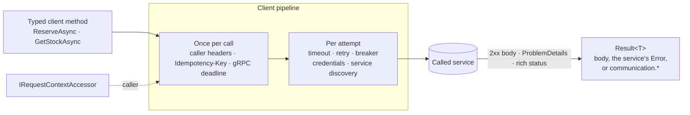

<div align="center">

# SharedKernel Communication

**Outbound service-to-service calls for .NET services — typed REST and gRPC clients configured from
`appsettings.json`, resilient without repeating side effects, that carry the caller to the next service and return
`Result` instead of throwing.**

[](https://dotnet.microsoft.com/)
[](../../../LICENSE)


[](https://learn.microsoft.com/dotnet/core/resilience/http-resilience)
[](https://learn.microsoft.com/dotnet/core/extensions/service-discovery)
[](https://github.com/grpc/grpc-dotnet)

[What you get](#what-you-get) · [Packages](#packages) · [How it fits together](#how-it-fits-together) · [Get started](#get-started) · [See it run](#see-it-run) · [Guarantees](#guarantees)

<sub>📂 <code>src/Infrastructure/Communication</code> · <a href="../../../docs/packages.md">all packages by tier</a> · <a href="../../../README.md">Platform.SharedKernel</a></sub>

</div>

---

## What you get

- **One registration, settings in configuration.** `AddSharedKernelCommunication(configuration)` plus one
  `AddRestClient`/`AddGrpcClient` per service; every client's address, timeouts, retries and credentials live under
  `SharedKernel:Communication:Clients:{name}` and are validated when the host starts.
- **Addresses that work everywhere.** Service discovery through `Microsoft.Extensions.ServiceDiscovery` —
  configuration (the shape Aspire emits), Kubernetes DNS or DNS SRV, resolved per attempt.
- **Resilience that never repeats a side effect.** `Microsoft.Extensions.Http.Resilience` for REST, the channel retry
  policy for gRPC; a POST or PATCH is retried only with an `Idempotency-Key`.
- **The caller travels.** Correlation id, tenant, actor and client from `IRequestContextAccessor` go on every call,
  whether it starts in an HTTP request, a message consumer, a workflow activity or a scheduled job.
- **Errors round-trip.** ProblemDetails and rich gRPC statuses become the called service's own `Error`; a call with no
  answer is `communication.unreachable`, `.timeout` or `.circuit_open` (`CommunicationErrorCodes`).

## Packages

| Package | Tier | Reference it from | Use it for |
| --- | --- | --- | --- |
| [SharedKernel.Communication](SharedKernel.Communication/README.md) | Adapter | Infrastructure | The shared base: service discovery, outbound credentials (client credentials, API key, `IAccessTokenProvider`), mutual TLS, `communication.*` codes |
| [SharedKernel.Communication.Rest](SharedKernel.Communication.Rest/README.md) | Adapter | Infrastructure | Typed `HttpClient`s: `AddRestClient<IClient, Client>(name)`, `GetResultAsync`/`PostResultAsync` → `Result<T>` |
| [SharedKernel.Communication.Grpc](SharedKernel.Communication.Grpc/README.md) | Adapter | Infrastructure | Typed gRPC clients: `AddGrpcClient<T>(name)`, `call.ToResultAsync()`, `google.type.Money` ↔ `Money` |
| [SharedKernel.Communication.Testing](SharedKernel.Communication.Testing/README.md) | Testing | test projects | `StubHttpMessageHandler`, `GrpcCalls`, `TestServerCallContext` — the real client pipeline without a network |

Reference Rest or Grpc (or both) from the Infrastructure project; each brings the base with it. Nothing here
references ASP.NET Core. The server side of the same contracts — ProblemDetails and rich statuses — is in
[Presentation](../../Hosting/Presentation/README.md).

## How it fits together



- **Headers once, attempts many.** Propagation and the idempotency key sit outside the resilience handler, so every
  retry carries the same correlation id and key; credentials and the address are resolved per attempt, so a retry
  can reach another pod with a fresh token.
- **Caller-supplied values win.** A header, metadata entry, `Authorization` or deadline you set is never overwritten.
- **Only your own cancellation throws.** Unreachable, timed out, circuit open and no access token are all `Error`
  values; the correlation id is the caller's end to end, never `Activity.Id`.
- **The host opens the context.** `AddSharedKernelRequestContext()` + `app.UseSharedKernelRequestContext()`
  ([ServiceDefaults](../../Hosting/ServiceDefaults/README.md)) supply the caller; `WithCommunicationTelemetry()` adds
  outbound spans and resilience metrics.

## Get started

```xml
<PackageReference Include="SharedKernel.Communication.Rest" />   <!-- Infrastructure -->
<PackageReference Include="SharedKernel.Communication.Grpc" />   <!-- Infrastructure, if you call over gRPC -->
```

```csharp
builder.Services.AddSharedKernelCommunication(builder.Configuration)   // SharedKernel:Communication:Clients:{name}
    .AddRestClient<IInventoryClient, InventoryClient>("inventory")
    .AddGrpcClient<Inventory.InventoryClient>("inventory-grpc");

public sealed class InventoryClient(HttpClient http) : IInventoryClient
{
    public Task<Result<Reservation>> ReserveAsync(ReserveRequest request, CancellationToken ct) =>
        http.PostResultAsync("reservations", request,
            InventoryJson.Default.ReserveRequest, InventoryJson.Default.Reservation, ct);
}

public sealed class StockReader(Inventory.InventoryClient client)
{
    public Task<Result<StockReply>> GetAsync(string sku, CancellationToken ct) =>
        client.GetStockAsync(new GetStockRequest { Sku = sku }, cancellationToken: ct).ToResultAsync(ct);
}
```

```json
{
  "SharedKernel": { "Communication": { "Clients": {
    "inventory": { "BaseAddress": "http://inventory", "PropagateIdempotencyKey": true },
    "inventory-grpc": { "Address": "http://_grpc.inventory", "Deadline": "00:00:05" } } } },
  "Services": { "inventory": { "http": [ "http://localhost:5080" ] } }
}
```

Credentials, TLS, hedging and every option are in the
[SharedKernel.Communication.Rest Quick start](SharedKernel.Communication.Rest/README.md#quick-start), the
[SharedKernel.Communication.Grpc Quick start](SharedKernel.Communication.Grpc/README.md#quick-start) and the
[SharedKernel.Communication](SharedKernel.Communication/README.md#quick-start) base README.

## See it run

[**samples/CheckoutApi**](../../../samples/CheckoutApi/README.md) → [**samples/InventoryApi**](../../../samples/InventoryApi/)
are two services talking over both protocols: CheckoutApi prices over gRPC and reserves over REST, both resolved
through the `Services` section and both sending InventoryApi's API key. `CheckoutApi.Tests` (no Docker) proves a
replayed reservation is made once, InventoryApi's 404, 409 and field errors come back unchanged, and an outage is a
503 rather than an exception. After packing the kernel:

```bash
dotnet run --project samples/InventoryApi -p:SharedKernelPackageVersion=$V --environment Development
dotnet run --project samples/CheckoutApi -p:SharedKernelPackageVersion=$V --environment Development
```

## Guarantees

| Guarantee | How it is held |
| --- | --- |
| **Retries never repeat a side effect** | `RestPipelineTests`: a failed POST is not retried without an idempotency key, one key spans its retries, hedging never races a POST |
| **Every switch is real** | `RestPipelineTests`: zero retries means one attempt, a disabled circuit never opens |
| **The caller travels, once** | `RestPipelineTests` and `GrpcClientTests`: the caller rides on every request; a call without one keeps one new correlation id across retries |
| **Caller-supplied values win** | `A_header_the_request_has_is_kept`, `Metadata_the_call_carries_is_kept`, `A_request_with_its_own_authorization_keeps_it`, `Every_call_gets_the_configured_deadline_unless_it_sets_its_own` |
| **Failures are values** | `HttpResultTests` and `GrpcClientTests`: unreachable, past-deadline and no-token calls are `Error`s; only the caller's cancellation throws. `ProblemDetailsDeserializerTests`: the code is never taken from `title` or `type` |
| **Bad settings stop the host** | `ClientOptionsValidationTests` and `RestClientRegistrationTests`: a missing address or invalid settings fail at startup, naming the setting |
| **Secrets stay out of logs** | `A_token_never_prints_its_value`; `LoggingEventIdIntegrityRealAssemblyTests` keeps every event id in the Communication range |
| **Clean layering** | `CommunicationLayeringRules`: gRPC never references the Contracts package and interceptors live only in `SharedKernel.Communication.Grpc`; analyzer `SK0013` flags a raw `HttpClient` constructor outside a typed client |

**Out of scope:** inbound middleware and server conventions ([Presentation](../../Hosting/Presentation/README.md)),
bus publishing ([Messaging](../Messaging/README.md)), and calls to parties outside the platform
([Integration](../Integration/README.md)).

---

<div align="center">
<sub>Part of <a href="../../../README.md">Platform.SharedKernel</a> · <a href="../../../docs/packages.md">all packages</a> · MIT license</sub>
</div>
