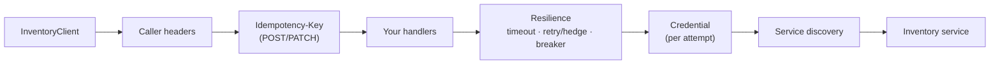

# SharedKernel.Communication.Rest

[](https://dotnet.microsoft.com/)
[](https://github.com/Gresta-Vertex-Labs/platform-shared-kernel/blob/main/LICENSE)


> **Typed REST clients in one line each: address, timeouts, retries and credentials from configuration, the caller on
> every call, and methods that return `Result<T>` — the other service's own `Error`, or a coded failure when it did
> not answer — instead of throwing.** Use it to call another service over HTTP/JSON; for a gRPC service use
> [`SharedKernel.Communication.Grpc`](https://github.com/Gresta-Vertex-Labs/platform-shared-kernel/blob/main/src/Infrastructure/Communication/SharedKernel.Communication.Grpc/README.md).
> Discovery, credentials and mTLS come from
> [`SharedKernel.Communication`](https://github.com/Gresta-Vertex-Labs/platform-shared-kernel/blob/main/src/Infrastructure/Communication/SharedKernel.Communication/README.md).

| You get | So that |
| --- | --- |
| `AddRestClient<IClient, Client>("name")` | A typed `HttpClient` wired from `SharedKernel:Communication:Clients:{name}` |
| Microsoft.Extensions.Http.Resilience pipeline | Timeouts, retries (or hedging) and a circuit breaker with sane defaults |
| POST/PATCH retried only with an `Idempotency-Key` | A retry after a lost response never places the order twice |
| `GetResultAsync` / `PostResultAsync` / `PutResultAsync` / `DeleteResultAsync` | Client methods are one line and return `Result<T>` |
| ProblemDetails → `Error` | The called service's code, message, `ErrorType` and field errors arrive intact |
| Caller headers from `IRequestContextAccessor` | Correlation id, tenant, actor and client flow downstream automatically |

## Contents

- [Install](#install)
- [Quick start](#quick-start)
- [How it works](#how-it-works)
- [Recipes](#recipes)
- [Configuration](#configuration)
- [Reference](#reference)
- [Testing](#testing)
- [Pitfalls](#pitfalls)

## Install

```xml
<PackageReference Include="SharedKernel.Communication.Rest" />
```

The version comes from your central `SharedKernelVersion` property — every SharedKernel package ships at the same
version. See [Using the packages](https://github.com/Gresta-Vertex-Labs/platform-shared-kernel#using-the-packages).

| Requirement | Value |
| --- | --- |
| Target framework | `net10.0` |
| Tier | Adapter — reference it from your **Infrastructure** project |
| Depends on | [`SharedKernel.Communication`](https://github.com/Gresta-Vertex-Labs/platform-shared-kernel/blob/main/src/Infrastructure/Communication/SharedKernel.Communication/README.md), `SharedKernel.Primitives`, `SharedKernel.Execution`, `Microsoft.Extensions.Http.Resilience` |
| Namespaces | `SharedKernel.Communication` |

## Quick start

```csharp
using SharedKernel.Communication;

builder.Services.AddSharedKernelCommunication(builder.Configuration)
    .AddRestClient<IInventoryClient, InventoryClient>("inventory");
```

```json
{
  "SharedKernel": {
    "Communication": {
      "Clients": {
        "inventory": {
          "BaseAddress": "http://inventory",
          "AttemptTimeout": "00:00:05",
          "PropagateIdempotencyKey": true,
          "Authentication": { "Mode": "ApiKey", "ApiKey": { "Value": "(from a secret store)" } }
        }
      }
    }
  },
  "Services": { "inventory": { "http": [ "http://localhost:5080" ] } }
}
```

```csharp
using SharedKernel.Communication;
using SharedKernel.Primitives.Results;

public sealed class InventoryClient(HttpClient http) : IInventoryClient
{
    public Task<Result<StockLevel>> GetStockAsync(string sku, CancellationToken ct) =>
        http.GetResultAsync($"stock/{Uri.EscapeDataString(sku)}", InventoryJson.Default.StockLevel, ct);

    public Task<Result<Reservation>> ReserveAsync(ReserveRequest request, CancellationToken ct) =>
        http.PostResultAsync("reservations", request,
            InventoryJson.Default.ReserveRequest, InventoryJson.Default.Reservation, ct);
}
```

`InventoryJson` is your `JsonSerializerContext`; each verb with a body also has a reflection overload
(`JsonSerializerOptions.Web`). The Shop's Ordering service uses the source-generated form for its call to Billing
([`RestPayments`](https://github.com/Gresta-Vertex-Labs/platform-shared-kernel/blob/main/samples/Shop/Ordering/Shop.Ordering.Infrastructure/Billing/RestPayments.cs)).

## How it works



- **What every call carries**, outermost first: the caller's correlation id, tenant, actor and client
  (`WellKnownHeaders`, the same on every retry; a request's own header wins); the `Idempotency-Key`; your handlers;
  then, per attempt, the resilience pipeline, the credential, and service discovery choosing the endpoint.
- **Retries never repeat a side effect.** GET, HEAD, OPTIONS, PUT and DELETE are idempotent (RFC 9110) and retried on a
  lost connection, a timeout, 408, 429 and 5xx; a `Retry-After` wins over the backoff. **POST and PATCH are retried
  only with an `Idempotency-Key`**: with `PropagateIdempotencyKey`, each gets a new key per call, set before the first
  attempt and repeated by every retry. A key the request already has is kept. Hedging follows the same rule.
- **Results, not exceptions:**

  | Outcome | Result |
  | --- | --- |
  | 2xx | Success; the body read as `T` |
  | 2xx without a body / not valid JSON for `T` | `communication.empty_body` / `communication.invalid_body` |
  | A platform ProblemDetails | The service's `Error`: `errorCode` → `Code`, `detail` → `Message`, the status → `ErrorType` |
  | 400 or 422 with `errors` | `Error.Validation` of the field errors (the `errorCodes` map gives each its code) |
  | A body without a code (a gateway's HTML 503) | `http.{status}` with the status's `ErrorType` |
  | No response | `communication.unreachable`, `.timeout`, `.circuit_open`, `.access_token_unavailable` |
  | The caller's own cancellation | Thrown (`OperationCanceledException`) |

  Status → `ErrorType` is the reverse of the map `SharedKernel.Presentation.Core` applies on the server: 400 Validation, 401 Unauthorized, 403 Forbidden, 404
  NotFound, 409 and 412 Conflict, 413/415/428 Validation, 422 BusinessRule, 429 and 503 Unavailable, 504 Timeout,
  anything else Unexpected. The code is never `title` (a reason phrase) or `type` (a URI).

## Recipes

### 1. Adjust a client in code

```csharp
.AddRestClient<IInventoryClient, InventoryClient>("inventory", client => client
    .Configure(o => o.AttemptTimeout = TimeSpan.FromSeconds(3))   // applied after configuration binding
    .UseHedging()                                                // parallel attempts instead of retries
    .UseAccessTokenProvider<ManagedIdentityTokenProvider>())     // your own credential
```

`client.HttpClientBuilder` is the underlying `IHttpClientBuilder`, for a handler of your own.

### 2. Make a POST safe to retry across your own re-runs

Turn on `PropagateIdempotencyKey`. When the call must be recognised across a redelivered message or a restarted job,
set `Idempotency-Key` on the request yourself — derived from what identifies the operation — and send it with
`SendResultAsync`; the key you set is kept.

### 3. Read a response you sent yourself

`response.ToResultAsync(ct)` and `response.ReadResultAsync<T>(typeInfo, ct)` (`HttpResponseMessageResultExtensions`)
apply the same mapping to an `HttpResponseMessage`.

## Configuration

Section `SharedKernel:Communication:Clients:{name}` (`RestClientOptions`), validated when the host starts. The defaults
are Microsoft.Extensions.Http.Resilience's standard pipeline.

| Key | Type | Default | Meaning |
| --- | --- | --- | --- |
| `…:Clients:{name}:BaseAddress` | `Uri` | — (required) | `http://inventory`, `https+http://inventory`, `https://api.example.com/v2/`; end a base path with `/` |
| `…:Clients:{name}:AttemptTimeout` | `TimeSpan` | `00:00:10` | One attempt (up to 10 min) |
| `…:Clients:{name}:TotalTimeout` | `TimeSpan` | `00:00:30` | The whole call, retries and delays included; at least `AttemptTimeout` |
| `…:Clients:{name}:Retry:MaxRetryAttempts` | `int` | `3` | Retries after the first attempt (0–10); `0` turns retries off |
| `…:Clients:{name}:Retry:BaseDelay` | `TimeSpan` | `00:00:00.5` | First retry delay; doubles with jitter |
| `…:Clients:{name}:Retry:RetryNonIdempotentMethods` | `bool` | `false` | Retry POST/PATCH without an `Idempotency-Key` |
| `…:Clients:{name}:CircuitBreaker:Enabled` | `bool` | `true` | `false` removes the breaker |
| `…:Clients:{name}:CircuitBreaker:FailureRatio` | `double` | `0.1` | Share of failed calls that opens it |
| `…:Clients:{name}:CircuitBreaker:MinimumThroughput` | `int` | `100` | Calls the window must see before it may open (≥ 2) |
| `…:Clients:{name}:CircuitBreaker:SamplingDuration` | `TimeSpan` | `00:00:30` | Counting window; at least twice `AttemptTimeout` |
| `…:Clients:{name}:CircuitBreaker:BreakDuration` | `TimeSpan` | `00:00:05` | How long it stays open (0.5 s – 1 day) |
| `…:Clients:{name}:Hedging:MaxHedgedAttempts` | `int` | `1` | Extra parallel attempts, with `UseHedging()` (1–10) |
| `…:Clients:{name}:Hedging:Delay` | `TimeSpan` | `00:00:02` | How long an attempt runs before the next starts |
| `…:Clients:{name}:PropagateIdempotencyKey` | `bool` | `false` | Every POST/PATCH gets an `Idempotency-Key`, which also lets them be retried |
| `…:Clients:{name}:Authentication:*`, `…:Tls:*` | | none | See [`SharedKernel.Communication`](https://github.com/Gresta-Vertex-Labs/platform-shared-kernel/blob/main/src/Infrastructure/Communication/SharedKernel.Communication/README.md#configuration) |

`…` stands for `SharedKernel:Communication`.

## Reference

### Registration

| Method | Registers |
| --- | --- |
| `AddRestClient<TClient, TImplementation>(name, Action<IRestClientBuilder>?)` | The interface the application injects, implemented by a class taking `HttpClient` |
| `AddRestClient<TClient>(name, Action<IRestClientBuilder>?)` | A class injected as itself; an interface or abstract type is refused |
| `IRestClientBuilder.Configure(Action<RestClientOptions>)` | Options changed in code after binding |
| `IRestClientBuilder.UseHedging()` | Hedging instead of retries |
| `IRestClientBuilder.UseAccessTokenProvider<TProvider>()` | An `IAccessTokenProvider` as the credential |

### Result extensions

| Type | Methods |
| --- | --- |
| `HttpClientResultExtensions` | `GetResultAsync<T>`, `PostResultAsync`, `PutResultAsync`, `SendResultAsync` — each with a `JsonTypeInfo<T>` overload (trimming- and AOT-safe) and a reflection one; `PostResultAsync`/`PutResultAsync`/`SendResultAsync` also return a plain `Result` when no body is read. `DeleteResultAsync(uri, ct)` → `Result` |
| `HttpResponseMessageResultExtensions` | `ToResultAsync` → `Result`, `ReadResultAsync<T>` → `Result<T>` (`JsonTypeInfo<T>` or reflection) |

### Errors

The `communication.*` codes are listed in
[`SharedKernel.Communication`](https://github.com/Gresta-Vertex-Labs/platform-shared-kernel/blob/main/src/Infrastructure/Communication/SharedKernel.Communication/README.md#errors);
an uncoded failure is `http.{status}` (`http.503`).

### Logging

EventIds 11200–11299 are reserved for this package; it logs nothing of its own (credential events, 11000–11004, come
from `SharedKernel.Communication`). Outbound HTTP spans and resilience metrics come from `WithCommunicationTelemetry()`
in [`SharedKernel.ServiceDefaults`](https://github.com/Gresta-Vertex-Labs/platform-shared-kernel/blob/main/src/Hosting/ServiceDefaults/SharedKernel.ServiceDefaults/README.md).

## Testing

Reference [`SharedKernel.Communication.Testing`](https://github.com/Gresta-Vertex-Labs/platform-shared-kernel/blob/main/src/Infrastructure/Communication/SharedKernel.Communication.Testing/README.md):

```csharp
using System.Net;
using SharedKernel.Testing.Communication;

var stub = new StubHttpMessageHandler()
    .RespondJson(HttpMethod.Get, "/stock/sku-1", new StockLevel("sku-1", 3))
    .RespondProblem(HttpMethod.Post, "/reservations", HttpStatusCode.Conflict, "inventory.insufficient_stock");
services.UseStubHttpMessageHandler("inventory", stub);   // after AddRestClient
```

The client's whole pipeline runs — headers, idempotency key, retries, error mapping — and `stub.Requests` records
every attempt it sent.

## Pitfalls

| Don't | Do | Why |
| --- | --- | --- |
| Turn on `Retry:RetryNonIdempotentMethods` to "fix" flaky POSTs | Use `PropagateIdempotencyKey` and make the service honour the key | A retry after a lost response repeats the side effect |
| `new HttpClient()` or build a `Uri` in a client method | Take `HttpClient` in a primary constructor, use relative paths | The pipeline (discovery, credential, resilience) lives on the injected client |
| Branch on `IsSuccessStatusCode` and parse ProblemDetails yourself | Return `http.PostResultAsync(...)` | The mapping already restores the service's `Error` and field errors |
| Drop the trailing `/` from a base path (`…/v2`) | End it with `/` (`…/v2/`) | A relative path replaces the last segment otherwise |
| Set `SamplingDuration` below twice `AttemptTimeout` | Keep the window at least twice the attempt timeout | Validation fails the host at startup |

---

Part of [Platform.SharedKernel](https://github.com/Gresta-Vertex-Labs/platform-shared-kernel) ·
[Communication packages](https://github.com/Gresta-Vertex-Labs/platform-shared-kernel/blob/main/src/Infrastructure/Communication/README.md) ·
[MIT license](https://github.com/Gresta-Vertex-Labs/platform-shared-kernel/blob/main/LICENSE)
