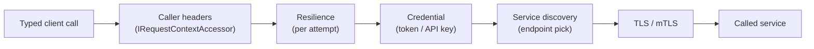

# SharedKernel.Communication

[](https://dotnet.microsoft.com/)
[](https://github.com/Gresta-Vertex-Labs/platform-shared-kernel/blob/main/LICENSE)


> **The shared base of every outbound client: service discovery, outbound credentials, mutual TLS and the caller's
> context, configured per client and validated at startup. You rarely reference it directly — the REST and gRPC
> packages bring it.**

| You get | So that |
| --- | --- |
| `AddSharedKernelCommunication(configuration)` | One call, then one `AddRestClient`/`AddGrpcClient` per service you call |
| Settings under `SharedKernel:Communication:Clients:{name}` | Addresses, timeouts, retries and credentials live in configuration, checked when the host starts |
| Service discovery (`Microsoft.Extensions.ServiceDiscovery`) | `http://inventory` works locally, under Aspire, and in Kubernetes (DNS, DNS SRV, round-robin per request) |
| OAuth client credentials, API key, `IAccessTokenProvider` | Tokens are cached, refreshed early and retried once on a 401 — no hand-written auth handlers |
| Client certificates and a private CA | Mutual TLS from PEM or PKCS#12 files, rotated on disk without a restart |
| `CommunicationErrorCodes` | A call that never got an answer is a `Result` failure with a stable code, not an exception |

## Contents

- [Install](#install)
- [Quick start](#quick-start)
- [How it works](#how-it-works)
- [Recipes](#recipes)
- [Configuration](#configuration)
- [Reference](#reference)
- [Testing](#testing)
- [Pitfalls](#pitfalls)
- [Design decisions](#design-decisions)

## Install

```xml
<PackageReference Include="SharedKernel.Communication" />
```

The version comes from your central `SharedKernelVersion` property — every SharedKernel package ships at the same
version. See [Using the packages](https://github.com/Gresta-Vertex-Labs/platform-shared-kernel#using-the-packages).
Usually you reference [`SharedKernel.Communication.Rest`](https://github.com/Gresta-Vertex-Labs/platform-shared-kernel/blob/main/src/Infrastructure/Communication/SharedKernel.Communication.Rest/README.md)
or [`SharedKernel.Communication.Grpc`](https://github.com/Gresta-Vertex-Labs/platform-shared-kernel/blob/main/src/Infrastructure/Communication/SharedKernel.Communication.Grpc/README.md)
instead, which bring this package.

| Requirement | Value |
| --- | --- |
| Target framework | `net10.0` |
| Tier | Adapter — reference it from your **Infrastructure** project |
| Depends on | `SharedKernel.Primitives`, `SharedKernel.Execution`, `SharedKernel.Configuration`, `Microsoft.Extensions.Http.Resilience`, `Microsoft.Extensions.ServiceDiscovery(.Dns)` |
| Namespaces | `SharedKernel.Communication` |

## Quick start

```csharp
using SharedKernel.Communication;

builder.Services.AddSharedKernelCommunication(builder.Configuration)          // SharedKernel:Communication
    .AddRestClient<IInventoryClient, InventoryClient>("inventory")            // SharedKernel.Communication.Rest
    .AddGrpcClient<Inventory.InventoryClient>("inventory-grpc");              // SharedKernel.Communication.Grpc
```

```json
{
  "SharedKernel": {
    "Communication": {
      "ServiceDiscovery": { "Mode": "Configuration" },
      "Clients": {
        "inventory": { "BaseAddress": "http://inventory" },
        "inventory-grpc": { "Address": "http://_grpc.inventory" }
      }
    }
  },
  "Services": {
    "inventory": { "http": [ "http://localhost:5080" ], "grpc": [ "http://localhost:5081" ] }
  }
}
```

A client name is used once, across REST and gRPC: it is both the `IHttpClientFactory` name and the configuration
section. Calling `AddSharedKernelCommunication` again returns a builder over the same registrations, so a module may
call it on its own.

## How it works



- **Service discovery.** A client's address names a service, not a machine. Sources, in order of precedence:

  | Source | When |
  | --- | --- |
  | `Services:{service}:{endpoint}` in configuration | Always, first — the shape .NET Aspire and `services__inventory__http__0` environment variables produce |
  | DNS A/AAAA records | `ServiceDiscovery:Mode` = `Dns`: every address of a **headless** Kubernetes service, round-robin per request (use it for gRPC) |
  | DNS SRV records | `ServiceDiscovery:Mode` = `DnsSrv`: the endpoints and ports Kubernetes publishes for named ports |
  | The host as written | Always, last: `http://inventory.shop.svc.cluster.local` is resolved by the operating system |

  `http://_grpc.inventory` picks the endpoint named `grpc`; `https+http://inventory` prefers HTTPS when the service
  has an HTTPS endpoint. Endpoints are resolved again every `RefreshPeriod`. In the DNS modes the request goes to a
  pod's address while the `Host` header and the TLS server name stay the service's name.
- **The caller travels.** Every call carries the ambient caller's correlation id, tenant, actor and client
  (`WellKnownHeaders`, from `IRequestContextAccessor`) — from an HTTP request, a message consumer, a workflow activity
  or a scheduled job alike.
- **Credentials run per attempt.** The token handler sits inside the retry loop, so every attempt carries a valid
  token. Client-credentials tokens are cached per credential, refreshed `RefreshBeforeExpiry` before expiry (or
  half-way through a short-lived token), and concurrent callers share one token request. A 401 to a token the handler
  added is answered once with a new token. Secrets are read per request, so a rotated key takes effect without a restart.
- **Fails closed on credentials.** When no token can be had the request is not sent: it fails with
  `communication.access_token_unavailable` (`AccessTokenUnavailableException`, an `HttpRequestException`).
- **TLS files are re-read** whenever the connection handler is rebuilt (every two minutes), so a certificate rotated
  on disk by cert-manager is picked up. Missing files fail startup. A host-name mismatch is never accepted; revocation
  is not checked.

## Recipes

### 1. Call a service with OAuth 2.0 client credentials

```json
"inventory": {
  "BaseAddress": "http://inventory",
  "Authentication": {
    "Mode": "ClientCredentials",
    "ClientCredentials": {
      "TokenEndpoint": "https://login.example.com/oauth2/token",
      "ClientId": "checkout",
      "ClientSecret": "(from a secret store)",
      "Scope": "inventory.read inventory.reserve"
    }
  }
}
```

### 2. Send an API key

```json
"Authentication": { "Mode": "ApiKey", "ApiKey": { "Value": "(from a secret store)" } }
```

The header defaults to `X-Api-Key`, the one `SharedKernel.Security.ApiKey` reads on the other side.

### 3. Use a managed identity or token exchange

```csharp
using SharedKernel.Communication;
using SharedKernel.Primitives.Results;

public sealed class ManagedIdentityTokenProvider : IAccessTokenProvider
{
    public ValueTask<Result<AccessToken>> GetAccessTokenAsync(AccessTokenContext context, CancellationToken cancellationToken)
    {
        // Cache the token yourself; context.ForceRefresh is true after the service answered 401.
        ...
    }
}

.AddRestClient<IInventoryClient, InventoryClient>("inventory", client => client
    .UseAccessTokenProvider<ManagedIdentityTokenProvider>())
```

The provider is called for every attempt. A failed `Result` fails the call with
`communication.access_token_unavailable`. `AccessToken.ToString()` is redacted, so a token never reaches a log.

### 4. Present a client certificate to a private-PKI service

```json
"Tls": {
  "CertificatePath": "/var/run/secrets/tls/tls.crt",
  "PrivateKeyPath": "/var/run/secrets/tls/tls.key",
  "TrustedCertificateAuthoritiesPath": "/var/run/secrets/tls/ca.crt"
}
```

With `TrustedCertificateAuthoritiesPath` the server must chain to one of these authorities — only these, not the
machine's store.

### 5. Spread gRPC calls across pods in Kubernetes

Point the client at a **headless** service and set `SharedKernel:Communication:ServiceDiscovery:Mode` to `Dns`: each
call goes to the next pod address, round-robin, and `RefreshPeriod` follows pods that come and go.

## Configuration

Section `SharedKernel:Communication`, validated when the host starts. Per-client keys below are shared by REST and
gRPC clients (`CommunicationClientOptions`); each protocol adds its own — see the
[Rest](https://github.com/Gresta-Vertex-Labs/platform-shared-kernel/blob/main/src/Infrastructure/Communication/SharedKernel.Communication.Rest/README.md#configuration)
and [Grpc](https://github.com/Gresta-Vertex-Labs/platform-shared-kernel/blob/main/src/Infrastructure/Communication/SharedKernel.Communication.Grpc/README.md#configuration) READMEs.

| Key | Type | Default | Meaning |
| --- | --- | --- | --- |
| `SharedKernel:Communication:ServiceDiscovery:Mode` | `Configuration` \| `Dns` \| `DnsSrv` | `Configuration` | Where endpoints come from beyond the `Services` section. Read once, at registration |
| `SharedKernel:Communication:ServiceDiscovery:RefreshPeriod` | `TimeSpan` | `00:01:00` | How often endpoints are resolved again (1 s – 1 h) |
| `SharedKernel:Communication:ServiceDiscovery:DnsSrvQuerySuffix` | `string` | — | Domain appended for DNS SRV queries; leave empty inside Kubernetes (the pod's namespace is used) |
| `…:Clients:{name}:Authentication:Mode` | `None` \| `ClientCredentials` \| `ApiKey` \| `AccessTokenProvider` | `None` | The credential sent. `AccessTokenProvider` is set by `UseAccessTokenProvider<T>()`, not by configuration |
| `…:Clients:{name}:Authentication:ClientCredentials:TokenEndpoint` | `Uri` | — (required for `ClientCredentials`) | The authorization server's token endpoint |
| `…:Clients:{name}:Authentication:ClientCredentials:ClientId` | `string` | — (required) | The client id |
| `…:Clients:{name}:Authentication:ClientCredentials:ClientSecret` | `string` | — (required) | The client secret; keep it in a secret store |
| `…:Clients:{name}:Authentication:ClientCredentials:Scope` | `string` | — | Space-separated scopes |
| `…:Clients:{name}:Authentication:ClientCredentials:Audience` | `string` | — | The `audience` parameter (Auth0, Okta) |
| `…:Clients:{name}:Authentication:ClientCredentials:Resource` | `string` | — | The `resource` parameter (RFC 8707) |
| `…:Clients:{name}:Authentication:ClientCredentials:SecretTransport` | `BasicAuthentication` \| `RequestBody` | `BasicAuthentication` | `client_secret_basic` or `client_secret_post` |
| `…:Clients:{name}:Authentication:ClientCredentials:RefreshBeforeExpiry` | `TimeSpan` | `00:01:00` | How long before expiry a new token is fetched (0 – 1 h) |
| `…:Clients:{name}:Authentication:ApiKey:HeaderName` | `string` | `X-Api-Key` | The header the key is sent in |
| `…:Clients:{name}:Authentication:ApiKey:Value` | `string` | — (required for `ApiKey`) | The key; keep it in a secret store |
| `…:Clients:{name}:Tls:CertificatePath` | `string` | — | Client certificate: PEM (with `PrivateKeyPath`, or the key in the same file) or PKCS#12 |
| `…:Clients:{name}:Tls:PrivateKeyPath` | `string` | — | PEM private key of a PEM certificate |
| `…:Clients:{name}:Tls:CertificatePassword` | `string` | — | Password of a PKCS#12 file or an encrypted PEM key |
| `…:Clients:{name}:Tls:TrustedCertificateAuthoritiesPath` | `string` | — | PEM file of the only authorities the server may chain to |
| `Services:{service}:{endpoint}` | `string[]` | — | Configured endpoints (Aspire shape); always consulted first |

`…` stands for `SharedKernel:Communication`. Pass `configure` to `AddSharedKernelCommunication` to change
`CommunicationOptions` in code after binding.

## Reference

### Registration

| Method | Registers |
| --- | --- |
| `AddSharedKernelCommunication(IConfiguration, Action<CommunicationOptions>?)` | `CommunicationOptions` (validated), service discovery, `IRequestContextAccessor` and `IClock` (if absent), the client-credentials token client; returns `ICommunicationBuilder` |
| `ICommunicationBuilder.Services` / `.Configuration` | What `AddRestClient` and `AddGrpcClient` extend |

### Main types

| Type | Purpose |
| --- | --- |
| `IAccessTokenProvider` | Supplies a token per attempt: `GetAccessTokenAsync(AccessTokenContext, CancellationToken)` → `Result<AccessToken>` |
| `AccessToken(Value, ExpiresAt, Scheme = "Bearer")` | A token; `ToString()` is redacted |
| `AccessTokenContext(ClientName, ForceRefresh)` | Which client asks, and whether the last token was refused |
| `AccessTokenUnavailableException` | Thrown into the HTTP pipeline when no token could be had; carries `ClientName` and `Error` |
| `CommunicationOptions`, `CommunicationClientOptions`, `ClientAuthenticationOptions`, `ClientTlsOptions` | The bound options |

### Errors

`CommunicationErrorCodes` — a call that failed on the caller's side of the wire:

| Code | Type | When |
| --- | --- | --- |
| `communication.unreachable` | Unavailable | No response: refused, reset, unresolvable, TLS failed |
| `communication.timeout` | Timeout | An attempt, or the whole call with its retries, ran out of time |
| `communication.circuit_open` | Unavailable | Refused without being sent while the circuit breaker is open |
| `communication.access_token_unavailable` | Unavailable | No access token; the request was not sent |
| `communication.empty_body` | Unexpected | A success response with no body where one was expected |
| `communication.invalid_body` | Unexpected | A success body that is not valid JSON for the expected type |

A failure the called service reported keeps the service's own code; one without a code becomes `http.{status}` or
`grpc.{status}`.

### Logging

| Event id | Level | Event |
| --- | --- | --- |
| 11000 | Debug | Acquired an access token from `{TokenEndpoint}` for client id `{ClientId}`, valid for `{Lifetime}` |
| 11001 | Warning | The token endpoint refused the client (`{StatusCode}`, OAuth error `{OAuthError}`) |
| 11002 | Warning | The token endpoint could not be reached |
| 11003 | Warning | Client `{ClientName}` has no access token (`{ErrorCode}`); the request was not sent |
| 11004 | Debug | Client `{ClientName}` was answered 401; sending once more with a new token |

Tokens and secrets are never logged. Outbound spans and resilience metrics come from `13.ServiceDefaults`'
`WithCommunicationTelemetry()`.

## Testing

Reference [`SharedKernel.Communication.Testing`](https://github.com/Gresta-Vertex-Labs/platform-shared-kernel/blob/main/src/Infrastructure/Communication/SharedKernel.Communication.Testing/README.md)
(namespace `SharedKernel.Testing.Communication`) from your test project:

- `StubHttpMessageHandler` + `services.UseStubHttpMessageHandler("inventory", stub)` runs a REST client's whole
  pipeline — caller headers, credential, retries, error mapping — against canned answers; `stub.Requests` records
  what was sent.
- `GrpcCalls.Success(response)` / `GrpcCalls.Failure<T>(error)` stand in for a generated gRPC client's calls.

## Pitfalls

| Don't | Do | Why |
| --- | --- | --- |
| Put `ClientSecret` or `ApiKey:Value` in `appsettings.json` | Load them from a secret store or environment | They are credentials; secrets are read per request, so rotation needs no restart |
| Point a gRPC client at a ClusterIP service | Use a headless service and `ServiceDiscovery:Mode` = `Dns` | HTTP/2 connections are long-lived; ClusterIP pins every call to one pod |
| Reuse one client name for a REST and a gRPC client | Give each client its own name | The name is both the `IHttpClientFactory` name and the configuration section; a duplicate is refused |
| Cache nothing in your `IAccessTokenProvider` | Cache the token and honour `ForceRefresh` | It is called for every attempt |
| Build a `Uri` from a pod IP or port in code | Name the service (`http://inventory`) and let discovery resolve it | Endpoints change; discovery follows them every `RefreshPeriod` |

## Design decisions

**Why `Microsoft.Extensions.ServiceDiscovery`?** It is MIT, the library .NET Aspire uses, and its configuration shape
is what Aspire and Kubernetes environment variables already produce — no custom resolver to maintain.

**Why does a missing token stop the request?** Sending it unauthenticated would only earn a 401 and leak a request
the caller did not mean to send anonymously; a coded `Result` failure is easier to branch on.

---

Part of [Platform.SharedKernel](https://github.com/Gresta-Vertex-Labs/platform-shared-kernel) ·
[Communication domain](https://github.com/Gresta-Vertex-Labs/platform-shared-kernel/blob/main/src/Infrastructure/Communication/README.md) ·
[MIT license](https://github.com/Gresta-Vertex-Labs/platform-shared-kernel/blob/main/LICENSE)
