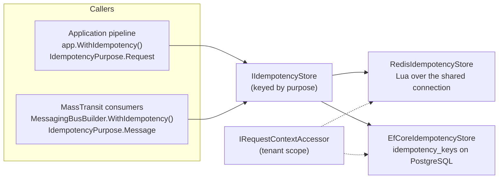

<div align="center">

# SharedKernel Idempotency

**Run it once — even when the request is retried or the message is delivered twice.**

[](https://dotnet.microsoft.com/)
[](../../../LICENSE)


<sub>📂 <code>src/Infrastructure/Idempotency</code> · domain <code>18.Idempotency</code> · <a href="../../../docs/packages.md">all packages by tier</a></sub>

</div>

Every duplicate-execution guard in a SharedKernel service — command idempotency in the application pipeline and
consumer deduplication in messaging — calls one contract, `IIdempotencyStore`. This domain owns that contract and its
two production stores: Redis (Lua scripts) and PostgreSQL (`INSERT … ON CONFLICT`). The callers live elsewhere
(`05.Application`, `07.Messaging`); a service only picks a store per purpose at its composition root.

## What this domain gives you

- **One protocol for commands and messages** — reserve, then complete or release, with four outcomes: started, in
  progress, completed (replay), fingerprint mismatch.
- **Atomic by construction** — each reservation is one round trip on the server; there is no check-then-act window.
- **Tenant isolation you cannot forget** — stores read the tenant from the ambient request context; a key can never
  collide across tenants.
- **Safe under failure** — a token guards completion, so a caller whose lease expired cannot overwrite the new owner;
  a lease that is never completed simply expires.
- **Fail closed** — an unreachable store throws unless you explicitly opt into running without protection.

## Packages

| Package | Tier | When you need it |
| --- | --- | --- |
| [`SharedKernel.Idempotency.Abstractions`](SharedKernel.Idempotency.Abstractions/README.md) | Abstractions | The contract, purposes, tenant scope and keyed registration. Arrives with the callers; reference it to write a custom store |
| [`SharedKernel.Idempotency.Redis`](SharedKernel.Idempotency.Redis/README.md) | Adapter | You already run Redis (`AddRedisConnection`); entries expire on their own |
| [`SharedKernel.Idempotency.EfCore`](SharedKernel.Idempotency.EfCore/README.md) | Adapter | You run PostgreSQL and want deduplication next to your data or outbox, without Redis |

Test double: [`SharedKernel.Idempotency.Testing`](./SharedKernel.Idempotency.Testing/README.md)
(`FakeIdempotencyStore`, `AddFakeIdempotencyStore()`).

## How it fits together



Each purpose has exactly one store, so requests can live in Redis while messages live next to the outbox.

## Get started

Commands with an `Idempotency-Key`, backed by Redis:

```csharp
using SharedKernel.Caching.Redis.Core.Extensions;
using SharedKernel.Idempotency.Redis.Extensions;

builder.Services.AddRedisConnection(builder.Configuration);            // SharedKernel:Caching:Redis
builder.Services.AddRedisIdempotency(p => p.ForRequests());

builder.Services.AddSharedKernelApplication(
    typeof(PlaceOrderHandler).Assembly,
    app => app.UseMediatR().WithIdempotency());
```

```csharp
public sealed record PlaceOrder(string IdempotencyKey, Guid CustomerId, decimal Total)
    : ICommand<Guid>, IIdempotentRequest;
```

A duplicate with the same body replays the stored result; one still in flight returns `idempotency.in_progress`; a
reused key with a different body returns `idempotency.key_reused` (both `Conflict`).

Consumer deduplication, backed by PostgreSQL:

```csharp
using SharedKernel.Idempotency.EfCore.Extensions;
using SharedKernel.Persistence;
using SharedKernel.Primitives.Clocks;

builder.Services.AddClock();
builder.Services.AddEfCoreIdempotency(db => db.UsePostgres(dataSource), p => p.ForMessages());

builder.Services.AddSharedKernelMessaging(builder.Configuration)
    .UseRabbitMq(/* … */)
    .WithIdempotency()
    .Build();
```

The EF Core store ships no migrations and no cleanup job — its README has both recipes.

## Sample

[`samples/ShippingApi`](../../../samples/ShippingApi) enables consumer idempotency with `WithIdempotency()` over RabbitMQ,
registering an in-process store through `AddIdempotencyStore<T>(IdempotencyPurpose.Message, ServiceLifetime.Singleton)`
— the same seam a production service fills with the Redis or EF Core store.

## Guarantees

| Guarantee | How |
| --- | --- |
| A reservation is classified atomically | Redis: one Lua script per operation. PostgreSQL: one `INSERT … ON CONFLICT … RETURNING` |
| A key belongs to one tenant | Stores prefix every key with `IdempotencyTenantScope` (tenant id, or `no-tenant`) |
| Request keys belong to one caller | The pipeline reserves a 64-hex digest of tenant, caller and key, not the raw key |
| A late caller cannot corrupt the new owner | Complete and release require the reservation token and an in-flight entry; otherwise they return `false` |
| A fault does not consume the key | Callers complete only on success and release on failure; an unconfirmed lease expires after `ttl` |
| A completed entry is never released | Release only removes in-flight entries |
| An outage never silently allows duplicates | Stores throw unless `AllowExecutionOnStoreUnavailable` is set, which logs a Warning (EventId 18000 / 18100) |
| One store per purpose | A second registration for a purpose throws; the callers check for theirs at host start |

## Limits

- A multi-tenant service must establish the request context (`UseSharedKernelRequestContext()`,
  `WithInboundRequestContext()`) before idempotency runs; otherwise every entry falls in the `no-tenant` scope.
- Anonymous callers of one tenant share a scope, so request keys must be unguessable.
- Provider options are set through the registration delegate; no configuration section is bound.

---

For maintainers: [CLAUDE.md](CLAUDE.md) (domain rules and invariants) · [state-map.md](state-map.md) (phase history).
