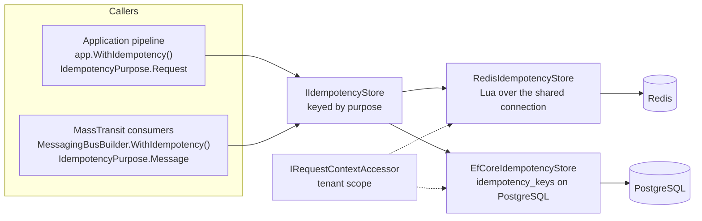

<div align="center">

# SharedKernel Idempotency

**Run it once — even when the request is retried or the message is delivered twice — over one atomic store contract
backed by Redis or PostgreSQL.**

[](https://dotnet.microsoft.com/)
[](../../../LICENSE)


[](https://github.com/StackExchange/StackExchange.Redis)
[](https://www.postgresql.org/)

[What you get](#what-you-get) · [Packages](#packages) · [How it fits together](#how-it-fits-together) · [Get started](#get-started) · [See it run](#see-it-run) · [Guarantees](#guarantees)

<sub>📂 <code>src/Infrastructure/Idempotency</code> · <a href="../../../docs/packages.md">all packages by tier</a> · <a href="../../../README.md">Platform.SharedKernel</a></sub>

</div>

---

## What you get

- **One protocol for commands and messages.** `IIdempotencyStore.TryBeginAsync` reserves a key, then
  `CompleteAsync` or `ReleaseAsync` settles it, with four outcomes: started, in progress, completed (replay),
  fingerprint mismatch.
- **Atomic by construction.** Each reservation is one round trip on the server — a Lua script on Redis,
  `INSERT … ON CONFLICT … RETURNING` on PostgreSQL — so there is no check-then-act window.
- **Tenant isolation you cannot forget.** Stores read the tenant from the ambient `IRequestContextAccessor`
  (`IdempotencyTenantScope`); a key never collides across tenants.
- **Safe under failure.** A reservation token guards completion, so a caller whose lease expired cannot overwrite the
  new owner; a lease that is never completed simply expires.
- **Fail closed.** An unreachable store throws unless you explicitly set `AllowExecutionOnStoreUnavailable`.

## Packages

| Package | Tier | Reference it from | Use it for |
| --- | --- | --- | --- |
| [SharedKernel.Idempotency.Abstractions](SharedKernel.Idempotency.Abstractions/README.md) | Abstractions | Application | `IIdempotencyStore`, `IdempotencyPurpose`, `IdempotencyTenantScope`, keyed registration — and a custom store |
| [SharedKernel.Idempotency.Redis](SharedKernel.Idempotency.Redis/README.md) | Adapter | Infrastructure | You already run Redis (`AddRedisConnection`); entries expire on their own |
| [SharedKernel.Idempotency.EfCore](SharedKernel.Idempotency.EfCore/README.md) | Adapter | Infrastructure | You run PostgreSQL and want deduplication next to your data or outbox, without Redis |
| [SharedKernel.Idempotency.Testing](SharedKernel.Idempotency.Testing/README.md) | Testing | test projects | `FakeIdempotencyStore`, `AddFakeIdempotencyStore()` |

Pick one store per purpose: requests and messages may live in different stores. The callers bring the Abstractions
with them; a service references a provider only.

## How it fits together



- **The callers live elsewhere.** Command idempotency is in the [Application](../../Application/README.md) pipeline;
  consumer deduplication is in the [Messaging](../Messaging/README.md) packages. Both resolve
  `[FromKeyedServices(IdempotencyPurpose.…)] IIdempotencyStore`, and both check for theirs at host start.
- **Complete on success, release on failure.** A fault never consumes the key; an unconfirmed lease expires after its
  `ttl`.
- **Context first.** A multi-tenant service establishes the request context (`UseSharedKernelRequestContext()`,
  `WithInboundRequestContext()`) before idempotency runs; otherwise every entry falls in the `no-tenant` scope.

## Get started

```xml
<PackageReference Include="SharedKernel.Idempotency.Redis" />
```

```csharp
builder.Services.AddRedisConnection(builder.Configuration);            // SharedKernel:Caching:Redis
builder.Services.AddRedisIdempotency(p => p.ForRequests());

builder.Services.AddSharedKernelApplication(
    typeof(PlaceOrderHandler).Assembly,
    app => app.UseMediatR().WithIdempotency());

public sealed record PlaceOrder(string IdempotencyKey, Guid CustomerId, decimal Total)
    : ICommand<Guid>, IIdempotentRequest;
```

A duplicate with the same body replays the stored result; one still in flight returns `idempotency.in_progress`; a
reused key with a different body returns `idempotency.key_reused` (both `Conflict`). For PostgreSQL instead, or for
consumer deduplication, see `AddEfCoreIdempotency(db => db.UsePostgres(dataSource), p => p.ForMessages())` in the
[SharedKernel.Idempotency.EfCore Quick start](SharedKernel.Idempotency.EfCore/README.md#quick-start); the contract
and a custom store are in the [Abstractions Quick start](SharedKernel.Idempotency.Abstractions/README.md#quick-start).

## See it run

The Shop's [Ordering](../../../samples/Shop/Ordering/) uses both stores: `AddRedisIdempotency(p => p.ForRequests())`
behind `app.WithIdempotency()` for order submissions, and `AddEfCoreIdempotency(...)` for messages, with
`WithIdempotency()` on its RabbitMQ consumers (`Shop.Ordering.Infrastructure/OrderingInfrastructure.cs`). `Shop.E2E`
proves an order is placed once per idempotency key, however often it is submitted:

```bash
samples/Shop/build.sh --e2e      # pack the kernel, build the Shop, run its end-to-end flows (Docker)
```

## Guarantees

| Guarantee | How it is held |
| --- | --- |
| **A reservation is classified atomically** — concurrent duplicates, exactly one winner | `RedisIdempotencyConcurrencyTests`, `EfCoreIdempotencyConcurrencyTests` against real Redis and PostgreSQL |
| **A key belongs to one tenant**, and purposes are separate key spaces | `RedisIdempotencyKeyBuilderTests`, `IdempotencyAbstractionsTests`, the `MessageStore_TwoTenantsWithIdenticalMessageId_…` cases |
| **Request keys belong to one caller** — the pipeline reserves a digest of tenant, caller and key | `RedisIdempotencyCallerScopingTests`, `EfCoreIdempotencyCallerScopingTests` |
| **A late caller cannot corrupt the new owner** — complete and release need the token of an in-flight entry | `CompleteAsync_AfterReservationWasReclaimedByAnotherCaller_…`, `ReleaseAsync_OnCompletedReservation_DoesNotDeleteIt_…` |
| **An outage never silently allows duplicates** — fail-open is opt-in and logs a Warning | `RedisIdempotencyFailOpenTests`, `EfCoreIdempotencyFailOpenTests`, `RedisStoreUnavailableClassifierTests`, `EfCoreStoreUnavailableClassifierTests` |
| **One store per purpose** | `AddIdempotencyStore_TwiceForOnePurpose_Throws`, `AddRedisIdempotency_TwiceForTheSamePurpose_Throws` |

**Out of scope:** a cleanup job or migrations for the EF Core table (its README has both recipes), and binding
provider options from configuration — they are set through the registration delegate.

---

<div align="center">
<sub>Part of <a href="../../../README.md">Platform.SharedKernel</a> · <a href="../../../docs/packages.md">all packages</a> · MIT license</sub>
</div>
