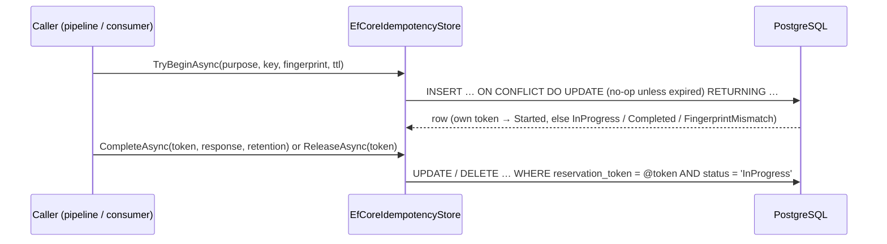

# SharedKernel.Idempotency.EfCore

[](https://dotnet.microsoft.com/)
[](https://github.com/Gresta-Vertex-Labs/platform-shared-kernel/blob/main/LICENSE)


> **The PostgreSQL implementation of `IIdempotencyStore`, for services that run PostgreSQL and do not want Redis just
> for deduplication: one `INSERT … ON CONFLICT … RETURNING` classifies a duplicate command or message atomically,
> scoped by tenant.**

| You get | So that |
| --- | --- |
| `AddEfCoreIdempotency(db => db.UsePostgres(dataSource), p => …)` | One call backs command idempotency, consumer deduplication, or both |
| One-statement upsert per reservation | No read-then-write window, no second `SELECT` |
| Table `idempotency_keys`, key `(tenant_scope, purpose, key)` | A key can never collide across tenants or between requests and messages |
| Expired rows reclaimed in place | A crashed caller cannot wedge a key |
| Fail closed, with one explicit fail-open switch | An outage never silently turns into duplicate execution |
| Its own plain `IdempotencyDbContext`, EF retry off | The caller owns retry; the platform save pipeline cannot interfere |

## Contents

- [Install](#install)
- [Quick start](#quick-start)
- [How it works](#how-it-works)
- [Recipes](#recipes)
- [Configuration](#configuration)
- [Reference](#reference)
- [Testing](#testing)
- [Pitfalls](#pitfalls)
- [Design decisions](#design-decisions)

## Install

```xml
<PackageReference Include="SharedKernel.Idempotency.EfCore" />
```

The version comes from your central `SharedKernelVersion` property — every SharedKernel package ships at the same
version. See [Using the packages](https://github.com/Gresta-Vertex-Labs/platform-shared-kernel#using-the-packages).

| Requirement | Value |
| --- | --- |
| Target framework | `net10.0` |
| Tier | Adapter — reference it from your **Infrastructure** project |
| Depends on | `SharedKernel.Idempotency.Abstractions`, `SharedKernel.Persistence.EfCore` (for `UsePostgres`), `SharedKernel.Primitives` |
| Namespaces | `SharedKernel.Idempotency.EfCore.Extensions`, `.Context`, `.Options`, `.Store` |
| Database | PostgreSQL |

## Quick start

```csharp
using Npgsql;
using SharedKernel.Idempotency.EfCore.Extensions;
using SharedKernel.Persistence;
using SharedKernel.Primitives.Clocks;

builder.Services.AddClock();                                        // IClock — required
var dataSource = NpgsqlDataSource.Create(builder.Configuration.GetConnectionString("orders")!);

builder.Services.AddEfCoreIdempotency(
    configureDbContext: db => db.UsePostgres(dataSource),
    purposes: p => p.ForRequests().ForMessages());
```

Then create the table with a migration (recipe 1). Nothing else calls the store directly: `app.WithIdempotency()` on
`AddSharedKernelApplication` and `MessagingBusBuilder.WithIdempotency()` resolve it by purpose. To call it yourself,
inject `[FromKeyedServices(IdempotencyPurpose.Request)] IIdempotencyStore` — see the
[contract README](https://github.com/Gresta-Vertex-Labs/platform-shared-kernel/blob/main/src/Infrastructure/Idempotency/SharedKernel.Idempotency.Abstractions/README.md).

## How it works



- **One statement.** `TryBeginAsync` is one raw `INSERT … ON CONFLICT (tenant_scope, purpose, "key") DO UPDATE …
  RETURNING` on the context's own connection. Every `SET` is a no-op unless the existing row has expired, so a live
  row comes back unchanged. The caller won — fresh insert or expired-row reclaim — exactly when the returned
  `reservation_token` is its own.
- **Token-conditional.** `CompleteAsync`/`ReleaseAsync` touch the row only while the token matches and the row is
  `InProgress`, and return `false` otherwise; a malformed token is rejected without a round trip. A completed row is
  never released.
- **Tenant scope** is `IdempotencyTenantScope.Current(accessor)` — the tenant id in "D" form, or `no-tenant`.
- **Timestamps** come from `IClock`: a reservation expires at `now + ttl`; completion moves it to `now + retention`.
  The caller owns both values, so this package has no TTL settings.
- **Lifetime.** `IdempotencyDbContext` and the store are scoped.

### Table `idempotency_keys`

| Column | Type | Notes |
| --- | --- | --- |
| `tenant_scope` | `varchar(36)` | `IdempotencyTenantScope`: tenant id in "D" form, or `no-tenant` |
| `purpose` | `varchar(16)` | `Request` or `Message` |
| `key` | `varchar(512)` | the key exactly as given (a 64-hex digest for requests) |
| `fingerprint` | `varchar(128)` | |
| `status` | `varchar(20)` | `InProgress` or `Completed` |
| `reservation_token` | `uuid` | fresh per winning reservation |
| `reserved_at_utc`, `expires_at_utc` | `timestamptz` | `expires_at_utc` indexed (`ix_idempotency_keys_expires_at_utc`) |
| `response` | `text` | stored response, never parsed; `NULL` for messages |

Primary key `(tenant_scope, purpose, key)` — the constraint the upsert conflicts on.

## Recipes

### 1. Create the table with a migration

The package ships no migrations. Add a design-time factory to your migrations project:

```csharp
using Microsoft.EntityFrameworkCore;
using Microsoft.EntityFrameworkCore.Design;
using Npgsql;
using SharedKernel.Idempotency.EfCore.Context;
using SharedKernel.Persistence;

public sealed class IdempotencyDbContextFactory : IDesignTimeDbContextFactory<IdempotencyDbContext>
{
    public IdempotencyDbContext CreateDbContext(string[] args)
    {
        var options = new DbContextOptionsBuilder<IdempotencyDbContext>();
        options.UsePostgres(NpgsqlDataSource.Create("Host=localhost;Database=orders;Username=app_migrator"));
        return new IdempotencyDbContext(options.Options);
    }
}
```

Then run `dotnet ef migrations add InitialIdempotency --context IdempotencyDbContext`.

### 2. Bound table growth with a cleanup job

The store never prunes rows. Run a periodic delete — a `BackgroundService`, or a
[`SharedKernel.Scheduling`](https://github.com/Gresta-Vertex-Labs/platform-shared-kernel/blob/main/src/Infrastructure/Scheduling/SharedKernel.Scheduling/README.md) job:

```csharp
public sealed class IdempotencyCleanupService(IServiceScopeFactory scopes, IClock clock) : BackgroundService
{
    protected override async Task ExecuteAsync(CancellationToken stoppingToken)
    {
        using var timer = new PeriodicTimer(TimeSpan.FromHours(1));
        while (await timer.WaitForNextTickAsync(stoppingToken))
        {
            await using var scope = scopes.CreateAsyncScope();
            var db = scope.ServiceProvider.GetRequiredService<IdempotencyDbContext>();
            await db.Database.ExecuteSqlInterpolatedAsync(
                $"DELETE FROM idempotency_keys WHERE expires_at_utc < {clock.UtcNow}", stoppingToken);
        }
    }
}
```

## Configuration

Options are set through the `configureOptions` delegate; the registration does not bind a configuration section (the
`EfCoreIdempotencyOptions.SectionName` constant, `SharedKernel:Idempotency:EfCore`, is reserved for that).

| Option | Type | Default | Meaning |
| --- | --- | --- | --- |
| `EfCoreIdempotencyOptions.AllowExecutionOnStoreUnavailable` | `bool` | `false` | On a PostgreSQL connectivity or timeout failure, `TryBeginAsync` returns `Started` and `CompleteAsync`/`ReleaseAsync` return `false`, instead of throwing. Applies to every purpose of the registration |

## Reference

### Registration

| Method | Registers |
| --- | --- |
| `AddEfCoreIdempotency(Action<DbContextOptionsBuilder> configureDbContext, Action<IdempotencyPurposeSelection> purposes, Action<EfCoreIdempotencyOptions>? configureOptions = null)` | `IdempotencyDbContext` (scoped, retry disabled); `EfCoreIdempotencyStore` as the keyed `IIdempotencyStore` for each selected purpose (scoped); `IRequestContextAccessor` unless one exists |

It throws `InvalidOperationException` when no purpose is selected or a store is already registered for a selected
purpose. An `IClock` must be registered (`services.AddClock()`).

### Failure classification

A transient `NpgsqlException`, an `NpgsqlException` wrapping a `SocketException` or `TimeoutException`, or a bare
`SocketException`/`TimeoutException` (searched up to five inner exceptions deep) counts as "store unavailable".
Anything else propagates regardless of the option.

### Logging

| Event id | Level | Event |
| --- | --- | --- |
| 18100 | Warning | PostgreSQL idempotency store was unavailable during `{Operation}`; `AllowExecutionOnStoreUnavailable` is enabled, so the call proceeds as not-yet-processed |

### Health

No probe of its own. Add `ServiceDefaults.Persistence`'s database readiness check for the connection if you need one.

## Testing

Unit tests use [`SharedKernel.Idempotency.Testing`](https://github.com/Gresta-Vertex-Labs/platform-shared-kernel/blob/main/src/Infrastructure/Idempotency/SharedKernel.Idempotency.Testing/README.md):
`services.AddFakeIdempotencyStore()` replaces this store with an in-memory `FakeIdempotencyStore` that follows the
same protocol. Concurrency, tenant isolation and expiry reclaim need a real PostgreSQL (for example Testcontainers).

## Pitfalls

| Don't | Do | Why |
| --- | --- | --- |
| Forget the migration | Add the design-time factory and a migration (recipe 1) | The package ships none; the first call fails on a missing table |
| Forget cleanup | Schedule the delete in recipe 2 | Expired rows are only reclaimed when the same key returns; the rest accumulate |
| Forget `AddClock()` | Register `IClock` | Every timestamp comes from it |
| Turn on `AllowExecutionOnStoreUnavailable` by default | Leave it off unless running twice is safer than not running | While the database is down every call — duplicates included — is treated as new |
| Expect settings under `SharedKernel:Idempotency:EfCore` | Use the `configureOptions` delegate | The section is not bound |
| Map `IdempotencyDbContext` into your own context | Keep it separate | Your context's conventions (soft delete, `xmin`) would change the table |

## Design decisions

**Why raw SQL instead of `ExecuteSqlInterpolatedAsync`?** The upsert needs its `RETURNING` row, which that API
discards; the store runs the command on the context's own ADO.NET connection instead.

**Why compare tokens, not timestamps?** Two callers can reclaim an expired row within the same clock tick; only the
token proves which one won.

**Why a plain `DbContext`?** `SharedKernelDbContext`'s save pipeline would turn the cleanup's hard `DELETE` into a
soft delete and add a row version this table has no use for.

**Why is EF retry off?** Every operation is one atomic statement, and the caller owns the request the reservation
guards. With the default retry policy an unreachable store would back off for minutes before failing.

---

Part of [Platform.SharedKernel](https://github.com/Gresta-Vertex-Labs/platform-shared-kernel) ·
[Idempotency domain](https://github.com/Gresta-Vertex-Labs/platform-shared-kernel/blob/main/src/Infrastructure/Idempotency/README.md) ·
[MIT license](https://github.com/Gresta-Vertex-Labs/platform-shared-kernel/blob/main/LICENSE)
