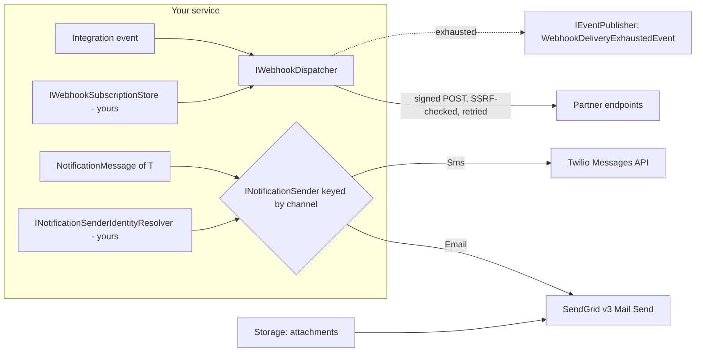

<div align="center">

# SharedKernel Integration

**Signed, retried, SSRF-guarded webhooks for partners and templated email and SMS for people: delivery to
destinations outside your control, where a retry never delivers twice and nothing about the caller except a
correlation id leaves the platform.**

[](https://dotnet.microsoft.com/)
[](../../../LICENSE)


[What you get](#what-you-get) · [Packages](#packages) · [How it fits together](#how-it-fits-together) · [Get started](#get-started) · [See it run](#see-it-run) · [Guarantees](#guarantees)

<sub>📂 <code>src/Infrastructure/Integration</code> · <a href="../../../docs/packages.md">all packages by tier</a> · <a href="../../../README.md">Platform.SharedKernel</a></sub>

</div>

---

## What you get

- **Webhooks partners can trust.** `IWebhookDispatcher.DispatchAsync(evt)` fans an `[IntegrationEvent]` out to every
  matching subscriber with an HMAC-SHA256 `X-Webhook-Signature` over timestamp and body; `WebhookSignatureVerifier`
  checks it on the receiving side, and multi-secret subscriptions rotate keys with zero downtime.
- **Arbitrary URLs without SSRF.** The DNS-resolved address is checked before every send, so a subscriber URL cannot
  reach loopback, link-local or private networks unless you opt out with `AllowPrivateNetworkTargets`.
- **Retries without duplicates.** A stable `X-Webhook-Delivery-Id` across a delivery's retries; for email and SMS a
  caller-supplied `NotificationDeliveryId`, which Twilio enforces as `Idempotency-Key`.
- **One notification contract.** `INotificationSender`, resolved keyed by `NotificationChannel` (`Email`, `Sms`),
  with SendGrid and Twilio behind it over plain REST (no vendor SDKs) and attachments streamed from object storage.
- **Failures as values.** `WebhookDeliveryResult` and `NotificationDeliveryResult` instead of exceptions; one
  `WebhookDeliveryExhaustedEvent` on the bus when a subscriber stays down; delivery observers for your own ledger.

## Packages

| Package | Tier | Reference it from | Use it for |
| --- | --- | --- | --- |
| [SharedKernel.Integration.Webhooks](SharedKernel.Integration.Webhooks/README.md) | Adapter | Infrastructure | Pushing integration events to external HTTP subscribers, and verifying webhooks you receive |
| [SharedKernel.Integration.Notifications.Abstractions](SharedKernel.Integration.Notifications.Abstractions/README.md) | Abstractions | Application | `INotificationSender`, `NotificationMessage<T>`, observer and sender-identity seams, shared retry options |
| [SharedKernel.Integration.Notifications.Email.SendGrid](SharedKernel.Integration.Notifications.Email.SendGrid/README.md) | Adapter | Infrastructure | Email through SendGrid dynamic templates, attachments from a storage store |
| [SharedKernel.Integration.Notifications.Sms.Twilio](SharedKernel.Integration.Notifications.Sms.Twilio/README.md) | Adapter | Infrastructure | SMS through Twilio Content templates, deduplicated by `Idempotency-Key` |
| [SharedKernel.Integration.Testing](SharedKernel.Integration.Testing/README.md) | Testing | test projects | In-memory dispatcher, senders and observers that record every call |

Machine subscribers outside the platform take Webhooks; people take Notifications.Abstractions plus one provider per
channel. Services inside the platform consume the same events over [Messaging](../Messaging/README.md) instead.

## How it fits together



- **Your data stays yours.** The subscription store, the delivery ledger and the "from" identity are seams your
  service implements over its own persistence; these packages own no tables.
- **One subscriber cannot fault the rest.** Fan-out is bounded by `MaxConcurrentDeliveries`; HTTP failures, timeouts
  and SSRF rejections become a failed `WebhookDeliveryResult`, and `DispatchAsync` never throws because of one of them.
- **Retries live in the resilience handler** of each named `HttpClient`, driven by validated options; after the last
  attempt exactly one exhaustion event is published.
- **Deduplication strength differs.** Twilio enforces `Idempotency-Key`; SendGrid carries the id as correlation only,
  so duplicate-email prevention belongs in your outbox.

## Get started

```xml
<PackageReference Include="SharedKernel.Integration.Webhooks" />
<PackageReference Include="SharedKernel.Integration.Notifications.Email.SendGrid" />
<PackageReference Include="SharedKernel.Integration.Notifications.Sms.Twilio" />
```

```csharp
builder.Services.AddSharedKernelWebhooks();                                           // SharedKernel:Integration:Webhooks
builder.Services.AddScoped<IWebhookSubscriptionStore, EfWebhookSubscriptionStore>();  // yours, no default

builder.Services.AddSharedKernelNotifications();                                      // SharedKernel:Integration:Notifications
builder.Services.AddScoped<INotificationSenderIdentityResolver, TenantSenderIdentityResolver>();   // email "from"
builder.Services.AddSendGridEmailNotifications(o => o.ApiKey = builder.Configuration["SendGrid:ApiKey"]!);
builder.Services.AddTwilioSmsNotifications(o =>
{
    o.AccountSid = builder.Configuration["Twilio:AccountSid"]!;
    o.AuthToken = builder.Configuration["Twilio:AuthToken"]!;
    o.MessagingServiceSid = builder.Configuration["Twilio:MessagingServiceSid"];       // or From
});
```

```csharp
IReadOnlyList<WebhookDeliveryResult> results = await webhooks.DispatchAsync(orderShipped, ct);

NotificationDeliveryResult sent = await sms.SendAsync(new NotificationMessage<OtpModel>   // keyed NotificationChannel.Sms
{
    NotificationDeliveryId = otpRequest.DeliveryId,    // created once, reused on retry
    Channel = NotificationChannel.Sms,
    Recipient = customer.PhoneNumberE164,
    TemplateId = contentSid,
    TemplateModel = new OtpModel(code),
}, ct);
```

The full setup (the subscription store, receiving-side verification, secret rotation, payload encryption) is in the
[Webhooks Quick start](SharedKernel.Integration.Webhooks/README.md#quick-start); the sending side is in the
[Notifications Quick start](SharedKernel.Integration.Notifications.Abstractions/README.md#quick-start).

## See it run

No reference service under `samples/` uses these packages yet; [Messaging](../Messaging/README.md)'s
[ShippingApi](../../../samples/ShippingApi/) is the closest, publishing the integration events a webhook would carry.
The [`consumer-verify`](consumer-verify/Program.cs) harness composes webhooks and both notification providers the way
a service does and proves that a missing `IWebhookSubscriptionStore` fails loudly at first dispatch:

```bash
dotnet run --project src/Infrastructure/Integration/consumer-verify
```

## Guarantees

| Guarantee | How it is held |
| --- | --- |
| Subscribers can prove origin and reject replays | `WebhookSignatureTests`: tampered body, timestamp or signature, wrong secret and out-of-tolerance timestamps fail; malformed input returns `false`, never throws |
| Secrets rotate without downtime | `WebhookSignatureRotationTests`: a payload signed with any secret in the candidate list still verifies |
| No SSRF by default | `PrivateNetworkWebhookUrlValidatorTests` and `WebhookUrlValidationDispatchTests`: private and reserved targets are rejected before the send |
| One broken subscriber cannot fault a fan-out | `WebhookDispatcherFanOutTests` (`OneSubscriptionFailing_DoesNotAffectOthers`) |
| Retries are deduplicable | `WebhookDeliveryIdTests` (delivery id stable across every attempt); `TwilioSmsNotificationSenderTests` (`Idempotency-Key` header) |
| A subscriber that stays down is visible exactly once | `WebhookDispatcherRetryTests` (`PublishesExactlyOneExhaustedEvent`) |
| Personal data and secrets stay out of logs | `NeverLogsRecipientOrTemplateModelFields` in both provider suites; `NeverLogsSecretDigestOrPayload` in `WebhookDeliveryLoggingTests` |
| Outbound HTTP only through named, resilient clients | Analyzer SK0013 flags raw `HttpClient` injection |

---

<div align="center">
<sub>Part of <a href="../../../README.md">Platform.SharedKernel</a> · <a href="../../../docs/packages.md">all packages</a> · MIT license</sub>
</div>
