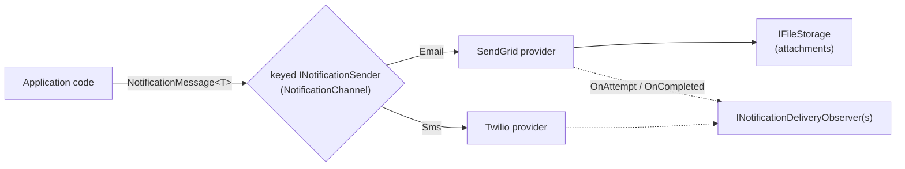

# SharedKernel.Integration.Notifications.Abstractions

[](https://dotnet.microsoft.com/)
[](https://github.com/Gresta-Vertex-Labs/platform-shared-kernel/blob/main/LICENSE)


> **One provider-neutral contract for human-facing notifications (a receipt by email, a one-time passcode by SMS):
> application code sends a templated message through `INotificationSender` and never touches a vendor API.**
> Reference it from your Application project and add a provider (`…Email.SendGrid`, `…Sms.Twilio`) in
> Infrastructure. For signed HTTP callbacks to a machine subscriber, use `SharedKernel.Integration.Webhooks` instead.

| You get | So that |
| --- | --- |
| `INotificationSender`, resolved keyed by `NotificationChannel` | Swapping or adding a provider does not touch the code that sends |
| `NotificationMessage<TTemplateModel>` with a required, caller-supplied `NotificationDeliveryId` | A caller-level retry reuses the id, so the provider can deduplicate |
| `NotificationAttachment` as a storage `FileReference` | Attachments stream from object storage; large files never sit in your message |
| `NotificationDeliveryResult` instead of exceptions | Provider failures are values you branch on |
| `INotificationDeliveryObserver` | A delivery ledger or metrics hook without the package owning persistence |
| `INotificationSenderIdentityResolver` | The "from" address (per tenant, if you like) is your decision |
| Shared retry, timeout and concurrency options | Every provider behaves the same under failure |

## Contents

- [Install](#install)
- [Quick start](#quick-start)
- [How it works](#how-it-works)
- [Recipes](#recipes)
- [Configuration](#configuration)
- [Reference](#reference)
- [Testing](#testing)
- [Pitfalls](#pitfalls)
- [Design decisions](#design-decisions)

## Install

```xml
<PackageReference Include="SharedKernel.Integration.Notifications.Abstractions" />
```

The version comes from your central `SharedKernelVersion` property — every SharedKernel package ships at the same
version. See [Using the packages](https://github.com/Gresta-Vertex-Labs/platform-shared-kernel#using-the-packages).

| Requirement | Value |
| --- | --- |
| Target framework | `net10.0` |
| Tier | Abstractions — reference it from your **Application** project |
| Depends on | `SharedKernel.Primitives`, `SharedKernel.Configuration`, `SharedKernel.Storage.Abstractions` |
| Namespaces | `SharedKernel.Integration.Notifications.Abstractions.Notifications`, `.Delivery`, `.Observability`, `.Options`, `.Extensions`, `.Tracing` |
| Providers | [`…Email.SendGrid`](https://github.com/Gresta-Vertex-Labs/platform-shared-kernel/blob/main/src/Infrastructure/Integration/SharedKernel.Integration.Notifications.Email.SendGrid/README.md), [`…Sms.Twilio`](https://github.com/Gresta-Vertex-Labs/platform-shared-kernel/blob/main/src/Infrastructure/Integration/SharedKernel.Integration.Notifications.Sms.Twilio/README.md) |

## Quick start

Register the shared options and the providers you need (in the composition root):

```csharp
using SharedKernel.Integration.Notifications.Abstractions.Extensions;
using SharedKernel.Integration.Notifications.Abstractions.Observability;
using SharedKernel.Integration.Notifications.Email.SendGrid.Extensions;
using SharedKernel.Integration.Notifications.Sms.Twilio.Extensions;

builder.Services.AddSharedKernelNotifications();                        // SharedKernel:Integration:Notifications
builder.Services.AddScoped<INotificationSenderIdentityResolver, TenantSenderIdentityResolver>();   // for email

builder.Services.AddSendGridEmailNotifications(o => o.ApiKey = builder.Configuration["SendGrid:ApiKey"]!);
builder.Services.AddTwilioSmsNotifications(o =>
{
    o.AccountSid = builder.Configuration["Twilio:AccountSid"]!;
    o.AuthToken = builder.Configuration["Twilio:AuthToken"]!;
    o.MessagingServiceSid = builder.Configuration["Twilio:MessagingServiceSid"];
});
```

```json
{
  "SharedKernel": {
    "Integration": {
      "Notifications": { "MaxAttempts": 3, "RequestTimeout": "00:00:10", "MaxConcurrentSends": 16 }
    }
  }
}
```

Send from application code:

```csharp
using Microsoft.Extensions.DependencyInjection;
using SharedKernel.Integration.Notifications.Abstractions.Delivery;
using SharedKernel.Integration.Notifications.Abstractions.Notifications;

public sealed record OrderReceiptModel(string OrderNumber, string Total);

public sealed class SendOrderReceipt([FromKeyedServices(NotificationChannel.Email)] INotificationSender email)
{
    public async Task<bool> SendAsync(Order order, CancellationToken ct)
    {
        NotificationDeliveryResult result = await email.SendAsync(
            new NotificationMessage<OrderReceiptModel>
            {
                NotificationDeliveryId = order.ReceiptDeliveryId,   // stored with the order; reused on retry
                Channel = NotificationChannel.Email,
                Recipient = order.CustomerEmail,
                TemplateId = "d-order-receipt",
                TemplateModel = new OrderReceiptModel(order.Number, order.Total.ToString("N2")),
            },
            ct);

        return result.IsSuccess;   // result.Error on failure — never log the recipient or the model
    }
}
```

## How it works



- **No router.** A send is one message to one channel: resolve the sender keyed by `NotificationChannel` and call
  it. `NotificationChannel` has two members, `Email` and `Sms`.
- **Never throws for delivery failures.** A non-2xx response, timeout, transport error or unresolvable attachment
  returns `NotificationDeliveryResult { IsSuccess = false, Error = … }`; only a `null` message throws.
- **Deduplication is per provider.** Twilio sends `NotificationDeliveryId` as `Idempotency-Key` (enforced by Twilio).
  SendGrid carries it in `custom_args` (correlation only), so duplicate-email prevention is your outbox's job.
- **Retries** happen inside each provider's resilience pipeline, driven by `NotificationDeliveryOptions`; observers see
  one `OnAttemptAsync` per send (`attemptNumber: 1`) and one `OnCompletedAsync`.
- **Personal data.** Recipient and template model are PII: providers never log them or tag spans with them. Observers
  receive the recipient in `NotificationDeliveryContext`; logging it is the observer's responsibility.
- **Nothing about the caller leaves the platform.** Providers send no tenant, actor or correlation header.

## Recipes

### 1. Resolve the sender identity per tenant

Used by the email provider for the `From`, display name and default reply-to (SMS uses the Twilio options):

```csharp
using SharedKernel.Execution.Context;
using SharedKernel.Integration.Notifications.Abstractions.Notifications;
using SharedKernel.Integration.Notifications.Abstractions.Observability;

// ITenantProfiles is your service's own lookup of per-tenant sender settings.
public sealed class TenantSenderIdentityResolver(ITenantProfiles tenants, IRequestContext caller)
    : INotificationSenderIdentityResolver
{
    public async Task<NotificationSenderIdentity> ResolveAsync(NotificationChannel channel, CancellationToken ct)
    {
        var tenantId = caller.TenantId ?? throw new InvalidOperationException("A notification needs a tenant.");
        var tenant = await tenants.GetAsync(tenantId, ct);
        return new NotificationSenderIdentity(tenant.SupportEmail, tenant.DisplayName, ReplyTo: tenant.ReplyToEmail);
    }
}
```

### 2. Attach a stored file

```csharp
using SharedKernel.Integration.Notifications.Abstractions.Notifications;

Attachments = [new NotificationAttachment
{
    FileReference = invoiceFileReference,     // SharedKernel.Storage.FileReference
    FileName = "invoice.pdf",
    ContentType = "application/pdf",
}],
```

There is no inline-bytes overload; the provider opens the object with `IFileStorageFactory` at send time.

### 3. Keep a delivery ledger

```csharp
using SharedKernel.Integration.Notifications.Abstractions.Delivery;
using SharedKernel.Integration.Notifications.Abstractions.Extensions;
using SharedKernel.Integration.Notifications.Abstractions.Observability;

builder.Services.WithNotificationDeliveryObserver<NotificationLedger>();

public sealed class NotificationLedger(AppDbContext db) : INotificationDeliveryObserver
{
    public Task OnAttemptAsync(NotificationDeliveryContext context, int attemptNumber, CancellationToken ct) =>
        Task.CompletedTask;

    public Task OnCompletedAsync(NotificationDeliveryContext context, NotificationDeliveryResult result, CancellationToken ct) =>
        db.NotificationDeliveries.AddAsync(new(context.NotificationDeliveryId, result.IsSuccess), ct).AsTask();
}
```

An observer exception is caught and logged at Warning; it never changes the send result.

## Configuration

Section `SharedKernel:Integration:Notifications`, validated when the host starts; the `configure` delegate of
`AddSharedKernelNotifications` runs after binding. Every provider reads these values.

| Key | Type | Default | Meaning |
| --- | --- | --- | --- |
| `SharedKernel:Integration:Notifications:MaxAttempts` | `int` | `3` | Attempts per send, including the first (≥ 1) |
| `SharedKernel:Integration:Notifications:BaseBackoffDelay` | `TimeSpan` | `00:00:01` | First retry delay (> 0) |
| `SharedKernel:Integration:Notifications:MaxBackoffDelay` | `TimeSpan` | `00:00:30` | Backoff ceiling (> 0, ≥ `BaseBackoffDelay`) |
| `SharedKernel:Integration:Notifications:RequestTimeout` | `TimeSpan` | `00:00:10` | Per-attempt timeout (> 0) |
| `SharedKernel:Integration:Notifications:MaxConcurrentSends` | `int` | `16` | Concurrent sends per provider, enforced by the pipeline's rate limiter (≥ 1) |

## Reference

### Registration

| Method | Registers |
| --- | --- |
| `AddSharedKernelNotifications(Action<NotificationDeliveryOptions>? configure = null)` | `NotificationDeliveryOptions` only — no sender, no identity resolver |
| `WithNotificationDeliveryObserver<T>()` | An additional scoped `INotificationDeliveryObserver` |

### Types

| Type | Purpose |
| --- | --- |
| `INotificationSender` | `SupportedChannel`, `SendAsync<TTemplateModel>(message, ct)` → `NotificationDeliveryResult` |
| `NotificationMessage<TTemplateModel>` | Required `NotificationDeliveryId`, `Channel`, `Recipient`, `TemplateId`, `TemplateModel`; optional `ReplyTo`, `Attachments`, `Locale` (reserved, not used yet) |
| `NotificationAttachment` | Required `FileReference`, `FileName`; optional `ContentType` |
| `NotificationDeliveryResult` | `NotificationDeliveryId`, `IsSuccess`, `ProviderMessageId`, `Error` |
| `NotificationDeliveryContext` | `NotificationDeliveryId`, `Channel`, `Recipient`, `TemplateId` (for observers) |
| `NotificationSenderIdentity` | `FromAddress`, `DisplayName`, `ReplyTo` |
| `NotificationIntegrationActivitySource`, `NotificationActivityTags` | Source `SharedKernel.Integration`; tags `notification.channel`, `notification.outcome`, `notification.attempt_count` |

### Logging

This package does no I/O and does not log (EventId block 15100–15199 is reserved). Providers log in their own blocks.

## Testing

Reference [`SharedKernel.Integration.Testing`](https://github.com/Gresta-Vertex-Labs/platform-shared-kernel/blob/main/src/Infrastructure/Integration/SharedKernel.Integration.Testing/README.md).
`services.AddInMemoryNotificationSender(NotificationChannel.Email)` registers a keyed `InMemoryNotificationSender`:
assert with `ShouldHaveSent<TModel>(m => …)` / `ShouldNotHaveSent<TModel>()`, read `SentOf<TModel>()`, and shape
results with `SetSendResult`. `AddInMemoryNotificationDeliveryObserver()` records attempts and completions
(`ShouldHaveSucceeded(id)`, `ShouldHaveFailed(id)`).

## Pitfalls

| Don't | Do | Why |
| --- | --- | --- |
| Generate `NotificationDeliveryId` inside the retry | Create it once, store it with the business record, reuse it | Only a stable id lets the provider deduplicate |
| Log `Recipient` or the template model | Log the delivery id and the error | Both are personal data |
| Put file bytes in the message | Store the file and pass its `FileReference` | Attachments stream from storage at send time |
| Assume email is deduplicated | Guard with your outbox | SendGrid's `custom_args` is correlation only |
| Forget `INotificationSenderIdentityResolver` when using email | Register one | There is no default; the email sender cannot be resolved without it |
| Wrap `SendAsync` in try/catch for provider errors | Check `result.IsSuccess` | Delivery failures are returned, not thrown |

## Design decisions

**Why a caller-supplied delivery id?** A webhook delivery with its retries happens inside one call, so the dispatcher
can mint the id. A notification may be re-sent by the caller after a crash; only the caller can keep the id stable.

**Why no `Push` channel?** Device-token registration and per-platform payloads are far more scope than text
delivery.

**Why no vendor SDKs?** Both APIs are simple REST; an SDK brings its own `HttpClient` lifecycle and an unaudited
dependency surface.

---

Part of [Platform.SharedKernel](https://github.com/Gresta-Vertex-Labs/platform-shared-kernel) ·
[Integration packages](https://github.com/Gresta-Vertex-Labs/platform-shared-kernel/blob/main/src/Infrastructure/Integration/README.md) ·
[MIT license](https://github.com/Gresta-Vertex-Labs/platform-shared-kernel/blob/main/LICENSE)
