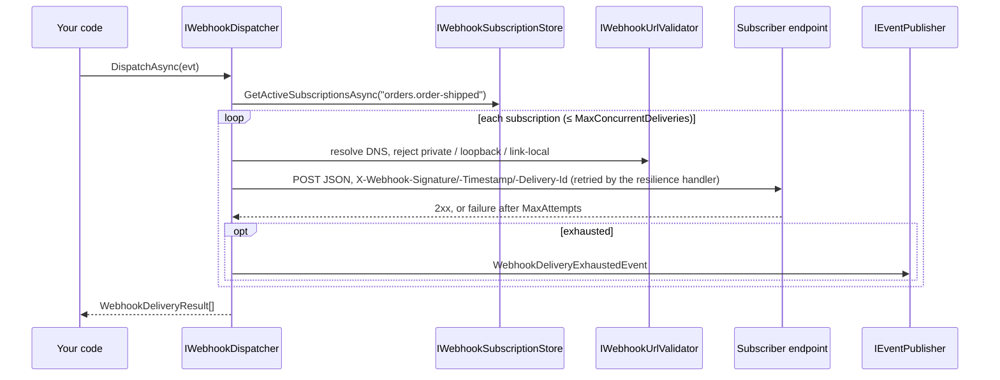

# SharedKernel.Integration.Webhooks

[](https://dotnet.microsoft.com/)
[](https://github.com/Gresta-Vertex-Labs/platform-shared-kernel/blob/main/LICENSE)


> **Deliver integration events to external HTTP subscribers as signed, retried, SSRF-guarded webhooks — and verify
> them on the receiving side. You supply the subscriptions; the package handles signing, fan-out, retries, secret
> rotation, optional payload encryption and the "delivery exhausted" signal.**

| You get | So that |
| --- | --- |
| `IWebhookDispatcher.DispatchAsync(evt)` | One call fans an `[IntegrationEvent]` out to every matching subscriber, bounded and isolated |
| HMAC-SHA256 signatures with a timestamp, and `WebhookSignatureVerifier` | Subscribers can prove origin and reject replays |
| Multi-secret subscriptions (`Secrets`, newest first) | Signing secrets rotate with zero downtime |
| An SSRF guard on the resolved address before every send | A subscriber URL cannot reach your private network |
| Retries in the standard HTTP resilience handler, one stable `X-Webhook-Delivery-Id` | Transient failures heal; subscribers deduplicate retries |
| `WebhookDeliveryExhaustedEvent` on the bus | Any service can react when a subscriber stays down |
| Opt-in encrypt-then-sign payloads | Payload confidentiality independent of the subscriber's TLS termination |
| Test (ping) deliveries | A new subscriber can check its endpoint before real events flow |

## Contents

- [Install](#install)
- [Quick start](#quick-start)
- [How it works](#how-it-works)
- [Recipes](#recipes)
- [Configuration](#configuration)
- [Reference](#reference)
- [Testing](#testing)
- [Pitfalls](#pitfalls)
- [Design decisions](#design-decisions)

## Install

```xml
<PackageReference Include="SharedKernel.Integration.Webhooks" />
```

The version comes from your central `SharedKernelVersion` property — every SharedKernel package ships at the same
version. See [Using the packages](https://github.com/Gresta-Vertex-Labs/platform-shared-kernel#using-the-packages).

| Requirement | Value |
| --- | --- |
| Target framework | `net10.0` |
| Tier | Adapter — reference it from your **Infrastructure** project |
| Depends on | `SharedKernel.Primitives`, `.Execution`, `.Configuration`, `.Cryptography`, `SharedKernel.Contracts`, `SharedKernel.Messaging.Abstractions`, `Microsoft.Extensions.Http.Resilience` |
| Namespaces | `SharedKernel.Integration.Webhooks.Extensions`, `.Dispatch`, `.Subscriptions`, `.Signing`, `.Events`, `.Observability`, `.Options` |
| Needs in the host | An `IWebhookSubscriptionStore` (yours) and an `IEventPublisher` (e.g. `SharedKernel.Messaging.MassTransit`) |

## Quick start

```csharp
using SharedKernel.Integration.Webhooks.Extensions;
using SharedKernel.Integration.Webhooks.Subscriptions;

builder.Services.AddSharedKernelWebhooks();                                    // SharedKernel:Integration:Webhooks
builder.Services.AddScoped<IWebhookSubscriptionStore, EfWebhookSubscriptionStore>();   // required, no default
```

```json
{
  "SharedKernel": {
    "Integration": {
      "Webhooks": { "MaxAttempts": 5, "RequestTimeout": "00:00:10", "MaxConcurrentDeliveries": 8 }
    }
  }
}
```

The store is yours, over your own persistence; it owns the "active and subscribed to this event" filter:

```csharp
public sealed class EfWebhookSubscriptionStore(AppDbContext db) : IWebhookSubscriptionStore
{
    public async Task<IReadOnlyList<WebhookSubscription>> GetActiveSubscriptionsAsync(string eventType, CancellationToken ct)
    {
        var rows = await db.WebhookSubscriptions
            .Where(s => s.IsActive && (s.EventTypes.Count == 0 || s.EventTypes.Contains(eventType)))
            .ToListAsync(ct);

        return rows.Select(r => new WebhookSubscription(r.Id, r.Url, r.Secrets, r.EventTypes, r.IsActive)).ToList();
    }
}
```

Dispatch an integration event:

```csharp
using SharedKernel.Contracts.Events;
using SharedKernel.Integration.Webhooks.Dispatch;

[IntegrationEvent("orders.order-shipped")]
public sealed record OrderShipped(Guid EventId, DateTimeOffset OccurredOn, Guid OrderId) : IIntegrationEvent;

public sealed class NotifyPartners(IWebhookDispatcher webhooks, IClock clock)
{
    public async Task HandleAsync(Guid orderId, CancellationToken ct)
    {
        IReadOnlyList<WebhookDeliveryResult> results =
            await webhooks.DispatchAsync(new OrderShipped(Guid.NewGuid(), clock.UtcNow, orderId), ct);
        // one result per subscription: SubscriptionId, DeliveryId, IsSuccess, StatusCode, Attempts, Error
    }
}
```

## How it works



- **Routing key.** The event's `[IntegrationEvent]` name (via `IntegrationEventDescriptor`) — the same value as the
  CloudEvents `type` on the message bus, never the CLR type name. An event without the attribute throws
  `InvalidOperationException` before any lookup.
- **Signature.** `X-Webhook-Signature` is the lowercase-hex HMAC-SHA256 of `"{unixSeconds}.{body}"` (UTF-8), signed
  with `Secrets[0]`; `X-Webhook-Timestamp` carries the seconds. Secrets never leave the process — only the digest.
- **Delivery id.** `X-Webhook-Delivery-Id` is one `Guid` per delivery, stable across its retries, and equal to
  `WebhookDeliveryResult.DeliveryId`.
- **Correlation, and nothing else.** `X-Correlation-Id` carries the ambient correlation id (omitted when there is
  none; a subscription header of the same name wins). The tenant, actor and client id never leave the platform.
- **Isolation.** HTTP failures, timeouts, SSRF rejections and header collisions become a failed
  `WebhookDeliveryResult`; `DispatchAsync` never throws because of one subscriber.
- **Retries** live in the standard resilience handler on the named client, driven by `MaxAttempts`, the backoff
  delays and `RequestTimeout`. After the last attempt the dispatcher publishes exactly one
  `WebhookDeliveryExhaustedEvent`; a failed publish is logged (EventId 15004) and does not change the result.
- **Observers.** Every `IWebhookDeliveryObserver` sees `OnAttemptAsync` and `OnCompletedAsync`, in registration order;
  an observer exception is logged at Warning and never affects delivery.

## Recipes

### 1. Rotate a signing secret without downtime

`Secrets` is newest first; deliveries sign with `Secrets[0]`, verification accepts any entry.

```csharp
subscription = subscription with { Secrets = [newSecret, .. subscription.Secrets] };   // 1. sign with the new secret
// 2. the subscriber verifies against both secrets while it deploys the new one
subscription = subscription with { Secrets = [subscription.Secrets[0]] };              // 3. retire the old secret
```

### 2. Verify a webhook on the receiving side

```csharp
using SharedKernel.Integration.Webhooks.Signing;

app.MapPost("/webhooks/inbound/{subscriptionId:guid}", async (Guid subscriptionId, HttpRequest request,
    IPartnerSubscriptions subscriptions, CancellationToken ct) =>
{
    using var reader = new StreamReader(request.Body);
    var rawBody = await reader.ReadToEndAsync(ct);
    var subscription = await subscriptions.GetByIdAsync(subscriptionId, ct);
    if (subscription is null)
        return Results.NotFound();

    var valid = WebhookSignatureVerifier.Verify(
        payloadJson: rawBody,
        timestampHeaderValue: request.Headers[WebhookSignatureHeaders.TimestampHeaderName],
        signatureHeaderValue: request.Headers[WebhookSignatureHeaders.SignatureHeaderName],
        secretCandidates: subscription.Secrets);

    return valid ? Results.Ok() : Results.Unauthorized();
});
```

`Verify` never throws: malformed or missing input returns `false`. The skew window defaults to 5 minutes; pass
`tolerance` only when a receiver truly needs another. Deduplicate retries on `X-Webhook-Delivery-Id`.

### 3. Add static headers to one subscription

```csharp
var subscription = new WebhookSubscription(id, url, secrets, eventTypes, isActive: true,
    Headers: new Dictionary<string, string> { ["X-Partner-Id"] = "acme-corp" });
```

A name that collides (case-insensitively) with a signature, timestamp or delivery-id header fails that delivery before
any HTTP call.

### 4. Encrypt payloads

```csharp
builder.Services.AddSingleton<IEncryptionKeyProvider, YourEncryptionKeyProvider>();
builder.Services.AddSharedKernelCryptography(builder.Configuration).AddSymmetricEncryption();
builder.Services.AddSharedKernelWebhooks(o => o.EncryptPayload = true);
```

The body becomes the AES-GCM ciphertext (`EncryptedPayload.ToString()`, unpadded Base64Url), encrypted **then**
signed. The associated data is `WebhookPayloadAssociatedData.Build(subscriptionId, deliveryId)`: the delivery id comes
from the header; the subscription id is **never sent** — the subscriber knows it out of band, like the secret, so a
captured ciphertext cannot be replayed with attacker-supplied associated data. A platform subscriber verifies first,
then decrypts:

```csharp
var associatedData = WebhookPayloadAssociatedData.Build(subscription.SubscriptionId, Guid.Parse(deliveryIdHeader));
Result<string> plaintext = await encryption.DecryptToStringAsync(rawBody, associatedData);
```

`EncryptPayload` without a registered `ISymmetricEncryptionService` throws `InvalidOperationException` at the first
delivery.

### 5. Send a test delivery to a new subscriber

```csharp
WebhookDeliveryResult result = await webhooks.SendTestDeliveryAsync(subscription, ct);
```

It sends a `WebhookPingEvent` (`EventId`, `OccurredOn`; event type `sharedkernel.webhooks.ping`) through the same
signing and retry path. It is never published on the bus or fanned out.

### 6. React to a subscriber that stays down

Consume `WebhookDeliveryExhaustedEvent` (`sharedkernel.webhooks.delivery-exhausted`; `SubscriptionId`, `EventType`,
`Attempts`, `LastError`) with your messaging consumer — disable the subscription, alert, or show it in an admin UI.

### 7. Allow internal targets, or apply your own policy

```csharp
builder.Services.AddSharedKernelWebhooks(o => o.AllowPrivateNetworkTargets = true);   // staging only
builder.Services.WithUrlValidator<PartnerAllowlistValidator>();                          // replaces the default
```

## Configuration

Section `SharedKernel:Integration:Webhooks`, validated when the host starts; the `configure` delegate of
`AddSharedKernelWebhooks` runs after binding. Per-property detail:
[configuration reference](https://github.com/Gresta-Vertex-Labs/platform-shared-kernel/blob/main/src/Infrastructure/Integration/SharedKernel.Integration.Webhooks/docs/configuration-reference.md).

| Key | Type | Default | Meaning |
| --- | --- | --- | --- |
| `SharedKernel:Integration:Webhooks:MaxAttempts` | `int` | `5` | HTTP attempts per delivery before it is exhausted (≥ 1) |
| `SharedKernel:Integration:Webhooks:BaseBackoffDelay` | `TimeSpan` | `00:00:02` | First retry delay (> 0) |
| `SharedKernel:Integration:Webhooks:MaxBackoffDelay` | `TimeSpan` | `00:01:00` | Backoff ceiling (> 0, ≥ `BaseBackoffDelay`) |
| `SharedKernel:Integration:Webhooks:RequestTimeout` | `TimeSpan` | `00:00:10` | Per-attempt timeout (> 0) |
| `SharedKernel:Integration:Webhooks:SignatureTolerance` | `TimeSpan` | `00:05:00` | Allowed clock skew when verifying (> 0) |
| `SharedKernel:Integration:Webhooks:MaxConcurrentDeliveries` | `int` | `8` | In-flight deliveries per `DispatchAsync` (≥ 1) |
| `SharedKernel:Integration:Webhooks:AllowPrivateNetworkTargets` | `bool` | `false` | Disable the private-network SSRF rejection |
| `SharedKernel:Integration:Webhooks:EncryptPayload` | `bool` | `false` | Encrypt-then-sign every payload |

## Reference

### Registration

| Method | Registers |
| --- | --- |
| `AddSharedKernelWebhooks(Action<WebhookDeliveryOptions>? configure = null)` | Options; `WebhookSignatureProvider` (singleton); `IWebhookUrlValidator` → `PrivateNetworkWebhookUrlValidator`; `IWebhookDispatcher` (scoped); the named client `WebhookHttpClientName.Name` (`SharedKernel.Integration.Webhooks`) with the standard resilience handler |
| `WithDeliveryObserver<T>()` | An additional `IWebhookDeliveryObserver` |
| `WithUrlValidator<T>()` | Replaces the `IWebhookUrlValidator` |

### Main types

| Type | Purpose |
| --- | --- |
| `IWebhookDispatcher` | `DispatchAsync<TEvent>`, `DispatchToSubscriptionAsync<TEvent>(subscription, evt)`, `SendTestDeliveryAsync(subscription)` |
| `WebhookSubscription` | `SubscriptionId`, `Url`, `Secrets` (newest first), `EventTypes`, `IsActive`, `Headers`; the single-`secret` constructor and `Secret` are obsolete |
| `WebhookDeliveryResult` | `SubscriptionId`, `DeliveryId`, `IsSuccess`, `StatusCode`, `Attempts`, `Error` |
| `WebhookSignatureVerifier` | `Verify(payloadJson, timestamp, signature, secretCandidates, tolerance?)` (also a single-`secret` overload) |
| `WebhookSignatureHeaders` | `X-Webhook-Signature`, `X-Webhook-Timestamp`, `X-Webhook-Delivery-Id` |
| `WebhookPayloadAssociatedData` | `Build(subscriptionId, deliveryId)` |
| `WebhookPingEvent`, `WebhookDeliveryExhaustedEvent` | The test event and the exhaustion event (`EventName` constants) |

### Logging

| Event id | Level | Event |
| --- | --- | --- |
| 15000 | Warning | A delivery observer threw; the outcome is unaffected |
| 15001 | Information | Delivery succeeded after `{Attempts}` attempt(s) |
| 15002 | Warning | Delivery failed with `{StatusCode}`: `{Error}` |
| 15003 | Warning | Delivery exhausted without a successful response |
| 15004 | Error | The exhaustion event could not be published |

### Telemetry

`ActivitySource` `SharedKernel.Integration` (subscribe with ServiceDefaults' `WithIntegrationTelemetry()`). Spans
`WebhookDispatcher.Dispatch` (`webhook.subscription_count`, `webhook.event_type`) and
`WebhookDispatcher.DispatchToSubscription` (`webhook.subscription_id`, `webhook.event_type`, `webhook.outcome`,
`webhook.attempt_count`). URLs and secrets are never tags.

## Testing

Reference [`SharedKernel.Integration.Testing`](https://github.com/Gresta-Vertex-Labs/platform-shared-kernel/blob/main/src/Infrastructure/Integration/SharedKernel.Integration.Testing/README.md).
`services.AddInMemoryWebhookDispatcher()` replaces the dispatcher with `InMemoryWebhookDispatcher`: assert with
`ShouldHaveDispatched<TEvent>()`, `ShouldHaveDispatchedTo(subscriptionId)`, `ShouldHaveSentTestDelivery(…)`, and shape
outcomes with `SetDispatchResult(…)`. `AddInMemoryWebhookDeliveryObserver()` records `Attempts` and `Completions`.
To test the real dispatcher, stub the named client with a `DelegatingHandler`.

## Pitfalls

| Don't | Do | Why |
| --- | --- | --- |
| Forget `IWebhookSubscriptionStore` | Register your implementation | There is no default; the first dispatch fails to resolve |
| Enable `AllowPrivateNetworkTargets` for customer-supplied URLs | Keep it for internal staging only | It opens SSRF into your network |
| Compare signatures with `==` | `WebhookSignatureVerifier.Verify` | Fixed-time comparison, skew check, rotation support |
| Hardcode header names | `WebhookSignatureHeaders` constants | One spelling across sender and receiver |
| Send the subscription id with an encrypted payload | Share it out of band | It is half of the associated data |
| Retry a failed dispatch in a loop | Tune `MaxAttempts` and backoff; react to the exhaustion event | Retries already run in the resilience handler |
| Route on the CLR type name | `[IntegrationEvent("context.name")]` | Renaming a class must not break subscriptions |

## Design decisions

**Why not `SharedKernel.Communication.Rest`?** It forwards tenant and actor headers that must not reach an external
party, and webhook targets are arbitrary URLs, not discovered services.

**Why is exhaustion an integration event?** Any service — alerting, the owner — can react, without this package taking
a dependency on a specific bus implementation.

**Why does the store belong to the service?** Subscriptions and delivery history are ordinary application data, owned
by the service's own persistence.

---

Part of [Platform.SharedKernel](https://github.com/Gresta-Vertex-Labs/platform-shared-kernel) ·
[Integration domain](https://github.com/Gresta-Vertex-Labs/platform-shared-kernel/blob/main/src/Infrastructure/Integration/README.md) ·
[MIT license](https://github.com/Gresta-Vertex-Labs/platform-shared-kernel/blob/main/LICENSE)
