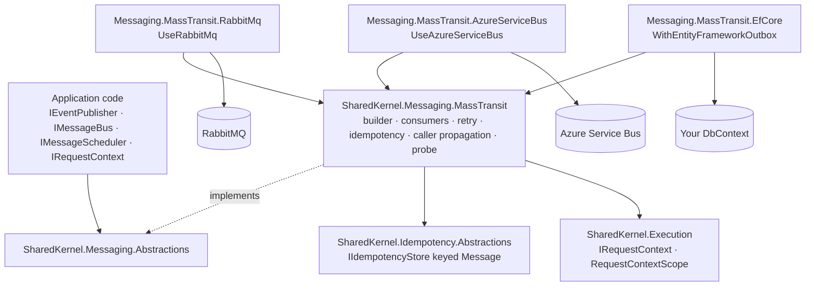

<div align="center">

# SharedKernel Messaging

**Events and commands between .NET services — RabbitMQ or Azure Service Bus behind one contract that returns
`Result`, with the caller's tenant travelling with the message and each message consumed once.**

[](https://dotnet.microsoft.com/)
[](../../../LICENSE)


-512BD4)
[](SharedKernel.Messaging.MassTransit.RabbitMq/README.md)
[](SharedKernel.Messaging.MassTransit.AzureServiceBus/README.md)

[What you get](#what-you-get) · [Packages](#packages) · [How it fits together](#how-it-fits-together) · [Get started](#get-started) · [See it run](#see-it-run) · [Guarantees](#guarantees)

<sub>📂 <code>src/Infrastructure/Messaging</code> · <a href="../../../docs/packages.md">all packages by tier</a> · <a href="../../../README.md">Platform.SharedKernel</a></sub>

</div>

---

## What you get

- **Failures you handle instead of catch.** `IEventPublisher` and `IMessageBus` return `Result` — a broker outage is
  `messaging.unavailable` (503), not an exception nobody catches; a bug is rethrown, never laundered into a `Result`.
- **CloudEvents on the wire.** Every integration event travels in `EventEnvelope<TEvent>`, with its wire name and
  version from `[IntegrationEvent]`.
- **The caller travels with the message.** With `WithInboundRequestContext()`, a consumer's `IRequestContext` answers
  for the tenant and actor that published, so tenant-scoped persistence works inside a consume as behind HTTP.
- **Each message consumed once per consumer.** `WithIdempotency()` reserves the message id in an atomic
  `IIdempotencyStore` before `ConsumerBase<T>` runs.
- **Declared failure handling.** Retry, circuit breaker, dead-letter TTL and fault consumers, plus broker-held
  deferral (`IMessageScheduler`), ordered delivery, payload compression and encryption, tracing, metrics and a
  readiness probe.
- **A transactional outbox** over your own `DbContext` (`WithEntityFrameworkOutbox<TDbContext>`), without the
  persistence packages knowing about messaging.

## Packages

| Package | Tier | Reference it from | Use it for |
| --- | --- | --- | --- |
| [SharedKernel.Messaging.Abstractions](SharedKernel.Messaging.Abstractions/README.md) | Abstractions | Application | `IEventPublisher`, `IMessageBus`, `IMessageScheduler`, `MessagingErrors` — publish, send and schedule |
| [SharedKernel.Messaging.MassTransit](SharedKernel.Messaging.MassTransit/README.md) | Adapter | Infrastructure | `AddSharedKernelMessaging(…)`: the bus builder, `ConsumerBase<T>`, retry, idempotency, caller propagation, probe |
| [SharedKernel.Messaging.MassTransit.RabbitMq](SharedKernel.Messaging.MassTransit.RabbitMq/README.md) | Adapter | Infrastructure | `UseRabbitMq(…)` — the bus on RabbitMQ |
| [SharedKernel.Messaging.MassTransit.AzureServiceBus](SharedKernel.Messaging.MassTransit.AzureServiceBus/README.md) | Adapter | Infrastructure | `UseAzureServiceBus(…)` — the bus on Azure Service Bus, with managed identity |
| [SharedKernel.Messaging.MassTransit.EfCore](SharedKernel.Messaging.MassTransit.EfCore/README.md) | Adapter | Infrastructure | `WithEntityFrameworkOutbox<TDbContext>()` — publish inside a database transaction |
| [SharedKernel.Messaging.Testing](SharedKernel.Messaging.Testing/README.md) | Testing | test projects | `InMemoryMessageBus`, `InMemoryEventPublisher` — assert what was published or sent |

Take the MassTransit core plus exactly one transport, and the outbox only if you publish inside a transaction — a
RabbitMQ service never restores the Azure SDK, and a service without an outbox never restores EF Core.

## How it fits together



- **Attribution, not authorization.** Correlation id, tenant and actor are written as transport headers through
  `SharedKernel.Execution`'s one mapping (shared with REST, gRPC and Temporal) and read back into a
  `RequestContextScope`. A permission check inside a consume always answers `false`, because anyone with broker access
  can write headers.
- **No tenant is ever inherited.** The tenant is absent when the publisher had none; a malformed tenant header yields
  no tenant rather than a fault.
- **Wait for readiness.** MassTransit starts the bus in the background; `/health/ready` stays unhealthy until the
  broker connection and bindings exist, so gate traffic and tests on it.
- **The deduplication store is yours to pick.** `WithIdempotency()` uses the
  [Idempotency](../Idempotency/README.md) store registered for `IdempotencyPurpose.Message`; `Build()` throws without one.

## Get started

```xml
<PackageReference Include="SharedKernel.Messaging.MassTransit" />
<PackageReference Include="SharedKernel.Messaging.MassTransit.RabbitMq" />
<PackageReference Include="SharedKernel.Idempotency.Redis" />
```

```csharp
builder.Services.AddSharedKernelRequestContext();              // the service's own IRequestContext, first
builder.Services.AddRedisIdempotency(p => p.ForMessages());    // the store WithIdempotency() uses

builder.Services
    .AddSharedKernelMessaging(builder.Configuration)           // SharedKernel:Messaging:ServiceName
    .UseRabbitMq(builder.Configuration.GetConnectionString("rabbitmq")!)
    .WithRetry()
    .WithIdempotency()               // a redelivered message runs each consumer once
    .WithInboundRequestContext()     // the publisher's tenant and actor reach the consumer
    .AddConsumer<OrderPlacedConsumer>()
    .Build();

[IntegrationEvent("orders.order-placed", Version = 1)]
public sealed record OrderPlaced(Guid EventId, DateTimeOffset OccurredOn, Guid OrderId, decimal Total)
    : IIntegrationEvent;

public sealed class OrderPlacedConsumer(IOrderRepository orders, ILogger<OrderPlacedConsumer> logger)
    : ConsumerBase<EventEnvelope<OrderPlaced>>(logger)
{
    protected override Task ConsumeAsync(EventEnvelope<OrderPlaced> envelope, CancellationToken ct) =>
        orders.MarkPlacedAsync(envelope.Data.OrderId, ct);   // tenant-scoped, like an HTTP request
}
```

Publish with `await events.PublishAsync(new OrderPlaced(…), ct)` from an injected `IEventPublisher`. `ServiceName`
prefixes every queue and is the CloudEvents `source`. The full setup — readiness, telemetry, send routes — is in the
[SharedKernel.Messaging.MassTransit Quick start](SharedKernel.Messaging.MassTransit/README.md#quick-start).

## See it run

[samples/ShippingApi](../../../samples/ShippingApi/README.md) is a service on the packed packages — publish, send,
delayed delivery, idempotency, inbound caller identity, retry, a fault consumer and the readiness probe — with
end-to-end scenarios against a real RabbitMQ broker (`masstransit/rabbitmq`, which ships the delayed-message plugin).

```bash
dotnet pack Platform.SharedKernel.slnx -c Release -o ./nupkgs -p:MinVerVersionOverride=1.0.0-local.1
dotnet test samples/ShippingApi/ShippingApi.Tests -p:SharedKernelPackageVersion=1.0.0-local.1
```

## Guarantees

| Guarantee | How it is held |
| --- | --- |
| **No exceptions for expected failures** — every verb returns `Result`; unrecognised exceptions are rethrown | `MessagingExceptionClassifierTests`, `MessagingErrorsTests`; analyzer `SK0030` flags a discarded `Result` |
| **No accidental double-processing** — one conditional reservation per message id and consumer | `IdempotencyPerConsumerTests`, `IdempotencyTests` |
| **No tenant leakage** across the bus | `InboundRequestContextTests` (`MalformedTenantHeader_ConsumesWithNoTenantRatherThanFaulting`), `HeaderPropagationTests`, `PropagationSymmetryTests` |
| **CloudEvents-compliant envelopes**, validated before any transport work | `CloudEventsEnvelopeTests`; analyzers `SK0038`, `SK0039` on `[IntegrationEvent]` |
| **No queue-name collisions** — every queue is prefixed with the validated service name | `ConsumerEndpointNamingTests`, `MessagingOptionsTests` |
| **No transport in application code** | Architecture rules `NoDirectBusInjectionOutsideMessaging`, `NoDirectMassTransitSchedulerInjection`; analyzers `SK0703`–`SK0708` |
| **Messaging and caching never reference each other** | Architecture rule `MessagingNeverReferencesCaching` |
| **A permissive licence** — MassTransit stays on 8.5.x, the last Apache-2.0 line | The pin and its rationale in `Directory.Packages.props` |

**Out of scope:** request/response over the bus (use [Communication](../Communication/README.md)), sagas and
multi-step orchestration ([Workflows](../Workflows/README.md)), recurring jobs ([Scheduling](../Scheduling/README.md)),
loss-tolerant Pub/Sub ([Caching](../Caching/README.md)'s Redis Pub/Sub), and Kafka or Amazon SQS (no adapter today).

---

<div align="center">
<sub>Part of <a href="../../../README.md">Platform.SharedKernel</a> · <a href="../../../docs/packages.md">all packages</a> · MIT license</sub>
</div>
