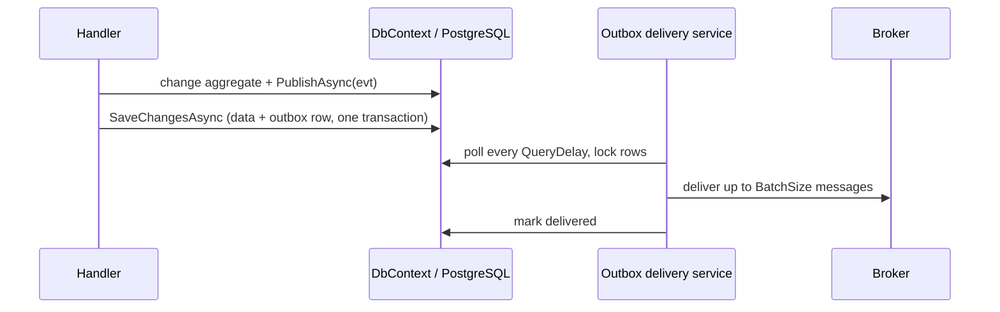

# SharedKernel.Messaging.MassTransit.EfCore

[](https://dotnet.microsoft.com/)
[](https://github.com/Gresta-Vertex-Labs/platform-shared-kernel/blob/main/LICENSE)


> **MassTransit's EF Core transactional outbox for
> [`SharedKernel.Messaging.MassTransit`](https://github.com/Gresta-Vertex-Labs/platform-shared-kernel/blob/main/src/Infrastructure/Messaging/SharedKernel.Messaging.MassTransit/README.md),
> over your service's own `DbContext`: a message published inside a unit of work is written in the same
> transaction as your data and delivered after the commit.**

| You get | So that |
| --- | --- |
| `WithEntityFrameworkOutbox<TDbContext>()` on the bus builder | The outbox is one line, combinable with either transport |
| Messages stored in your transaction | No lost event when the process dies after commit, no phantom event after a rollback |
| Background delivery after commit | Publishing never waits on the broker inside a transaction |
| `OutboxOptions.Database` (PostgreSQL by default) | The delivery poller locks rows with SQL your database accepts |
| A separate package | The core carries no EF Core dependency |

## Install

```xml
<PackageReference Include="SharedKernel.Messaging.MassTransit" />
<PackageReference Include="SharedKernel.Messaging.MassTransit.EfCore" />
<!-- plus one transport: SharedKernel.Messaging.MassTransit.RabbitMq or .AzureServiceBus -->
```

The version comes from your central `SharedKernelVersion` property — every SharedKernel package ships at the same
version. See [Using the packages](https://github.com/Gresta-Vertex-Labs/platform-shared-kernel#using-the-packages).

| Requirement | Value |
| --- | --- |
| Target framework | `net10.0` |
| Tier | Adapter — reference it from your **Api/Worker** (startup) project |
| Depends on | `SharedKernel.Messaging.MassTransit` (declared adapter edge), `MassTransit.EntityFrameworkCore` 8.5.x, `Microsoft.EntityFrameworkCore` |
| Namespaces | `SharedKernel.Messaging.MassTransit.Extensions` (`WithEntityFrameworkOutbox`), `SharedKernel.Messaging.MassTransit.Options` (`OutboxOptions`, `OutboxDatabase`) |

It does **not** reference `06.Persistence`: your `DbContext` arrives as a type parameter.

## Quick start

```csharp
using SharedKernel.Messaging.MassTransit.Extensions;

builder.Services
    .AddSharedKernelMessaging(builder.Configuration)
    .UseRabbitMq(builder.Configuration.GetConnectionString("rabbitmq")!)
    .WithEntityFrameworkOutbox<OrdersDbContext>()
    .WithRetry()
    .AddConsumer<OrderPlacedConsumer>()
    .Build();
```

Map MassTransit's outbox entities in the context and add a migration — the service owns it, and the tables must
exist before the bus starts:

```csharp
using MassTransit;
using Microsoft.EntityFrameworkCore;

protected override void OnModelCreating(ModelBuilder modelBuilder)
{
    base.OnModelCreating(modelBuilder);
    modelBuilder.AddInboxStateEntity();
    modelBuilder.AddOutboxMessageEntity();
    modelBuilder.AddOutboxStateEntity();
}
```

```bash
dotnet ef migrations add AddMassTransitOutbox
```

Then publish through `IEventPublisher`/`IMessageBus` inside the unit of work as usual: the message is written to
the outbox during `SaveChangesAsync` and delivered by MassTransit's background worker after the commit.

## How it works



- **At least once.** A crash between delivery and the outbox update redelivers the message, so consumers must be
  idempotent — enable `WithIdempotency()` on the consuming side.
- **The lock SQL follows `OutboxOptions.Database`.** MassTransit's own default is SQL Server syntax, which
  PostgreSQL rejects on every poll; this extension selects PostgreSQL unless told otherwise, and throws
  `ArgumentOutOfRangeException` for an undefined value at registration.
- Built on the core's `ConfigureMassTransit(...)` hook; the outbox is MassTransit's own. Call it once.

## Configuration

`OutboxOptions` is set through the `configure` action; it is not bound from configuration.

| Option | Type | Default | Meaning |
| --- | --- | --- | --- |
| `BatchSize` | `int` | `100` | Messages delivered per bus-outbox cycle (`MessageDeliveryLimit`) |
| `QueryDelay` | `TimeSpan` | `00:00:01` | Polling interval for undelivered rows |
| `DuplicateDetectionWindow` | `TimeSpan` | `00:30:00` | MassTransit's inbox deduplication window |
| `Database` | `OutboxDatabase` | `PostgreSql` | `PostgreSql`, `SqlServer`, `MySql` or `Sqlite` — the lock SQL of the delivery poller |

## Reference

| Method | Does |
| --- | --- |
| `MessagingBusBuilder.WithEntityFrameworkOutbox<TDbContext>(Action<OutboxOptions>? configure = null)` | Adds MassTransit's EF Core outbox and bus outbox over `TDbContext` |

This package does not log and registers no probe; the bus's `messaging` probe and log events belong to the
[MassTransit core](https://github.com/Gresta-Vertex-Labs/platform-shared-kernel/blob/main/src/Infrastructure/Messaging/SharedKernel.Messaging.MassTransit/README.md#reference).

## Testing

Application code is tested against
[`SharedKernel.Messaging.Testing`](https://github.com/Gresta-Vertex-Labs/platform-shared-kernel/blob/main/src/Testing/SharedKernel.Messaging.Testing/README.md)'s
in-memory fakes, with no outbox involved. To test the outbox wiring, use SQLite with a kept-open
`SqliteConnection("Data Source=:memory:")` and `Database = OutboxDatabase.Sqlite`, or PostgreSQL in a container
with the defaults; assert that an outbox row is written during `SaveChangesAsync`.

## Pitfalls

| Don't | Do | Why |
| --- | --- | --- |
| Start the bus before the outbox tables exist | Migrate first (`MigrateOnStartup`, or a deployment step) | The delivery service fails on every poll |
| Leave `Database` at the default on SQL Server, MySQL or SQLite | Set `o.Database = OutboxDatabase.SqlServer` (etc.) | The lock SQL must match the database |
| Assume exactly-once delivery | Make consumers idempotent with `WithIdempotency()` | The outbox is at-least-once |
| Write your own outbox table, writer or interceptor | Use this one | Two outboxes deliver twice or not at all |

## Design decisions

**Why MassTransit's outbox and no kernel outbox?** One implementation, maintained with the bus it feeds;
`06.Persistence` stays free of messaging. **Why MassTransit 8.5.x?** It is the last Apache-2.0 release.

---

Part of [Platform.SharedKernel](https://github.com/Gresta-Vertex-Labs/platform-shared-kernel) ·
[Messaging domain](https://github.com/Gresta-Vertex-Labs/platform-shared-kernel/blob/main/src/Infrastructure/Messaging/README.md) ·
[MIT license](https://github.com/Gresta-Vertex-Labs/platform-shared-kernel/blob/main/LICENSE)
