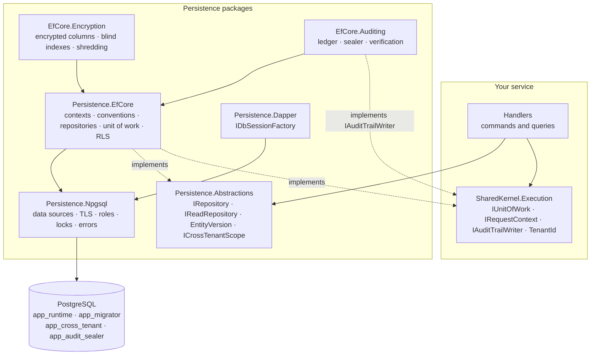

<div align="center">

# SharedKernel Persistence

**PostgreSQL persistence for multi-tenant .NET services — EF Core and Dapper over one connection, with row-level
security, optimistic concurrency, field encryption and a tamper-evident audit trail registered in one call.**

[](https://dotnet.microsoft.com/)
[](../../../LICENSE)


[](https://www.postgresql.org/)
[](https://learn.microsoft.com/ef/core/)
[](https://www.npgsql.org/)

[What you get](#what-you-get) · [Packages](#packages) · [How it fits together](#how-it-fits-together) · [Get started](#get-started) · [See it run](#see-it-run) · [Guarantees](#guarantees)

<sub>📂 <code>src/Infrastructure/Persistence</code> · <a href="../../../docs/packages.md">all packages by tier</a> · <a href="../../../README.md">Platform.SharedKernel</a></sub>

</div>

---

## What you get

- **One registration call.** `builder.AddSharedKernelPostgres<TContext>("orders", p => …)` wires the data source, the
  context, `IRepository<T,TId>`/`IReadRepository<T,TId>` for every aggregate and a retry-safe `IUnitOfWork`, validated
  when the host starts.
- **Tenant isolation three layers deep.** An EF Core query filter, a write guard and PostgreSQL row-level security bound
  per transaction, so hand-written SQL and a forgotten filter still see only the caller's tenant.
- **No lost updates.** `xmin` concurrency on every aggregate root, exposed as an opaque, ETag-ready `EntityVersion`.
- **Personal data encrypted at rest.** `UseFieldEncryption()` gives AES-256-GCM per column, searchable through blind
  indexes, rotatable and crypto-shreddable per tenant.
- **An audit trail you can verify.** `UseAuditTrail()` plus `IAuditableRequest` writes an append-only ledger sealed into
  per-tenant HMAC chains.
- **Hand-written SQL that plays by the same rules.** `IDbSessionFactory` sessions join the unit of work, bind the
  tenant and pick the right database role.

## Packages

| Package | Tier | Reference it from | Use it for |
| --- | --- | --- | --- |
| [SharedKernel.Persistence.Abstractions](SharedKernel.Persistence.Abstractions/README.md) | Abstractions | Application | `IRepository`, `IReadRepository`, `EntityVersion`, bulk mutations, `ICrossTenantScope` — no ORM |
| [SharedKernel.Persistence.EfCore](SharedKernel.Persistence.EfCore/README.md) | Adapter | Infrastructure | Contexts, conventions, repositories, the unit of work, multi-tenancy and RLS, migrations |
| [SharedKernel.Persistence.Npgsql](SharedKernel.Persistence.Npgsql/README.md) | Adapter | Infrastructure | Data sources, TLS, PgBouncer, advisory locks, error classification and the canonical role script |
| [SharedKernel.Persistence.Dapper](SharedKernel.Persistence.Dapper/README.md) | Adapter | Infrastructure | Hand-written SQL through `IDbSessionFactory`, in the same transaction and tenant binding |
| [SharedKernel.Persistence.EfCore.Encryption](SharedKernel.Persistence.EfCore.Encryption/README.md) | Adapter | Infrastructure | Encrypted columns, blind indexes, key rotation and per-tenant shredding |
| [SharedKernel.Persistence.EfCore.Auditing](SharedKernel.Persistence.EfCore.Auditing/README.md) | Adapter | Infrastructure | The audit ledger, its sealer and verification (`IAuditTrailWriter`, `IAuditQueryService`) |
| [SharedKernel.Persistence.Testing](SharedKernel.Persistence.Testing/README.md) | Testing | test projects | `FakeRepository`, `FakeUnitOfWork`, and a PostgreSQL fixture with the production role split |

Start with `Persistence.EfCore` (it brings `Npgsql`); add `Dapper`, `Encryption` or `Auditing` when the service needs
hand-written SQL, encrypted columns or an audit trail.

## How it fits together



- **Application code sees contracts only.** Handlers depend on
  [`SharedKernel.Execution`](../../Foundation/SharedKernel.Execution/README.md) and `Persistence.Abstractions`; the
  host wires the Adapter-tier packages.
- **One connection, one transaction, one tenant.** EF Core and Dapper share the data source; `app.tenant_id` is bound
  transaction-locally, so no session state outlives a transaction and PgBouncer is safe.
- **Retries replay the whole unit of work.** `IUnitOfWork.ExecuteInTransactionAsync` re-runs its delegate on a
  transient fault; an ambiguous `COMMIT` is never replayed.
- **Roles do the policing.** The runtime role cannot bypass row-level security; migrations, cross-tenant reports and
  audit sealing each run on their own role.

## Get started

```xml
<PackageReference Include="SharedKernel.Persistence.EfCore" />
<PackageReference Include="Microsoft.EntityFrameworkCore.Design" PrivateAssets="all" />
```

```csharp
builder.AddSharedKernelPostgres<OrderDbContext>("orders", p => p
    .UseMultiTenancy(rowLevelSecurity: true)    // tenant filter + write guard + row-level security
    .MigrateOnStartup());                        // migrations and seeders, one replica at a time

public sealed class RenameOrderHandler(IRepository<Order, OrderId> orders) : ICommandHandler<RenameOrder>
{
    public async Task<Result> Handle(RenameOrder command, CancellationToken ct)
    {
        var order = await orders.GetByIdAsync(command.Id, ct);   // tracked, whole aggregate, caller's tenant only
        if (order is null) return Result.Failure(OrderErrors.NotFound(command.Id));

        order.Rename(command.Name);
        return Result.Success();                                 // the transaction behavior saves and commits
    }
}
```

The connection string is `ConnectionStrings:orders`; every other setting of that database is under
`SharedKernel:Persistence:orders`. The full setup is in the
[SharedKernel.Persistence.EfCore Quick start](SharedKernel.Persistence.EfCore/README.md#quick-start).

<details>
<summary>A multi-tenant service in 10 minutes</summary>

The smallest end-to-end path: a multi-tenant service with row-level security, an audit trail and commands through the
application pipeline. These snippets are compiled and run against PostgreSQL by
[`PersistenceReadmeSampleTests`](../../Hosting/ServiceDefaults/SharedKernel.ServiceDefaults.Persistence/SharedKernel.ServiceDefaults.Persistence.Tests/Readme/PersistenceReadmeSampleTests.cs).

**1 — Packages.**

```xml
<PackageReference Include="SharedKernel.Persistence.EfCore" />
<PackageReference Include="SharedKernel.Persistence.EfCore.Auditing" />
<PackageReference Include="SharedKernel.Application.Pipeline" />          <!-- transaction + auditing behaviors -->
<PackageReference Include="SharedKernel.Application.Mediator.MediatR" />  <!-- ISender -->
<PackageReference Include="SharedKernel.ServiceDefaults.Security" />      <!-- IRequestContext over the user -->
<PackageReference Include="SharedKernel.ServiceDefaults.Persistence" />   <!-- readiness checks -->
<PackageReference Include="Microsoft.EntityFrameworkCore.Design" PrivateAssets="all" />
```

**2 — Configuration.** The connection string is always `ConnectionStrings:{name}`; every other setting of that
database is in `SharedKernel:Persistence:{name}`. The roles come from the
[canonical role script](SharedKernel.Persistence.Npgsql/README.md#1-create-the-roles-the-canonical-script).

```json
{
  "ConnectionStrings": {
    "orders": "Host=db;Database=orders;Username=app_runtime;Password=..."
  },
  "SharedKernel": {
    "Persistence": {
      "ServiceName": "orders-api",
      "orders": {
        "MigrationConnectionString": "Host=db;Database=orders;Username=app_migrator;Password=...",
        "RowLevelSecurity": {
          "CrossTenantConnectionString": "Host=db;Database=orders;Username=app_cross_tenant;Password=..."
        }
      },
      "Auditing": {
        "CurrentKeyId": "k1",
        "Keys": { "k1": { "Material": "<base64, 32 bytes or more — from your secret store>", "Order": 1 } }
      }
    }
  }
}
```

> [!TIP]
> For local development: `docker run -d --name orders-db -p 5432:5432 -e POSTGRES_PASSWORD=dev -e POSTGRES_DB=orders postgres:17`.
> A superuser bypasses row-level security, so run the role script or set
> `SharedKernel:Persistence:orders:RowLevelSecurity:PrivilegeCheck` to `Warn` in `appsettings.Development.json`.

**3 — The domain and the context.** No configuration class: conventions map the id, `Money`, audit and tenant
columns, `xmin` and snake_case names.

```csharp
public sealed record OrderId(Guid Value) : StronglyTypedId<Guid>(Value)
{
    public static OrderId New() => new(Guid.NewGuid());
}

public sealed class Order : TenantedAuditableAggregateRoot<OrderId>
{
    public Order(OrderId id, TenantId tenantId, string customer, Money total, IClock clock)
        : base(id, tenantId, clock)
    {
        Customer = customer;
        Total = total;
    }

    private Order() { } // EF Core materialization

    public string Customer { get; private set; } = string.Empty;
    public Money Total { get; private set; } = null!;
}

public sealed class OrderDbContext(DbContextOptions<OrderDbContext> options, PersistenceContextDependencies dependencies)
    : TenantedDbContext(options, dependencies)
{
    public DbSet<Order> Orders => Set<Order>();
}
```

**4 — Registration.**

```csharp
var builder = WebApplication.CreateBuilder(args);

builder.Services.AddOidcAuthentication(builder.Configuration);        // 12.Security: who is calling
builder.Services.AddSharedKernelRequestContext();                     // 13: IRequestContext (user, tenant) for everything below
builder.Services.AddSharedKernelCryptography(builder.Configuration);  // 01.Core: the audit ledger's MAC

builder.AddSharedKernelPostgres<OrderDbContext>("orders", p => p
    .UseMultiTenancy(rowLevelSecurity: true)   // tenant filter + write guard + transaction-local RLS
    .UseAuditTrail()                           // IAuditTrailWriter, sealer, self-check
    .MigrateOnStartup());                      // migrations + seeders, one replica at a time

builder.Services.AddSharedKernelApplication(typeof(Program).Assembly, app => app   // handlers, validators, domain events
    .UseMediatR()                              // ISender, with MediatR as the transport
    .WithTransactions()                        // one retry-safe transaction per command
    .WithAuditing());                          // Succeeded inside it, Failed after rollback

builder.Services.AddHealthChecks()
    .AddDatabaseReadinessCheck<OrderDbContext>()   // not ready until startup migrations finished
    .AddPersistenceStartupReadinessCheck()
    .AddSharedKernelReadiness();                   // every provider probe, including audit sealing
```

**5 — Migrations.** A design-time factory connects as the migration role and sees the same model as the service:

```csharp
public sealed class OrderDbContextFactory() : PostgresDesignTimeDbContextFactory<OrderDbContext>("orders")
{
    protected override OrderDbContext Create(DbContextOptions<OrderDbContext> options, PersistenceContextDependencies dependencies)
        => new(options, dependencies);

    // The same capabilities as the registration in step 4, so the migration is generated from the model the service
    // runs: field encryption widens encrypted columns and adds their blind-index columns.
    protected override void ConfigurePersistence(EfCorePersistenceBuilder<OrderDbContext> persistence)
        => persistence.UseMultiTenancy(rowLevelSecurity: true).UseAuditTrail();
}
```

Run `dotnet ef migrations add Initial`, then add the platform's database objects after the generated `CreateTable` calls:

```csharp
protected override void Up(MigrationBuilder migrationBuilder)
{
    // ... generated CreateTable calls ...

    migrationBuilder.EnableTenantRowLevelSecurityForModel(TargetModel!);          // every tenant table: FORCE RLS + tenant policy
    migrationBuilder.CreateAuditLedgerTable(runtimeRole: "app_runtime");           // ledger tables, triggers, exact grants
    // with .UseFieldEncryption(k => k.UseTenantDataKeys()):  migrationBuilder.CreateTenantEncryptionKeyTable();
}
```

**6 — The first command.**

```csharp
public sealed record PlaceOrder(OrderId Id, string Customer, decimal Amount)
    : ICommand<OrderId>, IAuditableRequest<Result<OrderId>>
{
    public string Action => "order.placed";
    public string ResourceType => nameof(Order);
    public string ResourceId => Id.Value.ToString();
    public string? BeforeSnapshot => null;
    public string? GetAfterSnapshot(Result<OrderId> response) => null;
}

public sealed class PlaceOrderHandler(IRepository<Order, OrderId> orders, IRequestContext caller, IClock clock)
    : ICommandHandler<PlaceOrder, OrderId>
{
    public async Task<Result<OrderId>> Handle(PlaceOrder command, CancellationToken cancellationToken)
    {
        var total = Money.Create(command.Amount, Currency.Eur).Value;
        await orders.AddAsync(new Order(command.Id, caller.TenantId!.Value, command.Customer, total, clock), cancellationToken);
        return command.Id; // no SaveChanges: TransactionBehavior saves and commits
    }
}
```

`await sender.Send(new PlaceOrder(OrderId.New(), "Ada", 42m))` runs the handler inside
`IUnitOfWork.ExecuteInTransactionAsync` (a handler may run more than once, so it keeps HTTP calls and messages out of
its body), saves, inserts the `Succeeded` audit record in the same transaction and commits — all as `app_runtime` with
`app.tenant_id` bound transaction-locally. A failed `Result` rolls everything back and writes a `Failed` record on its
own connection; the background sealer later links the record into its tenant's HMAC chain.

</details>

## See it run

- [samples/BillingApi](../../../samples/BillingApi/README.md) — a multi-tenant billing API on every package, built
  from the packed NuGet packages: encrypted, searchable emails; `Money` invoice lines; payments written by Dapper and
  EF Core in one transaction; ETags; soft delete; bulk updates; a sealed audit history; a cross-tenant report; tenant
  erasure.

  ```bash
  cd samples/BillingApi
  dotnet publish -c Release -t:PublishContainer -p:ContainerRepository=billing-api -p:ContainerImageTag=local
  docker compose up -d        # PostgreSQL with the four roles + the API, Production mode
  ./smoke-test.sh             # checks over HTTP
  ```

- [samples/Shop](../../../samples/Shop/README.md) — Catalog on EF Core with row-level security and Inventory on Dapper
  under RLS, two replicas each, run by an Aspire AppHost (`samples/Shop/build.sh`, then
  `dotnet run --project samples/Shop/Shop.AppHost --launch-profile http`).

## Guarantees

| Guarantee | How it is held |
| --- | --- |
| **No cross-tenant reads or writes** through EF Core, Dapper or raw SQL | `TenantIsolationPostgresTests`, `RowLevelSecurityIntegrationTests` and `TenantWriteGuardTests` against PostgreSQL as `app_runtime`; `SK0202` flags `IgnoreQueryFilters()` in service code |
| **A misconfigured database fails at startup** — a runtime role that could bypass RLS, or audit-ledger grants that are too wide | `RowLevelSecurityPrivilegeTests`, `SelfCheckTests` |
| **No lost updates** — `EntityVersion` is an opaque, aggregate-bound token | `ConcurrencyIntegrationTests`, `EntityVersionPostgresTests`, `XminConcurrencyTokenConventionTests` |
| **Retry-safe transactions**, and only the unit of work saves | `TransactionRetryPostgresTests`; architecture rule `OnlyEfUnitOfWorkMayCallSaveChanges` |
| **Repositories never expose `IQueryable`**, and read repositories never track | Architecture rules `RepositoriesMustNotExposeIQueryable`, `ReadOnlyRepositoriesNeverTrack` |
| **Encrypted values are bound to row, column and tenant**, and erasable per tenant | `CipherAndBlindIndexTests`, `KeyRingTests`, `ErasureAndMaintenanceTests` |
| **The audit trail is append-only and tamper-evident**, in a [specified format](SharedKernel.Persistence.EfCore.Auditing/AUDIT-FORMAT.md) | `TamperDetectionTests`, `AuditFormatVectorTests`, `AuditImmutabilityMigrationBuilderExtensionsIntegrationTests` |
| **Domain projects never take the persistence stack** | Architecture rule `DomainAssembliesNeverReferencePersistenceStack` |

**Out of scope:** databases other than PostgreSQL, two-phase commit across databases, read-replica routing inside one
context, lazy loading, and the messaging outbox (owned by [Messaging](../Messaging/README.md)).

---

<div align="center">
<sub>Part of <a href="../../../README.md">Platform.SharedKernel</a> · <a href="../../../docs/packages.md">all packages</a> · MIT license</sub>
</div>
