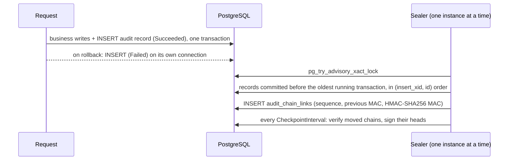

# SharedKernel.Persistence.EfCore.Auditing

[](https://dotnet.microsoft.com/)
[](https://github.com/Gresta-Vertex-Labs/platform-shared-kernel/blob/main/LICENSE)


-informational)

> **An append-only, tamper-evident audit ledger on PostgreSQL: every command records who did what to which resource
> in one `INSERT`, a background sealer chains the records with keyed MACs, and anyone can verify the chain — while
> personal data in the records stays erasable.**

| You get | So that |
| --- | --- |
| `.UseAuditTrail()` implementing `IAuditTrailWriter` | The application pipeline's `WithAuditing()` records every `IAuditableRequest` |
| One `INSERT` per record, inside the business transaction | Auditing costs no lock, no sequence and no retry on the request path |
| Per-(tenant, resource type) HMAC-SHA256 chains sealed in commit-safe order | Edited, deleted, reordered or backfilled records are detected |
| `Intact` / `Broken` / `Unverifiable` verification with the failure kind and sequence | You know whether, where and how a chain was tampered with |
| Signed checkpoints, key rotation and compromise recovery | Truncation and rewrites are caught, and a stolen key stops being useful |
| Payload erasure that keeps the chain verifiable | GDPR/KVKK erasure without breaking the proof |
| A [specified byte format](https://github.com/Gresta-Vertex-Labs/platform-shared-kernel/blob/main/src/Infrastructure/Persistence/SharedKernel.Persistence.EfCore.Auditing/AUDIT-FORMAT.md) with test vectors | An auditor can verify the ledger with their own code |

## Contents

- [Install](#install)
- [Quick start](#quick-start)
- [How it works](#how-it-works)
- [Recipes](#recipes)
- [Configuration](#configuration)
- [Reference](#reference)
- [Testing](#testing)
- [Pitfalls](#pitfalls)
- [Design decisions](#design-decisions)

## Install

```xml
<PackageReference Include="SharedKernel.Persistence.EfCore.Auditing" />
```

The version comes from your central `SharedKernelVersion` property — every SharedKernel package ships at the same
version. See [Using the packages](https://github.com/Gresta-Vertex-Labs/platform-shared-kernel#using-the-packages).

| Requirement | Value |
| --- | --- |
| Target framework | `net10.0` |
| Tier | Adapter — reference it from your **Infrastructure** project |
| Database | PostgreSQL 15 or later |
| Depends on | `SharedKernel.Persistence.EfCore` (declared adapter edge, pinned to the exact version), `SharedKernel.Cryptography` (`IHmacSigner`, optional `IAsymmetricSignatureService`) |
| Implements | `IAuditTrailWriter` from `SharedKernel.Execution` (`SharedKernel.Execution.Auditing`) |
| Namespaces | `SharedKernel.Persistence` (`UseAuditTrail`), `SharedKernel.Persistence.EfCore.Auditing` (query, maintenance, options), `SharedKernel.Persistence.EfCore` (migration helpers) |

## Quick start

**1. Register** — the ledger binds `SharedKernel:Persistence:Auditing` from the same configuration:

```csharp
using SharedKernel.Cryptography.Extensions;
using SharedKernel.Persistence;

builder.Services.AddSharedKernelCryptography(builder.Configuration);   // IHmacSigner (.AddAsymmetricSigning() for checkpoints)

builder.AddSharedKernelPostgres<OrderDbContext>("orders", p => p
    .UseMultiTenancy(rowLevelSecurity: true)
    .UseAuditTrail());
```

```json
{
  "SharedKernel": {
    "Persistence": {
      "Auditing": {
        "CurrentKeyId": "k2",
        "Keys": {
          "k1": { "Material": "<base64, 32+ bytes, from a secret store>", "Order": 1 },
          "k2": { "Material": "<base64, 32+ bytes, from a secret store>", "Order": 2 }
        },
        "CheckpointSigningKeyId": "audit-checkpoints-2026",
        "Sealer": { "Interval": "00:00:02", "BatchSize": 500, "CheckpointInterval": "01:00:00" },
        "SelfCheck": "Fail"
      }
    }
  }
}
```

**2. Create the tables** in a migration (they are not part of the EF Core model):

```csharp
protected override void Up(MigrationBuilder migrationBuilder) =>
    migrationBuilder.CreateAuditLedgerTable(runtimeRole: "app_runtime", sealerRole: "app_audit_sealer");
protected override void Down(MigrationBuilder migrationBuilder) => migrationBuilder.DropAuditLedgerTable();
```

**3. Audit a command** — with `SharedKernel.Application.Pipeline`, a marker interface is all it takes:

```csharp
public sealed record ApproveOrder(OrderId Id) : ICommand, IAuditableRequest<Result>
{
    public string Action => "order.approved";
    public string ResourceType => nameof(Order);
    public string ResourceId => Id.Value.ToString();
    public string? BeforeSnapshot => null;
    public string? GetAfterSnapshot(Result response) => null;
}

// builder.Services.AddSharedKernelApplication(typeof(Program).Assembly, app => app
//     .UseMediatR().WithTransactions().WithAuditing());
```

## How it works



- **Write.** `IAuditTrailWriter.RecordAsync` runs one `INSERT` (record + erasable payload). `Succeeded` goes into the
  caller's transaction via `IUnitOfWork.OnBeforeCommit` and commits or rolls back with the business write; `Failed`
  commits on its own connection after a rollback.
- **Fields.** User, actor kind, client, session and tenant come from `IRequestContext`; the source service from
  `SharedKernel:Persistence:ServiceName`; correlation and trace ids from the ambient `Activity`; action, resource,
  outcome, snapshots, error code, approval id and idempotency key from the `AuditEntry`. An unauthenticated caller is
  recorded as `Anonymous`, never as `System`. Oversized values throw `ArgumentException` before any SQL
  (`AuditFieldLimits`). A record without a tenant is accepted only from an authenticated system identity or inside a
  cross-tenant scope. A reused `IdempotencyKey` returns the stored record (6700).
- **Seal.** The sealer takes records whose inserting transaction is older than the oldest running one, so a late
  commit is never skipped or sealed out of order. Each chain is one tenant and one resource type: tenants never
  contend, and verification never reads another tenant's records. The lock is transaction-scoped, so it works behind a
  transaction-mode pooler.
- **Verify.** `Intact`, `Broken` or `Unverifiable`, with a failure kind: `SequenceGap`, `HashMismatch`, `LinkMismatch`,
  `KeyRegression`, `AnchorMismatch`, `TailTruncated`, `UnknownKey`, `PayloadErased`, `NotSealed`.
- **Append-only.** Database triggers refuse `UPDATE`/`DELETE` for every role except the owner and superusers; the
  startup self-check reports anything that would let the runtime role alter the ledger.

## Recipes

### 1. Write a record outside the request pipeline

```csharp
public sealed class ApproveOrderHandler(IAuditTrailWriter audit, IUnitOfWork unitOfWork) : ICommandHandler<ApproveOrder>
{
    public async Task<Result> Handle(ApproveOrder command, CancellationToken ct)
    {
        // ... change the aggregate ...
        unitOfWork.OnBeforeCommit(token => audit.RecordAsync(new AuditEntry
        {
            Action = "order.approved",
            ResourceType = "Order",
            ResourceId = command.Id.Value.ToString(),
            Outcome = AuditOutcome.Succeeded,
            AfterSnapshot = afterJson,
        }, token));
        return Result.Success();
    }
}
```

### 2. Read, verify, export and erase

```csharp
var history = await auditQuery.QueryAsync(new AuditRecordQuery { ResourceType = "Order", ResourceId = id }, ct);
var chain   = await auditQuery.VerifyChainAsync("Order", requirePayloads: false, ct);
// chain.IsIntact; otherwise chain.Status, chain.FailureKind and chain.FailedAtSequence say what and where

await maintenance.EraseResourcePayloadsAsync("Customer", customerId, "GDPR request 2026-114", ct);
```

Erasure deletes snapshots and their salt and records the erasure; the chain stays verifiable because it commits to
`SHA-256(salt ‖ payload)`. `QueryAcrossTenantsAsync` needs an active `ICrossTenantScope`; it and `ExportRangeAsync`
record their own `AuditLedger` entry first.

### 3. Rotate a key, or recover from a compromise

1. **Rotate:** add the new key with a higher `Order`, set `CurrentKeyId` to it, deploy. Old records keep verifying
   with the old key, which must stay in `Keys` (removing it makes them `Unverifiable` / `UnknownKey`).
2. **Compromise:** right after rotating, run `IAuditLedgerMaintenance.SealAllChainsAsync("reason")` inside a
   cross-tenant scope. Every chain gets a marker sealed under the new key and a fresh checkpoint; a record forged later
   with the old key is reported as `KeyRegression`, a re-sealed old record as `LinkMismatch`.
3. **Checkpoint signing keys** rotate the same way: keep the old id in `AcceptedCheckpointSigningKeyIds`. Verification
   never trusts the key id a checkpoint names on its own.

Register your own `IAuditRecordAuthenticator` (a KMS computing MACs remotely) or `IAuditCheckpointSink` (WORM storage)
before `UseAuditTrail` to replace the defaults; the keyring is then not required.

### 4. Run the sealer under its own role

The canonical roles are in the
[Npgsql README](https://github.com/Gresta-Vertex-Labs/platform-shared-kernel/blob/main/src/Infrastructure/Persistence/SharedKernel.Persistence.Npgsql/README.md#1-create-the-roles-the-canonical-script).
`CreateAuditLedgerTable` revokes everything the roles hold on the ledger tables and grants exactly:

| Table | `app_runtime` | `app_audit_sealer` |
| --- | --- | --- |
| `audit_records` | `SELECT, INSERT` | `SELECT` |
| `audit_record_payloads` | `SELECT, INSERT, DELETE` (DELETE = payload erasure) | — |
| `audit_chain_links`, `audit_checkpoints` | `SELECT` (plus `INSERT` when there is no sealer role) | `SELECT, INSERT` |

Revoke the cross-tenant role's write privileges too:

```csharp
migrationBuilder.Sql("REVOKE UPDATE, DELETE, TRUNCATE ON audit_records, audit_record_payloads, audit_chain_links, audit_checkpoints FROM app_cross_tenant;");
```

Then register the sealer's database under a key of its own and point the sealer at it:

```csharp
// ConnectionStrings:audit-sealer connects as app_audit_sealer
builder.Services.AddSharedKernelNpgsql(builder.Configuration.GetSection("SharedKernel:Persistence:audit-sealer"), "audit-sealer");
```

```json
{
  "SharedKernel": {
    "Persistence": {
      "audit-sealer": { "ConnectionStringName": "audit-sealer" },
      "Auditing": { "Sealer": { "DataSourceName": "audit-sealer" } }
    }
  }
}
```

Without a separate sealer role, anything running as the application can insert into `audit_chain_links`; a forged
link cannot hide unsealed records and verification reports its MAC, but only the role split keeps the application from
writing seals at all.

## Configuration

Section `SharedKernel:Persistence:Auditing` (`AuditLedgerOptions`), validated at startup: the current key must exist and
have the highest `Order`, every key must decode to at least 32 bytes, orders must be distinct.

| Key | Type | Default | Meaning |
| --- | --- | --- | --- |
| `SharedKernel:Persistence:Auditing:CurrentKeyId` | `string?` | — (required with the keyring) | Key new records are sealed under |
| `SharedKernel:Persistence:Auditing:Keys:{id}:Material` | `string` (Base64) | — | MAC key, ≥ 32 bytes, from a secret store |
| `SharedKernel:Persistence:Auditing:Keys:{id}:Order` | `int` | — | Rotation order; newer keys higher |
| `SharedKernel:Persistence:Auditing:CheckpointSigningKeyId` | `string?` | `null` (no checkpoints) | `IAsymmetricSignatureService` key for checkpoints |
| `SharedKernel:Persistence:Auditing:AcceptedCheckpointSigningKeyIds` | `string[]` | empty | Older signing keys verification still accepts |
| `SharedKernel:Persistence:Auditing:Sealer:Enabled` | `bool` | `true` | Run the sealer in this process (one instance seals at a time) |
| `SharedKernel:Persistence:Auditing:Sealer:Interval` | `TimeSpan` | `00:00:02` | Pause between sealing rounds |
| `SharedKernel:Persistence:Auditing:Sealer:BatchSize` | `int` | `500` | Records sealed per transaction |
| `SharedKernel:Persistence:Auditing:Sealer:CheckpointInterval` | `TimeSpan` | `01:00:00` | How often moved chains are checkpointed |
| `SharedKernel:Persistence:Auditing:Sealer:MaxReadyLag` | `TimeSpan` | `00:05:00` | Sealing lag above which the probe reports `Degraded` |
| `SharedKernel:Persistence:Auditing:Sealer:DataSourceName` | `string?` | `null` (application connection) | Keyed data source of a separate sealer role |
| `SharedKernel:Persistence:Auditing:SelfCheck` | `Off` \| `Warn` \| `Fail` | `Warn` | Startup self-check outcome; use `Fail` in production |

## Reference

| Method / type | Does |
| --- | --- |
| `EfCorePersistenceBuilder<T>.UseAuditTrail()` | Registers the writer, query and maintenance services, the sealer, the self-check and the probe |
| `IAuditTrailWriter.RecordAsync(AuditEntry)` | Appends one record (`SharedKernel.Execution.Auditing`) |
| `IAuditQueryService` | `QueryAsync(AuditRecordQuery)` (caller's tenant, keyset paging), `QueryAcrossTenantsAsync`, `ExportRangeAsync`, `VerifyChainAsync`, `VerifyChainFromCheckpointAsync`, `VerifyRecordAsync` |
| `IAuditLedgerMaintenance` | `SealPendingAsync`, `SealAllChainsAsync(reason)`, `ErasePayloadAsync(recordId, reason)`, `EraseResourcePayloadsAsync(type, id, reason)` |
| `CreateAuditLedgerTable(runtimeRole, sealerRole?)`, `DropAuditLedgerTable()` | Migration helpers; `AuditLedgerSchema.CreateScript` holds the same idempotent DDL |
| `IAuditRecordAuthenticator`, `IAuditCheckpointSink` | Replaceable MAC and checkpoint seams |

### Health

`UseAuditTrail()` registers the `audit-sealing` readiness probe (`AuditSealingReadiness.ProbeName`): `Healthy` while
sealing keeps up, `Degraded` when the oldest unsealed record is older than `Sealer:MaxReadyLag`, `Unhealthy` when the
ledger cannot be read. `AddSharedKernelReadiness()` exposes it on `/health/ready`.

### Logging

| Event id | Level | Event |
| --- | --- | --- |
| 6700 | Information | An idempotent duplicate returned the stored record |
| 6701 | Error | Writing a failed-outcome record failed; the failure is not in the ledger |
| 6702 | Error | A chain verified as broken or unverifiable |
| 6703 | Debug | Sealing pass completed |
| 6704 | Error | Sealing round failed; retried after the interval |
| 6705 | Debug | Another instance holds the sealer lock |
| 6706 / 6707 | Information / Error | Checkpoint signed / checkpoint emission failed |
| 6708 | Warning | Self-check finding |
| 6709 | Critical | Self-check failed with `SelfCheck: Fail`; the host will not start |
| 6710 | Information | Self-check passed |
| 6711 | Information | Payloads erased |
| 6712 | Warning | Chains resealed under a new key |
| 6713 | Information | Sealer started |

Telemetry: meter and `ActivitySource` `SharedKernel.Persistence.EfCore.Auditing` — append duration, idempotent
duplicates, sealed records, seal duration and lag, verification failures by kind, checkpoints, erased payloads.

## Testing

In handler unit tests, replace the writer with
[`SharedKernel.Persistence.Testing`](https://github.com/Gresta-Vertex-Labs/platform-shared-kernel/blob/main/src/Testing/SharedKernel.Persistence.Testing/README.md)'s
`services.AddFakeAuditTrailWriter()` and assert on the entries it recorded. To test the ledger itself, use
`PostgresTestServer`/`PostgresTestDatabase` (the production role split) and `IAuditLedgerMaintenance.SealPendingAsync()`
to seal without waiting for the background interval.

## Pitfalls

| Don't | Do | Why |
| --- | --- | --- |
| Run the application as the table owner or a superuser | Use the role script; `SelfCheck: Fail` in production | Owners and superusers can disable the triggers |
| Enable row-level security on ledger tables | Leave them without RLS | The ledger filters by tenant itself, and the sealer reads every tenant |
| `UPDATE` or `DELETE` audit rows | `EraseResourcePayloadsAsync` / `ErasePayloadAsync` | Only snapshots are erasable; the chain proves everything else |
| Put personal data in `Action`, `ResourceId` or `ErrorCode` | Put it in snapshots | Only payloads can be erased |
| Remove a retired key from `Keys` | Keep it while its records must verify | Removal makes them `Unverifiable` |
| Open a standalone transaction for `Succeeded` | Queue it with `OnBeforeCommit` | It must commit or roll back with the business write |
| Share the application role with the sealer | Register a sealer data source (`Sealer:DataSourceName`) | Otherwise the application can write seals |

## Design decisions

**Why a background sealer instead of chaining on write?** Chaining on the request path needs a lock per chain and
serializes every write; the sealer keeps the request path to one insert and seals late commits in commit-safe order.

**Why HMAC chains plus asymmetric checkpoints?** MACs make records tamper-evident to anyone without the key;
checkpoints signed outside the chain catch truncation and a rewrite by someone who has it.

**Why salted payload commitments?** The chain commits to `SHA-256(salt ‖ payload)`, so erasing a payload and its salt
removes the personal data without breaking verification.

Distinct from `SharedKernel.Persistence.EfCore`'s audit columns, which stamp the mutable `CreatedBy`/`ModifiedOn` columns
and keep no history.

---

Part of [Platform.SharedKernel](https://github.com/Gresta-Vertex-Labs/platform-shared-kernel) ·
[Persistence domain](https://github.com/Gresta-Vertex-Labs/platform-shared-kernel/blob/main/src/Infrastructure/Persistence/README.md) ·
[MIT license](https://github.com/Gresta-Vertex-Labs/platform-shared-kernel/blob/main/LICENSE)
