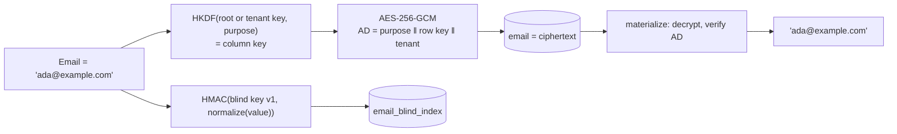

# SharedKernel.Persistence.EfCore.Encryption

[](https://dotnet.microsoft.com/)
[](https://github.com/Gresta-Vertex-Labs/platform-shared-kernel/blob/main/LICENSE)


> **Column-level encryption for EF Core on PostgreSQL: mark a property with `.Encrypt("purpose")` and it is stored as
> AES-256-GCM ciphertext — searchable by value, rotatable without downtime, and erasable per tenant.**

| You get | So that |
| --- | --- |
| `.Encrypt("purpose")` in the entity configuration | Backups, replicas, dumps and read-only access never expose the value; the domain type keeps a plain `string` |
| Ciphertext bound to purpose, row key and tenant | A value copied to another row, column or tenant fails to decrypt |
| `.WithBlindIndex(...)` + `WhereEncryptedEquals` | Rows can be found by value without decrypting the table |
| A query guard | LINQ that would filter, sort or project an encrypted column is refused before it runs |
| `IEncryptionRotationJob` with a safe-to-retire report | Keys rotate and existing plaintext is migrated without downtime |
| Per-tenant data keys + `ShredTenantAsync` | One call makes a tenant's encrypted data unrecoverable, backups included |

## Contents

- [Install](#install)
- [Quick start](#quick-start)
- [How it works](#how-it-works)
- [Recipes](#recipes)
- [Configuration](#configuration)
- [Reference](#reference)
- [Testing](#testing)
- [Pitfalls](#pitfalls)
- [Design decisions](#design-decisions)

## Install

```xml
<PackageReference Include="SharedKernel.Persistence.EfCore.Encryption" />
```

The version comes from your central `SharedKernelVersion` property — every SharedKernel package ships at the same
version. See [Using the packages](https://github.com/Gresta-Vertex-Labs/platform-shared-kernel#using-the-packages).

| Requirement | Value |
| --- | --- |
| Target framework | `net10.0` |
| Tier | Adapter — reference it from your **Infrastructure** project |
| Depends on | `SharedKernel.Persistence.EfCore` (declared adapter edge, pinned to the exact version), `SharedKernel.Cryptography` |
| Key source | Any `IEncryptionKeyProvider` — Azure Key Vault (`SharedKernel.Cryptography.KeyVault.Azure`), configuration, or your own |
| Namespaces | `SharedKernel.Persistence` (`UseFieldEncryption`), `SharedKernel.Persistence.EfCore` (`Encrypt`, `WithBlindIndex`, `WhereEncryptedEquals`), `SharedKernel.Persistence.EfCore.Encryption` (options, `.BlindIndex`, `.Maintenance`, `.TenantKeys`) |

## Quick start

**1. Register** — encryption plugs into the EF Core registration:

```csharp
using SharedKernel.Persistence;

// A KMS (Azure Key Vault): the key source and, for tenant data keys, the envelope provider that wraps them.
builder.Services.AddSharedKernelCryptography(builder.Configuration)
    .AddAzureKeyVaultEncryption(builder.Configuration);

builder.AddSharedKernelPostgres<OrderDbContext>("orders", p => p
    .UseMultiTenancy(rowLevelSecurity: true)
    .UseFieldEncryption(k => k.UseTenantDataKeys()));   // optional: per-tenant keys and crypto-shredding
```

**2. Mark properties** — in the entity configuration, never with attributes on domain types:

```csharp
using SharedKernel.Persistence.EfCore;

public sealed class CustomerConfiguration : IEntityTypeConfiguration<Customer>
{
    public void Configure(EntityTypeBuilder<Customer> b)
    {
        b.Property(x => x.Email).HasMaxLength(320).Encrypt("customer.email")
            .WithBlindIndex(BlindIndexNormalization.Trim | BlindIndexNormalization.CaseFold);
        b.Property(x => x.NationalId).Encrypt("customer.national_id");
    }
}
```

**3. Use it** — reads decrypt; lookups go through the blind index:

```csharp
var customer = await db.Customers.WhereEncryptedEquals(c => c.Email, "  Ada@Example.com ").SingleOrDefaultAsync(ct);
```

Without a key-source call, the `IEncryptionKeyProvider` already in the container is used; `k.FromConfiguration()` reads
keys from `SharedKernel:Persistence:Encryption:Keys`, `k.UseKeyProvider<TProvider>()` names a provider type. Options are
validated at host start with the key source, so a missing provider fails the start, not the first request.

```json
{
  "SharedKernel": {
    "Persistence": {
      "Encryption": {
        "Keys": { "CurrentKeyId": "k2", "Keys": { "k1": "<base64 32 bytes>", "k2": "<base64 32 bytes>" } },
        "BlindIndexKeys": { "CurrentVersion": "v1", "Keys": { "v1": "<base64 >= 32 bytes>" } }
      }
    }
  }
}
```

## How it works



- **Interceptor-based**, never a `ValueConverter`: the entity keeps plaintext in memory, the column holds ciphertext,
  and the associated data can include the primary key and tenant.
- **One key per column**, derived with HKDF-SHA256 from the root key (or the tenant's data key) and the purpose; a
  random 96-bit nonce per value.
- **Blind indexes use their own versioned keys** (`v1:3fa9…`), so rotating the encryption key never touches lookups.
  They are tenant-bound and reveal which rows hold equal values — index only high-cardinality properties.
- **The query guard.** Filtering, sorting, grouping, joining, projecting (`Select(x => x.Email)`) and `ExecuteUpdate`
  setters on an encrypted member are refused before the query runs; only `== null` / `!= null` are allowed.
  Hand-written SQL (`FromSql`, `ExecuteSql`, Dapper) is not checked.
- **Asynchronous key providers** (a KMS) are bridged: keys are loaded at startup and refreshed every
  `KeyRefreshInterval`. An unknown key id is fetched in the background — that one read throws
  `EncryptionKeyNotFoundException`, later reads succeed.
- **A stored plaintext value is never read silently**: materializing it throws until `EncryptPlaintext` has run.
- **The model stores only strings, flags and names**, so `dotnet ef` and compiled models work — with a design-time
  factory that calls `UseFieldEncryption()` in `ConfigurePersistence`.

| Marking rule | Detail |
| --- | --- |
| Purpose | Stable, lowercase, dotted, unique across the model; bound into every value — renaming tables or columns never breaks data, renaming a purpose does |
| Supported | `string` properties on entities and on complex types at any depth |
| Rejected at model build | Non-`string`, complex collections, JSON-mapped and struct complex types, composite or shadow keys, keys other than `Guid`/`long`/`int`/`string` |
| Keys | Assigned on the client (UUID v7 or a strongly-typed id), because the key is bound into the value |
| Length | `HasMaxLength(n)` is the plaintext length; the column is widened to fit the ciphertext |
| Custom normalization | `k.AddBlindIndexNormalizer<TNormalizer>()` (`IBlindIndexNormalizer`), referenced by name |

## Recipes

### 1. Rotate the encryption key without downtime

1. Add the new key to the key source, not yet current. Wait at least `KeyRefreshInterval` (every process can decrypt
   with it).
2. Make it current. Wait `KeyRefreshInterval` again (every process now encrypts with it).
3. Run the maintenance job with `ReEncrypt` and `ExpectedCurrentKeyId` = the new key.
4. Run `VerifyOnly`; retire the old key only when `report.IsSafeToRetire(oldKeyId)` is true.

The job reads and writes every tenant's rows, so it requires a cross-tenant scope **the caller** entered, in a scope
whose `IRequestContext` identifies the job:

```csharp
public sealed class KeyRotationJob(IServiceScopeFactory scopes) : BackgroundService
{
    protected override async Task ExecuteAsync(CancellationToken stoppingToken)
    {
        await using var scope = scopes.CreateAsyncScope();
        var services = scope.ServiceProvider;
        // services resolve IRequestContext; register it for jobs as e.g. new SystemRequestContext([], "key-rotation")
        using (services.GetRequiredService<ICrossTenantScope>().Enter("rotate field encryption to k2"))
        {
            var report = await services.GetRequiredService<IEncryptionRotationJob>().RunAsync(new EncryptionMaintenanceRequest
            {
                Mode = EncryptionMaintenanceMode.ReEncrypt | EncryptionMaintenanceMode.RecomputeBlindIndexes,
                ExpectedCurrentKeyId = "k2",
            }, progress: null, stoppingToken);
        }
    }
}
```

| Mode | Does |
| --- | --- |
| `VerifyOnly` | Decrypts every value and counts it by key; writes nothing |
| `ReEncrypt` | Moves values not on the current key (or the tenant's data key) onto it |
| `RecomputeBlindIndexes` | Rewrites indexes under the current blind-index version and normalization |
| `EncryptPlaintext` | Encrypts values still stored as plaintext (a column just marked `.Encrypt`) |

The job walks every encrypted column in primary-key order in short transactions with plain SQL, writing with a
batched compare-and-swap, so a value changed concurrently is left alone and counted. Cancelling returns a
`CheckpointToken` to resume. Run it from a hosted service, scheduled job or workflow activity — never from request
handling (SK0303). Each transaction runs with `row_security = off`, so it needs a role that bypasses row-level security:
the cross-tenant data source is used automatically, or pass one with `k.UseMaintenanceDataSource(sp => …)`.

**Blind-index key:** add the new version and make it current (lookups match every configured version), run
`RecomputeBlindIndexes`, confirm `VerifyOnly` reports `StaleBlindIndexes == 0`, then remove the old version.

### 2. Encrypt an existing plaintext column

Deploy the `.Encrypt(...)` model, then run the job with `EncryptPlaintext` before serving reads of that column.

### 3. Crypto-shred a tenant

With `UseTenantDataKeys()` every encrypted value of a tenanted entity is encrypted under its tenant's own data key,
generated and wrapped by the registered `IEnvelopeEncryptionProvider` (a KMS master key) and stored wrapped in
`sk_tenant_encryption_keys`:

```csharp
migrationBuilder.CreateTenantEncryptionKeyTable();
migrationBuilder.Sql("REVOKE DELETE, TRUNCATE ON sk_tenant_encryption_keys FROM app_runtime, app_cross_tenant;");
```

```csharp
using (crossTenantScope.Enter("GDPR erasure request 2026-114"))   // required, as for the maintenance job
{
    TenantShredResult result = await keys.ShredTenantAsync(tenantId, cancellationToken: ct); // ITenantEncryptionKeyManager
}
```

Shredding deletes the wrapped key (keeping a tombstone, so the tenant id never gets a new key) and clears the tenant's
blind indexes in one transaction. Afterwards reading or writing one of its values throws `TenantKeyShreddedException`.
Values written before `UseTenantDataKeys()` or still in plaintext are not erased: `ShredTenantAsync` checks first and
throws `TenantShredIncompleteException` (with the counts), changing nothing — run `ReEncrypt | EncryptPlaintext`, then
shred, or pass `new TenantShredOptions { AllowIncompleteErasure = true }` and read `result.IsComplete`,
`RootKeyValues`, `PlaintextValues`. Unencrypted columns are untouched — delete or anonymize them yourself.

| After a shred | Guarantee |
| --- | --- |
| EF Core writes in a transaction | Every save that encrypts a tenant's value re-reads the tombstone and locks the key row (`FOR SHARE`) |
| EF Core writes without a transaction | The tombstone is re-read just before the save's transaction: a shred committing inside that window is missed for that one save |
| Reads | This process forgets the key at once; another process can decrypt from its cache for up to `TenantKeyCacheDuration` |
| Dapper, raw SQL | Not checked |

Wrapped keys in database backups keep the data recoverable until those backups expire or the master key is destroyed.

## Configuration

Section `SharedKernel:Persistence:Encryption` (`EncryptionOptions`), bound from the configuration given to
`AddSharedKernelPostgres`, adjusted by `k.Configure(...)`, validated at startup, and read once (no reload).

| Key | Type | Default | Meaning |
| --- | --- | --- | --- |
| `SharedKernel:Persistence:Encryption:Keys:CurrentKeyId` | `string?` | — | Key new values use (only with `FromConfiguration()`) |
| `SharedKernel:Persistence:Encryption:Keys:Keys:{id}` | `string` (Base64, 32 bytes) | — | Every key still needed for decryption (only with `FromConfiguration()`) |
| `SharedKernel:Persistence:Encryption:BlindIndexKeys:CurrentVersion` | `string?` | — | Version new blind indexes use |
| `SharedKernel:Persistence:Encryption:BlindIndexKeys:Keys:{version}` | `string` (Base64, ≥ 32 bytes) | — | Every version lookups must match |
| `SharedKernel:Persistence:Encryption:KeyRefreshInterval` | `TimeSpan` | `00:05:00` | Re-read interval for an asynchronous key provider |
| `SharedKernel:Persistence:Encryption:AdditionalDecryptionKeyIds` | `string[]` | empty | Key ids that must decrypt from the first request |
| `SharedKernel:Persistence:Encryption:MaxKeyStaleness` | `TimeSpan` | `00:30:00` | Refresh age above which the probe reports unhealthy |
| `SharedKernel:Persistence:Encryption:TenantKeyCacheDuration` | `TimeSpan` | `00:05:00` | How long an unwrapped tenant key stays in memory |
| `SharedKernel:Persistence:Encryption:TenantKeySchema` | `string?` | `null` (default schema) | Schema of the tenant key table |
| `SharedKernel:Persistence:Encryption:RequireRowSecurityBypass` | `bool` | `true` | Maintenance and shredding run with `row_security = off`; `false` only for a role that sees every row through its own policy |

Keep key material in a secret store (Key Vault configuration, a mounted secret), never in a checked-in file.

## Reference

| Method / type | Does |
| --- | --- |
| `EfCorePersistenceBuilder<T>.UseFieldEncryption(Action<FieldEncryptionBuilder>?)` | Registers the interceptors, query guard, maintenance job and probe |
| `FieldEncryptionBuilder` | `FromConfiguration()`, `UseKeyProvider<T>()` / `UseKeyProvider(factory)`, `UseTenantDataKeys()` / `UseTenantDataKeys<TEnvelopeProvider>()`, `UseBlindIndexKeys<TProvider>()`, `UseMaintenanceDataSource(factory)`, `AddBlindIndexNormalizer<T>()`, `Configure(Action<EncryptionOptions>)` |
| `.Encrypt("purpose")`, `.WithBlindIndex(BlindIndexNormalization, normalizer?)` | Mark a property (in `IEntityTypeConfiguration<T>`) |
| `dbSet.WhereEncryptedEquals(x => x.P, value)`, `query.WhereEncryptedEquals(db, x => x.P, value, tenantId?)` | Blind-index lookup; the `IQueryable` overload takes the context and, for cross-tenant jobs, a `TenantId` |
| `IEncryptionRotationJob.RunAsync(EncryptionMaintenanceRequest, progress, ct)` | Maintenance; `Mode`, `ExpectedCurrentKeyId`, `CheckpointToken`, `BatchSize` (500) |
| `ITenantEncryptionKeyManager.ShredTenantAsync(tenantId, options?, ct)` | Crypto-shreds a tenant |
| `CreateTenantEncryptionKeyTable()` | Migration helper for tenant keys |

### Errors

`TenantKeyShreddedException` — code `Persistence.Encryption.TenantKeyShredded` (NotFound);
`TenantShredIncompleteException` — `Persistence.Encryption.TenantShredIncomplete` (Conflict);
`EncryptionKeyNotFoundException` for a key id not yet loaded.

### Health

`UseFieldEncryption()` registers the `field-encryption` readiness probe (`FieldEncryptionReadiness.ProbeName`):
`Unhealthy` until the keys are loaded and when they were not refreshed within `MaxKeyStaleness`.

### Logging

| Event id | Level | Event |
| --- | --- | --- |
| 6500 | Warning | Key refresh failed; keys loaded earlier stay in use |
| 6501 | Error | Keys not refreshed for longer than allowed |
| 6502 / 6503 | Information / Warning | An unloaded key was fetched on demand / the fetch failed |
| 6504 | Warning | A previous save stopped between encryption and restore; plaintext restored |
| 6510 / 6511 / 6512 | Information / Debug / Information | Maintenance started / batch processed / finished |
| 6513 | Warning | Maintenance found values it could not process |
| 6520 | Information | Tenant data key created |
| 6521 | Warning | Tenant data key shredded |
| 6522 | Warning | A shredded tenant still has root-key or plaintext values |

Meter `SharedKernel.Persistence.EfCore.Encryption`: encrypt/decrypt failures by reason, maintenance values written and
skipped, tenant keys shredded. No metric or log carries key material, a value, a primary key or a tenant id.

## Testing

Use a static key source in tests — `k.FromConfiguration()` with keys from an in-memory configuration — and run
encryption against real PostgreSQL through
[`SharedKernel.Persistence.Testing`](https://github.com/Gresta-Vertex-Labs/platform-shared-kernel/blob/main/src/Infrastructure/Persistence/SharedKernel.Persistence.Testing/README.md)'s
`PostgresTestServer`/`PostgresTestDatabase`. `AddFakeCrossTenantScope()` covers handler tests that only enter a scope.
The query guard and the model checks run without a database.

## Pitfalls

| Don't | Do | Why |
| --- | --- | --- |
| Filter, order or project an encrypted column in LINQ | `WhereEncryptedEquals`, or load and filter in memory | The query guard throws `InvalidOperationException` |
| Omit `UseFieldEncryption()` from the design-time factory | `ConfigurePersistence(p => p.UseFieldEncryption(...))` | `dotnet ef migrations add` fails with "never wired in" |
| Start without a key source | Register `IEncryptionKeyProvider`, or `FromConfiguration()` / `UseKeyProvider<T>()` | Startup validation fails |
| Serve reads of a newly encrypted column before migrating | Run `EncryptPlaintext` first | Materializing plaintext throws |
| Shred with values still under a root key | Run `ReEncrypt` and `EncryptPlaintext`, then shred | `TenantShredIncompleteException` |
| Run maintenance from a request handler | A hosted service, job or workflow activity | SK0303; it needs a cross-tenant scope and an RLS-bypassing role |
| Mark encryption with attributes on domain types | Configure in `IEntityTypeConfiguration<T>` | SK0302; the domain stays persistence-free |
| Blind-index low-cardinality values | Index high-cardinality values only | Equal values are visible through the index |
| Retire a key before `IsSafeToRetire` | Run `VerifyOnly` first | Values still under it would become unreadable |

## Design decisions

**Why interceptors, not a `ValueConverter`?** A converter sees only the value; the associated data must bind the
primary key and tenant, which only the save pipeline knows.

**Why per-purpose derived keys?** A compromised column key exposes one column, and renaming a table or column never
breaks data.

**Why tenant data keys and tombstones?** Erasing a tenant is one key deletion instead of rewriting every row, and the
tombstone guarantees the tenant id is never re-keyed.

**Protects against:** reading personal data from backups, replicas, dumps and direct database access; moving a
ciphertext; a query that would expose an encrypted column in SQL. **Does not protect against:** a compromised
application process (it holds the keys), equality inference through blind indexes, or a writer that bypasses EF Core.

---

Part of [Platform.SharedKernel](https://github.com/Gresta-Vertex-Labs/platform-shared-kernel) ·
[Persistence packages](https://github.com/Gresta-Vertex-Labs/platform-shared-kernel/blob/main/src/Infrastructure/Persistence/README.md) ·
[MIT license](https://github.com/Gresta-Vertex-Labs/platform-shared-kernel/blob/main/LICENSE)
