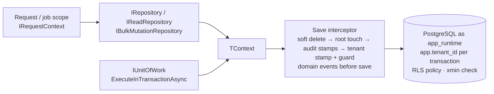

# SharedKernel.Persistence.EfCore

[](https://dotnet.microsoft.com/)
[](https://github.com/Gresta-Vertex-Labs/platform-shared-kernel/blob/main/LICENSE)


> **EF Core on PostgreSQL the way a multi-tenant production service needs it — registered with one call, correct by
> convention, and safe under retries, concurrency and row-level security.** It implements the repositories of
> `SharedKernel.Persistence.Abstractions`; add `.Dapper` for hand-written SQL in the same transaction, `.Auditing`
> for a tamper-evident ledger and `.Encryption` for column encryption.

| You get | So that |
| --- | --- |
| `AddSharedKernelPostgres<TContext>("orders", p => …)` | One call registers the context, repositories, unit of work and startup checks, validated at start |
| Conventions for strongly-typed ids, `TenantId`, `Money`, audit/soft-delete/tenant columns, `xmin`, snake_case | No per-entity configuration for the things every service repeats |
| One retry-safe transaction per DI scope | Several repositories and contexts commit together; an ambiguous commit is never replayed |
| Tenant filter + write guard + transaction-local row-level security | A missing filter or hand-written query still sees only the caller's tenant |
| Opaque `EntityVersion` ETags over `xmin` | `If-Match` works and a stale write is a `ConflictException` |
| Domain events dispatched before every save | No save path forgets them |
| `MigrateOnStartup()`, seeders, a design-time factory | Migrations run once across replicas, and `dotnet ef` sees the runtime model |

## Contents

- [Install](#install)
- [Quick start](#quick-start)
- [How it works](#how-it-works)
- [Recipes](#recipes)
- [Configuration](#configuration)
- [Reference](#reference)
- [Testing](#testing)
- [Pitfalls](#pitfalls)
- [Design decisions](#design-decisions)

## Install

```xml
<PackageReference Include="SharedKernel.Persistence.EfCore" />
<PackageReference Include="Microsoft.EntityFrameworkCore.Design" PrivateAssets="all" />   <!-- for dotnet ef -->
```

The version comes from your central `SharedKernelVersion` property — every SharedKernel package ships at the same
version. See [Using the packages](https://github.com/Gresta-Vertex-Labs/platform-shared-kernel#using-the-packages).

| Requirement | Value |
| --- | --- |
| Target framework | `net10.0` |
| Tier | Adapter — reference it from your **Infrastructure** project |
| Database | PostgreSQL 15 or later (the only supported database) |
| Depends on | `SharedKernel.Persistence.Abstractions`, `SharedKernel.Persistence.Npgsql` (declared adapter edge), Npgsql's EF Core provider, `EFCore.NamingConventions`, `Pgvector.EntityFrameworkCore` |
| Namespaces | `SharedKernel.Persistence` (registration), `SharedKernel.Persistence.EfCore` (model and migration helpers), `.EfCore.Context` (context bases), `.EfCore.Concurrency`, `.EfCore.Migrations`, `.EfCore.Seeding`, `.EfCore.Options` |

Companion packages: [`.EfCore.Encryption`](https://github.com/Gresta-Vertex-Labs/platform-shared-kernel/blob/main/src/Infrastructure/Persistence/SharedKernel.Persistence.EfCore.Encryption/README.md)
(`.UseFieldEncryption()`), [`.EfCore.Auditing`](https://github.com/Gresta-Vertex-Labs/platform-shared-kernel/blob/main/src/Infrastructure/Persistence/SharedKernel.Persistence.EfCore.Auditing/README.md)
(`.UseAuditTrail()`), [`.Dapper`](https://github.com/Gresta-Vertex-Labs/platform-shared-kernel/blob/main/src/Infrastructure/Persistence/SharedKernel.Persistence.Dapper/README.md)
(SQL in the same transaction), and [`SharedKernel.ServiceDefaults.Persistence`](https://github.com/Gresta-Vertex-Labs/platform-shared-kernel/blob/main/src/Hosting/ServiceDefaults/SharedKernel.ServiceDefaults.Persistence/README.md)
(database and startup readiness checks).

## Quick start

**1. The context** — one constructor with both parameters forwarded; no configuration base class:

```csharp
using Microsoft.EntityFrameworkCore;
using SharedKernel.Persistence.EfCore.Context;

public sealed class OrderDbContext(DbContextOptions<OrderDbContext> options, PersistenceContextDependencies dependencies)
    : TenantedDbContext(options, dependencies)          // SharedKernelDbContext when there are no tenants
{
    public DbSet<Order> Orders => Set<Order>();
}
```

**2. The registration** — reads `ConnectionStrings:orders` and `SharedKernel:Persistence:orders`:

```csharp
using SharedKernel.Persistence;

builder.AddSharedKernelPostgres<OrderDbContext>("orders", p => p
    .UseMultiTenancy(rowLevelSecurity: true)    // tenant filter + write guard + row-level security
    .MigrateOnStartup());                        // migrations and seeders, one replica at a time
```

```json
{
  "ConnectionStrings": { "orders": "Host=db;Database=orders;Username=app_runtime;Password=..." },
  "SharedKernel": { "Persistence": { "orders": {
    "MigrationConnectionString": "Host=db;Database=orders;Username=app_migrator;Password=..."
  } } }
}
```

**3. Use it** — repositories for every aggregate are registered; the unit of work commits:

```csharp
public sealed class RenameOrderHandler(IRepository<Order, OrderId> orders) : ICommandHandler<RenameOrder>
{
    public async Task<Result> Handle(RenameOrder command, CancellationToken ct)
    {
        var order = await orders.GetByIdAsync(command.Id, ct);   // tracked, whole aggregate, caller's tenant only
        if (order is null) return Result.Failure(OrderErrors.NotFound(command.Id));

        order.Rename(command.Name);
        return Result.Success();                                 // the transaction behavior saves and commits
    }
}
```

## How it works



| The one call registers | Lifetime |
| --- | --- |
| The `NpgsqlDataSource` for the connection name (shared with Dapper) | Singleton |
| `TContext`, `IDbContextFactory<TContext>` (attaches the scope's caller) | Scoped |
| `ICallerDbContextFactory<TContext>` (explicit caller, for singletons and background work) | Singleton |
| `IRepository<,>`, `IReadRepository<,>`, `IBulkMutationRepository<,>` for every aggregate of the model | Scoped, open-generic |
| `IUnitOfWork` (the first context), `IUnitOfWork<TContext>`, keyed `IUnitOfWork` (key `typeof(TContext)`) | Scoped |
| `ICrossTenantScope`, `IPersistenceStartup` | Scoped / singleton |
| A fail-closed anonymous `IRequestContext` and an `IClock`, when none is registered | — |
| Startup validation of options and model; a hosted warm-up of the entity-version key | — |

**Conventions** (overridable by explicit configuration):

| You write | You get |
| --- | --- |
| `record OrderId(Guid Value) : StronglyTypedId<Guid>(Value)` | A `uuid` column, no converter to register |
| `Money Total` | `total_amount numeric(19,4)` + `total_currency char(3)`; required unless `Money?` |
| An aggregate root | PostgreSQL `xmin` as its concurrency token, exposed as an opaque `EntityVersion` |
| `IHasAudit` / `ISoftDeletable` / `IHasTenant` | The columns, lengths, indexes and filters; `CreatedBy`/`CreatedOn` written once |
| A `TenantId` / `TenantId?` property | A `uuid` column through a built-in converter |
| A child entity changed inside an aggregate | The root row is touched, so its version advances and is checked |
| Any name | `snake_case`; identifiers above 63 bytes truncated deterministically |

- **Transactions.** `IUnitOfWork.ExecuteInTransactionAsync` runs the whole delegate inside the retrying execution
  strategy (6 retries by default), so a transient failure replays it from scratch — load inside the delegate. Every
  context of the scope on the same database joins; nested calls join; a failed nested call makes the transaction
  rollback-only (`TransactionRolledBackException`); a `COMMIT` with an unknown outcome throws
  `CommitOutcomeUnknownException` and is never replayed. `OnBeforeCommit` queues work inside the transaction.
- **Tenancy.** In a `TenantedDbContext` every entity type implements `IHasTenant` (children included) or is
  `[TenantShared]` / `IsTenantShared()`; anything else fails the model build. Each tenant type gets a named query
  filter, a write guard and `TenantId` as a concurrency token. A `null` tenant fails closed. With
  `rowLevelSecurity: true`, `app.tenant_id` is bound transaction-locally (PgBouncer-safe) and the runtime role's
  privileges and every tenant table's policy coverage are checked at startup.
- **Errors.** Every PostgreSQL error from a save is classified: unique → Conflict; foreign key → Validation or
  Conflict; RLS or privilege → Forbidden; serialization failures and timeouts → transient Conflict. Every concurrency
  conflict is `ConflictException` with `persistence.concurrency_conflict` — also for another tenant's row, so the
  answer never reveals that it exists.
- **Tracing.** Every query is `TagWith`'d with its specification type and every repository call is traced.

## Recipes

### 1. Optimistic concurrency with ETag / If-Match

The version is an opaque `EntityVersion`: `xmin` sealed with the aggregate's identity under an HKDF subkey (purpose
`SharedKernel.Persistence.EntityVersion`) of the service's key provider — which can be the one field encryption uses.

```csharp
// Production: a KMS
builder.Services.AddSharedKernelCryptography(builder.Configuration).AddAzureKeyVaultEncryption(builder.Configuration);
// or keys already in memory (development, a secret store read at startup):
builder.Services.AddSingleton<ISynchronousEncryptionKeyProvider>(
    new StaticEncryptionKeyProvider("k1", [new CryptographicKey("k1", key32)]));
```

Read the version from a **tracked** instance and let `SharedKernel.Presentation.WebApi` carry it over HTTP:

```csharp
// Query handler: IRepository tracks; the version lives in the change tracker.
var order = await orders.GetByIdAsync(id, ct);
return new VersionedOrder(order!.ToView(), ConcurrencyVersion.Get(db, order));   // 28 characters, never a number

// Endpoints
app.MapGet("/orders/{id:guid}", (Guid id, ISender sender, CancellationToken ct) =>
    sender.Send(new GetOrder(new OrderId(id)), ct)
        .ToOkWithETag(found => found.Version.ToString(), found => found.Order));   // 304 on a matching If-None-Match

app.MapPut("/orders/{id:guid}", (Guid id, RenameOrderRequest body, IfMatch<EntityVersion> ifMatch, ISender sender,
    CancellationToken ct) =>
    sender.Send(new RenameOrder(new OrderId(id), body.Name, ifMatch.Version), ct).ToNoContent());

// Command handler: a stale version fails the save with ConflictException.
await orders.UpdateAsync(order, command.ExpectedVersion, ct);
```

A stale, foreign, altered or unknown-key token is `ConflictException`, answered 412 when the request carried
`If-Match`/`If-None-Match` and 409 otherwise. `ConcurrencyVersion.TryGetCurrentVersion(exception, out var current)`
reads the current version for a hand-written response. The key is loaded before traffic (at most 10 seconds) and
refreshed in the background; if it cannot be loaded (6025, 6026) the service still starts and the first request that
needs a version loads it. Readiness never waits for it.

### 2. Query, page and project

```csharp
SpecificationBuilder<Order> Open() => Spec.For<Order>().Where(o => o.Status == OrderStatus.Open);   // builders are mutable

PagedList<Order> page = await orders.ListPagedAsync(Open().OrderByDescending(o => o.CreatedOn), PageRequest.Create(2, 50).Value, ct);
CursorPagedList<Order> slice = await orders.ListKeysetAsync(Open(), CursorPageRequest.Create(cursor, 50).Value, o => o.CreatedOn, descending: true, ct);
IReadOnlyList<OrderRow> rows = await orders.ListProjectedAsync(Open().Select(o => new OrderRow(o.Id, o.Total)), ct);
await foreach (var order in orders.StreamAsync(Open(), ct)) { /* constant memory */ }
```

Put `Include`s of the whole aggregate in a repository subclass's `AggregateQuery()` (subclass `EfRepository` /
`EfReadRepository`), or in the entity configuration (`Navigation(...).AutoInclude()`).

### 3. One transaction around several repositories

```csharp
await unitOfWork.ExecuteInTransactionAsync(async ct =>
{
    var order = await orders.GetByIdAsync(id, ct);   // load INSIDE: the delegate may run again
    order!.Ship();
    await shipments.AddAsync(Shipment.For(order), ct);
}, ct);
```

Keep HTTP calls and publishing out of the delegate; queue them with `ICommandScope.OnCompleted` (after the commit) or
the messaging outbox. Through the request pipeline, `app.WithTransactions()` does this for every command.

### 4. Row-level security migrations

```csharp
protected override void Up(MigrationBuilder migrationBuilder)
{
    // ... generated CreateTable calls ...
    migrationBuilder.EnableTenantRowLevelSecurityForModel(TargetModel!);   // FORCE RLS + policy on every tenant table
    migrationBuilder.EnableTenantRowLevelSecurity("payments");            // a table outside the EF model
}
```

Roles and grants: see the canonical script in the
[Npgsql README](https://github.com/Gresta-Vertex-Labs/platform-shared-kernel/blob/main/src/Infrastructure/Persistence/SharedKernel.Persistence.Npgsql/README.md#1-create-the-roles-the-canonical-script).

### 5. Cross-tenant work

```csharp
using (crossTenantScope.Enter("monthly revenue report"))   // reason required; logged with the caller
{
    db.Database.UseCrossTenantConnection();                 // under RLS: the cross-tenant database role
    var all = await db.Invoices.IgnoreQueryFilters([PersistenceFilterNames.Tenant]).ToListAsync(ct);
}
```

The scope holds for every repository, context and Dapper session of the DI scope until disposed. Under RLS it needs
`RowLevelSecurity:CrossTenantConnectionString`; there is no escape token.

### 6. Migrations, seeding and `dotnet ef`

```csharp
builder.AddSharedKernelPostgres<OrderDbContext>("orders", p => OrderPersistence.Configure(p)
    .MigrateOnStartup(lockTimeout: TimeSpan.FromMinutes(5))
    .AddSeeder<ReferenceDataSeeder>());

// dotnet ef uses this factory: it connects as the migration role and sees the same model as the service.
public sealed class OrderDbContextFactory() : PostgresDesignTimeDbContextFactory<OrderDbContext>("orders")
{
    protected override OrderDbContext Create(DbContextOptions<OrderDbContext> options, PersistenceContextDependencies dependencies)
        => new(options, dependencies);

    protected override void ConfigurePersistence(EfCorePersistenceBuilder<OrderDbContext> persistence)
        => OrderPersistence.Configure(persistence);   // UseMultiTenancy(...).UseAuditTrail().UseFieldEncryption(...)
}
```

`MigrateOnStartup()` applies migrations and runs seeders under a cross-replica advisory lock over
`MigrationConnectionString`; `IPersistenceStartup` completes when they are done and readiness checks wait for it. The
factory reads `--connection "…"`, then `SharedKernel:Persistence:{name}:MigrationConnectionString`, then
`ConnectionStrings:{name}`. In CI you can instead apply `dotnet ef migrations script --idempotent` as the owner role.

### 7. Several contexts, background work

Call `AddSharedKernelPostgres` once per context; inject `IUnitOfWork<TContext>` or
`[FromKeyedServices(typeof(TContext))] IUnitOfWork`. Contexts on the same database share the transaction; one on
another database cannot join and its pending changes fail the commit. When contexts share an assembly, override
`ShouldApplyConfiguration(Type)`. A hosted service names its caller:

```csharp
await using var db = await callerFactory.CreateDbContextAsync(new SystemRequestContext([], "nightly-billing"), ct);
```

### 8. Bulk updates, JSONB and vectors

```csharp
await bulk.ExecuteUpdateAsync(Spec.For<Order>().Where(o => o.Status == OrderStatus.Draft && o.CreatedOn < cutoff),
    s => s.SetProperty(o => o.Status, OrderStatus.Expired), ct);                 // one UPDATE, ModifiedBy/On stamped

builder.HasJsonbColumn(e => e.Settings, AppJsonContext.Default.OrderSettings);   // structural comparer
builder.HasVectorColumn(e => e.Embedding, dimensions: 1536)
       .HasVectorIndex(e => e.Embedding, VectorIndexMethod.Hnsw, VectorDistanceMetric.Cosine);
var nearest = Spec.For<Doc>().OrderBy(VectorOrderingExpressions.ByDistance<Doc>(d => d.Embedding, query, VectorDistanceMetric.Cosine)).Take(10);
```

Vectors need `ConfigureProvider(o => o.UseVector = true)`.

## Configuration

```csharp
builder.AddSharedKernelPostgres<OrderDbContext>("orders", p => p
    .ConfigureProvider(o => { o.MaxRetryCount = 6; o.UseVector = true; })    // retry (0 = off), pgvector
    .ConfigureDataSource((sp, ds) => ds.MapEnum<OrderStatus>())                // Npgsql data-source builder
    .ConfigureDbContext((sp, o) => o.UseModel(OrderDbContextModel.Instance))   // compiled model, other options
    .UseDbContextPooling()                                                     // safe with multi-tenancy
    .UseServiceName("orders-api")                                              // actor for writes without a user
    .UseUuidV7Keys()                                                           // unset Guid keys as UUID v7
    .AddInterceptor<MyInterceptor>());
```

| Key / setting | Type | Default | Meaning |
| --- | --- | --- | --- |
| `ConnectionStrings:{name}` | `string` | — (required) | Runtime role connection string |
| `SharedKernel:Persistence:{name}:*` | — | — | Migration, read-only and cross-tenant connections, timeouts, TLS, `UseVector`, RLS privilege check — see the [Npgsql README](https://github.com/Gresta-Vertex-Labs/platform-shared-kernel/blob/main/src/Infrastructure/Persistence/SharedKernel.Persistence.Npgsql/README.md#configuration) |
| `SharedKernel:Persistence:ServiceName` | `string` | `system` | Actor recorded for writes without a user (or `UseServiceName`) |
| `PostgresProviderOptions.MaxRetryCount` | `int` | `6` | Transient-fault retries; `0` turns retry off |
| `PostgresProviderOptions.MaxRetryDelay` | `TimeSpan` | 30 s | Upper bound of the retry back-off |
| `PostgresProviderOptions.AdditionalTransientErrorCodes` | `ICollection<string>` | empty | Extra SQLSTATEs to retry |
| `PostgresProviderOptions.UseVector` | `bool` | `false` | pgvector mapping |
| `UseMultiTenancy(rowLevelSecurity, rowLevelSecurityCheck)` | `RowLevelSecurityCheckMode?` | `Fail` (`Warn` in Development) | Policy-coverage check: `Fail`, `Warn`, `Off` |
| `UseDbContextPooling(poolSize)` | `int` | `1024` | Context pool size |

## Reference

| Method / type | Does |
| --- | --- |
| `IHostApplicationBuilder.AddSharedKernelPostgres<TContext>(name, configure)` | The registration; also on `IServiceCollection` with `(configuration, name, configure)`. Registering a context twice throws |
| `EfCorePersistenceBuilder<TContext>` | `ConfigureProvider`, `ConfigureDataSource`, `UseDataSource`, `ConfigureDbContext`, `UseDbContextPooling`, `UseServiceName`, `UseUuidV7Keys`, `MigrateOnStartup(lockTimeout?)`, `AddSeeder<T>`, `AddInterceptor<T>`, `UseMultiTenancy(...)` |
| `SharedKernelDbContext`, `TenantedDbContext` | Context bases, constructor `(DbContextOptions<T>, PersistenceContextDependencies)` |
| `ConcurrencyVersion` | `Get(db, entity)`, `SetExpected(db, entity, version)`, `TryGetCurrentVersion(exception, out version)`, `ConflictErrorCode` |
| `ICallerDbContextFactory<TContext>` | `CreateDbContextAsync(caller, ct)` for background work |
| `IPersistenceStartup` | `IsCompleted`, `WaitAsync()` — migrations and seeders done |
| `PostgresDesignTimeDbContextFactory<TContext>` | `dotnet ef` factory; override `Create`, `ConfigurePersistence`, `ConfigureProvider` |
| `EnableTenantRowLevelSecurityForModel(model, crossTenantRole?)`, `EnableTenantRowLevelSecurity(table, …)` | RLS migration helpers |
| `UseCrossTenantConnection()`, `PersistenceFilterNames.Tenant` / `.SoftDelete` | Cross-tenant access, selective filter removal |
| `HasJsonbColumn`, `HasVectorColumn`, `HasVectorIndex`, `VectorOrderingExpressions.ByDistance` | JSONB and pgvector |

### Errors

`persistence.concurrency_conflict` (`ConflictException`) for stale versions and cross-tenant writes; PostgreSQL errors
use the `persistence.postgresql.*` codes of `PostgresClassifiedErrorCodes` (see the Npgsql README).

### Logging

| Event id | Level | Event |
| --- | --- | --- |
| 6000 | Warning | Concurrency conflict detected |
| 6001 / 6002 / 6003 | Information | Migration and seed started / seeder applied / completed |
| 6004 | Warning | Migration and seed failed (the host reports the exception) |
| 6005 / 6006 | Information | Migration advisory lock acquired / released |
| 6008 | Warning | Transient-fault retry exhausted |
| 6010 | Information | Database error classified |
| 6013 | Error | No `IMigrationLock` registered — cross-replica coordination not guaranteed |
| 6014 | Warning | Domain events discarded: no `IDomainEventDispatcher` |
| 6015 | Warning | A write to another tenant's row was rejected |
| 6016 | Warning | No `IDomainEventDispatcher` registered for a context |
| 6017 / 6018 | Debug | Current row unreadable after a conflict / model validated at startup |
| 6020 | Debug | A context cannot join the scope's transaction |
| 6021 | Warning | Transaction rolled back after a joined failure |
| 6022 | Debug | An expected version was treated as stale |
| 6023 / 6024 | Warning | Version key refresh failed / current version could not be sealed |
| 6025 / 6026 | Warning | Version key not loaded at startup / not loaded within the timeout |
| 6350 | Information | Context switched to the cross-tenant role |
| 6351 | Warning | A tenant table lacks row-level security coverage |

Telemetry: `ActivitySource` and `Meter` `SharedKernel.Persistence`, wired with Npgsql's by `WithPersistenceTelemetry()`.

## Testing

Unit-test handlers with [`SharedKernel.Persistence.Testing`](https://github.com/Gresta-Vertex-Labs/platform-shared-kernel/blob/main/src/Infrastructure/Persistence/SharedKernel.Persistence.Testing/README.md):
`AddFakeRepository<T,TId>()`, `AddFakeUnitOfWork()` (`TransientFailures` proves a handler re-runnable),
`AddFakeCrossTenantScope()`, `AddTestRequestContext()`. For the real thing, `PostgresTestServer` /
`PostgresTestDatabase` give a PostgreSQL database with the production role split, so tenant-isolation claims are
proven through an unprivileged role (a superuser bypasses RLS even under `FORCE`).

## Pitfalls

| Don't | Do | Why |
| --- | --- | --- |
| `ConcurrencyVersion.Get` on an `IReadRepository` result | Read the version from an `IRepository` (tracked) instance | The version lives in the change tracker; it throws otherwise |
| Forget the key provider | Register an `ISynchronousEncryptionKeyProvider` or `IEncryptionKeyProvider` | Versions are sealed with its subkey; `Get` throws without one |
| Call `Database.BeginTransaction` or `SaveChanges` in handlers | `IUnitOfWork.ExecuteInTransactionAsync` / the transaction behavior | One retry-safe transaction per scope |
| Load aggregates outside the transaction delegate, or call HTTP inside it | Load inside; queue side effects with `OnBeforeCommit` / `ICommandScope.OnCompleted` | The delegate replays after a transient failure |
| Leave a child entity without `IHasTenant` | Implement it, or mark reference data `[TenantShared]` | The model build fails otherwise |
| Add a tenant table in a later migration without a policy | `EnableTenantRowLevelSecurity("table")` | Startup fails: "tenant tables are not protected" |
| Connect as a superuser or table owner | Use the role script | They bypass RLS; the startup check fails |
| Call parameterless `IgnoreQueryFilters()` | `IgnoreQueryFilters([PersistenceFilterNames.SoftDelete])` | The parameterless form drops the tenant filter too |
| Omit `ConfigurePersistence` in the design-time factory of an encrypted model | Share one configure method with `Program.cs` | `dotnet ef` refuses a model whose `.Encrypt()` columns it cannot size |
| Expect ETags to survive a key rotation plus restart | Let clients re-read once on 412 | Unknown-key tokens are stale by design |

## Design decisions

**Why PostgreSQL only?** Row-level security, `xmin`, advisory locks, `ON CONFLICT` and transaction-local settings carry
the isolation and audit guarantees; a lowest-common-denominator provider would lose them.

**Why conventions instead of base configuration classes?** A service cannot forget a convention; ids, `TenantId`,
`Money`, audit columns, `xmin` and naming are uniform across every service.

**Why transaction-local tenant binding and a separate cross-tenant role?** Session settings leak across pooled
connections; an escape token in policy text is a bypass any SQL injection could use.

**Why an opaque version?** `xmin` is a database-wide counter: exposing it leaks write rates and invites forgery.
Deterministic sealing keeps `If-None-Match` working.

**Deliberately not included:** other databases, read-replica routing inside one context, two-phase commit, lazy
loading.

---

Part of [Platform.SharedKernel](https://github.com/Gresta-Vertex-Labs/platform-shared-kernel) ·
[Persistence packages](https://github.com/Gresta-Vertex-Labs/platform-shared-kernel/blob/main/src/Infrastructure/Persistence/README.md) ·
[MIT license](https://github.com/Gresta-Vertex-Labs/platform-shared-kernel/blob/main/LICENSE)
