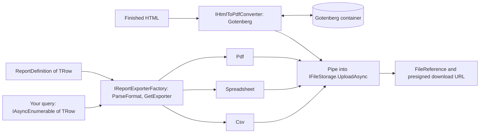

<div align="center">

# SharedKernel Reporting

**Stream any query into CSV, Excel or PDF, or render finished HTML to PDF, straight into object storage with a
download link, without ever holding the whole report in memory or storing a half-written file.**

[](https://dotnet.microsoft.com/)
[](../../../LICENSE)


[](https://github.com/sveinungf/spreadcheetah)
[](https://docs.pdfsharp.net/)
[](https://gotenberg.dev)

[What you get](#what-you-get) · [Packages](#packages) · [How it fits together](#how-it-fits-together) · [Get started](#get-started) · [See it run](#see-it-run) · [Guarantees](#guarantees)

<sub>📂 <code>src/Infrastructure/Reporting</code> · <a href="../../../docs/packages.md">all packages by tier</a> · <a href="../../../README.md">Platform.SharedKernel</a></sub>

</div>

---

## What you get

- **Streaming end to end.** Rows flow from your `IAsyncEnumerable<TRow>` through the encoder into
  `IFileStorage.UploadAsync`; CSV and Excel run in constant memory, so a million-row export costs one row's memory.
- **One definition, every format.** `ReportDefinition.For<T>().Column(…).Build()` drives RFC 4180 CSV, typed Excel
  cells and a paginated PDF table alike, formatted under the report's `Culture`.
- **User-chosen formats without a switch.** `IReportExporterFactory.ParseFormat("xlsx")` accepts a name, extension or
  content type, and `GetExporter<T>(format)` returns the exporter.
- **Delivered, never half-written.** `ExportAsync` returns a `FileReference` to persist and an optional presigned
  download link; a failure part-way aborts the upload, and `WriteCondition.IfNotExists` protects an issued document.
- **HTML to PDF in its own container.** `IHtmlToPdfConverter` renders invoices and letters through Gotenberg, keeping
  Chromium out of your process behind a resilient client and a `gotenberg` readiness probe. Every dependency is MIT
  or Apache-2.0.

## Packages

| Package | Tier | Reference it from | Use it for |
| --- | --- | --- | --- |
| [SharedKernel.Reporting.Abstractions](SharedKernel.Reporting.Abstractions/README.md) | Abstractions | Application | The contracts, `ReportDefinition`, the delivery pipeline and the bases for custom formats; no third-party dependency |
| [SharedKernel.Reporting.Csv](SharedKernel.Reporting.Csv/README.md) | Adapter | Infrastructure | RFC 4180 CSV for bulk data and machine feeds, with a CSV-injection guard |
| [SharedKernel.Reporting.Spreadsheet](SharedKernel.Reporting.Spreadsheet/README.md) | Adapter | Infrastructure | Excel `.xlsx` with typed, sortable cells and a frozen, filterable header (SpreadCheetah) |
| [SharedKernel.Reporting.Pdf](SharedKernel.Reporting.Pdf/README.md) | Adapter | Infrastructure | A printable title-plus-table PDF for statements and lists, capped by `MaxRows` (PDFsharp/MigraDoc) |
| [SharedKernel.Reporting.Gotenberg](SharedKernel.Reporting.Gotenberg/README.md) | Adapter | Infrastructure | Free-form PDFs from HTML through a Gotenberg container |
| [SharedKernel.Reporting.Testing](SharedKernel.Reporting.Testing/README.md) | Testing | test projects | In-memory exporters, factory and converter that record what they were given |

Application code references only Abstractions; add one Adapter per format you offer. Use CSV or Excel for bulk data,
since PDF is built in memory and capped.

## How it fits together



- **The pipe is the delivery.** Each exporter writes into a `System.IO.Pipelines` pipe whose reader is the storage
  upload ([Storage](../Storage/README.md)); a failure faults the pipe and nothing is stored, and an upload that stops
  early (a failed `WriteCondition`) stops the exporter at its next write instead of draining your query.
- **Tenants come from the caller.** A `ReportDestination` with `TenantId` writes into a tenant store; take the id from
  `IRequestContext`, never from input.
- **Expected failures are values.** `reporting.*` codes come back as `Result`s, and storage failures keep their
  `storage.*` codes; an exception from your row source propagates.
- **Nothing here redacts or translates.** Filter personal data in the query, translate headers before `Column(…)`,
  and HTML-encode user values before conversion.

## Get started

```xml
<PackageReference Include="SharedKernel.Reporting.Csv" />
<PackageReference Include="SharedKernel.Reporting.Spreadsheet" />
<PackageReference Include="SharedKernel.Reporting.Pdf" />
```

```csharp
builder.Services.AddSharedKernelStorage().AddS3(builder.Configuration).AddStore("reports");
builder.Services.AddSharedKernelReporting()
    .AddCsv(builder.Configuration)             // SharedKernel:Reporting:Csv
    .AddSpreadsheet(builder.Configuration)     // SharedKernel:Reporting:Spreadsheet
    .AddPdf(builder.Configuration);            // SharedKernel:Reporting:Pdf
```

```csharp
var definition = ReportDefinition.For<Order>()
    .Title("Orders")
    .Column("Order", o => o.Number)
    .Column("Placed", o => o.PlacedAt, format: "yyyy-MM-dd")
    .Column("Total", o => o.Total, format: "N2")
    .Build();

Result<ReportFormat> format = exporters.ParseFormat(requestedFormat);   // "csv", "xlsx", "pdf", ".xlsx", "text/csv"
if (format.IsFailure)
    return format.Error;                                               // reporting.unsupported_format

Result<ReportExportOutcome> export = await exporters.GetExporter<Order>(format.Value).ExportAsync(
    orders.StreamAsync(month, ct),
    definition,
    new ReportDestination { Store = "reports", Key = format.Value.WithExtension($"orders/{Guid.CreateVersion7():N}"),
                            DownloadFileName = format.Value.WithExtension("Orders"), PresignedDownloadUrlExpiry = TimeSpan.FromMinutes(15) },
    ct);
// export.Value.StoredFile → persist; export.Value.DownloadUrl → hand to the user
```

The [Abstractions Quick start](SharedKernel.Reporting.Abstractions/README.md#quick-start) covers streaming into an HTTP
response, tenant stores, custom formats and HTML to PDF (`AddGotenberg`, `BaseUrl` required).

## See it run

[DocumentsApi](../../../samples/DocumentsApi/README.md) exposes `POST /reports/{store}/listing?format=` (a CSV, Excel
or PDF listing chosen at runtime through `IReportExporterFactory`) and `POST /pdf/{store}/{**key}` (HTML to PDF
through Gotenberg, create-only), both stored in a store and answered with a download link. Its tests run against
MinIO and Gotenberg containers (Docker required):

```bash
dotnet pack Platform.SharedKernel.slnx -c Release -o ./nupkgs -p:MinVerVersionOverride=1.0.0-local.1
dotnet test samples/DocumentsApi/DocumentsApi.Tests -p:SharedKernelPackageVersion=1.0.0-local.1
```

## Guarantees

| Guarantee | How it is held |
| --- | --- |
| CSV and Excel never buffer the whole report | `ConstantMemory_AllocationsPerRowDoNotGrowWithTheRowCount` in the Csv and Spreadsheet suites |
| A failed report is never stored | `ExporterBaseTests` (`WhenTheExporterReturnsAFailure_StoresNothing`, `WhenTheExporterThrows_…_AndStoresNothing`); `HtmlConverterBaseTests` (`ConvertAsync_WhenRenderingFails_StoresNothing`) |
| An early upload stop does not drain your query | `ExportAsync_WhenTheUploadFailsEarly_StopsReadingTheRows` |
| PDF and Excel memory is bounded | `MoreRowsThanMaxRows_FailsAndStoresNothing` in the Pdf and Spreadsheet suites (`reporting.row_limit_exceeded`) |
| Spreadsheet-safe output | `CsvReportExporterTests` (formula-like text and headers escaped, negative numbers untouched); `SpreadsheetReportExporterTests` (`TextThatLooksLikeAFormula_StaysText`) |
| An issued document is never overwritten | `ExportAsync_WithIfNotExists_DoesNotOverwriteAnExistingReport` |
| A converter outage is visible, not hung | `GotenbergConverterTests`: unreachable → `reporting.converter_unavailable`, slow → timeout, transient failures retried, `gotenberg` probe reports health |
| Application code never sees a format library | `AbstractionsPurityTests`: no format-library assembly reference or public signature type |

---

<div align="center">
<sub>Part of <a href="../../../README.md">Platform.SharedKernel</a> · <a href="../../../docs/packages.md">all packages</a> · MIT license</sub>
</div>
