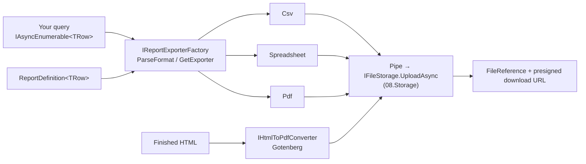

<div align="center">

# 20.Reporting

**Stream any query into CSV, Excel or PDF — or render HTML to PDF — straight into object storage, without ever
holding the whole report in memory.**

[](https://dotnet.microsoft.com/)
[](../../../LICENSE)


</div>

Statements, regulatory extracts, bulk exports and invoices all have the same shape: rows (or a finished HTML
document) in, a file in a storage bucket and a download link out. This domain does exactly that, with one
format-neutral contract, one fluent report definition and one delivery pipeline shared by every format. It does not
query databases, template HTML, translate headers or schedule jobs — the service supplies the
`IAsyncEnumerable<TRow>`, the HTML and the labels.

## What this domain gives you

- **Streaming end to end** — rows flow from your query through the encoder into `IFileStorage.UploadAsync`; CSV and
  Excel run in constant memory.
- **One definition, every format** — `ReportDefinition.For<T>().Column(…)` drives CSV, typed Excel cells and a
  paginated PDF table alike.
- **User-chosen formats without a switch** — `IReportExporterFactory.ParseFormat("xlsx")` → `GetExporter<T>(format)`.
- **Never half-written** — a failed export aborts the upload; an issued document can be protected with
  `WriteCondition.IfNotExists`.
- **HTML to PDF in its own container** — Gotenberg keeps Chromium out of your service, behind a resilient HTTP client
  and a readiness probe.
- **Only permissive licences** — every dependency is MIT or Apache-2.0.

## Packages

| Package | Tier | When you need it |
| --- | --- | --- |
| [`SharedKernel.Reporting.Abstractions`](SharedKernel.Reporting.Abstractions/README.md) | Abstractions | Always — the contracts, `ReportDefinition`, the delivery pipeline and the bases for custom formats. Application code references only this |
| [`SharedKernel.Reporting.Csv`](SharedKernel.Reporting.Csv/README.md) | Adapter | RFC 4180 CSV, constant memory, CSV-injection guard; no third-party dependency |
| [`SharedKernel.Reporting.Spreadsheet`](SharedKernel.Reporting.Spreadsheet/README.md) | Adapter | Excel `.xlsx` with typed cells, constant memory (SpreadCheetah) |
| [`SharedKernel.Reporting.Pdf`](SharedKernel.Reporting.Pdf/README.md) | Adapter | A tabular PDF (title + table) for statements and lists, capped by `MaxRows` (PDFsharp/MigraDoc) |
| [`SharedKernel.Reporting.Gotenberg`](SharedKernel.Reporting.Gotenberg/README.md) | Adapter | Free-form PDFs from HTML — invoices, letters — through a Gotenberg container |

Test doubles: [`SharedKernel.Reporting.Testing`](./SharedKernel.Reporting.Testing/README.md)
(`AddInMemoryReporting()`, `InMemoryReportExporter<T>`, `InMemoryReportExporterFactory`, `InMemoryHtmlToPdfConverter`).

## How it fits together



## Get started

```csharp
using SharedKernel.Reporting;

builder.Services.AddSharedKernelStorage().AddS3(builder.Configuration).AddStore("reports");

builder.Services.AddSharedKernelReporting()
    .AddCsv(builder.Configuration)             // SharedKernel:Reporting:Csv
    .AddSpreadsheet(builder.Configuration)     // SharedKernel:Reporting:Spreadsheet
    .AddPdf(builder.Configuration)             // SharedKernel:Reporting:Pdf
    .AddGotenberg(builder.Configuration);      // SharedKernel:Reporting:Gotenberg (BaseUrl required)

builder.Services.AddHealthChecks().AddSharedKernelReadiness();   // the "gotenberg" probe
builder.WithReportingTelemetry();
```

```csharp
var definition = ReportDefinition.For<Order>()
    .Title("Orders")
    .Column("Order", o => o.Number)
    .Column("Placed", o => o.PlacedAt, format: "yyyy-MM-dd")
    .Column("Total", o => o.Total, format: "N2")
    .Build();

Result<ReportFormat> format = exporters.ParseFormat(requestedFormat);        // "csv", "xlsx", "pdf", ".xlsx", "text/csv"
if (format.IsFailure)
    return format.Error;                                                    // reporting.unsupported_format

Result<ReportExportOutcome> export = await exporters.GetExporter<Order>(format.Value).ExportAsync(
    orders.StreamAsync(month, ct),
    definition,
    new ReportDestination
    {
        Store = "reports",
        Key = format.Value.WithExtension($"orders/{Guid.CreateVersion7():N}"),
        DownloadFileName = format.Value.WithExtension("Orders"),
        PresignedDownloadUrlExpiry = TimeSpan.FromMinutes(15),
    },
    ct);
// export.Value.StoredFile → persist; export.Value.DownloadUrl → hand to the user
```

## Sample

[`samples/DocumentsApi`](../../../samples/DocumentsApi) exposes `POST /reports/{store}/listing?format=` — a CSV, Excel or
PDF listing chosen at runtime through `IReportExporterFactory` — and an HTML-to-PDF endpoint through Gotenberg, both
stored in MinIO and returned as presigned links, with end-to-end tests against real MinIO and Gotenberg containers.

## Guarantees

| Guarantee | How |
| --- | --- |
| No whole-report buffering for CSV and Excel | Encoders write row by row into a pipe read by `IFileStorage.UploadAsync` (allocation-tested) |
| PDF memory is bounded | `PdfExportOptions.MaxRows` (default 10,000) → `reporting.row_limit_exceeded`; Excel is capped at 1,048,575 rows |
| A failed report is never stored | A writer failure faults the pipe and aborts the upload |
| An early upload stop does not drain your query | The exporter stops at its next write |
| Spreadsheet-safe output | CSV prefixes formula-like text with `'`; Excel writes text cells, never formulas |
| No row data in telemetry | Logs, spans and metrics carry format, store, counts, sizes and error codes only |
| Expected failures are values | `reporting.*` codes as `Result`s; storage failures keep `storage.*` |
| A converter outage is visible | Gotenberg's `gotenberg` readiness probe; 5xx/unreachable → `reporting.converter_unavailable` |

## Limits

- PDF export is not constant-memory — use CSV or Excel for bulk data.
- HTML-to-PDF needs a Gotenberg deployment, which must be locked down (Chromium allow-list, no egress).
- Nothing here redacts personal data: filter it in the query (`SharedKernel.DataPrivacy`).

---

For maintainers: [CLAUDE.md](CLAUDE.md) (domain rules and invariants) · [state-map.md](state-map.md) (phase history).
