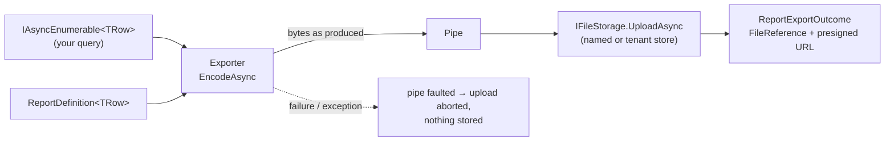

# SharedKernel.Reporting.Abstractions

[](https://dotnet.microsoft.com/)
[](https://github.com/Gresta-Vertex-Labs/platform-shared-kernel/blob/main/LICENSE)


> **Stream rows into CSV, Excel or PDF — or render HTML to PDF — and deliver the file to a named storage store with a
> presigned download link, or to any stream. The export is written while it is produced, never held as a whole in
> memory, and never stored half-written.**

| You get | So that |
| --- | --- |
| `ReportDefinition.For<T>().Column(…).Build()` | A report layout is a few typed lines, shared by every format |
| `IReportExporter<TRow>` over `IAsyncEnumerable<TRow>` | A million-row export costs the memory of one row (CSV, Excel) |
| `IReportExporterFactory.ParseFormat(userInput)` | A user-chosen `?format=` (csv, xlsx, pdf) needs no switch statement |
| Delivery to a `SharedKernel.Storage` store, with `DownloadFileName` and a presigned link | The caller gets a `FileReference` to persist and a URL to hand out |
| Pipe-based upload that aborts on failure | A report that failed half-way is never stored |
| `IHtmlToPdfConverter` + `HtmlToPdfOptions` | Invoices and letters render from HTML the service already produces |
| `ReportExporterBase<T>`, `HtmlToPdfConverterBase` | A new format or engine only encodes bytes; validation, delivery and telemetry come with the base |
| No third-party dependency | Application code can reference it without pulling in a format library |

## Contents

- [Install](#install)
- [Quick start](#quick-start)
- [How it works](#how-it-works)
- [Recipes](#recipes)
- [Reference](#reference)
- [Testing](#testing)
- [Pitfalls](#pitfalls)
- [Design decisions](#design-decisions)

## Install

```xml
<PackageReference Include="SharedKernel.Reporting.Abstractions" />
```

The version comes from your central `SharedKernelVersion` property — every SharedKernel package ships at the same
version. See [Using the packages](https://github.com/Gresta-Vertex-Labs/platform-shared-kernel#using-the-packages).

| Requirement | Value |
| --- | --- |
| Target framework | `net10.0` |
| Tier | Abstractions — reference it from your **Application** project |
| Depends on | `SharedKernel.Primitives`, `SharedKernel.Storage.Abstractions` |
| Namespaces | `SharedKernel.Reporting` |
| Providers | [Csv](https://github.com/Gresta-Vertex-Labs/platform-shared-kernel/blob/main/src/Infrastructure/Reporting/SharedKernel.Reporting.Csv/README.md) · [Spreadsheet](https://github.com/Gresta-Vertex-Labs/platform-shared-kernel/blob/main/src/Infrastructure/Reporting/SharedKernel.Reporting.Spreadsheet/README.md) · [Pdf](https://github.com/Gresta-Vertex-Labs/platform-shared-kernel/blob/main/src/Infrastructure/Reporting/SharedKernel.Reporting.Pdf/README.md) · [Gotenberg](https://github.com/Gresta-Vertex-Labs/platform-shared-kernel/blob/main/src/Infrastructure/Reporting/SharedKernel.Reporting.Gotenberg/README.md) (HTML → PDF) |

## Quick start

Register storage, then the formats you use (each provider package adds its `Add…` method):

```csharp
using SharedKernel.Reporting;

builder.Services.AddSharedKernelStorage().AddS3(builder.Configuration).AddStore("reports");

builder.Services.AddSharedKernelReporting()
    .AddCsv(builder.Configuration)            // SharedKernel.Reporting.Csv
    .AddSpreadsheet(builder.Configuration)    // SharedKernel.Reporting.Spreadsheet
    .AddPdf(builder.Configuration);           // SharedKernel.Reporting.Pdf

builder.WithReportingTelemetry();             // SharedKernel.ServiceDefaults
```

Define the report once and export it in whatever format the user asked for:

```csharp
using System.Globalization;
using SharedKernel.Execution.Context;
using SharedKernel.Primitives.Results;
using SharedKernel.Reporting;

public sealed class ExportOrdersHandler(IReportExporterFactory exporters, IOrderQueries orders, IRequestContext caller)
{
    private static readonly ReportDefinition<Order> Definition = ReportDefinition.For<Order>()
        .Title("Orders")
        .Culture(CultureInfo.GetCultureInfo("tr-TR"))           // number and date formatting, not translation
        .Column("Order", o => o.Number)
        .Column("Placed", o => o.PlacedAt, format: "yyyy-MM-dd")
        .Column("Customer", o => o.CustomerName, relativeWidth: 3)
        .Column("Total", o => o.Total, format: "N2")            // numbers right-align automatically
        .Build();

    public async Task<Result<ReportExportOutcome>> Handle(ExportOrders command, CancellationToken ct)
    {
        Result<ReportFormat> format = exporters.ParseFormat(command.Format);   // "xlsx", ".csv", "application/pdf"
        if (format.IsFailure)
            return format.Error;                                               // reporting.unsupported_format

        return await exporters.GetExporter<Order>(format.Value).ExportAsync(
            orders.StreamAsync(command.Month, ct),                             // IAsyncEnumerable<Order>
            Definition,
            new ReportDestination
            {
                Store = "reports",
                Key = format.Value.WithExtension($"orders/{Guid.CreateVersion7():N}"),
                DownloadFileName = format.Value.WithExtension("Orders September"),
                PresignedDownloadUrlExpiry = TimeSpan.FromMinutes(15),
            },
            ct);
    }
}
```

`ReportExportOutcome` carries `StoredFile` (persist this `FileReference`), `DownloadUrl` (a `PresignedRequest`, when
requested), `Format`, `RowCount` and `SizeBytes`.

## How it works



- **Streaming.** The exporter writes into a `System.IO.Pipelines` pipe whose reader is `IFileStorage.UploadAsync`, so
  bytes reach storage while they are produced. CSV and Excel encode in constant memory; PDF is built in memory and
  capped by its `MaxRows`.
- **Never half-written.** A failure part-way (a row limit, a thrown exception) faults the pipe and the upload is
  aborted. If the store stops the upload early (a failed `WriteCondition`), the exporter stops at its next write
  instead of reading the rest of the rows.
- **Formatting is culture, not translation.** A column's `format` is a .NET format string applied under the report's
  `Culture`. `null` is an empty cell. Headers are whatever strings you pass — translate them first.
- **One registration per format** serves every row type (an open generic), so `ICsvReportExporter<Order>` and
  `ICsvReportExporter<Invoice>` need nothing more.
- **Content disposition.** `DownloadFileName` is stored as an RFC 6266 `Content-Disposition: attachment` with a UTF-8
  `filename*`, so presigned links download under that name, non-ASCII included.
- **Nothing sensitive in telemetry.** Logs, spans and metrics carry format, operation, store, row count, size and
  error code — never row values, object keys or file names. This package redacts nothing: filter personal data in
  the query that produces the rows.
- **Expected failures are `Result`s**; an exception from the row source, a value function or a formatter propagates.
  A missing storage registration or an unknown store throws `InvalidOperationException` (a configuration error).

## Recipes

### 1. Stream an export into the HTTP response

```csharp
Result<ReportStreamOutcome> written = await exporter.ExportToStreamAsync(rows, Definition, httpContext.Response.Body, ct);
```

Storage is optional for this path: without it `ExportToStreamAsync` still works, and `ExportAsync` throws an
explaining `InvalidOperationException`.

### 2. Store a statement once, in a tenant store

```csharp
new ReportDestination
{
    Store = "statements",                       // registered with AddTenantStore("statements")
    TenantId = caller.TenantId,                 // from IRequestContext, never from input
    Key = "2026-09.pdf",
    Condition = WriteCondition.IfNotExists,     // an issued statement is never overwritten
};
```

### 3. Render an invoice from HTML

```csharp
Result<PdfDocumentOutcome> stored = await converter.ConvertAsync(       // IHtmlToPdfConverter
    html,                                                               // HTML-encode every user value first
    new ReportDestination { Store = "invoices", Key = "2026-0042.pdf", Condition = WriteCondition.IfNotExists },
    new HtmlToPdfOptions { PageSize = PdfPageSize.A4, FooterHtml = HtmlToPdfOptions.PageNumberFooter },
    ct);
```

`HtmlToPdfOptions`: `PageSize` (`A3`, `A4`, `A5`, `Letter`, `Legal`, or `new PdfPageSize(widthMm, heightMm)`),
`Landscape`, `Margins` (`PdfMargins`, mm), `PrintBackground`, `Scale`, `PreferCssPageSize`, `HeaderHtml`/`FooterHtml`
(placeholders `pageNumber`, `totalPages`, `date`, `title`) and `Assets` (`HtmlAsset(fileName, bytes)`, referenced by
file name). The implementation is [`SharedKernel.Reporting.Gotenberg`](https://github.com/Gresta-Vertex-Labs/platform-shared-kernel/blob/main/src/Infrastructure/Reporting/SharedKernel.Reporting.Gotenberg/README.md).

### 4. Add a custom format

```csharp
internal sealed class JsonLinesExporter<TRow>(ReportingDependencies dependencies) : ReportExporterBase<TRow>(dependencies)
{
    public static readonly ReportFormat JsonLines = new("jsonl", "application/x-ndjson", ".jsonl");

    public override ReportFormat Format => JsonLines;

    protected override async Task<Result<long>> EncodeAsync(
        IAsyncEnumerable<TRow> rows, ReportDefinition<TRow> definition, Stream destination, CancellationToken ct)
    {
        long count = 0;
        await foreach (TRow row in rows.WithCancellation(ct))
        {
            // write one JSON object per line (destination is write-only and not seekable; never dispose it)
            count++;
        }
        return count;                            // or a failure such as ReportingErrors.RowLimitExceeded(...)
    }
}

builder.Services.AddSharedKernelReporting()
    .AddExporter(JsonLinesExporter<object>.JsonLines, typeof(JsonLinesExporter<>));
```

`HtmlToPdfConverterBase` (`RenderAsync`) plus `AddHtmlToPdfConverter<T>()` does the same for another HTML engine.

## Reference

### Registration

| Method | Registers |
| --- | --- |
| `AddSharedKernelReporting()` | `IReportExporterFactory`; returns `IReportingBuilder` |
| `AddExporter(ReportFormat, Type openGenericExporter)` | An exporter for every row type, keyed by the format name (`[FromKeyedServices("xlsx")] IReportExporter<T>`) |
| `AddHtmlToPdfConverter<TConverter>()` | The `IHtmlToPdfConverter` |

### Main types

| Type | Purpose |
| --- | --- |
| `ReportDefinition.For<T>()` → `ReportDefinitionBuilder<T>` | `Title`, `Culture`, `Column(header, value, format:, alignment:, relativeWidth:)`, `Column(header, value, formatter)`, `Build()` |
| `ReportColumnAlignment` | `Auto` (numbers right), `Left`, `Center`, `Right` — PDF and Excel; CSV ignores it |
| `IReportExporter<TRow>` | `ExportAsync` (to a `ReportDestination`) → `ReportExportOutcome`; `ExportToStreamAsync` → `ReportStreamOutcome` |
| `IReportExporterFactory` | `Formats`, `ParseFormat(name, extension or content type)` → `Result<ReportFormat>`, `GetExporter<T>(format)` |
| `ReportFormat` | `Csv`, `Xlsx`, `Pdf`, or your own; `WithExtension(fileName)` |
| `ReportDestination` | `Store`, `Key` (required), `TenantId`, `DownloadFileName`, `Condition`, `Metadata`, `PresignedDownloadUrlExpiry` |
| `IHtmlToPdfConverter` | `ConvertAsync` → `PdfDocumentOutcome`; `ConvertToStreamAsync` |
| `ReportValueFormatting` | The formatting rules the built-in formats use, for custom exporters |

### Errors

`ReportingErrorCodes` / `ReportingErrors`; storage failures keep their `storage.*` codes.

| Code | Type | When |
| --- | --- | --- |
| `reporting.invalid_definition` | Validation | No columns, a column without header or value, or a bad width |
| `reporting.invalid_destination` | Validation | Missing store or key, `default(TenantId)`, bad file name or expiry |
| `reporting.unsupported_format` | Validation | `ParseFormat` matched no registered format |
| `reporting.row_limit_exceeded` | Validation | More rows than the format's `MaxRows`; nothing is stored |
| `reporting.invalid_request` | Validation | Empty HTML or invalid conversion options |
| `reporting.conversion_failed` | Validation | The converter refused the document |
| `reporting.converter_unavailable` | Unavailable | The converter could not be reached or failed |
| `reporting.conversion_timeout` | Timeout | The conversion took too long |

### Logging

Category `SharedKernel.Reporting`.

| Event id | Level | Event |
| --- | --- | --- |
| 20000 | Debug | Report `{Operation}` started |
| 20001 | Information | Report completed: rows, bytes, duration |
| 20002 | Warning | Report failed with `{ErrorCode}` |
| 20003 | Error | Report threw |
| 20004 | Debug | Report cancelled |
| 20005 | Warning | Stored, but the download link could not be created |
| 20006 | Information | PDF conversion completed |

### Telemetry

`ActivitySource` and `Meter` named `SharedKernel.Reporting`; subscribe with ServiceDefaults'
`WithReportingTelemetry()`. Spans `reporting export` and `reporting convert` (tags `reporting.format`,
`reporting.operation`, `reporting.store`, `reporting.row_count`, `reporting.size_bytes`, and `error.type` on failure);
instruments `reporting.operation.duration` (s), `reporting.rows`, `reporting.bytes`.

## Testing

Reference [`SharedKernel.Reporting.Testing`](https://github.com/Gresta-Vertex-Labs/platform-shared-kernel/blob/main/src/Testing/SharedKernel.Reporting.Testing/README.md)
and call `services.AddInMemoryReporting()`: it replaces `IReportExporterFactory` with `InMemoryReportExporterFactory`
and `IHtmlToPdfConverter` with `InMemoryHtmlToPdfConverter`. `factory.Exporter<T>(ReportFormat.Csv)` returns the
`InMemoryReportExporter<T>`, which records `LastRows`, `LastDefinition`, `LastDestination` and `ExportCount`, asserts
with `ShouldHaveExported(rows => …)`, and fails on demand (`SimulateFailure`, `SimulatedError`). The converter records
`Conversions` and writes a placeholder PDF.

## Pitfalls

| Don't | Do | Why |
| --- | --- | --- |
| Materialize rows into a `List<T>` first | Pass the query's `IAsyncEnumerable<T>` (`StreamAsync`, `ListKeysetAsync`); `ToAsyncEnumerable()` if you already hold a list | Streaming is the whole point; there is no list overload on purpose |
| Take `TenantId` from the request body | Take it from `IRequestContext` | The tenant store must be the caller's |
| Overwrite issued documents | `Condition = WriteCondition.IfNotExists` | A statement or invoice must not change after issue |
| Put raw user input into HTML | HTML-encode it | The HTML runs in a browser |
| Export personal data unfiltered | Redact in the query (`SharedKernel.DataPrivacy`) | An export is a durable, shareable copy |
| Rely on translated headers | Translate headers before `Column(…)` | The definition formats values; it does not translate |
| Export tens of thousands of rows as PDF | CSV or Excel for bulk data | PDF is built in memory and capped by `MaxRows` |

## Design decisions

**Why only `IAsyncEnumerable<TRow>`?** Once a list overload exists every caller uses it, and memory grows with the
report. A caller holding a list converts it in one call.

**Why deliver through a pipe instead of a temporary file?** Bytes go straight to object storage without local disk,
and a failure aborts the upload, so no partial object is ever visible.

**Why no templating?** The converter takes finished HTML; each service renders it with whatever it already uses.

**Declined libraries.** EPPlus (non-commercial licence), QuestPDF (revenue-gated), iText7 (AGPL), wkhtmltopdf
(unmaintained WebKit) and commercial engines are not used; providers ship only MIT/Apache dependencies.

---

Part of [Platform.SharedKernel](https://github.com/Gresta-Vertex-Labs/platform-shared-kernel) ·
[Reporting domain](https://github.com/Gresta-Vertex-Labs/platform-shared-kernel/blob/main/src/Infrastructure/Reporting/README.md) ·
[MIT license](https://github.com/Gresta-Vertex-Labs/platform-shared-kernel/blob/main/LICENSE)
