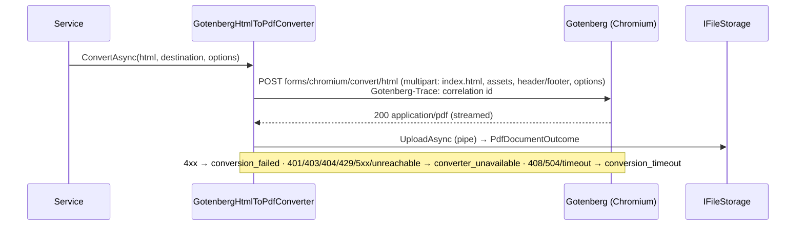

# SharedKernel.Reporting.Gotenberg

[](https://dotnet.microsoft.com/)
[](https://github.com/Gresta-Vertex-Labs/platform-shared-kernel/blob/main/LICENSE)


> **HTML-to-PDF for `SharedKernel.Reporting`, rendered by [Gotenberg](https://gotenberg.dev) — a stateless container
> running headless Chromium. Send a finished HTML string; get a PDF streamed into object storage (with a presigned
> link) or any stream, with Chromium kept out of your service's process.**

| You get | So that |
| --- | --- |
| `AddGotenberg(configuration)` implementing `IHtmlToPdfConverter` | Application code depends only on the contract in `Reporting.Abstractions` |
| Streaming from Gotenberg to the destination | A PDF is never held whole in memory; a failed conversion is never stored |
| Standard HTTP resilience (timeout, retries, circuit breaker) | A slow or restarting converter does not hang or cascade |
| HTTP status → `Result` mapping | Callers branch on `reporting.conversion_failed` / `converter_unavailable` / `conversion_timeout` |
| The `gotenberg` readiness probe | Traffic stops when the converter is down |
| Correlation id sent as `Gotenberg-Trace` | A conversion can be found in Gotenberg's logs |

## Contents

- [Install](#install)
- [Quick start](#quick-start)
- [How it works](#how-it-works)
- [Recipes](#recipes)
- [Configuration](#configuration)
- [Reference](#reference)
- [Testing](#testing)
- [Pitfalls](#pitfalls)
- [Design decisions](#design-decisions)

## Install

```xml
<PackageReference Include="SharedKernel.Reporting.Gotenberg" />
```

The version comes from your central `SharedKernelVersion` property — every SharedKernel package ships at the same
version. See [Using the packages](https://github.com/Gresta-Vertex-Labs/platform-shared-kernel#using-the-packages).

| Requirement | Value |
| --- | --- |
| Target framework | `net10.0` |
| Tier | Adapter — reference it from your **Infrastructure** (or Api) project |
| Depends on | `SharedKernel.Reporting.Abstractions`, `SharedKernel.Configuration`, `SharedKernel.Execution`, `Microsoft.Extensions.Http.Resilience` — no vendor SDK |
| Namespaces | `SharedKernel.Reporting` (`AddGotenberg`), `SharedKernel.Reporting.Gotenberg` (`GotenbergOptions`) |
| Runtime | A Gotenberg 8 container (`gotenberg/gotenberg:8`, port 3000) |

## Quick start

```csharp
using SharedKernel.Reporting;

builder.Services.AddSharedKernelStorage().AddS3(builder.Configuration).AddStore("invoices");
builder.Services.AddSharedKernelReporting().AddGotenberg(builder.Configuration);   // SharedKernel:Reporting:Gotenberg
builder.Services.AddHealthChecks().AddSharedKernelReadiness();                     // includes the "gotenberg" probe
builder.WithReportingTelemetry();
```

```json
{
  "SharedKernel": {
    "Reporting": {
      "Gotenberg": { "BaseUrl": "http://gotenberg:3000" }
    }
  }
}
```

```csharp
using SharedKernel.Reporting;
using SharedKernel.Storage;

Result<PdfDocumentOutcome> stored = await converter.ConvertAsync(      // IHtmlToPdfConverter
    html,                                                              // a complete document; <title> sets the PDF title
    new ReportDestination
    {
        Store = "invoices",
        TenantId = requestContext.TenantId,
        Key = $"{invoice.Number}.pdf",
        DownloadFileName = $"Invoice {invoice.Number}.pdf",
        Condition = WriteCondition.IfNotExists,                        // an issued invoice is never overwritten
        PresignedDownloadUrlExpiry = TimeSpan.FromMinutes(15),
    },
    new HtmlToPdfOptions
    {
        PageSize = PdfPageSize.A4,
        Margins = new PdfMargins(Top: 15, Right: 12, Bottom: 18, Left: 12),
        FooterHtml = HtmlToPdfOptions.PageNumberFooter,                // "3 / 12"
        Assets = [new HtmlAsset("logo.png", logoBytes)],               // 
    },
    ct);
```

## How it works



- **Request.** The HTML is sent as `index.html` to Gotenberg's Chromium route, with every `HtmlAsset` alongside it and
  the header/footer HTML as their own files. Page size, margins, scale and flags are written as form values in the
  invariant culture.
- **Streaming.** The PDF streams from Gotenberg into the storage upload pipe (or your stream). A failure faults the
  pipe, so nothing half-written is stored.
- **Resilience.** One named `HttpClient` with the standard resilience handler: the attempt timeout is `Timeout`;
  `MaxRetryAttempts` retries with exponential backoff from 1 s on 5xx, timeouts and dropped connections (a conversion
  has no side effects); the total timeout covers every attempt plus backoff; the circuit breaker samples at least two
  attempts' worth of time. `HttpClient.Timeout` is infinite so the pipeline owns every timeout.
- **Authentication.** With `Username`/`Password`, every request carries HTTP Basic credentials.

## Recipes

### 1. Stream a PDF into the HTTP response

```csharp
Result<ReportStreamOutcome> written = await converter.ConvertToStreamAsync(html, httpContext.Response.Body, options, ct);
```

### 2. Deploy and lock down Gotenberg

Run it as its own Deployment and Service (`gotenberg/gotenberg:8`, port 3000), scaled on CPU. **The HTML runs in a
browser, so treat it as code:**

- HTML-encode every value that came from a user before it goes into the markup.
- Stop the converter reaching anything but its own files: start Gotenberg with
  `--chromium-allow-list=^file:///tmp/.*` (assets and header/footer are served from there), and give its pods a
  NetworkPolicy that denies egress. Otherwise a document can make Chromium fetch internal addresses (SSRF).
- Keep Gotenberg internal to the cluster, or start it with `--api-enable-basic-auth` and set `Username`/`Password`
  from a secret store.
- Keep `Timeout` close to Gotenberg's own `--api-timeout` (30 s by default).

## Configuration

Section `SharedKernel:Reporting:Gotenberg`, validated when the host starts.

| Key | Type | Default | Meaning |
| --- | --- | --- | --- |
| `SharedKernel:Reporting:Gotenberg:BaseUrl` | `Uri` | — (required) | Absolute `http`/`https` address of Gotenberg |
| `SharedKernel:Reporting:Gotenberg:Timeout` | `TimeSpan` | `00:01:00` | Per-attempt timeout; positive, at most 30 minutes |
| `SharedKernel:Reporting:Gotenberg:MaxRetryAttempts` | `int` | `2` | Retries after the first attempt, 0–5 |
| `SharedKernel:Reporting:Gotenberg:Username` | `string?` | — | Basic-auth user; set together with `Password` |
| `SharedKernel:Reporting:Gotenberg:Password` | `string?` | — | Basic-auth password; set together with `Username` |

## Reference

### Registration

| Method | Registers |
| --- | --- |
| `IReportingBuilder.AddGotenberg(IConfiguration)` | `GotenbergOptions` (validated); a named `HttpClient` with the standard resilience handler; `IHtmlToPdfConverter` (singleton); the `gotenberg` readiness probe |

### Errors

| Code | Type | When |
| --- | --- | --- |
| `reporting.invalid_request` | Validation | Empty HTML or invalid options |
| `reporting.conversion_failed` | Validation | Gotenberg rejected the document (other 4xx) |
| `reporting.converter_unavailable` | Unavailable | Unreachable, 5xx, 429, 401/403 (credentials) or 404 (wrong `BaseUrl`) |
| `reporting.conversion_timeout` | Timeout | 408, 504, or the attempt timed out |

Storage failures keep their `storage.*` codes.

### Logging

No events of its own (EventId block 20400–20499 is reserved); the base class logs the conversion (EventIds 20000–20006,
including 20006 "PDF conversion completed").

### Health

Registers the `gotenberg` readiness probe: `GET {BaseUrl}/health` through the same client; any non-success status or
connection failure is unhealthy. `AddSharedKernelReadiness()` exposes it on `/health/ready`.

## Testing

Reference [`SharedKernel.Reporting.Testing`](https://github.com/Gresta-Vertex-Labs/platform-shared-kernel/blob/main/src/Testing/SharedKernel.Reporting.Testing/README.md)
and call `services.AddInMemoryReporting()`: `InMemoryHtmlToPdfConverter` replaces the converter, records every
document (`Conversions`, `LastConversion` with the HTML, options and destination), writes `PlaceholderPdf`, and fails on
demand (`SimulateFailure`, `SimulatedError`). For the real rendering, run `gotenberg/gotenberg:8` in a container.

## Pitfalls

| Don't | Do | Why |
| --- | --- | --- |
| Interpolate user input into HTML raw | HTML-encode it | The markup runs in Chromium |
| Let Gotenberg reach the network | `--chromium-allow-list=^file:///tmp/.*` plus a deny-egress NetworkPolicy | A document could fetch internal URLs (SSRF) |
| Reference remote images or fonts | Pass them as `Assets` and refer to them by file name | Remote fetches are blocked once locked down, and slow otherwise |
| Set `Timeout` far above Gotenberg's `--api-timeout` | Keep them aligned | Gotenberg gives up first and the client waits for nothing |
| Set only `Username` or only `Password` | Set both, or neither | The host fails to start |
| Run Chromium in your service instead | Keep the converter in its own pod | Isolates a ~300 MB browser and its attack surface |

## Design decisions

**Why Gotenberg?** It is MIT-licensed, stateless and keeps Chromium in its own container. wkhtmltopdf is unmaintained,
iText7's HTML module is AGPL, and in-process Puppeteer/Playwright would put a browser in every service (it could still
be added as another `IHtmlToPdfConverter`).

**Why no templating?** The converter takes finished HTML; each service renders it with whatever it already uses.

---

Part of [Platform.SharedKernel](https://github.com/Gresta-Vertex-Labs/platform-shared-kernel) ·
[Reporting domain](https://github.com/Gresta-Vertex-Labs/platform-shared-kernel/blob/main/src/Infrastructure/Reporting/README.md) ·
[MIT license](https://github.com/Gresta-Vertex-Labs/platform-shared-kernel/blob/main/LICENSE)
