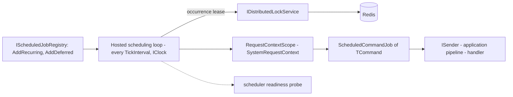

<div align="center">

# SharedKernel Scheduling

**Cron and one-shot jobs that send an ordinary command through the application pipeline, run once per occurrence
however many replicas you deploy, and never guess what to do after downtime.**

[](https://dotnet.microsoft.com/)
[](../../../LICENSE)


[](https://www.quartz-scheduler.net/)

[What you get](#what-you-get) · [Packages](#packages) · [How it fits together](#how-it-fits-together) · [Get started](#get-started) · [See it run](#see-it-run) · [Guarantees](#guarantees)

<sub>📂 <code>src/Infrastructure/Scheduling</code> · <a href="../../../docs/packages.md">all packages by tier</a> · <a href="../../../README.md">Platform.SharedKernel</a></sub>

</div>

---

## What you get

- **Jobs as commands.** `AddRecurring<TCommand>` and `AddDeferred<TCommand>` take a factory that builds an ordinary
  `ICommand`; the handler is plain application code with the same validation, transactions and auditing as an HTTP
  request.
- **Once per occurrence across replicas.** Each occurrence is claimed with a self-expiring lease from
  `IDistributedLockService`, keyed by job name and fire time; no job database, no Quartz scheduler, no Hangfire.
- **An outage never means duplicates.** When the lock store is unreachable no replica can prove ownership, so none
  runs the occurrence; without any lock service the host still starts and logs a Warning.
- **Explicit behaviour after downtime and slow runs.** `MisfirePolicy` (`Skip`, `FireOnce`,
  `RunImmediatelyThenReschedule`) and `OverlapPolicy` (`Skip`, `Queue`, `Allow`) are mandatory on every job.
- **A real, attributable caller.** Each run executes inside a `SystemRequestContext` scope with the job's name, its
  tenant, a new correlation id and no permissions; a zero-I/O `scheduler` readiness probe and `SharedKernel.Scheduling`
  traces and counters make the loop observable.

## Packages

| Package | Tier | Reference it from | Use it for |
| --- | --- | --- | --- |
| [SharedKernel.Scheduling](SharedKernel.Scheduling/README.md) | Adapter | Infrastructure | Recurring or delayed single units of work: nightly reconciliation, cleanup, digests, a trigger that starts a workflow |
| [SharedKernel.Scheduling.Testing](SharedKernel.Scheduling.Testing/README.md) | Testing | test projects | `InMemoryScheduledJobRegistry`: records registrations; the test fires each tick with `TriggerAsync` |

Take it for one unit of work on a time trigger. Several steps, signals or crash-resumable progress belong in
[Workflows](../Workflows/README.md), which a job here may start; a delayed message is `IMessageScheduler` in
[Messaging](../Messaging/README.md).

## How it fits together



- **The lease is never released or extended.** It is keyed by job name and scheduled fire time, so a slightly late
  replica cannot run the same occurrence again; its fencing token reaches the command factory.
- **Contention is not an outage.** A `null` lease means another replica owns the occurrence; an unreachable store
  means nobody runs it (Error, EventId 19016) and the loop keeps going.
- **Each run commits once.** A fresh DI scope per run makes the command outermost, so `TransactionBehavior` commits
  once; a failed `Result` is logged as a failed fire, never thrown.
- **State is in memory.** Cron is Quartz syntax evaluated in UTC; jobs are registered at startup and nothing is
  persisted, so a deferred job survives a restart only if it is registered again.

## Get started

```xml
<PackageReference Include="SharedKernel.Scheduling" />
<PackageReference Include="SharedKernel.Caching.Redis.DistributedLocking" />
```

```csharp
builder.Services.AddRedisConnection(builder.Configuration);   // SharedKernel:Caching:Redis
builder.Services.AddRedisDistributedLocking();                // cross-replica single execution

builder.Services.AddSharedKernelScheduling()                  // SharedKernel:Scheduling
    .AddRecurring<RunNightlyReconciliation>(
        jobName: "nightly-reconciliation",
        cronExpression: "0 0 2 * * ?",                        // 02:00 UTC daily, Quartz syntax, seconds first
        commandFactory: ctx => new RunNightlyReconciliation(ctx.ScheduledFireTimeUtc),
        configure: o =>
        {
            o.MisfirePolicy = MisfirePolicy.FireOnce;
            o.OverlapPolicy = OverlapPolicy.Skip;
        });

builder.Services.AddHealthChecks().AddSharedKernelReadiness();  // exposes the "scheduler" probe

public sealed record RunNightlyReconciliation(DateTimeOffset BusinessDate) : ICommand;
```

The host also needs a mediator adapter (`app.UseMediatR()`) and an `IClock`. The
[Quick start](SharedKernel.Scheduling/README.md#quick-start) covers the configuration keys, per-tenant jobs,
permission-guarded commands and one-shot jobs.

## See it run

- [Shop](../../../samples/Shop/README.md) — the Inventory service runs a reconciliation job on two replicas over
  Redis locking, and its end-to-end flow proves the job runs once per occurrence across them;
  `Shop.Inventory.Tests` asserts the job schedule over `SharedKernel.Scheduling.Testing`.

  ```bash
  samples/Shop/build.sh                      # pack the kernel, build the Shop  (build.ps1 on Windows)
  dotnet run --project samples/Shop/Shop.AppHost --launch-profile http
  ```

- [`consumer-verify`](consumer-verify/Program.cs) — a one-shot job firing end to end through the real MediatR
  pipeline, the single-replica Warning, and fail-fast registration when a policy is unset
  (`dotnet run --project src/Infrastructure/Scheduling/consumer-verify`).

## Guarantees

| Guarantee | How it is held |
| --- | --- |
| One run per occurrence across replicas | `MultiReplicaSingleExecutionTests` (`TwoReplicas_SameJob_FiresExactlyOncePerTick_NeverTwice`); `OccurrenceLeaseTests` (the lease is never released) |
| A lock-store outage never causes duplicates | `LockStoreUnavailable_JobNotExecuted_LogsError_AndSchedulerKeepsRunning` |
| Running without a lock is never silent | `NoDistributedLockServiceRegistered_LogsSingleReplicaStartupWarning` (EventId 19002) |
| No job without explicit policies | `ScheduledJobRegistryTests`: an unset `MisfirePolicy` or `OverlapPolicy` throws at registration |
| Misfire and overlap behave exactly as named | `MisfirePolicyTests` and `OverlapPolicyTests`, one test per policy value |
| Cron is correct across DST and edge syntax | `CronExpressionCorrectnessTests`: spring-forward gap, fall-back hour, `W`, `#` and `L` specifiers |
| A failed command is reported, never swallowed | `ScheduledCommandJobTests` (`SenderReturnsFailure_SurfacesFailureResult_DoesNotSwallow`, dispatched exactly once) |

---

<div align="center">
<sub>Part of <a href="../../../README.md">Platform.SharedKernel</a> · <a href="../../../docs/packages.md">all packages</a> · MIT license</sub>
</div>
