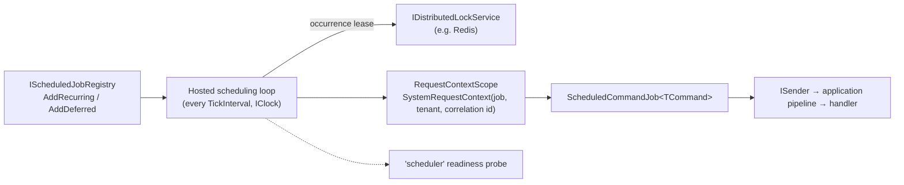

<div align="center">

# 19.Scheduling

**Cron and one-shot jobs that run once per occurrence — however many replicas you deploy.**

[](https://dotnet.microsoft.com/)
[](../../../LICENSE)


</div>

`SharedKernel.Scheduling` fires time-triggered work in a SharedKernel service. A job is a kernel command sent through
`ISender`, so it gets the same validation, transactions and auditing as an HTTP request. Replicas agree on who runs
each occurrence through a self-expiring lease from `IDistributedLockService` — no job database, no Quartz scheduler,
no Hangfire.

## What this domain gives you

- **Jobs as commands** — `AddRecurring<TCommand>` and `AddDeferred<TCommand>` take a factory that builds an ordinary
  `ICommand`; the handler is plain application code.
- **Once per occurrence across replicas** — a lease keyed by job name and fire time; an unreachable lock store means
  nobody runs it, never everybody.
- **Explicit behaviour after downtime and slow runs** — `MisfirePolicy` and `OverlapPolicy` are mandatory on every job.
- **A real caller** — each run executes inside a `SystemRequestContext` scope with the job's tenant and a new
  correlation id, so logs, persistence and outbound calls can be traced back to the job.
- **Operable** — a zero-I/O `scheduler` readiness probe, traces and counters under `SharedKernel.Scheduling`, and
  EventIds 19000–19016.

## Packages

| Package | Tier | When you need it |
| --- | --- | --- |
| [`SharedKernel.Scheduling`](SharedKernel.Scheduling/README.md) | Adapter | Any recurring or delayed single unit of work: nightly reconciliation, cleanup, digests, a trigger that starts a workflow |

Test double: [`SharedKernel.Scheduling.Testing`](../../Testing/SharedKernel.Scheduling.Testing/README.md)
(`InMemoryScheduledJobRegistry` with `TriggerAsync`).

## Scheduling or workflows?

| Use `19.Scheduling` when… | Use [`17.Workflows`](../Workflows/README.md) when… |
| --- | --- |
| A **single unit of work** fires on a time trigger | The process has **multiple steps** |
| "Did it run exactly once across replicas?" is the only durability question | It must survive a crash mid-step, or waits for signals |
| Cron or one-shot, registered at startup | Durable timers, replay-safe, deterministic execution |

They compose: a recurring job here may *start* a Temporal workflow, and `17.Workflows` owns everything after that.

## How it fits together



## Get started

```csharp
using SharedKernel.Caching.Redis.Core.Extensions;
using SharedKernel.Caching.Redis.DistributedLocking.Extensions;
using SharedKernel.Primitives.Clocks;
using SharedKernel.Scheduling.Extensions;
using SharedKernel.Scheduling.Policies;

builder.Services.AddClock();
builder.Services.AddSharedKernelApplication(typeof(PurgeExpiredCarts).Assembly, app => app.UseMediatR());

builder.Services.AddRedisConnection(builder.Configuration);   // SharedKernel:Caching:Redis
builder.Services.AddRedisDistributedLocking();

builder.Services.AddSharedKernelScheduling()
    .AddRecurring<PurgeExpiredCarts>(
        jobName: "purge-expired-carts",
        cronExpression: "0 */15 * * * ?",                     // every 15 minutes, UTC, Quartz syntax
        commandFactory: ctx => new PurgeExpiredCarts(ctx.ScheduledFireTimeUtc),
        configure: o =>
        {
            o.MisfirePolicy = MisfirePolicy.Skip;
            o.OverlapPolicy = OverlapPolicy.Skip;
        });

builder.Services.AddHealthChecks().AddSharedKernelReadiness();
builder.WithSchedulingTelemetry();
```

```csharp
public sealed record PurgeExpiredCarts(DateTimeOffset Now) : ICommand;
```

Without `AddRedisDistributedLocking()` (or another `IDistributedLockService`) the service still starts, logs a
Warning, and every replica runs every occurrence — fine for one instance, wrong for more.

## Guarantees

| Guarantee | How |
| --- | --- |
| One run per occurrence across replicas | A lease on `scheduling:occurrence:{job}:{fire time}`, never released or extended |
| A lock-store outage never causes duplicates | No replica can prove ownership, so none runs it (Error, EventId 19016) |
| Running without a lock is never silent | Startup Warning, EventId 19002 |
| No surprise catch-up after downtime | `MisfirePolicy` is mandatory: `Skip`, `FireOnce` or `RunImmediatelyThenReschedule` |
| No surprise concurrency | `OverlapPolicy` is mandatory: `Skip`, `Queue` or `Allow` |
| Cron is correct across DST and edge syntax | Quartz's `CronExpression`, evaluated in UTC |
| Each run commits once | A fresh DI scope per run makes the command outermost for `TransactionBehavior` |
| Each run is attributable | `ActorKind.System`, the job name as identity, a new correlation id, no permissions |

## Limits

- No persistent job store: jobs are registered at startup, and a deferred job survives a restart only if it is
  registered again.
- Cron is UTC only; there is no per-job time zone.
- The scheduler never fans out per tenant — a per-tenant job is one registration whose handler iterates tenants.

---

For maintainers: [CLAUDE.md](CLAUDE.md) (domain rules and invariants) · [state-map.md](state-map.md) (phase history).
